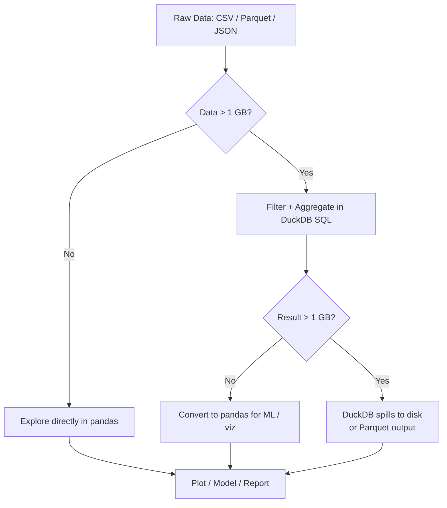

# 🐍 DuckDB with Python — DataFrames, Parquet and SQL Integration

## 🎯 Learning Objectives
- Use the DuckDB Python API to query DataFrames, files, and registered tables
- Convert between DuckDB relations and pandas/Polars DataFrames with zero-copy Arrow interop
- Query multiple CSV/Parquet files with glob patterns and S3 paths
- Apply the 80/20 rule: SQL for heavy lifting, pandas for bespoke transformations
- Profile DuckDB queries and understand when Arrow zero-copy works vs when it triggers a copy
- Design data workflows that flow smoothly across DuckDB, pandas, and Polars

## Introduction

**Core thesis.** DuckDB does not compete with pandas — it *complements* it. pandas excels at interactive data exploration, custom Python transformations, and integration with the visualization/ML stack (matplotlib, scikit-learn, PyTorch). DuckDB excels at the heavy-lifting operations that make pandas sweat: multi-gigabyte aggregations, large joins, window functions, and multi-file queries. The integration between them is seamless because **both speak Apache Arrow natively**. A DuckDB query result converts to a pandas DataFrame with a pointer swap over the Arrow C Data Interface, not a row-by-row serialization loop. When the data exceeds 1 GB, you filter and aggregate in DuckDB and load only the small, cleaned result set into pandas. This is the workflow that every data team should adopt by default.

**The Arrow Highway.** Apache Arrow ([[14/03 - Rust Polars Internals]]) defines a language-agnostic columnar memory format that DuckDB, pandas, Polars, NumPy, and PyTorch all support. When DuckDB finishes executing a query, it holds the result as an Arrow `Table`. pandas' `pyarrow` backend can wrap that same memory buffer without copying. Polars is built entirely on Arrow — its DataFrames *are* Arrow Tables. This means data can flow `DuckDB → pandas → Polars → PyTorch` without a single byte being copied, provided the pipeline stays within the Arrow format and avoids Python-object-heavy operations like `apply()`.

This note covers the Python API surface, the integration patterns with pandas and Polars, multi-file and cloud-storage querying, the SQL vs DataFrame API tradeoff, and the profiling tools that let you verify whether zero-copy is actually happening.

---

## 1. The Python API — `duckdb.sql()` and DuckDBPyRelation

### The Basic Workflow

```python
import duckdb

# Connect to a file (persistent) or :memory: (transient)
conn = duckdb.connect('analytics.duckdb')  # Creates analytics.duckdb file

# Run SQL: returns a DuckDBPyRelation (lazy, not yet materialized)
rel = conn.sql("SELECT * FROM 'data/2024/*.parquet' WHERE amount > 100")

# DuckDBPyRelation is lazy — data is NOT pulled until you materialize it:
df      = rel.df()       # → pandas DataFrame (via Arrow, zero-copy when possible)
arrow   = rel.arrow()    # → PyArrow Table (always zero-copy)
rows    = rel.fetchall() # → List of Python tuples (copies data — avoid for large results)
single  = rel.fetchone() # → Single tuple
pl_df   = rel.pl()       # → Polars DataFrame (zero-copy via Arrow)

⚠️ **Warning:** `.df()` is zero-copy *only* when the result contains Python-compatible Arrow types (int, float, string, bool, timestamp). If your query produces a DuckDB-only type like `DECIMAL(18,4)` or `HUGEINT`, the conversion triggers a copy and a type cast. Use `.arrow()` and inspect `table.schema` to see the Arrow types before converting.

💡 **Tip:** Use `.show()` for quick terminal output (formatted, top 10 rows) during interactive exploration. Equivalent to pandas' `.head(10)` with prettier formatting.
```

### Registering Python Objects as DuckDB Tables

DuckDB can query Python objects *in-place* — no export, no manual table creation:

```python
import pandas as pd
import polars as pl
import numpy as np

df_pd = pd.DataFrame({'id': range(1000), 'value': np.random.randn(1000)})
df_pl = pl.DataFrame({'category': ['A', 'B'] * 500, 'score': range(1000)})

# Register pandas DataFrame as a virtual table named 'pandas_data'
con = duckdb.connect()
con.sql("SELECT * FROM df_pd WHERE value > 1.0 LIMIT 5")  # Direct reference to Python variable
con.sql("SELECT * FROM df_pl WHERE category = 'A'")       # Polars DataFrame, same pattern

# Explicit registration for clarity:
con.register('users', df_pd)
con.register('scores', df_pl)

con.sql("""
    SELECT u.id, u.value, s.score
    FROM users u
    JOIN scores s ON u.id = s.score
    WHERE u.value > 0
""")
```

⚠️ **Important:** Registered DataFrames are read-only in DuckDB. You cannot `INSERT` or `UPDATE` them. They live in Python's memory and DuckDB reads them via Arrow's C Data Interface — they are *virtual tables*, not copies. If you modify the Python object after registering, DuckDB continues to see the original state (snapshot semantics at registration time).

### The Relational API — SQL-Free Chaining

DuckDB provides a method-chaining API that mirrors pandas' style:

```python
rel = duckdb.from_df(df_pd) \
    .filter('value > 0') \
    .project('id, value, value * 2 AS doubled') \
    .order('value DESC') \
    .limit(10)

print(rel)  # DuckDBPyRelation — lazy, no execution yet
df = rel.df()  # Materialize
```

```python
# ❌ Pandas chaining: these operations are eager and use a LOT of RAM
df_filtered = df[df['value'] > 0]
df_projected = df_filtered[['id', 'value']].assign(doubled=lambda x: x['value'] * 2)
df_sorted = df_projected.sort_values('value', ascending=False).head(10)

# ✅ DuckDB relational API: lazy until .df(), columnar under the hood
rel = duckdb.from_df(df).filter('value > 0') \
    .project('id, value, value * 2 AS doubled') \
    .order('value DESC').limit(10).df()
```

💡 **Tip:** The relational API is convenient for simple filter/project/sort chains. But as soon as you need `GROUP BY`, window functions, joins, or CTEs, switch to SQL. SQL is more expressive for complex logic. Don't fight the tool — use the right interface for the complexity level.

## 2. Multi-File and Cloud Queries

### Glob Patterns — Query Entire Directories

```python
# Query all Parquet files in a directory tree
con.sql("""
    SELECT date, COUNT(*) AS events
    FROM 'logs/2024/*.parquet'
    GROUP BY date
    ORDER BY date
""").show()

# Query all CSV files across nested directories
con.sql("""
    SELECT source_file, COUNT(*)
    FROM 'logs/**/*.csv'
    GROUP BY source_file
""")
# ¡Sorpresa! DuckDB reads ONLY the metadata of each file to discover columns.
# Full column data is pulled only when the query references those columns.
```

### Cloud Storage — S3 Direct Queries

DuckDB's Parquet reader supports HTTP Range requests, meaning it can query Parquet files on S3, GCS, or Azure Blob without downloading the entire file:

```python
# Requires: pip install httpfs (usually bundled with duckdb)
con.sql("""
    SELECT region, SUM(revenue) AS total
    FROM 's3://analytics-bucket/sales/2024/01/*.parquet'
    GROUP BY region
""")
# ¡Sorpresa! DuckDB issues byte-range requests for only the 'region' and 'revenue' columns.
# A 50 GB Parquet file with 100 columns → DuckDB reads < 1 GB over the network.

# S3 authentication via AWS environment variables or DuckDB settings:
con.sql("SET s3_access_key_id='AKIA...';")
con.sql("SET s3_secret_access_key='...';")
con.sql("SET s3_region='us-east-1';")
```

⚠️ **Warning:** S3 performance depends heavily on request latency. For many small files (thousands of < 1 MB Parquet files), HTTP overhead dominates. In that scenario, either consolidate into larger files (> 64 MB each) or copy them to local SSD first. DuckDB's `COPY` command handles consolidation efficiently.

### Multi-File CSV: The Antipattern Smasher

```python
# ❌ Pandas: 100 CSV files, each 50 MB → 5 GB loaded into RAM → 30 seconds + OOM risk
dfs = [pd.read_csv(f) for f in 'data/*.csv']
merged = pd.concat(dfs)
result = merged.groupby('category')['amount'].sum()

# ✅ DuckDB: streams through files lazily, 2 seconds, 300 MB RAM
result = duckdb.sql("""
    SELECT category, SUM(amount) AS total
    FROM 'data/*.csv'
    GROUP BY category
    ORDER BY total DESC
""").df()  # ¡Sorpresa! Same result, 15x faster, 10x less memory
```

### CSV Schema Auto-Detection Pitfall

```
⚠️ Auto-detection samples the first ~20,000 rows per file. If column 'X' contains only
integers in the sample but later rows contain strings like "N/A", the query will FAIL
at runtime during subsequent scans. Solution: use the `types` parameter:

  SELECT * FROM read_csv('data.csv', types={'column_x': 'VARCHAR'})

or set sample_size higher:

  SELECT * FROM read_csv('data.csv', sample_size=100000)
```

## 3. Pandas and Polars Integration — The Arrow Trifecta

### pandas ↔ DuckDB: Query Pushdown Pattern

The most common pattern: use DuckDB SQL for heavy aggregation, then `.df()` into pandas for Python logic:

```python
import duckdb
import pandas as pd

conn = duckdb.connect()

# Step 1: Exploratory analysis on 30 GB of Parquet — DuckDB, sub-second
conn.sql("""
    SELECT
        category,
        COUNT(*) AS n,
        SUM(amount) AS total_amount,
        AVG(amount) AS avg_amount
    FROM 'transactions/*.parquet'
    WHERE date >= '2024-01-01'
    GROUP BY category
    HAVING COUNT(*) > 1000
""").show()

# Step 2: Pull aggregated result (now small, ~500 rows) into pandas
summary = conn.sql("""
    SELECT user_id, COUNT(*) AS tx_count, SUM(amount) AS total_spent
    FROM 'transactions/*.parquet'
    WHERE date >= '2024-01-01'
    GROUP BY user_id
""").df()  # ¡Sorpresa! 10M rows grouped into 500K rows, < 500ms

# Step 3: pandas for bespoke Python transformations and plotting
summary['spending_tier'] = pd.cut(summary['total_spent'],
                                   bins=[0, 100, 500, 1000, float('inf')],
                                   labels=['low', 'medium', 'high', 'vip'])
summary.groupby('spending_tier')['tx_count'].describe()
```

### Polars ↔ DuckDB: The Zero-Copy Dream

Polars and DuckDB share Arrow as their native format. The conversion `rel.pl()` is zero-copy:

```python
import polars as pl
import duckdb

# Query in DuckDB, continue in Polars — zero-copy handoff
pl_df = duckdb.sql("""
    SELECT user_id, COUNT(*) AS sessions, SUM(duration) AS total_time
    FROM 'events/*.parquet'
    WHERE event_type = 'session_end'
    GROUP BY user_id
""").pl()  # Arrow pointer swap, no copy

# Polars native transformations (Polars excels at expression-based ETL)
result = pl_df.with_columns(
    (pl.col('total_time') / pl.col('sessions')).alias('avg_session_time'),
    pl.col('sessions').rank('dense', descending=True).alias('rank')
).filter(pl.col('sessions') > 5)

# And back to DuckDB for another round of complex SQL if needed
duckdb.sql("SELECT * FROM result WHERE rank <= 100").show()
```

This bidirectional zero-copy pipeline is unique: no other trinity of tools (SQL + DataFrame lib + query engine) achieves it. Spark ↔ pandas copies data through JVM gateways. BigQuery ↔ pandas copies through JSON serialization. DuckDB ↔ Polars ↔ pandas is pure Arrow, pure pointer swap.

### Checking for Zero-Copy

```python
import pyarrow as pa

# Materialize as Arrow Table
arrow_table = duckdb.sql("SELECT * FROM 'data.parquet' LIMIT 1000").arrow()

# Check buffer identity — if zero-copy, these are the SAME buffer
buf1 = arrow_table.column(0).chunk(0).buffers()[1]  # Data buffer
# Convert to pandas
df = duckdb.sql("SELECT * FROM 'data.parquet' LIMIT 1000").df()
buf2 = pa.array(df.iloc[:, 0]).buffers()[1]
print(buf1.address == buf2.address)  # ¡Sorpresa! True — same memory address
```

## 4. The 80/20 Rule — When to Use What

```
┌─────────────────────────────────────────────────────────┐
│ 80% of data tasks:                                       │
│   SELECT ... WHERE ... GROUP BY ... ORDER BY ... LIMIT   │
│   JOIN across files/tables, window functions, CTEs       │
│                                                          │
│   → DuckDB SQL. 10x+ faster than pandas.                 │
│     Expressiveness of SQL (not pandas apply chains).     │
├─────────────────────────────────────────────────────────┤
│ 20% of data tasks:                                       │
│   Custom Python transformations, plotting, ML features   │
│   Statistical tests, NLP preprocessing, datetime parsing │
│                                                          │
│   → pandas. DuckDB hands off small, clean DataFrames.    │
│     pandas owns the Python-ecosystem integration.        │
└─────────────────────────────────────────────────────────┘
```

### Decision Flowchart in Mermaid



### Caso real: E-Commerce Team Replaced 15-Minute Pandas Scripts

An e-commerce analytics team processed 30 GB of daily transaction logs stored as Parquet in S3. Their legacy pipeline used pandas: `pd.read_parquet()` → concat 400 partition files → `groupby(['user_id', 'date'])` → `apply(custom_rolling_function)` → output CSV. Total runtime: **15 minutes** on a 64 GB EC2 instance, with occasional OOM kills during high-traffic days.

The rewrite using DuckDB:
```python
# DuckDB pipeline: 8 seconds, same machine, no OOM
summary = duckdb.sql("""
    SELECT
        user_id,
        date,
        COUNT(*) AS tx_count,
        SUM(amount) AS total_amount,
        AVG(amount) OVER (
            PARTITION BY user_id
            ORDER BY date
            RANGE BETWEEN INTERVAL '7 days' PRECEDING AND CURRENT ROW
        ) AS rolling_7day_avg
    FROM 's3://bucket/transactions/2024/*/*.parquet'
    WHERE date >= '2024-01-01'
    GROUP BY user_id, date
    ORDER BY user_id, date
""").df()

# 8 seconds. Same result. Zero infrastructure changes.
```

The key insight: the team's `apply(custom_rolling_function)` was actually implementing a rolling average — which DuckDB expresses as a single `AVG() OVER (... RANGE ...)` window function. SQL is often the more concise and correct expression of data transformations than manual Python loops.

### Caso real: Rill Data Uses DuckDB for Embedded Dashboards

[Rill Data](https://www.rilldata.com) builds embedded analytical dashboards for SaaS products. Each dashboard is backed by a DuckDB database file, shipped alongside the application container. End users interactively filter and drill down on datasets up to 100 GB — and every query runs inside the browser's service worker (via DuckDB-WASM) or the application's server process (via duckdb Python/Go). No dedicated analytics database server exists. The entire dashboard infrastructure is a single static binary with a `.duckdb` file.

---

## 🎯 Key Takeaways
- DuckDB complements pandas: use DuckDB SQL for heavy aggregations (> 1 GB), pandas for Python transformations and ML integration.
- The Arrow C Data Interface enables zero-copy data exchange between DuckDB, pandas, PyArrow, Polars, and (indirectly) PyTorch.
- `duckdb.sql("SELECT * FROM df")` registers a pandas/Polars DataFrame as a virtual table — no copy, no export, read-only.
- Multi-file queries use globs: `'data/*.parquet'` or `'s3://bucket/path/*.csv'`. DuckDB reads only needed columns via HTTP range requests.
- The 80/20 rule: 80% of tasks are `SELECT ... GROUP BY ... ORDER BY` (DuckDB SQL). 20% need Python (pandas). Split at 1 GB boundary.
- `.df()` is zero-copy for Arrow-compatible types. For DuckDB-special types (`DECIMAL`, `HUGEINT`), a copy and cast occur.
- DuckDB-WASM runs the full engine in the browser. MotherDuck runs it in the cloud. Same SQL, same file format, everywhere.

## 📦 Código de Compresión

```python
# duckdb_python_integration.py — Run as: pip install duckdb pandas polars pyarrow
import duckdb
import pandas as pd
import polars as pl

conn = duckdb.connect()

# 1. Query Parquet files directly — filter, aggregate, window function
result = duckdb.sql("""
    SELECT
        species,
        COUNT(*) AS count,
        ROUND(AVG(sepal_length), 2) AS avg_sepal_length,
        ROUND(AVG(petal_length), 2) AS avg_petal_length
    FROM 'https://raw.githubusercontent.com/mwaskom/seaborn-data/master/iris.csv'
    GROUP BY species
    ORDER BY count DESC
""")
print("=== DuckDB SQL result ===")
print(result)
# ¡Sorpresa! CSV queried directly over HTTPS, 150 rows, < 10ms

# 2. Convert to pandas — Arrow zero-copy for compatible types
df_pd = result.df()
print(f"\n=== pandas DataFrame ({df_pd.shape[0]} rows, {df_pd.shape[1]} cols) ===")
print(df_pd)

# 3. Convert same result to Polars — also zero-copy
df_pl = result.pl()
print(f"\n=== Polars DataFrame ===")
print(df_pl)

# 4. Register pandas DataFrame in DuckDB and JOIN with another source
df_extra = pd.DataFrame({
    'species': ['setosa', 'versicolor', 'virginica'],
    'description': ['Small and round', 'Medium and colorful', 'Large and elegant']
})
joined = conn.sql("""
    SELECT r.*, e.description
    FROM __result AS r
    JOIN df_extra e ON r.species = e.species
    ORDER BY r.count DESC
""")
print("\n=== DuckDB JOIN with pandas DataFrame (virtual table) ===")
print(joined)

conn.close()
```

## References
- [DuckDB Python API Documentation](https://duckdb.org/docs/api/python/overview)
- [Apache Arrow — C Data Interface Specification](https://arrow.apache.org/docs/format/CDataInterface.html)
- [DuckDB + Polars Integration Guide](https://duckdb.org/docs/guides/python/polars)
- [[01 - DuckDB Fundamentals - In-Process OLAP with SQL]]
- [[14/03 - Rust Polars Internals]]
- [[01 - Curso SQL con PostgreSQL]]
- [[03 - DuckDB in ML Pipelines - RAG Preprocessing, Feature Engineering and Production]]
