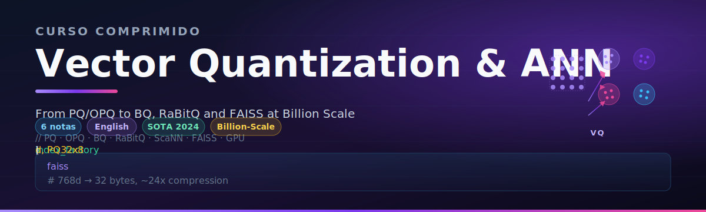

# 🗜️ Welcome to Vector Quantization and Approximate Nearest Neighbors

## 🎯 Learning Objectives
- Understand why **exact KNN dies at scale** and where quantization sits in the ANN hierarchy
- Map the **memory / recall / latency** triangle and identify quantization as its central lever
- Distinguish the four families of compression: scalar, product, binary, and anisotropic
- Recognize that quantization is **not a single algorithm** but a 14-year research lineage culminating in 2024 RaBitQ
- Identify which production index to use at 1M, 100M, and 1B+ vector scale
- Cross-link the frontier research with the engineer's pragmatic deployment decisions

## Introduction

Modern AI systems — RAG pipelines, recommendation feeds, semantic caches, image search — live or die by **how cheaply they can store and probe dense embeddings**. A 768-dimensional float32 vector costs 3 KB. One million of them fits in 3 GB. One billion of them costs 3 TB — more than most production servers carry, and more than a single NVMe SSD can hold comfortably. This is the memory wall: it is the *first* constraint that breaks naïve ANN implementations, before CPU or latency ever become the binding factor.

Quantization is the engineering response to that wall. Instead of storing vectors in 32-bit floats, we encode them into compact codes — bytes, bits, or learned tokens — and compute approximate distances directly on the codes. The promise is dramatic: at 1 byte per dimension (Product Quantization), we shrink 3 TB to 96 GB, a 32× compression ratio. At 1 bit per dimension (Binary Quantization), we shrink to 3 GB, a 1024× ratio. The cost is recall: approximate distances are not exact, and the rank order of nearest neighbors is perturbed. The art of production quantization is choosing the **right compression-per-axis budget** to fit your recall target.

This course goes **substantially deeper** than [[10 - Cloud, Infra y Backend/33 - Vector Databases and Semantic Search/02 - Indexing Algorithms Deep Dive#Product Quantization PQ]] and [[10 - Cloud, Infra y Backend/33 - Vector Databases and Semantic Search/01 - Vector Search Fundamentals]]. Module `33/02` introduced Product Quantization (PQ), Optimized PQ (OPQ), DiskANN, and ScaNN as one of seven major index families — a survey-level treatment suitable for choosing among IVF, HNSW, and graph-based engines. This course is **production-grade depth** on quantization specifically: Lloyd's algorithm internals, ADC vs SDC distance computation, the OPQ rotation matrix derivation, anisotropic vector quantization theory, and the 2024 SIGIR best paper RaBitQ. We treat FAISS not as a black box but as an engineering surface to be tuned and sharded.

The material is organized progressively. Note `01` reconstructs PQ from first principles, including the k-means training loop and the reconstruction error budget. Note `02` extends to OPQ and ScaNN, the algorithms that production systems like Google Search rely on. Note `03` explores the ultra-low-bit frontier — scalar, binary, and RaBitQ — where 32× and 1024× compression become feasible. Note `04` translates theory into FAISS engineering: index factories, sharding, GPU, serialization, and operational concerns. Note `05` synthesizes everything into a billion-vector capstone benchmark comparing four index configurations on a real workload. By the end, you will be able to defend a quantization choice with mathematical reasoning, not folklore.

## 🧭 The Memory / Recall / Latency Triangle

Every ANN index trades three resources: **memory footprint** (RAM and disk), **recall@10** (fraction of true nearest neighbors returned), and **query latency** (p50 / p95 / p99). Compression moves the memory vertex inward; the question is how badly it distorts the recall vertex. The frontier curves are well studied:

| Compression | Memory per vector (768D) | Recall at fixed latency | Algorithm |
|---|---|---|---|
| None (float32) | 3,072 B | 100% (exact KNN) | Flat |
| 8-bit scalar | 768 B | ~99% | SQ-8 |
| 8-bit × 8 sub-vectors (PQ) | 96 B | 95–98% | PQ-8×8 |
| 4-bit PQ (m=192) | 96 B | 90–94% | PQ-4 |
| 1-bit binary (BQ) | 96 B | 70–90% | BQ |
| RaBitQ (1-bit + extras) | 96–128 B | 88–96% | RaBitQ |

The right compression ratio depends on the workload. RAG over 10M documents tolerates 95% recall; a deduplication pipeline needs 99%+. Choosing too much compression silently degrades retrieval quality; choosing too little wastes hardware budget that could fund 10× more vectors.

## 📚 Course Map

| Note | Title | What You Will Master |
|------|-------|----------------------|
| `00` | **Welcome** | Mental model, compression frontier, course structure |
| `01` | **Product Quantization — Theory, Code and Reconstruction Error** | Lloyd's algorithm, ADC vs SDC, codebook training, residual quantization |
| `02` | **Optimized PQ, Anisotropic Quantization and ScaNN** | OPQ rotation learning, anisotropic loss, Google's ScaNN architecture |
| `03` | **Binary Quantization, Scalar Quantization and RaBitQ** | Hamming distance, ITQ, faiss.IndexScalarQuantizer, RaBitQ 2024 |
| `04` | **Production FAISS Engineering** | Index factories, sharding, multi-GPU, serialization, FAISS vs competitors |
| `05` | **Capstone — Billion-Vector Search with PQ and HNSW Tiered Index** | End-to-end benchmark of 4 index configurations on 10M synthetic 768D vectors |

## 🎯 Prerequisites

You should be comfortable with:
- Linear algebra: inner products, norms, orthogonal matrices
- Python and NumPy; reading C++ is helpful for FAISS internals
- Basic k-means clustering (we deepen it in [[01 - Product Quantization - Theory, Code and Reconstruction Error]])
- Vector search fundamentals: see [[10 - Cloud, Infra y Backend/33 - Vector Databases and Semantic Search/01 - Vector Search Fundamentals]]

## 🛠️ Setup

```bash
pip install faiss-cpu numpy matplotlib  # faiss-gpu if you have CUDA
pip install scann  # Google's ScaNN, for the OPQ/ScaNN comparison
```

A single GPU is not required for notes 01–03. Note `04` (multi-GPU sharding) and Note `05` (billion-vector capstone) benefit from a CUDA-capable machine; on CPU, the same code runs ~10× slower.

## 🔗 Related Vault Modules

- [[10 - Cloud, Infra y Backend/33 - Vector Databases and Semantic Search/01 - Vector Search Fundamentals]] — embeddings, distance metrics, ANN vs KNN
- [[10 - Cloud, Infra y Backend/33 - Vector Databases and Semantic Search/02 - Indexing Algorithms Deep Dive]] — survey of IVF, HNSW, PQ, DiskANN, ScaNN
- [[10 - Cloud, Infra y Backend/33 - Vector Databases and Semantic Search/05 - Qdrant I - Architecture and Collections]] — HNSW inside Qdrant
- [[10 - Cloud, Infra y Backend/33 - Vector Databases and Semantic Search/07 - Milvus I - Distributed Architecture]] — Milvus's quantization options
- [[06 - Large Language Models]] — RAG consumes quantized indices as the retrieval layer

## References

- H. Jégou, M. Douze, C. Schmid. "Product Quantization for Nearest Neighbor Search." IEEE TPAMI, 2011
- T. Ge, K. He, Q. Ke, J. Sun. "Optimized Product Quantization." IEEE TPAMI, 2013
- R. Guo et al. "Accelerating Large-Scale Inference with Anisotropic Vector Quantization (ScaNN)." ICML, 2020
- G. Moškus, J. Zhang. "RaBitQ: Quantizing High-Dimensional Vectors with a Theoretical Error Bound." SIGIR, 2024
- FAISS Wiki: https://github.com/facebookresearch/faiss/wiki
- ScaNN: https://github.com/google-research/google-research/tree/master/scann
