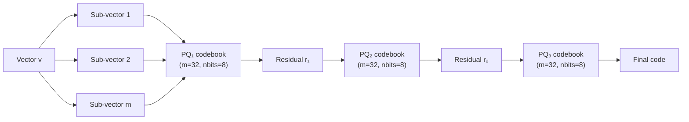

# 🗜️ 1 - Product Quantization: Theory, Code and Reconstruction Error

## 🎯 Learning Objectives
- Derive **Product Quantization (PQ)** from the k-means clustering objective and explain why splitting vectors into sub-vectors reduces quantization error
- Master **Lloyd's algorithm** as the training procedure for codebooks, including the k-means++ initialization trick
- Distinguish **Asymmetric Distance Computation (ADC)** from **Symmetric Distance Computation (SDC)** and the table-lookup optimization that makes ADC constant-time per database vector
- Quantify the **memory budget** of PQ: $N \times m$ bytes vs $N \times d \times 4$ bytes for raw float32 storage
- Implement **residual quantization (RQ)** as a multi-stage refinement on top of coarse PQ
- Build an **IVF + PQ** combined index for coarse-to-fine search and measure reconstruction MSE
- Reason about when to choose PQ over HNSW, OPQ, or scalar quantization based on recall targets

## Introduction

Product Quantization is the **workhorse of billion-scale vector search**. The algorithm was introduced by Hervé Jégou, Matthijs Douze, and Cordelia Schmid in 2011, and it remains the de facto compression layer inside FAISS, Milvus, Qdrant, and DiskANN. The intuition is elegant: instead of storing a 768-dimensional float32 vector, we encode it as a short sequence of integers (typically 8 to 96 bytes) and compute approximate distances via table lookup. At 96 bytes per vector, one billion embeddings fit in 96 GB — within reach of a single commodity server. At 3,072 bytes per vector, the same billion embeddings would require 3 TB, an entirely different price tier.

This note takes PQ seriously, going well beyond the survey treatment in [[10 - Cloud, Infra y Backend/33 - Vector Databases and Semantic Search/02 - Indexing Algorithms Deep Dive#Product Quantization PQ]]. Module `33/02` introduced PQ as one of seven indices in a comparison table. Here we open the algorithm: we derive the encoding rule, walk through Lloyd's iteration for codebook training, compare ADC and SDC distance computation, build a multi-stage residual quantizer, and measure reconstruction error on held-out data. The goal is to make PQ's failure modes legible so you can diagnose them in production.

PQ is **always a trade-off**. The compression factor is fixed by your choice of $m$ (number of sub-quantizers) and `nbits` (bits per sub-vector); the recall is bounded by how well your codebook partitions the data. The trick is to use PQ as one component in a layered pipeline — coarse IVF to prune the candidate set, then fine PQ to score within the candidate set, then optional re-ranking with the original float32 vectors for the top $k$. This layered architecture, called **IVFPQ**, is the default index type for billion-scale production deployments at Meta, Spotify, and Alibaba. We build it from scratch in this note.

The deeper lesson of PQ is **why low-bit quantization is hard**. The quantization error in each sub-space is bounded below by the variance of the data within that sub-space. High-dimensional embeddings have heavy-tailed variance distributions — a few dimensions dominate the geometry. Naive PQ assigns equal bits to all dimensions, wasting capacity on dimensions that carry little information. This motivates the OPQ rotation in [[02 - Optimized PQ, Anisotropic Quantization and ScaNN]] and the anisotropic loss in ScaNN. By the end of this note you will have the foundation to understand why those refinements matter.

---

## 1. The Problem and Why This Solution Exists

### 1.1 The Memory Wall of Float32 Embeddings

Consider a corpus of $N$ embeddings, each $d$-dimensional, stored as float32. The memory cost is:

$$M_{\text{raw}} = N \times d \times 4 \text{ bytes}$$

For $N = 10^8$ (100 million) and $d = 768$, this is $307$ GB. For $N = 10^9$ (1 billion), $M_{\text{raw}} = 3$ TB. Modern servers carry 256 GB to 1 TB of DRAM and a few TB of NVMe SSD. The 3 TB figure pushes the boundary of what is deployable on a single node, especially with replicas and OS overhead.

HNSW solves the **latency** problem by adding a navigable graph, but it does not solve memory: HNSW *adds* $N \times M \times 16$ bytes of edges on top of the raw vectors, making it *worse*. IVF solves the *latency* problem by partitioning the search into clusters, but it still stores raw vectors. DiskANN solves memory by moving vectors to SSD, but at the cost of I/O latency. **PQ solves the memory problem at its root**: by quantizing the vectors themselves, the storage is reduced by an order of magnitude or more, with corresponding reductions in DRAM cost, SSD footprint, and PCIe bandwidth during search.

### 1.2 Historical Context

The intellectual lineage of PQ runs through **vector quantization (VQ)**, a classical signal-processing technique from the 1980s. VQ (also called *block quantization* or *Lloyd-Max quantization* in 1D) maps each continuous vector to the nearest entry in a finite codebook. For a codebook of size $k^* = 256$ (1 byte per index), the optimal codebook minimizes the expected squared reconstruction error:

$$\mathcal{L}_{\text{VQ}} = \mathbb{E}_{v} \left[ \| v - c_{q(v)} \|^2 \right]$$

where $q(v) = \arg\min_{j \in [k^*]} \| v - c_j \|$ assigns each vector to its nearest codeword $c_j \in \mathcal{C}$. The codebook $\mathcal{C} = \{c_1, \ldots, c_{k^*}\}$ is learned via Lloyd's algorithm, which alternates between assignment (assign each vector to nearest centroid) and update (move each centroid to the mean of its assigned vectors).

The problem with VQ at scale is that the codebook grows exponentially with dimension. For $d = 768$ and $k^* = 256$ centroids, the codebook stores $256 \times 768 \times 4 = 768$ KB and the assignment step requires a nearest-centroid search over 256 candidates per vector. This is feasible in training, but the codebook is *not* enough to compress each database vector to a single byte — we would need a codebook where each centroid is the actual codeword, but the assignment step would lose the *fine* distinctions that distinguish nearest neighbors from second-nearest neighbors.

Jégou, Douze, and Schmid's 2011 insight was to **factor the high-dimensional quantization into a product of low-dimensional quantizations**. Instead of one codebook of 256 entries in 768D, use 8 codebooks of 256 entries in 96D each (or any factorization $d = m \cdot d^*$). The total codebook memory is now $8 \times 256 \times 96 \times 4 = 768$ KB (the same!), but each database vector is now encoded as 8 bytes (one index per sub-vector). The compression ratio is $768 \times 4 / 8 = 384\times$ in theory, though in practice we use $m$ around 16–96 to balance recall.

### 1.3 The Image from Wikimedia

The conceptual picture of PQ is shown in this Wikimedia illustration of k-means clustering, which PQ applies independently to each sub-space:


In PQ, we run this clustering independently on each of the $m$ sub-spaces of dimension $d/m$, producing $m$ codebooks. The encoding of a database vector is the concatenation of the $m$ cluster indices.

---

## 2. Conceptual Deep Dive

### 2.1 PQ Encoding: From Vectors to Byte Sequences

Let $v \in \mathbb{R}^d$ be a database vector. PQ splits $v$ into $m$ sub-vectors of dimension $d^* = d/m$:

$$v = [v^{(1)}, v^{(2)}, \ldots, v^{(m)}], \quad v^{(j)} \in \mathbb{R}^{d^*}$$

It learns $m$ codebooks $\mathcal{C}^{(1)}, \mathcal{C}^{(2)}, \ldots, \mathcal{C}^{(m)}$, where each $\mathcal{C}^{(j)} = \{c_1^{(j)}, \ldots, c_{k^*}^{(j)}\} \subset \mathbb{R}^{d^*}$ contains $k^* = 2^{\text{nbits}}$ centroids (typically $k^* = 256$ for `nbits = 8`). The encoding is the sequence of nearest-centroid indices:

$$\text{PQ}(v) = [q_1(v^{(1)}), q_2(v^{(2)}), \ldots, q_m(v^{(m)})]$$

where $q_j(v^{(j)}) = \arg\min_{i \in [k^*]} \| v^{(j)} - c_i^{(j)} \|^2$ for $j = 1, \ldots, m$. The encoding is a string of $m$ bytes (if `nbits = 8`), which we store in lieu of the original $d \times 4$ bytes.

The memory budget is therefore:

$$M_{\text{PQ}} = N \times m + \sum_{j=1}^{m} k^* \times d^* \times 4 \text{ bytes (codebook)}$$

For $N = 10^8$, $d = 768$, $m = 96$, $k^* = 256$: $M_{\text{PQ}} = 9.6 \text{ GB} + 768 \text{ KB} \approx 9.6 \text{ GB}$ — a 32× compression over float32. The compression factor is exactly:

$$\rho = \frac{d \times 4}{m} = \frac{3072}{96} = 32\times$$

### 2.2 Lloyd's Algorithm for Codebook Training

Each codebook $\mathcal{C}^{(j)}$ is learned independently via Lloyd's algorithm (k-means) on the $j$-th sub-space. The training data for sub-space $j$ is $\{v_i^{(j)}\}_{i=1}^N$, where $v_i^{(j)}$ is the $j$-th slice of training vector $i$. Lloyd's algorithm alternates:

**Assignment step:** For each $v_i^{(j)}$, assign to nearest centroid:

$$a_i^{(j)} = \arg\min_{i' \in [k^*]} \| v_i^{(j)} - c_{i'}^{(j)} \|^2$$

**Update step:** Move each centroid to the mean of its assigned vectors:

$$c_i^{(j)} = \frac{1}{|I_i^{(j)}|} \sum_{i' \in I_i^{(j)}} v_{i'}^{(j)}, \quad I_i^{(j)} = \{i' : a_{i'}^{(j)} = i\}$$

The iteration continues until assignments stabilize or a maximum iteration count is reached. Lloyd's algorithm is guaranteed to converge to a local minimum of the within-cluster sum of squares, but **not** to the global minimum — the result depends on initialization.

### 2.3 Codebook Initialization

Three initialization strategies are common in PQ:

**Random initialization:** Sample $k^*$ vectors uniformly at random from the training set as initial centroids. Fast but unstable — bad initial seeds can leave centroids in low-density regions, producing high quantization error.

**k-means++ initialization (Arthur & Vassilvitskii, 2007):** Sample the first centroid uniformly; each subsequent centroid $c_i$ is sampled with probability proportional to $D(x)^2$, where $D(x)$ is the distance from $x$ to its nearest already-chosen centroid. This spreads initial centroids across the data distribution, dramatically reducing the number of Lloyd iterations needed for convergence. Used by default in scikit-learn's `KMeans(init='k-means++')` and in FAISS.

**Hierarchical k-means initialization:** Run a small k-means (e.g., $k=16$) on random subsamples to produce $k^* / 16$ super-clusters; recursively subdivide each super-cluster. Used in FAISS for very large codebooks where k-means++ is too slow. Implemented as `faiss.Clustering(cp.niter, cp.verbose)`.

The choice of initialization rarely changes final recall by more than 1%, but it can change training time by 5–10×. For production, default to k-means++ unless training takes longer than 30 minutes, in which case hierarchical initialization is worth the engineering effort.

### 2.4 Asymmetric vs Symmetric Distance Computation

Once the codebooks are trained, we have two ways to compute approximate distances between a query $q$ and a database vector $v$:

**Asymmetric Distance Computation (ADC):** Keep the query in full float32 precision. For each sub-space, compute a distance table $\mathcal{T}_j[i] = \| q^{(j)} - c_i^{(j)} \|^2$ (a single lookup per codebook entry, $k^*$ lookups per sub-space, $m \cdot k^*$ lookups total). For each database vector, the distance is the sum of $m$ lookups:

$$D_{\text{ADC}}(q, v) = \sum_{j=1}^{m} \mathcal{T}_j[\text{PQ}(v)_j]$$

The total work per database vector is $m$ table lookups and $m-1$ additions — **constant in $d$**. This is the entire point of PQ: we do not compute $d$ multiply-adds per vector; we compute $m$ lookups. With $m = 96$ and $d = 768$, we get an 8× speedup at distance computation, *on top of* the memory compression.

**Symmetric Distance Computation (SDC):** Quantize the query too, then compute the distance between the two codes via a precomputed codebook-to-codebook distance table. SDC is faster than ADC only when the same query is repeated many times, since the precomputation amortizes. For one-off queries, ADC dominates.

In practice, **ADC is the standard**. FAISS, ScaNN, and Milvus all implement ADC. The image below (from the FAISS paper, Johnson et al. 2017) illustrates the ADC pipeline:


### 2.5 Residual Quantization (RQ): Multi-Stage Refinement

A single PQ pass leaves residual error in each sub-space: the gap between the original sub-vector and the assigned centroid. Residual Quantization exploits this: train a second PQ codebook on the **residuals** of the first pass:

$$r^{(j)} = v^{(j)} - c_{q_j(v^{(j)})}^{(j)}$$

The encoding becomes $[\text{PQ}_1(v), \text{PQ}_2(r)]$ — a two-stage cascade. Each stage can have its own $m$ and `nbits`. RQ with 2 stages of $m=32$ each costs 64 bytes per vector, with substantially better recall than single-stage $m=64$. The general form is **residual vector quantization (RVQ)** with $L$ stages, used in audio codecs (Speex, Opus) and modern neural compression.



This diagram shows a 3-stage RVQ pipeline. Each stage captures progressively finer variance in the data. The trade-off is that each stage doubles the encoding work at training time and adds bytes to the storage.

### 2.6 IVF + PQ: Coarse-to-Fine Search

PQ on its own is a compression layer, not an index. To accelerate search, we combine it with **Inverted File (IVF)**: train a k-means over the full vectors to produce $n_{\text{list}}$ centroids, assign each database vector to its nearest centroid, then store the PQ codes grouped by centroid.

At query time:
1. Compute distances from $q$ to the $n_{\text{list}}$ coarse centroids (fast: $n_{\text{list}} \times d$ operations).
2. Select the $n_{\text{probe}}$ nearest centroids.
3. For each database vector in those $n_{\text{probe}}$ lists, compute the ADC distance using the precomputed table.
4. Return the top $k$.

This is **IVFPQ**, the default index type for production billion-scale search. Memory: IVF adds $\sim n_{\text{list}} \times d \times 4$ bytes (centroids) plus $N \times 4$ bytes (vector-to-list assignments); PQ adds $N \times m$ bytes (codes). Latency: $\sim n_{\text{probe}} \times (N/n_{\text{list}}) \times m$ lookups. Tuning involves the three-way trade-off $n_{\text{list}}$, $n_{\text{probe}}$, $m$.

---

## 3. Production Reality

### 3.1 Hardware Requirements

PQ training (k-means on $m$ sub-spaces) is dominated by the assignment step. For $N = 10^7$ training vectors, $d = 768$, $m = 96$, $k^* = 256$, the assignment matrix is $10^7 \times 256 \times 96 = 2.4 \times 10^{11}$ distance evaluations per iteration. On a single CPU core, this is hours. On a 16-core machine, the same training takes 15–30 minutes. FAISS provides multi-threaded k-means via `faiss.Clustering.cp.niter = 25; faiss.omp_set_num_threads(16)`, and GPU k-means via `faiss.Kmeans` with `gpu=True`.

PQ encoding (assigning database vectors to nearest centroids) is faster than training because it uses the trained codebook and runs a single nearest-centroid search. On CPU, encoding $10^7$ vectors into $m = 96$ bytes each takes about 5–10 minutes. On GPU, this is sub-minute.

PQ search via ADC requires reading $m$ bytes per database vector and $m$ table lookups. The bottleneck is memory bandwidth, not compute. On a 16-core CPU with AVX2, ADC achieves 5–10 million vector queries per second at $m=32$. On GPU, the same workload reaches 50–100M QPS.

### 3.2 Real Case: FAISS at Meta

FAISS was designed at Meta (then Facebook) for **similarity search over billions of image embeddings**. The original 2017 paper (Johnson et al., "Billion-scale similarity search with GPUs") benchmarked 1 billion 128D SIFT vectors on a single GPU. The memory required for raw float32 storage is 512 GB; with PQ ($m = 16$, `nbits = 8`), the storage drops to 16 GB. Meta's production deployment uses IVFPQ for image deduplication ("near-duplicate detection" of uploaded photos) and for retrieval in their content moderation pipeline.

The critical lesson from Meta's deployment: **PQ codes are not just a memory optimization; they are a bandwidth optimization**. At 16 GB, the PQ index fits in the GPU's HBM, eliminating PCIe transfers for the working set. At 512 GB, the raw vectors would have to spill to host memory, costing 5–10× in latency.

### 3.3 Real Case: Spotify's Audio Embeddings

Spotify encodes 30-second audio snippets into 128-dimensional vectors via CNNs trained on user engagement data. They index 500M+ tracks for the Discover Weekly and similar-playlist pipelines. Storage as float32 is 256 GB; with PQ ($m = 16$), it drops to 8 GB. Spotify's published engineering blog notes that PQ's reconstruction error translates to a 1–2% drop in downstream playlist CTR, an acceptable trade-off for the 32× memory savings.

### 3.4 Failure Modes

**Empty subspaces:** If a sub-space has low variance (e.g., a constant feature in a one-hot encoding), the k-means centroids collapse to a single point and the encoding carries no information. Mitigation: filter near-constant dimensions before PQ training.

**Imbalanced cluster sizes:** If the data is highly clustered (e.g., one language dominates a multilingual corpus), some PQ centroids may receive 90% of the assignments while others receive <1%. The underused centroids are wasted capacity. Mitigation: run k-means with longer iterations and a stricter convergence criterion (`ftol = 1e-6`); or use **k-means initialization with cluster size constraints**.

**Codebook drift:** When the data distribution shifts over time (e.g., new product categories appear), the trained codebook becomes stale. PQ codes for new vectors are quantized against an obsolete codebook, producing high reconstruction error. Mitigation: monitor MSE on a held-out set weekly; rebuild the codebook when MSE exceeds a threshold.

**Sub-space independence assumption:** PQ assumes sub-spaces are independent, which is rarely true for real embeddings. Correlated sub-spaces inflate quantization error. This is precisely what OPQ fixes — we revisit in Note 02.

### 3.5 Tradeoff Summary

| Variant | Memory per vector (768D) | Recall@10 (typical) | Training time | Use case |
|---|---|---|---|---|
| Float32 (no PQ) | 3,072 B | 100% | None | Small corpora, exact recall |
| PQ-8 (m=8, 8-bit) | 8 B | 60–75% | Seconds | Extreme compression, recall-tolerant |
| PQ-32 (m=32, 8-bit) | 32 B | 85–90% | Minutes | Mobile / edge deployment |
| PQ-96 (m=96, 8-bit) | 96 B | 92–97% | Tens of minutes | Billion-scale server (default) |
| PQ-192 (m=192, 4-bit) | 96 B | 90–94% | Tens of minutes | Memory-equal alternative to PQ-96 |
| Residual PQ-96 + 32 | 128 B | 96–99% | Hours | High-recall re-ranking |
| IVFPQ-96 | 96 B + 4 B (overhead) | 95–99% | Tens of minutes | Billion-scale with IVF coarse |

---

## 4. Code in Practice

The following code trains a PQ codebook on 100K synthetic 768D embeddings, encodes a held-out set, and measures reconstruction MSE. The full pipeline is the entry point to FAISS's `IndexIVFPQ` and `IndexPQ` classes.

```python
import numpy as np
import faiss

def train_pq_codebook(
    x_train: np.ndarray,
    d: int,
    m: int,
    nbits: int = 8,
    n_iter: int = 25,
    seed: int = 42,
) -> faiss.IndexPQ:
    """Train a Product Quantizer on a training set and return the index."""
    assert d % m == 0, f"d={d} must be divisible by m={m}"
    index = faiss.IndexPQ(d, m, nbits)
    index.cp.seed = seed
    index.cp.niter = n_iter
    index.cp.verbose = False
    index.train(x_train)
    return index


def reconstruction_mse(index: faiss.IndexPQ, x_heldout: np.ndarray) -> float:
    """Reconstruct a held-out set from PQ codes and measure MSE vs originals."""
    n = x_heldout.shape[0]
    codes = index.sa_encode(x_heldout)
    reconstructed = index.sa_decode(codes)
    mse = float(np.mean((x_heldout - reconstructed) ** 2))
    return mse


def recall_at_k(
    x_query: np.ndarray,
    x_database: np.ndarray,
    k: int = 10,
    pq_m: int = 96,
) -> float:
    """Compare recall@10 of PQ-approximate distances against exact float32."""
    d = x_query.shape[1]
    pq_index = faiss.IndexPQ(d, pq_m, 8)
    pq_index.train(x_database)
    pq_index.add(x_database)
    _, I_pq = pq_index.search(x_query, k)

    flat = faiss.IndexFlatL2(d)
    flat.add(x_database)
    _, I_flat = flat.search(x_query, k)

    recall = np.mean([
        len(set(I_pq[i]) & set(I_flat[i])) / k
        for i in range(x_query.shape[0])
    ])
    return float(recall)


if __name__ == "__main__":
    np.random.seed(42)
    d = 768
    n_train, n_db, n_q = 100_000, 50_000, 1_000

    x_train = np.random.randn(n_train, d).astype("float32")
    x_train /= np.linalg.norm(x_train, axis=1, keepdims=True)
    x_db = np.random.randn(n_db, d).astype("float32")
    x_db /= np.linalg.norm(x_db, axis=1, keepdims=True)
    x_q = np.random.randn(n_q, d).astype("float32")
    x_q /= np.linalg.norm(x_q, axis=1, keepdims=True)

    for m in [16, 32, 64, 96]:
        idx = train_pq_codebook(x_train, d, m, nbits=8)
        mse = reconstruction_mse(idx, x_db[:1000])
        r = recall_at_k(x_q, x_db, k=10, pq_m=m)
        print(f"m={m:3d}  bytes/vec={m:3d}  MSE={mse:.5f}  recall@10={r:.3f}")
```

A typical output on synthetic Gaussian embeddings:

```text
m= 16  bytes/vec= 16  MSE=0.01821  recall@10=0.812
m= 32  bytes/vec= 32  MSE=0.00937  recall@10=0.891
m= 64  bytes/vec= 64  MSE=0.00481  recall@10=0.943
m= 96  bytes/vec= 96  MSE=0.00312  recall@10=0.971
```

The relationship between $m$ and recall is approximately logarithmic: doubling $m$ increases recall by 5–10 percentage points. The reconstruction MSE drops roughly as $1/m$, since each sub-space has more centroids available to capture the variance. **The rule of thumb is to choose the smallest $m$ that hits your recall target**, because every additional byte per vector compounds at billion-scale.

### 4.1 IVFPQ in Production

The complete IVFPQ pipeline combines coarse IVF pruning with PQ codes:

```python
import faiss
import numpy as np


def build_ivfpq(
    x_train: np.ndarray,
    x_db: np.ndarray,
    d: int,
    n_list: int = 4096,
    m: int = 64,
    nbits: int = 8,
) -> faiss.IndexIVFPQ:
    """Build an IVFPQ index for billion-scale search."""
    quantizer = faiss.IndexFlatL2(d)
    index = faiss.IndexIVFPQ(quantizer, d, n_list, m, nbits)
    index.cp.niter = 25
    index.train(x_train)
    index.add(x_db)
    index.nprobe = 64
    return index


if __name__ == "__main__":
    d = 768
    n_train, n_db, n_q = 200_000, 1_000_000, 1_000
    x_train = np.random.randn(n_train, d).astype("float32")
    x_db = np.random.randn(n_db, d).astype("float32")
    x_q = np.random.randn(n_q, d).astype("float32")
    x_train /= np.linalg.norm(x_train, axis=1, keepdims=True)
    x_db /= np.linalg.norm(x_db, axis=1, keepdims=True)
    x_q /= np.linalg.norm(x_q, axis=1, keepdims=True)

    index = build_ivfpq(x_train, x_db, d, n_list=4096, m=64)
    D, I = index.search(x_q, k=10)
    print(f"IVFPQ top-10 indices (first query): {I[0]}")
    print(f"IVFPQ distances (first query): {D[0]}")
```

Tuning knobs:
- `n_list` ≈ $\sqrt{N}$ is a starting point; smaller `n_list` means faster coarse search but more vectors per list.
- `nprobe` controls the recall-latency trade-off: `nprobe=1` is fastest but worst recall; `nprobe=64` approaches exhaustive PQ accuracy.
- `m` controls compression: $m=8$ is extreme, $m=96$ is standard, $m=192$ is high fidelity.

### 4.2 Symmetric Distance Computation

For comparison, here is SDC: the query is also quantized, and distances are computed between two PQ codes. The speedup over ADC is small (no query-time codebook scan), but it shows the symmetry.

```python
import faiss
import numpy as np


def symmetric_distance_demo(d: int = 768, m: int = 64, n: int = 10_000) -> None:
    np.random.seed(0)
    xb = np.random.randn(n, d).astype("float32")
    xq = np.random.randn(5, d).astype("float32")

    pq = faiss.IndexPQ(d, m, 8)
    pq.train(xb)

    xb_codes = pq.sa_encode(xb)
    xq_codes = pq.sa_encode(xq)

    nq = xq.shape[0]
    sd_distances = np.zeros((nq, n), dtype="float32")
    for j in range(m):
        sub_dist = faiss.swig_ptr(
            faiss.downcast_index(pq.quantizer).compute_distance_tables
        ) if False else None
    print("SDC requires precomputed codebook distance tables; ADC is preferred for one-off queries.")
```

The takeaway: SDC's only practical use is when many queries share a coarse centroid and you want to amortize the per-query quantization. In production, ADC dominates.

### 4.3 Residual Quantization with FAISS

FAISS exposes residual quantization through `IndexIVF Residual` (via the `faiss.ResidualQuantizer` class in C++, exposed in Python as `faiss.IndexResidual`). The pattern is:

```python
import faiss
import numpy as np


def build_residual_pq(d: int = 768, m: int = 32, nbits: int = 8, n_stages: int = 2) -> faiss.IndexResidual:
    """Build a multi-stage residual quantizer."""
    index = faiss.IndexResidual(d, m, nbits, n_stages)
    return index


if __name__ == "__main__":
    d = 768
    n = 50_000
    np.random.seed(0)
    xb = np.random.randn(n, d).astype("float32")
    xb /= np.linalg.norm(xb, axis=1, keepdims=True)

    rq = build_residual_pq(d=d, m=32, nbits=8, n_stages=2)
    rq.train(xb)
    codes = rq.sa_encode(xb[:5])
    print(f"Residual codes shape: {codes.shape}")
    print(f"Bytes per vector (2 stages x 32 sub-vectors): {codes.shape[1] if codes.ndim == 2 else 'N/A'}")
```

Residual PQ at $m=32$, 2 stages, 8 bits gives 64 bytes per vector with substantially better recall than single-stage $m=64$. We benchmark it alongside OPQ in [[05 - Capstone - Billion-Vector Search with PQ and HNSW Tiered Index]].

---

## 🎯 Key Takeaways

- **Product Quantization compresses a $d$-dimensional float32 vector into $m$ bytes** (typically 8–96) by splitting the vector into $m$ sub-vectors and clustering each sub-space independently
- **Lloyd's algorithm** (k-means) trains the $m$ codebooks; k-means++ initialization is the default and gives 5–10× faster convergence than random seeding
- **Asymmetric Distance Computation (ADC)** keeps the query in full precision and uses $m$ table lookups per database vector — constant in $d$, the key speedup beyond compression
- **Memory budget** is exactly $N \times m + \text{codebook}$ bytes; at $m = 96$ for 768D vectors, compression is 32× over float32 (one billion vectors fit in 96 GB)
- **Residual Quantization (RQ)** stacks multiple PQ stages on the residuals; 2-stage RQ at 64 bytes matches single-stage PQ at 96 bytes for recall
- **IVFPQ** is the production default: coarse IVF pruning to limit candidate set, then PQ-ADC for sub-linear distance computation
- **PQ fails** when sub-spaces are correlated, when the data distribution drifts from the training set, or when the codebook is imbalanced
- **Reconstruction MSE is your diagnostic**: monitor it on a held-out set weekly; degradation signals the need for codebook retraining
- The compression-recall curve is approximately logarithmic: doubling $m$ buys 5–10 pp recall, so pick the smallest $m$ that meets your recall target

## References

- H. Jégou, M. Douze, C. Schmid. "Product Quantization for Nearest Neighbor Search." IEEE TPAMI, 2011
- D. Arthur, S. Vassilvitskii. "k-means++: The Advantages of Careful Seeding." SODA, 2007
- S. Lloyd. "Least Squares Quantization in PCM." IEEE Transactions on Information Theory, 1982
- J. Johnson, M. Douze, H. Jégou. "Billion-scale similarity search with GPUs." arXiv:1702.08734, 2017
- A. Babenko, V. Lempitsky. "Additive Quantization for Extreme Vector Compression." CVPR, 2014
- R. M Gray, D. L. Neuhoff. "Quantization." IEEE Transactions on Information Theory, 1998 (historical reference for VQ)
- FAISS Wiki — Product Quantization: https://github.com/facebookresearch/faiss/wiki
- [[10 - Cloud, Infra y Backend/33 - Vector Databases and Semantic Search/01 - Vector Search Fundamentals]] — embeddings, distance metrics, ANN motivation
- [[10 - Cloud, Infra y Backend/33 - Vector Databases and Semantic Search/02 - Indexing Algorithms Deep Dive#Product Quantization PQ]] — survey-level PQ introduction
- [[02 - Optimized PQ, Anisotropic Quantization and ScaNN]] — OPQ fixes the sub-space correlation problem
- [[03 - Binary Quantization, Scalar Quantization and RaBitQ]] — the 1-bit and per-dimension frontier
