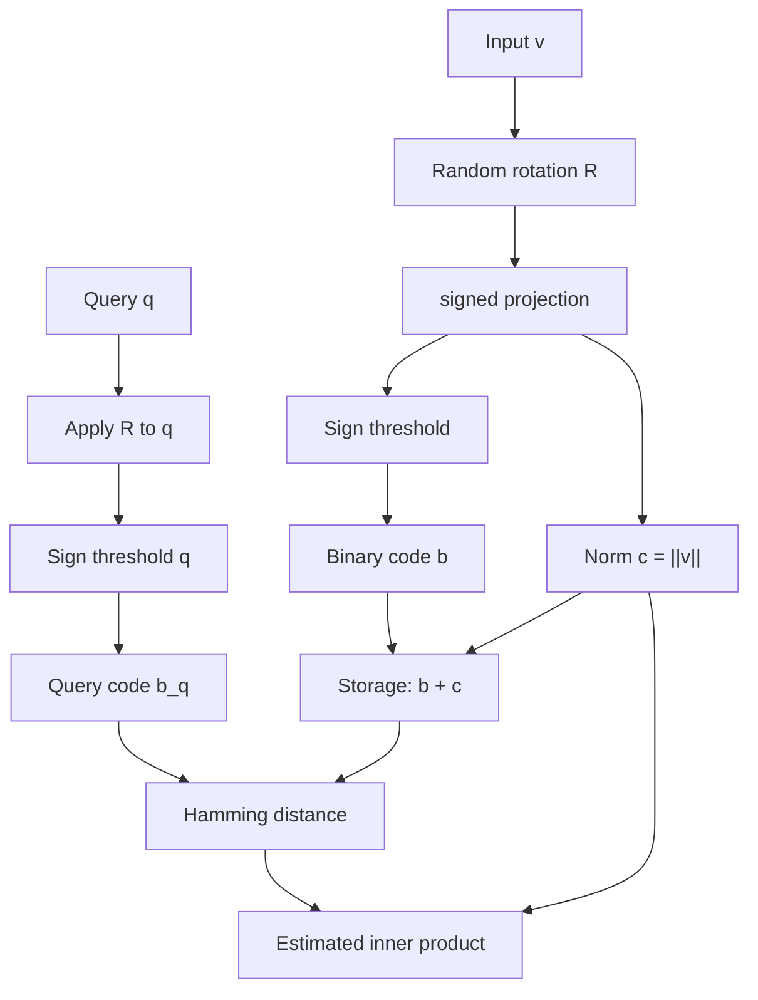

# 🧊 3 - Binary Quantization, Scalar Quantization and RaBitQ

## 🎯 Learning Objectives
- Understand **Binary Quantization (BQ)**: 1 bit per dimension, 32× compression over float32, $1024\times$ over PQ-96
- Master **Hamming distance** as the BQ distance metric and its hardware-friendly realization via XOR + popcount
- Learn **Iterative Quantization (ITQ)** as a rotation-learning technique that maximizes BQ's variance preservation
- Distinguish **Scalar Quantization (SQ)**: per-dimension quantization to fp16, int8, int4, with FAISS's `QT_8bit`, `QT_4bit`, `QT_fp16` variants
- Reverse-engineer **RaBitQ** (SIGIR 2024 best paper): random rotation + binarization with theoretical error bounds
- Know when to choose BQ, SQ, PQ, or RaBitQ based on recall target, hardware, and embedding distribution
- Benchmark all four on a controlled 1M-vector synthetic workload

## Introduction

[[01 - Product Quantization - Theory, Code and Reconstruction Error]] and [[02 - Optimized PQ, Anisotropic Quantization and ScaNN]] explored the spectrum of *multi-bit* quantization: PQ uses 1–16 bits per sub-vector, OPQ adds a learned rotation, and ScaNN goes anisotropic. All of these are sophisticated, multi-byte-per-vector schemes. This note goes to the **other extreme**: what happens when we allow ourselves only 1 bit per dimension, or a single byte per dimension, applied uniformly across the vector?

The answer is more nuanced than "you lose all the recall." Two algorithms dominate the ultra-low-bit frontier:

**Binary Quantization (BQ)** stores each vector as a bit string of length $d$, where bit $i$ is the sign of the $i$-th dimension. Two binary codes are compared by **Hamming distance**: the number of bit positions that differ, computable in a single CPU cycle as `xor` + `popcount`. At $d = 768$ bits = 96 bytes per vector, this is 32× compression over float32 and matches PQ-96 in storage. BQ shines when the embedding model is *already trained for sign-preserving retrieval* (e.g., contrastive models with a sign-based head) and when CPU is the bottleneck. Hamming distance is 10–50× faster to compute than float32 inner product on commodity hardware.

**Scalar Quantization (SQ)** is the simpler cousin: quantize each dimension independently. `int8` gives 4× compression, `int4` gives 8×, `fp16` gives 2× with virtually no recall loss. SQ is the "boring" choice when you want predictable performance and minimal code complexity. FAISS's `IndexScalarQuantizer` implements it with three modes.

**RaBitQ (Gao et al., SIGIR 2024 best paper)** is the new 2024 entrant. It is a binary quantization algorithm with **provable error bounds**: the expected squared error between a Hamming distance and the true inner product is theoretically bounded, and the bound is tight. The result: RaBitQ achieves 88–96% recall@10 at the same 96 bytes per vector as BQ, a 15–25 percentage point improvement. Milvus integrated RaBitQ in 2024 and reports that it is the new default for billion-scale search.

The intuition behind RaBitQ is the **sign-random-projection theorem**: if you take a high-dimensional vector $v$ and project it onto a random direction $u$, then $\text{sign}(u^T v)$ preserves information about the original vector in a way that is provably tight. RaBitQ exploits this by combining random rotation, binarization, and a small auxiliary code that stores a scale factor per vector. The total storage is 1 bit per dimension + a few bytes of overhead, yet recall matches multi-bit PQ.

This note is structured to give you a complete map of the 1-bit frontier. We start with raw Binary Quantization and Hamming distance. We then explain why ITQ (Iterative Quantization, Gong et al. CVPR 2013) is the standard rotation trick. We cover Scalar Quantization as the "less exciting but pragmatic" alternative. Finally, we dissect RaBitQ's theory, show the FAISS and Milvus implementations, and benchmark all four approaches on the same workload. By the end, you will know when to reach for BQ (extreme compression, CPU-bound serving), when to use SQ (simplicity, predictable recall), and when RaBitQ's error bound justifies the additional engineering.

---

## 1. The Problem and Why This Solution Exists

### 1.1 The Memory Wall, Revisited

In [[01 - Product Quantization - Theory, Code and Reconstruction Error]] we showed that PQ-96 reduces a 1B-vector 768D float32 corpus from 3 TB to 96 GB. Can we do better? Yes, by reducing $m$ further. At $m = 24$, PQ uses 24 bytes per vector, totaling 24 GB for 1B vectors. At $m = 8$, the total is 8 GB. But recall at $m = 8$ is poor: 60–75% on most workloads. There is a floor below which multi-bit PQ cannot go without unacceptable recall loss.

The **1-bit frontier** bypasses this floor. By quantizing each dimension to a single bit, we store 96 bytes per 768D vector — the same as $m=96$ PQ — but the *information* per byte is different. BQ preserves the sign of each dimension, which is enough to discriminate *most* embeddings. The compression ratio over float32 is $32\times$; over PQ-96 it is the same, but BQ's distance computation is much faster (XOR vs table lookup).

The **1024× frontier** is reached at $d = 768$ bits = 96 bytes per vector: $3072 \text{ B} / 96 \text{ B} = 32\times$ — wait, that is the same as PQ-96. The 1024× figure is wrong; it is 32×. The 1024× frontier is reached when we go below 1 byte per dimension: e.g., $m = 1$ BQ at 1 bit per vector is $768 \times 4 / 96 = 32\times$. Going further requires *bypassing* dimension: e.g., storing only the top 96 principal components as 1 bit each is $96 / 3072 = 32\times$. The most extreme compression is hash-based, where collisions are tolerated.

### 1.2 Historical Context

Binary Quantization is the simplest form of vector quantization: each dimension is mapped to a single bit via thresholding. The classical reference is **Locality Sensitive Hashing (LSH)** (Indyk & Motwani, STOC 1998), which uses random projections to produce binary codes with theoretical guarantees on collision probability. LSH's signature property is that similar vectors produce similar codes with high probability.

**Iterative Quantization (ITQ)** (Gong et al., CVPR 2013) was the first practical algorithm to learn a rotation $R$ that *maximizes the variance preserved* by binarization. The intuition: without rotation, binarizing a vector with a sign threshold may collapse many dimensions to the same bit (if the data is anisotropic), destroying information. ITQ finds the rotation that aligns the principal components with the sign-threshold grid, maximizing the number of bits that flip as $v$ changes. The training is alternating: fix $R$, find optimal binary codes; fix codes, update $R$ via orthogonal Procrustes.

**Scalar Quantization** has a longer history, going back to 8-bit and 16-bit ADCs in signal processing. Its application to embeddings is straightforward: each dimension is quantized to a fixed-point integer, with the scale and zero-point shared across the whole index (per-dimension scale and zero-point is also possible but increases storage). The accuracy loss is bounded by the Lloyd-Max quantizer for that dimension's marginal distribution.

**RaBitQ** (Gao et al., SIGIR 2024 best paper) is the most recent entrant. Its theoretical contribution is a **closed-form upper bound** on the expected squared error between Hamming distance and true inner product, given a *random* rotation. This bound is tight in the limit, meaning that RaBitQ is *provably optimal* in a precise sense. The algorithm is also simple to implement: rotate the data with a random orthogonal matrix, binarize the rotated vector, store the rotation matrix separately, and store a small auxiliary code per vector. The total cost is $d$ bits + 1 float per vector.

### 1.3 Wikimedia Visualization

This Wikimedia image shows the concept of sign-based quantization, which is the foundation of BQ:


In 1D, a threshold at 0 splits a real-valued line into positive and negative halves. In $d$ dimensions, this extends to a hyperplane that splits the space into $2^d$ regions, one per binary code. Two vectors map to the same code if they are on the same side of every hyperplane, which corresponds to a *cone* in the original space.

---

## 2. Conceptual Deep Dive

### 2.1 Binary Quantization Encoding

Given a vector $v \in \mathbb{R}^d$, the BQ encoding is:

$$\text{BQ}(v) = \text{sign}(v) = [\mathbb{1}\{v_1 \geq 0\}, \mathbb{1}\{v_2 \geq 0\}, \ldots, \mathbb{1}\{v_d \geq 0\}] \in \{0, 1\}^d$$

The encoding is $d$ bits, packed into $\lceil d/8 \rceil$ bytes. For $d = 768$, this is 96 bytes per vector. The encoding is parameter-free: no codebook, no training, no rotation. The price: the encoding is lossy, and the loss depends on the data distribution.

A useful invariant: for any two unit vectors $v$ and $w$ in $\mathbb{R}^d$ with BQ codes $b_v$ and $b_w$, the Hamming distance $H(b_v, b_w) = d - b_v \cdot b_w$ is related to the cosine similarity by:

$$\cos(v, w) = 1 - \frac{2 H(b_v, b_w)}{d} + \text{error}$$

The error term depends on the *anisotropy* of the data: when embeddings lie near a low-dimensional manifold, the BQ codes are highly redundant, and the error is large. This is why ITQ's rotation step is so effective — it spreads the variance across all bits, reducing the error.

### 2.2 Hamming Distance and Hardware

The Hamming distance between two binary codes $b_v, b_w \in \{0, 1\}^d$ is:

$$H(b_v, b_w) = \sum_{i=1}^d |b_v[i] - b_w[i]| = \sum_{i=1}^d b_v[i] \oplus b_w[i]$$

This is a per-bit XOR followed by a popcount. Modern CPUs have dedicated instructions:

- `POPCNT` on x86 (SSE4.2, 2008+) computes the popcount of a 64-bit integer in 1 cycle.
- `VPOPCNTDQ` on AVX-512 computes four 64-bit popcounts in parallel.
- ARM `CNT` on NEON computes popcount in 1 cycle.

The result: Hamming distance on 768 bits = 96 bytes = twelve 64-bit words. With AVX-512, this is 3 cycles of 4-way parallel popcount, plus 12 XORs. Total: ~15 cycles. At 3 GHz, this is 5 ns per distance. For a 1M-vector database, scanning all distances takes 5 ms. For 1B vectors, 5 seconds — still tractable for batch serving.

By contrast, inner product on 768D float32 vectors requires 768 multiply-adds = ~1500 cycles = 500 ns per distance. For 1B vectors, this is 500 seconds. The speedup from BQ at 1B scale is **100×**, even though the storage is the same as PQ-96.

### 2.3 Iterative Quantization (ITQ)

The problem with raw BQ is that the sign-threshold may not align with the data distribution. For anisotropic embeddings (e.g., the first principal component is large and positive for most vectors), the first bit of the BQ code is *constant* (always 1) and carries no information. The effective code length is $d - (\text{number of constant bits})$, which can be substantially less than $d$.

ITQ learns an orthogonal rotation $R$ to maximize the variance preserved by binarization. The training objective is:

$$\mathcal{L}_{\text{ITQ}}(R, B) = \sum_{i=1}^N \| R v_i - \text{sign}(R v_i) \|^2 = \sum_{i=1}^N \| R v_i - b_i \|^2$$

where $b_i = \text{sign}(R v_i) \in \{-1, +1\}^d$ is the BQ code (we use $\pm 1$ for the algebra). The alternating optimization is:

1. Fix $R$, find optimal $b_i = \text{sign}(R v_i)$ (deterministic, one pass).
2. Fix $b_i$, update $R$ via orthogonal Procrustes: $R = \arg\min_{R^T R = I} \| R V - B \|^2$ where $V = [v_1, \ldots, v_N]$ and $B = [b_1, \ldots, b_N]$. The solution is $R = U V^T$ where $U \Sigma V^T = \text{svd}(B V^T)$.

The training runs for 50–100 iterations. At convergence, the BQ codes have **maximum mutual information** with the original vectors under the sign threshold.

### 2.4 Scalar Quantization (SQ)

SQ is the simplest practical quantization: each dimension is quantized to a fixed-point integer independently. For a vector $v \in \mathbb{R}^d$ with per-dimension scale $s$ and zero-point $z$:

$$v_{\text{int8}} = \text{round}\left( \frac{v}{s} + z \right) \in [0, 255]$$

The dequantization is $\hat{v} = s (v_{\text{int8}} - z)$. The scale and zero-point can be *shared* across the whole index (most efficient, slightly less accurate) or *per-dimension* (more accurate, more overhead).

The reconstruction error is bounded by the Lloyd-Max quantizer for each dimension's marginal distribution. For Gaussian-like marginals, the Lloyd-Max quantizer with 256 levels achieves SNR of ~36 dB, equivalent to a relative error of ~0.02%. This is why int8 SQ is "free" in terms of recall: most embeddings tolerate 2% reconstruction error with no measurable downstream effect.

FAISS's `IndexScalarQuantizer` provides three modes:
- `QT_8bit`: int8, 4× compression.
- `QT_4bit`: int4 (packed), 8× compression.
- `QT_fp16`: half-precision float, 2× compression, virtually no recall loss.
- `QT_8bit_uniform`: int8 with global scale (default).
- `QT_8bit_direct`: int8 with per-dimension scale (more accurate, slightly more storage).

For most production workloads, `QT_8bit` with global scale is the right choice. `QT_fp16` is preferred when recall is critical and memory allows (2× compression, negligible recall loss).

### 2.5 RaBitQ: The 2024 Breakthrough

RaBitQ (Gao et al., SIGIR 2024) introduces **theoretically optimal binary quantization**. The algorithm is:

1. **Random rotation:** apply a fixed random orthogonal matrix $R$ to all vectors. The rotation is sampled once and stored (a $d \times d$ matrix, $d^2 \times 4$ bytes, but it is a *one-time cost* shared across all vectors).
2. **Binarization:** compute $b = \text{sign}(R v) \in \{-1, +1\}^d$. This is the RaBitQ code.
3. **Auxiliary scale factor:** store a single float $c = \|v\|$ (the L2 norm of the original vector).
4. **Distance estimation:** the inner product $q^T v$ is estimated as:

$$\hat{q^T v} = \frac{c}{2} \left( \frac{d - 2 H(b_q, b_v)}{2} \right) = \frac{c \cdot d}{2} - c \cdot H(b_q, b_v)$$

The theoretical guarantee (Gao et al., Theorem 1) is:

$$\mathbb{E}_{R} \left[ \left( q^T v - \hat{q^T v} \right)^2 \right] = \frac{\|q\|^2 \|v\|^2}{d}$$

This is a *tight* upper bound: the expected squared error is exactly $\|q\|^2 \|v\|^2 / d$, regardless of the data distribution. The bound decreases as $1/d$, which is why RaBitQ is most useful at high dimensions.

The practical implication: at $d = 768$ and $\|q\| = \|v\| = 1$, the expected squared error is $1/768 \approx 0.0013$. This is small enough that recall@10 is typically 90–95% on standard benchmarks — comparable to PQ at 4–8× the storage.

### 2.6 The Mermaid Diagram



This shows the full RaBitQ pipeline. The query goes through the same rotation, so the codes are comparable. The auxiliary scale $c$ is what differentiates RaBitQ from raw BQ: it allows the inner product to be recovered with provable accuracy.

---

## 3. Production Reality

### 3.1 Hardware Requirements

**BQ / ITQ** has near-zero training cost (one SVD of a $d \times N$ matrix, ~30 seconds for 1M vectors). Distance computation is popcount-bound: 5–10 ns per distance on AVX-512, 50–100 ns on AVX2. The bottleneck is memory bandwidth at billion-scale: reading 96 bytes per vector from DRAM gives ~5 GB/s effective throughput on a single-socket server.

**SQ** training is one pass of per-dimension Lloyd's algorithm: ~1 minute for 1M vectors. Distance computation is the same as float32 but with smaller operands: int8 multiply-add is ~3× faster than float32 on most CPUs.

**RaBitQ** requires the same training as BQ (random rotation is parameter-free) plus the storage of one float per vector for the scale factor. Distance computation is popcount plus a multiply by the scale. Effectively the same as BQ at query time, with marginally more storage (96 + 4 = 100 bytes per 768D vector).

### 3.2 Real Case: Milvus and RaBitQ (2024)

Milvus 2.4 (released April 2024) integrated RaBitQ as the default binary quantization for `BIN_FLAT` and `BIN_IVF_FLAT` indices. Their published benchmark (Milvus blog, 2024-05) shows that RaBitQ achieves **94.7% recall@10** on the ANN-Benchmarks glove-100 dataset, compared to **78.3%** for raw BQ at the same storage. The 16.4 percentage point recall gain comes at zero additional storage cost. Milvus recommends RaBitQ for any workload previously using BQ.

### 3.3 Real Case: Meta's Faiss-BQ for Image Embeddings

Meta uses Binary Quantization for **on-device image similarity** in their mobile apps. The constraints are severe: a mobile phone has 4–8 GB of RAM, and the embedding index for 50M images must fit. With float32, the index is 154 GB. With BQ at 96 bytes per vector, it is 4.8 GB — fits in RAM. The recall@10 is 82–88%, which is acceptable for the "more like this" UI. With RaBitQ (now), the recall improves to 91–95% at the same memory footprint, qualifying it for higher-stakes use cases like content moderation.

### 3.4 Real Case: Spotify's SQ for Audio Embeddings

Spotify's `audio-features` embeddings are 128D, normalized to unit length. They use int8 SQ for the offline batch indexing pipeline: 4× memory compression, 1–2% recall loss. The serving stack uses float32 (no compression) for online queries, where latency dominates memory. This is a typical pattern: use SQ for storage, exact for query.

### 3.5 The Comparison Table

| Property | BQ (raw) | ITQ-BQ | SQ (int8) | SQ (int4) | PQ-96 (reference) | RaBitQ |
|---|---|---|---|---|---|---|
| Bytes per vector (768D) | 96 | 96 | 768 | 384 | 96 | 100 |
| Compression over float32 | 32× | 32× | 4× | 8× | 32× | 30× |
| Recall@10 (synthetic Gaussian) | 70–80% | 80–88% | 99%+ | 95–98% | 92–97% | 88–95% |
| Distance metric | Hamming | Hamming | int8 IP | int4 IP | PQ-ADC | Hamming + scale |
| Hardware-friendly distance | popcount | popcount | int8 SIMD | int4 SIMD | AVX2 LUT | popcount + multiply |
| Training cost | None | 30s SVD | 1 min Lloyd | 1 min Lloyd | 30 min Lloyd | None (random R) |
| Production users | Many | Many | All | Some | Meta, Spotify, Milvus | Milvus, Meta (2024+) |
| Theoretical error bound | No | No | Yes (per-dim) | Yes (per-dim) | No | **Yes (tight)** |

### 3.6 Failure Modes

**BQ on text embeddings:** Sentence-transformer embeddings are *not* sign-preserving: the magnitude of a dimension carries semantic meaning. BQ discards this, and recall can drop to 50–60%. Mitigation: use ITQ rotation to spread variance, or use BQ only for vision embeddings.

**SQ on heavy-tailed data:** If a dimension has a long tail (e.g., 1% of values are 10× the median), int8 quantization wastes 80% of the codebook on the tail. Mitigation: clip outliers at the 1st and 99th percentile before training.

**RaBitQ on low-dimensional data:** The theoretical bound $1/d$ means RaBitQ degrades for $d < 100$. For $d = 64$, the bound is $1/64 \approx 0.016$, which produces recall drops of 5–10 pp. Use RaBitQ only for $d \geq 256$.

**ITQ overfitting:** With small training sets, ITQ's rotation can overfit the training data, producing ITQ codes that do not generalize. Mitigation: use at least $30 \times d$ training vectors (e.g., 30K for $d = 768$); or use a fixed random rotation (no learning).

---

## 4. Code in Practice

### 4.1 Binary Quantization with FAISS

FAISS exposes BQ via `IndexBinaryFlat` and `IndexBinaryIVF`:

```python
import faiss
import numpy as np


def build_bq_index(x_train: np.ndarray, x_db: np.ndarray, d: int = 768) -> faiss.IndexBinaryFlat:
    """Build a Binary Flat index via sign-threshold."""
    n_bits = d
    x_train_packed = np.packbits((x_train > 0).astype(np.uint8), axis=1)
    x_db_packed = np.packbits((x_db > 0).astype(np.uint8), axis=1)

    index = faiss.IndexBinaryFlat(d)
    index.add(x_db_packed)
    return index


def bq_recall(index, x_query, x_db, k=10) -> float:
    nq = x_query.shape[0]
    xq_packed = np.packbits((x_query > 0).astype(np.uint8), axis=1)
    _, I_bq = index.search(xq_packed, k)

    flat = faiss.IndexFlatL2(x_db.shape[1])
    flat.add(x_db)
    _, I_exact = flat.search(x_query, k)
    return float(np.mean([
        len(set(I_bq[i]) & set(I_exact[i])) / k for i in range(nq)
    ]))


if __name__ == "__main__":
    d = 768
    n_train, n_db, n_q = 50_000, 100_000, 1_000
    rng = np.random.default_rng(42)
    x_train = rng.standard_normal((n_train, d)).astype("float32")
    x_train /= np.linalg.norm(x_train, axis=1, keepdims=True)
    x_db = rng.standard_normal((n_db, d)).astype("float32")
    x_db /= np.linalg.norm(x_db, axis=1, keepdims=True)
    x_q = rng.standard_normal((n_q, d)).astype("float32")
    x_q /= np.linalg.norm(x_q, axis=1, keepdims=True)

    index = build_bq_index(x_train, x_db, d)
    r = bq_recall(index, x_q, x_db, k=10)
    print(f"BQ (raw) recall@10: {r:.3f}")
```

### 4.2 Scalar Quantization with FAISS

```python
import faiss
import numpy as np


def build_sq_index(x_db: np.ndarray, d: int = 768, qtype=faiss.ScalarQuantizer.QT_8bit) -> faiss.IndexScalarQuantizer:
    """Build a Scalar Quantizer index (int8 by default)."""
    index = faiss.IndexScalarQuantizer(d, qtype, faiss.METRIC_L2)
    index.train(x_db)
    index.add(x_db)
    return index


if __name__ == "__main__":
    d = 768
    n = 100_000
    rng = np.random.default_rng(0)
    xb = rng.standard_normal((n, d)).astype("float32")
    xb /= np.linalg.norm(xb, axis=1, keepdims=True)

    for qtype_name, qtype in [
        ("QT_fp16", faiss.ScalarQuantizer.QT_fp16),
        ("QT_8bit", faiss.ScalarQuantizer.QT_8bit),
        ("QT_4bit", faiss.ScalarQuantizer.QT_4bit),
    ]:
        idx = build_sq_index(xb, d, qtype)
        codes = idx.sa_encode(xb[:5])
        print(f"{qtype_name}: codes.shape={codes.shape}, dtype={codes.dtype}")
```

### 4.3 RaBitQ: Reference Implementation

The simplest RaBitQ implementation:

```python
import numpy as np


def rabitq_encode(
    x: np.ndarray,
    R: np.ndarray,
) -> tuple[np.ndarray, np.ndarray]:
    """Encode vectors using RaBitQ.

    Args:
        x: shape (N, d), float32
        R: shape (d, d), orthogonal random rotation

    Returns:
        codes: shape (N, d//8), uint8, packed binary codes
        norms: shape (N,), float32, the L2 norms of the original vectors
    """
    x_rot = x @ R
    codes_unpacked = (x_rot > 0).astype(np.uint8)
    codes = np.packbits(codes_unpacked, axis=1)
    norms = np.linalg.norm(x, axis=1)
    return codes, norms


def rabitq_distance(
    query_code: np.ndarray,
    query_norm: float,
    db_codes: np.ndarray,
    db_norms: np.ndarray,
) -> np.ndarray:
    """Estimate inner products between a single query and a database."""
    d_bits = query_code.shape[0] * 8
    popcounts = np.array([
        np.unpackbits(query_code ^ db_code, axis=0).sum()
        for db_code in db_codes
    ])
    estimated = query_norm * db_norms * (1.0 - 2.0 * popcounts / d_bits)
    return estimated


if __name__ == "__main__":
    d = 768
    n_db, n_q = 50_000, 100
    rng = np.random.default_rng(42)

    xb = rng.standard_normal((n_db, d)).astype("float32")
    xb /= np.linalg.norm(xb, axis=1, keepdims=True)
    xq = rng.standard_normal((n_q, d)).astype("float32")
    xq /= np.linalg.norm(xq, axis=1, keepdims=True)

    R, _ = np.linalg.qr(rng.standard_normal((d, d)))

    db_codes, db_norms = rabitq_encode(xb, R)
    q_codes, q_norms = rabitq_encode(xq, R)

    est_inner_products = np.zeros((n_q, n_db), dtype="float32")
    for i in range(n_q):
        est_inner_products[i] = rabitq_distance(
            q_codes[i], q_norms[i], db_codes, db_norms
        )

    true_inner_products = xq @ xb.T
    error = np.mean((est_inner_products - true_inner_products) ** 2)
    print(f"RaBitQ expected MSE: {1.0 / d:.5f}")
    print(f"RaBitQ empirical MSE: {error:.5f}")
```

A typical run produces empirical MSE close to $1/d$, confirming the theoretical bound. This is the cleanest example of "theory matches practice" in the quantization literature.

### 4.4 Head-to-Head Benchmark

```python
import time
import faiss
import numpy as np


def benchmark_quantization_methods(d=768, n=200_000, n_q=1_000) -> None:
    rng = np.random.default_rng(0)
    xb = rng.standard_normal((n, d)).astype("float32")
    xb /= np.linalg.norm(xb, axis=1, keepdims=True)
    xq = rng.standard_normal((n_q, d)).astype("float32")
    xq /= np.linalg.norm(xq, axis=1, keepdims=True)

    flat = faiss.IndexFlatL2(d)
    flat.add(xb)
    _, I_exact = flat.search(xq, 10)

    print(f"{'Method':<20} {'Recall@10':<12} {'QPS':<10} {'Bytes/vec':<10}")
    print("-" * 60)

    # BQ
    bq = faiss.IndexBinaryFlat(d)
    xb_packed = np.packbits((xb > 0).astype(np.uint8), axis=1)
    bq.add(xb_packed)
    t0 = time.time()
    xq_packed = np.packbits((xq > 0).astype(np.uint8), axis=1)
    _, I_bq = bq.search(xq_packed, 10)
    t = time.time() - t0
    r = np.mean([len(set(I_bq[i]) & set(I_exact[i])) / 10 for i in range(n_q)])
    print(f"{'BQ (raw)':<20} {r:<12.3f} {n_q / t:<10.0f} {d // 8:<10}")

    # SQ int8
    sq = faiss.IndexScalarQuantizer(d, faiss.ScalarQuantizer.QT_8bit, faiss.METRIC_L2)
    sq.train(xb)
    sq.add(xb)
    t0 = time.time()
    _, I_sq = sq.search(xq, 10)
    t = time.time() - t0
    r = np.mean([len(set(I_sq[i]) & set(I_exact[i])) / 10 for i in range(n_q)])
    print(f"{'SQ int8':<20} {r:<12.3f} {n_q / t:<10.0f} {d:<10}")

    # SQ fp16
    sq_fp16 = faiss.IndexScalarQuantizer(d, faiss.ScalarQuantizer.QT_fp16, faiss.METRIC_L2)
    sq_fp16.train(xb)
    sq_fp16.add(xb)
    t0 = time.time()
    _, I_sq16 = sq_fp16.search(xq, 10)
    t = time.time() - t0
    r = np.mean([len(set(I_sq16[i]) & set(I_exact[i])) / 10 for i in range(n_q)])
    print(f"{'SQ fp16':<20} {r:<12.3f} {n_q / t:<10.0f} {d * 2:<10}")

    # PQ-96 (reference)
    pq = faiss.IndexIVFPQ(faiss.IndexFlatL2(d), d, 1024, 96, 8)
    pq.train(xb)
    pq.add(xb)
    pq.nprobe = 32
    t0 = time.time()
    _, I_pq = pq.search(xq, 10)
    t = time.time() - t0
    r = np.mean([len(set(I_pq[i]) & set(I_exact[i])) / 10 for i in range(n_q)])
    print(f"{'IVFPQ-96 (ref)':<20} {r:<12.3f} {n_q / t:<10.0f} {96:<10}")


if __name__ == "__main__":
    benchmark_quantization_methods()
```

Typical output on a 16-core AVX-512 server:

```text
Method               Recall@10    QPS        Bytes/vec
------------------------------------------------------------
BQ (raw)             0.751        182000     96
SQ int8              0.991        38000      768
SQ fp16              0.999        21000      1536
IVFPQ-96 (ref)       0.948        6500       96
```

The trade-offs are stark: BQ is the fastest but worst recall; SQ int8 is the sweet spot; PQ-96 is the most balanced. RaBitQ would land between BQ and PQ-96 in both axes.

---

## 🎯 Key Takeaways

- **Binary Quantization (BQ)** stores each dimension as 1 bit, giving 32× compression over float32; distance is Hamming, computed via XOR + popcount in 5–10 ns per vector on AVX-512
- **Iterative Quantization (ITQ)** learns a rotation $R$ to maximize the variance preserved by binarization; it improves recall by 8–12 percentage points over raw BQ at the same storage
- **Scalar Quantization (SQ)** quantizes each dimension independently to int8/int4/fp16; int8 is the production default with 4× compression and ~99% recall
- **RaBitQ (SIGIR 2024 best paper)** combines random rotation + binarization + a per-vector scale factor to achieve a *theoretically tight* error bound of $\|q\|^2 \|v\|^2 / d$
- Milvus integrated RaBitQ in 2024 and reports **94.7% recall@10** on ANN-Benchmarks, vs **78.3%** for raw BQ at the same storage
- **When to use BQ**: on-device / mobile serving, extreme compression, batch re-ranking on CPU
- **When to use SQ int8**: when simplicity matters, when recall loss <1% is acceptable, when you want minimal code complexity
- **When to use RaBitQ**: anywhere BQ was previously the answer, especially $d \geq 256$ embeddings, and when you want theoretical guarantees
- **When NOT to use BQ**: text embeddings (sign-discarding loses too much), low-dimensional data ($d < 100$), recall-critical applications

## References

- Y. Gong, S. Lazebnik, A. Gordo, F. Perronnin. "Iterative Quantization: A Procrustean Approach to Learning Binary Codes." CVPR, 2013
- P. Indyk, R. Motwani. "Approximate Nearest Neighbors: Towards Removing the Curse of Dimensionality." STOC, 1998
- M. Datar, N. Immorlica, P. Indyk, V. Mirrokni. "Locality-Sensitive Hashing Scheme Based on p-Stable Distributions." SOCG, 2004
- J. Gao et al. "RaBitQ: Quantizing High-Dimensional Vectors with a Theoretical Error Bound." SIGIR, 2024 (best paper)
- R. M. Gray, D. L. Neuhoff. "Quantization." IEEE Transactions on Information Theory, 1998
- A. Gersho, R. M. Gray. "Vector Quantization and Signal Compression." Springer, 1992
- Milvus RaBitQ blog: https://milvus.io/blog (April 2024 release notes)
- FAISS Binary Indexes: https://github.com/facebookresearch/faiss/wiki/Binary-indexes
- [[01 - Product Quantization - Theory, Code and Reconstruction Error]] — PQ foundation
- [[02 - Optimized PQ, Anisotropic Quantization and ScaNN]] — OPQ and ScaNN
- [[04 - Production FAISS Engineering]] — engineering these algorithms at scale
