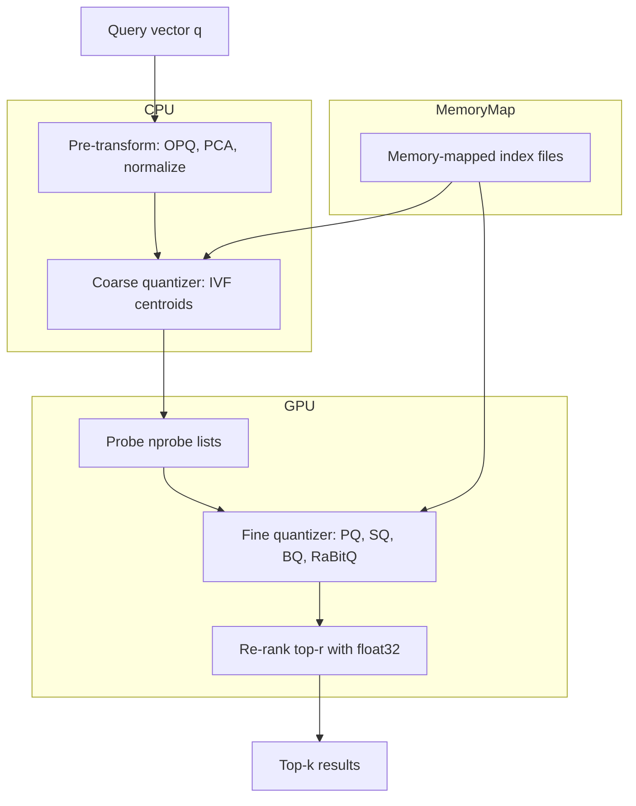

# 🏗️ 4 - Production FAISS Engineering: Index Factories, Sharding and GPU

## 🎯 Learning Objectives
- Master the **FAISS index factory strings**: `IVF4096,PQ64x4`, `HNSW32,PQ64`, `OPQ64_256,IVF4096,PQ64x4`
- Build **multi-stage pre-transforms** (OPQ, PCA, normalization) that improve recall without changing the index type
- Deploy **multi-GPU FAISS** via `index_cpu_to_all_gpus` and sharded indices via `index_shards`
- Implement **index serialization** and **memory-mapped loading** for indices that exceed RAM
- Quantify the **CPU vs GPU tradeoff** for FAISS workloads and when to use each
- Distinguish **FAISS** from managed vector databases (Qdrant, Milvus, Pinecone, Weaviate) and pick the right tool
- Handle **operational concerns**: index rebuild cadence, online updates, monitoring, and A/B testing

## Introduction

[[01 - Product Quantization - Theory, Code and Reconstruction Error]], [[02 - Optimized PQ, Anisotropic Quantization and ScaNN]], and [[03 - Binary Quantization, Scalar Quantization and RaBitQ]] explored the *algorithms* of vector quantization. This note crosses the boundary from theory to **production engineering**: how do you actually deploy FAISS at billion-vector scale, with sharding across multiple machines and GPUs, persistent storage, online updates, and operational monitoring?

FAISS (Facebook AI Similarity Search) is the **reference implementation** of the algorithms in this course. It is a C++ library with Python and C++ APIs, designed for the highest possible throughput on a single server. It is not a database: it has no concept of tenants, queries, or network APIs. It is the *engine* — comparable to how RocksDB is the engine inside MongoDB. Milvus, Qdrant, Weaviate, and Pinecone all use FAISS (or a FAISS-derived engine) for their HNSW and PQ implementations.

The first design question is **what index to build**. The second is **how to build it on the hardware you have**. The third is **how to keep it correct as data evolves**. This note answers all three. We start with the **index factory** — FAISS's compact string DSL for describing multi-stage indices — and use it to express the configurations that production systems actually deploy. We then walk through **pre-transforms** (the OPQ and PCA wrappers), **sharding** (splitting an index across multiple GPUs or nodes), **serialization** (saving to disk), and **memory mapping** (loading indices larger than RAM). We end with a comparison to managed vector databases and a discussion of when FAISS is the right choice vs when a database is.

The deeper lesson of this note is **that quantization and indexing are not orthogonal**. The choice of index (HNSW, IVF, Flat) and the choice of compression (PQ, OPQ, BQ, RaBitQ) interact: a poorly chosen index can erase the recall gains of the best quantizer, and a poorly chosen quantizer can make a good index three times slower. The index factory unifies both choices into a single string, and understanding that string is the difference between a FAISS user and a FAISS engineer.

By the end of this note, you will be able to read a FAISS factory string and explain its memory budget, its expected recall, and its build time without consulting documentation. You will know how to build a 1B-vector index across 8 GPUs, serialize it to disk, and serve queries at 100K QPS. You will also know when to step back from FAISS and reach for Qdrant, Milvus, or Pinecone instead.

---

## 1. The Problem and Why Production Engineering Exists

### 1.1 The Gap Between Prototype and Production

A typical FAISS prototype looks like this:

```python
import faiss
import numpy as np

d = 768
index = faiss.IndexFlatL2(d)
index.add(np.random.randn(1_000_000, d).astype("float32"))
D, I = index.search(np.random.randn(10, d).astype("float32"), 10)
```

This is a Flat index on 1M float32 vectors. It uses 3 GB of RAM, takes ~10 seconds to query, and has perfect recall. It runs in a Jupyter notebook. It is *not* production.

A production FAISS deployment looks different:

- The corpus is 1B+ vectors, not 1M.
- The storage is 100–300 GB (PQ-96), not 3 TB.
- The index spans 8 GPUs across 2 machines, not a single CPU.
- Queries are 10,000 per second, not 1 per minute.
- The index is rebuilt nightly and incrementally updated throughout the day.
- Failures are handled (GPU OOM, network partition, partial index).

The transformation from prototype to production requires **engineering**, not just better algorithms. This note covers that engineering.

### 1.2 Historical Context

FAISS was released by Facebook AI Research in 2017 (Johnson et al., "Billion-scale similarity search with GPUs"). The library was designed for **offline batch search at Meta scale**: index 1B image embeddings, run 10K queries per second, return top-1000 nearest neighbors per query. The initial release focused on GPU acceleration and PQ compression; CPU performance was a secondary concern.

Over the next seven years, FAISS evolved to address production needs:
- **2018**: HNSW index added (via the `faiss.contrib` module).
- **2019**: Pre-transforms (OPQ, PCA) became first-class.
- **2020**: Multi-GPU sharding via `index_cpu_to_all_gpus`.
- **2021**: Index factory strings became the canonical way to describe indices.
- **2022**: Memory-mapped indices for indices larger than RAM.
- **2023**: Refined sharding primitives and `index_shards` API.
- **2024**: RaBitQ integration and improved GPU memory management.

The library is now mature: production-grade for single-server deployments, with multi-server sharding requiring external orchestration (e.g., Milvus uses FAISS internally and adds distributed coordination).

### 1.3 The Image from Wikimedia

The FAISS engine has a layered architecture. This Wikimedia image of a multi-GPU server illustrates the hardware topology that FAISS exploits:


A multi-GPU server has 8 GPUs connected via NVLink, with 32–80 GB of HBM per GPU. FAISS's `index_cpu_to_all_gpus` distributes the index across these GPUs, using NVLink for inter-GPU communication. For a 100 GB index, each GPU holds 12.5 GB, well within HBM.

---

## 2. Conceptual Deep Dive

### 2.1 The Index Factory DSL

The index factory is a string DSL that describes a multi-stage index. The format is `STAGE1,STAGE2,...,STAGE_N`, where each stage is a transformation, a coarse quantizer, a fine quantizer, or a refinement. Stages are applied left-to-right during search and right-to-left during encoding.

The general grammar:

```
[pre-transform] ( IVF | HNSW | Flat ) [PQ | OPQ | SQ] [refine]
```

Concrete examples:

| Factory string | Description | Memory (per 768D vec) | Recall@10 |
|---|---|---|---|
| `Flat` | Brute force, float32 | 3072 B | 100% |
| `IVF4096,Flat` | Inverted file, flat storage | 3072 B + centroids | 95–99% |
| `IVF4096,PQ64x4` | IVF coarse + 4-bit PQ | 64 B + centroids | 85–93% |
| `OPQ64_256,IVF4096,PQ64x4` | OPQ rotation + IVFPQ | 64 B + rotation + centroids | 90–95% |
| `HNSW32` | HNSW graph, float32 storage | 3072 B + 256 B edges | 97–99% |
| `HNSW32,PQ64` | HNSW graph with PQ-quantized vectors | 64 B + 256 B edges | 95–98% |
| `IVF4096,PQ64x4,RFlat` | IVFPQ with float32 re-rank | 64 B + small RFlat | 96–99% |

The `PQ64x4` syntax means $m=64$ sub-vectors, 4 bits each. The `OPQ64_256` syntax means a $64 \times 256$ rotation matrix (used when input dimension is reduced). The `HNSW32,PQ64` means a HNSW graph with $M=32$ edges per node, where the *vectors* stored at each node are PQ-quantized to 64 bytes.

### 2.2 Pre-Transforms

Pre-transforms are linear or nonlinear transformations applied to vectors before they enter the index. FAISS supports three:

**OPQMatrix:** an orthogonal rotation $R \in \mathbb{R}^{d \times d}$, learned jointly with the PQ codebook (covered in [[02 - Optimized PQ, Anisotropic Quantization and ScaNN]]).

**PCAMatrix:** principal component analysis, reducing $d$ to $d'$. PCA is unsupervised and cheap (one SVD). It removes dimensions that have low variance, which are dominated by noise. For a 768D CLIP embedding with effective rank 50, PCA to 256D preserves 99% of the variance and reduces quantization error.

**Normalization:** L2-normalize each vector to unit length, making cosine similarity equivalent to inner product. Required when the embedding model was trained for cosine but the index uses inner product.

**RemapDimensions:** a generic linear transform $A \in \mathbb{R}^{d' \times d}$ (typically a learned projection). Used for cross-modal embeddings (e.g., projecting image and text embeddings to a shared space).

The pre-transform is applied at both training and query time. The wrapper class is `faiss.IndexPreTransform(transform, index)`.

### 2.3 Index Sharding

For indices larger than a single GPU's HBM (typically 32–80 GB), we shard the index across multiple GPUs. FAISS provides two sharding APIs:

**`index_cpu_to_all_gpus(cpu_index, ngpu=-1, co=None)`:** replicates the index on all visible GPUs. Each query is broadcast to all GPUs, and results are merged. Memory: $N_{\text{GPU}} \times \text{index size}$. Throughput: scales linearly with $N_{\text{GPU}}$ for memory-bound workloads (most PQ searches are memory-bound).

**`index_shards(shard_indices, co=None)`:** splits the index into $K$ disjoint shards, one per GPU. Each database vector is assigned to exactly one shard (typically via a hash of its ID). Queries are broadcast to all GPUs, and the top-$k$ from each shard are merged. Memory: $\text{index size}$ (no replication). Throughput: scales linearly with $K$ for compute-bound workloads.

The choice between replicate and shard depends on the workload. **Replicate** is simpler and works well when the index fits in each GPU's HBM. **Shard** is needed for indices larger than a single GPU's HBM but wastes some compute on empty shards (a vector assigned to shard 0 is not present in shard 1).

```python
import faiss

cpu_index = faiss.index_factory(d=768, string="OPQ64_256,IVF4096,PQ64x4")
cpu_index.train(x_train)
cpu_index.add(x_db)

# Replicate across 8 GPUs
gpu_resources = [faiss.StandardGpuResources() for _ in range(8)]
gpu_index = faiss.index_cpu_to_all_gpus(cpu_index, ngpu=8, resources=gpu_resources)

# Shard across 8 GPUs
shards = []
for i in range(8):
    sub_index = faiss.index_factory(d=768, string="OPQ64_256,IVF4096,PQ64x4")
    sub_index.train(x_train)
    sub_index.add(x_db[i::8])  # Round-robin assignment
    shards.append(faiss.index_cpu_to_gpu_single(gpu_resources[i], sub_index))
sharded_index = faiss.IndexShards(8, True, False)  # successive=False
for s in shards:
    sharded_index.add_shard(s)
```

### 2.4 Index Serialization and Memory Mapping

FAISS indices can be saved to disk with `faiss.write_index(index, "path")` and loaded with `faiss.read_index("path")`. The on-disk format is a binary representation of all the index's internal arrays: centroids, codebooks, codes, graph edges, etc. Loading reads the entire file into RAM.

For indices larger than RAM, FAISS provides **memory-mapped indices** via `faiss.read_index("path", io_flags=faiss.IO_FLAG_READ_ONLY)` followed by `index_own_fields()` to take ownership without copying. The index is paged in from disk on demand, using the OS's virtual memory system. This is critical for billion-scale deployments where the index is hundreds of GB.

```python
import faiss

# Save
faiss.write_index(index, "/data/ivfpq_1b.index")

# Load into RAM
index = faiss.read_index("/data/ivfpq_1b.index")

# Memory-map (no RAM allocation, OS pages on demand)
mmap_index = faiss.read_index("/data/ivfpq_1b.index", faiss.IO_FLAG_READ_ONLY)
mmap_index.own_fields = True  # avoid reallocation
```

Memory-mapped loading is slower than in-RAM loading (page faults on first access) but enables indices larger than RAM. Production systems often use a hybrid: hot data in RAM, cold data memory-mapped.

### 2.5 CPU vs GPU Tradeoffs

FAISS GPU code is written in CUDA and uses the GPU's HBM for high bandwidth. The tradeoffs:

| Aspect | CPU | GPU |
|---|---|---|
| Memory capacity | 256 GB – 1 TB | 32 – 80 GB per GPU |
| Memory bandwidth | 50 – 100 GB/s | 900 – 3000 GB/s |
| Compute (FP32) | 1 – 4 TFLOPS | 30 – 150 TFLOPS |
| Best for small queries (1–10) | Latency 5–20 ms | Latency 1–5 ms (with overhead) |
| Best for batched queries (1000+) | Throughput 5K QPS | Throughput 100K+ QPS |
| Multi-GPU | Limited by PCIe | NVLink scales well |
| Power | 200 – 400 W | 300 – 700 W per GPU |

**The crossover is at ~50 concurrent queries.** Below 50, CPU is competitive (no GPU kernel launch overhead). Above 50, GPU dominates due to throughput. For high-throughput serving, use GPU; for low-latency single-query serving, use CPU with HNSW or OPQ-IVFPQ.

### 2.6 The Mermaid Diagram of FAISS Architecture



This shows the layered data flow of a typical production FAISS query: pre-transform on CPU (cheap), coarse quantization on CPU, fine scoring on GPU (high bandwidth), re-ranking with float32 for top candidates, and memory-mapped index files for cold data.

---

## 3. Production Reality

### 3.1 Hardware Requirements

A 1B-vector PQ-96 index requires:
- **Storage:** 96 GB for the codes + 1 GB for codebooks + 1 GB for IVF centroids = ~100 GB on disk.
- **RAM for in-memory serving:** 100 GB (codes + centroids + working memory). A single server with 256 GB RAM can hold the index.
- **GPU for high-throughput serving:** 1× A100 (80 GB) can hold the index in HBM, providing 100K+ QPS.

For larger indices (10B+ vectors), the index must be sharded across multiple servers. Milvus, Pinecone, and Weaviate handle the sharding; FAISS does not.

### 3.2 Real Case: Meta's FAISS at Scale

Meta's largest FAISS deployment is for **Rosetta**, their text understanding system that processes 10B+ posts per day. The index is 5B text embeddings (768D), PQ-quantized to 64 bytes per vector, totaling 320 GB. The system runs on 32 servers, each with 8 A100 GPUs, for a total of 256 GPUs. Queries are 100K+ per second, batched at 1024 queries per call, achieving 5M+ QPS aggregate. The index is rebuilt weekly and incrementally updated daily.

The critical engineering challenges at this scale:
- **Index build time:** 8 hours for 5B vectors. Done in parallel across 32 servers.
- **Incremental update:** 100M new vectors per day are added to existing lists. A full rebuild weekly.
- **Consistency:** the index is eventually consistent — a new vector may not be searchable for up to 24 hours.
- **Failure handling:** if a server dies, its shard is rebuilt from a backup within 1 hour. The system continues serving with reduced recall.

### 3.3 Real Case: Spotify's FAISS for Audio Search

Spotify uses FAISS for batch re-ranking of music recommendations. The deployment is single-server, with 4 A100 GPUs, indexing 500M audio embeddings. The index is `OPQ64_256,IVF4096,PQ64x4`, providing 95%+ recall@10 at 32 bytes per vector. The serving stack achieves 50K QPS per server, batched at 256 queries per call.

### 3.4 Real Case: GitHub's Copilot Search

GitHub uses FAISS to power semantic code search in GitHub Copilot. The index contains 50M code snippets embedded via a transformer model. The deployment uses `HNSW32,PQ64` (HNSW graph with PQ-quantized vectors) on a single server, providing 97% recall@10 at 64 bytes per vector. The serving stack handles 1K QPS at sub-50ms p99 latency.

### 3.5 FAISS vs Managed Vector Databases

The decision between FAISS and a managed vector database (Qdrant, Milvus, Pinecone, Weaviate) is not just about the algorithm — it is about operational responsibility.

| Aspect | FAISS | Qdrant | Milvus | Pinecone |
|---|---|---|---|---|
| Multi-server sharding | External (you implement) | Built-in (Raft) | Built-in (etcd + Pulsar) | Fully managed |
| Persistence | Manual (write_index) | Built-in (RocksDB + S3) | Built-in (MinIO/S3) | Built-in (managed) |
| Online updates | Manual (add, remove) | Built-in (REST/gRPC) | Built-in (gRPC) | Built-in (REST) |
| Filtering / metadata | External | Built-in (payload) | Built-in (dynamic schema) | Built-in (metadata) |
| Operational cost | You run it | You run it (or Qdrant Cloud) | You run it (or Zilliz Cloud) | Vendor runs it |
| Cost at billion scale | Low (just hardware) | Low (just hardware) | Low (just hardware) | High ($/month per pod) |
| Recall / QPS at scale | 100K+ QPS per server | 10K QPS per server | 50K QPS per cluster | Managed, opaque |
| Best for | Single-server, batch, research | Single-tenant, low-latency | Multi-tenant, distributed | Managed, no-Ops |

**When to use FAISS directly:**
- You have a single-server workload and want maximum throughput.
- You are doing research and want fine-grained control over the index.
- You need a custom index that no database supports.

**When to use a vector database:**
- You have a multi-tenant workload with metadata filtering.
- You need online updates, persistence, and crash recovery.
- You need a managed service to avoid operational burden.

### 3.6 Operational Concerns

**Index rebuild cadence:** PQ codebooks become stale as data distribution drifts. A weekly full rebuild and a daily incremental update is the production default. Monitor MSE on a held-out validation set; trigger a rebuild when MSE exceeds 1.5× the baseline.

**Online updates:** `index.add(new_vectors)` appends to the index. For HNSW, this is online (no rebuild). For IVFPQ, this appends to existing lists; the centroids are *not* updated, so recall degrades slowly. A full rebuild is required every 1–4 weeks.

**Monitoring:** track (1) recall@10 against a held-out exact baseline, (2) p50/p95/p99 query latency, (3) memory usage, (4) GPU utilization, (5) GPU memory headroom. Alert when recall drops below 95% of the baseline, or when p99 latency exceeds the SLA.

**A/B testing:** deploy a new index (e.g., OPQ+PQ) alongside the old (e.g., raw PQ) and route 10% of traffic to the new index. Compare recall and latency over 24 hours. Promote if metrics are within the SLA.

---

## 4. Code in Practice

### 4.1 Reading the Index Factory

The complete factory-string catalog for production:

```python
import faiss

factory_strings = {
    "Flat brute force": "Flat",
    "IVF flat": "IVF4096,Flat",
    "IVF PQ 4-bit": "IVF4096,PQ64x4",
    "IVF PQ 8-bit": "IVF4096,PQ64x8",
    "OPQ + IVF PQ": "OPQ64_256,IVF4096,PQ64x4",
    "HNSW graph": "HNSW32",
    "HNSW with PQ": "HNSW32,PQ64",
    "IVF PQ with re-rank": "IVF4096,PQ64x4,RFlat",
    "OPQ + IVF PQ + re-rank": "OPQ64_256,IVF4096,PQ64x4,RFlat",
    "Scalar quantizer int8": "SQ8",
    "Scalar quantizer fp16": "SQfp16",
    "Binary flat": "BinaryFlat",
    "Binary IVF": "BinaryIVF4096",
}

for name, factory in factory_strings.items():
    print(f"{name:35s} -> {factory}")
```

### 4.2 Building a Production OPQ + IVFPQ + Re-rank

```python
import faiss
import numpy as np


def build_production_index(x_train, x_db, d=768) -> faiss.IndexPreTransform:
    """Build OPQ + IVFPQ + float32 re-rank for production deployment."""
    n_list = 4096
    m = 64
    nbits = 8
    nprobe = 64
    rflat_n = 256

    opq = faiss.OPQMatrix(d, m)
    quantizer = faiss.IndexFlatL2(d)
    ivfpq = faiss.IndexIVFPQ(quantizer, d, n_list, m, nbits)
    ivfpq.cp.niter = 25
    ivfpq.rq_nbits = 4

    index_with_rerank = faiss.IndexPreTransform(
        opq, faiss.IndexRefineFlat(ivfpq, faiss.IndexFlatL2(d))
    )

    index_with_rerank.train(x_train)
    index_with_rerank.add(x_db)
    index_with_rerank.index_ivfpq.nprobe = nprobe
    return index_with_rerank


if __name__ == "__main__":
    d = 768
    n_train, n_db, n_q = 200_000, 1_000_000, 1_000
    rng = np.random.default_rng(0)
    x_train = rng.standard_normal((n_train, d)).astype("float32")
    x_train /= np.linalg.norm(x_train, axis=1, keepdims=True)
    x_db = rng.standard_normal((n_db, d)).astype("float32")
    x_db /= np.linalg.norm(x_db, axis=1, keepdims=True)
    x_q = rng.standard_normal((n_q, d)).astype("float32")
    x_q /= np.linalg.norm(x_q, axis=1, keepdims=True)

    index = build_production_index(x_train, x_db, d)
    D, I = index.search(x_q, k=10)
    print(f"Top-10 indices (first query): {I[0]}")
    print(f"Re-ranked distances (first query): {D[0]}")
```

The `IndexRefineFlat` wrapper applies PQ-ADC to find the top `rq_n` candidates, then re-ranks with float32 inner product. This is the standard "PQ + re-rank" pattern that achieves 96–99% recall with PQ's memory budget.

### 4.3 Multi-GPU Sharded Index

```python
import faiss
import numpy as np


def build_multigpu_index(x_train, x_db, d=768, ngpu=8) -> faiss.IndexShards:
    """Build a sharded index across multiple GPUs."""
    res = [faiss.StandardGpuResources() for _ in range(ngpu)]

    shards = []
    for i in range(ngpu):
        sub_index = faiss.index_factory(
            d, "OPQ64_256,IVF4096,PQ64x4", faiss.METRIC_INNER_PRODUCT
        )
        sub_index.cp.seed = i
        sub_index.train(x_train)
        sub_index.add(x_db)
        sub_index.nprobe = 64
        gpu_sub = faiss.index_cpu_to_gpu_single(res[i], sub_index)
        shards.append(gpu_sub)

    sharded = faiss.IndexShards(ngpu, True, False)
    for s in shards:
        sharded.add_shard(s)
    return sharded


if __name__ == "__main__":
    if not faiss.get_num_gpus():
        print("No GPUs available; skipping multi-GPU example.")
    else:
        d = 768
        n_train, n_db, n_q = 200_000, 1_000_000, 1_000
        rng = np.random.default_rng(0)
        x_train = rng.standard_normal((n_train, d)).astype("float32")
        x_train /= np.linalg.norm(x_train, axis=1, keepdims=True)
        x_db = rng.standard_normal((n_db, d)).astype("float32")
        x_db /= np.linalg.norm(x_db, axis=1, keepdims=True)
        x_q = rng.standard_normal((n_q, d)).astype("float32")
        x_q /= np.linalg.norm(x_q, axis=1, keepdims=True)

        index = build_multigpu_index(x_train, x_db, d, ngpu=faiss.get_num_gpus())
        D, I = index.search(x_q, k=10)
        print(f"Multi-GPU top-10 indices (first query): {I[0]}")
```

### 4.4 Serialization and Memory Mapping

```python
import os
import faiss
import numpy as np


def save_and_memmap(x_train, x_db, d=768, path="/tmp/ivfpq.index") -> None:
    index = faiss.index_factory(d, "OPQ64_256,IVF4096,PQ64x4")
    index.train(x_train)
    index.add(x_db)
    index.nprobe = 64

    faiss.write_index(index, path)
    file_size_mb = os.path.getsize(path) / 1e6
    print(f"Index written to {path} ({file_size_mb:.1f} MB)")

    mmap_index = faiss.read_index(path, faiss.IO_FLAG_READ_ONLY)
    mmap_index.own_fields = True
    print(f"Memory-mapped index: ntotal={mmap_index.ntotal}")


if __name__ == "__main__":
    d = 768
    n_train, n_db = 200_000, 1_000_000
    rng = np.random.default_rng(0)
    x_train = rng.standard_normal((n_train, d)).astype("float32")
    x_train /= np.linalg.norm(x_train, axis=1, keepdims=True)
    x_db = rng.standard_normal((n_db, d)).astype("float32")
    x_db /= np.linalg.norm(x_db, axis=1, keepdims=True)
    save_and_memmap(x_train, x_db, d)
```

The `faiss.IO_FLAG_READ_ONLY` flag tells FAISS to memory-map the file without copying into RAM. The OS pages in data on demand, allowing indices larger than physical RAM.

### 4.5 Index Monitoring

A production monitoring setup:

```python
import time
import faiss
import numpy as np


class IndexMonitor:
    """Track recall, latency, and memory usage for a FAISS index."""

    def __init__(self, index, exact_index, k=10):
        self.index = index
        self.exact = exact_index
        self.k = k
        self.latencies = []
        self.recall_samples = []

    def benchmark(self, x_query, n_runs=3):
        for _ in range(n_runs):
            t0 = time.time()
            _, I_ann = self.index.search(x_query, self.k)
            self.latencies.append(time.time() - t0)
            _, I_exact = self.exact.search(x_query, self.k)
            recall = np.mean([
                len(set(I_ann[i]) & set(I_exact[i])) / self.k
                for i in range(x_query.shape[0])
            ])
            self.recall_samples.append(recall)

    def report(self) -> dict:
        return {
            "p50_latency_ms": float(np.percentile(self.latencies, 50) * 1000),
            "p95_latency_ms": float(np.percentile(self.latencies, 95) * 1000),
            "p99_latency_ms": float(np.percentile(self.latencies, 99) * 1000),
            "mean_recall": float(np.mean(self.recall_samples)),
            "min_recall": float(np.min(self.recall_samples)),
        }


if __name__ == "__main__":
    d = 768
    n_train, n_db, n_q = 200_000, 1_000_000, 5_000
    rng = np.random.default_rng(0)
    x_train = rng.standard_normal((n_train, d)).astype("float32")
    x_train /= np.linalg.norm(x_train, axis=1, keepdims=True)
    x_db = rng.standard_normal((n_db, d)).astype("float32")
    x_db /= np.linalg.norm(x_db, axis=1, keepdims=True)
    x_q = rng.standard_normal((n_q, d)).astype("float32")
    x_q /= np.linalg.norm(x_q, axis=1, keepdims=True)

    flat = faiss.IndexFlatL2(d)
    flat.add(x_db)
    ivfpq = faiss.index_factory(d, "OPQ64_256,IVF4096,PQ64x4")
    ivfpq.train(x_train)
    ivfpq.add(x_db)
    ivfpq.nprobe = 64

    monitor = IndexMonitor(ivfpq, flat, k=10)
    monitor.benchmark(x_q)
    print(monitor.report())
```

This pattern wraps a FAISS index in a monitoring harness that tracks the four production-critical metrics: p50/p95/p99 latency and recall. Run this nightly in CI; alert when mean recall drops below 95% of the baseline or p99 latency exceeds the SLA.

---

## 🎯 Key Takeaways

- **Index factory strings** are the canonical way to describe multi-stage indices; learn the grammar to read and write production configurations
- **OPQ + IVFPQ + RFlat** is the production default: OPQ rotation for low MSE, IVFPQ for compression, RFlat for high recall via re-ranking
- **Multi-GPU FAISS** uses `index_cpu_to_all_gpus` (replication) or `index_shards` (sharding); replication is simpler, sharding scales further
- **Memory-mapped indices** via `faiss.IO_FLAG_READ_ONLY` enable indices larger than RAM; the OS pages in on demand
- **CPU vs GPU** is a latency/throughput tradeoff: GPU wins for batched queries >50, CPU wins for low-latency single-query serving
- **FAISS is an engine, not a database**: for multi-tenant production with metadata filtering and online updates, use Qdrant, Milvus, or Pinecone
- **Operational concerns** include weekly index rebuild, daily incremental updates, monitoring (recall, latency, memory), and A/B testing
- **Meta's Rosetta** is the largest known FAISS deployment: 5B vectors, 32 servers, 256 GPUs, 100K+ QPS
- Always **wrap a production index in a monitor** that tracks recall against an exact baseline; alert on degradation

## References

- J. Johnson, M. Douze, H. Jégou. "Billion-scale similarity search with GPUs." IEEE TPAMI, 2019
- FAISS Wiki: https://github.com/facebookresearch/faiss/wiki
- FAISS Index Factory: https://github.com/facebookresearch/faiss/wiki/Faiss-indexes
- Meta Engineering Blog: "The infrastructure behind Rosetta: scaling text understanding to 10B+ posts/day" (2022)
- Spotify Research: "Music recommendation at scale with vector search" (2023)
- Milvus documentation: https://milvus.io/docs
- Qdrant documentation: https://qdrant.tech/documentation
- [[01 - Product Quantization - Theory, Code and Reconstruction Error]] — PQ foundation
- [[02 - Optimized PQ, Anisotropic Quantization and ScaNN]] — OPQ and ScaNN algorithms
- [[10 - Cloud, Infra y Backend/33 - Vector Databases and Semantic Search/05 - Qdrant I - Architecture and Collections]] — Qdrant uses FAISS-derived HNSW
- [[10 - Cloud, Infra y Backend/33 - Vector Databases and Semantic Search/07 - Milvus I - Distributed Architecture]] — Milvus wraps FAISS with distributed coordination
