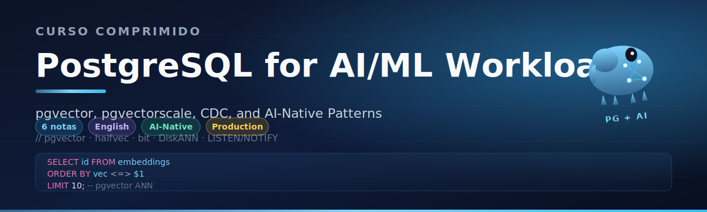

# 🏷️ Welcome to PostgreSQL for AI/ML Workloads

## 🎯 Learning Objectives
- Understand why PostgreSQL has become the default operational database for AI/ML engineering teams
- Identify the 2024–2026 inflection point where pgvector matured enough to displace dedicated vector databases at the mid-scale
- Map the prerequisite vault notes and the learning progression from fundamentals to production
- Recognize the production-grade patterns this course covers: HNSW tuning, quantization, hybrid search, CDC, and feature stores
- Decide when to stay on Postgres and when to graduate to a dedicated vector engine

## Introduction

PostgreSQL stopped being "just a relational database" the moment `pgvector` reached 0.5.0 in 2023. By 2026, the conversation has flipped entirely: the question is no longer "should we use a vector database?" but "do we need to leave Postgres for one?" The answer for the vast majority of AI/ML teams — startups running semantic search, mid-size companies powering RAG, enterprises with hybrid transactional + embedding workloads — is **no, not yet**. Postgres, with pgvector and its growing ecosystem of extensions, handles 1M–10M vectors per node with predictable latency, ACID guarantees, and zero extra operational burden.

This course assumes you already know the basics covered in [[10 - Cloud, Infra y Backend/25 - Bases de Datos y Message Queues/01 - PostgreSQL Avanzado]] (Spanish) and [[10 - Cloud, Infra y Backend/33 - Vector Databases and Semantic Search/03 - pgvector I - Core Operations and Indexing]] / [[04 - pgvector II - Production and Hybrid Search]] (English). The first teaches the core Postgres engine: B-Tree, GIN, GiST, EXPLAIN, MVCC. The second and third introduce pgvector from install to hybrid search at practitioner level. **This course goes deeper.** We focus on production-grade tuning: HNSW parameters that matter, the new `halfvec` and `bit` quantization types, pgvectorscale's DiskANN indexes, advanced operational patterns like LISTEN/NOTIFY, logical replication for CDC, and building an end-to-end ML feature store on Postgres.

The 2024–2026 reality is that three forces converged to make Postgres the default. First, **pgvector's algorithmic maturity** — HNSW performance caught up with dedicated libraries like Faiss, and the new iterative scan and quantization-aware features closed the recall gap. Second, **the rise of Lakehouse-Postgres hybrids** — Neon, Supabase, Timescale Cloud, and AWS RDS/Aurora all ship pgvector out of the box with managed backups, point-in-time recovery, and read replicas. Third, **the feature store renaissance** — Feast, the open-source feature store, supports Postgres as a first-class offline store, and online feature stores increasingly rely on pgvector for embedding features. If you are an AI/ML engineer in 2026, Postgres fluency is not optional.

---

## 1. Why This Course Exists

The ML infrastructure landscape of 2026 is fragmented. A typical RAG application might touch five different storage systems: a transactional Postgres for users and orders, a vector database for embeddings, a Redis for caching, a data warehouse for analytics, and a feature store for ML features. Each one is another deployment, another backup policy, another connection pool, another security audit. The hidden cost is not the infrastructure bill — it is the **engineer hours** spent keeping five systems consistent.

Postgres consolidates three of those five: transactional data, vector embeddings, and time-series ML features. The remaining two (Redis for ephemeral cache, a warehouse for long-horizon analytics) are typically lighter weight to operate. The thesis of this course is simple: **for 80% of AI/ML teams, Postgres is enough, and the operational savings of consolidating storage compounds as the team grows.**

The remaining 20% — billion-scale vector search, sub-10ms p99 latency at millions of QPS, multi-region vector replication — genuinely need specialized systems like Qdrant, Milvus, or Pinecone. We cover the **breakeven analysis** in Note 02 so you know which side of that line you are on.

*PostgreSQL, the world's most advanced open-source relational database, is now also a production-grade vector database.*

## 2. Course Roadmap

| Note | Topic | Depth |
|---|---|---|
| 00 | Welcome (this note) | Context and prerequisites |
| 01 | pgvector Production Tuning | HNSW parameters, `halfvec`, `bit`, iterative scan, hybrid search with RRF |
| 02 | pgvector vs Dedicated Vector DBs | Cost equation, breakeven analysis, TCO math, real case studies |
| 03 | pgvectorscale, DiskANN, Timescale | StreamingDiskANN, SIFT index, time-series + embeddings |
| 04 | Advanced Postgres Patterns for ML | LISTEN/NOTIFY, pg_stat_statements, logical replication, CDC, pooling |
| 05 | Capstone: End-to-End ML Feature Store | Online + offline features, Feast integration, Docker compose |

## 3. Prerequisites

Before starting, ensure you are comfortable with:

- **Core SQL and PostgreSQL fundamentals** — covered in [[10 - Cloud, Infra y Backend/25 - Bases de Datos y Message Queues/01 - PostgreSQL Avanzado]] (Spanish). This is a *required* prerequisite. We will not re-teach MVCC, B-Trees, GIN indexes, or `EXPLAIN ANALYZE`.
- **pgvector basics** — install, `vector(n)` type, distance operators, basic HNSW indexes. Covered in [[10 - Cloud, Infra y Backend/33 - Vector Databases and Semantic Search/03 - pgvector I - Core Operations and Indexing]] and [[04 - pgvector II - Production and Hybrid Search]].
- **Vector search theory** — recall vs precision, ANN vs kNN, embedding models. Covered in [[10 - Cloud, Infra y Backend/33 - Vector Databases and Semantic Search/01 - Vector Search Fundamentals]] and [[02 - Indexing Algorithms Deep Dive]].
- **Docker and Python** — for the capstone. See [[10 - Cloud, Infra y Backend/15 - Docker and Kubernetes]] (if present) or equivalent.
- **Basic ML concepts** — what an embedding is, how RAG works, what a feature store is. See [[10 - Cloud, Infra y Backend/26 - Databricks for ML]] or [[10 - Cloud, Infra y Backend/31 - FastAPI for ML]].

## 4. The 2024–2026 Inflection Point

Three developments turned Postgres into a serious vector contender:

1. **pgvector 0.7.0 (late 2024)** introduced `halfvec` (float16) and `bit` (binary quantization) types, plus iterative scan and parallel index builds. Memory footprint dropped by 50% (`halfvec`) to 96% (`bit`) with tunable recall loss.
2. **pgvectorscale by Timescale (2024)** added ScaNN-inspired and DiskANN indexes, pushing the practical scale from ~10M to ~100M+ vectors per node at sub-10ms p95 latency.
3. **Managed Postgres + pgvector** became a one-click install on Neon, Supabase, Timescale Cloud, AWS RDS, AWS Aurora, Google Cloud SQL, Azure Database, and Crunchy Bridge. The operational cost of running pgvector collapsed to zero for most teams.

The cumulative effect: a team that previously needed a dedicated vector DB plus a transactional DB plus a feature store can now run all three on one Postgres cluster. The savings are not just dollars — they are **fewer consistency bugs, simpler disaster recovery, and one security model**.

## 5. Who This Course Is For

This course targets AI/ML engineers, ML platform engineers, and backend engineers who:

- Build RAG applications, semantic search, or recommendation systems
- Operate production Postgres at scale and want to consolidate their stack
- Are evaluating pgvector against Qdrant, Milvus, or Pinecone for a new project
- Need to build a feature store on top of an existing Postgres deployment
- Want to understand CDC, logical replication, and advanced operational patterns specific to ML workloads

It is **not** a beginner's course. We assume you have shipped Postgres to production at least once and have basic familiarity with embeddings.

---

## 🎯 Key Takeaways

- Postgres is the default operational database for AI/ML engineering teams in 2026, not because it is the best at any one thing, but because it is good enough at many things to consolidate the stack.
- This course goes deeper than [[10 - Cloud, Infra y Backend/33 - Vector Databases and Semantic Search/03 - pgvector I - Core Operations and Indexing]] and [[04 - pgvector II - Production and Hybrid Search]] — those notes teach pgvector at practitioner level; this one teaches production-grade tuning and advanced patterns.
- Prerequisites: Spanish-language [[10 - Cloud, Infra y Backend/25 - Bases de Datos y Message Queues/01 - PostgreSQL Avanzado]] for Postgres fundamentals, and English-language [[10 - Cloud, Infra y Backend/33 - Vector Databases and Semantic Search/03 - pgvector I - Core Operations and Indexing]] for pgvector basics.
- The 2024–2026 inflection point was driven by pgvector 0.7+ (halfvec, bit, iterative scan), pgvectorscale (DiskANN), and managed Postgres offerings.
- We cover 6 notes from HNSW tuning through to a complete end-to-end ML feature store capstone.

## References

- [[10 - Cloud, Infra y Backend/25 - Bases de Datos y Message Queues/01 - PostgreSQL Avanzado]] — Spanish-language Postgres fundamentals
- [[10 - Cloud, Infra y Backend/33 - Vector Databases and Semantic Search/03 - pgvector I - Core Operations and Indexing]] — pgvector basics
- [[10 - Cloud, Infra y Backend/33 - Vector Databases and Semantic Search/04 - pgvector II - Production and Hybrid Search]] — pgvector production patterns
- [[10 - Cloud, Infra y Backend/33 - Vector Databases and Semantic Search/09 - Vector Database Comparison Matrix]] — referenced from Note 02
- pgvector GitHub: https://github.com/pgvector/pgvector
- Timescale pgvectorscale announcement: https://www.timescale.com/blog/pgvector-is-now-as-fast-as-pinecone-at-75-less-cost/
- PostgreSQL official documentation: https://www.postgresql.org/docs/
