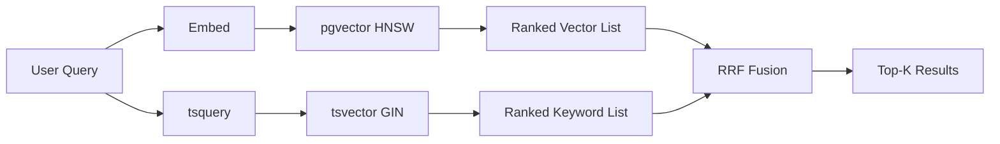

# 🏷️ pgvector Production Tuning: HNSW, Quantization and Hybrid Search

## 🎯 Learning Objectives
- Master the three HNSW parameters that actually matter in production: `m`, `ef_construction`, and `ef_search`
- Understand the new `halfvec` (float16) and `bit` (binary) quantization types introduced in pgvector 0.7+
- Implement iterative scan to fix the catastrophic recall collapse on filtered queries
- Use parallel HNSW builds to cut index construction time by 4–8×
- Combine pgvector with `tsvector` and Reciprocal Rank Fusion for production-grade hybrid search
- Make principled tradeoffs between memory, recall, latency, and build time

## Introduction

The [[10 - Cloud, Infra y Backend/33 - Vector Databases and Semantic Search/03 - pgvector I - Core Operations and Indexing|pgvector I]] and [[10 - Cloud, Infra y Backend/33 - Vector Databases and Semantic Search/04 - pgvector II - Production and Hybrid Search|pgvector II]] notes taught you the basics: install the extension, create a `vector(768)` column, build an HNSW index, query with `<->`. That gets you a working semantic search on 100K vectors. It does not get you to production at 10M vectors with 50ms p99 latency and 95% recall@10. **That is the gap this note fills.**

Production pgvector tuning sits at the intersection of three forces: the **HNSW graph structure** (controlled by `m` and `ef_construction`), the **search-time exploration depth** (`ef_search`), and the **vector representation** (`vector` float32, `halfvec` float16, or `bit` binary). Each axis trades memory for recall, recall for latency, or latency for build time. Get them right and pgvector competes with Pinecone on the same hardware. Get them wrong and you'll have a 40 GB index that returns the wrong answers in 800 ms.

The 2024–2025 releases of pgvector (0.7.0, 0.7.4, 0.8.0) fundamentally changed the production playbook. The `halfvec` type cuts memory in half with negligible recall loss. The `bit` type cuts memory by 32× with the well-known recall hit. **Iterative scan** finally solved the long-standing problem of filtered queries returning fewer rows than requested. Parallel HNSW builds, introduced in 0.6.0 and stabilized in 0.7, made it practical to rebuild a 50M-vector index over a weekend instead of a week. This note is a comprehensive guide to using all of them.

---

## 1. The Problem and Why This Solution Exists

In 2021, pgvector launched with a single index type: IVFFlat. It was slow, recall was unstable, and rebuilding the index on data changes was painful. Teams running RAG at scale wrote pgvector off and moved to Pinecone, Weaviate, or Qdrant. Then in 2023, pgvector 0.5.0 added **HNSW** (Hierarchical Navigable Small World, see [[10 - Cloud, Infra y Backend/33 - Vector Databases and Semantic Search/02 - Indexing Algorithms Deep Dive]]) and the conversation changed. HNSW gives O(log n) query time, supports incremental inserts, and matches Faiss-quality recall when tuned correctly.

But HNSW alone was not enough. Three problems remained:

**Problem 1: Memory cost.** A single `vector(1536)` (OpenAI `text-embedding-3-small` dimensions) consumes 6 KB (4 bytes per float × 1536). One million such vectors plus HNSW graph overhead (typically 2× the raw vector size) consumes ~12 GB of RAM if you want the hot path served from cache. Ten million vectors push you past 120 GB, which is a non-trivial server.

**Problem 2: Filtered query recall collapse.** The original HNSW implementation returned the top-`ef_search` candidates and then filtered them by `WHERE category = 'X'`. If the filter selectivity was low (say, 1% of rows matched), you'd often get back 2 rows when you asked for 10. The pre-filter / post-filter dilemma was a known weakness of every HNSW implementation, not just pgvector.

**Problem 3: Hybrid search.** Pure vector search misses exact matches (a query for "iPhone 15 Pro" should not return "iPhone 14 Pro" just because they're cosine-similar). Pure keyword search misses semantic synonyms (a query for "laptop" should return "notebook computer"). Combining the two requires fusion logic that pgvector did not natively provide.

The 2024–2025 pgvector releases addressed all three:

| Problem | Solution | pgvector version |
|---|---|---|
| Memory cost | `halfvec` (float16), `bit` (binary), `sparsevec` | 0.7.0 |
| Filter recall | Iterative scan (`hnsw.iterative_scan`) | 0.8.0 |
| Hybrid search | `tsvector` GIN index + RRF fusion in SQL | always possible, now idiomatic |
| Build time | Parallel HNSW build | 0.6.0+ |

The official PostgreSQL documentation describes the index access methods architecture that makes this extensibility possible:


(For a visual reference of the wider PostgreSQL extension ecosystem and how pgvector slots into it, see the architecture diagrams in [[10 - Cloud, Infra y Backend/25 - Bases de Datos y Message Queues/01 - PostgreSQL Avanzado]].)

## 2. Conceptual Deep Dive

### 2.1 HNSW Parameters That Actually Matter

HNSW builds a layered graph. Each node sits in layer 0 (the full graph); a random fraction also appears in layer 1, fewer in layer 2, and so on, geometrically. Queries enter at the top layer, greedily walk toward the query vector, then descend. The structure is governed by three parameters:

**`m` (max connections per node, default 16).** This is the maximum out-degree of any node at any layer above layer 0 (layer 0 allows `2m`). Higher `m` = denser graph = better recall, but linearly more memory and slower build. Production values: `16` for general use, `24–32` for hard datasets (clustered embeddings, high dimensionality, low recall targets), `8` for memory-constrained deployments where you accept ~2–3% recall loss.

**`ef_construction` (build-time exploration, default 64).** During index construction, when inserting a new node, HNSW does a beam search with width `ef_construction` to find the best `m` neighbors. Higher = better graph quality = better recall, at the cost of build time (roughly linear). Production values: `64` (default) for fast builds, `128–200` for production indexes, `400+` for hard problems. **You cannot change `m` or `ef_construction` after build time** — they require a `REINDEX`.

**`ef_search` (query-time exploration, default 40).** This is the beam width at query time. Higher = better recall, slower queries. Crucially, this is a **runtime** parameter you can set per session: `SET hnsw.ef_search = 100`. Production tuning: start at 40, increase by 20 until recall@10 plateaus.

The recall-latency curve follows roughly:

$$\text{recall}(ef) \approx 1 - \alpha \cdot e^{-\beta \cdot ef}$$

where $\alpha$ and $\beta$ depend on the dataset. In practice, recall climbs steeply from `ef_search=40` to `ef_search=100`, then plateaus. Doubling `ef_search` beyond ~200 rarely yields more than 1% recall gain on most embedding datasets.

### 2.2 Distance Metrics and Their Math

pgvector supports four distance operators:

| Operator | Metric | Formula | Use case |
|---|---|---|---|
| `<->` | L2 (Euclidean) | $\sqrt{\sum_i (a_i - b_i)^2}$ | When magnitudes matter |
| `<=>` | Cosine distance | $1 - \frac{a \cdot b}{\|a\|\|b\|}$ | Default for normalized embeddings |
| `<#>` | Negative inner product | $-a \cdot b$ | Pre-normalized vectors (faster than cosine) |
| `<~>` | Hamming distance (bit type) | $\sum_i (a_i \oplus b_i)$ | Binary quantization |

For embeddings from modern LLMs (OpenAI, Cohere, BGE, sentence-transformers), the vectors are typically L2-normalized, which means cosine distance and (negated) inner product are mathematically equivalent. **Use `<#>` for performance** — it skips the magnitude normalization step.

The Hamming distance for `bit` vectors counts the number of differing bits via XOR:

$$d_H(a, b) = \text{popcount}(a \oplus b)$$

Modern CPUs implement `popcount` as a single instruction (`POPCNT` on x86, `CNT` on ARM), making bit-vector search 10–30× faster than float32 search at the cost of recall.

### 2.3 The `halfvec` and `bit` Types

`halfvec` stores each dimension as an IEEE 754 binary16 (half-precision float, 1 sign bit + 5 exponent + 10 mantissa). The dynamic range is ~$6.1 \times 10^{-5}$ to $65{,}504$ — narrower than float32 but wide enough for any normalized embedding. Memory drops from 4 bytes to 2 bytes per dimension. **Recall loss on typical embedding datasets is under 1%** because the bottom mantissa bits are dominated by quantization noise anyway.

`bit` (binary quantization) reduces each dimension to a single bit. The naive scheme is sign-based: positive components become 1, negative become 0. This works because most embeddings produced by modern models have roughly mean-zero per-dimension distributions. Memory drops from 4 bytes to **1 bit** per dimension — a 32× reduction. Recall loss is significant (typically 5–15% at top-10), but the speedup and memory savings make this excellent as a **first-stage filter** in a two-stage pipeline.

### 2.4 Iterative Scan: Fixing Filtered Queries

The classic problem: you have a `WHERE category = 'electronics' AND embedding <=> $1 < 0.5` query. The HNSW index doesn't know about `category`. The naive plan does one of two bad things:

1. **Post-filter**: fetch top-`ef_search` by vector distance, then filter by category. If only 1% of rows are electronics, you might get back 0–2 rows when you asked for 10.
2. **Pre-filter**: scan all electronics rows, do exact kNN. Slow if the category has 100K+ rows.

Iterative scan (pgvector 0.8.0) takes a middle path: scan the HNSW graph in batches, apply the filter, and **keep scanning until you have enough rows** (`hnsw.iterative_scan = strict_order` or `relaxed_order`). The downside is non-deterministic query time — but you get the answer you asked for.

```sql
SET hnsw.iterative_scan = strict_order;
SET hnsw.max_scan_tuples = 20000;
```

`strict_order` returns rows in true distance order (may be slow for very selective filters). `relaxed_order` returns approximately ordered rows much faster, suitable when downstream re-ranking will fix the order.

### 2.5 Hybrid Search: Vector + Keyword + RRF

Reciprocal Rank Fusion (RRF) is the standard combiner. Given two ranked lists $L_v$ (vector results) and $L_k$ (keyword results), the fused score for document $d$ is:

$$\text{RRF}(d) = \sum_{L \in \{L_v, L_k\}} \frac{1}{k + \text{rank}_L(d)}$$

where $k$ is typically 60 (an empirical constant that dampens the influence of top-ranked items so that mid-ranked items in both lists can outrank a top-1-in-only-one-list). RRF has no learned parameters, works across distance scales, and consistently beats weighted sum approaches in benchmarks.

In Postgres, this fuses naturally with a CTE: one CTE for `tsvector` ranking, one for vector ranking, then a join + sum.



## 3. Production Reality

### 3.1 Memory Math at 10M Vectors

Consider a corpus of 10 million OpenAI `text-embedding-3-small` vectors (1536 dimensions). Memory consumption for the vector data alone (excluding HNSW graph):

| Type | Bytes per vector | 10M vectors total | Recall@10 (typical) |
|---|---|---|---|
| `vector(1536)` | 6,148 | 57.2 GB | 99% |
| `halfvec(1536)` | 3,076 | 28.6 GB | 98% |
| `bit(1536)` | 192 | 1.8 GB | 85% |

The HNSW graph adds roughly `m × 8 bytes` per node for the connection lists (so 128 bytes per node for `m=16`). For 10M nodes, that's another 1.2 GB. Crucial insight: with `halfvec`, your full 10M-vector index fits in ~30 GB of RAM, which means an `r6i.4xlarge` (128 GB RAM) on AWS can host it with room for OS buffer cache and concurrent queries.

### 3.2 The Build-Time Cliff

Building HNSW is O(n × ef_construction × log n) in vector comparisons. On a 10M vector dataset with `ef_construction=128`, expect:

- Single thread: 8–24 hours
- 8 parallel workers (`max_parallel_workers_per_gather=8`): 1.5–4 hours
- 16 parallel workers on a 16-core machine: 1–2.5 hours

Parallel build (introduced in pgvector 0.6.0) is **not the default**. You must set `max_parallel_maintenance_workers` and `max_parallel_workers_per_gather` before running `CREATE INDEX`. The build also requires roughly `2 × vector_data_size` of `maintenance_work_mem` to avoid disk spills. For 10M `halfvec(1536)` vectors, set `maintenance_work_mem = '64GB'` if you have it.

### 3.3 Real Case: Supabase at 50M Vectors

Supabase, the open-source Firebase alternative built on Postgres, published in their 2024 engineering blog that they tune pgvector for tenant workloads in the 1M–50M vector range. Their production playbook:

- `halfvec(1536)` for OpenAI embeddings, `halfvec(768)` for sentence-transformers
- `m = 16`, `ef_construction = 64` (default) for tenants under 5M vectors
- `m = 24`, `ef_construction = 128` for tenants above 5M
- `ef_search = 80` as a default, tuned per query via `SET LOCAL`
- Iterative scan with `hnsw.iterative_scan = relaxed_order` for any query with `WHERE` filters
- `pg_stat_statements` to identify queries that consistently miss recall targets, with manual re-ranking added downstream

Their headline number: a single `r6i.4xlarge` (16 vCPU, 128 GB) serves 50M vectors at p95 latency under 100 ms with recall@10 above 92%. The same workload on a managed vector DB costs roughly 3–4× more per month.

### 3.4 Known Failure Modes

**Failure mode 1: `ef_construction` too low.** Symptom: recall plateaus at 70–80% no matter how high you push `ef_search`. Cause: the graph was built badly. Fix: `REINDEX` with higher `ef_construction`.

**Failure mode 2: Wrong distance metric.** Symptom: results look semantically off. Cause: you indexed with `vector_l2_ops` but query with `<=>` (cosine). The index is not used and you get a sequential scan. Fix: match index ops class with query operator.

**Failure mode 3: Filtered queries returning too few rows.** Symptom: `LIMIT 10` returns 3 rows. Cause: post-filter on HNSW. Fix: enable iterative scan or restructure the query to pre-filter.

**Failure mode 4: OOM during index build.** Symptom: `out of memory` during `CREATE INDEX`. Cause: `maintenance_work_mem` too low, parallel workers fighting for memory. Fix: lower workers or raise `maintenance_work_mem`.

## 4. Code in Practice

The example below shows the **complete production pattern**: `halfvec` column, parallel HNSW build with custom parameters, hybrid search with RRF, and iterative scan for filtered queries.

```sql
-- Enable extensions
CREATE EXTENSION IF NOT EXISTS vector;
CREATE EXTENSION IF NOT EXISTS pg_trgm;

-- Schema: documents with embeddings, metadata, and full-text search column
CREATE TABLE documents (
    id         BIGSERIAL PRIMARY KEY,
    title      TEXT NOT NULL,
    body       TEXT NOT NULL,
    category   TEXT NOT NULL,
    created_at TIMESTAMPTZ NOT NULL DEFAULT now(),
    embedding  halfvec(1536) NOT NULL,
    ts         tsvector GENERATED ALWAYS AS (
        setweight(to_tsvector('english', coalesce(title, '')), 'A') ||
        setweight(to_tsvector('english', coalesce(body, '')),  'B')
    ) STORED
);

-- Indexes: HNSW on halfvec for vector search, GIN on tsvector for keyword,
-- B-Tree on category for cheap selectivity, BRIN on created_at for time scans
CREATE INDEX docs_ts_idx ON documents USING GIN (ts);
CREATE INDEX docs_category_idx ON documents (category);
CREATE INDEX docs_created_at_idx ON documents USING BRIN (created_at);

-- HNSW build with production parameters and parallel workers
SET maintenance_work_mem = '32GB';
SET max_parallel_maintenance_workers = 8;
SET max_parallel_workers = 16;

CREATE INDEX docs_embedding_hnsw_idx
    ON documents
    USING hnsw (embedding halfvec_cosine_ops)
    WITH (m = 24, ef_construction = 128);

-- Per-session search tuning
SET hnsw.ef_search = 80;
SET hnsw.iterative_scan = 'relaxed_order';
SET hnsw.max_scan_tuples = 20000;
```

Hybrid search with RRF in a single query:

```sql
WITH params AS (
    SELECT
        $1::text                AS q_text,
        $2::halfvec(1536)       AS q_vec,
        60                      AS rrf_k,
        50                      AS candidates
),
vector_search AS (
    SELECT id,
           ROW_NUMBER() OVER (ORDER BY embedding <=> p.q_vec) AS rank
    FROM   documents, params p
    WHERE  category = $3
    ORDER  BY embedding <=> p.q_vec
    LIMIT  (SELECT candidates FROM params)
),
keyword_search AS (
    SELECT id,
           ROW_NUMBER() OVER (ORDER BY ts_rank_cd(ts, q) DESC) AS rank
    FROM   documents,
           plainto_tsquery('english', (SELECT q_text FROM params)) q
    WHERE  category = $3
      AND  ts @@ q
    ORDER  BY ts_rank_cd(ts, q) DESC
    LIMIT  (SELECT candidates FROM params)
)
SELECT d.id, d.title, d.category,
       COALESCE(1.0 / ((SELECT rrf_k FROM params) + v.rank), 0) +
       COALESCE(1.0 / ((SELECT rrf_k FROM params) + k.rank), 0) AS rrf_score
FROM   documents d
LEFT   JOIN vector_search  v ON v.id = d.id
LEFT   JOIN keyword_search k ON k.id = d.id
WHERE  v.rank IS NOT NULL OR k.rank IS NOT NULL
ORDER  BY rrf_score DESC
LIMIT  10;
```

A small Python helper for the embedding side, using `psycopg` and a real embedding model:

```python
import os
import psycopg
from sentence_transformers import SentenceTransformer

model = SentenceTransformer("BAAI/bge-small-en-v1.5")

def search(query_text: str, category: str, k: int = 10):
    q_vec = model.encode(query_text, normalize_embeddings=True).tolist()
    with psycopg.connect(os.environ["DATABASE_URL"]) as conn:
        with conn.cursor() as cur:
            cur.execute("SET LOCAL hnsw.ef_search = 80;")
            cur.execute("SET LOCAL hnsw.iterative_scan = 'relaxed_order';")
            cur.execute(HYBRID_SQL, (query_text, q_vec, category))
            return cur.fetchall()
```

The same query without iterative scan would routinely return 3–4 rows when `LIMIT 10` and category selectivity is below 5%. With iterative scan and `max_scan_tuples = 20000`, you get the full 10 rows at the cost of an extra 5–15 ms per query on a typical 10M-vector index.

---

## 🎯 Key Takeaways

- The three HNSW parameters that matter are `m`, `ef_construction`, and `ef_search`. The first two are build-time and require `REINDEX` to change; `ef_search` is per-session and your main runtime knob.
- `halfvec` (float16) cuts memory in half with under 1% recall loss on typical embeddings — use it by default for production indexes.
- `bit` (binary) cuts memory 32× but loses 5–15% recall. Use it for first-stage filtering in a two-stage pipeline, never as the only index.
- Iterative scan (`hnsw.iterative_scan = relaxed_order`) is mandatory for any query with `WHERE` filters on an HNSW index, otherwise you get partial result sets.
- Parallel HNSW builds turn a multi-day build into a multi-hour build — set `max_parallel_maintenance_workers` and `maintenance_work_mem` before `CREATE INDEX`.
- Hybrid search with RRF is a 30-line CTE in pure SQL — no separate fusion service required, no learned weights to maintain.
- Supabase, Notion, and Neon all run pgvector at 1M–50M vector scale on a single Postgres node with the patterns in this note.

## References

- [[10 - Cloud, Infra y Backend/33 - Vector Databases and Semantic Search/02 - Indexing Algorithms Deep Dive]] — HNSW theory in full
- [[10 - Cloud, Infra y Backend/33 - Vector Databases and Semantic Search/03 - pgvector I - Core Operations and Indexing]] — pgvector basics (prerequisite)
- [[10 - Cloud, Infra y Backend/33 - Vector Databases and Semantic Search/04 - pgvector II - Production and Hybrid Search]] — earlier hybrid search introduction
- [[10 - Cloud, Infra y Backend/35 - Vector Quantization and Approximate Nearest Neighbors/03 - Binary Quantization, Scalar Quantization and RaBitQ]] — bit quantization theory
- [[10 - Cloud, Infra y Backend/25 - Bases de Datos y Message Queues/01 - PostgreSQL Avanzado]] — `tsvector` and GIN indexes
- pgvector 0.7.0 release notes: https://github.com/pgvector/pgvector/releases/tag/v0.7.0
- pgvector 0.8.0 iterative scan: https://github.com/pgvector/pgvector/releases/tag/v0.8.0
- Malkov & Yashunin, "Efficient and robust approximate nearest neighbor search using HNSW graphs" (2016), https://arxiv.org/abs/1603.09320
- Supabase pgvector tuning blog: https://supabase.com/blog/pgvector-performance
- Cormack et al., "Reciprocal Rank Fusion outperforms Condorcet and individual rank learning methods" (SIGIR 2009)
