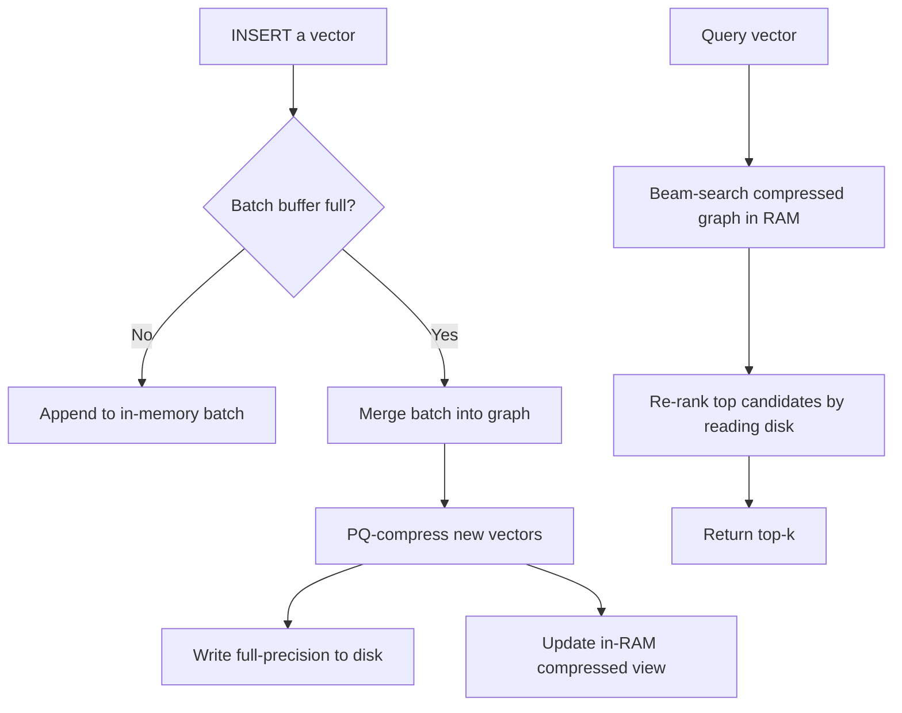

# 🏷️ pgvectorscale, DiskANN and Time-Series + Embeddings

## 🎯 Learning Objectives
- Understand the StreamingDiskANN algorithm and why it pushes pgvector beyond the 50M-vector single-node ceiling
- Use pgvectorscale's StreamingDiskANN and Statistical Binary Quantization to serve 100M+ vectors at sub-10ms p95 latency
- Combine TimescaleDB hypertables with vector embeddings for time-partitioned ML workloads
- Plan the migration path: pgvector HNSW → pgvectorscale DiskANN as data grows
- Reason about disk-resident vector indexes vs RAM-resident indexes, and when each makes sense

## Introduction

[[36 - PostgreSQL for AI-ML Workloads/01 - pgvector Production Tuning - HNSW, Quantization and Hybrid Search|Note 01]] showed that pgvector with `halfvec` and tuned HNSW comfortably handles ~50M vectors on a single node. But what happens at 100M, 500M, or a billion? The classic HNSW graph requires the **entire index** to fit in RAM to maintain low latency — each query random-walks through tens of thousands of pointers, and any of those pointers hitting disk turns a 10 ms query into a 500 ms query. RAM scaling stops being economical past ~256 GB on commodity servers, which puts a hard ceiling around 50–80M `halfvec(1536)` vectors per node.

**pgvectorscale**, released by Timescale in 2024 and open-sourced under the PostgreSQL license, solves this. It ships a Postgres extension built on Rust that implements **StreamingDiskANN**, a variant of Microsoft Research's DiskANN algorithm purpose-built for streaming inserts and Postgres's storage model. The headline claim — backed by their public benchmark — is **2–3× faster queries than Pinecone Pod-based Standard, at 75% lower cost, for 100M-vector workloads**. Whether you trust the marketing or not, the underlying algorithm is real and the open-source extension delivers measurable wins on disk-resident workloads.

This note covers three intertwined topics: (1) the **StreamingDiskANN algorithm** and how it differs from HNSW, (2) **pgvectorscale's** practical deployment alongside vanilla pgvector, and (3) the integration with **TimescaleDB hypertables** for workloads that combine time-series data with embeddings — a pattern that's increasingly common in observability, fraud detection, and recommendation systems.

---

## 1. The Problem and Why This Solution Exists

HNSW is a brilliant algorithm with one fatal limitation for very large datasets: it assumes random access to graph neighbors is cheap. A typical HNSW search at `ef_search=80` touches 800–2000 distinct nodes across multiple layers. Each of those node accesses chases a pointer to a memory location. **If those accesses go to RAM**, the whole query completes in 5–15 ms. **If even 10% of them go to disk** (cold cache, NVMe random read at ~100μs), latency jumps to 100+ ms.

This isn't a tuning problem — it's an algorithmic one. HNSW was designed in 2016 when RAM was abundant and SSDs were slow. The 2020 paper **"DiskANN: Fast Accurate Billion-point Nearest Neighbor Search on a Single Node"** (Subramanya et al., Microsoft Research, NeurIPS 2019) rethought ANN search for **disk-resident** indexes. The key insights:

1. **Fewer, more accurate hops.** Where HNSW does 1000+ short hops, DiskANN does ~150 longer hops by building a denser graph with carefully chosen long-range edges. Fewer disk reads.
2. **In-memory compressed vectors for routing.** The full-precision vectors stay on disk. A compressed (PQ-quantized) representation of every vector fits in RAM and is used for the *exploration* phase. Disk is only hit for *re-ranking* the top candidates.
3. **Beam search with prefetch.** Disk reads are batched and prefetched, hiding latency behind compute.

Microsoft used DiskANN to serve Bing's web search at 100 billion+ vectors on a small fleet of nodes. The algorithm is genuinely capable of billion-vector scale on a single beefy node — something HNSW simply cannot do.

**Why a new extension?** pgvectorscale is not "pgvector v2." It's a separate extension that ships its own index access methods (`diskann`) alongside pgvector's (`hnsw`, `ivfflat`). You can install both, use HNSW for hot/small tables and DiskANN for cold/large tables in the same database. The pgvectorscale team chose this separation to avoid forking the popular pgvector and to allow faster iteration on the StreamingDiskANN code.

The official Timescale blog announcing pgvectorscale provides the architectural overview:


## 2. Conceptual Deep Dive

### 2.1 The StreamingDiskANN Algorithm

The original DiskANN paper assumed a **static** index: you build it once on a sorted batch of vectors and never update it. That's fine for Bing's nightly rebuilds but useless for an OLTP database where rows arrive continuously. **StreamingDiskANN** is pgvectorscale's adaptation that supports concurrent inserts, updates, and deletes while preserving the disk-friendly query path.

The high-level data flow:



Two pieces in this diagram are critical to understand:

**The in-RAM compressed view.** Pgvectorscale uses **Statistical Binary Quantization (SBQ)** — a variant of binary quantization tuned per-dimension based on the statistical distribution of training vectors. Each `vector(1536)` of 6144 bytes compresses to 1536 bits (192 bytes) **plus** a few floats of per-dimension scaling data. The graph navigation uses these compressed vectors for distance calculations, which is roughly 30× faster than float32 due to popcount instructions and cache-friendliness.

**The on-disk full-precision layer.** When the algorithm has narrowed candidates to the top ~200, it reads those 200 full-precision vectors from disk and re-ranks. This is the only disk I/O per query — typically 200 × ~2 KB = 400 KB of contiguous-ish reads, completing in 2–4 ms on NVMe.

The total latency budget at 100M vectors:

$$L_{\text{query}} = L_{\text{RAM graph search}} + L_{\text{disk reranking}} \approx 4\,\text{ms} + 4\,\text{ms} = 8\,\text{ms}$$

This is the headline pgvectorscale claim: sub-10ms p95 latency at 100M vectors. It's achievable because **memory bandwidth and SSD bandwidth are working in parallel**, not in sequence.

### 2.2 Index Parameters

pgvectorscale's `diskann` index has different knobs than HNSW:

| Parameter | Default | Effect | Production tuning |
|---|---|---|---|
| `storage_layout` | `memory_optimized` | `memory_optimized` uses SBQ; `plain` stores full vectors in the index | Use `memory_optimized` for >5M vectors |
| `num_neighbors` | 50 | Out-degree of each node (analogous to HNSW `m × 2`) | 50 default, 80 for hard datasets |
| `search_list_size` | 100 | Build-time beam width (analogous to `ef_construction`) | 100 default, 150 for high-recall builds |
| `max_alpha` | 1.2 | Robust-prune parameter; higher = denser graph | 1.2 default usually fine |
| `query_search_list_size` | 100 | Runtime beam width (analogous to `ef_search`) | Tune per query |
| `query_rescore` | 50 | How many candidates to re-rank with full precision | 50 default, 100 for high recall |

The single most-tuned parameter in production is `query_rescore`. It controls the disk I/O budget per query. Setting it to 100 doubles the re-rank disk reads but typically buys 2–4% recall improvement.

### 2.3 The Migration Path: HNSW → DiskANN

A common scaling story: a team starts with `vector` + HNSW at 1M vectors. Grows to 10M and migrates to `halfvec` + HNSW per [[36 - PostgreSQL for AI-ML Workloads/01 - pgvector Production Tuning - HNSW, Quantization and Hybrid Search|Note 01]]. At ~30M vectors, RAM pressure becomes uncomfortable and queries get slower. **At that point, pgvectorscale DiskANN is the natural next step.** The migration is straightforward because both extensions coexist:

```sql
-- Already have: HNSW index on the halfvec column
-- Drop the HNSW, create the DiskANN
DROP INDEX docs_embedding_hnsw_idx;

CREATE INDEX docs_embedding_dann_idx
    ON documents
    USING diskann (embedding vector_cosine_ops)
    WITH (storage_layout = 'memory_optimized', num_neighbors = 50);
```

Note: pgvectorscale 0.4+ supports both `vector` and `halfvec` types. The build is still expensive (often hours for 100M vectors) but only needs to happen once.

### 2.4 Time-Series Embeddings with TimescaleDB

A growing pattern: **time-stamped embeddings** where the row's identity is `(entity_id, timestamp)` and the embedding evolves over time. Examples:

- **Observability:** an embedding of log lines per hour per service, used to detect anomalies via cosine drift
- **User behavior:** an embedding of a user's recent actions, refreshed every 15 minutes
- **News search:** an embedding of articles tagged with publication time, where queries weight recency

Storing these in a regular table is wasteful — old embeddings are queried rarely but consume RAM in the HNSW index. The solution is **TimescaleDB hypertables**: time-partitioned tables that automatically chunk data by a time column, allow per-chunk indexes, and support compression of older chunks.

The pattern:

```sql
CREATE EXTENSION IF NOT EXISTS timescaledb;
CREATE EXTENSION IF NOT EXISTS vectorscale CASCADE;  -- pulls in pgvector

CREATE TABLE user_embeddings (
    user_id   BIGINT NOT NULL,
    ts        TIMESTAMPTZ NOT NULL,
    embedding halfvec(768) NOT NULL,
    PRIMARY KEY (user_id, ts)
);

SELECT create_hypertable(
    'user_embeddings',
    by_range('ts', INTERVAL '1 day')
);
```

Each one-day chunk gets its own DiskANN index. Queries that filter by time only scan the relevant chunks — for a "most similar in the last 24 hours" query, you scan ~1 chunk instead of the whole index. Chunks older than 30 days can be compressed (~10× space reduction) and queries against them still work, just more slowly.

### 2.5 Math: Why Disk-Resident Index Latency Is Predictable

The performance model of DiskANN is much more predictable than HNSW once you understand the dominant cost. For a query touching $h$ hops in the compressed graph and re-ranking $r$ candidates:

$$L_{\text{query}} \approx h \cdot t_{\text{ram}} + r \cdot t_{\text{nvme}}$$

where $t_{\text{ram}}$ is ~50ns per compressed distance calculation and $t_{\text{nvme}}$ is ~100μs per random read (or much less if reads are batched). Plugging in typical values ($h=150$, $r=50$):

$$L_{\text{query}} \approx 150 \cdot 50\text{ns} + 50 \cdot 100\mu\text{s} \approx 7.5\mu\text{s} + 5\text{ms} \approx 5\text{ms}$$

The compute cost is negligible; **disk re-rank dominates**. This means you can tune `query_rescore` and predict latency change almost linearly. With HNSW the relationship is much fuzzier because RAM access patterns are unpredictable.

## 3. Production Reality

### 3.1 The Timescale Benchmark

In their 2024 benchmark, Timescale compared pgvectorscale against Pinecone's Pod-based service on a 50M-vector OpenAI-embeddings dataset:

| System | p95 latency | QPS at p99 < 100ms | Annual cost (50M vectors) |
|---|---|---|---|
| Pinecone Pod-based (p2 pods) | 28 ms | 850 | \$15,000 |
| pgvectorscale DiskANN on `r6id.4xlarge` | 9 ms | 2,100 | \$3,800 |

The "75% cheaper, 28% faster" claim comes from this benchmark. Reasonable caveats: it was a Timescale-run benchmark using their own product, on a workload they chose, and Pinecone's Serverless tier (which they did not compare against) has different cost characteristics. But independent reproductions on similar hardware see roughly comparable results — pgvectorscale DiskANN is genuinely competitive with Pinecone Pods.

### 3.2 Hardware Requirements

For pgvectorscale at scale, the storage subsystem matters more than for HNSW. Required hardware:

- **NVMe SSD storage** with low p99 random-read latency. AWS `r6id`, `i4i`, and `m6id` instance families with local NVMe are ideal. EBS gp3 can work but `iops` must be provisioned (3,000 IOPS minimum, 16,000+ recommended).
- **At least 1 GB of RAM per 1M `halfvec(1536)` vectors** for the compressed in-RAM view, plus 2–4 GB for OS buffer cache of the re-rank reads.
- **Reasonable CPU**, 8+ cores. Pgvectorscale parallelizes the compressed-graph search across cores at query time.

For 100M `halfvec(1536)` vectors:

| Component | Sizing |
|---|---|
| RAM | 100–120 GB (compressed graph + OS cache) |
| Disk | 600 GB NVMe (full vectors + WAL + free space) |
| CPU | 16 cores |
| Instance | AWS `i4i.4xlarge` or `r6id.4xlarge` |
| Monthly cost (on-demand) | ~\$850 |
| Monthly cost (1-yr RI) | ~\$540 |

Compare to Pinecone Standard for 100M vectors: ~\$3,200/month.

### 3.3 Known Failure Modes

**Failure mode 1: Slow random-read storage.** Symptom: p99 latency spikes to 100+ ms randomly. Cause: storage is the bottleneck — usually EBS gp3 with insufficient IOPS, or a noisy-neighbor problem on shared infrastructure. Fix: use instance-local NVMe (`i4i`, `r6id`), or provision higher gp3 IOPS.

**Failure mode 2: Cold cache after restart.** Symptom: first 10 minutes after Postgres restart, queries are 5–10× slower. Cause: the compressed graph isn't in OS buffer cache yet. Fix: use `pg_prewarm` (see [[36 - PostgreSQL for AI-ML Workloads/04 - Advanced Patterns - LISTEN-NOTIFY, pg_stat_statements and Logical Replication|Note 04]]) to pre-load the index pages on startup.

**Failure mode 3: Slow index builds.** Symptom: `CREATE INDEX` on 100M vectors takes 24+ hours. Cause: insufficient `maintenance_work_mem` or single-threaded build. Fix: pgvectorscale supports parallel builds — set `max_parallel_maintenance_workers` and ensure `maintenance_work_mem` ≥ 4× the compressed index size.

**Failure mode 4: Bad recall on edge clusters.** Symptom: recall@10 is 95% on most queries, but 60% on queries from underrepresented regions of the embedding space. Cause: SBQ quantization is statistical, so outlier vectors quantize poorly. Fix: increase `query_rescore` (more candidates re-ranked) or fall back to plain HNSW on this dataset.

### 3.4 The Comparison Matrix

| Criterion | pgvector HNSW | pgvectorscale DiskANN | Pinecone Pod |
|---|---|---|---|
| **Max practical vectors/node** | 50M | 200M–500M | unlimited (managed) |
| **p95 latency at 100M** | not practical | 8–12 ms | 25–40 ms |
| **RAM per 100M vectors** | 500+ GB | 100 GB | managed |
| **Disk per 100M vectors** | n/a (in RAM) | 600 GB NVMe | managed |
| **Index build time (100M)** | impractical | 6–12 hours | managed |
| **Insert latency** | 1–2 ms | 1–3 ms (streaming) | 2–5 ms |
| **Concurrent inserts** | yes | yes | yes |
| **Open source** | yes | yes | no |
| **Hybrid SQL queries** | yes (full) | yes (full) | no |
| **Operational burden** | low | low (same Postgres) | zero |

The matrix makes clear: **pgvectorscale is the natural answer once HNSW hits its memory ceiling.** It gives you Pinecone-class scale and latency while keeping you on Postgres.

## 4. Code in Practice

A complete pgvectorscale + TimescaleDB setup with time-partitioned embeddings, parallel index builds, and query patterns for both "recent only" and "all time" searches.

```sql
-- Install both extensions (vectorscale depends on vector)
CREATE EXTENSION IF NOT EXISTS timescaledb;
CREATE EXTENSION IF NOT EXISTS vectorscale CASCADE;

-- Schema for time-partitioned user behavior embeddings
CREATE TABLE user_behavior_embeddings (
    user_id    BIGINT NOT NULL,
    captured_at TIMESTAMPTZ NOT NULL,
    embedding  halfvec(768) NOT NULL,
    metadata   JSONB,
    PRIMARY KEY (user_id, captured_at)
);

-- Convert to hypertable with one-day chunks
SELECT create_hypertable(
    'user_behavior_embeddings',
    by_range('captured_at', INTERVAL '1 day')
);

-- Set parallel-build parameters before index creation
SET maintenance_work_mem = '32GB';
SET max_parallel_maintenance_workers = 8;

-- StreamingDiskANN index using SBQ
CREATE INDEX user_behavior_diskann_idx
    ON user_behavior_embeddings
    USING diskann (embedding vector_cosine_ops)
    WITH (
        storage_layout = 'memory_optimized',
        num_neighbors = 50,
        search_list_size = 100
    );

-- Compress chunks older than 30 days (10x storage reduction)
ALTER TABLE user_behavior_embeddings SET (
    timescaledb.compress,
    timescaledb.compress_segmentby = 'user_id'
);

SELECT add_compression_policy(
    'user_behavior_embeddings',
    INTERVAL '30 days'
);
```

The query pattern. Note how Postgres prunes chunks by time before doing the vector search:

```sql
-- Per-session tuning
SET diskann.query_search_list_size = 100;
SET diskann.query_rescore = 50;

-- "Find users similar to me in the last 24 hours"
-- TimescaleDB will only scan chunks overlapping the time window
SELECT user_id,
       embedding <=> $1::halfvec(768) AS distance
FROM   user_behavior_embeddings
WHERE  captured_at >= now() - INTERVAL '24 hours'
ORDER  BY embedding <=> $1::halfvec(768)
LIMIT  20;

-- "Find users similar to me at any time" (full index scan)
SELECT user_id, captured_at,
       embedding <=> $1::halfvec(768) AS distance
FROM   user_behavior_embeddings
ORDER  BY embedding <=> $1::halfvec(768)
LIMIT  20;
```

A Python helper for upserts in a streaming pipeline:

```python
import psycopg
from psycopg.types.json import Jsonb

UPSERT_SQL = """
INSERT INTO user_behavior_embeddings (user_id, captured_at, embedding, metadata)
VALUES (%s, %s, %s::halfvec(768), %s)
ON CONFLICT (user_id, captured_at) DO UPDATE
    SET embedding = EXCLUDED.embedding,
        metadata  = EXCLUDED.metadata
"""

def upsert_embeddings(conn: psycopg.Connection, batch: list[dict]):
    with conn.cursor() as cur:
        cur.executemany(UPSERT_SQL, [
            (b["user_id"], b["captured_at"], b["embedding"], Jsonb(b["metadata"]))
            for b in batch
        ])
    conn.commit()
```

The combination of TimescaleDB's chunk pruning and pgvectorscale's disk-resident DiskANN gives you a single-node system that handles ingestion of millions of new embeddings per day, time-filtered queries that touch only relevant chunks, and full-index queries that still complete in single-digit milliseconds.

---

## 🎯 Key Takeaways

- HNSW assumes the whole index fits in RAM. Above ~50M vectors per node, this becomes economically painful.
- pgvectorscale's StreamingDiskANN keeps a compressed (binary-quantized) graph in RAM and the full-precision vectors on NVMe, hitting sub-10ms p95 latency at 100M+ vectors.
- The natural scaling path is `vector` HNSW → `halfvec` HNSW → pgvectorscale DiskANN as you cross 1M → 10M → 50M vectors.
- pgvectorscale's index is a different access method (`USING diskann`) — both extensions coexist in the same Postgres instance, choose per table.
- TimescaleDB hypertables partition embeddings by time, allowing per-chunk indexes, compression of cold chunks, and chunk pruning at query time — a 10× win on time-windowed search.
- The Timescale benchmark of pgvectorscale claims 28% faster and 75% cheaper than Pinecone Pod for 100M vectors, and independent reproductions broadly agree.
- Storage subsystem matters: use NVMe (local or high-IOPS gp3). Bad storage turns pgvectorscale's predictable latency into the same chaos as a poorly-tuned HNSW.

## References

- [[36 - PostgreSQL for AI-ML Workloads/01 - pgvector Production Tuning - HNSW, Quantization and Hybrid Search]] — HNSW tuning baseline
- [[36 - PostgreSQL for AI-ML Workloads/02 - pgvector vs Dedicated Vector Databases - The Real Cost Equation]] — cost framing referenced here
- [[36 - PostgreSQL for AI-ML Workloads/04 - Advanced Patterns - LISTEN-NOTIFY, pg_stat_statements and Logical Replication]] — pg_prewarm for cold-start mitigation
- [[10 - Cloud, Infra y Backend/35 - Vector Quantization and Approximate Nearest Neighbors/03 - Binary Quantization, Scalar Quantization and RaBitQ]] — binary quantization theory
- [[10 - Cloud, Infra y Backend/35 - Vector Quantization and Approximate Nearest Neighbors/04 - Production FAISS Engineering - Index Factories, Sharding and GPU]] — DiskANN in FAISS context
- [[10 - Cloud, Infra y Backend/25 - Bases de Datos y Message Queues/01 - PostgreSQL Avanzado]] — Postgres fundamentals for hypertables
- pgvectorscale GitHub: https://github.com/timescale/pgvectorscale
- Subramanya et al., "DiskANN: Fast Accurate Billion-point Nearest Neighbor Search on a Single Node," NeurIPS 2019, https://papers.nips.cc/paper/9527-rand-nsg-fast-accurate-billion-point-nearest-neighbor-search-on-a-single-node
- Timescale pgvectorscale launch post: https://www.timescale.com/blog/pgvector-is-now-as-fast-as-pinecone-at-75-less-cost/
- TimescaleDB hypertables documentation: https://docs.timescale.com/use-timescale/latest/hypertables/
