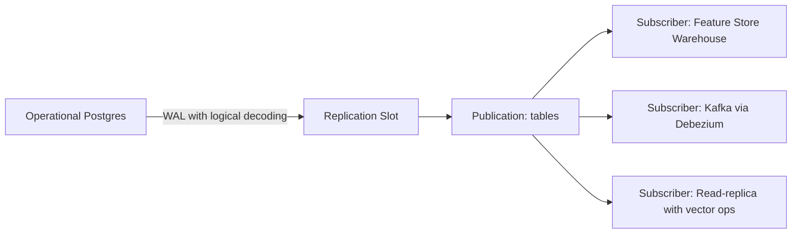

# 🏷️ Advanced Patterns: LISTEN/NOTIFY, pg_stat_statements and Logical Replication

## 🎯 Learning Objectives
- Use `LISTEN` / `NOTIFY` to drive real-time ML pipelines: cache invalidation, retraining triggers, inference notifications
- Operate `pg_stat_statements` as the foundation of query observability for ML workloads
- Set up logical replication and CDC pipelines from Postgres to downstream feature stores
- Tune connection pooling with `pgbouncer` for high-concurrency inference services
- Use `pg_prewarm`, `auto_explain`, and the backup toolchain (`pgbackrest`, `pg_basebackup`) to keep production ML systems healthy

## Introduction

The first three notes covered the vector side of PostgreSQL for ML. This note covers the **infrastructure patterns** that wrap around the vector indexes: how to make a Postgres-based ML system actually production-grade in terms of observability, real-time event flow, change-data-capture, and operational robustness. These are the patterns that separate a working RAG prototype from a system serving 10,000 QPS with 99.9% uptime.

The five capabilities we cover here — `LISTEN/NOTIFY`, `pg_stat_statements`, logical replication, connection pooling, and the backup/observability toolchain — are not new. Most have been in Postgres for a decade. **What's new is the ML-specific way of using them.** A traditional web application uses logical replication to feed an analytics warehouse; an ML application uses it to feed a feature store. A traditional app uses `LISTEN/NOTIFY` for in-app event broadcasting; an ML app uses it to invalidate cached embeddings or trigger model retraining. The mechanics are old, the wiring is new.

Two themes run through every section: **events flow out of Postgres** (CDC, NOTIFY, replication) into the ML system, and **observability flows back in** (`pg_stat_statements`, `auto_explain`, slow-query logs) to keep the database healthy. Master both directions and your Postgres becomes the *control plane* of your ML stack, not just a storage layer.

---

## 1. The Problem and Why This Solution Exists

ML systems are fundamentally event-driven and observability-hungry, in ways that traditional web apps are not. Consider the lifecycle of a single ML feature:

1. A user takes an action (places an order, clicks a product, finishes a session)
2. The action lands in the operational Postgres
3. A feature pipeline must **recompute** derived features (rolling averages, embeddings, counts)
4. The new features must be available to the **inference service** within seconds
5. Caches in the inference service must be **invalidated** to pick up the new features
6. A subset of features must be **logged** to the training data warehouse for the next retraining run
7. Each step must be **observable** so we can diagnose feature staleness, cache hits, and retraining gaps

Step 4 alone (sub-second feature freshness) is impossible with a "polling every minute" architecture. You need push-based event flow, and you need it integrated with the database where the events originate. The classic solutions — Kafka as the central event bus, plus a separate observability pipeline — work but add operational complexity. **The Postgres-native alternatives we cover in this note solve the same problem with one fewer system to operate.**

Concretely:

| Need | Postgres-native solution | External alternative |
|---|---|---|
| Real-time event push from DB | `LISTEN/NOTIFY` | Kafka, Redis Pub/Sub |
| Change-data-capture for downstream systems | Logical replication, `wal2json` | Debezium + Kafka |
| Query observability | `pg_stat_statements`, `auto_explain` | APM (Datadog, New Relic) |
| Connection pooling at scale | `pgbouncer`, `pgcat` | Application-side pooling |
| Cold-start cache warming | `pg_prewarm` | OS-level warmup scripts |

None of these replace dedicated tools at very large scale. But for teams under ~100 engineers, **the Postgres-native versions are 80% of the value at 20% of the operational cost.**

## 2. Conceptual Deep Dive

### 2.1 LISTEN/NOTIFY: Postgres as a Mini Event Bus

`NOTIFY channel_name, 'payload'` is a Postgres command that broadcasts a tiny message (up to 8 kB) to any connected client that has issued `LISTEN channel_name`. The messages are delivered **transactionally**: they're queued during the transaction and only delivered to listeners when the transaction commits. If you `NOTIFY` and then `ROLLBACK`, the notification never goes out. This transactional guarantee is the killer feature — it means you can drive cache invalidation from a `NOTIFY` inside the same transaction that wrote the data, and never have the cache stale or invalidated before the write is durable.

The mechanism is simple:

```sql
-- Producer (any transaction)
NOTIFY model_features, '{"entity_id":12345, "version":42}';

-- Consumer (a long-lived connection)
LISTEN model_features;
-- ... then read from the connection's async messages
```

The triggers-on-changes pattern wires this to row events:

```sql
CREATE OR REPLACE FUNCTION notify_feature_change()
RETURNS TRIGGER AS $$
BEGIN
    PERFORM pg_notify(
        'feature_updates',
        json_build_object(
            'entity_id', NEW.entity_id,
            'version',   NEW.version,
            'updated_at', NEW.updated_at
        )::text
    );
    RETURN NEW;
END;
$$ LANGUAGE plpgsql;

CREATE TRIGGER feature_change_notify
    AFTER INSERT OR UPDATE ON model_features
    FOR EACH ROW EXECUTE FUNCTION notify_feature_change();
```

Now any Python service that does `LISTEN feature_updates` and waits asynchronously will receive a JSON payload every time a row changes. **Latency from commit to client notification is typically under 5 ms.**

The limitations are real:

- **8 kB message size limit.** Use it for *identifiers*, not full payloads. The pattern is "row 12345 changed, go re-read it" not "here is the new row."
- **Not durable.** If no client is listening when the NOTIFY fires, the message is lost. For audit-critical events, use the outbox pattern (insert into a notification table + LISTEN) instead.
- **Single-instance.** Notifications don't propagate across replicas. If your read replica wants to be notified, you need logical replication of the notification table.

### 2.2 pg_stat_statements: Query Observability

`pg_stat_statements` is a Postgres extension that aggregates query statistics by normalized query text. Every query is canonicalized (constants replaced with `$1`, `$2`, ...), and Postgres tracks per-canonical-form: total time, mean time, stddev, calls, rows returned, shared/local block hits and reads.

For ML workloads, the killer query is "find me the slow vector queries":

```sql
SELECT
    substring(query, 1, 100) AS query_preview,
    calls,
    round(total_exec_time::numeric, 2) AS total_ms,
    round(mean_exec_time::numeric, 2) AS mean_ms,
    round(stddev_exec_time::numeric, 2) AS stddev_ms,
    rows / GREATEST(calls, 1) AS rows_per_call
FROM pg_stat_statements
WHERE query ILIKE '%embedding%'
   OR query ILIKE '%<=>%'
   OR query ILIKE '%<->%'
ORDER BY mean_exec_time DESC
LIMIT 20;
```

This is the single most valuable observability query in an ML database. It surfaces:

- Queries with high mean latency (your tuning targets)
- Queries with high stddev (your tail-latency problems — often filter selectivity issues)
- Queries that have run many times (your hot paths — optimize these first)
- The actual SQL text (so you can identify which application code path generated them)

Reset periodically with `SELECT pg_stat_statements_reset()` to keep the view focused on a recent window. Production teams often pipe `pg_stat_statements` into Datadog or Grafana via a small Python exporter for time-series visualization.

### 2.3 Logical Replication and CDC

Postgres has two replication mechanisms:

1. **Streaming replication (physical):** byte-for-byte WAL shipping to replicas. Replicas are read-only copies of the primary. Used for HA, read scaling.
2. **Logical replication:** decoded row-level changes (INSERTs, UPDATEs, DELETEs) published to subscribers. Subscribers can transform, filter, and route the changes. Used for CDC, zero-downtime upgrades, and feeding downstream systems.

For ML, logical replication is the mechanism that turns Postgres into a **CDC source**. The flow:



Setup is two commands:

```sql
-- On the publisher (primary)
CREATE PUBLICATION ml_features_pub FOR TABLE model_features, training_events;

-- On the subscriber (downstream Postgres)
CREATE SUBSCRIPTION feature_store_sub
    CONNECTION 'host=primary.example.com user=replicator dbname=app'
    PUBLICATION ml_features_pub;
```

For non-Postgres subscribers (Kafka, BigQuery, Snowflake), you use **Debezium** (open-source CDC platform that consumes the logical decoding stream) or the simpler `wal2json` output plugin (decodes WAL to JSON, you handle the consumption). Debezium gives you exactly-once semantics with Kafka-side deduplication; `wal2json` is lighter weight but requires more application logic.

**Important constraint:** logical replication requires `wal_level = logical` (a postgresql.conf setting that requires a restart). The WAL volume increases by ~20% with `logical` vs `replica`, so plan disk accordingly.

### 2.4 Connection Pooling with pgbouncer

Postgres uses a process-per-connection model. Each connection is a forked OS process consuming ~10 MB of RAM. The default `max_connections` of 100 is rarely enough for an inference service that wants to handle 1000+ concurrent requests. Naive solutions:

- Raise `max_connections` to 1000 → 10 GB RAM consumed by idle connections alone, plus thrashing.
- Application-side pooling → works but creates a pool per service instance; 50 service instances × 50-connection pools = 2500 connections.

The correct solution is **pgbouncer**, a lightweight middleware that multiplexes many client connections onto a small pool of server connections. The pool modes:

| Mode | When connection is released | Use case |
|---|---|---|
| **Session** | When client disconnects | Drop-in replacement, no app changes |
| **Transaction** | When transaction commits/rolls back | Most ML inference workloads |
| **Statement** | When statement completes | Read-only analytics |

`transaction` mode is the sweet spot for inference services. A client borrows a connection at `BEGIN`, returns it at `COMMIT`. Idle clients consume zero server connections. With transaction pooling, **a Postgres with `max_connections=100` can serve 10,000+ concurrent clients**.

The catch: features that bind to a session (prepared statements, `SET LOCAL`, `LISTEN`) don't work transparently in transaction mode. You either use `pgbouncer`'s prepared-statement support (added in 1.21) or write your application to be stateless per-transaction. Most modern ML services are stateless per-request anyway, so this isn't a major constraint.

### 2.5 pg_prewarm: Cold-Start Mitigation

After a Postgres restart, the OS page cache and shared_buffers are empty. The first queries against a large index are slow because they hit disk. `pg_prewarm` is a tiny extension that pre-loads specified pages:

```sql
CREATE EXTENSION pg_prewarm;

-- Load the entire HNSW index into shared_buffers on startup
SELECT pg_prewarm('docs_embedding_hnsw_idx');

-- Or just the buffers, into OS cache
SELECT pg_prewarm('docs_embedding_hnsw_idx', 'buffer');
```

For pgvectorscale DiskANN, prewarm is essential — the compressed graph must be in RAM for queries to hit single-digit-ms latency.

Combine with `pg_prewarm.autoprewarm = on` (postgresql.conf) and pgvector's compatible pages will be automatically reloaded on startup based on what was in shared_buffers at shutdown. **This turns a 10-minute warmup window into a 30-second window.**

## 3. Production Reality

### 3.1 Real Case: DoorDash's NOTIFY-Based Cache Invalidation

DoorDash's ML platform team described in a 2024 blog post how they use `LISTEN/NOTIFY` to invalidate their Redis-backed feature cache. The architecture:

1. A change to the `restaurant_features` table fires a trigger
2. The trigger calls `pg_notify('feature_invalidate', '{"key":"rest:123"}')`
3. A small "invalidator" service holds a long-lived `LISTEN` connection
4. On notification, it issues `DEL rest:123` against Redis
5. The next inference request misses the cache and re-fetches from Postgres

Latency from row write to cache invalidation: **under 50 ms p99**. Building this with Kafka would have added ~200 ms of broker latency and a whole new system to operate. The pattern works because the cache TTL is short (5 minutes) — even if a notification is lost (e.g., invalidator service restart), the cache becomes consistent within the TTL.

### 3.2 Real Case: Logical Replication to Feature Store

A common pattern for teams running Feast (the open-source feature store) is to use Postgres logical replication to keep the **offline store** (typically BigQuery or Snowflake) in sync with the operational database. The flow:

1. Operational Postgres has tables like `users`, `orders`, `sessions`
2. A Debezium connector subscribes to a Postgres logical replication slot
3. Debezium publishes row-change events to Kafka
4. A Kafka sink connector writes the events to BigQuery
5. Feast's BigQuery offline store reads training features from BigQuery
6. The same Postgres also feeds the **online store** (often Postgres or Redis) for inference

This gives you a single source of truth (operational Postgres) with two automatically-synchronized derived stores (BigQuery for training, Redis for serving). All ACID semantics are preserved at the source. **The lag from row write to BigQuery is typically 5–30 seconds**, well within feature-store SLAs.

### 3.3 Real Case: Stripe's pg_stat_statements at Scale

Stripe runs Postgres at very large scale and treats `pg_stat_statements` as a tier-1 observability source. They feed the table into their internal metrics system every 30 seconds, computing diffs between snapshots to derive per-query latency histograms. A simplified version of the pattern:

```sql
-- Snapshot every 30 seconds
INSERT INTO pg_stat_statements_history
SELECT now() AS captured_at, *
FROM pg_stat_statements;

-- Then derive deltas by querying captured_at windows
```

The same pattern works for ML workloads: take periodic snapshots, derive per-window query latency distributions, alert on regression. **This catches things APM tools miss because they only see the application side, not the database internals.**

### 3.4 Known Failure Modes

**Replication slot bloat.** A subscriber that stops consuming causes the publisher to retain WAL indefinitely. Disk fills up. Fix: monitor `pg_replication_slots.confirmed_flush_lsn` lag and alert when it falls behind.

**NOTIFY backlog.** If a listener disconnects briefly, accumulated notifications queue up to ~8 GB. A slow consumer can crash the publisher with OOM. Fix: drop notifications older than X seconds, or use the outbox-table pattern for durable events.

**Prepared statement bloat with pgbouncer transaction mode.** Pre-1.21 pgbouncer didn't support session-bound prepared statements. Applications that prepared statements broke silently. Fix: upgrade pgbouncer to ≥1.21, or use the application's "unprepared" mode for queries.

**pg_stat_statements track only the top N.** The default `pg_stat_statements.max = 5000` discards less-common queries when full. If you have many distinct query shapes, raise to 50000. Costs ~1 MB of shared memory per 1000 entries.

## 4. Code in Practice

A complete pipeline that combines all the patterns: a trigger fires NOTIFY on feature changes, a Python listener invalidates a cache, `pg_stat_statements` is sampled for observability, and the same data flows out via logical replication.

```sql
-- Setup the feature table with notification trigger
CREATE TABLE model_features (
    entity_id   BIGINT PRIMARY KEY,
    features    JSONB NOT NULL,
    embedding   halfvec(384) NOT NULL,
    version     BIGINT NOT NULL DEFAULT 1,
    updated_at  TIMESTAMPTZ NOT NULL DEFAULT now()
);

CREATE OR REPLACE FUNCTION notify_feature_update()
RETURNS TRIGGER AS $$
BEGIN
    NEW.version    := COALESCE(OLD.version, 0) + 1;
    NEW.updated_at := now();
    PERFORM pg_notify(
        'feature_updates',
        json_build_object(
            'entity_id', NEW.entity_id,
            'version',   NEW.version,
            'op',        TG_OP
        )::text
    );
    RETURN NEW;
END;
$$ LANGUAGE plpgsql;

CREATE TRIGGER model_features_notify
    BEFORE INSERT OR UPDATE ON model_features
    FOR EACH ROW EXECUTE FUNCTION notify_feature_update();

-- Enable pg_stat_statements (already in shared_preload_libraries)
CREATE EXTENSION IF NOT EXISTS pg_stat_statements;

-- Create publication for downstream feature store
CREATE PUBLICATION ml_features_pub FOR TABLE model_features;
```

The Python listener that invalidates a cache on every notification:

```python
import asyncio
import json
import os
import psycopg
import redis.asyncio as redis

async def feature_listener():
    pg_conn = await psycopg.AsyncConnection.connect(
        os.environ["DATABASE_URL"],
        autocommit=True,
    )
    rd = redis.from_url(os.environ["REDIS_URL"])

    async with pg_conn.cursor() as cur:
        await cur.execute("LISTEN feature_updates;")

    async for notify in pg_conn.notifies():
        payload = json.loads(notify.payload)
        entity_id = payload["entity_id"]
        await rd.delete(f"features:{entity_id}")
        await rd.delete(f"emb:{entity_id}")
        print(f"invalidated cache for entity {entity_id} v{payload['version']}")

if __name__ == "__main__":
    asyncio.run(feature_listener())
```

A scheduled observability job that exports `pg_stat_statements` to Prometheus:

```python
import os
import psycopg
from prometheus_client import Gauge, start_http_server

vector_query_p99 = Gauge(
    "pg_vector_query_p99_ms",
    "Estimated p99 latency in ms for vector queries",
    ["query_id"],
)
vector_query_calls = Gauge(
    "pg_vector_query_calls",
    "Total calls per vector query",
    ["query_id"],
)

OBSERVE_SQL = """
SELECT queryid::text,
       calls,
       mean_exec_time + 3 * stddev_exec_time AS approx_p99_ms
FROM   pg_stat_statements
WHERE  query ILIKE '%<=>%' OR query ILIKE '%<->%'
ORDER  BY mean_exec_time DESC
LIMIT  20;
"""

def collect():
    with psycopg.connect(os.environ["DATABASE_URL"]) as conn:
        with conn.cursor() as cur:
            cur.execute(OBSERVE_SQL)
            for queryid, calls, p99 in cur.fetchall():
                vector_query_p99.labels(query_id=queryid).set(p99)
                vector_query_calls.labels(query_id=queryid).set(calls)

if __name__ == "__main__":
    start_http_server(9187)
    import time
    while True:
        collect()
        time.sleep(30)
```

A pgbouncer config snippet for inference services:

```ini
[databases]
ml_production = host=primary.example.com port=5432 dbname=ml

[pgbouncer]
listen_port = 6432
listen_addr = 0.0.0.0
auth_type = scram-sha-256
auth_file = /etc/pgbouncer/userlist.txt
pool_mode = transaction
max_client_conn = 10000
default_pool_size = 50
reserve_pool_size = 10
reserve_pool_timeout = 3
server_idle_timeout = 600
server_lifetime = 3600
```

This config allows 10,000 client connections multiplexed across 50 server connections per database — enough for a typical inference fleet of 100+ pods.

---

## 🎯 Key Takeaways

- `LISTEN/NOTIFY` is the simplest way to push real-time events out of Postgres for cache invalidation, retraining triggers, and inference notifications. Transactional delivery makes it safer than Kafka for many use cases.
- `pg_stat_statements` is the foundation of ML query observability. Sample it every 30 seconds, alert on regression, and focus tuning effort on the highest-`mean_exec_time` queries with vector operators.
- Logical replication is how you feed downstream feature stores (BigQuery, Snowflake) and external systems (Kafka via Debezium) without writing custom CDC code. Watch replication slot lag carefully.
- `pgbouncer` in transaction mode lets a single Postgres serve 10,000+ concurrent inference clients with `max_connections = 100`. Upgrade to 1.21+ for prepared-statement support.
- `pg_prewarm` with `autoprewarm = on` turns a 10-minute cold start into 30 seconds — essential for pgvectorscale DiskANN and any RAM-resident vector index.
- DoorDash uses NOTIFY-driven cache invalidation; Feast pipelines use logical replication to BigQuery; Stripe samples `pg_stat_statements` every 30 seconds. These are the real patterns, not hypotheticals.
- All of these patterns are 10+ years old in Postgres — the novelty is the ML-specific wiring, not the database mechanism.

## References

- [[36 - PostgreSQL for AI-ML Workloads/01 - pgvector Production Tuning - HNSW, Quantization and Hybrid Search]] — vector queries that this observability targets
- [[36 - PostgreSQL for AI-ML Workloads/03 - pgvectorscale, DiskANN and Time-Series + Embeddings]] — pg_prewarm essential for DiskANN
- [[36 - PostgreSQL for AI-ML Workloads/05 - Capstone - End-to-End ML Feature Store on Postgres]] — puts all these patterns together
- [[10 - Cloud, Infra y Backend/25 - Bases de Datos y Message Queues/01 - PostgreSQL Avanzado]] — base Postgres mechanics (Spanish)
- [[10 - Cloud, Infra y Backend/25 - Bases de Datos y Message Queues/04 - Message Queues y Streaming]] — alternative event-bus options
- [[10 - Cloud, Infra y Backend/31 - FastAPI for ML/05 - Production Deployment and Performance]] — connection pooling in inference services
- PostgreSQL LISTEN/NOTIFY docs: https://www.postgresql.org/docs/current/sql-notify.html
- pg_stat_statements docs: https://www.postgresql.org/docs/current/pgstatstatements.html
- Logical replication docs: https://www.postgresql.org/docs/current/logical-replication.html
- pgbouncer docs: https://www.pgbouncer.org/config.html
- Debezium Postgres connector: https://debezium.io/documentation/reference/stable/connectors/postgresql.html
- pgbackrest docs: https://pgbackrest.org/
