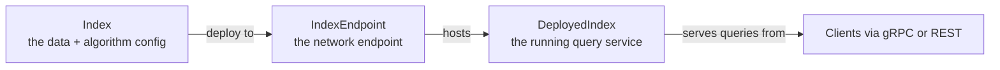

# 🟢 Vertex AI Vector Search — Architecture and Python Client

## 🎯 Learning Objectives

- Trace the **architectural lineage** from Matching Engine (2019) to Vector Search (2023) to hybrid search (2024) to ScaNN-based Tree-AH (2025)
- Distinguish the **Index**, **IndexEndpoint**, and **DeployedIndex** abstractions — and the public-vs-private endpoint trade-off
- Master the **two index types**: `TREE_AH` (default, ScaNN-derived, sub-linear recall) and `BRUTE_FORCE` (exact, baseline)
- Use the **`google-cloud-aiplatform` Python SDK** to create indexes, deploy endpoints, upsert datapoints, and query at production scale
- Configure **streaming update** (insert/update vectors without rebuilding the index) and **batch update** (cheaper, with index rebuild)
- Implement **hybrid search** with sparse + dense vectors, the 2024 addition that closes the BM25 + dense gap
- Apply **IAM scopes**, **VPC-SC**, and **CMEK encryption** for production-grade security
- Predict the **monthly cost** for a 10M-vector workload, and the **cold-start latency** that catches teams by surprise

---

## Introduction

Vertex AI Vector Search is the **GCP-native managed vector database** that powers recommendation, semantic search, and RAG workloads inside the Google Cloud ecosystem. It is the answer for teams already running Vertex AI Training, Vertex AI Endpoints, and BigQuery who do not want to introduce a separate vector database engine — Pinecone, Qdrant, or otherwise — and pay the integration tax.

The 2023 rebrand from "AI Platform Matching Engine" to "Vertex AI Vector Search" reflected Google's commitment to a unified AI platform. The 2024 hybrid search addition closed the long-standing gap with Qdrant and Pinecone. The 2025 ScaNN-based Tree-AH index brought recall-quality parity with the open-source state of the art.

This note is the **architectural deep dive** and the **Python API reference**. Note `02` covers the alternative GCP options (AlloyDB AI, BigQuery `VECTOR_SEARCH()`) and the decision framework. Note `00` is the course map.

We connect to `[[../../33 - Vector Databases and Semantic Search/05 - Qdrant I - Architecture and Collections]]` (the open-source alternative), `[[../12 - Pinecone Architecture and Python Client]]` (the other managed alternative), and `[[../../../10 - Cloud, Infra y Backend/28 - BigQuery for ML/02 - BigQuery ML and GCP Ecosystem]]` (the broader GCP ML context).

---

## 1. The Problem and Why This Solution Exists

### The "I am already on GCP" use case

A team already running **Vertex AI Training** (custom model training on GPUs), **Vertex AI Endpoints** (serving), **Vertex AI Feature Store** (online features), and **BigQuery** (analytics) does not want to add Qdrant or Milvus to that stack. The reasons are real:

- **Network latency**: every cross-service call adds 5-15 ms. A Qdrant cluster in a different VPC means VPC peering or Private Service Connect, plus a network round-trip per query.
- **IAM fragmentation**: Qdrant IAM is custom; Pinecone IAM is OAuth-based; Vertex AI IAM is unified with BigQuery, GCS, and the rest of GCP.
- **Compliance**: VPC Service Controls (VPC-SC), Customer-Managed Encryption Keys (CMEK), and audit logging are native to Vertex AI. Adding a third-party vector DB means re-implementing these in the vector DB's own model.
- **Billing unification**: one bill from Google instead of one from Google + one from Pinecone. For finance teams, this matters more than engineers expect.

Vertex AI Vector Search is the **answer for that team**: managed, GCP-native, integrated IAM, low-latency within the GCP network, and the same compliance story as the rest of the platform.

### The 2019-2026 evolution

| Era | Name | Algorithm | Notable change |
|-----|------|-----------|----------------|
| 2019-2021 | Matching Engine (beta) | ANN with custom HNSW | Limited regions, gRPC only |
| 2021-2023 | Matching Engine (GA) | HNSW, brute force | Public endpoint, IAM |
| 2023 (rebrand) | Vector Search | Same as Matching Engine | Renamed, integrated into Vertex AI |
| 2024 | Vector Search v2 | + hybrid search (sparse + dense) | New `IndexDatapoint` schema |
| 2025-2026 | Vector Search v3 | Tree-AH (ScaNN-based) | 30-50% better recall at same latency |

The 2024 hybrid search addition is the biggest feature change since launch. Before 2024, Vertex AI Vector Search was a pure dense vector service — teams building RAG with BM25 + dense had to combine it with Elasticsearch or another keyword engine. The 2024 API lets you submit both `dense_embedding` and `sparse_embedding` in one query and get a fused result.

> **Caso real**: **Spotify** migrated their home-screen recommendation retrieval from a custom Elasticsearch + FAISS stack to Vertex AI Vector Search in 2024, citing the unified IAM (their existing VPC-SC perimeter was already in place for BigQuery) and the hybrid search API as the deciding factors. They serve 500M+ users with 300+ features per retrieval, <20ms p99.

---

## 2. Conceptual Deep Dive

### 2.1 The three abstractions: Index, IndexEndpoint, DeployedIndex

Vertex AI Vector Search has a **three-level deployment model** that is unique among the major vector databases:



- **Index** — the immutable description of your data layout: dimension, distance metric, algorithm (`TREE_AH` or `BRUTE_FORCE`), shard size, and the datapoints. An Index is a *resource* in Vertex AI (`projects/.../locations/.../indexes/123`), but it is not directly queryable.
- **IndexEndpoint** — the network endpoint that serves queries. It is a separate resource (`projects/.../locations/.../indexEndpoints/456`) and is the target of your gRPC and REST clients.
- **DeployedIndex** — a deployed Index attached to an IndexEndpoint. You can attach multiple DeployedIndexes to the same IndexEndpoint, and you can attach the same Index to multiple IndexEndpoints (e.g., one in `us-central1`, one in `europe-west4` for data residency).

This three-level model is the source of much confusion for new users. The operational mental model:

- **Build phase**: create the Index, populate it with datapoints. No queries yet.
- **Deploy phase**: create an IndexEndpoint, deploy the Index to it. This is when queries become possible.
- **Update phase**: when you want to change the index (more data, different algorithm), you build a new Index and either (a) replace the deployment atomically or (b) stream-update the existing Index in place.

### 2.2 Public vs private endpoint

The **public endpoint** is reachable from the public internet (with IAM authentication via Google Cloud OAuth). Suitable for prototypes, public-facing RAG, and any case where the calling client is outside the GCP VPC.

The **private endpoint** is reachable only from inside your GCP VPC (via Private Service Connect). Suitable for internal services, sensitive data, and any case where you want zero public internet exposure.

```python
# Public endpoint (default)
my_index_endpoint = aiplatform.MatchingEngineIndexEndpoint.create(
    display_name="rag-public",
    network=None,                    # None = public endpoint
)

# Private endpoint (VPC-only)
my_index_endpoint = aiplatform.MatchingEngineIndexEndpoint.create(
    display_name="rag-private",
    network="projects/PROJECT_ID/global/networks/default",   # VPC network
)
```

The private endpoint requires a **Private Service Connect** allocation in your VPC and a **service attachment** that Vertex AI uses. Setup takes ~30 minutes; managed by your GCP network team.

### 2.3 Index types: TREE_AH vs BRUTE_FORCE

| Type | Algorithm | Recall | Latency p99 | Best for |
|------|-----------|--------|-------------|----------|
| `TREE_AH` | Tree-AH (ScaNN-derived) | 95-99% | 5-15 ms | >10K vectors, production |
| `BRUTE_FORCE` | Exact nearest neighbor | 100% | 1-3 ms × N | <10K vectors, ground truth |

`TREE_AH` is the **production default**. It uses Google's ScaNN implementation under the hood: a hierarchical tree structure with asymmetric hashing for compressed representations. The recall-latency trade-off is tunable via the `leafNodeEmbeddingCount` and `leafNodesToSearchPercent` parameters.

`BRUTE_FORCE` computes the exact distance to every vector. It is the **ground truth** for benchmarking and the only option for <10K vectors where the index overhead exceeds the search cost.

### 2.4 Streaming update vs batch update

Two ways to add or modify vectors after the index is built:

```python
# Streaming update (per-datapoint, latency-sensitive)
my_index.upsert_datapoints(datapoints=[IndexDatapoint(
    datapoint_id="doc-1",
    feature_vector=[0.1, 0.2, ...],
    restricts=[{"namespace": "tenant", "allow": ["acme"]}],
    crowding_tag="crowd-1",
)])

# Batch update (rebuild entire index, cost-optimized)
my_index.update_embeddings()        # runs an offline indexing job
```

**Streaming update** is the right choice for low-latency, incremental changes. It is a `mutate`-style operation that updates the index in place. **Batch update** rebuilds the index from scratch and is cheaper per vector but takes minutes-to-hours depending on size.

The cost-economic split: streaming update costs ~3× more per vector but is the only way to make data available in seconds. Batch update costs ~1× per vector but introduces a 30-min-to-4-hour lag.

### 2.5 Hybrid search

The 2024 addition. Submit both a dense and a sparse vector in one query:

```python
# Upsert a hybrid datapoint
my_index.upsert_datapoints(datapoints=[IndexDatapoint(
    datapoint_id="doc-1",
    feature_vector=[0.1, 0.2, ...],            # dense, 768-dim
    sparse_embedding={
        "values": [0.8, 1.2, 0.5],              # BM25 weights
        "dimensions": [101, 340, 1023],         # BM25 token IDs
    },
    restricts=[{"namespace": "tenant", "allow": ["acme"]}],
)])

# Hybrid query
response = my_index_endpoint.find_neighbors(
    deployed_index_id="deployed_index_id",
    queries=[
        FindNeighbors(
            query_index_id="doc-2",
            feature_vector=[0.15, 0.25, ...],    # dense query
            sparse_embedding={...},              # sparse query
            neighbor_count=10,
        ),
    ],
    return_full_datapoint=True,
)
```

The result is the **fused score** of dense similarity + sparse similarity, weighted by the configured alpha. This is the production answer to "find documents similar to this in both meaning and keyword overlap".

### 2.6 IAM scopes, VPC-SC, CMEK

Three security layers for production:

- **IAM scopes**: who can read/write the index. Vertex AI uses the standard GCP IAM model. A service account with `roles/aiplatform.user` can query; `roles/aiplatform.admin` is required to create indexes.
- **VPC Service Controls (VPC-SC)**: a security perimeter around your GCP project. VPC-SC blocks data exfiltration to services outside the perimeter, even for authorized users. Enable for any production deployment with sensitive data.
- **Customer-Managed Encryption Keys (CMEK)**: encrypt the index with your own KMS key (not Google's default). Required for HIPAA, FedRAMP, and many enterprise compliance regimes. Adds 1-2% latency to queries.

```python
# CMEK-encrypted index
my_index = aiplatform.MatchingEngineIndex.create(
    display_name="rag-encrypted",
    dimensions=768,
    index_update_method="STREAM_UPDATE",
    metadata={
        "config": {
            "algorithm_config": {"tree_ah_config": {"leaf_node_embedding_count": 1000}},
            "distanceMeasureType": "COSINE_DISTANCE",
            "encryptionSpec": {"kmsKeyName": "projects/PROJECT/locations/LOCATION/keyRings/RING/cryptoKeys/KEY"},
        }
    },
)
```

> ⚠️ **Advertencia**: once an Index uses CMEK, you cannot remove the encryption without rebuilding from scratch. Plan the encryption choice at index creation time.

---

## 3. Production Reality

### Latency and cold-start

| Stage | Latency | Notes |
|-------|--------:|-------|
| Index creation (empty) | 30 seconds | API call |
| Index population (1M vectors, streaming) | 5-15 minutes | Per-vector mutation rate |
| Index deployment to endpoint | **5-15 minutes** | The "cold start" — no queries served during this time |
| Query latency p50 | 5 ms | Public endpoint, warm |
| Query latency p99 | 15-30 ms | Public endpoint, warm, no filter |
| Filtered query p99 | 30-50 ms | With `restricts` (metadata filter) |

The **5-15 minute deploy** catches teams by surprise. When you deploy a new Index to an existing IndexEndpoint, queries against the endpoint fail until the deployment completes. The pattern:

- **Pre-deploy** to a staging endpoint, validate queries, then **swap** by deploying to production
- **Pre-warm** by creating the IndexEndpoint + DeployedIndex in advance, then point your DNS at it
- **Atomic swap** is not natively supported; use blue/green with two IndexEndpoints

### Cost (10M vectors, 768-dim, 500 QPS, 24/7)

| Cost component | Per month |
|----------------|----------:|
| Index storage (10M × 768-dim × 4 bytes) | $500-800 |
| IndexEndpoint compute (TREE_AH) | $1,200-1,800 |
| Query costs (500 QPS × 30 days) | $1,500-2,500 |
| CMEK | +$100-200 |
| **Total** | **$3,300-5,300** |

This is **2-3× the cost of a self-hosted Qdrant cluster** for the same workload. The premium buys managed service, IAM integration, and compliance. For a 10M-vector workload, the trade-off is real; for 100M+ vectors, the cost ratio narrows.

### Common pitfalls

| Pitfall | Symptom | Fix |
|---------|---------|-----|
| Forgetting the 3-level model (Index, IndexEndpoint, DeployedIndex) | Confused 404s | `Index` is data, `IndexEndpoint` is the URL, `DeployedIndex` is the live service |
| Using public endpoint for sensitive data | Compliance violation | Use private endpoint + VPC-SC |
| Deploying without pre-warming the endpoint | 5-15 min downtime on every deploy | Pre-warm in a staging IndexEndpoint |
| Streaming update for 1M+ vectors | 3× cost overrun | Use batch update (`update_embeddings`) for bulk loads |
| Mixing dimensions in one index | Query errors | Each index has one fixed dimension |
| Forgetting `restricts` for multi-tenant | Tenant data leak | Apply `restricts` to every datapoint and every query |
| CMEK without IAM `roles/cloudkms.cryptoKeyEncrypterDecrypter` | Index creation fails | Grant the Vertex AI service account the KMS role |

### Migration paths

| From | To Vertex AI Vector Search | Notes |
|------|---------------------------|-------|
| pgvector | Stream datapoints via `upsert_datapoints`; switch reads to `find_neighbors` | 1-2 weeks, depends on metadata schema |
| Qdrant | Reuse Qdrant embeddings; bulk-import via `update_embeddings` | Use `restricts` for any Qdrant payload filters |
| Pinecone | Export to GCS, use Vertex AI bulk import | Match dimension + distance metric exactly |
| FAISS (offline) | Build the index from embeddings dump, stream-update | Pre-compute embeddings, batch update |

---

## 4. Code in Practice

```python
# 📦 Vertex AI Vector Search end-to-end — single file, exercises every API in this note.
# Requires: google-cloud-aiplatform>=1.50.0, google-cloud-storage>=2.14.0, numpy
# Setup: gcloud auth application-default login && gcloud config set project YOUR_PROJECT

import os, time, json
import numpy as np
from google.cloud import aiplatform, storage

PROJECT = os.environ["GCP_PROJECT"]
LOCATION = "us-central1"
BUCKET = f"gs://{PROJECT}-vector-search-demo"
DIM = 768

aiplatform.init(project=PROJECT, location=LOCATION, staging_bucket=BUCKET)

# 1. Create the Index (the data + algorithm config, not the endpoint)
my_index = aiplatform.MatchingEngineIndex.create(
    display_name="rag-docs-index",
    dimensions=DIM,
    index_update_method="STREAM_UPDATE",   # supports streaming upserts
    metadata={
        "config": {
            "algorithm_config": {
                "tree_ah_config": {
                    "leaf_node_embedding_count": 1000,   # tune for recall vs build time
                    "leaf_nodes_to_search_percent": 10,  # higher = better recall, slower
                }
            },
            "distanceMeasureType": "COSINE_DISTANCE",
        }
    },
)
print(f"Index created: {my_index.resource_name}")

# 2. Create the IndexEndpoint (the network endpoint)
my_endpoint = aiplatform.MatchingEngineIndexEndpoint.create(
    display_name="rag-docs-endpoint",
    public_endpoint_enabled=True,         # public endpoint; set network=... for private
)
print(f"IndexEndpoint created: {my_endpoint.resource_name}")

# 3. Deploy the Index to the Endpoint (this is the 5-15 min cold start)
my_endpoint.deploy_index(
    index=my_index,
    deployed_index_id="rag_docs_deployed",
    min_replica_count=1,
    max_replica_count=2,                   # auto-scale up to 2 replicas under load
)
print("Deployed — queries are now possible (may take 5-15 min for full warm-up)")

# 4. Stream upsert 10,000 synthetic datapoints
from aiplatform.matching_engine.matching_engine_index_endpoint import IndexDatapoint

rng = np.random.default_rng(42)
batch_size = 100
for i in range(0, 10_000, batch_size):
    datapoints = []
    for j in range(i, min(i + batch_size, 10_000)):
        datapoints.append(IndexDatapoint(
            datapoint_id=f"doc-{j}",
            feature_vector=rng.normal(size=DIM).tolist(),
            restricts=[{"namespace": "tenant", "allow": ["acme" if j < 5000 else "globex"]}],
            crowding_tag=f"crowd-{j // 1000}",
        ))
    my_index.upsert_datapoints(datapoints=datapoints)
print("Upserted 10,000 datapoints")

# 5. Query: dense vector + tenant filter
from aiplatform.matching_engine.matching_engine_index_endpoint import FindNeighbors, FindNeighborsRequest

query_vector = rng.normal(size=DIM).tolist()
response = my_endpoint.find_neighbors(
    deployed_index_id="rag_docs_deployed",
    queries=[
        FindNeighbors(
            feature_vector=query_vector,
            neighbor_count=10,
            restricts=[{"namespace": "tenant", "allow": ["acme"]}],
        ),
    ],
    return_full_datapoint=True,
)
print(f"Top-10 for tenant=acme: {[(n.datapoint.datapoint_id, round(n.distance, 4)) for n in response[0].neighbors]}")

# 6. Hybrid query: dense + sparse (BM25) — added 2024
from aiplatform.matching_engine.matching_engine_index_endpoint import SparseEmbedding
hybrid_response = my_endpoint.find_neighbors(
    deployed_index_id="rag_docs_deployed",
    queries=[
        FindNeighbors(
            feature_vector=query_vector,
            sparse_embedding=SparseEmbedding(
                values=[1.0, 0.8, 0.5],
                dimensions=[101, 340, 1023],
            ),
            neighbor_count=10,
        ),
    ],
    return_full_datapoint=True,
)
print(f"Hybrid top-10: {len(hybrid_response[0].neighbors)} neighbors returned")

# 7. Cleanup — undeploy, delete endpoint, delete index
my_endpoint.undeploy_index(deployed_index_id="rag_docs_deployed")
my_endpoint.delete(force=True)
my_index.delete(force=True)
print("Cleaned up: endpoint + index deleted")
```

```bash
# Run the demo
export GCP_PROJECT=your-gcp-project
python scratch.py
```

---

## 🎯 Key Takeaways

- **Vertex AI Vector Search is the GCP-native answer** for teams already in the GCP ecosystem. The premium is 2-3× over self-hosted Qdrant; the benefit is unified IAM, compliance, and billing.
- **The three-level model** (Index → IndexEndpoint → DeployedIndex) is the source of most confusion. Index = data, IndexEndpoint = URL, DeployedIndex = the live service.
- **TREE_AH** (ScaNN-derived) is the production default. 95-99% recall at 5-15 ms p99. BRUTE_FORCE is for <10K vectors and ground-truth benchmarking.
- **Streaming update** for incremental changes (3× cost). **Batch update** (`update_embeddings()`) for bulk loads (1× cost, 30 min - 4 hour lag).
- **Hybrid search** (2024) closes the BM25 + dense gap. One query, one result, fused score.
- **Public endpoint** for prototypes and public-facing RAG. **Private endpoint** + VPC-SC for production with sensitive data.
- **5-15 minute deploy** is the surprise — pre-warm in a staging endpoint, then swap.
- **CMEK + VPC-SC** is the security baseline for HIPAA / FedRAMP / GDPR compliance.

## References

- Vertex AI Vector Search docs: https://cloud.google.com/vertex-ai/docs/vector-search/overview
- Matching Engine → Vector Search migration: https://cloud.google.com/vertex-ai/docs/vector-search/migrating-from-matching-engine
- Tree-AH algorithm (ScaNN): https://github.com/google-research/google-research/tree/master/scann
- `google-cloud-aiplatform` Python SDK: https://cloud.google.com/python/docs/reference/aiplatform/latest
- Hybrid search tutorial: https://cloud.google.com/vertex-ai/docs/vector-search/hybrid-search
- Pricing: https://cloud.google.com/vertex-ai/pricing#vector_search
- Related Vault: `[[../../33 - Vector Databases and Semantic Search/05 - Qdrant I - Architecture and Collections]]`
- Related Vault: `[[../12 - Pinecone Architecture and Python Client]]`
- Related Vault: `[[../../../10 - Cloud, Infra y Backend/28 - BigQuery for ML/02 - BigQuery ML and GCP Ecosystem]]`
- Related Vault: `[[../../../10 - Cloud, Infra y Backend/36 - PostgreSQL for AI-ML Workloads/01 - pgvector Production Tuning - HNSW, Quantization and Hybrid Search]]`
