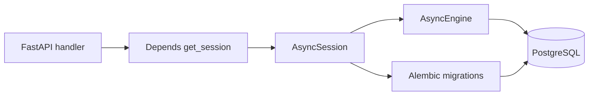

# 🗄️ Welcome to SQLAlchemy 2.0 Async + Alembic for FastAPI

## 🎯 Learning Objectives

By completing this course, you will master:

- The SQLAlchemy 2.0 async engine and how it differs fundamentally from the legacy 1.4 sync model
- The `AsyncSession` lifecycle, transaction management, and how to wire it into FastAPI's dependency injection
- Declarative models with `Mapped[...]` type annotations, relationships, and eager-loading strategies that eliminate the N+1 query problem
- Alembic migrations: autogenerate, manual revisions, branching, and zero-downtime production deploys
- The Repository pattern + Unit of Work abstraction that keeps your FastAPI handlers free of ORM details
- Multi-tenancy patterns: schema-per-tenant, PostgreSQL row-level security, and tenant middleware
- A production-grade capstone that ties everything together

## Introduction

Every non-trivial backend persists data. For Python + FastAPI services, the dominant data access library is **SQLAlchemy** — a project that has been continuously evolved since 2006 and reached a new milestone with the 2.0 release. The 2.0 line introduced a fully-typed, async-native core that pairs naturally with FastAPI's asyncio event loop. The companion tool, **Alembic**, handles schema migrations and is the de facto standard for evolving production databases without downtime.

This course assumes you have used SQLAlchemy 1.x or have only worked with raw SQL ORMs in another language. We start from the architectural changes introduced in 2.0 and build toward patterns that work in production under load. The course is **FastAPI-first**: every pattern is shown inside a FastAPI request handler, with the dependency injection wiring spelled out.

The course sits at a critical junction in the vault. It is a direct companion to [[../31 - FastAPI for ML/00 - Welcome to FastAPI for ML|FastAPI for ML]] (which covers ASGI, Pydantic, streaming, and deployment but does not touch the data layer) and to [[../36 - PostgreSQL for AI-ML Workloads/00 - Bienvenida|PostgreSQL for AI-ML Workloads]] (which covers the database engine itself, tuning, and pgvector). Together, the three courses form a complete stack: **HTTP framework → data access → database engine**.

---

## 📋 Course Map

| # | Note | Description | Lines |
|:-:|------|-------------|------:|
| 01 | Async Engine and Sessions | `create_async_engine`, `AsyncSession`, connection pool, `expire_on_commit` | ~400 |
| 02 | Models, Relationships, Eager Loading | `DeclarativeBase`, `Mapped[...]`, `relationship()`, `selectinload`, N+1 problem | ~450 |
| 03 | Alembic Migrations Workflow | `alembic init`, autogenerate, manual revisions, branching, production deploys | ~400 |
| 04 | Repository Pattern and Unit of Work | Abstract ORM, transactional integrity, testability | ~400 |
| 05 | FastAPI Integration: DI and Lifespan | `Depends(get_session)`, `async_sessionmaker`, engine lifecycle | ~450 |
| 06 | Multi-Tenancy Patterns | Schema-per-tenant, row-level security, tenant context middleware | ~400 |
| 07 | Capstone: Production API with DB | Full CRUD + auth + pagination + filters + migrations + tests | ~500 |

**Total**: 7 notes, ~3,000 lines.

---

## 🧱 Prerequisites

| Topic | Required Proficiency | Vault Note |
|-------|---------------------|------------|
| Python typing | Intermediate — `List[str]`, `Optional`, generics | [[../../03 - Advanced Python/01 - Python Basico/01 - Variables y Tipos de Datos]] |
| Async Python | Confident — `async def`, `await`, event loop | [[../../03 - Advanced Python/02 - Python Intermedio/07 - Async y Await]] |
| FastAPI basics | Confident — `Depends`, request/response models | [[../31 - FastAPI for ML/01 - ASGI Architecture and Async Python for ML]] |
| SQL fundamentals | Confident — joins, indexes, transactions, ACID | [[../../01 - Curso SQL con PostgreSQL/00 - Bienvenida]] |
| PostgreSQL | Basic — connection strings, psql, role management | [[../36 - PostgreSQL for AI-ML Workloads/00 - Bienvenida]] |

---

## 🎯 What You Will Build

By the end of this course you will have a production-grade task management API that:

- Serves a PostgreSQL backend through SQLAlchemy 2.0 async with proper connection pooling
- Uses Alembic to manage schema migrations including a real branching + merge workflow
- Enforces multi-tenant isolation at the data layer using PostgreSQL row-level security
- Exposes a clean repository interface to FastAPI handlers (no ORM details leak into HTTP code)
- Passes a full integration test suite that exercises transactions, eager loading, and tenant scoping
- Survives connection storms, slow queries, and process restarts without corrupting state

---

## 🔗 Vault Connections

- **[[../31 - FastAPI for ML/00 - Welcome to FastAPI for ML|FastAPI for ML]]** — the HTTP layer this course pairs with
- **[[../36 - PostgreSQL for AI-ML Workloads/00 - Bienvenida|PostgreSQL for AI-ML Workloads]]** — engine tuning, pgvector, CDC
- **[[../33 - Vector Databases and Semantic Search/00 - Welcome to Vector Databases|Vector Databases]]** — when SQL is not the right tool (semantic search)
- **[[../25 - Bases de Datos y Message Queues/00 - Bases de Datos y Message Queues|Bases de Datos y Message Queues]]** — broader data infrastructure patterns
- **[[../../09 - MLOps y Produccion/19 - Feature Engineering y Feature Stores/00 - Bienvenida|Feature Stores]]** — point-in-time joins, online feature serving

## References

- [SQLAlchemy 2.0 Documentation](https://docs.sqlalchemy.org/en/20/)
- [Alembic Documentation](https://alembic.sqlalchemy.org/en/latest/)
- [SQLAlchemy 2.0 Migration Guide](https://docs.sqlalchemy.org/en/20/changelog/migration_20.html)
- [asyncpg Documentation](https://magicstack.github.io/asyncpg/current/)
- [PostgreSQL Row-Level Security](https://www.postgresql.org/docs/current/ddl-rowsecurity.html)
