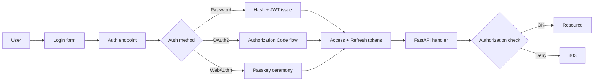

# 🔐 Welcome to Authentication Deep Dive for FastAPI

## 🎯 Learning Objectives

By completing this course, you will master:

- The trade-offs between sessions, JWT, OAuth2, SAML, and WebAuthn
- JWT structure, signing algorithms, refresh-token rotation, and revocation
- The full OAuth2 flow family: Authorization Code, Client Credentials, PKCE, and Device Code
- Role-based access control (RBAC), scope-based authorization, and attribute-based access control (ABAC)
- Multi-tenant authentication, where the same user might belong to multiple tenants with different roles
- Modern authentication: TOTP, WebAuthn, passkeys, and phishing-resistant flows
- A production-grade capstone that ties everything together

## Introduction

Authentication is the most security-critical layer of a backend service. A flawed implementation is not a bug — it is a compliance incident. Yet many production services get auth wrong in subtle ways: tokens that never expire, refresh tokens that never rotate, sessions that store sensitive data in plaintext, password hashing with the wrong algorithm, OAuth implementations that leak credentials in the redirect URL. This course treats auth as the security boundary it is, not a checkbox feature.

The course builds on [[../31 - FastAPI for ML/00 - Welcome to FastAPI for ML|FastAPI for ML]] and [[../38 - SQLAlchemy 2.0 Async + Alembic for FastAPI/00 - Welcome|SQLAlchemy 2.0 Async + Alembic]]. It assumes a working FastAPI + SQLAlchemy stack. The patterns here assume PostgreSQL for sessions and refresh-token storage; SQLite is fine for examples but not for production.

The course is opinionated: it follows the OWASP ASVS Level 2 guidelines, the OAuth 2.1 draft, and the WebAuthn Level 2 spec. Where the spec allows choices, the course makes a recommendation and explains the rationale.

---

## 📋 Course Map

| # | Note | Description | Lines |
|:-:|------|-------------|------:|
| 01 | JWT Deep Dive | JWT structure, signing, refresh rotation, revocation, sliding sessions | ~450 |
| 02 | OAuth2 Flows in FastAPI | Auth Code, Client Credentials, PKCE; authlib integration; FastAPI Users | ~450 |
| 03 | RBAC, Scopes, and ABAC | `SecurityScopes`, dependency-based authz, row-level permissions | ~400 |
| 04 | Multi-Tenant Auth | Tenant context, user-tenant membership, superadmin patterns | ~400 |
| 05 | MFA, Passkeys, and WebAuthn | TOTP, WebAuthn ceremony, recovery codes, phishing-resistant auth | ~400 |
| 06 | Capstone: SaaS Auth System | Login + register + MFA + RBAC + tenant context + tests | ~500 |

**Total**: 6 notes, ~2,600 lines.

---

## 🧱 Prerequisites

| Topic | Required Proficiency | Vault Note |
|-------|---------------------|------------|
| FastAPI basics | Confident — `Depends`, request/response models | [[../31 - FastAPI for ML/01 - ASGI Architecture and Async Python for ML]] |
| SQLAlchemy 2.0 async | Confident — session, models, UoW | [[../38 - SQLAlchemy 2.0 Async + Alembic for FastAPI/00 - Welcome]] |
| Cryptography basics | Familiar — hash, sign, verify | External resource |
| HTTP fundamentals | Confident — headers, status codes, cookies | Standard |

---

## 🎯 What You Will Build

By the end of this course you will have a production-grade auth system that:

- Issues short-lived JWT access tokens (15 min) with rotating refresh tokens (7 days)
- Implements OAuth2 Authorization Code flow with PKCE for third-party clients
- Enforces role-based access (admin, member, viewer) on every endpoint
- Supports multi-tenant auth where a user can belong to multiple tenants
- Adds optional TOTP-based MFA
- Audits every authentication event
- Passes a security review checklist

---

## 🔗 Vault Connections

- **[[../31 - FastAPI for ML/00 - Welcome to FastAPI for ML|FastAPI for ML]]** — the HTTP layer
- **[[../38 - SQLAlchemy 2.0 Async + Alembic for FastAPI/00 - Welcome|SQLAlchemy 2.0 Async + Alembic]]** — the data layer for users, sessions, audit logs
- **[[../06 - Large Language Models/15 - LLM Security and Guardrails/00 - Welcome to LLM Security and Guardrails|LLM Security and Guardrails]]** — when auth is for an LLM API (different concerns)
- **[[../15 - LLM Security and Guardrails/00 - Welcome to LLM Security and Guardrails|LLM Security]]** — the security-specific deep dive (overlap)

## References

- [OWASP ASVS 4.0](https://owasp.org/www-project-application-security-verification-standard/)
- [OAuth 2.1 Draft](https://datatracker.ietf.org/doc/draft-ietf-oauth-v2-1/)
- [RFC 8725 — JWT Best Current Practices](https://www.rfc-editor.org/rfc/rfc8725)
- [WebAuthn Level 2 — W3C](https://www.w3.org/TR/webauthn-2/)
- [OWASP Authentication Cheat Sheet](https://cheatsheetseries.owasp.org/cheatsheets/Authentication_Cheat_Sheet.html)
- [Authlib Documentation](https://authlib.org/)
- [FastAPI Users](https://fastapi-users.github.io/fastapi-users/)
