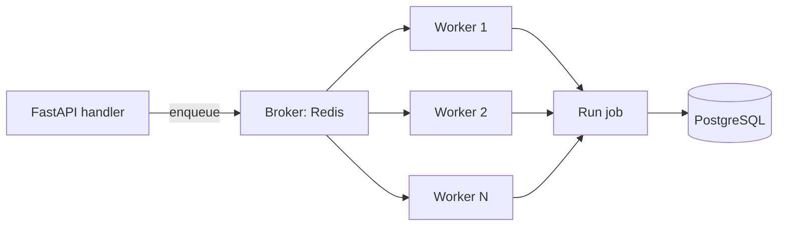

# ⚙️ Welcome to Background Jobs and Workers for FastAPI

## 🎯 Learning Objectives

By completing this course, you will master:

- The full landscape of background job frameworks: when to use sync, async, RQ, Celery, ARQ, Dramatiq, or Saq
- Setting up ARQ (modern async-native) for high-throughput job processing with FastAPI integration
- Celery deep dive: tasks, canvas, beat scheduler, result backends, monitoring
- Production patterns: idempotency, retries with exponential backoff, dead-letter queues, observability
- A production-grade capstone that ties together email, PDF generation, and webhook delivery

## Introduction

Every non-trivial FastAPI service eventually needs work that should not block the request: sending an email, generating a PDF, calling a slow external API, recomputing a recommendation, processing an upload, sending a webhook. The naïve approach — do it inline — works until the email server times out at the worst possible moment and the user sees a 500 for a "successful" signup. The right approach is to **defer the work** to a background job and return immediately.

The challenge is that "background job" is a deceptively simple concept hiding a lot of complexity. Should the job run in the same process (FastAPI's `BackgroundTasks`)? A separate process? A distributed queue? What happens when the worker dies mid-job? What happens when the same job is enqueued twice? How do you monitor a system that processes thousands of jobs per minute? How do you roll out a new version of a job without dropping in-flight work? The answers depend on the framework, the workload, and the operational maturity of the team.

This course covers the major frameworks in production use, with a focus on the patterns that matter at scale. The course assumes you have a working FastAPI + SQLAlchemy stack ([[../38 - SQLAlchemy 2.0 Async + Alembic for FastAPI/00 - Welcome|the SQLAlchemy course]]) and a Redis instance (the standard broker for most modern frameworks).

---

## 📋 Course Map

| # | Note | Description | Lines |
|:-:|------|-------------|------:|
| 01 | When to Use Workers | Sync vs async vs RQ vs Celery vs ARQ vs Dramatiq vs Saq | ~400 |
| 02 | ARQ: Modern Async-Native | Redis-based, asyncio-native, integrates with FastAPI lifespan | ~450 |
| 03 | Celery Deep Dive | Tasks, canvas, beat, result backends, monitoring | ~450 |
| 04 | Dramatiq and Saq | Alternative frameworks comparison | ~400 |
| 05 | Capstone: Email + PDF + Webhook | End-to-end workflow with retries, idempotency, observability | ~500 |

**Total**: 5 notes, ~2,200 lines.

---

## 🧱 Prerequisites

| Topic | Required Proficiency | Vault Note |
|-------|---------------------|------------|
| FastAPI basics | Confident — handlers, DI, lifespan | [[../31 - FastAPI for ML/01 - ASGI Architecture and Async Python for ML]] |
| SQLAlchemy 2.0 async | Confident — sessions, UoW | [[../38 - SQLAlchemy 2.0 Async + Alembic for FastAPI/00 - Welcome]] |
| Redis basics | Familiar — GET/SET, lists, pub/sub | External resource |
| Docker | Familiar — Compose for dev, K8s for prod | External resource |
| Async Python | Confident — event loop, asyncio | [[../31 - FastAPI for ML/01 - ASGI Architecture and Async Python for ML]] |

---

## 🎯 What You Will Build

By the end of this course you will have a production-grade job system that:

- Enqueues jobs from FastAPI handlers without blocking the request
- Processes jobs asynchronously with retries and exponential backoff
- Provides at-least-once delivery with idempotency keys
- Surfaces jobs in a dead-letter queue when retries exhaust
- Monitors job health via Prometheus and structured logs
- Survives worker crashes and process restarts without losing data

---

## 🔗 Vault Connections

- **[[../31 - FastAPI for ML/00 - Welcome to FastAPI for ML|FastAPI for ML]]** — the HTTP layer
- **[[../38 - SQLAlchemy 2.0 Async + Alembic for FastAPI/00 - Welcome|SQLAlchemy 2.0 Async + Alembic]]** — the data layer for job state, audit logs
- **[[../41 - API Design Patterns for FastAPI/00 - Welcome|API Design Patterns]]** — when to use webhooks vs polling, RFC 7807 error patterns
- **[[../43 - File Storage and Uploads for FastAPI/00 - Welcome|File Storage and Uploads]]** — file processing as a job
- **[[../45 - Webhooks In/Out for FastAPI/00 - Welcome|Webhooks In/Out]]** — webhook delivery as a job
- **[[../44 - Email and Notifications for FastAPI/00 - Welcome|Email and Notifications]]** — email send as a job

## References

- [Celery Documentation](https://docs.celeryq.dev/)
- [ARQ Documentation](https://arq-docs.helpmanual.io/)
- [Dramatiq Documentation](https://dramatiq.io/)
- [Saq Documentation](https://github.com/tobymao/saq)
- [Python RQ Documentation](https://python-rq.org/docs/)
- [Redis Streams — the broker primitive that ARQ and Saq use](https://redis.io/docs/latest/develop/data-types/streams/)
- [Designing Data-Intensive Applications — Chapter 11 (Stream Processing)](https://dataintensive.net/)
