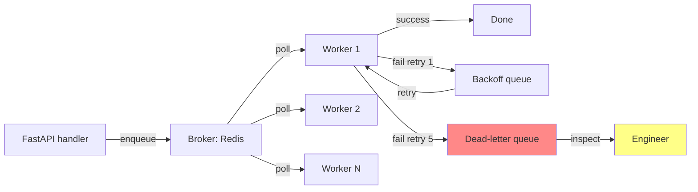

# 🤔 When to Use Workers

## 🎯 Learning Objectives

- Recognize the signals that a request handler should defer work to a background job
- Compare the six major worker frameworks: RQ, Celery, ARQ, Dramatiq, Saq, FastAPI BackgroundTasks
- Choose the right framework for your workload, team, and operational maturity
- Avoid the four most common "background job" mistakes

## Introduction

The hardest part of background jobs is not the implementation. It is knowing **when** to use one. A handler that does too much work inline times out, holds a database connection during an external HTTP call, and blocks the request from returning. A handler that defers too much work to a job makes the system harder to reason about: the user thinks the email was sent (because the API returned 200), but the job is still in the queue. The line between "do it inline" and "do it later" is rarely obvious.

This note covers the decision framework: which signals say "defer this work", and which framework fits which workload. The subsequent notes dive into the implementation of each framework.

---

## 1. The Six Signals That You Need a Worker

### 1.1 The request handler calls an external service

```python
# ❌ Inline external call
@router.post("/users")
async def create_user(payload: UserCreate):
    user = await save_user(payload)
    # If SendGrid is slow, this entire request is slow
    await sendgrid.send(...)
    return user
```

The external call is outside your control. SendGrid could be down, slow, or rate-limiting you. The user sees a 500 for what is, from their perspective, a "successful" signup.

### 1.2 The work takes more than ~500ms

A handler that takes more than half a second feels slow. Even if the response is correct, the user perceives a bug. Long work belongs in a job; the handler returns immediately with a "we're working on it" status.

```python
# ❌ A 30-second inline task
@router.post("/reports")
async def generate_report(payload: ReportRequest):
    # 30 seconds of CPU-bound work
    return await compute_report(...)
```

```python
# ✅ Defer and return a job ID
@router.post("/reports", status_code=202)
async def generate_report(payload: ReportRequest):
    job_id = await enqueue("generate_report", payload.model_dump())
    return {"job_id": job_id, "status": "queued"}
```

### 1.3 The work is fire-and-forget

Sometimes the work is "should happen" but "doesn't need to block the response". Sending a welcome email is the canonical example. The user gets their account immediately; the email arrives a few seconds later. If the email fails, you can retry; the user doesn't care.

```python
# ✅ Fire and forget
@router.post("/users", status_code=201)
async def create_user(payload: UserCreate):
    user = await save_user(payload)
    await enqueue("send_welcome_email", user.email)  # does not block
    return user
```

### 1.4 The work is retried on failure

A network call to a third-party API might fail. If it's inline, the user sees a 500 and has to retry. If it's a job with retries, the user sees a 200 and the system handles the retry in the background.

```python
# ✅ Retries in the worker, not in the handler
@router.post("/users", status_code=201)
async def create_user(payload: UserCreate):
    user = await save_user(payload)
    await enqueue("send_welcome_email", user.email, max_retries=3, backoff="exponential")
    return user
```

### 1.5 The work is rate-limited at the user level

A user clicks "send 100 invitations". Sending them all inline hits the email provider's rate limit. The job system spaces them out.

### 1.6 The work is part of a saga

A multi-step process (e.g., order → charge → email → fulfill) where each step might fail and need to be retried independently. The job system coordinates the steps; the handler initiates.

---

## 2. The Six Frameworks

### 2.1 FastAPI `BackgroundTasks`

Part of FastAPI; no installation required. Runs **in the same process** after the response is sent.

```python
from fastapi import BackgroundTasks


@router.post("/users")
async def create_user(payload: UserCreate, background_tasks: BackgroundTasks):
    user = await save_user(payload)
    background_tasks.add_task(send_email, user.email)
    return user
```

**Use when**: the work is fast (under a few seconds), the failure mode is acceptable (a missing email is OK), and you don't need a separate process.

**Don't use when**: the work is slow, the work must survive a process restart, or you need retries with backoff. `BackgroundTasks` runs once and forgets.

### 2.2 RQ (Redis Queue)

The simplest "real" job queue. Redis as the broker; one worker process pulls jobs and runs them.

```python
from redis import Redis
from rq import Queue

queue = Queue(connection=Redis())


@router.post("/users")
async def create_user(payload: UserCreate):
    user = await save_user(payload)
    queue.enqueue(send_email, user.email)
    return user
```

**Use when**: small to medium services with simple job types, no chains or canvas, no scheduled jobs.

**Don't use when**: you need complex workflows (chains, groups, chords), scheduled jobs, or distributed task routing.

### 2.3 Celery

The granddaddy of Python job queues. Battle-tested since 2009. Supports everything: chains, groups, chords, beat scheduler, multiple brokers, multiple result backends, distributed routing, monitoring.

```python
from celery import Celery

celery_app = Celery("tasks", broker="redis://localhost:6379/0")


@celery_app.task
def send_email(to: str):
    ...


@router.post("/users")
async def create_user(payload: UserCreate):
    user = await save_user(payload)
    send_email.delay(user.email)
    return user
```

**Use when**: complex workflows, many job types, scheduled jobs, team familiarity, battle-tested in production.

**Don't use when**: you're starting a new project, the team is small, you don't need chains/canvas. Celery is powerful but has a steep learning curve and a lot of legacy code.

### 2.4 ARQ (Asynchronous Redis Queue)

Modern async-native job queue. Uses Redis Streams under the hood. Integrates naturally with FastAPI's asyncio event loop.

```python
from arq import create_pool
from arq.connections import RedisSettings

redis = await create_pool(RedisSettings())


async def send_email(ctx, to: str):
    ...


class WorkerSettings:
    functions = [send_email]


@router.post("/users")
async def create_user(payload: UserCreate):
    user = await save_user(payload)
    await redis.enqueue_job("send_email", user.email)
    return user
```

**Use when**: you have a FastAPI service, you want async-native jobs, you don't need Celery's complex canvas. ARQ is the modern default for FastAPI.

**Don't use when**: you need scheduled jobs (no built-in beat), complex canvas (limited), or mature ecosystem tooling.

### 2.5 Dramatiq

Modern alternative to Celery. RabbitMQ or Redis broker. Excellent actor-based model, retries, dead-letter queues, rate limiting.

```python
import dramatiq

@dramatiq.actor(max_retries=3, retry_when=dramatiq.RetryPolicies.tenacity)
def send_email(to: str):
    ...


@router.post("/users")
async def create_user(payload: UserCreate):
    user = await save_user(payload)
    send_email.send(user.email)
    return user
```

**Use when**: you need Celery-like features but in a modern, simpler package. Dramatiq is a sweet spot between ARQ's simplicity and Celery's complexity.

**Don't use when**: you need async-native jobs (Dramatiq's worker is sync). For FastAPI services, ARQ or Saq are better fits.

### 2.6 Saq (Simple Async Queue)

Async-native alternative to RQ. Uses Redis. Simple API, similar in feel to ARQ.

```python
from saq import Queue
from saq.job import Job

queue = Queue.from_url("redis://localhost:6379")


async def send_email(ctx, to: str):
    ...


@router.post("/users")
async def create_user(payload: UserCreate):
    user = await save_user(payload)
    await queue.enqueue("send_email", to=user.email)
    return user
```

**Use when**: you want async-native jobs with a simpler API than ARQ. Saq is similar to ARQ in features; the choice is mostly stylistic.

**Don't use when**: you need Celery's complex canvas (Saq has limited support).

---

## 3. The Decision Matrix

| Need | Framework | Why |
|------|-----------|-----|
| Fast fire-and-forget, under 1s | FastAPI `BackgroundTasks` | No infrastructure |
| Simple queue, no chains | RQ | Easy to learn, Redis only |
| Async-native, FastAPI integration | **ARQ** | The modern default for FastAPI |
| Async-native, alternative | Saq | Similar to ARQ, slight API differences |
| Complex workflows, scheduled jobs, mature | Celery | Battle-tested, lots of features |
| Celery-like but modern | Dramatiq | Sweet spot for sync workers |

For a **new FastAPI service** in 2026, the default is **ARQ**:
- Async-native (no sync/async impedance mismatch with FastAPI).
- Lightweight (~2k LoC of code).
- Redis Streams (no broker lock-in beyond Redis).
- Active maintenance.
- Integrates with FastAPI's lifespan.

Celery is the right choice for **complex, mature systems** with chains, scheduled jobs, and team familiarity. Dramatiq is the right choice for **Celery-like features without the complexity**, but with sync workers.

---

## 4. The Four Common "Background Job" Mistakes

### 4.1 Putting the work in the handler anyway

```python
# ❌ Defeats the purpose
@router.post("/users")
async def create_user(payload: UserCreate, background_tasks: BackgroundTasks):
    user = await save_user(payload)
    background_tasks.add_task(send_email_blocking, user.email)  # still blocks!
    return user
```

`BackgroundTasks` is async but the work inside is whatever you put there. If `send_email_blocking` is a 5-second call, the request still hangs for 5 seconds (in the same process) and then the response is sent.

### 4.2 No idempotency

```python
# ❌ The job might be enqueued twice
@router.post("/users")
async def create_user(payload: UserCreate):
    user = await save_user(payload)
    queue.enqueue(send_email, user.email)
    return user
# If the request is retried (network blip), two emails are sent
```

The fix: pass an idempotency key (the user ID, the request ID) and check at the start of the job whether the work has been done.

```python
# ✅ Idempotency key
async def send_email_with_idempotency(ctx, to: str, idempotency_key: str):
    if await uow.email_log.exists(idempotency_key=idempotency_key):
        return  # already sent
    await send_email(to)
    await uow.email_log.create(idempotency_key=idempotency_key, sent_at=now())


@router.post("/users")
async def create_user(payload: UserCreate):
    user = await save_user(payload)
    await queue.enqueue("send_email", to=user.email, idempotency_key=f"welcome:{user.id}")
    return user
```

### 4.3 No observability

```python
# ❌ A job that fails silently
@celery_app.task
def process_upload(file_id: int):
    # Raises an exception; the job is retried 3 times then dropped
    process(file_id)
```

Without structured logs, metrics, and a dead-letter queue, a failing job is invisible. The user sees their upload as "stuck" and the engineer has no way to debug.

The right setup: structured logs with the job ID, Prometheus metrics for queue depth and job duration, a dead-letter queue for failed jobs, alerting on job failure rate.

### 4.4 No backpressure

```python
# ❌ Enqueueing faster than workers can process
for user_id in user_ids:
    queue.enqueue(send_email, user_id)  # 100K enqueued, 10 workers
```

The queue grows without bound. Memory pressure. Worker lag increases. The right setup: limit the queue size, reject new jobs when the queue is full (return 503), or rate-limit the enqueue side.

---

## 5. The Boundary: When NOT to Use a Worker

### 5.1 Synchronous user requirements

A user logs in. The system must return a session token. **Do not defer this to a worker.** The whole point of the request is the response.

### 5.2 Sub-100ms work

A request that takes 50ms to process inline should not be enqueued. The enqueue overhead (Redis round-trip, serialization, broker) is often 5-10ms by itself. Add the worker pickup delay, and you've added latency without benefit.

### 5.3 Idempotent user actions

A user clicks "refresh" on a page. The handler is called twice. The work is the same; the second call is harmless. No worker needed.

### 5.4 Real-time requirements

If the user needs the result in under 100ms (e.g., autocomplete), a worker is the wrong tool. The latency budget doesn't allow for queue round-trips.

---

## 6. Job Design Principles

### 6.1 Idempotent

The same job can run twice without harm. Use an idempotency key; check the database for prior execution.

### 6.2 Atomic

A job either completes fully or has no effect. No partial state.

### 6.3 Idempotent on the receiving side

The handler that creates the entity (e.g., a user) is separate from the worker that processes it. If the handler succeeds and the worker fails, the user is created and the email is not sent. If the user retries the request, the handler is idempotent (re-creates the user) and the worker is idempotent (re-sends the email if not already sent).

### 6.4 Observable

Logs, metrics, traces. The system has answers to:
- How many jobs ran in the last hour?
- What is the average duration?
- How many failed?
- What is the queue depth?
- What is the lag between enqueue and processing?

### 6.5 Bounded retries

A job that fails 5 times is not going to succeed on the 6th. After N retries, it goes to a dead-letter queue for human inspection. The system does not retry forever.

### 6.6 Backpressure

The enqueue side respects the worker side. If the queue is full, the enqueue fails (returns 503) rather than growing unbounded.

---

## 7. The Architecture



The worker reads from the broker, processes the job, and either:
- **Success**: acks the job, removes it from the queue.
- **Retriable failure**: schedules a retry with exponential backoff.
- **Permanent failure**: sends the job to the dead-letter queue.

The engineer inspects the dead-letter queue. The system never silently drops a job.

---

## 8. The Operating Model

### 8.1 Where the workers run

Three common deployment patterns:

**Same process as the API (e.g., ARQ inside FastAPI)**: simplest, but the workers share resources with the API. A worker stuck on a slow job can starve the API.

**Separate process, same machine**: ARQ/Celery running in their own containers or systemd services, alongside the API. Better isolation.

**Separate machines, scaling independently**: a worker pool that can scale up to handle spikes. Best for production at scale.

### 8.2 Monitoring

The minimum viable monitoring:

- **Queue depth**: how many jobs are waiting? Growing = workers can't keep up.
- **Job duration p50/p95/p99**: how long do jobs take? Spikes = job regression.
- **Failure rate**: what % of jobs fail? Should be <1%.
- **Dead-letter queue size**: how many jobs have given up? Should be 0 in a healthy system.

Prometheus + Grafana dashboards are the standard. Alert on queue depth > 10K, failure rate > 5%, dead-letter > 0.

### 8.3 Graceful shutdown

Workers must finish in-flight jobs before exiting. A `SIGTERM` triggers the worker to stop polling the queue, wait for in-flight jobs to complete, then exit. Kubernetes' `terminationGracePeriodSeconds` is the timeout.

```python
async def on_shutdown(ctx):
    # Wait for in-flight jobs to complete
    await ctx["redis"].wait_for_in_flight_jobs(timeout=30)
```

---

## 9. Código de Compresión

```python
"""
Compresión: When to Use Workers
Covers: signals for background work, framework comparison, design principles.
"""
import asyncio
import secrets
from datetime import datetime
from typing import Any, Awaitable, Callable


# 1) The decision helper
def should_defer_to_worker(
    *,
    has_external_call: bool,
    estimated_duration_ms: int,
    is_fire_and_forget: bool,
    needs_retries: bool,
) -> bool:
    """Returns True if the work should be deferred to a background job."""
    return (
        has_external_call
        or estimated_duration_ms > 500
        or (is_fire_and_forget and needs_retries)
    )


# 2) Idempotency wrapper
def idempotent(key_fn: Callable[..., str]) -> Callable:
    """Decorator that prevents double-execution of a job."""
    seen_keys: set[str] = set()

    def decorator(func):
        async def wrapper(*args, **kwargs):
            key = key_fn(*args, **kwargs)
            if key in seen_keys:
                return None  # already processed
            seen_keys.add(key)
            return await func(*args, **kwargs)
        return wrapper
    return decorator


# 3) Retry with exponential backoff
def with_retry(max_retries: int = 5, base_delay: float = 1.0):
    def decorator(func):
        async def wrapper(*args, **kwargs):
            for attempt in range(max_retries):
                try:
                    return await func(*args, **kwargs)
                except Exception as e:
                    if attempt == max_retries - 1:
                        await send_to_dlq(func.__name__, args, kwargs, str(e))
                        raise
                    delay = base_delay * (2 ** attempt) + secrets.randbelow(1000) / 1000
                    await asyncio.sleep(delay)
        return wrapper
    return decorator


# 4) Health check
async def worker_health_check(queue) -> dict:
    return {
        "queue_depth": await queue.zcard("waiting"),
        "active_jobs": await queue.zcard("active"),
        "dlq_size": await queue.zcard("dead_letter"),
        "avg_duration_ms": await queue.get_metric("avg_duration_ms"),
        "failure_rate": await queue.get_metric("failure_rate"),
    }
```

---

## Key Takeaways

- Background jobs are for **slow work, external calls, retries, and fire-and-forget**. If the work is sub-100ms and user-blocking, do it inline.
- For a **new FastAPI service** in 2026, the default is **ARQ**: async-native, lightweight, Redis-based, integrates with FastAPI's lifespan.
- **Celery** is the right choice for complex, mature systems with chains, scheduled jobs, and team familiarity.
- **Dramatiq** is the modern alternative to Celery for sync workers.
- **FastAPI `BackgroundTasks`** is only for fast, in-process work that must run after the response.
- Every job must be **idempotent** (same input = same effect, can run twice without harm).
- Every job must have **bounded retries** (5 is a common cap); after that, the dead-letter queue.
- The system must be **observable** (queue depth, duration, failure rate, DLQ size).
- The system must have **backpressure** (limit queue size, reject enqueue when full).
- The workers must **gracefully shut down** (finish in-flight jobs before exiting).

## References

- [Celery Documentation](https://docs.celeryq.dev/)
- [ARQ Documentation](https://arq-docs.helpmanual.io/)
- [Dramatiq Documentation](https://dramatiq.io/)
- [Saq Documentation](https://github.com/tobymao/saq)
- [Python RQ Documentation](https://python-rq.org/docs/)
- [Designing Data-Intensive Applications — Chapter 11 (Stream Processing)](https://dataintensive.net/)
- [Stripe's blog — Idempotency Keys](https://stripe.com/blog/idempotency)
- [AWS — Backpressure Pattern](https://aws.amazon.com/builders-library/timeouts-retries-and-backoff-with-jitter/)
