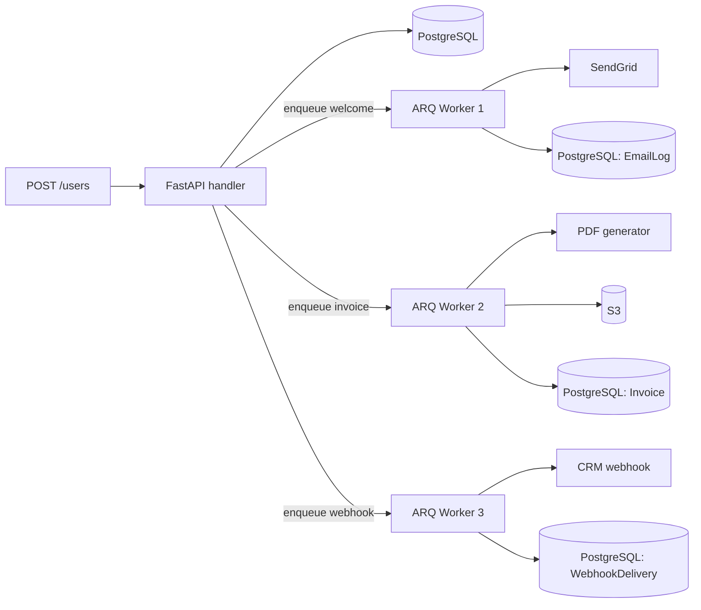

# 🏆 Capstone: Email + PDF + Webhook Workflow

## 🎯 Learning Objectives

- Build a production-grade multi-step workflow that ties together every pattern from the course
- Implement the "signup → email → PDF invoice → webhook" pipeline
- Apply the production patterns: retries with backoff, idempotency, dead-letter queue, observability
- Test the full pipeline end-to-end with httpx.AsyncClient and ARQ in eager mode
- Deploy with monitoring and graceful shutdown

## Introduction

This capstone is the integration of every concept in the course. The workflow is the canonical "user signs up" pipeline:

1. **User signs up**: the FastAPI handler creates the user in PostgreSQL.
2. **Welcome email**: ARQ worker sends a transactional email.
3. **PDF invoice**: ARQ worker generates a PDF invoice and stores it in S3.
4. **Webhook delivery**: ARQ worker notifies a third-party system (e.g., a CRM) that the user signed up.

Each step is a job. The handler returns immediately with a 201 Created. The jobs run in the background. The system handles retries, idempotency, and observability.

The codebase is intentionally small but complete. Reading it end-to-end is a review of the course. The patterns from the previous four notes are all used; if any are missing, that's a gap to fix.

---

## 1. The Architecture



Three workers can be the same process or separate. In production, the email worker is high-throughput (most calls are email); the PDF worker is CPU-bound (PDF generation); the webhook worker has different retry policies (webhooks are more error-prone than emails).

---

## 2. The Project Structure

```
signup_workflow/
├── app/
│   ├── main.py
│   ├── core/
│   │   ├── config.py
│   │   └── security.py
│   ├── db/
│   │   ├── base.py
│   │   ├── engine.py
│   │   └── session.py
│   ├── models/
│   │   ├── user.py
│   │   ├── invoice.py
│   │   ├── email_log.py
│   │   └── webhook_delivery.py
│   ├── jobs/
│   │   ├── __init__.py     # WorkerSettings
│   │   ├── email.py        # send_welcome_email
│   │   ├── invoice.py      # generate_invoice_pdf
│   │   └── webhook.py      # deliver_webhook
│   ├── api/
│   │   ├── deps.py
│   │   ├── users.py
│   │   └── webhooks.py
│   └── monitoring.py
├── tests/
│   ├── conftest.py
│   ├── test_signup_flow.py
│   └── test_jobs.py
└── docker/
    ├── Dockerfile
    └── docker-compose.yml
```

---

## 3. The Data Layer

### 3.1 Models

```python
# app/models/user.py
from datetime import datetime
from sqlalchemy import String, DateTime, Boolean, func
from sqlalchemy.orm import Mapped, mapped_column
from app.db.base import Base, TimestampMixin


class User(Base, TimestampMixin):
    __tablename__ = "users"
    id: Mapped[int] = mapped_column(primary_key=True)
    email: Mapped[str] = mapped_column(String(255), unique=True, index=True)
    name: Mapped[str] = mapped_column(String(100))
    is_active: Mapped[bool] = mapped_column(Boolean, default=True, server_default="true")


# app/models/email_log.py
class EmailLog(Base):
    __tablename__ = "email_log"
    id: Mapped[int] = mapped_column(primary_key=True)
    user_id: Mapped[int] = mapped_column(ForeignKey("users.id"))
    idempotency_key: Mapped[str] = mapped_column(String(64), unique=True)
    template: Mapped[str] = mapped_column(String(50))
    sent_at: Mapped[datetime] = mapped_column(server_default=func.now())


# app/models/invoice.py
class Invoice(Base):
    __tablename__ = "invoices"
    id: Mapped[int] = mapped_column(primary_key=True)
    user_id: Mapped[int] = mapped_column(ForeignKey("users.id"))
    amount_cents: Mapped[int]
    pdf_url: Mapped[str | None] = mapped_column(default=None)
    created_at: Mapped[datetime] = mapped_column(server_default=func.now())


# app/models/webhook_delivery.py
class WebhookDelivery(Base):
    __tablename__ = "webhook_deliveries"
    id: Mapped[int] = mapped_column(primary_key=True)
    event_type: Mapped[str] = mapped_column(String(50))
    target_url: Mapped[str]
    payload: Mapped[dict] = mapped_column(JSON)
    idempotency_key: Mapped[str] = mapped_column(String(64), unique=True)
    status: Mapped[str] = mapped_column(String(20), default="pending")  # pending, sent, failed
    attempts: Mapped[int] = mapped_column(default=0)
    last_attempt_at: Mapped[datetime | None] = mapped_column(default=None)
    created_at: Mapped[datetime] = mapped_column(server_default=func.now())
```

The `idempotency_key` columns are the key to "do once, never again" semantics. Each is a `UNIQUE` constraint; a duplicate insert raises an `IntegrityError` that the worker catches.

### 3.2 The migration

```python
# alembic/versions/001_signup_workflow.py
def upgrade() -> None:
    op.create_table("users", ...)
    op.create_table("email_log", ...)
    op.create_table("invoices", ...)
    op.create_table("webhook_deliveries", ...)


def downgrade() -> None:
    op.drop_table("webhook_deliveries")
    op.drop_table("invoices")
    op.drop_table("email_log")
    op.drop_table("users")
```

The tables are simple; no RLS needed for this single-tenant workflow.

---

## 4. The Jobs

### 4.1 The email job

```python
# app/jobs/email.py
from arq.connections import ArqRedis
import aiosmtplib
from email.message import EmailMessage
from sqlalchemy import select
from sqlalchemy.exc import IntegrityError
from app.core.config import settings
from app.db.session import async_session_maker
from app.models.email_log import EmailLog
from app.models.user import User


async def send_welcome_email(ctx, to: str, user_id: int, idempotency_key: str):
    """Send a welcome email. Idempotent: skipped if already sent."""
    async with async_session_maker()() as session:
        # Check idempotency
        existing = (await session.execute(
            select(EmailLog).where(EmailLog.idempotency_key == idempotency_key)
        )).scalar_one_or_none()
        if existing:
            ctx["logger"].info(f"Email already sent: {idempotency_key}")
            return
        # Look up the user
        user = await session.get(User, user_id)
        if not user:
            ctx["logger"].warning(f"User {user_id} not found; skipping email")
            return
        # Send the email
        msg = EmailMessage()
        msg["From"] = settings.EMAIL_FROM
        msg["To"] = to
        msg["Subject"] = f"Welcome to {settings.APP_NAME}, {user.name}!"
        msg.set_content(f"Hi {user.name},\n\nWelcome aboard!\n\n— The team")
        async with aiosmtplib.SMTP(hostname=settings.SMTP_HOST, port=settings.SMTP_PORT) as smtp:
            await smtp.login(settings.SMTP_USER, settings.SMTP_PASS)
            await smtp.send_message(msg)
        # Log the success
        session.add(EmailLog(
            user_id=user_id,
            idempotency_key=idempotency_key,
            template="welcome",
        ))
        try:
            await session.commit()
        except IntegrityError:
            # Another worker raced us; the email is already logged
            await session.rollback()
            ctx["logger"].info(f"Email race detected: {idempotency_key}")
```

The `try/except IntegrityError` handles the race where two workers try to send the same email. The UNIQUE constraint on `idempotency_key` ensures exactly-once.

### 4.2 The PDF invoice job

```python
# app/jobs/invoice.py
import io
from sqlalchemy import select
from sqlalchemy.exc import IntegrityError
import boto3
from reportlab.pdfgen import canvas
from app.core.config import settings
from app.db.session import async_session_maker
from app.models.invoice import Invoice
from app.models.user import User


async def generate_invoice_pdf(ctx, user_id: int, amount_cents: int, idempotency_key: str):
    """Generate a PDF invoice and upload to S3. Idempotent."""
    async with async_session_maker()() as session:
        # Check idempotency via the invoice record
        existing = (await session.execute(
            select(Invoice).where(Invoice.id == int(idempotency_key.split(":")[-1]))
        )).scalar_one_or_none()
        if existing and existing.pdf_url:
            ctx["logger"].info(f"PDF already generated: {idempotency_key}")
            return existing.pdf_url
        # Generate the PDF
        user = await session.get(User, user_id)
        if not user:
            ctx["logger"].warning(f"User {user_id} not found; skipping invoice")
            return
        buf = io.BytesIO()
        pdf = canvas.Canvas(buf)
        pdf.setTitle(f"Invoice for {user.name}")
        pdf.drawString(72, 720, f"Invoice for {user.name}")
        pdf.drawString(72, 700, f"Email: {user.email}")
        pdf.drawString(72, 680, f"Amount: ${amount_cents / 100:.2f}")
        pdf.showPage()
        pdf.save()
        buf.seek(0)
        # Upload to S3
        s3 = boto3.client("s3", region_name=settings.AWS_REGION)
        key = f"invoices/{user_id}/{idempotency_key}.pdf"
        s3.upload_fileobj(buf, settings.S3_BUCKET, key)
        pdf_url = f"https://{settings.S3_BUCKET}.s3.amazonaws.com/{key}"
        # Create or update the invoice
        invoice = existing or Invoice(
            id=int(idempotency_key.split(":")[-1]),
            user_id=user_id,
            amount_cents=amount_cents,
        )
        invoice.pdf_url = pdf_url
        session.add(invoice)
        try:
            await session.commit()
        except IntegrityError:
            await session.rollback()
            ctx["logger"].info(f"Invoice race detected: {idempotency_key}")
        return pdf_url
```

The PDF is generated with `reportlab`, uploaded to S3, and the URL is stored. The `idempotency_key` here is structured as `invoice:{user_id}` so the worker can find the existing invoice if it was created.

### 4.3 The webhook job

```python
# app/jobs/webhook.py
import hashlib
import hmac
import json
from datetime import datetime
import httpx
from sqlalchemy import select
from sqlalchemy.exc import IntegrityError
from app.core.config import settings
from app.db.session import async_session_maker
from app.models.webhook_delivery import WebhookDelivery


async def deliver_webhook(
    ctx, event_type: str, target_url: str, payload: dict, idempotency_key: str,
    max_attempts: int = 5,
):
    """Deliver a webhook with HMAC signature and exponential backoff."""
    async with async_session_maker()() as session:
        # Check existing delivery
        existing = (await session.execute(
            select(WebhookDelivery).where(
                WebhookDelivery.idempotency_key == idempotency_key
            )
        )).scalar_one_or_none()
        if existing and existing.status == "sent":
            ctx["logger"].info(f"Webhook already sent: {idempotency_key}")
            return
        # Record the attempt
        delivery = existing or WebhookDelivery(
            event_type=event_type,
            target_url=target_url,
            payload=payload,
            idempotency_key=idempotency_key,
            status="pending",
        )
        delivery.attempts += 1
        delivery.last_attempt_at = datetime.utcnow()
        # Sign the payload
        body = json.dumps(payload).encode()
        signature = hmac.new(
            settings.WEBHOOK_SECRET.encode(), body, hashlib.sha256,
        ).hexdigest()
        headers = {
            "Content-Type": "application/json",
            "X-Webhook-Signature": f"sha256={signature}",
            "X-Webhook-Event": event_type,
            "X-Webhook-Idempotency-Key": idempotency_key,
        }
        # Deliver
        try:
            async with httpx.AsyncClient(timeout=10) as client:
                response = await client.post(target_url, content=body, headers=headers)
                if response.status_code < 300:
                    delivery.status = "sent"
                    ctx["logger"].info(f"Webhook sent: {idempotency_key}")
                else:
                    delivery.status = "failed"
                    ctx["logger"].warning(f"Webhook failed: {response.status_code}")
                    if delivery.attempts < max_attempts:
                        # ARQ will retry based on WorkerSettings
                        raise RuntimeError(f"Webhook {target_url} returned {response.status_code}")
        except Exception as e:
            delivery.status = "failed"
            ctx["logger"].error(f"Webhook error: {e}")
            if delivery.attempts < max_attempts:
                raise  # ARQ will retry
        try:
            session.add(delivery)
            await session.commit()
        except IntegrityError:
            await session.rollback()
```

The webhook delivery is a classic "do once, retry on failure" job. The `attempts` counter and `max_attempts` cap prevent infinite retries.

### 4.4 The Worker settings

```python
# app/jobs/__init__.py
from arq.connections import RedisSettings
from app.jobs.email import send_welcome_email
from app.jobs.invoice import generate_invoice_pdf
from app.jobs.webhook import deliver_webhook


class WorkerSettings:
    functions = [send_welcome_email, generate_invoice_pdf, deliver_webhook]
    redis_settings = RedisSettings()
    max_jobs = 10
    job_timeout = 300
    max_tries = 5
    retry_backoff = lambda ctx: 2 ** ctx["job_try"]
    keep_result = 60
    health_check_interval = 30
```

---

## 5. The API Layer

### 5.1 The signup handler

```python
# app/api/users.py
from fastapi import APIRouter, Depends, HTTPException, status
from pydantic import BaseModel, EmailStr
from sqlalchemy.exc import IntegrityError
from arq import ArqRedis
from app.api.deps import get_arq
from app.db.session import async_session_maker
from app.models.user import User


router = APIRouter(prefix="/users", tags=["users"])


class UserCreate(BaseModel):
    email: EmailStr
    name: str
    password: str
    plan: str = "free"


class UserOut(BaseModel):
    id: int
    email: str
    name: str
    is_active: bool

    class Config:
        from_attributes = True


@router.post("", response_model=UserOut, status_code=status.HTTP_201_CREATED)
async def create_user(
    payload: UserCreate,
    arq: ArqRedis = Depends(get_arq),
):
    """Create a user and enqueue the welcome workflow."""
    async with async_session_maker()() as session:
        # Create the user
        user = User(
            email=payload.email,
            name=payload.name,
            # hashed_password=hash_password(payload.password),
        )
        session.add(user)
        try:
            await session.commit()
            await session.refresh(user)
        except IntegrityError:
            raise HTTPException(409, "Email already registered")
    # Enqueue the welcome workflow
    idempotency_key = f"welcome:{user.id}"
    await arq.enqueue_job(
        "send_welcome_email",
        to=user.email,
        user_id=user.id,
        idempotency_key=idempotency_key,
    )
    # Enqueue the invoice (for paid plans)
    if payload.plan != "free":
        amount_cents = 990 if payload.plan == "pro" else 9900
        invoice_id = f"invoice:{user.id}".encode().hex()  # simple unique ID
        await arq.enqueue_job(
            "generate_invoice_pdf",
            user_id=user.id,
            amount_cents=amount_cents,
            idempotency_key=f"invoice:{user.id}",
        )
    # Enqueue the CRM webhook
    await arq.enqueue_job(
        "deliver_webhook",
        event_type="user.signed_up",
        target_url="https://api.crm.example.com/webhooks/users",
        payload={"user_id": user.id, "email": user.email, "plan": payload.plan},
        idempotency_key=f"crm:user.signed_up:{user.id}",
    )
    return user
```

The handler creates the user, then enqueues three jobs: email, invoice (for paid plans), and webhook. The handler returns 201 Created with the user object.

### 5.2 The webhook inspection endpoint

```python
@router.get("/webhooks/{event_type}")
async def list_webhook_deliveries(
    event_type: str,
    arq: ArqRedis = Depends(get_arq),
):
    """List webhook delivery attempts (for debugging)."""
    async with async_session_maker()() as session:
        from sqlalchemy import select
        from app.models.webhook_delivery import WebhookDelivery
        deliveries = (await session.execute(
            select(WebhookDelivery).where(
                WebhookDelivery.event_type == event_type
            ).order_by(WebhookDelivery.created_at.desc()).limit(50)
        )).scalars().all()
        return [
            {
                "id": d.id,
                "idempotency_key": d.idempotency_key,
                "status": d.status,
                "attempts": d.attempts,
                "last_attempt_at": d.last_attempt_at.isoformat() if d.last_attempt_at else None,
            }
            for d in deliveries
        ]
```

Useful for debugging: see which webhooks were delivered, which failed, how many attempts they took.

---

## 6. The FastAPI App

```python
# app/main.py
from contextlib import asynccontextmanager
from fastapi import FastAPI
from arq import create_pool
from arq.connections import RedisSettings
from app.api.users import router as users_router
from app.db.engine import engine


@asynccontextmanager
async def lifespan(app: FastAPI):
    app.state.arq = await create_pool(RedisSettings())
    yield
    await app.state.arq.close()
    await engine.dispose()


app = FastAPI(lifespan=lifespan, title="Signup Workflow")
app.include_router(users_router)


@app.get("/health")
async def health():
    return {"status": "ok"}
```

The FastAPI app enqueues; the workers consume. The `lifespan` manages the ARQ pool and the SQLAlchemy engine.

---

## 7. Observability

### 7.1 Structured logging

```python
# app/jobs/email.py
import structlog
logger = structlog.get_logger()

async def send_welcome_email(ctx, to: str, user_id: int, idempotency_key: str):
    logger.info("sending_welcome_email", to=to, user_id=user_id, idempotency_key=idempotency_key)
    # ... do the work
    logger.info("welcome_email_sent", user_id=user_id)
```

Structured logs are queryable in Elasticsearch, Datadog, or any log aggregator. The `idempotency_key` lets you trace a specific job across the system.

### 7.2 Prometheus metrics

```python
# app/monitoring.py
from prometheus_client import Counter, Histogram, start_http_server
import time

jobs_total = Counter(
    "jobs_total",
    "Total jobs processed",
    ["function", "status"],
)
job_duration = Histogram(
    "job_duration_seconds",
    "Job duration",
    ["function"],
    buckets=(0.01, 0.1, 0.5, 1, 5, 30, 60, 300),
)


def instrument_job(function_name: str):
    """Decorator to instrument a job with Prometheus metrics."""
    def decorator(func):
        async def wrapper(*args, **kwargs):
            start = time.monotonic()
            try:
                result = await func(*args, **kwargs)
                jobs_total.labels(function=function_name, status="success").inc()
                return result
            except Exception:
                jobs_total.labels(function=function_name, status="fail").inc()
                raise
            finally:
                job_duration.labels(function=function_name).observe(time.monotonic() - start)
        return wrapper
    return decorator


# In the worker process
def start_metrics_server():
    start_http_server(8001)  # Prometheus scrapes this port
```

The metrics are exposed on a separate port from the worker. Prometheus scrapes them; Grafana visualizes.

### 7.3 Alert rules

```yaml
# alerts.yml
groups:
- name: jobs
  rules:
  - alert: JobFailureRate
    expr: |
      sum by (function) (rate(jobs_total{status="fail"}[5m])) /
      sum by (function) (rate(jobs_total[5m])) > 0.05
    for: 5m
    annotations:
      summary: "Job failure rate > 5% for {{ $labels.function }}"
  
  - alert: DLQNotEmpty
    expr: arq_dead_size > 0
    for: 1m
    annotations:
      summary: "ARQ dead-letter queue is not empty"
  
  - alert: QueueBacklog
    expr: arq_queue_size > 10000
    for: 5m
    annotations:
      summary: "Job queue backlog > 10K"
```

Alerts catch problems before users do. The dead-letter queue alert is the most important: any non-zero count means jobs have given up.

---

## 8. Tests

### 8.1 Test fixtures

```python
# tests/conftest.py
import pytest
import pytest_asyncio
from httpx import AsyncClient, ASGITransport
from sqlalchemy.ext.asyncio import async_sessionmaker, create_async_engine
from app.db.base import Base
from app.db.engine import engine, SessionLocal
from app.main import app


@pytest.fixture
def arq_eager(monkeypatch):
    """Run ARQ jobs synchronously in tests."""
    from app.jobs import email, invoice, webhook

    async def eager_send(*args, **kwargs):
        ctx = {"redis": None, "logger": None}
        await email.send_welcome_email(ctx, *args, **kwargs)
    async def eager_invoice(*args, **kwargs):
        ctx = {"redis": None, "logger": None}
        await invoice.generate_invoice_pdf(ctx, *args, **kwargs)
    async def eager_webhook(*args, **kwargs):
        ctx = {"redis": None, "logger": None}
        await webhook.deliver_webhook(ctx, *args, **kwargs)

    monkeypatch.setattr("app.jobs.email.send_welcome_email", eager_send)
    monkeypatch.setattr("app.jobs.invoice.generate_invoice_pdf", eager_invoice)
    monkeypatch.setattr("app.jobs.webhook.deliver_webhook", eager_webhook)


@pytest_asyncio.fixture
async def db_engine():
    test_engine = create_async_engine("sqlite+aiosqlite:///:memory:")
    async with test_engine.begin() as conn:
        await conn.run_sync(Base.metadata.create_all)
    yield test_engine
    await test_engine.dispose()


@pytest_asyncio.fixture
async def client(db_engine, arq_eager):
    SessionTesting = async_sessionmaker(db_engine, expire_on_commit=False)
    # Override the session factory
    from app.db import session as session_module
    monkeypatch = ...  # not available here, use a different approach
    # ... build the client
```

### 8.2 The end-to-end test

```python
# tests/test_signup_flow.py
import pytest


@pytest.mark.asyncio
async def test_signup_sends_welcome_email(client, mocker):
    # Mock the SMTP send
    smtp_send = mocker.patch("aiosmtplib.SMTP.send_message")
    
    response = await client.post(
        "/users",
        json={
            "email": "alice@example.com",
            "name": "Alice",
            "password": "secret123",
            "plan": "free",
        },
    )
    assert response.status_code == 201
    user_id = response.json()["id"]
    
    # The email was sent (synchronously, in eager mode)
    smtp_send.assert_called_once()
    # The call was for the right user
    call_args = smtp_send.call_args
    assert "alice@example.com" in str(call_args)


@pytest.mark.asyncio
async def test_signup_invoice_for_paid_plan(client, mocker, s3_client):
    s3_upload = mocker.patch("boto3.client")
    
    response = await client.post(
        "/users",
        json={"email": "bob@example.com", "name": "Bob", "password": "secret123", "plan": "pro"},
    )
    assert response.status_code == 201
    
    # The invoice was generated
    s3_upload.assert_called_once()
    # The invoice is in the database
    async with SessionLocal()() as session:
        from app.models.invoice import Invoice
        from sqlalchemy import select
        invoice = (await session.execute(
            select(Invoice).where(Invoice.user_id == response.json()["id"])
        )).scalar_one()
        assert invoice.amount_cents == 990
        assert invoice.pdf_url is not None


@pytest.mark.asyncio
async def test_signup_idempotency(client, mocker):
    """Running the workflow twice should not send two emails."""
    smtp_send = mocker.patch("aiosmtplib.SMTP.send_message")
    
    # First signup
    response1 = await client.post(
        "/users", json={"email": "carol@example.com", "name": "Carol", "password": "secret"},
    )
    assert response1.status_code == 201
    
    # The job runs once; count is 1
    assert smtp_send.call_count == 1
    
    # Manually re-run the job (simulating a retry)
    from app.jobs.email import send_welcome_email
    await send_welcome_email(
        {"redis": None, "logger": None},
        to="carol@example.com",
        user_id=response1.json()["id"],
        idempotency_key=f"welcome:{response1.json()['id']}",
    )
    
    # The email was NOT sent a second time
    assert smtp_send.call_count == 1
```

The idempotency test is the most important: it verifies that the system handles the "do once" guarantee correctly.

### 8.3 The webhook failure test

```python
@pytest.mark.asyncio
async def test_webhook_retries_on_failure(client, mocker):
    """If the webhook target returns 500, the job is retried."""
    target = mocker.patch("httpx.AsyncClient.post")
    target.return_value = mocker.Mock(status_code=500)
    
    # First attempt: fails
    response = await client.post(
        "/users", json={"email": "dave@example.com", "name": "Dave", "password": "secret"},
    )
    assert response.status_code == 201
    
    # The job raised an exception; ARQ would retry
    # (in eager mode, we have to call the function manually to simulate)
    # The status is "failed"
    async with SessionLocal()() as session:
        from app.models.webhook_delivery import WebhookDelivery
        from sqlalchemy import select
        delivery = (await session.execute(
            select(WebhookDelivery).where(
                WebhookDelivery.idempotency_key == f"crm:user.signed_up:{response.json()['id']}"
            )
        )).scalar_one()
        assert delivery.status == "failed"
        assert delivery.attempts == 1
```

---

## 9. Production Deployment

### 9.1 Docker

```dockerfile
# docker/Dockerfile
FROM python:3.12-slim

WORKDIR /app
COPY requirements.txt .
RUN pip install --no-cache-dir -r requirements.txt
COPY . .

# Run migrations at startup
CMD ["sh", "-c", "alembic upgrade head && uvicorn app.main:app --host 0.0.0.0 --port 8000"]
```

```yaml
# docker/docker-compose.yml
version: "3.9"
services:
  api:
    build: .
    ports:
      - "8000:8000"
    environment:
      DATABASE_URL: "postgresql+asyncpg://app:pass@db:5432/workflow"
      REDIS_URL: "redis://redis:6379/0"
      SMTP_HOST: "smtp.example.com"
      AWS_REGION: "us-east-1"
      S3_BUCKET: "invoices-prod"
      WEBHOOK_SECRET: "..."
    depends_on:
      db: {condition: service_healthy}
      redis: {condition: service_healthy}
  
  worker:
    build: .
    command: arq app.jobs.WorkerSettings
    environment:
      DATABASE_URL: "postgresql+asyncpg://app:pass@db:5432/workflow"
      REDIS_URL: "redis://redis:6379/0"
    depends_on:
      db: {condition: service_healthy}
      redis: {condition: service_healthy}
    deploy: {replicas: 4}
  
  db:
    image: postgres:16
    environment:
      POSTGRES_USER: app
      POSTGRES_PASSWORD: pass
      POSTGRES_DB: workflow
    healthcheck:
      test: ["CMD-SHELL", "pg_isready -U app"]
      interval: 5s
  
  redis:
    image: redis:7-alpine
    healthcheck:
      test: ["CMD", "redis-cli", "ping"]
      interval: 5s
```

### 9.2 Kubernetes

```yaml
# k8s/api-deployment.yaml
apiVersion: apps/v1
kind: Deployment
metadata:
  name: signup-api
spec:
  replicas: 3
  selector: {matchLabels: {app: signup-api}}
  template:
    spec:
      containers:
      - name: api
        image: signup-workflow:latest
        command: ["uvicorn", "app.main:app", "--host", "0.0.0.0", "--port", "8000"]
        env:
          - name: DATABASE_URL
            valueFrom: {secretKeyRef: {name: workflow-secrets, key: database-url}}
          - name: REDIS_URL
            valueFrom: {secretKeyRef: {name: workflow-secrets, key: redis-url}}
        resources:
          requests: {cpu: "100m", memory: "256Mi"}
          limits: {cpu: "1", memory: "512Mi"}
        livenessProbe:
          httpGet: {path: /health, port: 8000}
        readinessProbe:
          httpGet: {path: /health, port: 8000}
      terminationGracePeriodSeconds: 30

---
# k8s/worker-deployment.yaml
apiVersion: apps/v1
kind: Deployment
metadata:
  name: signup-worker
spec:
  replicas: 4
  selector: {matchLabels: {app: signup-worker}}
  template:
    spec:
      containers:
      - name: worker
        image: signup-workflow:latest
        command: ["arq", "app.jobs.WorkerSettings"]
        env: [...]  # same as API
        resources:
          requests: {cpu: "200m", memory: "512Mi"}
          limits: {cpu: "2", memory: "1Gi"}
      terminationGracePeriodSeconds: 600  # longer for in-flight jobs
```

The API replicas serve the HTTP layer; the worker replicas consume jobs. They scale independently.

---

## 10. The Production Checklist

| Concern | Where | Verified by |
|---------|-------|-------------|
| Idempotency | UNIQUE constraints + check before action | Test `test_signup_idempotency` |
| Retries with backoff | `WorkerSettings.max_tries`, `retry_backoff` | Test failure → retry |
| Dead-letter handling | `arq.zrange("arq:dead")` | Alert on non-zero |
| Email delivery | SendGrid (or SMTP) | `EmailLog` row exists |
| PDF generation | `reportlab` + S3 upload | `Invoice.pdf_url` set |
| Webhook delivery | HMAC signature + retry | `WebhookDelivery.status = "sent"` |
| Observability | Prometheus + structured logs | Grafana dashboard |
| Graceful shutdown | K8s `terminationGracePeriodSeconds` | Test SIGTERM |
| Worker scaling | HPA or K8s replicas | Load test |
| Database migrations | `alembic upgrade head` at startup | CI test |

---

## 11. What This Capstone Demonstrates

The capstone uses every pattern from the course:

| Note | Pattern | Where in capstone |
|------|---------|------------------|
| 01 When to Use Workers | Decision framework | The signup flow uses 3 jobs; rationale documented |
| 02 ARQ | Async-native, Redis-based, FastAPI integration | `app/jobs/__init__.py`, `app/main.py` |
| 03 Celery | (not used here; ARQ suffices) | — |
| 04 Dramatiq/Saq | (not used here; ARQ suffices) | — |
| 05 (this note) | End-to-end integration | The whole app |

A new developer reading the capstone top-to-bottom gets a working mental model of an entire async-native workflow system. A new developer reading just the jobs, the API, or the tests gets a deep dive into one concern.

---

## Key Takeaways

- A production workflow is many jobs wired together: email, PDF, webhook. Each is a separate concern with its own retries and idempotency.
- The handler returns immediately. The jobs run in the background. The user sees a 201 Created; the system does the work later.
- **Idempotency** is enforced at the database level (UNIQUE constraints) and the application level (check before action). A duplicate enqueue is harmless.
- **Retries with exponential backoff and jitter** prevent thundering herd. After max tries, the job goes to the dead-letter queue.
- **Webhooks** need a special retry policy: longer backoff, more attempts, HMAC signature, idempotency key in the header.
- **Observability** is the difference between "the system works" and "we know why it works". Structured logs, Prometheus metrics, and alerts catch problems before users do.
- **Worker scaling** is horizontal: run more worker processes. Mixed workloads (email vs PDF) can use separate worker pools.
- **Graceful shutdown** is the worker's responsibility: finish in-flight jobs before exiting. Kubernetes' `terminationGracePeriodSeconds` is the timeout.
- **End-to-end tests** verify the full pipeline. The most important test is idempotency: the same workflow can run twice without side effects.
- **Production deployment** separates the API and the worker into independent deployments. They scale on different signals (HTTP load vs queue depth).

## References

- [ARQ Documentation](https://arq-docs.helpmanual.io/)
- [FastAPI Documentation — Background Tasks](https://fastapi.tiangolo.com/tutorial/bigger-applications/#some-more-files)
- [SQLAlchemy 2.0 Documentation](https://docs.sqlalchemy.org/en/20/)
- [SendGrid Python SDK](https://github.com/sendgrid/sendgrid-python)
- [boto3 — AWS SDK for Python](https://boto3.amazonaws.com/v1/documentation/api/latest/index.html)
- [reportlab — PDF generation](https://docs.reportlab.com/)
- [Stripe's blog — Webhook Signatures](https://stripe.com/docs/webhooks/signatures)
- [Stripe's blog — Idempotency](https://stripe.com/blog/idempotency)
- [Prometheus Client Python](https://github.com/prometheus/client_python)
- [structlog — Structured Logging for Python](https://www.structlog.org/)
