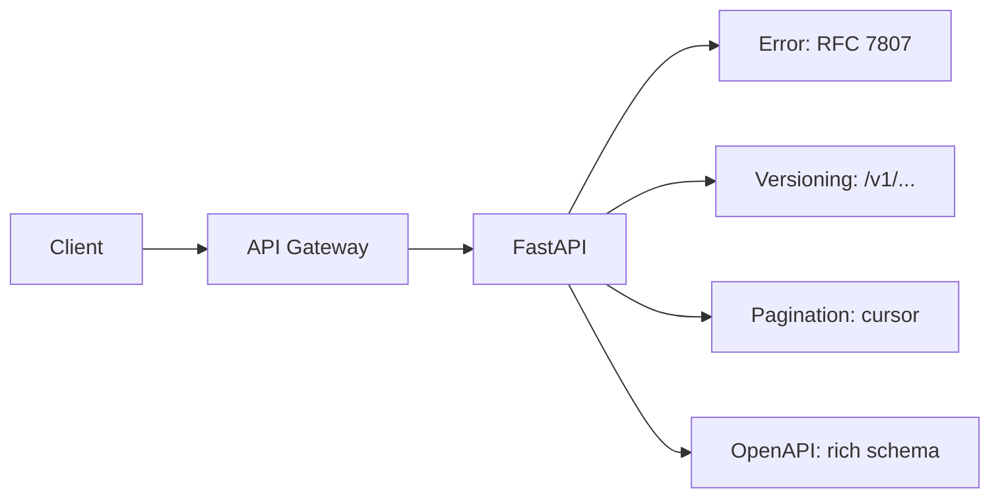

# 🎨 Welcome to API Design Patterns for FastAPI

## 🎯 Learning Objectives

By completing this course, you will master:

- The Richardson Maturity Model and what level your API should target
- RFC 7807 Problem Details for consistent error responses
- API versioning strategies: path, header, content negotiation, deprecation
- Pagination, filtering, and sorting patterns at scale
- OpenAPI customization: security schemes, examples, tags, multiple specs
- A production-grade capstone that ties everything together

## Introduction

A well-designed API is the difference between a service that teams want to use and one they work around. The choices made in the first 100 lines of code — how errors are returned, how the API is versioned, how lists are paginated — propagate for years. Get them right once and the API serves a million developers; get them wrong and the API becomes a constant source of friction.

The patterns in this course are the ones that have stood the test of time: REST maturity, RFC 7807 error responses, semantic versioning, cursor pagination, OpenAPI customization. They are not novel. They are the standards the industry has converged on after decades of API design mistakes. The note is opinionated where the standards are silent (e.g., cursor vs offset pagination) and follows the standards where they exist.

The course assumes you have a working FastAPI + SQLAlchemy stack ([[../38 - SQLAlchemy 2.0 Async + Alembic for FastAPI/00 - Welcome|the SQLAlchemy course]]) and a working auth layer ([[../39 - Authentication Deep Dive for FastAPI/00 - Welcome|the auth course]]). The patterns here apply to any FastAPI service that exposes an HTTP API.

---

## 📋 Course Map

| # | Note | Description | Lines |
|:-:|------|-------------|------:|
| 01 | REST Maturity and RFC 7807 | Richardson model, error responses, exception handlers | ~400 |
| 02 | API Versioning Strategies | Path, header, content negotiation, deprecation | ~400 |
| 03 | Pagination, Filtering, and Sorting | Cursor vs offset, query validation, keyset pagination | ~400 |
| 04 | OpenAPI Customization | Security schemes, examples, tags, code generation | ~400 |
| 05 | Capstone: Production-Grade API | End-to-end API with all the patterns applied | ~500 |

**Total**: 5 notes, ~2,100 lines.

---

## 🧱 Prerequisites

| Topic | Required Proficiency | Vault Note |
|-------|---------------------|------------|
| FastAPI basics | Confident — handlers, DI, Pydantic | [[../31 - FastAPI for ML/01 - ASGI Architecture and Async Python for ML]] |
| SQLAlchemy 2.0 async | Confident — sessions, UoW | [[../38 - SQLAlchemy 2.0 Async + Alembic for FastAPI/00 - Welcome]] |
| HTTP fundamentals | Confident — methods, status codes, headers | Standard |
| REST | Familiar — what makes an API "RESTful" | External resource |

---

## 🎯 What You Will Build

By the end of this course you will have a production-grade API that:

- Returns RFC 7807-compliant error responses with consistent structure
- Versions cleanly via path-based versioning with deprecation headers
- Paginates large lists with cursor-based pagination
- Filters and sorts via validated query parameters
- Exposes a rich OpenAPI schema with security schemes, examples, and tags
- Passes a public API review by a senior backend engineer

---

## 🔗 Vault Connections

- **[[../31 - FastAPI for ML/00 - Welcome to FastAPI for ML|FastAPI for ML]]** — the HTTP framework
- **[[../38 - SQLAlchemy 2.0 Async + Alembic for FastAPI/00 - Welcome|SQLAlchemy 2.0 Async + Alembic]]** — the data layer for pagination/filtering
- **[[../39 - Authentication Deep Dive for FastAPI/00 - Welcome|Authentication Deep Dive]]** — auth flows into the API design
- **[[../06 - Large Language Models/19 - LLM Gateway Patterns and LiteLLM/00 - Welcome to LLM Gateway Patterns and LiteLLM|LLM Gateway Patterns]]** — a real-world multi-provider API

## References

- [RFC 7807 — Problem Details for HTTP APIs](https://www.rfc-editor.org/rfc/rfc7807)
- [RFC 7231 — HTTP/1.1 Semantics and Content](https://www.rfc-editor.org/rfc/rfc7231)
- [Microsoft REST API Guidelines](https://github.com/microsoft/api-guidelines)
- [Google API Design Guide](https://cloud.google.com/apis/design)
- [Stripe API Design](https://stripe.com/docs/api)
- [Richardson Maturity Model](https://martinfowler.com/articles/richardsonMaturityModel.html)
- [OpenAPI 3.1 Specification](https://spec.openapis.org/oas/v3.1.0)
- [FastAPI OpenAPI Documentation](https://fastapi.tiangolo.com/tutorial/metadata/)
