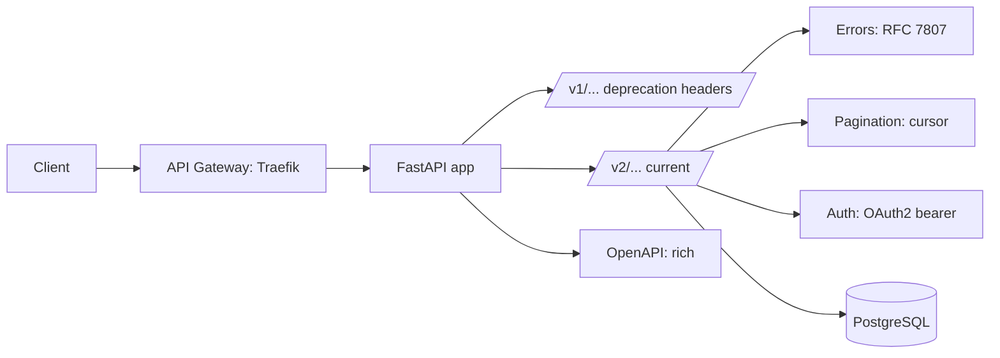

# 🏆 Capstone: Production-Grade API

## 🎯 Learning Objectives

- Build a production-grade multi-tenant task management API end-to-end
- Apply every pattern from the previous four notes: RFC 7807, versioning, pagination, OpenAPI
- Implement a clean, consistent API surface that passes a senior backend review
- Test the full stack with httpx.AsyncClient and contract testing
- Deploy with proper observability, security, and graceful shutdown

## Introduction

This capstone is the integration of every concept in the API Design Patterns course. The system is a multi-tenant task management API with:
- RFC 7807 error responses everywhere
- Path-based versioning with deprecation headers
- Cursor-based pagination on every list endpoint
- OpenAPI customization with security schemes, descriptions, examples
- Multi-version docs (v1 deprecated, v2 current)

The codebase is intentionally small but complete. Reading it end-to-end is a review of the course. The patterns from the previous four notes are all used; if any are missing, that's a gap to fix.

---

## 1. The Architecture



---

## 2. The Project Structure

```
task_api/
├── app/
│   ├── main.py
│   ├── core/
│   │   ├── config.py
│   │   ├── security.py
│   │   └── pagination.py
│   ├── errors.py                # RFC 7807 problem details
│   ├── versioning.py            # Versioned routers + deprecation
│   ├── db/
│   │   ├── base.py
│   │   ├── engine.py
│   │   └── session.py
│   ├── models/
│   │   ├── user.py
│   │   ├── project.py
│   │   └── task.py
│   ├── api/
│   │   ├── deps.py
│   │   ├── v1/
│   │   │   ├── __init__.py
│   │   │   ├── users.py
│   │   │   ├── projects.py
│   │   │   ├── tasks.py
│   │   │   └── schemas.py     # v1 response models
│   │   └── v2/
│   │       ├── __init__.py
│   │       ├── users.py
│   │       ├── projects.py
│   │       ├── tasks.py
│   │       └── schemas.py     # v2 response models
│   └── openapi.py               # Custom OpenAPI schema generation
├── tests/
│   ├── conftest.py
│   ├── contract/
│   ├── test_v1.py
│   ├── test_v2.py
│   └── test_pagination.py
└── docker/
    ├── Dockerfile
    └── docker-compose.yml
```

---

## 3. The Errors Layer (RFC 7807)

```python
# app/errors.py
from typing import Any
from fastapi import FastAPI, Request
from fastapi.exceptions import RequestValidationError
from fastapi.responses import JSONResponse
from pydantic import BaseModel, Field, HttpUrl


class ProblemDetails(BaseModel):
    type: HttpUrl = Field(default="about:blank")
    title: str
    status: int
    detail: str | None = None
    instance: str | None = None
    model_config = {"extra": "allow"}


class ProblemException(Exception):
    def __init__(self, *, title, status, type="about:blank", detail=None, instance=None, **extensions):
        self.problem = ProblemDetails(
            type=type, title=title, status=status, detail=detail, instance=instance, **extensions
        )
        super().__init__(title)


class NotFoundProblem(ProblemException):
    def __init__(self, detail, instance=None):
        super().__init__(
            type="https://example.com/probs/not-found",
            title="Not Found", status=404, detail=detail, instance=instance,
        )


class ConflictProblem(ProblemException):
    def __init__(self, detail, instance=None):
        super().__init__(
            type="https://example.com/probs/conflict",
            title="Conflict", status=409, detail=detail, instance=instance,
        )


class RateLimitProblem(ProblemException):
    def __init__(self, retry_after, instance=None):
        super().__init__(
            type="https://example.com/probs/rate-limit",
            title="Too Many Requests", status=429,
            detail="You have exceeded the rate limit.", instance=instance,
            retry_after=retry_after,
        )


def problem_response(problem: ProblemDetails, request: Request) -> JSONResponse:
    headers = {}
    extra = problem.model_extra or {}
    if problem.status == 429 and "retry_after" in extra:
        headers["Retry-After"] = str(extra["retry_after"])
    return JSONResponse(
        status_code=problem.status,
        content=problem.model_dump(mode="json", exclude_none=True),
        media_type="application/problem+json",
        headers=headers,
    )


def install_error_handlers(app: FastAPI) -> None:
    @app.exception_handler(ProblemException)
    async def handle_problem(request, exc):
        return problem_response(exc.problem, request)

    @app.exception_handler(RequestValidationError)
    async def handle_validation(request, exc):
        errors = [
            {"field": ".".join(str(l) for l in e["loc"]), "message": e["msg"], "type": e["type"]}
            for e in exc.errors()
        ]
        problem = ProblemDetails(
            type="https://example.com/probs/validation",
            title="Validation Failed", status=422,
            detail="One or more fields failed validation.",
            instance=str(request.url.path), errors=errors,
        )
        return problem_response(problem, request)

    @app.exception_handler(404)
    async def handle_404(request, exc):
        return problem_response(
            ProblemDetails(
                type="https://example.com/probs/not-found",
                title="Not Found", status=404,
                detail=f"No route matches {request.url.path}",
                instance=str(request.url.path),
            ),
            request,
        )

    @app.exception_handler(500)
    async def handle_500(request, exc):
        return problem_response(
            ProblemDetails(
                type="https://example.com/probs/internal",
                title="Internal Server Error", status=500,
                detail="An unexpected error occurred.",
                instance=str(request.url.path),
            ),
            request,
        )
```

---

## 4. The Pagination Layer

```python
# app/core/pagination.py
import base64
import json
from typing import Generic, TypeVar
from pydantic import BaseModel, Field

T = TypeVar("T")


class Page(BaseModel, Generic[T]):
    items: list[T]
    next_cursor: str | None = None
    has_more: bool = False
    total_count: int | None = None


def encode_cursor(data: dict) -> str:
    return base64.urlsafe_b64encode(json.dumps(data).encode()).decode()


def decode_cursor(cursor: str) -> dict:
    try:
        return json.loads(base64.urlsafe_b64decode(cursor.encode()).decode())
    except (ValueError, json.JSONDecodeError):
        from app.errors import BadRequestProblem
        raise BadRequestProblem("Invalid cursor")


async def paginate_cursor(
    *,
    query_func,  # async callable: (cursor_data, limit) -> list
    cursor: str | None,
    sort: str,
    limit: int,
) -> Page:
    cursor_data = decode_cursor(cursor) if cursor else {}
    if cursor_data.get("sort") and cursor_data["sort"] != sort:
        from app.errors import BadRequestProblem
        raise BadRequestProblem("Cannot change sort between paginated requests")

    after_id = cursor_data.get("after_id")
    items = await query_func(after_id=after_id, limit=limit + 1)
    has_more = len(items) > limit
    items = items[:limit]
    next_cursor = None
    if has_more and items:
        next_cursor = encode_cursor({"after_id": items[-1].id, "sort": sort})
    return Page(items=items, next_cursor=next_cursor, has_more=has_more)
```

---

## 5. The Versioning Layer

```python
# app/versioning.py
from datetime import datetime
from fastapi import APIRouter, FastAPI, Response


def make_deprecated_router(prefix: str) -> APIRouter:
    """Create a v1 router with deprecation headers added to every response."""
    router = APIRouter(prefix=prefix, deprecated=True)
    return router


def add_deprecation_headers(response: Response, version: str, sunset: str, successor_prefix: str):
    """Add standard deprecation headers to a response."""
    response.headers["Deprecation"] = "true"
    response.headers["Sunset"] = sunset
    # The Link header points to the successor version
    response.headers["Link"] = f'<{successor_prefix}>; rel="successor-version"'


def mount_v1_gone_catchall(app: FastAPI, v1_prefix: str, v2_prefix: str, sunset: str):
    """Mount a catch-all route at /v1/* that returns 410 Gone after sunset."""
    @app.api_route(
        f"/{v1_prefix}/{{path:path}}",
        methods=["GET", "POST", "PUT", "PATCH", "DELETE"],
        include_in_schema=False,
    )
    async def v1_gone(path: str):
        from fastapi.responses import JSONResponse
        problem = {
            "type": "https://example.com/probs/gone",
            "title": "Gone", "status": 410,
            "detail": f"v1 is no longer available. Use v2: /{v2_prefix}/{path}",
            "instance": f"/{v1_prefix}/{path}",
        }
        return JSONResponse(
            status_code=410,
            content=problem,
            media_type="application/problem+json",
            headers={"Link": f'</{v2_prefix}/{path}>; rel="successor-version"'},
        )
```

---

## 6. The v1 Schemas

```python
# app/api/v1/schemas.py
from datetime import datetime
from pydantic import BaseModel, Field, ConfigDict


class UserV1Out(BaseModel):
    model_config = ConfigDict(from_attributes=True)
    id: int
    email: str = Field(..., description="The user's email address.", examples=["alice@example.com"])
    name: str = Field(..., description="The user's full name.", examples=["Alice Smith"])


class ProjectV1Out(BaseModel):
    model_config = ConfigDict(from_attributes=True)
    id: int
    name: str
    description: str | None = None


class TaskV1Out(BaseModel):
    model_config = ConfigDict(from_attributes=True)
    id: int
    title: str
    status: str
    priority: int
    project_id: int
    assignee_id: int | None = None
```

---

## 7. The v2 Schemas

```python
# app/api/v2/schemas.py
from datetime import datetime
from pydantic import BaseModel, Field, ConfigDict


class UserV2Out(BaseModel):
    """v2 of the user schema. Adds avatar_url and created_at."""
    model_config = ConfigDict(
        from_attributes=True,
        json_schema_extra={"examples": [{
            "id": 1, "email": "alice@example.com", "name": "Alice Smith",
            "avatar_url": "https://cdn.example.com/avatars/1.jpg",
            "created_at": "2024-01-15T12:00:00Z",
        }]},
    )
    id: int
    email: str
    name: str
    avatar_url: str | None = None  # added in v2
    created_at: datetime  # added in v2


class ProjectV2Out(BaseModel):
    model_config = ConfigDict(from_attributes=True)
    id: int
    name: str
    description: str | None = None
    created_at: datetime  # added in v2
    owner_id: int  # added in v2


class TaskV2Out(BaseModel):
    model_config = ConfigDict(from_attributes=True)
    id: int
    title: str
    description: str | None = None  # added in v2
    status: str
    priority: int
    project_id: int
    assignee_id: int | None = None
    due_date: datetime | None = None  # added in v2
    created_at: datetime  # added in v2
    updated_at: datetime  # added in v2
```

---

## 8. The v1 Tasks Router (Deprecated)

```python
# app/api/v1/tasks.py
from fastapi import APIRouter, Response
from app.api.v1.schemas import TaskV1Out
from app.core.pagination import Page, paginate_cursor
from app.errors import NotFoundProblem
from app.models.task import Task
from app.api.deps import get_uow, get_current_user
from app.versioning import add_deprecation_headers


router = APIRouter(prefix="/tasks", tags=["tasks"])


@router.get("", response_model=Page[TaskV1Out], summary="List tasks (v1)")
async def list_tasks(
    response: Response,
    cursor: str | None = None,
    limit: int = 20,
    uow = None,  # FastAPI dependency
):
    """List tasks in the current tenant. v1 of the API."""
    add_deprecation_headers(
        response,
        version="v1",
        sunset="Sat, 01 Mar 2026 00:00:00 GMT",
        successor_prefix="/v2/tasks",
    )
    async def query(after_id, limit):
        return await uow.tasks.list_cursor(after_id=after_id, limit=limit)
    return await paginate_cursor(
        query_func=query, cursor=cursor, sort="id", limit=limit,
    )


@router.get("/{task_id}", response_model=TaskV1Out)
async def get_task(task_id: int, response: Response, uow = None):
    add_deprecation_headers(response, "v1", "Sat, 01 Mar 2026 00:00:00 GMT", f"/v2/tasks/{task_id}")
    task = await uow.tasks.get(task_id)
    if not task:
        raise NotFoundProblem(f"Task {task_id} not found", instance=f"/v1/tasks/{task_id}")
    return task
```

---

## 9. The v2 Tasks Router (Current)

```python
# app/api/v2/tasks.py
from enum import Enum
from fastapi import APIRouter, Query
from app.api.v2.schemas import TaskV2Out
from app.core.pagination import Page, paginate_cursor
from app.errors import NotFoundProblem, BadRequestProblem
from app.models.task import Task
from app.api.deps import get_uow


router = APIRouter(prefix="/tasks", tags=["tasks"])


class TaskStatus(str, Enum):
    todo = "todo"
    in_progress = "in_progress"
    done = "done"


@router.get(
    "",
    response_model=Page[TaskV2Out],
    summary="List tasks",
    description="""
    List tasks in the current tenant. Cursor-paginated.

    Filters: `status`, `assignee_id`, `project_id`.
    Sort: `id` (default), `created_at`, `priority`. Prefix `-` for descending.

    Returns a page of tasks with `next_cursor` for the next page.
    """,
)
async def list_tasks(
    cursor: str | None = Query(None, description="Opaque cursor for the next page"),
    limit: int = Query(20, ge=1, le=100, description="Maximum number of items per page"),
    status: TaskStatus | None = Query(None),
    assignee_id: int | None = Query(None),
    project_id: int | None = Query(None),
    sort: str = Query("-created_at", description="Field to sort by, prefix - for descending"),
    uow = None,
):
    # Validate sort
    allowed_sort = {"id", "created_at", "priority"}
    if sort.lstrip("-") not in allowed_sort:
        raise BadRequestProblem(f"Invalid sort. Allowed: {allowed_sort}")

    filters = {}
    if status:
        filters["status"] = status.value
    if assignee_id:
        filters["assignee_id"] = assignee_id
    if project_id:
        filters["project_id"] = project_id

    order_column = getattr(Task, sort.lstrip("-"))
    order_by = order_column.desc() if sort.startswith("-") else order_column.asc()

    async def query(after_id, limit):
        return await uow.tasks.list_cursor(
            after_id=after_id, limit=limit, order_by=order_by, **filters
        )
    return await paginate_cursor(
        query_func=query, cursor=cursor, sort=sort, limit=limit,
    )


@router.get(
    "/{task_id}",
    response_model=TaskV2Out,
    summary="Get a task",
    responses={404: {"description": "Task not found"}},
)
async def get_task(task_id: int, uow = None):
    task = await uow.tasks.get(task_id)
    if not task:
        raise NotFoundProblem(f"Task {task_id} not found", instance=f"/v2/tasks/{task_id}")
    return task
```

---

## 10. The OpenAPI Customization

```python
# app/openapi.py
from fastapi import FastAPI
from fastapi.openapi.utils import get_openapi
from fastapi.security import HTTPBearer


def custom_openapi_v1(app: FastAPI):
    if app.openapi_schema:
        return app.openapi_schema
    schema = get_openapi(
        title="Task API (v1, deprecated)",
        version="1.0.0",
        description="**DEPRECATED** — v1 will sunset on 2026-03-01. Use v2.",
        routes=app.routes,
    )
    for path, methods in schema.get("paths", {}).items():
        for method, op in methods.items():
            if isinstance(op, dict):
                op["deprecated"] = True
                op["description"] = f"**v1 deprecated** — use `{path.replace('/v1', '/v2')}`\n\n" + op.get("description", "")
    return schema


def custom_openapi_v2(app: FastAPI):
    if app.openapi_schema:
        return app.openapi_schema
    schema = get_openapi(
        title="Task API (v2, current)",
        version="2.0.0",
        description="""
        The Task API provides programmatic access to projects and tasks.

        ## Authentication
        All endpoints require a Bearer token. Get one via `POST /v2/auth/login`.
        """,
        routes=app.routes,
        tags=[
            {"name": "tasks", "description": "Operations on tasks."},
            {"name": "projects", "description": "Operations on projects."},
            {"name": "auth", "description": "Authentication."},
        ],
    )
    return schema
```

---

## 11. The FastAPI App

```python
# app/main.py
from contextlib import asynccontextmanager
from fastapi import FastAPI
from app.errors import install_error_handlers
from app.openapi import custom_openapi_v1, custom_openapi_v2
from app.versioning import mount_v1_gone_catchall
from app.api.v1 import users as users_v1
from app.api.v1 import projects as projects_v1
from app.api.v1 import tasks as tasks_v1
from app.api.v2 import users as users_v2
from app.api.v2 import projects as projects_v2
from app.api.v2 import tasks as tasks_v2
from app.db.engine import engine


@asynccontextmanager
async def lifespan(app: FastAPI):
    yield
    await engine.dispose()


def create_v1_app() -> FastAPI:
    """v1 (deprecated)."""
    app = FastAPI(
        title="Task API (v1, deprecated)",
        version="1.0.0",
        openapi_url="/openapi-v1.json",
        docs_url="/docs-v1",
        redoc_url="/redoc-v1",
        servers=[{"url": "https://api.example.com", "description": "Production"}],
    )
    app.include_router(users_v1.router, prefix="/v1")
    app.include_router(projects_v1.router, prefix="/v1")
    app.include_router(tasks_v1.router, prefix="/v1")
    install_error_handlers(app)
    app.openapi = lambda: custom_openapi_v1(app)
    return app


def create_v2_app() -> FastAPI:
    """v2 (current)."""
    app = FastAPI(
        title="Task API (v2, current)",
        version="2.0.0",
        openapi_url="/openapi.json",
        docs_url="/docs",
        redoc_url="/redoc",
        servers=[
            {"url": "https://api.example.com", "description": "Production"},
            {"url": "https://staging-api.example.com", "description": "Staging"},
        ],
        openapi_tags=[
            {"name": "auth", "description": "Authentication and authorization."},
            {"name": "users", "description": "Operations on users."},
            {"name": "projects", "description": "Operations on projects."},
            {"name": "tasks", "description": "Operations on tasks."},
        ],
    )
    app.include_router(users_v2.router, prefix="/v2")
    app.include_router(projects_v2.router, prefix="/v2")
    app.include_router(tasks_v2.router, prefix="/v2")
    install_error_handlers(app)
    app.openapi = lambda: custom_openapi_v2(app)
    return app


# Main app: mount both versions
app = FastAPI()
app.mount("/v1", create_v1_app())
app.mount("/v2", create_v2_app())
mount_v1_gone_catchall(app, "v1", "v2", "Sat, 01 Mar 2026 00:00:00 GMT")
```

The main app has two mounted sub-apps. The `mount_v1_gone_catchall` adds the 410 Gone catch-all (disabled by default; enable after the sunset date).

---

## 12. Tests

### 12.1 Test fixtures

```python
# tests/conftest.py
import pytest
import pytest_asyncio
from httpx import AsyncClient, ASGITransport
from app.db.engine import engine, SessionLocal
from app.main import app


@pytest_asyncio.fixture
async def db_engine():
    from sqlalchemy.ext.asyncio import create_async_engine
    test_engine = create_async_engine("sqlite+aiosqlite:///:memory:")
    async with test_engine.begin() as conn:
        await conn.run_sync(Base.metadata.create_all)
    yield test_engine
    await test_engine.dispose()


@pytest_asyncio.fixture
async def client(db_engine):
    from app.db import session as session_module
    # Override the session factory
    import unittest.mock
    # ... (similar to other courses)
    transport = ASGITransport(app=app)
    async with AsyncClient(transport=transport, base_url="http://test") as c:
        yield c
```

### 12.2 Test every error response is RFC 7807

```python
@pytest.mark.asyncio
async def test_404_is_problem_json(client):
    response = await client.get("/v2/tasks/99999")
    assert response.status_code == 404
    assert response.headers["content-type"] == "application/problem+json"
    body = response.json()
    assert body["type"] == "https://example.com/probs/not-found"
    assert body["title"] == "Not Found"
    assert body["status"] == 404


@pytest.mark.asyncio
async def test_422_validation_includes_field_errors(client):
    response = await client.post(
        "/v2/tasks",
        json={"title": "", "project_id": "not-a-number"},
    )
    assert response.status_code == 422
    body = response.json()
    assert "errors" in body
    assert isinstance(body["errors"], list)
    assert len(body["errors"]) > 0
```

### 12.3 Test pagination

```python
@pytest.mark.asyncio
async def test_pagination_first_page(client, db_with_tasks):
    response = await client.get("/v2/tasks?limit=5")
    assert response.status_code == 200
    data = response.json()
    assert len(data["items"]) == 5
    assert data["has_more"] is True
    assert data["next_cursor"] is not None


@pytest.mark.asyncio
async def test_pagination_second_page(client, db_with_tasks):
    # Get the first page
    response = await client.get("/v2/tasks?limit=5")
    cursor = response.json()["next_cursor"]
    # Get the second page
    response = await client.get(f"/v2/tasks?limit=5&cursor={cursor}")
    assert response.status_code == 200
    data = response.json()
    # The second page should be different from the first
    assert data["items"] != response.json()["items"]
```

### 12.4 Test versioning and deprecation

```python
@pytest.mark.asyncio
async def test_v1_returns_deprecation_headers(client):
    response = await client.get("/v1/tasks")
    assert response.headers["Deprecation"] == "true"
    assert "Sunset" in response.headers
    assert "successor-version" in response.headers["Link"]


@pytest.mark.asyncio
async def test_v1_410_after_sunset(client):
    # Mock the sunset date to be in the past
    # Or set a feature flag and enable the catch-all
    response = await client.get("/v1/tasks/1")
    assert response.status_code == 410
    body = response.json()
    assert body["type"] == "https://example.com/probs/gone"
    assert "v2" in body["detail"]


@pytest.mark.asyncio
async def test_v2_works_normally(client):
    response = await client.get("/v2/tasks")
    assert response.status_code == 200
    assert "Deprecation" not in response.headers
```

### 12.5 Test OpenAPI schema

```python
@pytest.mark.asyncio
async def test_openapi_v2_schema(client):
    response = await client.get("/openapi.json")
    assert response.status_code == 200
    schema = response.json()
    assert schema["info"]["title"] == "Task API (v2, current)"
    assert "/v2/tasks" in schema["paths"]
    # The v1 endpoints are NOT in the v2 schema
    assert "/v1/tasks" not in schema["paths"]
    # Security scheme is documented
    assert "HTTPBearer" in str(schema["components"]["securitySchemes"])


@pytest.mark.asyncio
async def test_openapi_v1_schema(client):
    response = await client.get("/openapi-v1.json")
    assert response.status_code == 200
    schema = response.json()
    assert schema["info"]["title"] == "Task API (v1, deprecated)"
    # All v1 endpoints are marked deprecated
    for path, methods in schema["paths"].items():
        for method, op in methods.items():
            if isinstance(op, dict):
                assert op.get("deprecated") is True
```

### 12.6 Contract testing with Schemathesis

```python
# tests/contract/test_api.py
import schemathesis


schema = schemathesis.openapi.from_uri("http://localhost:8000/openapi.json")


@schema.parametrize()
def test_api(case):
    # Schemathesis generates requests that conform to the schema
    # Note: this requires the API to be running; for CI, use a TestClient
    import httpx
    with httpx.Client(base_url="http://localhost:8000") as client:
        response = case.call(client=client)
        case.validate_response(response)
```

---

## 13. The Production Checklist

| Concern | Where | Verified by |
|---------|-------|-------------|
| RFC 7807 everywhere | `install_error_handlers` | Test every error type |
| Versioning + deprecation | `mount_v1_gone_catchall` | Test v1 headers and 410 |
| Cursor pagination | `paginate_cursor` | Test multi-page traversal |
| OpenAPI customized | `custom_openapi_v2` | Test schema content |
| Security scheme | `HTTPBearer` | Test auth via docs UI |
| Server URLs | `servers=[...]` | Test env switching |
| Deprecation headers | `add_deprecation_headers` | Test headers present |
| Problem types documented | `type=...` URIs | Static analysis |
| Field examples | `examples=[...]` | Test schema |
| Field descriptions | `description=...` | Static analysis |
| Strict models | `extra="forbid"` | Test unknown fields |

---

## 14. What This Capstone Demonstrates

The capstone uses every pattern from the course:

| Note | Pattern | Where in capstone |
|------|---------|------------------|
| 01 REST + RFC 7807 | ProblemDetails, exception handlers | `app/errors.py` |
| 02 Versioning | Path-based, deprecation, 410 | `app/versioning.py`, v1/v2 routers |
| 03 Pagination | Cursor-based, opaque | `app/core/pagination.py` |
| 04 OpenAPI | Custom schemas, deprecation markers | `app/openapi.py` |
| 05 (this note) | End-to-end integration | The whole app |

A new developer reading the capstone top-to-bottom gets a working mental model of an entire versioned, documented, RFC-7807-compliant API. A new developer reading just the errors, the pagination, or the versioning gets a deep dive into one concern.

---

## Key Takeaways

- A production API is the integration of many small patterns: RFC 7807 errors, versioned URLs, cursor pagination, OpenAPI customization. Each pattern is a separate concern with its own design.
- **RFC 7807** unifies the error response shape. Every 4xx/5xx response is `application/problem+json` with a `type`, `title`, `status`, `detail`, `instance`. Extension fields are allowed.
- **Path-based versioning** is the industry standard. The URL contains the version; the runtime serves it; the deprecation headers tell the client to migrate.
- **Cursor pagination** is the right default for any list that grows. The cursor is opaque (base64 JSON), stable under concurrent inserts, and constant-time at any depth.
- **OpenAPI** is the contract. Descriptions, examples, security schemes, and tags turn a schema into documentation. The investment is small; the payoff is faster client integration.
- **Custom exceptions** + **custom exception handlers** is the FastAPI pattern for RFC 7807. The handler converts the exception to a `ProblemDetails` object; the response is `application/problem+json`.
- **Deprecation** is a process, not a flag. The headers are the runtime signal; the email is the canonical communication; the 410 Gone catch-all is the enforcement.
- **Generated client SDKs** depend on a good schema. With descriptions, examples, and security schemes, the SDK is excellent. Without them, it's functional but undocumented.
- **Contract testing** (Schemathesis, Spectral) catches schema drift. The deployed API matches the schema; the schema is the truth.

## References

- [RFC 7807 — Problem Details for HTTP APIs](https://www.rfc-editor.org/rfc/rfc7807)
- [Microsoft REST API Guidelines](https://github.com/microsoft/api-guidelines)
- [Google API Design Guide](https://cloud.google.com/apis/design)
- [Stripe API Design](https://stripe.com/docs/api)
- [FastAPI Documentation](https://fastapi.tiangolo.com/)
- [Pydantic Documentation](https://docs.pydantic.dev/latest/)
- [OpenAPI 3.1 Specification](https://spec.openapis.org/oas/v3.1.0)
- [Schemathesis Documentation](https://schemathesis.readthedocs.io/)
- [Spectral Documentation](https://stoplight.io/open-source/spectral)
- [openapi-generator](https://openapi-generator.tech/)
