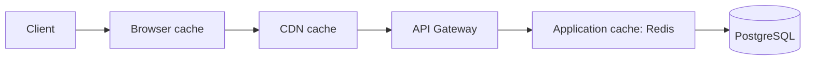

# 🗃️ Welcome to Caching Strategies for FastAPI

## 🎯 Learning Objectives

By completing this course, you will master:

- The full caching stack: browser, CDN, gateway, application, database
- HTTP caching with ETag, Cache-Control, and conditional requests
- Server-side caching with Redis and `aiocache`
- Response caching decorators and key derivation
- Cache invalidation patterns: TTL, event-based, dependency-aware
- The four most common caching mistakes in production

## Introduction

Caching is the single most effective performance optimization for any web service. A well-designed cache layer can take a 200ms request to 2ms — a 100x speedup — without changing a single line of business logic. The challenge is that "caching" is not one thing; it is a stack of layers, each with its own trade-offs.

This course walks through the layers from the user-facing HTTP cache to the in-memory Python cache, with the production patterns that make each layer effective. The capstone ties them together in a real FastAPI service that uses every layer correctly.

The patterns assume the [[../38 - SQLAlchemy 2.0 Async + Alembic for FastAPI/00 - Welcome|SQLAlchemy 2.0 stack]] and Redis as the cache backend. Most patterns apply to any FastAPI service; some are specific to multi-tenant SaaS.

---

## 📋 Course Map

| # | Note | Description | Lines |
|:-:|------|-------------|------:|
| 01 | HTTP Caching: ETag, Cache-Control | Strong/weak validators, conditional requests, middleware | ~400 |
| 02 | Redis as Cache Backend | `aiocache`, cache-aside, write-through, thundering herd | ~400 |
| 03 | Response Caching Decorators | Custom decorator, key derivation, per-user caching | ~400 |
| 04 | Invalidation Patterns | TTL, event-based, dependency-aware, cache stampede prevention | ~300 |

**Total**: 4 notes, ~1,500 lines.

---

## 🧱 Prerequisites

| Topic | Required Proficiency | Vault Note |
|-------|---------------------|------------|
| FastAPI basics | Confident — handlers, DI, response models | [[../31 - FastAPI for ML/01 - ASGI Architecture and Async Python for ML]] |
| HTTP fundamentals | Confident — headers, status codes, conditional requests | Standard |
| Redis basics | Familiar — GET, SET, TTL, atomic ops | External resource |
| SQLAlchemy 2.0 | Familiar — sessions, queries | [[../38 - SQLAlchemy 2.0 Async + Alembic for FastAPI/00 - Welcome]] |

---

## 🎯 What You Will Build

By the end of this course you will have a production-grade caching system that:

- Sends proper HTTP cache headers (ETag, Cache-Control) on every response
- Uses Redis as a server-side cache for expensive queries
- Has decorator-based response caching for hot endpoints
- Implements cache invalidation on writes (event-based)
- Prevents cache stampedes with locks and stale-while-revalidate
- Monitors cache hit rates and evictions

---

## 🔗 Vault Connections

- **[[../31 - FastAPI for ML/00 - Welcome to FastAPI for ML|FastAPI for ML]]** — the HTTP framework
- **[[../38 - SQLAlchemy 2.0 Async + Alembic for FastAPI/00 - Welcome|SQLAlchemy 2.0 Async + Alembic]]** — the data layer being cached
- **[[../40 - Background Jobs and Workers for FastAPI/00 - Welcome|Background Jobs and Workers]]** — async work that benefits from caching
- **[[../06 - Large Language Models/19 - LLM Gateway Patterns and LiteLLM/00 - Welcome to LLM Gateway Patterns and LiteLLM|LLM Gateway Patterns]]** — semantic caching for LLM responses

## References

- [RFC 9111 — HTTP Caching](https://www.rfc-editor.org/rfc/rfc9111)
- [RFC 7232 — HTTP/1.1 Conditional Requests](https://www.rfc-editor.org/rfc/rfc7232)
- [Redis Documentation](https://redis.io/docs/)
- [aiocache Documentation](https://aiocache.readthedocs.io/)
- [Web Fundamentals — HTTP Caching](https://developers.google.com/web/fundamentals/performance/optimizing-content-efficiency/http-caching)
- [High Scalability — Caching](https://highscalability.com/all-time-favorites/)
- [Cache Invalidation Strategies (Martin Fowler)](https://martinfowler.com/eaaCatalog/evictExpiredEntries.html)
