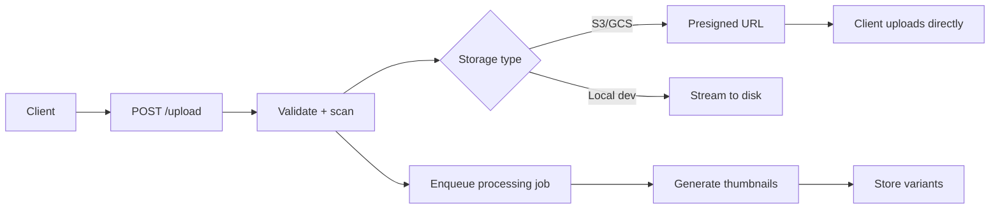

# 📁 Welcome to File Storage and Uploads for FastAPI

## 🎯 Learning Objectives

By completing this course, you will master:

- The full landscape of file storage: local, S3, GCS, Azure Blob
- Local file handling in FastAPI: `UploadFile`, multipart, streaming
- S3 / GCS with presigned URLs for direct client uploads
- Multipart uploads for large files (resumable, chunked)
- Image processing pipelines: Pillow, EXIF stripping, virus scanning
- The four most common file-handling mistakes in production

## Introduction

Every non-trivial web service eventually handles files: user avatars, document uploads, video processing, image transformation, report generation, backup archives. The naïve approach — store everything on the local filesystem of the FastAPI server — works in development and breaks in production (the server is stateless; the disk is ephemeral). The right approach is **object storage** (S3, GCS, Azure Blob) with a fast, secure upload path.

This course covers the patterns: local handling for development, S3 / GCS for production, presigned URLs for direct upload, multipart for large files, and image processing as a job (via [[10 - Cloud, Infra y Backend/40 - Background Jobs and Workers for FastAPI/00 - Welcome|ARQ]] or Celery). The patterns apply to any FastAPI service that handles user-uploaded or system-generated files.

The course assumes you have a working FastAPI + SQLAlchemy stack ([[10 - Cloud, Infra y Backend/38 - SQLAlchemy 2.0 Async + Alembic for FastAPI/00 - Welcome|the SQLAlchemy course]]) and AWS or GCP credentials.

---

## 📋 Course Map

| # | Note | Description | Lines |
|:-:|------|-------------|------:|
| 01 | Local File Handling | `UploadFile`, multipart, streaming large files | ~400 |
| 02 | S3 / GCS with Presigned URLs | Direct client upload, signed URL generation, lifecycle | ~400 |
| 03 | Multipart Uploads (Large Files) | Resumable uploads, chunking, S3 multipart API | ~350 |
| 04 | Image Processing Pipeline | Pillow, on-the-fly thumbnails, virus scan, EXIF stripping | ~400 |

**Total**: 4 notes, ~1,550 lines.

---

## 🧱 Prerequisites

| Topic | Required Proficiency | Vault Note |
|-------|---------------------|------------|
| FastAPI basics | Confident — handlers, DI, request bodies | [[01 - ASGI Architecture and Async Python for ML]] |
| SQLAlchemy 2.0 async | Familiar — sessions, UoW | [[10 - Cloud, Infra y Backend/38 - SQLAlchemy 2.0 Async + Alembic for FastAPI/00 - Welcome]] |
| Background jobs | Familiar — ARQ or Celery | [[10 - Cloud, Infra y Backend/40 - Background Jobs and Workers for FastAPI/00 - Welcome]] |
| AWS S3 / GCP GCS basics | Familiar — buckets, objects, IAM | External resource |

---

## 🎯 What You Will Build

By the end of this course you will have a production-grade file handling system that:

- Accepts file uploads with proper validation (size, type, virus scan)
- Stores files in S3 / GCS with presigned URLs for direct client upload
- Handles large files (gigabytes) with multipart uploads
- Processes images in the background (thumbnails, format conversion, EXIF stripping)
- Streams downloads without loading the whole file into memory
- Cleans up orphaned files when uploads are abandoned

---

## 🔗 Vault Connections

- **[[../31 - FastAPI for ML/00 - Welcome to FastAPI for ML|FastAPI for ML]]** — the HTTP framework
- **[[10 - Cloud, Infra y Backend/38 - SQLAlchemy 2.0 Async + Alembic for FastAPI/00 - Welcome|SQLAlchemy 2.0 Async + Alembic]]** — the data layer for file metadata
- **[[10 - Cloud, Infra y Backend/40 - Background Jobs and Workers for FastAPI/00 - Welcome|Background Jobs and Workers]]** — image processing as a job
- **[[10 - Cloud, Infra y Backend/42 - Caching Strategies for FastAPI/00 - Welcome|Caching Strategies]]** — caching generated thumbnails

## References

- [FastAPI — Request Files](https://fastapi.tiangolo.com/tutorial/request-files/)
- [boto3 — AWS SDK for Python](https://boto3.amazonaws.com/v1/documentation/api/latest/index.html)
- [Google Cloud Storage Python Client](https://cloud.google.com/python/docs/reference/storage/latest)
- [AWS S3 Multipart Upload](https://docs.aws.amazon.com/AmazonS3/latest/userguide/mpuoverview.html)
- [Pillow — Image processing](https://pillow.readthedocs.io/)
- [MIME Type Detection](https://pypi.org/project/python-magic/)
- [ClamAV — Antivirus scanning](https://www.clamav.net/)
