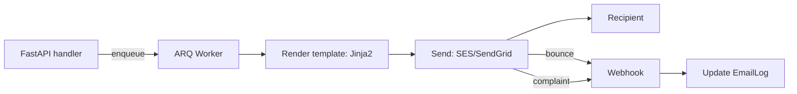

# 📧 Email and Notifications for FastAPI

## 🎯 Learning Objectives

By completing this course, you will master:

- Transactional email delivery with SES, SendGrid, and Postmark
- Jinja2 templates for HTML and plain-text emails
- Bounce and complaint handling with webhooks
- Push notifications (FCM, APNs) as a complement to email
- Production patterns: idempotency, rate limiting, monitoring
- The most common email mistakes and how to avoid them

## Introduction

Every non-trivial service sends email: welcome messages, password resets, receipts, security alerts. The naïve approach — connect to an SMTP server and send inline — works in development and breaks in production. SMTP has no concept of idempotency, no rate limiting, no bounce handling; production email needs an API.

This course covers the three layers of email delivery: the provider (SES, SendGrid, Postmark), the templates (Jinja2 with HTML + plain text), and the integration (idempotency, retries, monitoring). The patterns apply to any FastAPI service that sends email; the choice of provider is a business decision.

---

## 📋 Course Map

| # | Note | Description | Lines |
|:-:|------|-------------|------:|
| 01 | Transactional Email with SES, SendGrid, and Postmark | Provider SDKs, bounce handling, suppression lists | ~400 |
| 02 | Jinja2 Email Templates | HTML + plain text, i18n, MJML, dark mode | ~400 |
| 03 | Push Notifications and the Production Patterns | FCM/APNs, rate limiting, monitoring | ~300 |

**Total**: 3 notes, ~1,100 lines.

---

## 🧱 Prerequisites

| Topic | Required Proficiency | Vault Note |
|-------|---------------------|------------|
| FastAPI basics | Confident — handlers, DI | [[../31 - FastAPI for ML/01 - ASGI Architecture and Async Python for ML]] |
| Background jobs | Confident — ARQ | [[../40 - Background Jobs and Workers for FastAPI/00 - Welcome]] |
| HTML and CSS | Familiar — Jinja2 templates | External resource |

---

## 🎯 What You Will Build

By the end of this course you will have a production-grade email system that:

- Sends transactional emails via SES, SendGrid, or Postmark
- Renders HTML and plain-text versions from Jinja2 templates
- Handles bounces and complaints via webhooks
- Composes with push notifications for time-sensitive alerts
- Survives provider outages with retries and fallbacks
- Monitors delivery rates, bounce rates, and complaint rates

---

## 🔗 Vault Connections

- **[[../31 - FastAPI for ML/00 - Welcome to FastAPI for ML|FastAPI for ML]]** — the HTTP framework
- **[[../38 - SQLAlchemy 2.0 Async + Alembic for FastAPI/00 - Welcome|SQLAlchemy 2.0 Async + Alembic]]** — the data layer for the email log
- **[[../40 - Background Jobs and Workers for FastAPI/00 - Welcome|Background Jobs and Workers]]** — emails are sent as jobs
- **[[../45 - Webhooks In/Out for FastAPI/00 - Welcome|Webhooks In/Out]]** — bounce webhooks are incoming webhooks

## References

- [AWS SES Documentation](https://docs.aws.amazon.com/ses/)
- [SendGrid Python SDK](https://github.com/sendgrid/sendgrid-python)
- [Postmark Python Library](https://postmarkapp.com/developer/integration/official-libraries#python)
- [Jinja2 Documentation](https://jinja.palletsprojects.com/)
- [MJML — Responsive email framework](https://mjml.io/)
- [Firebase Cloud Messaging](https://firebase.google.com/docs/cloud-messaging)
- [Apple Push Notification Service](https://developer.apple.com/documentation/usernotifications/)
- [RFC 8058 — One-Click Unsubscribe](https://www.rfc-editor.org/rfc/rfc8058)
- [RFC 6376 — DKIM Signing](https://www.rfc-editor.org/rfc/rfc6376)
- [RFC 7208 — SPF](https://www.rfc-editor.org/rfc/rfc7208)
- [RFC 7489 — DMARC](https://www.rfc-editor.org/rfc/rfc7489)
- [Email Accessibility (WCAG 2.1)](https://www.w3.org/WAI/standards-guidelines/wcag/)
- [Spamhaus — Anti-spam standards](https://www.spamhaus.org/)
