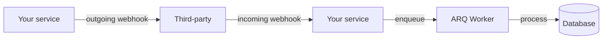

# 🔗 Welcome to Webhooks In & Out for FastAPI

## 🎯 Learning Objectives

By completing this course, you will master:

- Outgoing webhooks: deliver events to third-party systems with HMAC signatures, retries, and dead-letter queues
- Incoming webhooks: receive events from Stripe, GitHub, etc. with idempotency and signature verification
- Async webhook processing with ARQ (avoid blocking the request that triggered the event)
- B2B integration patterns: retry policies, exponential backoff with jitter, event ordering
- The most common webhook mistakes and how to avoid them

## Introduction

Webhooks are the connective tissue of the modern web. Stripe tells your server "payment succeeded" via a webhook. GitHub tells your CI server "new commit pushed" via a webhook. Your service tells a CRM "user signed up" via a webhook. The pattern is simple in theory (an HTTP POST with a JSON body) and brutal in practice (signatures, retries, idempotency, dead-letter queues, replay protection).

This course covers both directions: outgoing (you are the sender) and incoming (you are the receiver). The patterns apply to any FastAPI service that needs to integrate with third-party systems.

---

## 📋 Course Map

| # | Note | Description | Lines |
|:-:|------|-------------|------:|
| 01 | Outgoing Webhooks | HMAC signatures, retries with backoff, dead-letter queues | ~400 |
| 02 | Incoming Webhooks (Stripe-style) | Idempotency, replay protection, signature verification, async processing | ~400 |
| 03 | Capstone: Webhook-Driven B2B Integration | End-to-end system with monitoring, security, and resilience | ~300 |

**Total**: 3 notes, ~1,100 lines.

---

## 🧱 Prerequisites

| Topic | Required Proficiency | Vault Note |
|-------|---------------------|------------|
| FastAPI basics | Confident — handlers, DI, Pydantic | [[../31 - FastAPI for ML/01 - ASGI Architecture and Async Python for ML]] |
| Background jobs | Confident — ARQ | [[../40 - Background Jobs and Workers for FastAPI/00 - Welcome]] |
| HTTP fundamentals | Confident — headers, signatures, status codes | Standard |
| HMAC and cryptography basics | Familiar | External resource |

---

## 🎯 What You Will Build

By the end of this course you will have a production-grade webhook system that:

- Sends outgoing webhooks with HMAC signatures, exponential backoff, and dead-letter handling
- Receives incoming webhooks with signature verification, idempotency, and replay protection
- Processes incoming webhooks asynchronously with ARQ
- Survives provider outages with retries and fallbacks
- Monitors webhook health and alerts on issues

---

## 🔗 Vault Connections

- **[[../40 - Background Jobs and Workers for FastAPI/00 - Welcome|Background Jobs and Workers]]** — webhooks are sent as jobs
- **[[../44 - Email and Notifications for FastAPI/00 - Welcome|Email and Notifications]]** — bounce and complaint webhooks are incoming webhooks
- **[[../41 - API Design Patterns for FastAPI/00 - Welcome|API Design Patterns]]** — RFC 7807 error responses for the webhook receiver
- **[[10 - Cloud, Infra y Backend/43 - File Storage and Uploads for FastAPI/00 - Welcome|File Storage and Uploads]]** — S3 event notifications are incoming webhooks

## References

- [Stripe Webhooks Documentation](https://stripe.com/docs/webhooks)
- [GitHub Webhooks Documentation](https://docs.github.com/en/webhooks)
- [RFC 2104 — HMAC](https://www.rfc-editor.org/rfc/rfc2104)
- [RFC 8725 — JSON Web Token Best Current Practices](https://www.rfc-editor.org/rfc/rfc8725)
- [OWASP Webhook Security Cheat Sheet](https://cheatsheetseries.owasp.org/cheatsheets/Webhook_Security_Cheat_Sheet.html)
- [svix — Webhook infrastructure](https://www.svix.com/)
- [Hookdeck — Webhook delivery platform](https://hookdeck.com/)
- [webhook.site — Test webhook delivery](https://webhook.site/)
- [Standard Webhooks — Specification](https://www.standardwebhooks.com/)
- [Shopify Webhooks Best Practices](https://shopify.dev/docs/apps/build/webhooks/best-practices)
- [CloudEvents — Specification](https://cloudevents.io/)
