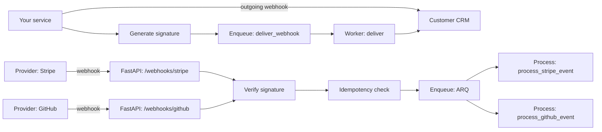

# 📥 Incoming Webhooks & B2B Integration Capstone

## 🎯 Learning Objectives

- Receive webhooks from Stripe, GitHub, SES, and other providers
- Verify provider signatures (Stripe's `Stripe-Signature`, GitHub's `X-Hub-Signature-256`)
- Implement async processing with idempotency keys
- Build a complete B2B integration system: receive, verify, queue, process, retry
- Avoid the four most common incoming webhook mistakes

## Introduction

The previous note covered outgoing webhooks (you are the sender). This note covers the flip side: incoming webhooks (you are the receiver). The patterns are similar but the security model is inverted: the receiver must verify the signature; the sender doesn't have to. Stripe, GitHub, AWS SES, and most other providers send signed webhooks; verifying the signature is the receiver's job.

This note combines the incoming webhooks patterns and a capstone that puts both directions together in a realistic B2B integration. The patterns apply to any FastAPI service that integrates with third-party systems.

---

## 1. The Incoming Webhook Flow

### 1.1 The receiver's responsibilities

When you receive a webhook, you must:

1. **Verify the signature** — the request comes from the provider, not an attacker.
2. **Check the timestamp** — prevent replay attacks.
3. **Return 200 quickly** — the provider has a timeout (often 5-10 seconds); slow responses trigger retries.
4. **Process asynchronously** — long work goes to a job queue; the response is just "I got it".
5. **Be idempotent** — the same event may arrive multiple times; process it only once.

### 1.2 The standard pattern

```python
@router.post("/webhooks/stripe")
async def stripe_webhook(
    request: Request,
    stripe_signature: str = Header(..., alias="Stripe-Signature"),
    arq: ArqRedis = Depends(get_arq),
):
    """Receive a Stripe webhook."""
    body = await request.body()
    # Verify the signature
    if not verify_stripe_signature(body, stripe_signature, settings.STRIPE_WEBHOOK_SECRET):
        raise HTTPException(401, "Invalid signature")
    # Parse the event
    event = json.loads(body)
    # Idempotency check
    async with async_session_maker()() as session:
        existing = (await session.execute(
            select(ProcessedEvent).where(ProcessedEvent.event_id == event["id"])
        )).scalar_one_or_none()
        if existing:
            return {"status": "already_processed"}
    # Enqueue for async processing
    await arq.enqueue_job("process_stripe_event", event=event)
    # Return 200 immediately
    return {"status": "received"}
```

The endpoint: verify, check idempotency, enqueue, return 200. The actual work happens in the background job.

---

## 2. Provider-Specific Signature Verification

### 2.1 Stripe

Stripe's signature format is unique: a header with multiple `t=` (timestamp) and `v1=` (signature) fields, separated by commas.

```python
import stripe


def verify_stripe_signature(payload: bytes, header: str, secret: str, tolerance: int = 300) -> bool:
    """Verify a Stripe webhook signature."""
    try:
        # stripe.Webhook.construct_event does the verification
        event = stripe.Webhook.construct_event(
            payload, header, secret, tolerance=tolerance,
        )
        return True
    except (ValueError, stripe.SignatureVerificationError):
        return False
```

Stripe provides the `stripe.Webhook.construct_event` helper that handles the signature format. The library is `stripe` (Python).

### 2.2 GitHub

GitHub uses HMAC-SHA256 with the `X-Hub-Signature-256` header (the older `X-Hub-Signature` used SHA1).

```python
import hmac
import hashlib


def verify_github_signature(payload: bytes, header: str, secret: str) -> bool:
    """Verify a GitHub webhook signature."""
    if not header.startswith("sha256="):
        return False
    expected = "sha256=" + hmac.new(
        secret.encode(), payload, hashlib.sha256
    ).hexdigest()
    return hmac.compare_digest(expected, header)
```

The header value is `sha256=<hex-digest>`. The signature is over the raw request body.

### 2.3 AWS SES

SES sends notifications via SNS. The verification is multi-step: verify the SNS signature, then verify the SES signature.

```python
import json
import base64


def verify_sns_message(payload: dict, signing_cert_url: str) -> bool:
    """Verify an SNS message signature."""
    # Check that the signing cert is from SNS
    if not signing_cert_url.startswith("https://sns."):
        return False
    # Download the cert and verify the signature
    # (Covered in detail in the AWS SDK)
    import urllib.request
    cert = urllib.request.urlopen(signing_cert_url).read()
    # ... verify using cryptography library
    return True
```

For SES, the verification is more complex because the message is wrapped in an SNS envelope. The AWS SDK handles this for you; the manual implementation is for understanding only.

### 2.4 Postmark and SendGrid

Both providers use simple HMAC-SHA256 in a single header:

```python
# Postmark
def verify_postmark_signature(payload: bytes, header: str, secret: str) -> bool:
    expected = hmac.new(secret.encode(), payload, hashlib.sha256).hexdigest()
    return hmac.compare_digest(expected, header)


# SendGrid Event Webhook
def verify_sendgrid_signature(payload: bytes, header: str, secret: str) -> bool:
    # SendGrid uses the public key from the Event Webhook settings page
    from sendgrid.helpers.eventwebhook import EventWebhook
    return EventWebhook().verify_signature(public_key=secret, payload=payload, signature=header, timestamp=...)
```

SendGrid uses asymmetric signing (public key verification). The library handles it.

---

## 3. The Generic Receiver

### 3.1 The base handler

```python
class WebhookReceiver(ABC):
    """The base class for incoming webhook handlers."""
    
    @abstractmethod
    async def verify(self, payload: bytes, headers: dict) -> bool: ...
    
    @abstractmethod
    async def parse(self, payload: bytes) -> dict: ...
    
    @abstractmethod
    async def process(self, event: dict) -> None: ...
```

The receiver has three responsibilities: verify, parse, process. The FastAPI handler is the same for all providers; the receiver subclass is the provider-specific logic.

### 3.2 The Stripe receiver

```python
class StripeReceiver(WebhookReceiver):
    def __init__(self, secret: str):
        self.secret = secret
    
    async def verify(self, payload: bytes, headers: dict) -> bool:
        sig = headers.get("stripe-signature")
        if not sig:
            return False
        return verify_stripe_signature(payload, sig, self.secret)
    
    async def parse(self, payload: bytes) -> dict:
        return json.loads(payload)
    
    async def process(self, event: dict) -> None:
        event_type = event["type"]
        if event_type == "payment_intent.succeeded":
            await handle_payment_succeeded(event["data"]["object"])
        elif event_type == "customer.subscription.deleted":
            await handle_subscription_cancelled(event["data"]["object"])
        # ... other event types
```

The Stripe receiver: verify with the Stripe library, parse the JSON, route by event type.

### 3.3 The GitHub receiver

```python
class GitHubReceiver(WebhookReceiver):
    def __init__(self, secret: str):
        self.secret = secret
    
    async def verify(self, payload: bytes, headers: dict) -> bool:
        sig = headers.get("x-hub-signature-256")
        if not sig:
            return False
        return verify_github_signature(payload, sig, self.secret)
    
    async def parse(self, payload: bytes) -> dict:
        return json.loads(payload)
    
    async def process(self, event: dict) -> None:
        event_type = headers.get("X-GitHub-Event")
        if event_type == "push":
            await handle_push(event)
        elif event_type == "pull_request":
            await handle_pull_request(event)
        # ... other event types
```

The GitHub receiver: verify with HMAC, parse, route by the `X-GitHub-Event` header.

### 3.4 The router

```python
# app/api/webhooks.py
RECEIVERS = {
    "stripe": StripeReceiver(settings.STRIPE_WEBHOOK_SECRET),
    "github": GitHubReceiver(settings.GITHUB_WEBHOOK_SECRET),
    "sendgrid": SendGridReceiver(settings.SENDGRID_WEBHOOK_PUBLIC_KEY),
}


@router.post("/webhooks/{provider}")
async def receive_webhook(
    provider: str,
    request: Request,
    arq: ArqRedis = Depends(get_arq),
):
    if provider not in RECEIVERS:
        raise HTTPException(404, "Unknown webhook provider")
    receiver = RECEIVERS[provider]
    
    body = await request.body()
    headers = dict(request.headers)
    
    # 1) Verify the signature
    if not await receiver.verify(body, headers):
        raise HTTPException(401, "Invalid signature")
    
    # 2) Parse the event
    event = await receiver.parse(body)
    event_id = event.get("id", secrets.token_urlsafe(16))
    
    # 3) Idempotency check
    async with async_session_maker()() as session:
        existing = (await session.execute(
            select(ProcessedEvent).where(ProcessedEvent.event_id == event_id)
        )).scalar_one_or_none()
        if existing:
            return {"status": "already_processed"}
    
    # 4) Enqueue for async processing
    await arq.enqueue_job(
        f"process_{provider}_event",
        event=event,
        event_id=event_id,
    )
    return {"status": "received"}
```

The router: provider lookup, signature verification, idempotency check, enqueue. The actual processing happens in the job.

---

## 4. The Async Processing Job

### 4.1 The per-provider job

```python
async def process_stripe_event_job(ctx, event: dict, event_id: str):
    """Background job: process a Stripe event."""
    async with async_session_maker()() as session:
        # Idempotency: record the event as processed
        try:
            session.add(ProcessedEvent(event_id=event_id, provider="stripe"))
            await session.commit()
        except IntegrityError:
            await session.rollback()
            ctx["logger"].info(f"Event {event_id} already processed")
            return
        
        # Process the event
        receiver = StripeReceiver(settings.STRIPE_WEBHOOK_SECRET)
        await receiver.process(event)


async def process_github_event_job(ctx, event: dict, event_id: str, event_type: str):
    """Background job: process a GitHub event."""
    async with async_session_maker()() as session:
        try:
            session.add(ProcessedEvent(event_id=event_id, provider="github"))
            await session.commit()
        except IntegrityError:
            await session.rollback()
            return
        
        receiver = GitHubReceiver(settings.GITHUB_WEBHOOK_SECRET)
        await receiver.process(event)
```

The job: record the event as processed (idempotency), then process. The `IntegrityError` on the unique constraint catches duplicates.

### 4.2 The event handler

```python
async def handle_payment_succeeded(payment_intent: dict):
    """Handle a successful payment."""
    payment_id = payment_intent["id"]
    amount = payment_intent["amount"]
    customer_id = payment_intent["customer"]
    
    async with async_session_maker()() as session:
        # Update the local payment record
        payment = (await session.execute(
            select(Payment).where(Payment.stripe_id == payment_id)
        )).scalar_one_or_none()
        if payment:
            payment.status = "succeeded"
            payment.amount = amount
            await session.commit()
        
        # Activate the user's subscription
        subscription = (await session.execute(
            select(Subscription).where(Subscription.stripe_customer_id == customer_id)
        )).scalar_one_or_none()
        if subscription:
            subscription.status = "active"
            await session.commit()


async def handle_subscription_cancelled(subscription: dict):
    """Handle a subscription cancellation."""
    stripe_subscription_id = subscription["id"]
    async with async_session_maker()() as session:
        sub = (await session.execute(
            select(Subscription).where(
                Subscription.stripe_id == stripe_subscription_id
            )
        )).scalar_one_or_none()
        if sub:
            sub.status = "cancelled"
            sub.cancelled_at = func.now()
            await session.commit()
```

The handler: update the local database based on the provider's event. Idempotent — re-running on the same event has no effect.

---

## 5. The Processed Events Table

### 5.1 The data model

```python
class ProcessedEvent(Base):
    """Record of every received webhook event."""
    __tablename__ = "processed_events"
    id: Mapped[int] = mapped_column(primary_key=True)
    event_id: Mapped[str] = mapped_column(String(64), unique=True, index=True)
    provider: Mapped[str] = mapped_column(String(20), index=True)
    event_type: Mapped[str] = mapped_column(String(50))
    received_at: Mapped[datetime] = mapped_column(server_default=func.now())
    processed_at: Mapped[datetime | None] = mapped_column(default=None)
    status: Mapped[str] = mapped_column(String(20), default="received")
    error: Mapped[str | None] = mapped_column(default=None)
```

The `event_id` is the provider's event ID (Stripe's `event.id`, GitHub's `X-GitHub-Delivery`). The unique constraint catches duplicates.

### 5.2 The cleanup

The `processed_events` table grows indefinitely. A cleanup job removes old events:

```python
async def cleanup_processed_events():
    """Remove processed events older than 30 days."""
    cutoff = datetime.utcnow() - timedelta(days=30)
    async with async_session_maker()() as session:
        await session.execute(
            delete(ProcessedEvent).where(ProcessedEvent.received_at < cutoff)
        )
        await session.commit()
```

Run daily as a background job. The 30-day window is enough for any reasonable retry pattern (Stripe retries for up to 3 days; GitHub retries for up to 1 day).

---

## 6. The Capstone: B2B Webhook Integration

### 6.1 The architecture



Three flows:
- **Stripe → FastAPI**: incoming webhook, async processing.
- **GitHub → FastAPI**: incoming webhook, async processing.
- **FastAPI → Customer CRM**: outgoing webhook, async delivery.

### 6.2 The data model

```python
class Customer(Base):
    __tablename__ = "customers"
    id: Mapped[int] = mapped_column(primary_key=True)
    name: Mapped[str]
    email: Mapped[str] = mapped_column(String(255), index=True)
    crm_webhook_url: Mapped[str | None] = mapped_column(default=None)
    crm_webhook_secret: Mapped[str | None] = mapped_column(default=None)


class Payment(Base):
    __tablename__ = "payments"
    id: Mapped[int] = mapped_column(primary_key=True)
    customer_id: Mapped[int] = mapped_column(ForeignKey("customers.id"))
    stripe_id: Mapped[str] = mapped_column(String(64), unique=True, index=True)
    amount_cents: Mapped[int]
    status: Mapped[str]  # "pending", "succeeded", "failed", "refunded"
    created_at: Mapped[datetime] = mapped_column(server_default=func.now())


class Subscription(Base):
    __tablename__ = "subscriptions"
    id: Mapped[int] = mapped_column(primary_key=True)
    customer_id: Mapped[int] = mapped_column(ForeignKey("customers.id"))
    stripe_id: Mapped[str] = mapped_column(String(64), unique=True, index=True)
    status: Mapped[str]  # "active", "cancelled", "past_due"
    cancelled_at: Mapped[datetime | None] = mapped_column(default=None)
```

### 6.3 The end-to-end flow

1. **Customer signs up** in your service.
2. **Customer configures** their CRM webhook URL in your service.
3. **Customer does an action** (e.g., makes a payment via Stripe).
4. **Stripe sends a webhook** to your service.
5. **Your service verifies** the Stripe signature.
6. **Your service enqueues** the event for processing.
7. **The job processes** the event (updates the local DB).
8. **Your service publishes** an outgoing webhook to the customer's CRM.
9. **The CRM receives** and processes the event.

### 6.4 The FastAPI app

```python
# app/main.py
from contextlib import asynccontextmanager
from fastapi import FastAPI
from app.api import webhooks, payments
from app.db.engine import engine
from app.workers.outgoing_webhook import WorkerSettings


@asynccontextmanager
async def lifespan(app: FastAPI):
    yield
    await engine.dispose()


app = FastAPI(lifespan=lifespan)
app.include_router(webhooks.router)
app.include_router(payments.router)
```

The FastAPI app: webhook receiver endpoints, payment endpoints, lifespan for cleanup.

### 6.5 The worker

```python
# app/workers/outgoing_webhook.py
from app.jobs.outgoing import deliver_webhook_job, retry_due_webhooks_job


class WorkerSettings:
    functions = [deliver_webhook_job, retry_due_webhooks_job, process_stripe_event_job, process_github_event_job]
    redis_settings = RedisSettings()
    job_timeout = 60
    cron_jobs = [
        cron(retry_due_webhooks_job, minute="*"),
    ]
```

The worker: 4 job types, the retry sweep runs every minute.

### 6.6 The deployment

```yaml
# docker-compose.yml
version: "3.9"
services:
  api:
    build: .
    command: uvicorn app.main:app --host 0.0.0.0 --port 8000
    environment:
      STRIPE_WEBHOOK_SECRET: "..."
      GITHUB_WEBHOOK_SECRET: "..."
      DATABASE_URL: "postgresql+asyncpg://..."
      REDIS_URL: "redis://redis:6379"
  
  worker:
    build: .
    command: arq app.workers.outgoing_webhook.WorkerSettings
    environment:
      ...
    depends_on: [api, redis, db]
  
  db:
    image: postgres:16
    ...
  
  redis:
    image: redis:7-alpine
    ...
```

The deployment: API (FastAPI), worker (ARQ), PostgreSQL, Redis. The API receives webhooks; the worker processes them.

### 6.7 The production checklist

| Concern | Where | Verified by |
|---------|-------|-------------|
| Signature verification | `verify_*` per provider | Test invalid signature → 401 |
| Timestamp check | `verify_*` with tolerance | Test old timestamp → 401 |
| Idempotency | `processed_events` table | Test duplicate event → 200 OK, no double processing |
| Async processing | `enqueue_job` | Test long processing → fast response |
| Retry with backoff | `deliver_webhook_job` | Test failure → retry, then dead-letter |
| Dead-letter | `WebhookDelivery.status = "dead"` | Test 4 failures → status = "dead" |
| Monitoring | Prometheus metrics | Dashboard + alerts |
| Signature rotation | Standard Webhooks `v1,` | Support multiple versions |

---

## 7. The Four Common Incoming Webhook Mistakes

### 7.1 No signature verification

```python
# ❌ Anyone who knows the URL can send fake webhooks
@router.post("/webhooks/stripe")
async def receive(request: Request):
    event = json.loads(await request.body())
    await process(event)
```

The fix: always verify the signature. The signature is the only thing that proves the request came from the provider.

### 7.2 Synchronous processing

```python
# ❌ The provider's webhook times out; the provider retries
@router.post("/webhooks/stripe")
async def receive(request: Request):
    event = json.loads(await request.body())
    await process(event)  # 30 seconds; the provider gives up
    return {"status": "ok"}
```

The fix: enqueue the event; return 200 immediately. The actual processing happens in the background.

### 7.3 No idempotency

```python
# ❌ The same event is processed twice
@router.post("/webhooks/stripe")
async def receive(request: Request):
    event = json.loads(await request.body())
    await process(event)  # No check if already processed
```

The fix: record the event ID in a `processed_events` table. The `INSERT` fails on duplicate; the handler ignores the duplicate.

### 7.4 Trusting the event type

```python
# ❌ An attacker sends a fake "payment_intent.succeeded" event
# with a huge amount
@router.post("/webhooks/stripe")
async def receive(request: Request):
    event = json.loads(await request.body())
    if event["type"] == "payment_intent.succeeded":
        # Activate the user's subscription
        ...
```

The fix: the signature verification proves the event came from Stripe. The event type is part of the signed payload. Without signature verification, the attacker can send any event.

---

## 8. The Test Patterns

### 8.1 Test the receiver

```python
@pytest.mark.asyncio
async def test_receive_stripe_webhook(client, db_with_customer):
    # Create a Stripe event
    event = {
        "id": "evt_abc123",
        "type": "payment_intent.succeeded",
        "data": {"object": {"id": "pi_123", "amount": 1000, "customer": "cus_abc"}},
    }
    body = json.dumps(event).encode()
    sig = stripe.Webhook.generate_test_header()
    
    response = await client.post(
        "/webhooks/stripe",
        content=body,
        headers={"Stripe-Signature": sig, "Content-Type": "application/json"},
    )
    assert response.status_code == 200
```

### 8.2 Test the signature failure

```python
@pytest.mark.asyncio
async def test_receive_rejects_invalid_signature(client):
    event = {"id": "evt_abc", "type": "test"}
    body = json.dumps(event).encode()
    response = await client.post(
        "/webhooks/stripe",
        content=body,
        headers={"Stripe-Signature": "invalid", "Content-Type": "application/json"},
    )
    assert response.status_code == 401
```

### 8.3 Test the idempotency

```python
@pytest.mark.asyncio
async def test_idempotency(client, arq_worker):
    # Send the same event twice
    for _ in range(2):
        response = await client.post("/webhooks/stripe", content=body, headers=headers)
        assert response.status_code == 200
    # The job ran only once
    async with SessionLocal()() as session:
        processed = (await session.execute(
            select(ProcessedEvent).where(ProcessedEvent.event_id == "evt_abc")
        )).scalar_one()
        assert processed is not None
    # The side effect ran only once
    # (verify by checking the DB)
```

### 8.4 Test the async processing

```python
@pytest.mark.asyncio
async def test_async_processing(client, arq_worker):
    # Mock a slow handler
    async def slow_handler(event):
        await asyncio.sleep(5)
    # Send the webhook
    response = await client.post("/webhooks/stripe", content=body, headers=headers)
    # The response is fast (under 1 second)
    assert response.status_code == 200
    assert (time.time() - start) < 1
    # The job is enqueued
    # ... run the job manually
    await arq_worker.run_until_empty()
```

---

## 9. Código de Compresión

```python
"""
Compresión: Incoming Webhooks & B2B Capstone
Covers: Stripe/GitHub/SendGrid signature verification, idempotency,
       async processing, full B2B integration.
"""
import hashlib
import hmac
import json
import secrets
from abc import ABC, abstractmethod
from datetime import datetime
from typing import Optional

import httpx
from fastapi import APIRouter, Depends, Header, HTTPException, Request


# 1) The base receiver
class WebhookReceiver(ABC):
    @abstractmethod
    async def verify(self, payload: bytes, headers: dict) -> bool: ...

    @abstractmethod
    async def parse(self, payload: bytes) -> dict: ...

    @abstractmethod
    async def process(self, event: dict) -> None: ...


# 2) The Stripe receiver
class StripeReceiver(WebhookReceiver):
    def __init__(self, secret: str):
        self.secret = secret

    async def verify(self, payload: bytes, headers: dict) -> bool:
        import stripe
        sig = headers.get("stripe-signature")
        if not sig:
            return False
        try:
            stripe.Webhook.construct_event(payload, sig, self.secret, tolerance=300)
            return True
        except (ValueError, stripe.SignatureVerificationError):
            return False

    async def parse(self, payload: bytes) -> dict:
        return json.loads(payload)

    async def process(self, event: dict) -> None:
        event_type = event["type"]
        if event_type == "payment_intent.succeeded":
            # ... handle
            pass


# 3) The GitHub receiver
class GitHubReceiver(WebhookReceiver):
    def __init__(self, secret: str):
        self.secret = secret

    async def verify(self, payload: bytes, headers: dict) -> bool:
        sig = headers.get("x-hub-signature-256")
        if not sig or not sig.startswith("sha256="):
            return False
        expected = "sha256=" + hmac.new(
            self.secret.encode(), payload, hashlib.sha256
        ).hexdigest()
        return hmac.compare_digest(expected, sig)

    async def parse(self, payload: bytes) -> dict:
        return json.loads(payload)

    async def process(self, event: dict) -> None:
        # ... handle
        pass


# 4) The router
RECEIVERS = {
    "stripe": StripeReceiver(settings.STRIPE_WEBHOOK_SECRET),
    "github": GitHubReceiver(settings.GITHUB_WEBHOOK_SECRET),
}


@router.post("/webhooks/{provider}")
async def receive_webhook(
    provider: str,
    request: Request,
    arq: "ArqRedis" = Depends(get_arq),
):
    if provider not in RECEIVERS:
        raise HTTPException(404, "Unknown webhook provider")
    receiver = RECEIVERS[provider]
    body = await request.body()
    headers = dict(request.headers)
    if not await receiver.verify(body, headers):
        raise HTTPException(401, "Invalid signature")
    event = await receiver.parse(body)
    event_id = event.get("id", secrets.token_urlsafe(16))
    # Idempotency
    async with async_session_maker()() as session:
        existing = (await session.execute(
            select(ProcessedEvent).where(ProcessedEvent.event_id == event_id)
        )).scalar_one_or_none()
        if existing:
            return {"status": "already_processed"}
    await arq.enqueue_job(f"process_{provider}_event", event=event, event_id=event_id)
    return {"status": "received"}


# 5) The ProcessedEvent model
class ProcessedEvent(Base):
    __tablename__ = "processed_events"
    id: Mapped[int] = mapped_column(primary_key=True)
    event_id: Mapped[str] = mapped_column(String(64), unique=True, index=True)
    provider: Mapped[str] = mapped_column(String(20), index=True)
    event_type: Mapped[str] = mapped_column(String(50))
    received_at: Mapped[datetime] = mapped_column(server_default=func.now())
```

---

## Key Takeaways

- **Always verify the signature.** The signature is the only thing that proves the request came from the provider. Without it, anyone can send fake webhooks.
- **Return 200 quickly.** The provider has a timeout (5-10 seconds); slow responses trigger retries. Enqueue the event; process in the background.
- **Idempotency is mandatory.** The same event may arrive multiple times. The `processed_events` table with a unique constraint catches duplicates.
- **The receiver pattern**: verify, idempotency check, enqueue, return 200. The actual processing is a background job.
- **Per-provider signature verification** is required. Stripe uses `stripe.Webhook.construct_event`; GitHub uses HMAC-SHA256; SendGrid uses asymmetric keys.
- **The `processed_events` table** records every received event. The unique constraint on `event_id` catches duplicates. The cleanup job removes events older than 30 days.
- **Webhook processing is a job.** The receiver is fast (verify, enqueue, return). The job is where the actual work happens.
- **The combined flow**: incoming webhooks update the local DB; outgoing webhooks notify the customer. The two directions share patterns (signing, retry, idempotency) but are independent in implementation.
- **The Standard Webhooks spec** is the right default for new outgoing webhooks. Vendor-neutral format; standard libraries on the receiver side.

## References

- [Stripe Webhooks Documentation](https://stripe.com/docs/webhooks)
- [GitHub Webhooks Documentation](https://docs.github.com/en/webhooks)
- [Standard Webhooks Specification](https://www.standardwebhooks.com/)
- [SendGrid Event Webhook](https://docs.sendgrid.com/for-developers/tracking-events/event)
- [Postmark Webhooks](https://postmarkapp.com/developer/webhooks/webhooks-api)
- [AWS SES Notifications](https://docs.aws.amazon.com/ses/latest/dg/sns-notifications.html)
- [CloudEvents Specification](https://cloudevents.io/)
- [Webhook.site — Test delivery](https://webhook.site/)
- [Svix — Webhook Infrastructure](https://www.svix.com/)
- [OWASP Webhook Security Cheat Sheet](https://cheatsheetseries.owasp.org/cheatsheets/Webhook_Security_Cheat_Sheet.html)
- [Designing Robust Webhooks (Brandur Leach)](https://brandur.org/webhooks)
- [Shopify Webhook Best Practices](https://shopify.dev/docs/apps/build/webhooks/best-practices)
- [Standard Webhooks — Python Library](https://github.com/standard-webhooks/standard-webhooks/tree/main/libraries/python)
