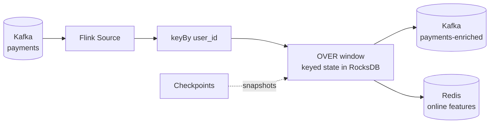

# 🌊 Welcome — Apache Flink for Real-time ML

If a fraud model needs "how many payments did this user make in the last 10 minutes, *including this one*" and must answer within 80 ms at the 95th percentile, a nightly batch job is useless and a micro-batch engine is usually too slow. That is the niche Apache Flink was built for: **stateful computation over unbounded streams, one event at a time, with exactly-once state guarantees.**

## 🎯 Learning Objectives
- Explain why per-event stream processing exists and when it beats micro-batching
- Describe Flink's runtime: JobManager, TaskManagers, slots, parallelism, and operator chaining
- Reason precisely about **time**: event time vs processing time, watermarks, lateness, and windows
- Use **keyed state**, RocksDB, checkpoints, and savepoints to build fault-tolerant pipelines
- Compute real-time ML features with **Flink SQL** (`OVER` windows, upsert sinks)
- Decide when to drop down to **PyFlink DataStream** and what Python UDFs really cost
- Operate Flink on a **laptop**: backpressure, memory tuning, and latency knobs
- Build a Kafka → Flink → Redis feature pipeline that the P1 fraud project extends

## Introduction

Most ML systems are trained on history and served on the present. The gap between the two is where real-time ML lives: features that describe *what just happened* (velocity counts, rolling sums, distinct countries in the last hour) must be computed continuously and handed to a model in milliseconds. Kafka gives us a durable log of events ([[../29 - Distributed ML Infrastructure/01 - Apache Kafka|Apache Kafka]]); Flink is the engine that turns that log into **always-up-to-date state**.

This course is deliberately practical. Every note ends with a runnable piece that grows toward a real pipeline, and every configuration knob is explained in terms of its effect on **latency, correctness, and memory** — the three things that decide whether a streaming ML system survives production. It runs entirely on a Docker Compose stack sized for an 8 GB laptop.

It sits inside a larger arc: the companion course [[../47 - Stream Processing Engines Compared/00 - Welcome to Stream Processing Engines Compared|Stream Processing Engines Compared]] contrasts Flink with Spark Structured Streaming and Python-native engines, and the real-time ML patterns course ([[../../09 - MLOps y Produccion/40 - Real-time ML Systems/00 - Welcome - Why Real-time ML Systems|Real-time ML Systems]]) shows where streaming features fit in the broader MLOps picture.

---

## Course Map

| #  | Note                                                    | Core question                                                     |
|----|---------------------------------------------------------|-------------------------------------------------------------------|
| 01 | Stream Processing Model and Flink Architecture          | What actually runs where, and why per-event?                      |
| 02 | Time, Watermarks and Windows                            | How does a stream know "the last 10 minutes" are complete?        |
| 03 | State, Checkpoints and Exactly-Once                     | How does Flink remember, and recover without losing or duplicating? |
| 04 | Flink SQL for Real-time Features                        | How do we express ML features declaratively and fast?             |
| 05 | PyFlink and the DataStream API                          | When is SQL not enough, and what does Python cost?                |
| 06 | Operating Flink on a Laptop                             | Backpressure, memory, and the knobs that move p95                 |
| 07 | Capstone — Kafka → Flink → Redis Feature Pipeline       | Putting it all together, measured end to end                      |

## Prerequisites

- Kafka fundamentals: topics, partitions, consumer groups ([[../29 - Distributed ML Infrastructure/01 - Apache Kafka|Apache Kafka]])
- Docker Compose ([[../../02 - Docker Profesional/00 - Bienvenida|Docker Profesional]])
- SQL window functions ([[../../01 - Curso SQL con PostgreSQL/00 - Bienvenida al Curso SQL|Curso SQL]])
- Redis basics ([[../25 - Bases de Datos y Message Queues/03 - Redis y Caching|Redis y Caching]])

⚠️ **Version note:** this course targets the **Flink 2.x** line (the 2.0 release removed the DataSet API and the legacy `SourceFunction`/`SinkFunction`, made Java 17 the default, and moved configuration to `config.yaml`). Always pin the Flink version *and* the matching Kafka connector version — connectors are released separately and often lag the core.

## Where This Leads

The capstone pipeline is the feature layer of **P1 — Real-time Fraud Detection Platform**: Kafka → Flink SQL → Redis → XGBoost/ONNX scoring with a p95 ≤ 80 ms goal. Notes 02, 03 and 06 explain the three design decisions that project depends on: `OVER` windows instead of tumbling windows, at-least-once plus idempotency on the hot path, and lowering `execution.buffer-timeout`.

## References
- Apache Flink documentation — https://nightlies.apache.org/flink/flink-docs-stable/
- Carbone et al., *Apache Flink: Stream and Batch Processing in a Single Engine* (IEEE Data Eng. Bull., 2015)
- Akidau et al., *The Dataflow Model* (VLDB 2015)
- Tyler Akidau, Slava Chernyak, Reuven Lax — *Streaming Systems* (O'Reilly, 2018)
