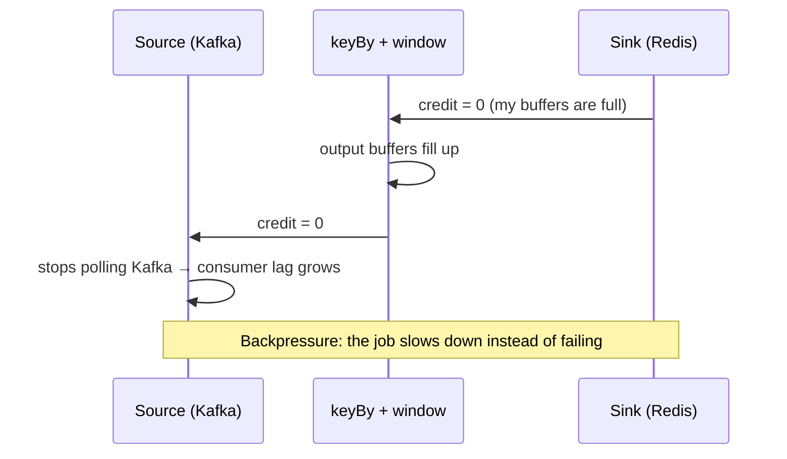

# 🏗️ 01 - Stream Processing Model and Flink Architecture

A fraud model that waits for "the next batch" is a model that approves the fraudulent payment first and flags it later. Flink exists because some answers are only valuable **in the instant the event happens** — and producing them requires a runtime designed around continuous, stateful, per-event computation rather than repeated small batch jobs.

## 🎯 Learning Objectives
- Trace the history from batch → Lambda → Kappa → the Dataflow model, and why each step happened
- Quantify the latency difference between **micro-batch** and **per-event** processing
- Read a Flink job as a **logical dataflow graph** and as a **physical execution graph**
- Explain JobManager, TaskManagers, task slots, slot sharing, and operator chaining
- Understand how `keyBy` routes events with **key groups** and why `maxParallelism` matters
- Explain credit-based flow control, network buffers, and where natural **backpressure** comes from
- Size parallelism correctly for a 4-core laptop and avoid hot-key skew

## Introduction

Stream processing is not "batch, but faster". It is a different contract: the input never ends, results must be produced continuously, and the system must remember things (state) across an unbounded sequence of events while surviving crashes. Every design choice in Flink — how it schedules work, moves data between machines, and stores state — follows from that contract.

For ML engineers, this matters because **online features are state**. "Number of payments in the last 10 minutes per user" is a piece of state per user that must be updated on every event and read with low latency. The engine that maintains it determines your feature freshness, your p95 latency, and whether features computed online match those computed offline for training ([[../../09 - MLOps y Produccion/19 - Feature Engineering y Feature Stores/02 - Feature Stores (Feast, Tecton)|Feature Stores]]).

This note builds the mental model you will use for the rest of the course: what a Flink job *is*, where each piece runs, and how data physically flows from Kafka through operators to sinks.

---

## 1. The Problem and Why This Solution Exists

### From nightly batch to the Lambda architecture

For two decades, analytics ran as **batch**: collect a day of data, run a job (MapReduce, later Spark), publish results. Batch is simple and correct, but its latency is measured in hours. When businesses needed fresher answers (real-time dashboards, fraud alerts), the industry bolted a second system next to batch: the **Lambda architecture** (Nathan Marz, ~2011). A *speed layer* (Apache Storm) produced approximate real-time results, while the *batch layer* recomputed exact results later, and a *serving layer* merged both.

Lambda worked, but it forced teams to **implement every computation twice**, in two frameworks with different semantics. The two codepaths drifted, and debugging "why does the real-time number differ from the batch number?" became a full-time job. For ML, this is exactly the **train/serve skew** problem: features computed one way for training and another way for serving.

### Kappa: the log as the source of truth

Jay Kreps (co-creator of Kafka) proposed the **Kappa architecture** (2014): keep a single streaming pipeline, store the raw events in a durable, replayable log (Kafka), and when logic changes, **replay the log** through the new version. This only works if the stream processor can produce *correct* results — not approximations — which requires handling out-of-order events, consistent state, and exactly-once recovery.

### The Dataflow model and Flink

Google's **Dataflow model** paper (Akidau et al., VLDB 2015) formalized what correctness means for unbounded data: separate **what** you compute, **where in event time** (windows), **when in processing time** results are emitted (triggers, watermarks), and **how refinements relate** (accumulation). Apache Flink, which grew out of the Stratosphere research project at TU Berlin, implemented these ideas as a **true streaming engine**: a long-running dataflow where every operator processes records as they arrive and keeps state locally, with a distributed snapshot algorithm for fault tolerance.

### Micro-batch vs per-event: the latency math

Spark Streaming (2013) took the other route: **micro-batching**. It chops the stream into tiny batches (e.g., every 500 ms) and runs a small batch job for each. This reuses the batch engine and gives high throughput, but every event waits for its batch to close.

For an event arriving uniformly at random inside a batch interval $T_b$, the expected waiting time before processing starts is $T_b/2$, and the worst case is $T_b$. The end-to-end latency of a micro-batch engine is approximately:

$$
L_{\text{micro}} \approx \underbrace{\frac{T_b}{2}}_{\text{wait for batch}} + T_{\text{schedule}} + T_{\text{process}}
\qquad
L^{\max}_{\text{micro}} \approx T_b + T_{\text{schedule}} + T_{\text{process}}
$$

A per-event engine has no batch to wait for. Its latency is dominated by processing plus the time records sit in **network buffers** before being flushed downstream:

$$
L_{\text{per-event}} \approx T_{\text{process}} + \sum_{\text{hops}} T_{\text{buffer}}
\qquad
T_{\text{buffer}} \le \texttt{execution.buffer-timeout}
$$

With $T_b = 1\,\text{s}$, a micro-batch job averages ≥ 500 ms of pure waiting; a tuned per-event Flink job can deliver results in single-digit to tens of milliseconds. That gap is the reason a p95 ≤ 80 ms fraud pipeline uses Flink.

⚠️ **Warning:** Flink's default `execution.buffer-timeout` is **100 ms**. With several network hops, the defaults alone can consume an 80 ms budget. Note 06 shows how to lower it and what it costs in throughput.

💡 **Tip:** Spark has added lower-latency modes over the years (continuous processing, and more recently real-time execution modes in the Databricks ecosystem). The comparison is revisited with measurements in [[../47 - Stream Processing Engines Compared/01 - Execution Models|Execution Models]] — never assume, measure.

| Approach               | Typical latency    | Strength                                 | Weakness                                        |
|------------------------|--------------------|------------------------------------------|-------------------------------------------------|
| Batch (Spark, BigQuery) | Minutes–hours      | Simple, exact, cheap per record          | Stale results                                   |
| Lambda (Storm + batch) | Seconds + hours    | Fresh approximate + exact later          | Two codebases, drift, skew                      |
| Micro-batch (Spark SS) | Hundreds of ms–s   | Throughput, unified batch/stream code    | Every event waits for its batch                 |
| Per-event (Flink)      | Milliseconds       | Low latency, rich state, event time      | More operational surface (state, checkpoints)   |

---

## 2. Conceptual Deep Dive

### 2.1 A job is a dataflow graph

A Flink program — whether written in SQL, the Table API, or the DataStream API — compiles to a **directed acyclic graph** of operators: **sources** read (Kafka), **transformations** compute (map, filter, keyBy, window, aggregate, join), and **sinks** write (Kafka, Redis, JDBC).

The **logical graph** is what you wrote. The **physical (execution) graph** is what runs: each operator is split into `parallelism` **subtasks**, and edges become network channels between subtasks.


*Figure: the logical graph (top) becomes parallel subtasks (bottom). Source and map are **chained** into one task; keyBy forces a network shuffle. Source: Apache Flink documentation.*

### 2.2 How records move between operators: partitioning

Between two operators, Flink chooses how records are distributed:

| Strategy      | What it does                                          | When it happens                              |
|---------------|-------------------------------------------------------|----------------------------------------------|
| `forward`     | Subtask *i* → subtask *i*, no network                 | Same parallelism, no key change (chainable)  |
| `keyBy` (hash) | Same key → always the same subtask                    | Any per-key state or window                  |
| `rebalance`   | Round-robin across subtasks                           | Fix skewed sources                           |
| `broadcast`   | Every record to every subtask                         | Small control/config streams                 |

`keyBy` is the heart of stateful streaming. It guarantees that **all events for user `u_42` go to the same subtask**, so that subtask can keep `u_42`'s state locally — no remote lookups, no locks.

### 2.3 Key groups: why `maxParallelism` exists

Flink does not hash keys directly onto subtasks. It hashes them onto a fixed number of **key groups** (equal to `maxParallelism`, default 128 for small jobs), and then assigns contiguous ranges of key groups to subtasks:

$$
\text{keyGroup}(k) = \text{murmur}\big(\text{hash}(k)\big) \bmod M
\qquad
\text{subtask}(g) = \left\lfloor \frac{g \cdot P}{M} \right\rfloor
$$

where $M$ is `maxParallelism` and $P$ the current parallelism. Key groups are the **unit of state redistribution**: when you rescale from $P=2$ to $P=4$ from a savepoint, Flink moves whole key groups between subtasks without rehashing every key.

⚠️ **Warning:** `maxParallelism` is baked into the state of a running job. You can rescale parallelism up to $M$, but changing $M$ itself breaks savepoint compatibility. Set it deliberately (a power of two comfortably above your largest expected parallelism) on day one.

### 2.4 The runtime: who does what


*Figure: client, JobManager, and TaskManagers. Source: Apache Flink documentation.*

- **Client** — compiles your program/SQL into a JobGraph and submits it. It is not part of the running job.
- **JobManager** — the coordinator. It contains the **Dispatcher** (REST endpoint + web UI on `:8081`), the **ResourceManager** (manages slots), and one **JobMaster** per job (schedules tasks, triggers checkpoints, handles failures).
- **TaskManagers** — JVM worker processes that execute subtasks. Each offers a fixed number of **task slots**.

Deployment modes: a **session cluster** (long-running JM + TMs, you submit many jobs — what we use locally) and **application mode** (the cluster lives and dies with one application — the standard for production on Kubernetes).

### 2.5 Slots, slot sharing, and chaining

A **task slot** is a share of a TaskManager's managed memory. Slots isolate *memory*, **not CPU**: four slots on a TaskManager compete for the same cores.


*Figure: with slot sharing, one slot can host a full pipeline slice (source → window → sink). Source: Apache Flink documentation.*

Two optimizations reduce overhead:

- **Operator chaining** fuses consecutive operators with `forward` edges into a single task executed by one thread. Records pass as method calls instead of being serialized and buffered. This is a big latency and CPU win.
- **Slot sharing** lets subtasks of *different* operators of the same job share a slot, so a job needs as many slots as its **maximum operator parallelism**, not the sum.

### 2.6 The network stack and natural backpressure

When records cross a network edge (a `keyBy` shuffle, or between TaskManagers), they are serialized into **network buffers** (32 KB memory segments by default). A buffer is sent downstream when it is **full** or when the **buffer timeout** expires — this is the throughput/latency trade-off:

$$
\text{full buffers} \Rightarrow \text{fewer, bigger network transfers (throughput)}
\qquad
\text{short timeout} \Rightarrow \text{records leave sooner (latency)}
$$

Flink uses **credit-based flow control**: a receiver announces how many buffers it can accept (credits), and a sender only sends what it has credit for. If a downstream operator is slow (say, a sink to Redis), its input buffers fill, it stops granting credit, upstream output buffers fill, and the slowdown propagates back to the source, which then reads Kafka more slowly. This is **backpressure** — and it is a feature: instead of crashing with out-of-memory, the job slows down and **Kafka consumer lag grows**, which you can see and alert on.

By Little's law, the number of records in flight relates throughput $\lambda$ and latency $W$:

$$
N_{\text{in-flight}} = \lambda \cdot W
$$

At 10,000 events/s and 20 ms of pipeline latency, about 200 records are in flight at any moment — tiny buffers suffice. If latency balloons to 2 s under backpressure, 20,000 records are queued, mostly in Kafka (which is designed for it).



---

## 3. Production Reality

### Sizing for a 4-core laptop

On an Intel i5-10300H (4 cores / 8 threads) running Kafka, Flink, Redis, a load generator, and a scoring service in Docker, CPU — not RAM — is usually the ceiling. Practical rules:

- **Parallelism ≤ Kafka partitions** of the source topic. Extra source subtasks sit idle.
- **Parallelism ≤ available cores for Flink.** With ~2 threads budgeted for Flink, parallelism 2–4 is the sweet spot; 12 subtasks on 2 cores means constant context switching and *higher* latency.
- One TaskManager with several slots is cheaper than several TaskManagers on a single machine (one JVM's overhead instead of many).

### Hot keys and skew

`keyBy` guarantees locality but not balance. If one merchant or one bot account produces 30% of events, the subtask owning that key becomes the bottleneck while others idle. Symptoms: one subtask's `busyTimeMsPerSecond` near 1000 while others are low; backpressure that does not improve with more parallelism.

Caso real: Alibaba built its real-time search and recommendation feature pipelines on Flink (its internal fork, Blink, was later merged upstream). During Singles' Day traffic spikes, a handful of mega-sellers concentrate a disproportionate share of events; the standard mitigation is **two-phase aggregation** — pre-aggregate on a salted key (`key + random(0..N)`), then combine per real key — trading a bit of latency for balance.

Caso real: Uber's AthenaX platform let analysts define streaming jobs in SQL that ran on Flink, powering real-time metrics for marketplace pricing and ETA systems — an early proof that SQL on Flink scales as an ML feature interface (note 04).

### Known failure modes

| Symptom                                   | Likely cause                                          | First check                                   |
|-------------------------------------------|-------------------------------------------------------|-----------------------------------------------|
| Job never starts (`NoResourceAvailable`)  | Parallelism > total slots                             | Web UI → Task Managers → slots                |
| Latency floor of ~100 ms even at low load | Default `buffer-timeout`                              | Note 06                                       |
| One subtask always busy                   | Hot key / skew                                        | Per-subtask busy time in the web UI           |
| Lag grows, no errors                      | Backpressure from a slow sink or operator             | Backpressure tab, sink latency                |
| `ClassNotFoundException` for Kafka        | Connector JAR missing or version mismatch             | `lib/` contents vs Flink version              |

---

## 4. Code in Practice

### A minimal local cluster (Docker Compose)

```yaml
# docker-compose.yml — Kafka (KRaft) + Flink session cluster, sized for an 8 GB laptop
services:
  kafka:
    image: apache/kafka:3.9.0          # pin versions; verify the latest compatible tag
    environment:
      KAFKA_NODE_ID: 1
      KAFKA_PROCESS_ROLES: broker,controller
      KAFKA_LISTENERS: INTERNAL://:29092,EXTERNAL://:9092,CONTROLLER://:9093
      KAFKA_ADVERTISED_LISTENERS: INTERNAL://kafka:29092,EXTERNAL://localhost:9092
      KAFKA_LISTENER_SECURITY_PROTOCOL_MAP: INTERNAL:PLAINTEXT,EXTERNAL:PLAINTEXT,CONTROLLER:PLAINTEXT
      KAFKA_INTER_BROKER_LISTENER_NAME: INTERNAL
      KAFKA_CONTROLLER_QUORUM_VOTERS: 1@kafka:9093
      KAFKA_CONTROLLER_LISTENER_NAMES: CONTROLLER
      KAFKA_OFFSETS_TOPIC_REPLICATION_FACTOR: 1
      KAFKA_HEAP_OPTS: "-Xmx512m -Xms512m"   # explicit heap: the container limit is NOT the heap
    ports: ["9092:9092"]
    mem_limit: 850m

  jobmanager:
    image: flink:2.0-java17             # verify the exact 2.x tag you standardize on
    command: jobmanager
    ports: ["8081:8081"]                # web UI
    environment:
      FLINK_PROPERTIES: |
        jobmanager.rpc.address: jobmanager
        jobmanager.memory.process.size: 600m
    mem_limit: 650m

  taskmanager:
    image: flink:2.0-java17
    command: taskmanager
    depends_on: [jobmanager]
    environment:
      FLINK_PROPERTIES: |
        jobmanager.rpc.address: jobmanager
        taskmanager.numberOfTaskSlots: 4
        taskmanager.memory.process.size: 1200m
        parallelism.default: 2
    mem_limit: 1250m
```

```bash
docker compose up -d
docker compose exec kafka /opt/kafka/bin/kafka-topics.sh \
  --bootstrap-server localhost:9092 --create --topic payments --partitions 4
# Open http://localhost:8081 → 1 TaskManager, 4 slots available
```

💡 **Tip:** `mem_limit` protects the rest of your machine — if Flink exceeds it, only that container is OOM-killed, not the whole WSL2 VM.

### Parallelism vs partitions

```sql
-- ❌ 8 source subtasks reading a 4-partition topic: 4 subtasks idle,
--    and on a 4-core laptop the extra threads only add scheduling overhead.
SET 'parallelism.default' = '8';

-- ✅ Match the source topic; scale partitions first, parallelism second.
SET 'parallelism.default' = '4';
```

### Seeing the physical graph

```sql
-- In the SQL client (docker compose exec jobmanager ./bin/sql-client.sh)
EXPLAIN PLAN FOR
SELECT user_id, COUNT(*) AS cnt FROM payments GROUP BY user_id;
-- The optimized plan shows Exchange(distribution=[hash[user_id]]) — that's the keyBy shuffle.
-- Everything between two Exchanges is a candidate for operator chaining.
```

### 📦 Compression code: key groups and the micro-batch latency tax

```python
# 📦 Compression code: Flink's routing and why per-event beats micro-batch on latency
# Covers: key groups, subtask assignment, rescaling, micro-batch waiting time
import random
import statistics
import zlib

M = 128  # maxParallelism (number of key groups)

def key_group(key: str, max_par: int = M) -> int:
    # Flink uses murmur hash; crc32 is a stand-in with the same idea: stable hash → bucket
    return zlib.crc32(key.encode()) % max_par

def subtask(group: int, parallelism: int, max_par: int = M) -> int:
    return group * parallelism // max_par  # contiguous ranges of key groups per subtask

users = [f"u_{i}" for i in range(10_000)]
for p in (2, 4):
    load = [0] * p
    for u in users:
        load[subtask(key_group(u), p)] += 1
    print(f"P={p} users per subtask: {load}")
# Same key always lands on the same subtask; rescaling moves whole key groups, not keys.
g = key_group("u_42")
print(f"u_42 -> key group {g} -> subtask {subtask(g, 2)} at P=2, {subtask(g, 4)} at P=4")

# Micro-batch: each event waits for its batch to close (uniform arrival inside T_b)
T_b, T_proc = 1.0, 0.020  # seconds
micro = [random.uniform(0, T_b) + T_proc for _ in range(100_000)]
per_event = [T_proc + random.uniform(0, 0.005) for _ in range(100_000)]  # 5 ms buffer timeout
p95 = lambda xs: statistics.quantiles(xs, n=100)[94]
print(f"micro-batch p95 = {p95(micro)*1000:.0f} ms | per-event p95 = {p95(per_event)*1000:.0f} ms")
# ¡Sorpresa! With a 1 s batch interval, micro-batch p95 ≈ 970 ms even though processing takes 20 ms.
```

---

## 🎯 Key Takeaways
- Flink is a **per-event** engine: latency ≈ processing + buffer flushes, not "half a batch interval".
- Lambda's two codepaths caused drift; Kappa + a correct streaming engine gives one codepath — the same cure as for ML **train/serve skew**.
- A job is a logical graph compiled into parallel **subtasks**; `keyBy` shuffles route each key to one subtask via **key groups**.
- **Slots isolate memory, not CPU**; on a laptop, parallelism should match both partitions and real cores.
- Operator **chaining** removes serialization between operators; shuffles (`keyBy`) are where buffers and the buffer timeout matter.
- **Backpressure** is Flink's safety valve: slow sinks slow the source and show up as Kafka lag, not crashes.
- Set `maxParallelism` deliberately on day one — it is part of your state's identity.

## References
- Apache Flink — *Flink Architecture* and *Stateful Stream Processing* concepts: https://nightlies.apache.org/flink/flink-docs-stable/docs/concepts/flink-architecture/
- Akidau et al., *The Dataflow Model* (VLDB 2015)
- Carbone et al., *Apache Flink: Stream and Batch Processing in a Single Engine* (2015)
- Jay Kreps, *Questioning the Lambda Architecture* (O'Reilly Radar, 2014)
- Nathan Marz & James Warren, *Big Data* (Manning, 2015) — the Lambda architecture
- [[../29 - Distributed ML Infrastructure/01 - Apache Kafka|Apache Kafka]] · [[02 - Time, Watermarks and Windows|Next: Time, Watermarks and Windows]]
