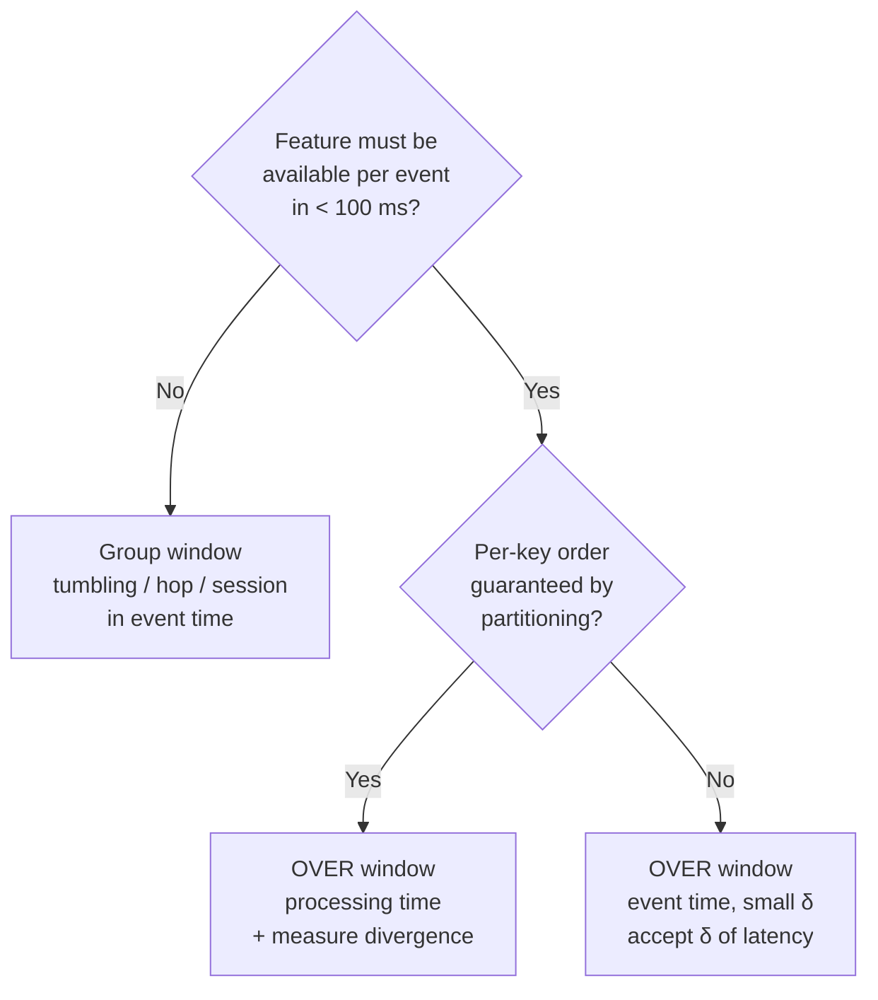

# ⏱️ 02 - Time, Watermarks and Windows

"Payments in the last 10 minutes" sounds trivial until you ask: *10 minutes according to whom?* The phone that made the payment, the Kafka broker that stored it, or the Flink operator that processed it two seconds later? Get this wrong and your online features silently disagree with your training data — the most expensive kind of bug in real-time ML.

## 🎯 Learning Objectives
- Distinguish **event time**, **ingestion time**, and **processing time**, and when each is correct
- Explain what a **watermark** asserts and how bounded out-of-orderness watermarks are generated
- Understand watermark propagation across parallel inputs and the **idle source** trap
- Choose between **tumbling, sliding (hop), session, cumulative, and OVER** windows for ML features
- Calculate the **latency cost** of event-time windows and watermarks
- Handle **late data**: allowed lateness, side outputs, and metrics
- Justify why P1's hot path uses processing-time `OVER` windows

## Introduction

Streams are not ordered by the time things happened. A payment made on a phone in an elevator reaches the backend 40 seconds late; Kafka partitions are consumed at slightly different speeds; a retry delivers an old event after newer ones. If a window is defined by the clock of the machine processing the data, results depend on **when you happened to run the job** — replaying yesterday's data produces different numbers than yesterday's live run.

Event-time processing fixes this by computing over the timestamps *inside* the events. But it raises a new question: since events can arrive late, when is a window "complete" enough to emit its result? Waiting forever is exact but useless; emitting immediately is fast but wrong. **Watermarks** are Flink's mechanism for managing exactly that trade-off between **completeness and latency**.

For ML features this is not academic. The offline pipeline that builds training data computes windows over event timestamps (it sees all data at once). If the online pipeline uses a different notion of time, the features differ — **train/serve skew** — and the model degrades without any error message ([[../../09 - MLOps y Produccion/19 - Feature Engineering y Feature Stores/01 - Feature Engineering Avanzado|Feature Engineering]]).

---

## 1. The Problem and Why This Solution Exists

### Three clocks


*Figure: event time is stamped at the source; ingestion time when entering the system; processing time when an operator handles the record. Source: Apache Flink documentation.*

| Notion of time     | Defined by                              | Deterministic on replay? | Latency cost |
|--------------------|-----------------------------------------|:------------------------:|:------------:|
| **Processing time** | Wall clock of the operator's machine    | ❌                        | None         |
| **Ingestion time**  | Timestamp when the record entered (e.g., Kafka `LogAppendTime`) | Partially | None |
| **Event time**      | Timestamp inside the event (`event_time`) | ✅                        | Must wait for watermarks |

Processing time is the simplest and fastest — results are emitted as records arrive — but it is **non-deterministic**: the same input produces different window contents depending on load, backpressure, and restarts. Event time is deterministic and matches how training data is built, but requires the engine to reason about *completeness*.

### Why "just sort the events" does not work

In batch you can sort all events by timestamp. In an unbounded stream there is no "all": a late event could, in principle, arrive at any time. The Dataflow model (Akidau et al., 2015) reframed the problem: instead of guaranteeing completeness, provide a **heuristic or exact estimate of input completeness** in event time — a watermark — and let the user decide what to do with data that arrives after it.

---

## 2. Conceptual Deep Dive

### 2.1 What a watermark asserts

A watermark with timestamp $W$ flowing through the stream is a declaration:

$$
W(t) = \tau \quad\Longleftrightarrow\quad \text{"no more events with } t_{\text{event}} \le \tau \text{ are expected"}
$$

When an operator's watermark passes the end of a window, the window is considered complete and its result is emitted. Watermarks are **monotonic** — they only move forward.


*Figures: watermarks (dashed markers) interleaved with records in an ordered and an out-of-order stream. Source: Apache Flink documentation.*

### 2.2 Bounded out-of-orderness

The most common strategy assumes events are at most $\delta$ late relative to the maximum timestamp seen so far:

$$
W = \max_{i \le n}\big(t^{(i)}_{\text{event}}\big) - \delta
$$

Flink emits this watermark periodically, every `pipeline.auto-watermark-interval` (default **200 ms**). Choosing $\delta$ is a statistical decision: measure the lateness distribution $\ell = t_{\text{arrival}} - t_{\text{event}}$ and set $\delta$ to a high quantile:

$$
\delta \approx Q_{0.999}(\ell) \quad\Rightarrow\quad P(\text{event dropped as late}) \approx 0.001
$$

Larger $\delta$ → fewer late events, but **every window result is delayed by $\delta$**.

### 2.3 Watermarks with parallel inputs

An operator with several input channels (e.g., after a `keyBy`) takes the **minimum** watermark across all of them:

$$
W_{\text{operator}} = \min_{c \in \text{inputs}} W_c
$$


*Figure: each parallel source emits its own watermark; downstream operators advance with the slowest input. Source: Apache Flink documentation.*

⚠️ **Warning — the idle source trap:** if one Kafka partition receives no data (low-traffic topic, uneven keys), its watermark never advances, the minimum is stuck, and **no event-time window anywhere in the job ever fires**. The pipeline looks healthy — records flow in — but nothing comes out. Fix it with an idleness timeout (`WatermarkStrategy.withIdleness(...)` in DataStream, `table.exec.source.idle-timeout` in SQL), which excludes idle inputs from the minimum.

💡 **Tip:** The Kafka source generates watermarks **per partition** inside each source subtask, which prevents a fast partition from making a slow partition's events look late. Always define watermarks *in the source* (or the SQL DDL), not in a later operator.

### 2.4 Window types for ML features

| Window       | Shape                                   | Emits                              | Typical ML feature                                 |
|--------------|-----------------------------------------|------------------------------------|----------------------------------------------------|
| **Tumbling** | Fixed, non-overlapping (e.g., 1 min)     | Once, when the window closes       | Volume per minute (dashboards, surge detection)    |
| **Hop (sliding)** | Fixed size, overlapping slide (10 min every 1 min) | Every slide                 | Smoothed rates                                     |
| **Session**  | Gap-based, per key                       | After inactivity gap               | Session length, clicks per session                 |
| **Cumulate** | Growing within a period (0→1h, step 5 min) | Every step                       | "So far today" counters                            |
| **OVER**     | Relative to **each row** (preceding range) | **One result per input row**     | "Payments in the last 10 min *including this one*" |

The first four are **group windows**: they aggregate many rows into one result per window and emit when the window closes. `OVER` windows are different: they attach an aggregate to **every row**, which is exactly what per-event feature enrichment needs.

### 2.5 The latency cost of windows (the key decision for real-time ML)

For a tumbling window of length $T$ in event time, an event at time $t_e$ inside window $[s, s+T)$ only contributes to a result emitted once the watermark passes $s+T$:

$$
L_{\text{tumbling}}(t_e) \approx \underbrace{(s + T - t_e)}_{\text{rest of the window}} + \underbrace{\delta}_{\text{out-of-orderness}} + \underbrace{\Delta_{\text{wm}}}_{\text{watermark interval}}
\qquad
\mathbb{E}[L_{\text{tumbling}}] \approx \frac{T}{2} + \delta + \frac{\Delta_{\text{wm}}}{2}
$$

With $T = 10\,\text{min}$, the average wait is **5 minutes** — unusable for scoring a payment *now*.

An event-time `OVER` window emits one row per event, but Flink must still buffer rows until the watermark guarantees no earlier event can arrive (to aggregate in timestamp order):

$$
L_{\text{OVER, event time}} \approx \delta + \Delta_{\text{wm}} + T_{\text{process}}
$$

With $\delta = 2\,\text{s}$ that is still ~2.2 s — too slow for an 80 ms budget. A **processing-time** `OVER` window emits immediately:

$$
L_{\text{OVER, proc time}} \approx T_{\text{process}}
$$

That is the reasoning behind P1's choice: processing-time `OVER` windows on the hot path, made safe because (a) the producer writes each user's events in order, and (b) Kafka preserves order **within a partition** keyed by `user_id`. Event-time `OVER` windows are kept as a measured experiment to quantify the cost of determinism.

⚠️ **Warning:** Processing-time features are only safe when per-key order is guaranteed and lateness is negligible. Under heavy backpressure, "the last 10 minutes of processing time" can contain a different set of events than "the last 10 minutes of event time" — document that trade-off and measure it rather than hiding it.



### 2.6 Late data

Events arriving behind the watermark are **late**. Options:

- **Drop** (default for most SQL windows) — and count them via the `numLateRecordsDropped` metric.
- **Allowed lateness** (DataStream) — keep window state for an extra period and emit *updated* results when late events arrive (downstream must handle updates/retractions).
- **Side output** — route late events to a separate stream (e.g., a DLQ topic) for auditing and offline correction.

Caso real: mobile ride-hailing apps buffer GPS and trip events while offline and flush them when connectivity returns. Teams that compute ETA-model features in event time measure the lateness distribution per app version, set $\delta$ from its tail, and route stragglers to a side output that feeds the offline training set — so training data stays complete even when the online feature skipped them.

---

## 3. Production Reality

### Choosing δ with data, not intuition

1. Log `arrival_time - event_time` for a day of traffic.
2. Plot its distribution per source (web, mobile, partner API) — they differ by orders of magnitude.
3. Pick $\delta$ from the quantile that matches the business cost of a late drop.
4. Alert on `numLateRecordsDropped` rate; a sudden increase usually means a producer clock problem or an upstream outage.

### Clock skew

Event timestamps come from producer clocks. A device whose clock is 10 minutes in the future pushes the max timestamp forward and, with bounded out-of-orderness, **makes everyone else's events look late**. Defenses: use server-side timestamps where possible (the API gateway's receive time), clamp timestamps that are far in the future, and monitor `max(event_time) - now()`.

### Where watermarks break pipelines

| Symptom                                         | Cause                                      | Fix                                            |
|-------------------------------------------------|--------------------------------------------|------------------------------------------------|
| No window output at all                         | Idle partition holds the min watermark     | Idle timeout                                   |
| Outputs appear minutes late                     | Group window used for per-event feature    | `OVER` window                                  |
| Results differ between live run and replay      | Processing-time windows                    | Event time (or document and measure the gap)  |
| Many late drops after a deploy                  | Producer clock skew / timezone bug         | Server timestamps, clamp, monitor              |

---

## 4. Code in Practice

### Declaring event time and watermarks in Flink SQL

```sql
CREATE TABLE payments (
  payment_id  STRING,
  user_id     STRING,
  amount      DOUBLE,
  country     STRING,
  event_time  TIMESTAMP_LTZ(3),
  proc_time   AS PROCTIME(),                                   -- processing-time attribute
  WATERMARK FOR event_time AS event_time - INTERVAL '2' SECOND -- bounded out-of-orderness δ = 2 s
) WITH (
  'connector' = 'kafka',
  'topic' = 'payments',
  'properties.bootstrap.servers' = 'kafka:29092',
  'properties.group.id' = 'flink-features',
  'scan.startup.mode' = 'latest-offset',
  'format' = 'json'
);

SET 'table.exec.source.idle-timeout' = '5 s';  -- don't let an idle partition freeze the watermark
```

### Group windows: right for dashboards, wrong for per-event scoring

```sql
-- ✅ Surge detection / dashboards: one row per user per minute (emitted when the minute closes)
SELECT window_start, window_end, user_id, COUNT(*) AS cnt_1m
FROM TABLE(TUMBLE(TABLE payments, DESCRIPTOR(event_time), INTERVAL '1' MINUTE))
GROUP BY window_start, window_end, user_id;

-- ❌ As a fraud feature: the payment being scored is NOT in any emitted result yet;
--    the result for its window arrives up to 10 min + δ later.
SELECT window_start, user_id, COUNT(*) AS cnt_10m
FROM TABLE(TUMBLE(TABLE payments, DESCRIPTOR(event_time), INTERVAL '10' MINUTES))
GROUP BY window_start, window_end, user_id;
```

### OVER windows: one enriched row per payment

```sql
-- ✅ Hot path (P1): processing time, emitted immediately, includes the current row
SELECT payment_id, user_id, amount,
       COUNT(*)    OVER w AS f_cnt_10m,
       SUM(amount) OVER w AS f_sum_10m
FROM payments
WINDOW w AS (
  PARTITION BY user_id
  ORDER BY proc_time
  RANGE BETWEEN INTERVAL '10' MINUTE PRECEDING AND CURRENT ROW
);

-- 🧪 Experiment: event time — deterministic, but each row waits ≈ δ + watermark interval
SELECT payment_id, user_id,
       COUNT(*) OVER (PARTITION BY user_id ORDER BY event_time
                      RANGE BETWEEN INTERVAL '10' MINUTE PRECEDING AND CURRENT ROW) AS f_cnt_10m
FROM payments;
```

💡 **Tip:** In Flink SQL, all `OVER` aggregates in one `SELECT` must share the same window definition (same `PARTITION BY`, `ORDER BY`, and range). Features with different ranges (10 min vs 1 h vs 24 h) need separate queries or a DataStream `KeyedProcessFunction` — note 05 compares the options.

### 📦 Compression code: watermarks, late drops, and the latency of completeness

```python
# 📦 Compression code: bounded out-of-orderness watermarks
# Covers: lateness distribution, choosing δ, late-drop rate vs added latency, tumbling vs OVER cost
import random
import statistics

random.seed(7)
N = 200_000
# Lateness ℓ = arrival - event: mostly small, with a heavy tail (mobile clients reconnecting)
lateness = [random.expovariate(1 / 0.15) if random.random() > 0.01 else random.uniform(2, 60)
            for _ in range(N)]

def late_drop_rate(delta: float) -> float:
    # Approximation: an event is late if its lateness exceeds δ
    return sum(l > delta for l in lateness) / N

for delta in (0.2, 0.5, 2.0, 10.0):
    print(f"δ={delta:>4}s  late drops={late_drop_rate(delta):.3%}  added latency ≥ {delta}s")

q999 = statistics.quantiles(lateness, n=1000)[998]
print(f"Q99.9 of lateness = {q999:.1f}s  → δ chosen from data, not intuition")

T, delta, wm_interval = 600, 2.0, 0.2  # 10-min tumbling window, δ = 2 s, 200 ms watermark interval
print(f"E[latency] tumbling 10m  ≈ {T/2 + delta + wm_interval/2:.1f}s")
print(f"E[latency] OVER event-t. ≈ {delta + wm_interval/2:.1f}s")
print("E[latency] OVER proc-time ≈ processing time only (ms)")
# ¡Sorpresa! The 1% heavy tail dominates: δ=2s still drops ~1% because stragglers arrive 2–60 s late.
```

---

## 🎯 Key Takeaways
- **Processing time** is fast but non-deterministic; **event time** is deterministic and matches training data but must wait for completeness.
- A **watermark** $W=\tau$ asserts "no more events with timestamp ≤ τ"; bounded out-of-orderness sets $W = \max(t) - \delta$.
- Choose $\delta$ from the **measured lateness distribution**; every second of $\delta$ is a second of added latency.
- Operators advance with the **minimum** input watermark — configure **idle timeouts** or windows never fire.
- Group windows (tumbling/hop/session) emit when the window closes — fine for dashboards, too slow for per-event features.
- **OVER windows** emit one enriched row per event; processing-time OVER is the low-latency choice when per-key order is guaranteed.
- Late data must be **counted and routed**, never silently dropped.

## References
- Apache Flink — *Timely Stream Processing*: https://nightlies.apache.org/flink/flink-docs-stable/docs/concepts/time/
- Apache Flink — *Window TVFs* and *OVER Aggregation* (SQL docs)
- Akidau et al., *The Dataflow Model* (VLDB 2015)
- Akidau, *Streaming 101* and *Streaming 102* (O'Reilly Radar, 2015–2016)
- [[01 - Stream Processing Model and Flink Architecture|Previous: Architecture]] · [[03 - State, Checkpoints and Exactly-Once|Next: State, Checkpoints and Exactly-Once]]
