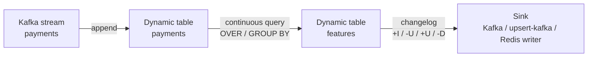

# 🧮 04 - Flink SQL for Real-time Features

The fastest way to create train/serve skew is to define a feature twice: once in a Python notebook for training and once in a Java job for serving. Flink SQL attacks that problem at the root — a feature becomes a **declarative query** that the engine runs continuously over a stream, that a reviewer can read in thirty seconds, and that can be checked against the offline definition.

## 🎯 Learning Objectives
- Understand **dynamic tables** and **continuous queries**: the stream–table duality behind Flink SQL
- Read and control **changelog modes**: append-only, retract, and upsert
- Write per-event ML features with `OVER` aggregations, including filtered aggregates
- Work around the **single-window-per-SELECT** restriction for multi-range features
- Enrich streams with **lookup joins** against reference data, and know their latency cost
- Use **statement sets**, mini-batch, and two-phase aggregation knowingly (latency vs throughput)
- Choose sinks: append Kafka, **upsert-kafka**, or an external writer for Redis

## Introduction

SQL looks like it belongs to batch databases, but Flink treats a SQL query over a stream as a **standing query** that never finishes: as new rows arrive in the input, the query's result changes, and those changes are emitted downstream. A feature like "number of payments in the last 10 minutes" is just a window aggregate; a fraud rule like "payment amount greater than 5× the user's 30-day average" is just a join and a comparison.

The benefits for ML teams are concrete. SQL is **reviewable** by data scientists who would never read a Java `KeyedProcessFunction`. The planner applies optimizations (operator chaining, predicate pushdown, state cleanup) you would otherwise hand-code. And because Flink runs the same SQL in **batch mode** over historical files, the feature definition can be reused to build training data — the strongest structural defense against skew.

The limits are concrete too: some features do not fit SQL's window rules, and some planner choices trade latency for throughput behind your back. This note covers both sides, using the P1 fraud features as the running example.

---

## 1. The Problem and Why This Solution Exists

### Imperative feature code drifts

A typical failure: the training pipeline computes `cnt_10m` with pandas `rolling("10min")` over event timestamps (right-closed interval), while the serving job counts with a left-closed interval in processing time and excludes the current event. Both look correct. The model sees a feature distribution in production that it never saw in training. Nothing crashes; recall just drops.

Uber's **AthenaX** (open-sourced in 2017) and later feature platforms such as Tecton and Feast's streaming transformations converged on the same answer: **features as declarative transformations** over streams, defined once, executed by an engine, versioned like code.

### Streams as tables, tables as streams

Flink SQL is built on the **stream–table duality**:

- A stream of events can be read as a table that keeps growing (**append-only**).
- A table whose rows change over time can be represented as a stream of **change events** (a changelog).

A continuous query reads input tables (streams), maintains whatever state it needs, and produces an output **dynamic table** whose changes flow to the sink.



---

## 2. Conceptual Deep Dive

### 2.1 Changelog modes: what your query emits

Every operator produces rows tagged with a **row kind**:

| Row kind | Meaning              | Produced by                                              |
|----------|----------------------|----------------------------------------------------------|
| `+I`     | Insert               | Everything append-only (scans, filters, OVER, window TVFs) |
| `-U`     | Update before (retract old value) | Non-windowed `GROUP BY`, regular joins      |
| `+U`     | Update after         | Non-windowed `GROUP BY`, regular joins                   |
| `-D`     | Delete               | Retractions, TTL cleanup in some operators               |

This determines which sinks can accept the result:

$$
\text{append-only query} \;\Rightarrow\; \text{any sink}
\qquad
\text{updating query} \;\Rightarrow\; \text{sink must support upserts or retractions}
$$

Example: `SELECT user_id, COUNT(*) FROM payments GROUP BY user_id` is **updating** — every new payment retracts the old count and emits a new one. Writing it to a plain append-only Kafka topic fails at planning time; writing it to `upsert-kafka` (keyed, compacted topic) works.

💡 **Tip:** Run `EXPLAIN CHANGELOG_MODE SELECT …` to see each operator's changelog mode before you pick a sink.

### 2.2 OVER aggregations: the per-event feature primitive

An `OVER` aggregation computes, for **each input row**, an aggregate over a range of preceding rows of the same partition. It is **append-only**: one output row per input row, never retracted. That is why it fits per-event enrichment perfectly:

$$
f_{\text{cnt\_10m}}(e) = \big|\{\, e' : \text{user}(e') = \text{user}(e),\; t(e) - 10\,\text{min} \le t(e') \le t(e) \,\}\big|
$$

Note the closed interval including $e$ itself — the current payment is part of its own feature, exactly as the offline definition must also state.

Filtered aggregates express conditional counts without extra queries:

```sql
COUNT(*) FILTER (WHERE amount < 2.0) OVER w      -- small "card testing" transactions
```

⚠️ **Warning — one window per SELECT:** all `OVER` aggregates in a single `SELECT` must share the **same** window (same `PARTITION BY`, `ORDER BY`, and range). You cannot compute a 10-minute count and a 1-hour count side by side in one query. Options:

| Option | How | Trade-off |
|---|---|---|
| A | One query per range; long ranges written to Redis by a separate writer | Simple SQL; long features can lag the current event slightly (documented skew) |
| B | Separate queries + an interval join on `payment_id` | Exact, but a join adds state and latency |
| C | DataStream `KeyedProcessFunction` computing all ranges from one per-user buffer | Exact and single-pass; you leave SQL (note 05) |

P1 implements **A** and measures **C** — the decision is made with latency numbers, not taste.

⚠️ **Verify per version:** support for `COUNT(DISTINCT …)` inside `OVER` and for `LAG` in streaming `OVER` queries has varied across releases. Test the exact queries on the Flink version you pin; if a construct is unsupported, compute that feature in DataStream (note 05) or via a UDAF.

### 2.3 Lookup joins: enriching with reference data

Some features come from slowly changing reference data — the user's home country, account age, a merchant's risk tier. A **lookup join** queries an external table *at processing time* for each row:

```sql
SELECT p.payment_id, p.amount, u.home_country, u.account_age_days
FROM payments AS p
JOIN user_profile FOR SYSTEM_TIME AS OF p.proc_time AS u
  ON p.user_id = u.user_id;
```

Each lookup is a remote call (JDBC, HBase…), so connectors offer caching (`lookup.cache = 'PARTIAL'` with max rows and TTL) and async lookups. The cost model:

$$
L_{\text{lookup}} \approx h \cdot L_{\text{cache}} + (1 - h) \cdot L_{\text{remote}}
$$

with cache hit rate $h$. At $h = 0.95$, $L_{\text{remote}} = 3$ ms, the average adds ~0.15 ms, but the **tail** is the remote call — and a cold cache after restart hits the database hard.

Caso real: P1 deliberately keeps profile features **out of Flink**: the scorer fetches them from Redis in one pipelined round-trip per micro-batch. A Flink lookup join is the documented alternative — it moves the enrichment upstream (one less hop in the scorer) at the cost of coupling the Flink job to the profile store's availability.

### 2.4 Optimizations that trade latency for throughput

| Option | What it does | Effect |
|---|---|---|
| `table.exec.mini-batch.enabled` | Buffers input rows and updates state per batch | ↑ throughput, ↓ state access; **adds up to `allow-latency`** |
| Two-phase (local-global) aggregation | Pre-aggregates before the shuffle | Fixes skew in `GROUP BY`; requires mini-batch |
| `table.exec.optimizer.distinct-agg.split.enabled` | Splits distinct aggregates into two levels | Fixes skew on `COUNT(DISTINCT)` in group aggregations |
| Statement sets | Several `INSERT INTO` sharing one source scan | Reads Kafka once for many features |

For a p95-sensitive pipeline, keep mini-batch **off** on the hot path and use statement sets freely (they cost nothing in latency).

### 2.5 Sinks for features

| Sink | Accepts | Use for |
|---|---|---|
| `kafka` (append) | Append-only results | `payments-enriched` (OVER output) |
| `upsert-kafka` | Updating results, keyed | "Latest features per user" as a **compacted topic** |
| JDBC | Upserts with primary key | Analytics tables, audit (not the hot path) |
| Redis | No official connector | A small idempotent writer consuming Kafka (P1's Feature Writer) |

⚠️ **Warning:** third-party Redis connectors for Flink exist but are not part of the official project and are irregularly maintained. A 50-line consumer that `HSET`s from Kafka is easier to own than an unmaintained JAR on your critical path.

### 2.6 One definition, two execution modes

Flink runs the same Table API/SQL program in **streaming** or **batch** execution mode. For training data, run the event-time version of the feature query in batch mode over historical Parquet files; for serving, run it in streaming mode over Kafka. Combined with a **parity test** (replay a sample through the streaming job and compare with the batch output), this turns skew from a silent risk into a failing CI check.

---

## 3. Production Reality

### Read the plan before you ship

`EXPLAIN` shows exchanges (shuffles), changelog modes, and state-heavy operators. Two red flags for real-time features: an unexpected `GroupAggregate` (updating, state per key forever) where you meant an `OVER` window, and a `Join` without time bounds (state grows without limit unless TTL is set).

### Schema evolution

JSON sources tolerate added fields but break on type changes. Keep event contracts versioned, add fields as nullable, and decide explicitly what happens to malformed records — never rely on silent `ignore-parse-errors` in a payment pipeline (route invalid records to a DLQ before Flink instead).

### State TTL and correctness

`table.exec.state.ttl` bounds state for non-windowed operators. It also means a user inactive for longer than the TTL "loses" their state — acceptable for velocity features, wrong for lifetime counters. Set TTL per job from the longest feature range plus margin.

Caso real: a common production incident with SQL features is a "temporary" non-windowed `GROUP BY` added for debugging that keeps per-key state forever; weeks later the TaskManager's disk fills with RocksDB files. Plan reviews that check every stateful operator's bound would have caught it in minutes.

---

## 4. Code in Practice

### P1 feature job (Flink SQL, strategy A)

```sql
-- Source and sinks
CREATE TABLE payments (
  payment_id STRING, user_id STRING, amount DOUBLE, country STRING,
  device_id STRING, event_time TIMESTAMP_LTZ(3),
  proc_time AS PROCTIME()
) WITH ('connector'='kafka', 'topic'='payments',
        'properties.bootstrap.servers'='kafka:29092',
        'properties.group.id'='flink-features', 'format'='json',
        'scan.startup.mode'='latest-offset');

CREATE TABLE payments_enriched (
  payment_id STRING, user_id STRING, amount DOUBLE, country STRING, device_id STRING,
  f_cnt_10m BIGINT, f_sum_10m DOUBLE, f_max_10m DOUBLE, f_small_tx_cnt_10m BIGINT
) WITH ('connector'='kafka', 'topic'='payments-enriched',
        'properties.bootstrap.servers'='kafka:29092', 'format'='json',
        'sink.delivery-guarantee'='at-least-once');

CREATE TABLE user_features_long (            -- latest long-range features per user
  user_id STRING, f_cnt_1h BIGINT, f_sum_1h DOUBLE,
  PRIMARY KEY (user_id) NOT ENFORCED
) WITH ('connector'='upsert-kafka', 'topic'='user-features-long',
        'properties.bootstrap.servers'='kafka:29092',
        'key.format'='json', 'value.format'='json');

EXECUTE STATEMENT SET BEGIN
  -- Hot features: one row per payment, includes the current payment
  INSERT INTO payments_enriched
  SELECT payment_id, user_id, amount, country, device_id,
         COUNT(*)                               OVER w10,
         SUM(amount)                            OVER w10,
         MAX(amount)                            OVER w10,
         COUNT(*) FILTER (WHERE amount < 2.0)   OVER w10
  FROM payments
  WINDOW w10 AS (PARTITION BY user_id ORDER BY proc_time
                 RANGE BETWEEN INTERVAL '10' MINUTE PRECEDING AND CURRENT ROW);

  -- Long-range features: separate query (different window), latest value per user
  INSERT INTO user_features_long
  SELECT user_id, f_cnt_1h, f_sum_1h FROM (
    SELECT user_id,
           COUNT(*)    OVER w1h AS f_cnt_1h,
           SUM(amount) OVER w1h AS f_sum_1h
    FROM payments
    WINDOW w1h AS (PARTITION BY user_id ORDER BY proc_time
                   RANGE BETWEEN INTERVAL '1' HOUR PRECEDING AND CURRENT ROW)
  );
END;
```

💡 **Tip:** the statement set reads `payments` **once** for both inserts; two separate jobs would double the Kafka reads and the deserialization CPU.

### ❌/✅ Choosing the aggregation shape

```sql
-- ❌ Updating aggregate as a "feature": unbounded state, retractions, wrong sink semantics,
--    and the count is "since the job started", not "last 10 minutes".
SELECT user_id, COUNT(*) AS cnt FROM payments GROUP BY user_id;

-- ✅ Bounded, append-only, per-event: exactly the training definition
SELECT payment_id, COUNT(*) OVER (PARTITION BY user_id ORDER BY proc_time
       RANGE BETWEEN INTERVAL '10' MINUTE PRECEDING AND CURRENT ROW) AS f_cnt_10m
FROM payments;
```

### Inspect before running

```sql
EXPLAIN CHANGELOG_MODE
SELECT user_id, COUNT(*) FROM payments GROUP BY user_id;
-- GroupAggregate(..., changelogMode=[I,UB,UA])  → updating: needs an upsert/retract sink
```

### 📦 Compression code: OVER semantics vs a changelog-producing GROUP BY

```python
# 📦 Compression code: what Flink SQL emits for OVER vs non-windowed GROUP BY
# Covers: per-event OVER (append-only, includes current row), GROUP BY changelog (+I/-U/+U)
from collections import defaultdict, deque

events = [("p1", "u1", 0, 50.0), ("p2", "u1", 120, 1.0), ("p3", "u2", 130, 9.0),
          ("p4", "u1", 400, 1.5), ("p5", "u1", 700, 80.0)]  # (id, user, t_seconds, amount)

# OVER window: RANGE 10 min (600 s) PRECEDING AND CURRENT ROW, partitioned by user
buf = defaultdict(deque)
print("OVER (append-only):")
for pid, user, t, amt in events:
    q = buf[user]
    q.append((t, amt))
    while q and q[0][0] < t - 600:      # expire rows older than the range
        q.popleft()
    cnt, s = len(q), sum(a for _, a in q)
    small = sum(1 for _, a in q if a < 2.0)
    print(f"  +I {pid} {user} cnt_10m={cnt} sum_10m={s:.1f} small_tx={small}")
# ¡Sorpresa! p5 at t=700 has cnt_10m=3, not 4: p1 (t=0) fell out of the 600 s range.

# Non-windowed GROUP BY: every new row retracts the previous result
counts = defaultdict(int)
print("GROUP BY (changelog):")
for pid, user, t, amt in events:
    if counts[user]:
        print(f"  -U {user} cnt={counts[user]}")
    counts[user] += 1
    print(f"  {'+U' if counts[user] > 1 else '+I'} {user} cnt={counts[user]}")
```

---

## 🎯 Key Takeaways
- Flink SQL runs **continuous queries** over **dynamic tables**; results are changelogs (`+I`, `-U`, `+U`, `-D`).
- **OVER aggregations** are append-only and emit one enriched row per event — the native shape of per-event ML features.
- All `OVER` aggregates in one `SELECT` share one window; multi-range features need separate queries, joins, or DataStream.
- Non-windowed `GROUP BY` produces **updates** and unbounded state — use it deliberately, with upsert sinks and TTL.
- **Lookup joins** enrich with reference data; their tail latency is the remote call — cache and measure.
- Mini-batch and two-phase aggregation buy throughput with latency; **statement sets** are free wins.
- The same SQL in **batch mode** + a parity test is the strongest defense against train/serve skew.

## References
- Apache Flink — *Dynamic Tables*, *OVER Aggregation*, *Window TVF*, *Lookup Join*, *Performance Tuning* (SQL docs)
- Apache Flink — `upsert-kafka` connector documentation
- Uber Engineering — *Introducing AthenaX, Uber Engineering's Open Source Streaming Analytics Platform* (2017)
- Begoli et al., *One SQL to Rule Them All* (SIGMOD 2019) — streaming SQL semantics
- [[03 - State, Checkpoints and Exactly-Once|Previous: State and Checkpoints]] · [[05 - PyFlink and the DataStream API|Next: PyFlink and the DataStream API]]
