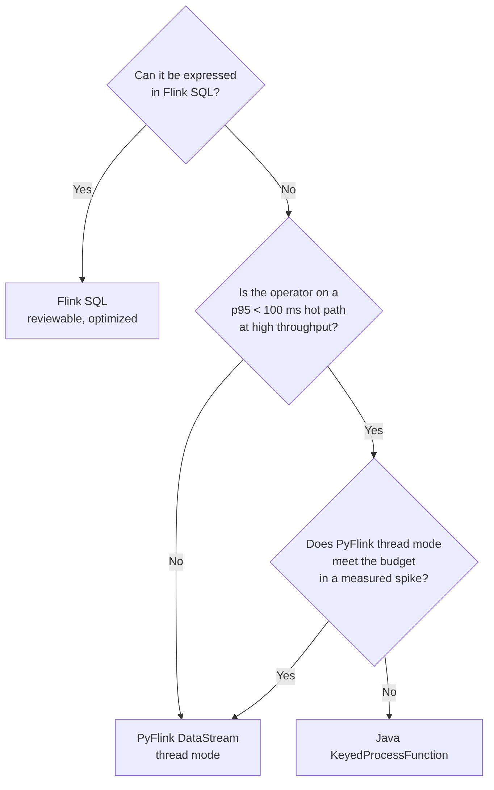

# 🐍 05 - PyFlink and the DataStream API

SQL takes you surprisingly far, until a feature needs three window ranges in one pass, a custom expiry rule, or a timer that fires when a user goes quiet. That is when you drop down to the **DataStream API** — and, as an ML engineer, you will be tempted to do it in Python. This note is about doing that with your eyes open: what PyFlink really executes, what each Python call costs, and when Java (or staying in SQL) is the better answer.

## 🎯 Learning Objectives
- Recognize the feature patterns that **do not fit Flink SQL** and need the DataStream API
- Build a `KeyedProcessFunction` with **keyed state** and **timers**
- Understand PyFlink's execution: **process mode** (Beam portability, gRPC) vs **thread mode** (embedded)
- Quantify Python overhead per record and the latency effect of **bundling**
- Implement multi-range velocity features in **one pass** with time buckets, and bound their error
- Package PyFlink correctly (image, versions, managed memory for Python)
- Decide between SQL, PyFlink, and Java for a latency-critical feature job

## Introduction

The DataStream API is Flink's lower-level programming model: you write the operators yourself. You choose how to key the stream, what state to keep and how to expire it, when to emit, and what to do with late data. Everything SQL does is built on these primitives, so nothing SQL can do is out of reach — but so is every bug the SQL planner was protecting you from.

**PyFlink** exposes both the Table API and the DataStream API to Python. For ML teams the appeal is obvious: the same language as the training code, direct access to NumPy and model libraries, and no JVM programming. The catch is architectural. Flink's runtime is a JVM; Python code has to run *somewhere* and exchange records with it. How that exchange happens decides whether a Python operator adds microseconds or tens of milliseconds to every event.

This note gives you the cost model, a production-shaped `KeyedProcessFunction` for P1's multi-range features (the "option C/B" of the previous note), and a decision rule.

---

## 1. The Problem and Why This Solution Exists

### What SQL cannot (comfortably) express

| Need | Why SQL struggles | DataStream answer |
|---|---|---|
| 10 min, 1 h, and 24 h features **in one pass** | One `OVER` window per `SELECT` | One per-user buffer, all ranges computed together |
| "Seconds since the previous payment" | Upper bound must be `CURRENT ROW`; `LAG` support varies by version | `ValueState<last_ts>` |
| Expire a user's state after 24 h of inactivity, but emit a "dormant" event | TTL cleans silently | **Timers** (`on_timer`) |
| Sequences ("3 declines then an approval within 2 min") | Pattern matching is limited in SQL (`MATCH_RECOGNIZE` exists but is rigid) | Explicit state machine or Flink CEP |
| Call a model inside the operator | UDFs exist, but control over batching is limited | Process function with micro-batching |

### Why Python is not free in Flink

Flink executes operators inside JVM TaskManagers. Historically, PyFlink ran Python user code in a **separate Python worker process** using Apache Beam's *portability framework*: records are serialized in the JVM, sent over gRPC to the Python process, deserialized, processed, serialized again, and sent back. To amortize that cost, records travel in **bundles**. Since Flink 1.15, a **thread mode** embeds the Python interpreter in the JVM process (via the PEMJA library), avoiding the inter-process hop.

---

## 2. Conceptual Deep Dive

### 2.1 KeyedProcessFunction: the universal operator

A `KeyedProcessFunction` receives each record of a keyed stream together with a `Context` that gives access to the current key's **state**, the current **timestamp/watermark**, and a **timer service**:

- `process_element(value, ctx)` — called per record. Read/update state, emit results, register timers.
- `on_timer(timestamp, ctx)` — called when a registered event-time or processing-time timer fires, for that key.

State is automatically scoped to the current key, partitioned and checkpointed exactly like SQL state (note 03). Timers are also part of the checkpointed state, so they survive failures.

### 2.2 Multi-range features in one pass: time buckets

Keeping every event of the last 24 hours per user is exact but expensive. A standard production technique is a **bucketed ring buffer**: keep per-user counters per time bucket of width $g$ (e.g., 1 minute), and compute any range by summing the buckets it covers.

For a range $R$ and bucket width $g$, the feature uses $\lceil R/g \rceil$ buckets. Memory per user and feature is:

$$
M_{\text{user}} = \left\lceil \frac{R_{\max}}{g} \right\rceil \cdot b_{\text{bucket}}
$$

and the boundary error is bounded by one bucket: events in the oldest partially-covered bucket may be counted although they are up to $g$ older than the range start:

$$
\big|\hat{f}_R(t) - f_R(t)\big| \le \text{events in } [\,t - R - g,\; t - R\,)
$$

A hybrid gives exactness where it matters: an **exact deque** for the short, model-critical range (10 min) and **1-minute buckets** for 1 h and 24 h, where an error of at most one minute is negligible. With 24 h at $g = 1$ min that is 1,440 small counters per active user — and only buckets with activity need to be stored (`MapState<bucket_id, (count, sum)>`).

⚠️ **Warning:** whatever approximation you choose online, the **offline training definition must use the same bucketing**. An approximate feature computed identically in both places is fine; an exact offline feature paired with an approximate online one is skew.

### 2.3 What a Python operator costs

Per record, a Python operator in process mode pays:

$$
T_{\text{py}} \approx \underbrace{T_{\text{ser}}^{\text{JVM}} + T_{\text{IPC}} + T_{\text{deser}}^{\text{py}}}_{\text{to Python}} + T_{\text{user}} + \underbrace{T_{\text{ser}}^{\text{py}} + T_{\text{IPC}} + T_{\text{deser}}^{\text{JVM}}}_{\text{back to JVM}}
$$

Bundling divides the IPC cost by the bundle size $B$, but a record may wait for its bundle to fill or for the bundle time limit $\tau_b$ to expire:

$$
T_{\text{wait}} \le \min\!\Big(\frac{B}{\lambda_{\text{subtask}}},\; \tau_b\Big)
$$

At low traffic per subtask, the time limit dominates: a large bundle time silently becomes a **latency floor**. The relevant options are `python.fn-execution.bundle.size` and `python.fn-execution.bundle.time`; check their defaults in your version and set them explicitly for latency-sensitive jobs.

| Mode | How Python runs | Per-record overhead | Notes |
|---|---|---|---|
| **Process** (default historically) | Separate worker process, Beam Fn API over gRPC | Highest; bundling hides it in throughput, not latency | Most compatible |
| **Thread** (`python.execution-mode: thread`) | Interpreter embedded in the TaskManager JVM | Much lower: no IPC hop | Check version/feature support; CPython only |
| Java/Scala operator | Native JVM | Lowest | Another language in the repo |

💡 **Tip:** measure, don't guess. The P1 spike runs the same features as SQL (option A) and as a PyFlink `KeyedProcessFunction` in thread mode (option C/B) at identical load, and compares the `flink` latency segment and CPU per event.

### 2.4 Vectorized UDFs for ML inside Flink

If you must run a model inside Flink, use **vectorized (Pandas) UDFs** in the Table API: they receive batches of rows as `pandas.Series`, so NumPy/ONNX inference is amortized across the batch. This is the right shape for heavier transforms (e.g., embedding text). For P1, inference stays **outside** Flink in a dedicated scorer — Flink computes features, the scorer serves the model — because that keeps model rollouts (MLflow aliases, shadow models) independent from the streaming job's lifecycle.

---

## 3. Production Reality

### Packaging

The Flink image does not ship Python. Build a derived image with a Python version supported by your PyFlink release and **exactly the same** `apache-flink` package version as the cluster. Mismatched versions fail in confusing ways (serialization errors, missing classes).

Python workers consume **managed memory** (the `PYTHON` consumer weight) alongside RocksDB. On a 1.2 GB TaskManager, adding Python operators means re-checking the memory budget (note 06).

### Choosing the language



Caso real: teams with Python-heavy ML staff often split responsibilities — data scientists define features in SQL or Python, and a platform team ports the two or three latency-critical operators to Java once a spike shows Python is the bottleneck. The P1 plan encodes the same idea: SQL first, PyFlink measured, Java documented as the escape hatch.

### Debugging

Python exceptions surface in TaskManager logs wrapped in Java stack traces; search for `Traceback`. Use `print` sparingly — at thousands of events per second, logging itself becomes the bottleneck. Unit-test the pure Python feature logic outside Flink (as the compression code below does) and keep the Flink wrapper thin.

---

## 4. Code in Practice

### A PyFlink image

```dockerfile
# Dockerfile.pyflink — Flink + matching PyFlink (pin both versions together)
FROM flink:2.0-java17
RUN apt-get update && apt-get install -y --no-install-recommends python3 python3-pip \
 && ln -s /usr/bin/python3 /usr/bin/python && rm -rf /var/lib/apt/lists/*
RUN pip3 install --no-cache-dir "apache-flink==2.0.*"   # must match the cluster version exactly
# Kafka connector JAR matching this Flink version goes into /opt/flink/lib/
COPY jars/flink-sql-connector-kafka-*.jar /opt/flink/lib/
```

### Multi-range features with a KeyedProcessFunction

```python
# features_job.py — option C/B of the P1 spike (PyFlink DataStream, thread mode)
import json
from pyflink.common import Types, WatermarkStrategy, Configuration
from pyflink.common.serialization import SimpleStringSchema
from pyflink.datastream import StreamExecutionEnvironment
from pyflink.datastream.connectors.kafka import (
    KafkaSource, KafkaOffsetsInitializer, KafkaSink, KafkaRecordSerializationSchema)
from pyflink.datastream.functions import KeyedProcessFunction, RuntimeContext
from pyflink.datastream.state import ListStateDescriptor, MapStateDescriptor, ValueStateDescriptor

from fraud_features import VelocityState  # pure-Python logic, unit-tested outside Flink

class VelocityFeatures(KeyedProcessFunction):
    def open(self, ctx: RuntimeContext):
        self.recent = ctx.get_list_state(ListStateDescriptor("recent_10m", Types.PICKLED_BYTE_ARRAY()))
        self.buckets = ctx.get_map_state(MapStateDescriptor("min_buckets", Types.LONG(), Types.PICKLED_BYTE_ARRAY()))
        self.last_ts = ctx.get_state(ValueStateDescriptor("last_ts", Types.DOUBLE()))

    def process_element(self, raw, ctx):
        e = json.loads(raw)
        now = ctx.timer_service().current_processing_time() / 1000.0
        st = VelocityState.load(list(self.recent.get() or []), dict(self.buckets.items()), self.last_ts.value())
        feats = st.update(now, e["amount"])              # exact 10 m + bucketed 1 h / 24 h + secs_since_last
        recent, buckets, last = st.dump()
        self.recent.update(recent)
        self.buckets.clear(); self.buckets.put_all(buckets.items())
        self.last_ts.update(last)
        # wake up after 24 h of inactivity to drop the user's state (and optionally emit "dormant")
        ctx.timer_service().register_processing_time_timer(int((now + 86_400) * 1000))
        yield json.dumps({**e, **feats})

    def on_timer(self, timestamp, ctx):
        last = self.last_ts.value()
        if last is not None and timestamp / 1000.0 - last >= 86_400:
            self.recent.clear(); self.buckets.clear(); self.last_ts.clear()

config = Configuration()
config.set_string("python.execution-mode", "thread")   # embedded interpreter, no gRPC hop
env = StreamExecutionEnvironment.get_execution_environment(config)
env.set_parallelism(2)

source = (KafkaSource.builder().set_bootstrap_servers("kafka:29092").set_topics("payments")
          .set_group_id("flink-features-py").set_starting_offsets(KafkaOffsetsInitializer.latest())
          .set_value_only_deserializer(SimpleStringSchema()).build())
sink = (KafkaSink.builder().set_bootstrap_servers("kafka:29092")
        .set_record_serializer(KafkaRecordSerializationSchema.builder()
            .set_topic("payments-enriched").set_value_serialization_schema(SimpleStringSchema()).build())
        .build())

(env.from_source(source, WatermarkStrategy.no_watermarks(), "payments")
    .key_by(lambda raw: json.loads(raw)["user_id"], key_type=Types.STRING())
    .process(VelocityFeatures(), output_type=Types.STRING())
    .uid("velocity-features")                           # stable UID for savepoints (note 03)
    .sink_to(sink))
env.execute("p1-velocity-features-pyflink")
```

⚠️ **Warning:** parsing JSON twice (once in `key_by`, once in `process_element`) doubles the deserialization cost — in a real job, parse once in a `map` before `key_by` and carry a typed row. It is left visible here to make the cost obvious.

💡 **Tip:** API names in PyFlink evolve between releases (state descriptors, connector builders). Check the PyFlink API reference for your pinned version before copying.

### 📦 Compression code: one-pass multi-range features with bounded error

```python
# 📦 Compression code: exact 10-min deque + 1-min buckets for 1 h, with an error check vs exact
# Covers: keyed state as plain data, bucketed ring buffer, boundary error bound
import random
from collections import deque

G = 60  # bucket width (s)

class VelocityState:
    def __init__(self):
        self.recent, self.buckets, self.last = deque(), {}, None   # exact 10 m, {minute: count}

    def update(self, t: float, amount: float) -> dict:
        self.recent.append((t, amount))
        while self.recent[0][0] < t - 600:
            self.recent.popleft()
        b = int(t // G)
        self.buckets[b] = self.buckets.get(b, 0) + 1
        for old in [k for k in self.buckets if k < b - 60]:    # keep 61 buckets ≈ 1 h + g
            del self.buckets[old]
        cnt_1h = sum(c for k, c in self.buckets.items() if k >= int((t - 3600) // G))
        since = None if self.last is None else t - self.last
        self.last = t
        return {"f_cnt_10m": len(self.recent), "f_cnt_1h": cnt_1h, "f_secs_since_last": since}

random.seed(1)
ts = sorted(random.uniform(0, 7200) for _ in range(400))   # one user's payments over 2 h
st, max_err = VelocityState(), 0
for i, t in enumerate(ts):
    f = st.update(t, 10.0)
    exact_1h = sum(1 for x in ts[: i + 1] if x >= t - 3600)
    max_err = max(max_err, f["f_cnt_1h"] - exact_1h)
print(f"last features: {f}")
print(f"max overcount on 1 h feature: {max_err} event(s) (bounded by events in one {G}s bucket)")
# ¡Sorpresa! The 1 h feature can over-count slightly — fine IF training uses the same bucketing.
```

---

## 🎯 Key Takeaways
- Use the DataStream API when features need **multiple ranges in one pass, timers, or custom state machines** — not by default.
- A `KeyedProcessFunction` gives per-key **state** and **timers**, checkpointed like SQL state.
- **Bucketed ring buffers** compute many ranges in one pass with bounded error — the offline definition must bucket identically.
- PyFlink **process mode** pays serialization + gRPC per record and hides it with **bundling**, which can become a latency floor.
- **Thread mode** embeds Python in the JVM and removes the IPC hop — measure it in a spike before committing.
- Keep model inference **outside** Flink unless batching (vectorized UDFs) and lifecycle coupling are acceptable.
- Pin PyFlink to the exact cluster version, budget managed memory for Python, and keep feature logic unit-testable outside Flink.

## References
- Apache Flink — *Python API* (PyFlink) docs: DataStream API, execution mode, configuration (`python.execution-mode`, bundle options)
- Apache Flink — *Process Function* and *Working with State* (DataStream docs)
- FLIP-206: Support PyFlink Runtime Execution in Thread Mode
- Apache Beam — *Fn API / portability framework* design docs
- [[04 - Flink SQL for Real-time Features|Previous: Flink SQL for Real-time Features]] · [[06 - Operating Flink on a Laptop|Next: Operating Flink on a Laptop]]
