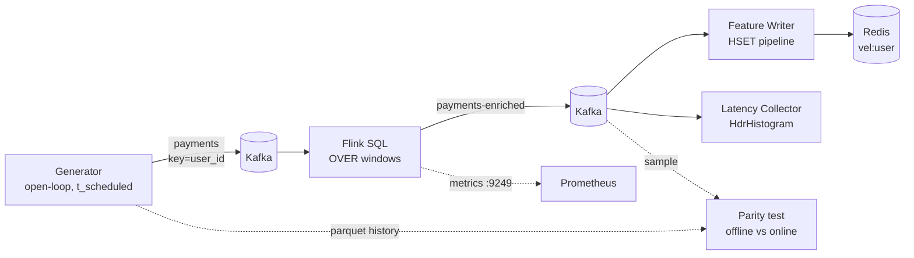

# 🏁 07 - Capstone — Kafka → Flink → Redis Feature Pipeline

Everything in this course converges here: a load generator publishes payments to Kafka, Flink SQL computes per-event velocity features, an idempotent writer lands the latest features in Redis, and a measurement harness tells you — with percentiles, not vibes — how fresh those features are. This pipeline is the feature layer of **P1 — Real-time Fraud Detection Platform**; P1 adds the model, the scorer, and the MLOps loop on top.

## 🎯 Learning Objectives
- Assemble a reproducible Kafka (KRaft) + Flink + Redis stack that fits an **8 GB laptop**
- Generate **open-loop** load with scheduled timestamps to avoid coordinated omission
- Deploy a **Flink SQL** feature job with `OVER` windows and a statement set
- Write features to Redis **idempotently** and enrich events in a Kafka topic
- Measure **feature latency** (p50/p95/p99) end to end and per segment
- Prove online/offline **feature parity** with an automated test
- Run the **buffer-timeout sweep (E3)** and a **TaskManager failure test** and interpret both

## Introduction

A feature pipeline is only as good as the evidence that it is correct and fast. "It runs" is not evidence. This capstone builds the pipeline *and* the instruments around it: a generator that knows when each event was supposed to be sent, a collector that measures how long features took to appear, a parity test that compares streaming output against an offline computation of the same definition, and two experiments that turn configuration choices from notes 02–06 into charts.

The design decisions come straight from the course: processing-time `OVER` windows on the hot path (note 02), at-least-once delivery with idempotent sinks (note 03), SQL features with a statement set (note 04), and the laptop memory/latency profile (note 06). If any piece feels unfamiliar, the note it came from is linked in the section.



---

## 1. Project Layout

```text
flink-feature-capstone/
├── docker-compose.yml          # kafka, kafka-init, jobmanager, taskmanager, redis, prometheus
├── flink/
│   ├── Dockerfile              # flink:2.x + Kafka SQL connector JAR in lib/
│   ├── conf/config.yaml        # laptop profile (note 06)
│   └── sql/features.sql        # sources, sinks, statement set
├── generator/generate.py       # open-loop producer + --offline parquet history
├── writer/feature_writer.py    # payments-enriched → Redis (idempotent)
├── latency/collector.py        # end-to-end percentiles
├── tests/test_parity.py        # online vs offline feature parity
└── Makefile                    # up, job, load, sweep, chaos, parity
```

⚠️ **Warning:** pin **three** versions together: the Flink image, the Kafka SQL connector JAR built for that Flink version, and (if used) PyFlink. Most "it doesn't start" problems in this capstone are version mismatches.

---

## 2. Infrastructure

```yaml
# docker-compose.yml (excerpt) — total ≈ 3.3 GB of container limits
services:
  kafka:            # KRaft single node, heap 512m — see note 01 for the full env block
    image: apache/kafka:3.9.0
    mem_limit: 850m
  kafka-init:
    image: apache/kafka:3.9.0
    depends_on: [kafka]
    entrypoint: ["/bin/sh", "-c"]
    command: |
      "/opt/kafka/bin/kafka-topics.sh --bootstrap-server kafka:29092 --create --if-not-exists \
         --topic payments --partitions 4 --config retention.ms=3600000 &&
       /opt/kafka/bin/kafka-topics.sh --bootstrap-server kafka:29092 --create --if-not-exists \
         --topic payments-enriched --partitions 4 --config retention.ms=3600000 \
         --config message.timestamp.type=LogAppendTime"
  jobmanager:
    build: ./flink
    command: jobmanager
    ports: ["8081:8081"]
    volumes: ["./flink/conf/config.yaml:/opt/flink/conf/config.yaml:ro", "ckpt:/flink-checkpoints"]
    mem_limit: 650m
  taskmanager:
    build: ./flink
    command: taskmanager
    volumes: ["./flink/conf/config.yaml:/opt/flink/conf/config.yaml:ro", "ckpt:/flink-checkpoints"]
    mem_limit: 1250m
  redis:
    image: redis:7-alpine
    command: ["redis-server", "--maxmemory", "256mb", "--maxmemory-policy", "noeviction", "--save", "", "--appendonly", "no"]
    mem_limit: 200m
  prometheus:
    image: prom/prometheus:latest
    volumes: ["./prometheus.yml:/etc/prometheus/prometheus.yml:ro"]
    mem_limit: 350m
volumes: { ckpt: {} }
```

💡 **Tip:** `message.timestamp.type=LogAppendTime` on `payments-enriched` makes the broker stamp each enriched record when it is appended — a server-side clock you can use to measure the Flink segment without trusting producer clocks.

---

## 3. Load Generator (open loop)

The generator schedules each event on a fixed timeline and sends it at that moment **without waiting** for the previous send. Latency is later measured from `t_scheduled`, so a stalled pipeline cannot hide its own slowness (coordinated omission).

```python
# generator/generate.py (core loop)
import argparse, os, random, time, uuid
import orjson
from confluent_kafka import Producer

def run(rate: int, duration: int, users: int, seed: int):
    rnd = random.Random(seed)
    p = Producer({"bootstrap.servers": os.getenv("KAFKA", "localhost:9092"),
                  "linger.ms": 1, "compression.type": "lz4", "acks": 1})
    interval_ns = int(1e9 / rate)
    start = time.perf_counter_ns() + 50_000_000          # small warm-up offset
    for i in range(rate * duration):
        t_sched = start + i * interval_ns
        while (now := time.perf_counter_ns()) < t_sched:  # spin-wait until the scheduled moment
            pass
        uid = f"u_{int(rnd.paretovariate(1.2)) % users:06d}"   # skewed activity: few heavy users
        evt = {"payment_id": str(uuid.uuid4()), "user_id": uid,
               "amount": round(rnd.lognormvariate(3.0, 1.0), 2),
               "country": rnd.choice(["CO", "CO", "CO", "MX", "US"]),
               "event_time": time.strftime("%Y-%m-%dT%H:%M:%S", time.gmtime()) + "Z",
               "t_scheduled_ns": time.time_ns() - (now - t_sched)}   # wall-clock of the schedule
        p.produce("payments", key=uid, value=orjson.dumps(evt))
        if i % 1000 == 0:
            p.poll(0)
    p.flush()
```

⚠️ **Warning:** one Python process tops out at some rate on your CPU. If `gen_lag = t_sent - t_scheduled` grows, the **generator** is the bottleneck and the run is invalid — add generator processes (each owning a subset of users), don't report the number.

---

## 4. The Flink SQL Job

```sql
-- flink/sql/features.sql
SET 'execution.runtime-mode' = 'streaming';
SET 'pipeline.name' = 'capstone-velocity-features';

CREATE TABLE payments (
  payment_id STRING, user_id STRING, amount DOUBLE, country STRING,
  event_time TIMESTAMP_LTZ(3), t_scheduled_ns BIGINT,
  proc_time AS PROCTIME()
) WITH ('connector'='kafka', 'topic'='payments',
        'properties.bootstrap.servers'='kafka:29092', 'properties.group.id'='capstone-features',
        'scan.startup.mode'='latest-offset', 'format'='json',
        'json.timestamp-format.standard'='ISO-8601');

CREATE TABLE payments_enriched (
  payment_id STRING, user_id STRING, amount DOUBLE, country STRING, t_scheduled_ns BIGINT,
  f_cnt_10m BIGINT, f_sum_10m DOUBLE, f_max_10m DOUBLE, f_small_tx_cnt_10m BIGINT
) WITH ('connector'='kafka', 'topic'='payments-enriched',
        'properties.bootstrap.servers'='kafka:29092', 'format'='json',
        'sink.delivery-guarantee'='at-least-once');

INSERT INTO payments_enriched
SELECT payment_id, user_id, amount, country, t_scheduled_ns,
       COUNT(*) OVER w, SUM(amount) OVER w, MAX(amount) OVER w,
       COUNT(*) FILTER (WHERE amount < 2.0) OVER w
FROM payments
WINDOW w AS (PARTITION BY user_id ORDER BY proc_time
             RANGE BETWEEN INTERVAL '10' MINUTE PRECEDING AND CURRENT ROW);
```

```bash
docker compose cp flink/sql/features.sql jobmanager:/tmp/features.sql
docker compose exec jobmanager ./bin/sql-client.sh -f /tmp/features.sql
# Web UI → Running Jobs → the graph should show Source → OverAggregate → Sink with a hash exchange
```

---

## 5. Idempotent Feature Writer

```python
# writer/feature_writer.py
import os
import orjson, redis
from confluent_kafka import Consumer

r = redis.Redis(host=os.getenv("REDIS", "localhost"), decode_responses=True)
c = Consumer({"bootstrap.servers": os.getenv("KAFKA", "localhost:9092"),
              "group.id": "feature-writer", "enable.auto.commit": False,
              "auto.offset.reset": "latest"})
c.subscribe(["payments-enriched"])

while True:
    msgs = c.consume(num_messages=500, timeout=0.05)     # micro-batch: ≤500 msgs or 50 ms
    if not msgs:
        continue
    pipe = r.pipeline(transaction=False)
    for m in msgs:
        if m.error():
            continue
        e = orjson.loads(m.value())
        # ✅ HSET is idempotent: replaying the same record writes the same values
        pipe.hset(f"vel:{e['user_id']}", mapping={
            "f_cnt_10m": e["f_cnt_10m"], "f_sum_10m": e["f_sum_10m"],
            "f_small_tx_cnt_10m": e["f_small_tx_cnt_10m"], "last_payment_id": e["payment_id"]})
        pipe.expire(f"vel:{e['user_id']}", 86_400)
    pipe.execute()                                       # one round-trip per batch
    c.commit(asynchronous=False)                         # commit AFTER the write → at-least-once
```

⚠️ **Warning:** a replayed *older* record could overwrite a newer one if partitions were reordered. Here each user lives in one partition (key = `user_id`), so per-user order holds. If you ever lose that guarantee, store and compare a monotonic field (e.g., `t_scheduled_ns`) before writing — a tiny Lua script does it atomically.

---

## 6. Measuring Feature Latency

```python
# latency/collector.py — end-to-end (scheduled → appended to payments-enriched)
import os, time
import orjson
from confluent_kafka import Consumer
from hdrh.histogram import HdrHistogram

h = HdrHistogram(1, 60_000, 3)                      # 1 ms .. 60 s, 3 significant digits
c = Consumer({"bootstrap.servers": os.getenv("KAFKA", "localhost:9092"),
              "group.id": f"latency-{int(time.time())}", "auto.offset.reset": "latest"})
c.subscribe(["payments-enriched"])
deadline = time.time() + int(os.getenv("SECONDS", "180"))
while time.time() < deadline:
    for m in c.consume(num_messages=1000, timeout=0.1):
        if m.error():
            continue
        _, append_ms = m.timestamp()                 # LogAppendTime set by the broker
        e = orjson.loads(m.value())
        h.record_value(max(1, append_ms - e["t_scheduled_ns"] // 1_000_000))
for q in (50, 95, 99):
    print(f"p{q} = {h.get_value_at_percentile(q)} ms")
print(f"count = {h.get_total_count()}")
```

💡 **Tip:** discard the first 60 s of every load step (JIT warm-up, RocksDB caches, consumer group joins) and report **three repetitions** per step, as P1's measurement protocol requires.

---

## 7. Feature Parity Test

The streaming job and the training pipeline must agree. The test replays a recorded sample through the running job and recomputes the same feature offline from the generator's history, then compares row by row.

```python
# tests/test_parity.py (core) — offline definition mirrors the SQL exactly
import pandas as pd

def offline_cnt_10m(history: pd.DataFrame) -> pd.Series:
    """RANGE 10 min PRECEDING AND CURRENT ROW, per user, including the current payment."""
    h = history.sort_values("ts").set_index("ts")
    return (h.groupby("user_id")["amount"]
             .rolling("600s", closed="both").count()
             .reset_index(level=0, drop=True).astype(int))

def assert_parity(online: pd.DataFrame, offline: pd.Series, tolerance: float = 0.0):
    merged = online.set_index("payment_id").join(offline.rename("offline_cnt"), how="inner")
    mismatch = (merged["f_cnt_10m"] - merged["offline_cnt"]).abs() > tolerance
    rate = mismatch.mean()
    assert rate <= 0.001, f"parity broken: {rate:.2%} of rows differ"
```

⚠️ **Warning — processing time vs event time:** the online job orders by `proc_time`; the offline computation uses event timestamps. They agree when per-user order is preserved and processing delay is small relative to the window — that is exactly the assumption the test checks. Under heavy backpressure the mismatch rate rises; the test turns that hidden skew into a number.

---

## 8. Experiments

### E3 — buffer-timeout sweep

| Run | `execution.buffer-timeout` | Steps (ev/s) | Reps |
|-----|----------------------------|--------------|------|
| a   | 100 ms (default)           | 1k, 2k, 5k   | 3    |
| b   | 10 ms                      | 1k, 2k, 5k   | 3    |
| c   | 1 ms                       | 1k, 2k, 5k   | 3    |

Record p50/p95/p99 and TaskManager CPU per step. Expected: the biggest p95 improvement from (a) to (b) at **low** load; diminishing returns at higher load; CPU rising at (c). Plot p95 vs rate, one line per run.

### F1 — kill the TaskManager

```bash
make load RATE=2000 DURATION=300 &        # steady load
sleep 60 && docker compose kill taskmanager && sleep 5 && docker compose up -d taskmanager
```

Observe in the web UI: the job restarts from the last checkpoint, the source rewinds, Kafka lag spikes then drains. Verify:
- **Lost events: 0** — every `payment_id` produced appears in `payments-enriched`.
- **Duplicates: > 0 but harmless** — replayed records appear twice in the topic; Redis holds the same final values (idempotent `HSET`).
- **Recovery time** ≈ restart + catch-up, consistent with note 03's formula.

### Results template

| Config | Rate (ev/s) | p50 (ms) | p95 (ms) | p99 (ms) | TM CPU | Notes |
|--------|-------------|----------|----------|----------|--------|-------|
| E3-a   | 2,000       |          |          |          |        | default buffers |
| E3-b   | 2,000       |          |          |          |        |  |
| E3-c   | 2,000       |          |          |          |        |  |

Hardware: i5-10300H (4C/8T), 8 GB RAM, Docker Desktop on WSL2 (`memory=5GB`) — always state it next to the numbers.

---

## 9. From Capstone to P1

| Capstone piece | What P1 adds |
|---|---|
| `payments-enriched` | Profile features from Redis + an **XGBoost/ONNX scorer** publishing `APPROVE/REVIEW/BLOCK` |
| Feature Writer | Long-range features (1 h, 24 h) via the strategy chosen in the spike (note 05) |
| Latency collector | Full segment breakdown (generator, Kafka, Flink, scorer) and the CV headline number |
| Parity test | Runs in CI on every change to features |
| E3, F1 | Full experiment matrix (E1–E10) and failure catalog (F1–F10) |

### 📦 Compression code: the parity check, standalone

```python
# 📦 Compression code: online (streaming-style) vs offline (pandas) feature parity
# Covers: OVER RANGE semantics incl. current row, pandas rolling closed='both', mismatch rate
import random
from collections import defaultdict, deque
import pandas as pd

random.seed(3)
rows = []
t = 0.0
for i in range(5000):
    t += random.expovariate(5)                      # ~5 events/s overall
    rows.append({"payment_id": f"p{i}", "user_id": f"u{random.randint(0, 49)}",
                 "ts": pd.Timestamp("2026-10-05") + pd.Timedelta(seconds=t), "amount": 10.0})
hist = pd.DataFrame(rows)

# "Online": per-user deque, emits one row per event (what the Flink OVER window does)
buf, online = defaultdict(deque), []
for r in rows:
    q = buf[r["user_id"]]
    q.append(r["ts"])
    while q[0] < r["ts"] - pd.Timedelta(seconds=600):
        q.popleft()
    online.append({"payment_id": r["payment_id"], "f_cnt_10m": len(q)})
online = pd.DataFrame(online)

# "Offline": the training definition
h = hist.sort_values("ts").set_index("ts")
offline = (h.groupby("user_id")["amount"].rolling("600s", closed="both").count()
            .reset_index().merge(hist[["ts", "user_id", "payment_id"]], on=["ts", "user_id"])
            .set_index("payment_id")["amount"].astype(int))
merged = online.set_index("payment_id").join(offline.rename("offline"))
print(f"rows compared: {len(merged)}, mismatch rate: {(merged.f_cnt_10m != merged.offline).mean():.4%}")
# ¡Sorpresa! Change closed="both" to the default (right-closed) and the boundary events start to disagree.
```

---

## 🎯 Key Takeaways
- A credible feature pipeline ships with **instruments**: open-loop load, percentile latency, and a parity test.
- **Open-loop** generation with `t_scheduled` prevents coordinated omission; invalidate runs where the generator lags.
- Processing-time `OVER` windows + `user_id`-keyed partitions give per-event features with minimal latency.
- **At-least-once + idempotent `HSET`** survives TaskManager failures with zero loss and harmless duplicates.
- Broker `LogAppendTime` provides a trustworthy server-side clock for the Flink segment.
- **E3** turns the buffer-timeout discussion into a chart; **F1** turns fault-tolerance theory into measured recovery.
- The capstone is P1's feature layer — P1 adds profiles, the scorer, and the model lifecycle.

## References
- [[00 - Welcome to Apache Flink for Real-time ML|Course welcome]] · [[02 - Time, Watermarks and Windows|02 Time]] · [[03 - State, Checkpoints and Exactly-Once|03 State]] · [[04 - Flink SQL for Real-time Features|04 SQL]] · [[06 - Operating Flink on a Laptop|06 Operations]]
- [[../47 - Stream Processing Engines Compared/00 - Welcome to Stream Processing Engines Compared|Next course: Stream Processing Engines Compared]]
- Gil Tene, *How NOT to Measure Latency* (talk) — coordinated omission and HdrHistogram
- Apache Flink — Kafka SQL connector, OVER aggregation, checkpointing docs
- confluent-kafka-python and redis-py documentation
