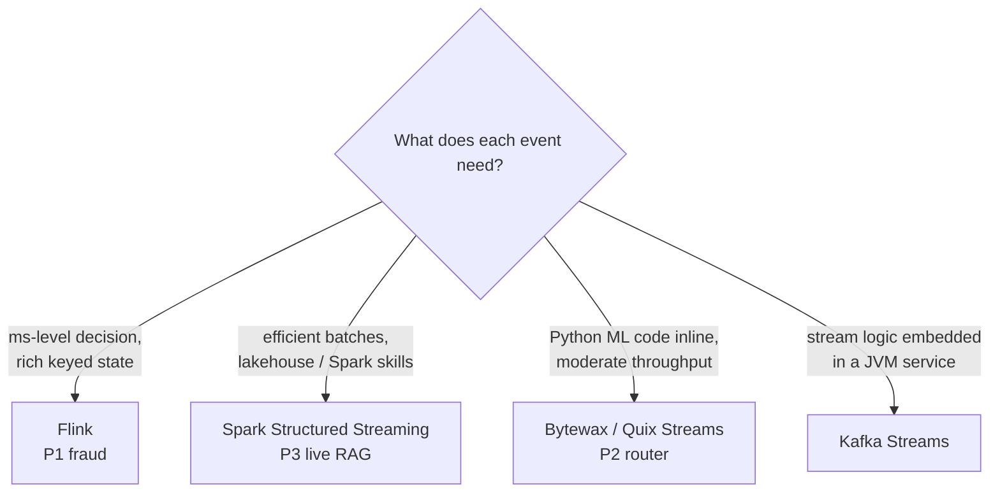

# ⚖️ Welcome — Stream Processing Engines Compared

"Which streaming engine should we use?" is one of the most common system-design questions in ML interviews, and "Flink, because it's the fastest" is one of the most common wrong answers. The right answer depends on what the pipeline does with each event: a fraud scorer needs milliseconds, a RAG indexer needs efficient batches for embeddings, and a message router needs to live next to Python ML code. This course compares the engines **by measuring the same pipeline on each**.

## 🎯 Learning Objectives
- Explain the **execution models**: per-event (Flink), micro-batch (Spark), and Python-native dataflows (Bytewax, Quix Streams, Faust), plus library-style Kafka Streams
- Use **Spark Structured Streaming** where micro-batches are an advantage: `foreachBatch`, batched embeddings, idempotent upserts
- Build stateful pipelines in **Python-native** engines and know their operational limits
- Run a **controlled lab**: the same Kafka → windowed features → Redis pipeline on three engines, comparing p95, throughput, CPU, and code size
- Defend an engine choice with a **decision framework** in a system-design interview

## Introduction

The previous course, [[../46 - Apache Flink for Real-time ML/00 - Welcome to Apache Flink for Real-time ML|Apache Flink for Real-time ML]], went deep on one engine. This one goes wide. Each engine embodies a different bet: Flink bets on a dedicated per-event runtime with rich state; Spark bets on reusing a batch engine with small batches; Python-native engines bet that staying in the ML team's language matters more than raw speed; Kafka Streams bets that stream processing should be a library inside your service, not a cluster.

None of these bets is wrong — each is right for some workloads. The three portfolio projects use **one engine each, on purpose**: P1 (fraud, p95 ≤ 80 ms) uses Flink; P2 (support-message router, Python ML models) uses Bytewax; P3 (live RAG indexing, embedding batches) uses Spark Structured Streaming. The lab in note 04 provides the measured evidence behind those choices.

---

## Course Map

| #  | Note                                                          | Core question                                                       |
|----|---------------------------------------------------------------|---------------------------------------------------------------------|
| 01 | Execution Models                                              | Where does latency come from in each engine?                        |
| 02 | Spark Structured Streaming for ML Ingestion                   | When are micro-batches the *right* tool?                            |
| 03 | Python-Native Streaming - Bytewax, Quix Streams, Faust and Kafka Streams | What do you gain and lose by staying in Python (or in a library)? |
| 04 | Lab - Same Pipeline Three Engines                             | What do the numbers say on an 8 GB laptop?                          |
| 05 | Decision Framework and Interview Playbook                     | How do you choose — and defend the choice?                          |

## Prerequisites
- [[../46 - Apache Flink for Real-time ML/02 - Time, Watermarks and Windows|Time, watermarks and windows]] and [[../46 - Apache Flink for Real-time ML/03 - State, Checkpoints and Exactly-Once|state and checkpoints]]
- [[../27 - Apache Spark for ML/04 - Structured Streaming|Spark Structured Streaming basics]] (output modes, triggers, Delta sinks)
- [[../../09 - MLOps y Produccion/40 - Real-time ML Systems/01 - Streaming Feature Engineering - Kafka, Faust-Bytewax, and Online Aggregations|Bytewax basics]]

⚠️ **Version note:** streaming engines evolve fast — new low-latency modes in Spark, maintenance changes in Python projects, API renames in Flink 2.x. Every claim in this course that depends on a version is marked; re-verify before an interview or a production decision.

## References
- Akidau, Chernyak, Lax — *Streaming Systems* (O'Reilly, 2018)
- Zaharia et al., *Discretized Streams* (SOSP 2013) · Armbrust et al., *Structured Streaming* (SIGMOD 2018)
- Carbone et al., *Apache Flink: Stream and Batch Processing in a Single Engine* (2015)
