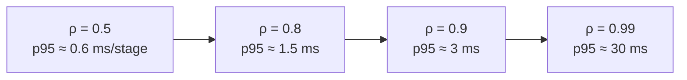

# ⚙️ 01 - Execution Models

Two engines can run the "same" windowed count over the same Kafka topic and differ by two orders of magnitude in latency — not because one is badly written, but because they **execute** the stream differently. Before comparing benchmarks, you need a model that predicts them: where each engine makes an event wait, what it costs per batch or per record, and what happens as load approaches capacity.

## 🎯 Learning Objectives
- Describe the execution model of **Flink, Spark Structured Streaming, Kafka Streams, Bytewax, Quix Streams, and Faust**
- Derive the **stability condition** of a micro-batch engine and the minimum feasible trigger interval
- Use basic **queueing theory** to explain why tail latency explodes near saturation in any engine
- Compare how each engine stores **state** and achieves **fault tolerance**
- Compare **delivery guarantees** and what they cost
- Predict, before measuring, which engine will win on latency, throughput, and operational cost for a given workload

## Introduction

A stream processor does three things repeatedly: **acquire** records (poll the source), **compute** (update state, evaluate windows, call code), and **emit** (write to sinks, commit progress). Execution models differ in how they group those steps. Flink pipelines records continuously through long-running operators; Spark groups them into micro-batches and runs a small job per batch; library-style engines (Kafka Streams, Quix Streams, Faust) run a consume–process–produce loop inside your application; Bytewax runs a dataflow on a Rust runtime driven from Python.

The grouping determines the **latency floor** (the minimum delay even at zero load), the **per-record cost** (which caps throughput), and the **failure model** (what is replayed after a crash). Everything else — APIs, SQL support, connectors — is secondary for the first decision.

The goal of this note is that, given a workload description, you can *predict* the lab results of note 04 within a factor of two.

---

## 1. The Problem and Why This Solution Exists

### Different origins, different bets

| Engine | Origin | Core bet |
|---|---|---|
| **Flink** | Stratosphere research (TU Berlin), Apache 2014 | A dedicated **per-event** dataflow runtime with first-class state and event time |
| **Spark Structured Streaming** | Spark Streaming (DStreams, 2013) → Structured Streaming (2016) | Reuse the **batch** engine; a stream is an unbounded table processed **incrementally in micro-batches** |
| **Kafka Streams** | Confluent, 2016 | Stream processing as a **library** inside the application; Kafka is the cluster |
| **Faust** | Robinhood, 2018 (community fork `faust-streaming` later) | Kafka Streams ideas in **Python asyncio** |
| **Bytewax** | 2021 | Python API on a **Rust** dataflow runtime (Timely Dataflow) |
| **Quix Streams** | 2023 (v2 rewrite) | A pure-Python, Kafka-native library with **local RocksDB state** and changelog topics |

The diversity exists because latency, throughput, operability, and language fit trade off against each other. No model wins all four.

---

## 2. Conceptual Deep Dive

### 2.1 Per-event pipelining (Flink, and Kafka Streams per partition)

Each record flows through chained operators as soon as it is read; across network shuffles it waits at most the buffer timeout (Flink) or the producer linger time (Kafka Streams, where repartitioning goes through an internal Kafka topic):

$$
L_{\text{per-event}} \approx T_{\text{poll}} + \sum_{\text{ops}} T_{\text{op}} + \sum_{\text{hops}} T_{\text{buffer}} + T_{\text{sink}}
$$

The floor at low load is a few milliseconds when buffers flush fast. Note one important difference: a Kafka Streams repartition **writes to and reads from a Kafka topic**, so each `groupBy` with a key change adds a full broker round trip — cheaper to operate, slower than an in-memory network shuffle.

### 2.2 Micro-batching (Spark Structured Streaming)

A trigger fires every $T$ seconds (`processingTime`). The engine plans and runs a job over the records that arrived since the last batch. If the batch processing time $P$ has a fixed overhead $o$ (planning, scheduling, state store commit, offset log write) and a per-record cost $c$:

$$
P(\lambda) = o + c \cdot \lambda T
$$

The stream is **stable** only if each batch finishes before the next trigger:

$$
o + c\,\lambda T < T
\quad\Longleftrightarrow\quad
T > \frac{o}{1 - c\lambda}
$$

This gives the **minimum feasible trigger interval** for a given load. With $o = 150$ ms and $c\lambda = 0.3$ (records take 30% of wall time), $T_{\min} \approx 214$ ms. Smaller triggers are not "faster" — they fall behind and latency grows without bound. And the latency of a stable micro-batch engine is roughly:

$$
\mathbb{E}[L_{\text{micro}}] \approx \frac{T}{2} + P(\lambda) \qquad L^{\max}_{\text{micro}} \approx T + P(\lambda)
$$

The fixed overhead $o$ is why Spark's practical latency floor sits in the hundreds of milliseconds, and also why micro-batches are **efficient**: $o$ is amortized across every record of the batch, and operations that benefit from batching (vectorized UDFs, GPU embedding calls, bulk upserts) get large batches for free.

💡 **Tip — newer Spark modes:** Spark has offered an experimental *continuous processing* trigger since 2.3 (limited operators, at-least-once), and Databricks has announced a *real-time mode* for Structured Streaming aimed at millisecond latencies. Check what your Spark version and platform actually support before assuming the micro-batch floor applies — and before assuming it doesn't.

### 2.3 Consume–process–produce loops (Kafka Streams, Quix Streams, Faust)

Library engines run inside your process: poll a batch of records from the assigned partitions, process each (updating local state), produce results, and periodically commit. Latency is per record plus poll/commit cadence; parallelism is **the number of partitions**, distributed across application instances by Kafka's consumer-group protocol. There is no separate cluster to operate — the trade-off is that scaling, rebalancing, and state restoration happen inside your application.

For Python libraries, CPU per record is the limit: one process runs one interpreter, and the GIL prevents parallel Python execution within it. Throughput scales by adding **processes** (each a consumer in the group), up to the partition count.

### 2.4 Python on a Rust dataflow (Bytewax)

Bytewax builds a dataflow graph in Python; the runtime (based on Timely Dataflow, Rust) schedules it across workers and processes, exchanges data between workers for keyed operations, and calls back into Python for each operator's logic. Progress is tracked in **epochs**; recovery snapshots operator state per epoch. The Python callback cost dominates per record, so it behaves like a per-event engine with a Python-sized per-record cost.

### 2.5 Saturation: why every engine's tail explodes

Treat a pipeline stage as a queue with arrival rate $\lambda$ and service rate $\mu$. For the simplest model (M/M/1), utilization is $\rho = \lambda/\mu$ and the time in system is exponentially distributed with rate $\mu - \lambda$:

$$
\mathbb{E}[W] = \frac{1}{\mu - \lambda}
\qquad
W_{p95} = \frac{\ln 20}{\mu - \lambda} \approx \frac{3}{\mu - \lambda}
$$

At $\mu = 10{,}000$ ev/s, going from $\rho = 0.5$ to $\rho = 0.9$ multiplies the p95 by **5**; at $\rho = 0.99$, by **50**. Real pipelines are not M/M/1, but the shape holds: **latency targets must be met with headroom**. That is why P1 defines sustained throughput as the highest rate where p95 stays under target *and* lag is stable — not the rate at which the engine merely survives.



*Per-stage p95 under M/M/1 with μ = 10k ev/s. Multiply across stages and add buffering — the knee is where SLOs die.*

### 2.6 State and fault tolerance by engine

| Engine | Where state lives | How it survives failures | Restore cost |
|---|---|---|---|
| Flink | Local heap or RocksDB per subtask | Distributed snapshots (barriers) to durable storage | Download snapshot (incremental) |
| Spark SS | State store per partition (HDFS-backed or RocksDB provider), versioned per batch | Offsets + state versions in the checkpoint dir | Load state version, replay the batch |
| Kafka Streams | Local RocksDB per task | **Changelog topics** in Kafka | Replay changelog (standby replicas help) |
| Quix Streams | Local RocksDB per partition | Changelog topics | Replay changelog |
| Faust | Local RocksDB (tables) | Changelog topics | Replay changelog |
| Bytewax | Operator state in memory | Recovery snapshots (per epoch) to local storage | Load last snapshot, resume from offsets |

The changelog-topic family (Kafka Streams, Quix, Faust) needs no external checkpoint storage — Kafka *is* the backup — but restoring a large state means replaying a large topic, which can take minutes after a rebalance.

### 2.7 Delivery guarantees

| Engine | Exactly-once option | Mechanism | Latency cost |
|---|---|---|---|
| Flink | Yes (state); end-to-end with 2PC sinks | Checkpoint barriers + Kafka transactions | Visibility after checkpoint (≈ $T_{cp}/2$) |
| Spark SS | Yes with idempotent/transactional sinks | Offsets + deterministic replay of the batch | Within the batch cadence |
| Kafka Streams | Yes (`exactly_once_v2`) | Kafka transactions per commit interval | Commit interval |
| Quix Streams | Yes (Kafka transactions, configurable) | Kafka transactions | Commit interval |
| Faust / Bytewax | At-least-once typical | Replay + idempotent sinks | — |

The universal pattern from [[../46 - Apache Flink for Real-time ML/03 - State, Checkpoints and Exactly-Once|note 03 of the Flink course]] applies everywhere: **at-least-once + idempotent sinks** gives effectively-once results without paying transaction latency.

---

## 3. Production Reality

### A prediction table (to be checked in the lab)

| Workload | Prediction | Reason |
|---|---|---|
| Per-event features, p95 < 100 ms, 5k ev/s | Flink wins latency; Bytewax/Quix OK at lower rates | Micro-batch floor ≈ $T/2 + o$; Python per-record cost |
| Batch embeddings for documents, freshness of seconds | Spark wins efficiency | Batch amortizes model calls and upserts |
| Light enrichment inside an existing Python ML service | Quix Streams / Bytewax win simplicity | No cluster, same language as the model |
| Stream logic inside a Java microservice | Kafka Streams | Library, no extra infrastructure |

Caso real: lakehouse-centric teams commonly run Spark Structured Streaming jobs that land Kafka events into Delta tables every few seconds — latency is irrelevant there, while exactly-once file commits and reuse of batch code matter enormously. The same companies often run Flink (or a managed equivalent) for the handful of millisecond-sensitive features. Using two engines for two latency classes is normal, not a failure of standardization.

Caso real: Python-native engines are popular in ML teams for "streaming inference glue" — consume events, call a model already loaded in memory, write results — because the alternative (a JVM job calling a Python model server per record) adds a network hop and a second deployment to every change.

### Operational cost is part of the model

| Engine | Moving parts on a laptop | RAM (indicative) |
|---|---|---|
| Flink | JobManager + TaskManager (JVMs) | ~1.9 GB in the P1 profile |
| Spark SS (local mode) | One driver JVM + Python worker | ~1–1.5 GB |
| Kafka Streams / Quix / Faust | Your app process(es) | 100–400 MB per process |
| Bytewax | Your Python process(es) | 100–400 MB per process |

---

## 4. Code in Practice

### The same trigger/latency knob, four dialects

```python
# Spark Structured Streaming — micro-batch cadence
query = (df.writeStream.trigger(processingTime="2 seconds")      # T: the latency floor is ≈ T/2 + overhead
           .option("checkpointLocation", "/chk/features").foreachBatch(upsert).start())
```

```sql
-- Flink SQL — per-event; the knob is the network buffer flush timeout
SET 'execution.buffer-timeout' = '5 ms';
```

```python
# Quix Streams — library loop; commit cadence bounds exactly-once visibility
from quixstreams import Application
app = Application(broker_address="localhost:9092", consumer_group="features",
                  commit_interval=1.0)                             # seconds
```

```java
// Kafka Streams — commit interval and repartition topics are the latency knobs
props.put(StreamsConfig.COMMIT_INTERVAL_MS_CONFIG, 100);
props.put(StreamsConfig.PROCESSING_GUARANTEE_CONFIG, StreamsConfig.EXACTLY_ONCE_V2);
```

### ❌/✅ Tuning a micro-batch job

```python
# ❌ "Lower trigger = lower latency": with o ≈ 150 ms overhead and heavy batches, a 100 ms trigger
#    can never keep up — batches queue, latency climbs to minutes.
df.writeStream.trigger(processingTime="100 milliseconds")

# ✅ Measure batch duration (StreamingQueryProgress.durationMs) and set T comfortably above it.
df.writeStream.trigger(processingTime="2 seconds")
```

### 📦 Compression code: micro-batch stability and the saturation knee

```python
# 📦 Compression code: predict latency from execution models before benchmarking
# Covers: micro-batch stability, minimum trigger interval, M/M/1 p95 vs utilization
import math

def micro_batch(T: float, o: float, c: float, lam: float) -> str:
    P = o + c * lam * T                              # batch processing time
    if P >= T:
        return f"T={T*1000:.0f}ms UNSTABLE (P={P*1000:.0f}ms ≥ T) → lag grows forever"
    return f"T={T*1000:.0f}ms stable, E[L]≈{(T/2 + P)*1000:.0f}ms, max≈{(T + P)*1000:.0f}ms"

o, c, lam = 0.150, 30e-6, 10_000                     # 150 ms overhead, 30 µs/record, 10k ev/s
print(f"T_min = {o / (1 - c * lam) * 1000:.0f} ms")
for T in (0.1, 0.25, 0.5, 2.0):
    print(micro_batch(T, o, c, lam))

mu = 10_000                                          # per-event stage capacity (ev/s)
for rho in (0.5, 0.8, 0.9, 0.99):
    p95 = math.log(20) / (mu - rho * mu)
    print(f"ρ={rho:.2f} → per-stage p95 ≈ {p95*1000:.2f} ms")
# ¡Sorpresa! Going from 90% to 99% utilization makes the tail 10× worse for only 10% more throughput.
```

---

## 🎯 Key Takeaways
- Execution model sets the **latency floor**: per-event ≈ processing + buffer flushes; micro-batch ≈ $T/2$ + batch overhead.
- A micro-batch stream is stable only if $o + c\lambda T < T$ — the minimum trigger interval grows with load.
- Micro-batches are **efficient** for anything that benefits from batching (GPU/embedding calls, bulk upserts).
- Library engines (Kafka Streams, Quix, Faust) remove the cluster; parallelism = partitions; Python scales by processes.
- Near saturation, **tail latency explodes** in every engine — SLOs require headroom.
- State durability differs: snapshots (Flink), versioned state stores (Spark), changelog topics (Kafka Streams family).
- **At-least-once + idempotent sinks** is the universal low-latency pattern.

## References
- Armbrust et al., *Structured Streaming: A Declarative API for Real-Time Applications in Apache Spark* (SIGMOD 2018)
- Zaharia et al., *Discretized Streams: Fault-Tolerant Streaming Computation at Scale* (SOSP 2013)
- Murray et al., *Naiad: A Timely Dataflow System* (SOSP 2013) — the model behind Bytewax's runtime
- Kafka Streams documentation — architecture, state stores, processing guarantees
- Quix Streams and Bytewax documentation — state, recovery, scaling
- Mor Harchol-Balter, *Performance Modeling and Design of Computer Systems* (2013) — queueing basics
- [[00 - Welcome to Stream Processing Engines Compared|Course welcome]] · [[02 - Spark Structured Streaming for ML Ingestion|Next: Spark Structured Streaming for ML Ingestion]]
