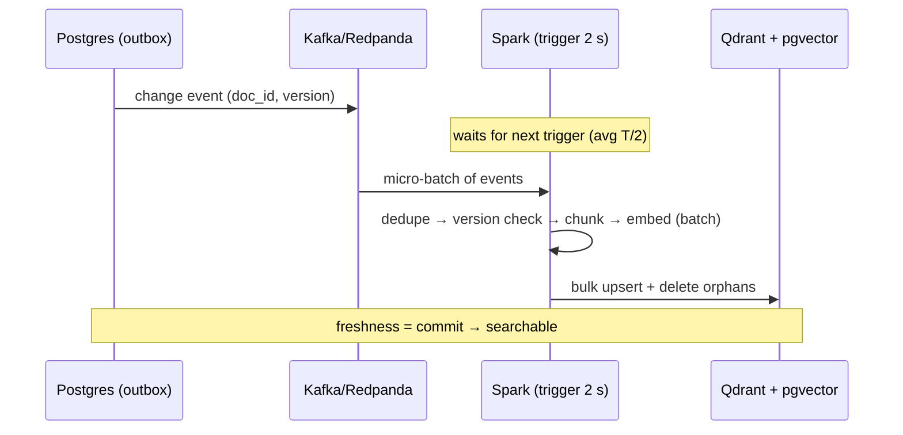

# 📥 02 - Spark Structured Streaming for ML Ingestion

When the work per event is "embed this document and upsert its chunks into a vector index", latency stops being the bottleneck and **efficiency** takes over: embedding models are dramatically cheaper per item in batches, vector databases prefer bulk upserts, and five edits to the same article in two seconds should cost one embedding pass, not five. That is the workload where Spark's micro-batches stop being a compromise and become the right tool.

## 🎯 Learning Objectives
- Explain why micro-batches **win** for embedding and indexing workloads
- Use `foreachBatch` correctly: batch semantics, idempotency with `batchId`, and at-least-once behavior
- Implement **live index maintenance**: in-batch deduplication, version checks, deletes, and orphan-chunk cleanup
- Control load with `maxOffsetsPerTrigger` (Spark has no Flink-style backpressure) and pick triggers (`processingTime`, `availableNow`)
- Configure Spark **local mode** for an 8 GB laptop (shuffle partitions, driver memory, RocksDB state store)
- Monitor streaming queries with progress events and a freshness probe

## Introduction

[[../27 - Apache Spark for ML/04 - Structured Streaming|The Structured Streaming note in the Spark course]] covers the fundamentals: unbounded tables, output modes, triggers, watermarks, checkpointing, Delta sinks. This note builds on it for one specific, increasingly common ML job: **keeping retrieval indexes in sync with a changing source of truth** — the ingestion side of a live RAG system (project P3).

The source is a stream of change events from Postgres (via an outbox or CDC). The sinks are a vector database (Qdrant) and a relational vector index (pgvector). Between them sit chunking and embedding, which dominate the cost. The question this note answers is how to make that pipeline **efficient, correct under replays, and fresh within seconds** on a laptop.

---

## 1. The Problem and Why This Solution Exists

### Per-event embedding is wasteful

Embedding inference has a large fixed cost per call (tokenization setup, session dispatch, memory transfers, network round-trip to a model server) and a smaller marginal cost per item. With fixed cost $a$ and per-item cost $b$, embedding $n$ items in batches of size $k$ costs:

$$
C(n, k) = \frac{n}{k}\,a + n\,b
\qquad
\frac{C(n, 1)}{C(n, 64)} = \frac{a + b}{a/64 + b}
$$

With $a = 20$ ms and $b = 2$ ms (a small ONNX model on CPU), per-item embedding costs 22 ms while batches of 64 cost ~2.3 ms per item — almost **10× cheaper**. Vector database upserts behave the same way: one request with 500 points beats 500 requests.

### Editors save repeatedly

A help-center editor saves an article five times while fixing typos. A per-event pipeline embeds it five times; a micro-batch pipeline sees all five events in one batch, keeps the highest version, and embeds **once**. The saving is pure deduplication — free with batches, awkward with per-event processing.

### Freshness requirements are in seconds

For a knowledge base, "the answer reflects a change within 10 seconds" is excellent. A 2-second trigger costs ~1 s of average waiting — irrelevant against that target, while buying all the efficiency above.

---

## 2. Conceptual Deep Dive

### 2.1 `foreachBatch`: arbitrary sinks with batch semantics

`foreachBatch(func)` calls `func(batch_df, batch_id)` once per micro-batch with a regular (static) DataFrame. Inside, you can use any batch API, any client library, and write to multiple sinks.

Two properties define how to use it safely:

1. **At-least-once by default:** if the query fails after `func` wrote to the sinks but before the batch was committed in the checkpoint, the same batch (same `batch_id`, same data) is **re-executed** on restart.
2. **Deterministic replay:** with a replayable source (Kafka) and the checkpointed offset range, the re-executed batch contains the same records.

Therefore every write inside `func` must be **idempotent**: deterministic IDs and upserts, or a "batch already applied" guard keyed by `batch_id`.

⚠️ **Warning:** `batch_df` is a lazy DataFrame. If you call several actions on it (count, then collect, then write), Spark may recompute it from the source each time. Call `batch_df.persist()` at the start and `unpersist()` at the end when using it more than once.

### 2.2 The four cases of live index maintenance

| Case | Event | Index operation |
|---|---|---|
| New document | `upsert`, version 1 | Insert all chunks |
| Edited document | `upsert`, higher version | Upsert chunks `0..n-1` **and delete chunks `n..m-1`** left over from a longer previous version |
| Deleted document | `delete` | Delete every chunk with that `doc_id` |
| Stale event (replay, reordering) | Version ≤ indexed version | **Ignore** |

Deterministic point IDs make upserts idempotent:

$$
\text{point\_id} = \text{uuid5}(\text{namespace},\; \text{doc\_id} \,\Vert\, \text{chunk\_index})
$$

Replaying an event rewrites the same points with the same vectors — no duplicates. Orphan cleanup (the `n..m-1` deletion) is the step most tutorials skip; without it, an article that shrank keeps serving its old tail to the retriever.

### 2.3 In-batch deduplication

Within a batch, collapse events per document to the latest version before doing any expensive work:

```python
from pyspark.sql import Window, functions as F

w = Window.partitionBy("doc_id").orderBy(F.col("doc_version").desc())
latest = (batch_df.withColumn("rn", F.row_number().over(w))
                  .filter("rn = 1").drop("rn"))      # 5 saves in 2 s → 1 row → 1 embedding pass
```

### 2.4 Flow control: Spark has no backpressure

Flink slows its sources when operators fall behind (credit-based flow control). Spark does not: each trigger reads **everything** available since the last offsets unless you cap it. After an outage or a bulk reindex, the first batch could contain millions of records and blow the driver's memory. Cap it:

$$
\text{records per batch} \le \texttt{maxOffsetsPerTrigger}
$$

and size the cap so that a full batch finishes within the trigger interval (the stability condition from [[01 - Execution Models|note 01]]: $o + c\cdot\text{cap} < T$).

### 2.5 Triggers for ingestion

| Trigger | Behavior | Use |
|---|---|---|
| `processingTime="2 seconds"` | A batch every 2 s (if data) | Live sync |
| `availableNow=True` | Process everything available in capped batches, then stop | **Backfills / full reindex** using the same code |
| Default (no trigger) | Next batch starts as soon as the previous ends | Max throughput; latency varies |
| `continuous` (experimental) | Low-latency, restricted operations | Not suitable for `foreachBatch` workloads |

`availableNow` is the bridge between batch and streaming: the same job that keeps the index live can rebuild it from scratch into a new collection (blue/green reindex) by replaying the topic from the beginning.

### 2.6 State: when ingestion needs it

The index-maintenance job is mostly **stateless across batches** — versions live in the sinks or in a small Postgres table. When you do need streaming state (aggregations with watermarks, `dropDuplicatesWithinWatermark`, or arbitrary state with `applyInPandasWithState` / Spark 4's `transformWithState`), use the **RocksDB state store provider** to keep state off the JVM heap:

```text
spark.sql.streaming.stateStore.providerClass =
    org.apache.spark.sql.execution.streaming.state.RocksDBStateStoreProvider
```

### 2.7 Freshness

End-to-end freshness of the index is the time from the source commit to the chunk being searchable:

$$
F \approx \underbrace{T_{\text{relay}}}_{\text{outbox/CDC}} + \underbrace{\frac{T}{2}}_{\text{wait for trigger}} + \underbrace{P_{\text{batch}}}_{\text{chunk + embed + upsert}} + \underbrace{T_{\text{index}}}_{\text{index visibility}}
$$

With $T = 2$ s, $P \approx 1$ s for a typical batch, and near-immediate visibility in Qdrant and pgvector, the expected freshness is ~2–3 s, with a p95 around 4–5 s — well within a 10 s target. P3 measures it with a **probe** that inserts a marker document and polls the index until it is found.



---

## 3. Production Reality

### Local mode on an 8 GB laptop

| Setting | Laptop value | Why |
|---|---|---|
| `master` | `local[2]` | Two cores for Spark; the rest for Postgres, Kafka, Qdrant |
| `spark.driver.memory` | `1g` | In local mode the driver *is* the executor |
| `spark.sql.shuffle.partitions` | `4` | Default **200** creates 200 tiny tasks per shuffle per batch — pure overhead in micro-batches |
| `maxOffsetsPerTrigger` | ~2,000 | Bounds batch size and driver memory |
| Checkpoint location | A Docker volume | Durable across container restarts |

⚠️ **Warning:** the default `spark.sql.shuffle.partitions = 200` is the single most common reason a small streaming job has a high fixed overhead $o$. For local micro-batches, set it to a small multiple of your cores.

### Where the embeddings run

`foreachBatch` executes on the driver, but the DataFrame operations inside can run on executors. Two shapes:

- **Small batches (knowledge bases, P3):** collect the deduplicated batch to the driver (`toPandas()`), embed with an in-process ONNX model, and bulk upsert. Simple and fast at hundreds of documents per batch.
- **Large batches:** use `mapInPandas` so each executor partition embeds its own rows with a model loaded once per Python worker; write per partition. Never `collect()` millions of rows to the driver.

### Monitoring

Every batch emits a `StreamingQueryProgress` with `numInputRows`, `inputRowsPerSecond`, `processedRowsPerSecond`, and `durationMs` per phase. Track:

- `durationMs.triggerExecution` vs the trigger interval (stability margin)
- `processedRowsPerSecond < inputRowsPerSecond` sustained → falling behind
- Kafka consumer lag of the query's offsets

Caso real: teams building internal "chat with our docs" assistants typically start with a nightly full reindex, then hit the stale-answer problem the first time a policy changes mid-day. Moving to a Structured Streaming job fed by CDC keeps the same chunking and embedding code (now inside `foreachBatch`) and turns "up to 24 h stale" into "a few seconds", with `availableNow` reused for full rebuilds when the embedding model changes.

### Failure modes

| Symptom | Cause | Fix |
|---|---|---|
| Duplicate chunks in the index | Random point IDs + batch replay | Deterministic `uuid5` IDs |
| Old text still retrieved after an edit | Orphan chunks never deleted | Delete `chunk_index ≥ n` per updated doc |
| Driver OOM after downtime | Unbounded first batch | `maxOffsetsPerTrigger` |
| Batches slower than the trigger | 200 shuffle partitions, unbatched embeddings | §3 settings; batch the model calls |
| Old version overwrote a new one | Replay or reorder without version check | Compare `doc_version` before writing |

---

## 4. Code in Practice

```python
# ingest/spark/live_index.py — P3 ingestion job (local mode)
import uuid
from pyspark.sql import SparkSession, Window, functions as F, types as T

spark = (SparkSession.builder.master("local[2]").appName("live-rag-ingest")
         .config("spark.sql.shuffle.partitions", "4")
         .config("spark.driver.memory", "1g")
         .getOrCreate())          # the Kafka connector JAR must match the Spark/Scala version

schema = T.StructType([
    T.StructField("event_id", T.StringType()), T.StructField("op", T.StringType()),
    T.StructField("doc_id", T.StringType()), T.StructField("doc_version", T.LongType()),
    T.StructField("title", T.StringType()), T.StructField("body_md", T.StringType()),
    T.StructField("locale", T.StringType()), T.StructField("ts_commit_ns", T.LongType())])

events = (spark.readStream.format("kafka")
          .option("kafka.bootstrap.servers", "redpanda:9092")
          .option("subscribe", "kb-changes")
          .option("startingOffsets", "earliest")
          .option("maxOffsetsPerTrigger", 2000)                  # flow control
          .load()
          .select(F.from_json(F.col("value").cast("string"), schema).alias("e"))
          .select("e.*"))

NS = uuid.UUID("6f1c2a52-0000-4000-8000-000000000000")

def point_id(doc_id: str, idx: int) -> str:
    return str(uuid.uuid5(NS, f"{doc_id}#{idx}"))              # deterministic → idempotent upserts

def upsert_batch(batch_df, batch_id: int):
    batch_df.persist()
    w = Window.partitionBy("doc_id").orderBy(F.col("doc_version").desc())
    latest = batch_df.withColumn("rn", F.row_number().over(w)).filter("rn = 1").drop("rn")
    rows = latest.toPandas()                                    # small KB batches: fine on the driver
    batch_df.unpersist()
    if rows.empty:
        return
    indexed = index_versions(rows["doc_id"].tolist())          # {doc_id: version} from Postgres
    rows = rows[rows.apply(lambda r: r.doc_version > indexed.get(r.doc_id, 0), axis=1)]

    deletes = rows[rows.op == "delete"]
    upserts = rows[rows.op == "upsert"]
    for doc_id in deletes.doc_id:
        delete_doc(doc_id)                                      # Qdrant filter delete + pgvector DELETE

    chunks = [(r.doc_id, i, r.doc_version, txt, r.locale)
              for r in upserts.itertuples() for i, txt in enumerate(chunk_markdown(r.title, r.body_md))]
    vectors = embed([c[3] for c in chunks], batch_size=64)       # ONE batched model pass for the batch
    upsert_points([(point_id(d, i), v, {"doc_id": d, "chunk_index": i, "doc_version": ver,
                    "text": t, "locale": loc}) for (d, i, ver, t, loc), v in zip(chunks, vectors)])
    for doc_id in upserts.doc_id:
        n_chunks = sum(1 for c in chunks if c[0] == doc_id)
        delete_chunks_from(doc_id, start_index=n_chunks)        # orphan cleanup (shrunk documents)
    record_versions(rows[["doc_id", "doc_version"]])            # idempotent upsert of indexed versions

query = (events.writeStream.foreachBatch(upsert_batch)
         .trigger(processingTime="2 seconds")
         .option("checkpointLocation", "/chk/live-index")
         .start())
query.awaitTermination()
```

⚠️ **Warning:** the helper functions (`embed`, `upsert_points`, `delete_doc`, `delete_chunks_from`, `index_versions`, `record_versions`, `chunk_markdown`) live in a shared package (`ragcore`) so that the query path uses **the same chunking and embedding code** — otherwise you have rebuilt train/serve skew for retrieval.

```python
# ✅ Full reindex with the SAME job: process the whole topic in capped batches, then stop
events.writeStream.foreachBatch(upsert_batch).trigger(availableNow=True) \
      .option("checkpointLocation", "/chk/reindex-kb_v2").start()
```

### 📦 Compression code: the four cases of live index maintenance

```python
# 📦 Compression code: dedupe, version check, deletes, orphan cleanup, idempotent replay
# Covers: in-batch dedupe, deterministic IDs, shrinking documents, stale events, replays
import uuid

NS = uuid.UUID(int=42)
index, versions = {}, {}                               # point_id → (doc_id, idx, text); doc → version

def chunks(body: str) -> list[str]:
    return [p for p in body.split("\n\n") if p]

def apply_batch(batch: list[dict]):
    latest = {}
    for e in batch:                                    # in-batch dedupe: keep highest version per doc
        if e["doc_id"] not in latest or e["v"] > latest[e["doc_id"]]["v"]:
            latest[e["doc_id"]] = e
    for e in latest.values():
        d = e["doc_id"]
        if e["v"] <= versions.get(d, 0):
            continue                                   # stale event: ignore
        for pid in [p for p, (doc, _, _) in index.items() if doc == d and e["op"] == "delete"]:
            del index[pid]
        if e["op"] == "upsert":
            cs = chunks(e["body"])
            for i, t in enumerate(cs):
                index[str(uuid.uuid5(NS, f"{d}#{i}"))] = (d, i, t)
            for pid in [p for p, (doc, i, _) in index.items() if doc == d and i >= len(cs)]:
                del index[pid]                         # orphan cleanup
        versions[d] = e["v"]

b1 = [{"doc_id": "a", "v": 1, "op": "upsert", "body": "fees\n\nlimits\n\nhours"},
      {"doc_id": "a", "v": 2, "op": "upsert", "body": "fees v2\n\nlimits\n\nhours\n\nfaq"}]
apply_batch(b1); apply_batch(b1)                       # replay: identical result
print(len(index), "chunks after batch+replay (expect 4)")
apply_batch([{"doc_id": "a", "v": 3, "op": "upsert", "body": "fees v3"}])
print(len(index), "chunks after shrink (expect 1)")
apply_batch([{"doc_id": "a", "v": 2, "op": "upsert", "body": "old\n\nold"}])
print(len(index), "chunks after stale event (expect 1)")
apply_batch([{"doc_id": "a", "v": 4, "op": "delete", "body": ""}])
print(len(index), "chunks after delete (expect 0)")
# ¡Sorpresa! Without the orphan cleanup, the shrink step would leave 4 chunks — 3 of them stale.
```

---

## 🎯 Key Takeaways
- Micro-batches are the **right** tool when per-item work benefits from batching: embeddings, bulk upserts, in-batch dedupe.
- `foreachBatch` gives full batch APIs per micro-batch but is **at-least-once** — every write must be idempotent.
- Live indexes need **four cases**: insert, update + orphan cleanup, delete, and ignore stale versions.
- **Deterministic point IDs** (`uuid5(doc_id#chunk)`) make replays harmless.
- Spark has **no backpressure**: cap batches with `maxOffsetsPerTrigger`; respect the stability condition.
- On a laptop, set `local[2]`, small `shuffle.partitions`, and a bounded driver; use `availableNow` for full reindexes.
- Measure **freshness** with a probe: commit → searchable, typically $T/2 + P$ plus relay time.

## References
- Apache Spark — *Structured Streaming Programming Guide* (foreachBatch, triggers, Kafka integration, state store)
- Armbrust et al., *Structured Streaming* (SIGMOD 2018)
- Qdrant documentation — points, upsert, delete by filter · pgvector documentation
- [[../27 - Apache Spark for ML/04 - Structured Streaming|Structured Streaming fundamentals]] · [[../33 - Vector Databases and Semantic Search/05 - Qdrant I - Architecture and Collections|Qdrant I]] · [[../36 - PostgreSQL for AI-ML Workloads/01 - pgvector Production Tuning - HNSW, Quantization and Hybrid Search|pgvector tuning]]
- [[01 - Execution Models|Previous: Execution Models]] · [[03 - Python-Native Streaming - Bytewax, Quix Streams, Faust and Kafka Streams|Next: Python-Native Streaming]]
