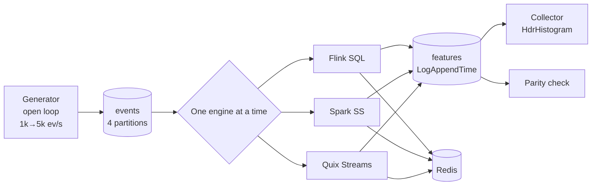

# 🧪 04 - Lab — Same Pipeline, Three Engines

Benchmarks you read online were run on someone else's hardware, with someone else's configuration, for someone else's workload. The only comparison that should drive your architecture is one you can reproduce. This lab implements **one** feature pipeline three times — Flink, Spark Structured Streaming, and a Python-native engine — runs them under identical open-loop load on an 8 GB laptop, and turns note 01's predictions into measured facts.

## 🎯 Learning Objectives
- Design a **fair** cross-engine benchmark: same semantics, same load, same hardware, same measurement
- Implement a per-key windowed feature in **Flink SQL**, **Spark Structured Streaming**, and **Quix Streams**
- Measure **end-to-end latency percentiles**, sustained throughput, CPU, RAM, recovery time, and code size
- Compare measured results against the **queueing and micro-batch models** from note 01
- Write up results honestly, including the semantic differences between engines

## Introduction

The pipeline is deliberately small so that engine behavior, not business logic, dominates: read events from a Kafka topic, maintain a per-key count over the last 10 minutes, emit an enriched record **for every event**, and write the latest value per key to Redis. It is a scaled-down version of P1's velocity features and P2's per-customer context — exactly the shape real-time ML pipelines share.

Fairness is the hard part. Engines do not offer identical semantics: Flink has `OVER` windows that emit per event; Quix Streams emits per event with `sliding_window(...).current()`; Spark's micro-batches naturally emit per batch, so emitting per event needs arbitrary state. The lab makes those differences explicit instead of hiding them, and fixes everything else: topic partitions, generator, measurement point, resource limits, and run protocol.

---

## 1. The Problem and Why This Solution Exists

### Why "it depends" needs data

Note 01 predicts: Flink's latency floor is milliseconds, Spark's is roughly $T/2$ plus batch overhead, and a Python engine's capacity is bounded by per-record CPU. Predictions are hypotheses. A system-design answer backed by "I measured p95 = 9 ms vs 1.3 s vs 14 ms on the same laptop, here is the chart" is qualitatively stronger than a recitation of documentation.

### The common traps in engine benchmarks

| Trap | Effect | Lab rule |
|---|---|---|
| Closed-loop load | Hides slowness (coordinated omission) | Open-loop generator with `t_scheduled` |
| Different semantics | Comparing apples to oranges | Same definition; differences documented |
| Different resources | Bigger engine "wins" | Same `mem_limit`/CPU budget per engine |
| Engines running together | Interference | One engine at a time; `make down` between |
| Single run, no warm-up | JIT/caches distort results | 60 s warm-up, 180 s measurement, 3 reps |
| Averages | Hide the tail | p50/p95/p99 with HdrHistogram |

---

## 2. Conceptual Deep Dive

### 2.1 The pipeline contract

For each input event $e = (\text{key}, t, \ldots)$, every engine must emit one output record:

$$
\text{out}(e) = \big(e,\; c_{10}(e)\big),
\qquad
c_{10}(e) = \big|\{e' : \text{key}(e') = \text{key}(e),\; t(e) - 600\,\text{s} \le t(e') \le t(e)\}\big|
$$

and maintain `redis[key] = latest c_10`. Time is **processing time** for all three (note 02 of the Flink course explains why this is acceptable when per-key order holds); input topic: 4 partitions keyed by `key`.

### 2.2 Implementation shape per engine

| Engine | Per-event emission mechanism | Expected latency floor |
|---|---|---|
| Flink SQL | `OVER (PARTITION BY key ORDER BY proc_time RANGE 10 MIN PRECEDING)` | ms (buffer timeout 5 ms) |
| Spark SS | `applyInPandasWithState` keeping a per-key list of timestamps, emitting one row per input row, trigger 1 s | ≈ $T/2 + o$ ≈ 0.6–1 s |
| Quix Streams | `group_by(key).sliding_window(10 min).count().current()` | ms + Python per-record cost |

⚠️ **Warning — semantic gap in Spark:** a plain windowed `groupBy(window, key).count()` in update mode emits **one row per key per batch**, not one per event. That is a valid design for many uses, but not this contract. The lab uses `applyInPandasWithState` to honor the contract and documents the alternative as a variant (it is faster, and different).

### 2.3 What to measure

| Metric | How | Why |
|---|---|---|
| End-to-end latency p50/p95/p99 | Output topic `LogAppendTime` − `t_scheduled` | The user-visible number |
| Sustained throughput | Highest step with p95 under target **and** stable lag | Capacity with headroom (note 01, §2.5) |
| CPU and RAM | `docker stats` sampled every second | Cost on a shared laptop |
| Recovery time | Kill the engine process at t = 60 s; time until lag returns to baseline | Operability |
| Correctness | Compare $c_{10}$ against an offline recomputation (parity) | Speed without correctness is meaningless |
| Code size | Lines of the pipeline code (excluding shared generator/collector) | Developer cost |

### 2.4 Predictions (write them down before running)

Using note 01's models with assumed constants ($o_{\text{spark}} \approx 200$ ms, $T = 1$ s, Python cost ≈ 100 µs/record, Flink buffer timeout 5 ms):

$$
\text{p95}_{\text{Spark}} \approx 0.95\,T + o + P \approx 1.2\text{–}1.4\,\text{s}
\qquad
\text{p95}_{\text{Flink}} \approx 5\text{–}20\,\text{ms}
\qquad
\text{p95}_{\text{Quix}} \approx 5\text{–}30\,\text{ms below saturation}
$$

and a Python capacity of roughly $1/(100\,\mu s) \approx 10$k ev/s per process before saturation effects. The point of writing predictions down is to learn from the **deviations**.



---

## 3. Production Reality

### Run protocol

```text
for engine in flink spark quix:
    make down && make up ENGINE=$engine          # Kafka + Redis + this engine only
    make warmup RATE=1000 SECONDS=60
    for rate in 1000 2000 5000 8000:
        for rep in 1 2 3:
            make load RATE=$rate SECONDS=240 &    # first 60 s discarded
            make collect SKIP=60 SECONDS=180 OUT=results/$engine/$rate/$rep.json
            make drain                            # wait until consumer lag == 0
    make chaos ENGINE=$engine                     # kill at t=60s under 50% load → recovery time
    make parity ENGINE=$engine
```

Resource limits per engine are set so each gets the **same total** container memory (~1.9 GB) and the same CPU allowance (`cpus: 2.0` in Compose), on top of a shared Kafka and Redis.

### Results template

| Engine | Rate (ev/s) | p50 (ms) | p95 (ms) | p99 (ms) | Lag stable | CPU (cores) | RAM (MB) |
|---|---|---|---|---|---|---|---|
| Flink SQL | 2,000 | | | | | | |
| Spark SS (per-event state) | 2,000 | | | | | | |
| Spark SS (per-batch variant) | 2,000 | | | | | | |
| Quix Streams (1 process) | 2,000 | | | | | | |
| Quix Streams (4 processes) | 5,000 | | | | | | |

| Engine | Sustained throughput | Recovery time | Parity mismatch | Pipeline LOC |
|---|---|---|---|---|
| Flink SQL | | | | |
| Spark SS | | | | |
| Quix Streams | | | | |

Hardware line (always): *Intel i5-10300H (4C/8T), 8 GB RAM, Docker Desktop/WSL2 `memory=5GB`, plugged in, performance power plan.*

### Reading the results

- If Spark's p95 ≈ trigger + overhead regardless of rate (until it saturates), the micro-batch model holds. If it climbs steeply at higher rates, the stability condition $o + c\lambda T < T$ is near its limit.
- If Quix's p95 is flat and then explodes at one rate, that is the single-process CPU knee — re-run with more processes (≤ partitions) and check the scaling is near-linear.
- If Flink's p95 at low rates is ~2× the buffer timeout, the network hops dominate (note 06 of the Flink course).
- Compare CPU per 1k events: it often shows the JVM engines' efficiency at high rates and the Python engine's efficiency at low rates (no idle JVMs).

Caso real: engineers who run this kind of controlled comparison commonly find that the "slow" engine was fine for its actual SLA, and that the deciding factors were elsewhere — operational familiarity, how state is recovered, or whether the ML model can run in-process. The lab's value is that the decision becomes explicit and defensible.

---

## 4. Code in Practice

### Flink SQL

```sql
INSERT INTO features
SELECT event_id, `key`, t_scheduled_ns,
       COUNT(*) OVER (PARTITION BY `key` ORDER BY proc_time
                      RANGE BETWEEN INTERVAL '10' MINUTE PRECEDING AND CURRENT ROW) AS c10
FROM events;
```

### Spark Structured Streaming (per-event via arbitrary state)

```python
import pandas as pd
from pyspark.sql.streaming.state import GroupStateTimeout

def c10_per_event(key, pdfs, state):
    ts = list(state.get[0]) if state.exists else []
    out = []
    for pdf in pdfs:
        for row in pdf.itertuples():
            now = row.proc_ts
            ts = [t for t in ts if t >= now - 600] + [now]
            out.append((row.event_id, key[0], row.t_scheduled_ns, len(ts)))
    state.update((ts,))
    yield pd.DataFrame(out, columns=["event_id", "key", "t_scheduled_ns", "c10"])

features = (events.withColumn("proc_ts", F.unix_timestamp(F.current_timestamp()).cast("double"))
            .groupBy("key")
            .applyInPandasWithState(c10_per_event,
                outputStructType="event_id string, key string, t_scheduled_ns long, c10 long",
                stateStructType="ts array<double>", outputMode="append",
                timeoutConf=GroupStateTimeout.NoTimeout))

(features.selectExpr("key AS key", "to_json(struct(*)) AS value")
    .writeStream.format("kafka").option("kafka.bootstrap.servers", "kafka:29092")
    .option("topic", "features").option("checkpointLocation", "/chk/lab-spark")
    .trigger(processingTime="1 second").start())
```

⚠️ **Warning:** `applyInPandasWithState` moves each group's rows through a Python worker per batch — it is the honest way to meet the per-event contract in Spark, but it is not Spark's fastest path. Report the per-batch variant (`groupBy(window(...), "key").count()` in update mode) alongside it and state the semantic difference.

### Quix Streams

```python
from datetime import timedelta
from quixstreams import Application

app = Application(broker_address="kafka:29092", consumer_group="lab-quix", auto_offset_reset="latest")
sdf = app.dataframe(app.topic("events", value_deserializer="json"))
sdf = sdf.group_by("key")
sdf = sdf.sliding_window(duration_ms=timedelta(minutes=10)).count().current()
sdf.to_topic(app.topic("features", value_serializer="json"))
app.run()
```

💡 **Tip:** the Quix output carries the window aggregate; join back the event fields you need (`event_id`, `t_scheduled_ns`) with an `apply` before the window if the collector needs them — check the window output shape in the version you pin.

### 📦 Compression code: from raw latencies to a defensible comparison

```python
# 📦 Compression code: analyze lab results the honest way
# Covers: percentiles per rate, sustained throughput rule, prediction vs measurement
import random
import statistics

random.seed(11)
def simulate(engine: str, rate: int, n: int = 20_000) -> list[float]:
    # Stand-in for measured data, generated from note 01's models (replace with real JSON results)
    if engine == "spark":
        T, o, c = 1.0, 0.2, 40e-6                          # trigger, batch overhead, cost/record
        if o + c * rate * T >= T:
            return [float("inf")] * n                      # unstable: batches fall behind
        return [random.uniform(0, T) + o + c * rate * T for _ in range(n)]
    base, mu = (0.010, 40_000) if engine == "flink" else (0.008, 10_000)  # quix: ~100 µs/rec, 1 proc
    if rate >= mu:
        return [float("inf")] * n                          # saturated: lag grows forever
    return [base + random.expovariate(mu - rate) for _ in range(n)]

TARGET = 0.080
p = lambda xs, q: statistics.quantiles(xs, n=100)[q - 1]
for engine in ("flink", "spark", "quix"):
    sustained = 0
    for rate in (1_000, 5_000, 9_500, 12_000, 25_000):
        lat = simulate(engine, rate)
        p95 = p(lat, 95)
        ok = p95 <= TARGET
        sustained = rate if ok else sustained
        print(f"{engine:<5} {rate:>5}/s  p50={p(lat,50)*1000:7.1f}ms  p95={p95*1000:7.1f}ms  {'✅' if ok else '❌'}")
    print(f"→ {engine}: sustained throughput at p95 ≤ {TARGET*1000:.0f} ms = {sustained:,} ev/s\n")
# ¡Sorpresa! Spark never meets an 80 ms target here — yet for P3's 10 s freshness SLA it passes trivially.
```

---

## 🎯 Key Takeaways
- A fair engine comparison fixes **load, semantics, resources, measurement point, and protocol** — and documents what it cannot fix.
- **Open-loop load**, warm-up, three repetitions, and percentiles are non-negotiable.
- Spark meets a per-event contract only through arbitrary state; its per-batch variant is faster but **semantically different**.
- Write **predictions first** from the execution models; deviations are where you learn.
- Report **sustained throughput** (p95 under target with stable lag), CPU, RAM, recovery, parity, and code size — not just speed.
- The "winner" depends on the SLA: an engine that fails an 80 ms target can trivially satisfy a 10 s one.

## References
- Gil Tene, *How NOT to Measure Latency* — coordinated omission and HdrHistogram
- Apache Spark — `applyInPandasWithState` and Structured Streaming + Kafka integration guides
- Apache Flink — OVER aggregation docs · Quix Streams — windowing docs
- [[../46 - Apache Flink for Real-time ML/07 - Capstone - Kafka to Flink to Redis Feature Pipeline|Flink capstone (generator, collector, parity test)]]
- [[03 - Python-Native Streaming - Bytewax, Quix Streams, Faust and Kafka Streams|Previous: Python-Native Streaming]] · [[05 - Decision Framework and Interview Playbook|Next: Decision Framework]]
