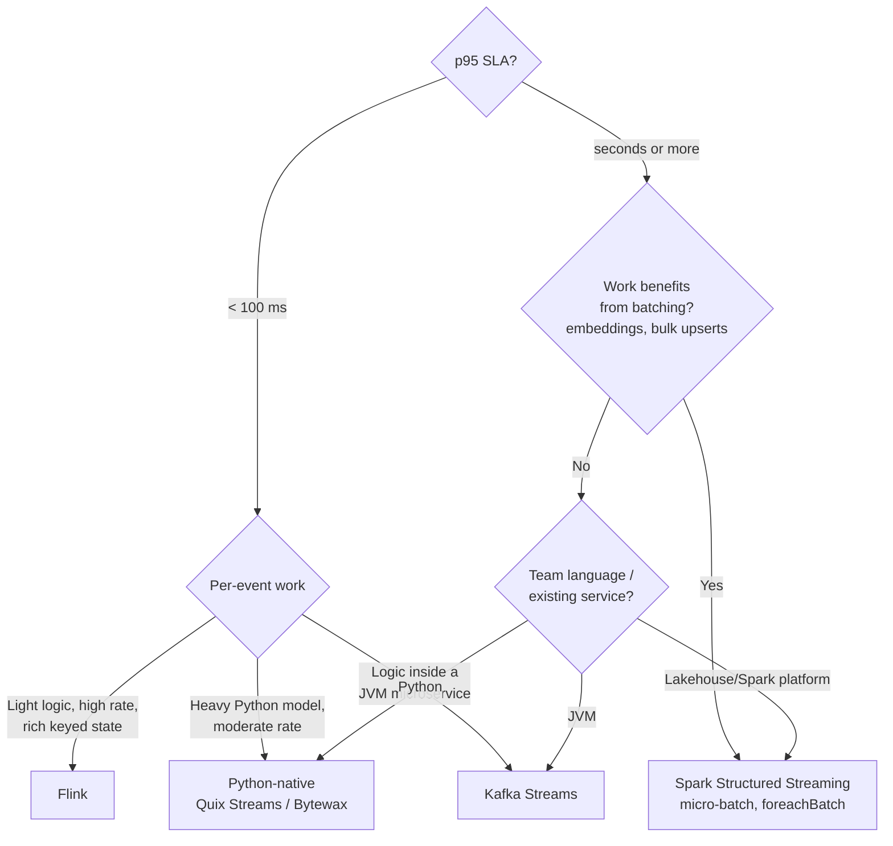

# 🧭 05 - Decision Framework and Interview Playbook

In a system-design interview, "I'd use Kafka and Flink" earns little; "the scoring SLA is p95 under 80 ms, the features are per-user windows over 10 minutes, so I need per-event stateful processing — Flink, with processing-time OVER windows and idempotent sinks; for document indexing in the same company I'd use Spark micro-batches because embeddings batch well and freshness of seconds is fine" earns the job. This note turns the course into a repeatable decision procedure and a set of practiced answers.

## 🎯 Learning Objectives
- Apply a **requirements-first** procedure to choose a stream processing engine
- Score engines with a **weighted decision matrix** and justify the weights
- Reproduce and defend the engine choices for **P1, P2, and P3**
- Recognize anti-patterns in engine selection
- Answer the most common **interview follow-ups** with precise, quantified arguments
- Map local choices to **managed services** for production

## Introduction

Engine selection is not a popularity contest; it is matching **workload properties** to **execution models**. The workload properties that matter are few: the latency SLA, the shape of per-event work (light logic vs heavy model calls vs batchable work), state size and lifetime, delivery requirements, the team's language, and the operational budget. The execution models from [[01 - Execution Models|note 01]] map those properties to engines almost mechanically.

What makes a strong answer is showing that mapping explicitly — and quantifying it with the formulas you already know: micro-batch latency $\approx T/2 + o$, per-event latency $\approx$ processing + buffer flushes, Python capacity $\approx 1/c$ per process, tail latency exploding as $\rho \to 1$.

---

## 1. The Problem and Why This Solution Exists

### How engine choices go wrong

| Anti-pattern | What happens | Better |
|---|---|---|
| "Flink everywhere because it's fastest" | JVM clusters operated for workloads with 10 s SLAs | Match the SLA; micro-batch or a library may be simpler |
| "We already have Spark, so Spark for fraud" | p95 ≈ 1 s for a 80 ms SLA | Separate latency classes can use separate engines |
| "Python engine for 200k ev/s of light logic" | Dozens of processes, GIL-bound CPU | JVM engine; Python where ML code lives |
| Choosing by API taste | Operational surprises (state restore, rebalances) | Evaluate the failure model first |
| Ignoring project health | Stalled dependency in production | Check release cadence and maintainers ([[03 - Python-Native Streaming - Bytewax, Quix Streams, Faust and Kafka Streams|note 03]]) |
| Exactly-once by default | Transaction latency on the hot path | At-least-once + idempotent sinks unless correctness truly requires 2PC |

### Requirements before tools

The procedure always starts with numbers, not names:

1. **Latency SLA** (p95/p99) and **freshness** requirement.
2. **Event rate** now and in 12 months; burstiness.
3. **Per-event work**: light logic, heavy model call, or batchable operation?
4. **State**: size, key cardinality, time range, TTL.
5. **Correctness**: tolerance for duplicates/late data; need for event-time determinism.
6. **Team and stack**: languages, existing platforms (lakehouse? JVM services?).
7. **Operations**: who runs it, managed options, budget.

---

## 2. Conceptual Deep Dive

### 2.1 The decision tree



### 2.2 A weighted decision matrix

Score each engine $e$ on criteria $i$ from 1 to 5 ($s_{e,i}$), weight criteria by importance for this workload ($w_i$, summing to 1), and compare:

$$
\text{Score}(e) = \sum_i w_i \, s_{e,i}
\qquad \sum_i w_i = 1
$$

The value is not the arithmetic — it is that the **weights force you to state what matters** and make disagreements discussable ("you weighted ops cost at 0.05; for a two-person team I'd weight it 0.25").

| Criterion | Flink | Spark SS | Quix Streams | Kafka Streams |
|---|---|---|---|---|
| Per-event latency | 5 | 2 | 4 | 4 |
| Throughput per core | 5 | 4 | 2 | 4 |
| Batch efficiency (embeddings, bulk writes) | 2 | 5 | 3 | 2 |
| Rich state & event time | 5 | 4 | 3 | 4 |
| Python/ML-model fit | 2 | 4 | 5 | 1 |
| Operational simplicity (laptop/small team) | 2 | 3 | 5 | 4 |
| Batch/stream code reuse | 4 | 5 | 2 | 2 |
| Managed offerings | 5 | 5 | 3 | 4 |

*Scores are the course's judgment for typical 2026 versions — re-score for your context.*

### 2.3 The three projects, decided

**P1 — fraud scoring (Flink).** SLA p95 ≤ 80 ms end to end; per-user velocity features over 10 min/1 h; light per-event logic; thousands of events/s. Micro-batching alone costs $T/2 + o \gg 80$ ms → excluded. Python per-record capacity could suffice at laptop rates, but rich keyed state, event-time options, and checkpointed recovery favor Flink. Model inference stays in a separate scorer.

**P2 — support-message router (Python-native).** SLA: routing in < 300 ms p95; per-event work dominated by an in-process encoder (Laya) — batching *a few* messages helps, but tens of ms per batch, not seconds. Team and models are Python → Python-native engine; evidence on project health points to **Quix Streams** over Bytewax ([[03 - Python-Native Streaming - Bytewax, Quix Streams, Faust and Kafka Streams|note 03]]).

**P3 — live RAG indexing (Spark).** Freshness SLA ~10 s; per-event work is embedding + vector upserts, which batch extremely well; in-batch dedupe collapses repeated edits; the same job does backfills with `availableNow` → **Spark Structured Streaming** with `foreachBatch` ([[02 - Spark Structured Streaming for ML Ingestion|note 02]]).

### 2.4 Managed equivalents (production mapping)

| Local choice | Managed options (verify current names and regions) |
|---|---|
| Flink | Amazon Managed Service for Apache Flink, Confluent Cloud for Apache Flink, Ververica, Flink on GKE/EKS via the Flink Kubernetes Operator |
| Spark Structured Streaming | Databricks, Google Dataproc (Serverless), Amazon EMR |
| Kafka Streams / Quix Streams | Your own containers on Kubernetes / Cloud Run jobs; Quix Cloud |
| Kafka / Redpanda | Confluent Cloud, Amazon MSK, Google Managed Service for Apache Kafka, Redpanda Cloud |

---

## 3. Production Reality — The Interview Playbook

### Structure of a strong answer (≈ 3 minutes)

1. **Clarify numbers:** "What p95 do we need, at what event rate, and how fresh must features be?"
2. **Name the per-event work:** light aggregation, heavy model call, or batchable work.
3. **Pick the execution model** with one formula ("micro-batch adds ≈ T/2 plus batch overhead, so a 1 s trigger can't meet 80 ms").
4. **State and correctness:** keyed state, window type, delivery guarantee, idempotency.
5. **Failure story:** what happens when a worker dies; recovery time with headroom.
6. **Operations and cost:** managed service or self-run; who is on call.
7. **Measurement:** how you'd prove it (open-loop load, percentiles, the lab).

### Follow-ups you will get

**"Why not just use Spark for the fraud features?"**
"Micro-batch latency is about half the trigger interval plus batch overhead — with a 1 s trigger, roughly 0.5–1 s on average and over a second at p95. Shrinking the trigger runs into the stability condition $o + c\lambda T < T$. Spark's newer low-latency modes may change that, so I'd check the version — but for a strict 80 ms p95 I'd choose a per-event engine."

**"How do you guarantee exactly-once?"**
"Inside Flink, checkpoints give exactly-once state. End to end, transactional Kafka sinks make outputs visible only after each checkpoint — that adds about half the checkpoint interval of latency, too much for scoring. So on the hot path I use at-least-once with idempotent sinks: keyed upserts in Redis, `ON CONFLICT` in Postgres, deduplication by payment ID. The observable result is effectively-once without transaction latency."

**"Events arrive late or out of order — what happens to your features?"**
"Kafka preserves order per partition and we partition by user, so per-user order holds; that's why processing-time OVER windows are safe on the hot path. I measure the divergence against an event-time version, and route genuinely late events to a side output so training data stays complete."

**"Traffic grows 10×. What breaks first?"**
"Partitions and parallelism cap first — I'd plan partitions for the 12-month rate. Then CPU: tail latency explodes near saturation, so I'd keep utilization around 60–70%. State grows with active keys; RocksDB handles it, but checkpoint duration and recovery time grow, so I'd watch those and consider incremental checkpoints and more TaskManagers."

**"Kafka Streams or Flink?"**
"Kafka Streams if the logic belongs inside an existing JVM service and Kafka is the only infrastructure I want — no cluster, changelog-backed state. Flink if I need a shared platform for many jobs, richer windowing and event-time handling, SQL, larger state, or faster recovery with snapshots instead of changelog replay."

**"Why a Python engine for the router?"**
"Because the expensive part is the model, and it's Python. Keeping it in-process avoids a network hop per message; the engine overhead is ~100 µs against tens of milliseconds of inference, so the engine choice optimizes for language fit and project health, and capacity scales with processes up to the partition count."

Caso real: interviewers at companies running real-time ML often probe exactly two things — whether you know where latency comes from, and whether you have operated state through a failure. A candidate who can draw the micro-batch latency formula and explain idempotent sinks after a TaskManager crash typically stands out more than one who lists ten tools.

---

## 4. Code in Practice

### A decision record template (ADR)

```markdown
# ADR-00X: Stream processing engine for <pipeline>
- Context: SLA p95 = __ ms, rate = __ ev/s (12-mo: __), per-event work = __, state = __
- Options: Flink · Spark SS · Quix Streams · Kafka Streams
- Decision: __ because __ (formula/measurement)
- Consequences: ops cost __, failure model __, what would make us revisit (e.g., rate > __)
- Evidence: link to lab results (p50/p95/p99, CPU, recovery, parity)
```

### 📦 Compression code: a weighted decision matrix for P1, P2, and P3

```python
# 📦 Compression code: weights encode the workload; scores encode the engines
# Covers: weighted scoring, per-project weights, sensitivity to a weight change
SCORES = {  # criterion → engine → 1..5 (course judgment; re-score for your context)
    "latency":    {"flink": 5, "spark": 2, "quix": 4, "kstreams": 4},
    "throughput": {"flink": 5, "spark": 4, "quix": 2, "kstreams": 4},
    "batching":   {"flink": 2, "spark": 5, "quix": 3, "kstreams": 2},
    "state":      {"flink": 5, "spark": 4, "quix": 3, "kstreams": 4},
    "python_fit": {"flink": 2, "spark": 4, "quix": 5, "kstreams": 1},
    "ops_simple": {"flink": 2, "spark": 3, "quix": 5, "kstreams": 4},
}
PROJECTS = {
    "P1 fraud (p95 ≤ 80 ms)": {"latency": .35, "throughput": .2, "state": .25, "ops_simple": .1, "python_fit": .1},
    "P2 router (Python model)": {"latency": .2, "python_fit": .35, "ops_simple": .25, "state": .1, "throughput": .1},
    "P3 live RAG (freshness 10 s)": {"batching": .45, "python_fit": .2, "ops_simple": .15, "state": .1, "latency": .1},
}

def rank(weights: dict) -> list[tuple[str, float]]:
    assert abs(sum(weights.values()) - 1) < 1e-9
    engines = SCORES["latency"].keys()
    return sorted(((e, sum(w * SCORES[c][e] for c, w in weights.items())) for e in engines),
                  key=lambda x: -x[1])

for project, w in PROJECTS.items():
    print(project, "→", ", ".join(f"{e}={s:.2f}" for e, s in rank(w)))

w = dict(PROJECTS["P1 fraud (p95 ≤ 80 ms)"]); w["ops_simple"] += .15; w["throughput"] -= .15
print("P1 with a 2-person team (ops weight ↑) →", rank(w)[:2])
# ¡Sorpresa! Raising the ops weight flips the ranking — the 'right' engine depends on who runs it.
```

---

## 🎯 Key Takeaways
- Start from **numbers** (SLA, rate, per-event work, state, correctness), not tool names.
- The **execution model** decides most of the answer: per-event for ms SLAs, micro-batch when work batches well.
- A **weighted matrix** makes priorities explicit and debatable; weights matter more than scores.
- P1 → **Flink** (latency + keyed state), P2 → **Python-native** (in-process model; Quix on current evidence), P3 → **Spark** (batchable embeddings + backfills).
- Default to **at-least-once + idempotent sinks**; justify 2PC only when needed.
- Strong interview answers quantify latency, describe the failure story, and explain how you'd **measure**.
- Re-verify version-dependent claims (Spark low-latency modes, project health) before deciding.

## References
- [[00 - Welcome to Stream Processing Engines Compared|Course welcome]] · [[01 - Execution Models|01]] · [[02 - Spark Structured Streaming for ML Ingestion|02]] · [[03 - Python-Native Streaming - Bytewax, Quix Streams, Faust and Kafka Streams|03]] · [[04 - Lab - Same Pipeline Three Engines|04]]
- [[../46 - Apache Flink for Real-time ML/00 - Welcome to Apache Flink for Real-time ML|Apache Flink for Real-time ML]]
- [[../32 - System Design for ML/00 - Welcome to System Design for ML|System Design for ML]] · [[../../06 - Large Language Models/33 - ML System Design Interviews/00 - Welcome to ML System Design Interviews|ML System Design Interviews]]
- Martin Kleppmann, *Designing Data-Intensive Applications* (O'Reilly, 2017) — stream processing chapter
- Michael Nygard, *Documenting Architecture Decisions* (2011) — ADRs
