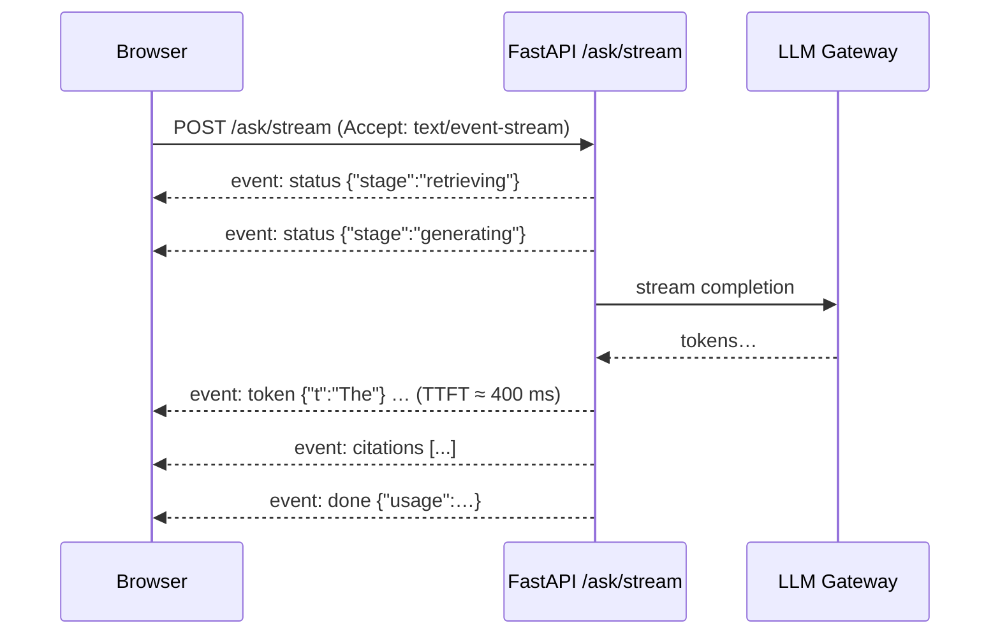

# 📡 Welcome — LLM Token Streaming: SSE, WebSockets and gRPC

An LLM answer that takes four seconds feels instant if the first words appear in 400 ms, and broken if the screen stays blank for four seconds. Streaming tokens as they are generated is the single biggest UX lever in LLM products — and also a source of production bugs that never appear in a request/response API: proxies that buffer the stream, connections that die mid-answer, clients that disconnect while you keep paying for tokens, and errors that happen after you've already sent a `200 OK`.

## 🎯 Learning Objectives
- Explain why streaming changes perceived latency (**TTFT**) and what it costs operationally
- Master **Server-Sent Events**: wire format, event types, IDs, `retry`, `Last-Event-ID` reconnection, heartbeats
- Serve SSE from **FastAPI** (native `EventSourceResponse`) and keep it working **behind proxies** and on **Cloud Run**
- Handle **cancellation, backpressure, and errors mid-stream** — including retracting content after a failed check
- Choose between **SSE, WebSockets, and gRPC streaming** with a defensible matrix

## Introduction

LLMs generate text token by token; the only question is whether the client sees those tokens as they are produced or waits for the whole answer. Streaming exposes intermediate progress, which reduces **time to first token** (TTFT) — the latency users actually perceive — from "total generation time" to "time until the model starts writing". For RAG systems it also lets the server report progress *before* generation starts (retrieving, grading, generating), which keeps users engaged during the slowest phase.

The industry converged on **Server-Sent Events** for this: OpenAI- and Anthropic-style chat APIs stream over SSE, the Vercel AI SDK consumes it, MCP's HTTP transport uses it, and FastAPI now supports it natively. SSE is plain HTTP — one long response of `text/event-stream` — which makes it easy to adopt and easy to break: anything between the server and the browser that buffers responses will turn a stream into a four-second blank screen.

This course is the transport layer of **P3 — Live RAG Platform**, whose `/ask/stream` endpoint emits `status`, `token`, `citations`, `retract`, and `done` events, runs on Cloud Run in the final test, and must stop generating (and paying) when the user closes the tab. It complements [[../30 - WebSockets and Real-Time ML/00 - Welcome to WebSockets and Real-Time ML|WebSockets and Real-Time ML]] and [[../31 - FastAPI for ML/07 - gRPC and Inter-Service Communication|gRPC]].

---

## Course Map

| #  | Note                                            | Core question                                                                  |
|----|-------------------------------------------------|--------------------------------------------------------------------------------|
| 01 | Server-Sent Events Deep Dive                    | What exactly travels on the wire, and how does reconnection work?              |
| 02 | SSE in FastAPI and Behind Proxies               | How do I serve SSE correctly and keep proxies from buffering or killing it?    |
| 03 | Cancellation, Backpressure and Errors Mid-Stream | What happens when the client leaves, the consumer is slow, or a step fails late? |
| 04 | SSE vs WebSockets vs gRPC Streaming             | Which streaming transport for which job?                                       |

## Prerequisites
- FastAPI and async Python ([[../31 - FastAPI for ML/03 - Streaming, Background Tasks, and Real-Time Endpoints|Streaming, Background Tasks, and Real-Time Endpoints]])
- HTTP basics: headers, status codes, keep-alive
- LLM latency vocabulary ([[../../09 - MLOps y Produccion/45 - Grafana and Latency Engineering for ML Systems/05 - LLM Observability Dashboards|TTFT and TPOT]])

⚠️ **Version note:** FastAPI added native SSE support (`fastapi.sse.EventSourceResponse` and `ServerSentEvent`, with automatic keep-alive pings) in recent releases — verified here on FastAPI 0.142. Older projects use `sse-starlette` or a raw `StreamingResponse`; both are covered.

## References
- WHATWG HTML Living Standard — *Server-sent events* (`text/event-stream` parsing)
- FastAPI documentation — Server-Sent Events · `sse-starlette`
- RFC 6455 (WebSocket) · gRPC documentation — streaming RPCs
