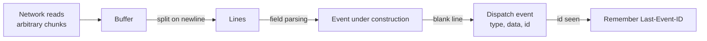

# 📨 01 - Server-Sent Events Deep Dive

Server-Sent Events look trivially simple — lines of `data:` text over an HTTP response — and that simplicity is why every major LLM API streams with them. It is also why subtle bugs survive into production: a JSON payload split across two network reads, a multi-line token that silently becomes two events, a reconnect that replays the whole answer, a browser `EventSource` that can't send an `Authorization` header. Knowing the wire format precisely is what lets you debug a stream with `curl` instead of guessing.

## 🎯 Learning Objectives
- Read and write the **`text/event-stream` wire format**: `data`, `event`, `id`, `retry`, comments
- Implement the **parsing rules** correctly, including chunk boundaries and multi-line data
- Understand **reconnection**: `retry`, `id`, and the `Last-Event-ID` header — and what the server must do to support resumption
- Know the **browser `EventSource` API** and its limits (GET only, no custom headers, connection limits) and when to use `fetch` streaming instead
- Recognize the streaming conventions of **LLM provider APIs**
- Estimate the **overhead** of token-per-event streaming

## Introduction

SSE was standardized with HTML5 as a way for servers to push events to browsers over ordinary HTTP. The server answers a request with `Content-Type: text/event-stream` and **never finishes the response** until it is done; it writes small blocks of text — events — separated by blank lines. On the browser, the `EventSource` object parses them and dispatches them as DOM events, reconnecting automatically if the connection drops.

For LLM streaming, three properties made SSE the default. It is **unidirectional** (server → client), which matches "send a prompt, receive a stream of tokens". It is **plain HTTP**, so it works with existing load balancers, auth, logging, and HTTP/2. And it is **text**, so a stream can be inspected with `curl -N`. The price is that everything on the path must cooperate with a long-lived, incrementally flushed response — the topic of [[02 - SSE in FastAPI and Behind Proxies|the next note]].

---

## 1. The Problem and Why This Solution Exists

### Push over HTTP before SSE

| Technique | How | Problem |
|---|---|---|
| Short polling | Client asks every N seconds | Latency ≈ N/2; wasted requests |
| Long polling | Server holds the request until data exists, then responds; client re-requests | One event per request; reconnection overhead per event |
| Chunked "forever frame" hacks | Infinite HTML with `<script>` tags | Browser-specific, fragile |
| **SSE** | One long `text/event-stream` response, many events | Unidirectional; text only |
| WebSocket | Upgraded bidirectional connection | Separate protocol; more machinery ([[04 - SSE vs WebSockets vs gRPC Streaming|comparison]]) |

SSE formalized the long-lived streaming response with a defined format and built-in reconnection.

---

## 2. Conceptual Deep Dive

### 2.1 The wire format

A stream is UTF-8 text made of **lines**; an **event** is a group of lines terminated by a **blank line**. Each line is `field: value` (one optional space after the colon is stripped):

```text
: this is a comment — ignored by clients, useful as a heartbeat

event: status
data: {"stage": "retrieving"}

event: token
id: 42
data: {"t": "Hello"}

retry: 3000
data: first line
data: second line

```

| Field | Meaning |
|---|---|
| `data` | Payload line; **multiple `data` lines are joined with `\n`** into one event |
| `event` | Event type (default `message`); browsers dispatch to `addEventListener(type, …)` |
| `id` | Sets the stream's **last event ID** (sent back on reconnection) |
| `retry` | Reconnection delay in **milliseconds** for the client |
| `:` comment | Ignored; keeps idle connections alive through proxies |

Rules that cause real bugs:
- An event is dispatched only at the **blank line**. A final event without a trailing blank line is never delivered.
- `data` values **cannot contain newlines** — a newline inside a token must be either JSON-encoded (`"\n"` inside a JSON string) or sent as multiple `data:` lines.
- Network reads can split anywhere — mid-line, mid-UTF-8 character, mid-JSON. Parsers must **buffer until a blank line**, never parse per read.

### 2.2 Reconnection and resumption

If the connection drops, an `EventSource` waits `retry` milliseconds and reconnects, sending the last received `id` in the **`Last-Event-ID`** request header. The protocol only carries the ID; **resuming is the server's job**:

- Keep the stream's events (e.g., the generated tokens with sequence IDs) in a short-lived buffer (Redis, memory with sticky sessions) keyed by stream ID.
- On reconnect with `Last-Event-ID: 42`, replay events 43… and continue.
- If resumption isn't supported, send a terminal event or a fresh start — never silently replay the whole answer on top of what the user already saw.

For LLM answers, true resumption means the **generation itself** must survive the disconnect (running in a background task writing to a buffer), which is more complex than most products need. A common compromise: no resumption, but a clear `error` event and a client-side "regenerate" button.

### 2.3 The browser `EventSource` API and its limits

```javascript
const es = new EventSource("/ask/stream?q=fees");          // GET only
es.addEventListener("token", e => append(JSON.parse(e.data).t));
es.addEventListener("done", () => es.close());             // otherwise it RECONNECTS when the server ends
```

| Limit | Consequence | Workaround |
|---|---|---|
| **GET only**, no request body | Prompts in the query string (length limits, logs) | Use `fetch()` + `ReadableStream` for POST |
| **No custom headers** | Can't send `Authorization: Bearer …` | Cookies, or `fetch()` streaming |
| Auto-reconnects when the server closes the stream | Duplicate generations | Send a `done` event and call `close()` |
| ~6 connections per origin on HTTP/1.1 | Multiple tabs stall | HTTP/2 (multiplexed streams) |

Because of the first two limits, LLM frontends usually consume SSE with **`fetch` streaming** and a small SSE parser (the Vercel AI SDK and provider SDKs do exactly this).

### 2.4 Conventions of LLM APIs

- **OpenAI-compatible** chat streams send `data: {json chunk}` events with incremental `delta`s and end with a sentinel `data: [DONE]`.
- **Anthropic's Messages API** uses named events — `message_start`, `content_block_start`, `content_block_delta`, `content_block_stop`, `message_delta`, `message_stop` — plus `ping` events.

Your own API (P3) should follow the second style: **typed events** (`status`, `token`, `citations`, `retract`, `done`, `error`) are self-describing and let clients ignore what they don't understand.

### 2.5 Overhead

A token event like `event: token\ndata: {"t":"Hello"}\n\n` is about 35 bytes. For an answer of $n$ tokens:

$$
B_{\text{stream}} \approx n \cdot (b_{\text{frame}} + \bar{b}_{\text{token}}) \approx 500 \times 35\,\text{B} \approx 17.5\,\text{KB}
$$

— negligible bandwidth, but **one write and one flush per event**. At high concurrency, coalescing tokens into small groups (e.g., every 20 ms) cuts syscalls without hurting perceived smoothness, since humans read far slower than 50 updates per second.



---

## 3. Production Reality

### Debugging a stream

```bash
curl -N -H "Accept: text/event-stream" -X POST localhost:8000/ask/stream \
     -H "Content-Type: application/json" -d '{"question": "What is the transfer fee?"}'
# -N disables curl's own buffering: you should see events appear progressively.
# If everything arrives at once at the end, something on the path is buffering (next note).
```

### Payload discipline

- **Always JSON-encode** `data` for structured events — it handles newlines and quotes safely.
- Give every event a **type**; reserve `message` for nothing.
- Include **sequence IDs** if you might ever support resumption or need to detect gaps.
- End every stream with a **terminal event** (`done` or `error`) so clients can distinguish "finished" from "connection died".

Caso real: a frequent production bug in chat UIs is the "duplicate answer after completion": the server ends the stream, the browser's `EventSource` treats the end as a dropped connection, reconnects, and the endpoint starts a **second generation** — doubling cost. The fix is a `done` event plus `es.close()`, or not using `EventSource` for one-shot generations.

Caso real: in P3, the `retract` event exists because of the streaming trade-off: tokens are shown before the groundedness check finishes. A typed event lets the client replace the partial answer with an abstention cleanly, instead of the server trying to "unsend" text.

---

## 4. Code in Practice

### Consuming SSE from Python (httpx)

```python
import httpx, json

with httpx.stream("POST", "http://localhost:8000/ask/stream", json={"question": "transfer fee?"},
                  headers={"Accept": "text/event-stream"}, timeout=None) as r:
    event_type, data_lines = "message", []
    for line in r.iter_lines():                 # httpx reassembles lines across network chunks
        if line == "":                          # blank line → dispatch
            if data_lines:
                payload = json.loads("\n".join(data_lines))
                print(event_type, payload)
            event_type, data_lines = "message", []
        elif line.startswith(":"):
            continue                            # heartbeat/comment
        elif line.startswith("event:"):
            event_type = line[6:].strip()
        elif line.startswith("data:"):
            data_lines.append(line[5:].removeprefix(" "))
```

### ❌/✅ Browser client for an LLM answer

```javascript
// ❌ EventSource for a POST-shaped, authenticated, one-shot generation: GET-only, no headers, auto-reconnects
const es = new EventSource(`/ask/stream?q=${encodeURIComponent(question)}`);

// ✅ fetch streaming: POST body, Authorization header, explicit cancellation
const ctrl = new AbortController();
const res = await fetch("/ask/stream", { method: "POST", signal: ctrl.signal,
  headers: { "Content-Type": "application/json", Authorization: `Bearer ${token}` },
  body: JSON.stringify({ question }) });
const reader = res.body.pipeThrough(new TextDecoderStream()).getReader();
// feed chunks into an SSE parser; call ctrl.abort() when the user closes the panel
```

### 📦 Compression code: a spec-faithful SSE parser that survives arbitrary chunking

```python
# 📦 Compression code: parse text/event-stream correctly
# Covers: buffering across chunk boundaries, multi-line data, comments, event types, id, retry
import json
import random

def sse_events(chunks):
    buf, ev = "", {"event": "message", "data": [], "id": None}
    for chunk in chunks:
        buf += chunk
        while "\n" in buf:
            line, buf = buf.split("\n", 1)
            line = line.rstrip("\r")
            if line == "":                                   # blank line: dispatch
                if ev["data"]:
                    yield {"event": ev["event"], "data": "\n".join(ev["data"]), "id": ev["id"]}
                ev = {"event": "message", "data": [], "id": ev["id"]}   # last id persists
                continue
            if line.startswith(":"):
                continue                                     # comment / heartbeat
            field, _, value = line.partition(":")
            value = value[1:] if value.startswith(" ") else value
            if field == "data":
                ev["data"].append(value)
            elif field == "event":
                ev["event"] = value
            elif field == "id":
                ev["id"] = value
            elif field == "retry" and value.isdigit():
                print(f"(client would wait {value} ms before reconnecting)")

stream = (": ping\n\n"
          "event: status\ndata: {\"stage\": \"retrieving\"}\n\n"
          "event: token\nid: 1\ndata: {\"t\": \"Hola\"}\n\n"
          "event: token\nid: 2\ndata: {\"t\": \" mundo\"}\n\n"
          "retry: 3000\ndata: line one\ndata: line two\n\n"
          "event: done\ndata: {\"tokens\": 2}\n\n")
random.seed(1)
cuts = sorted(random.sample(range(1, len(stream)), 25))        # split at arbitrary byte positions
chunks = [stream[i:j] for i, j in zip([0] + cuts, cuts + [len(stream)])]
for e in sse_events(chunks):
    shown = e["data"] if e["event"] == "message" else json.loads(e["data"])
    print(f"{e['event']:<8} id={e['id']}  {shown!r}")
# ¡Sorpresa! JSON was cut mid-object across chunks, yet every event parses — because we only parse at blank lines.
```

---

## 🎯 Key Takeaways
- SSE = one long `text/event-stream` HTTP response; events are `field: value` lines ended by a **blank line**.
- Multiple `data:` lines join with `\n`; JSON-encode payloads so tokens with newlines stay safe.
- Parsers must **buffer across reads** and dispatch only at blank lines.
- `id` + `retry` + `Last-Event-ID` enable reconnection; **resumption is the server's responsibility**.
- Browser `EventSource` is GET-only, header-less, and auto-reconnects — use **`fetch` streaming** for LLM answers.
- Use **typed events** and always end with a terminal event (`done`/`error`).

## References
- WHATWG HTML Living Standard — *Server-sent events* (event stream interpretation)
- MDN Web Docs — `EventSource`, *Using server-sent events*
- OpenAI and Anthropic API documentation — streaming formats
- [[00 - Welcome to LLM Token Streaming|Course welcome]] · [[02 - SSE in FastAPI and Behind Proxies|Next: SSE in FastAPI and Behind Proxies]]
