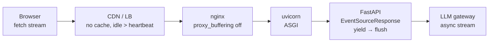

# 🚦 02 - SSE in FastAPI and Behind Proxies

The endpoint streams perfectly with `curl` on your laptop. Deployed behind nginx, a load balancer, or a CDN, the same endpoint delivers the whole answer in one burst after eight seconds — or cuts it off at sixty. Nothing in the code changed; something on the path **buffered** or **timed out**. Serving SSE well is half framework (yield events, flush, heartbeat) and half infrastructure (make every hop pass bytes through immediately and tolerate long-lived responses).

## 🎯 Learning Objectives
- Serve SSE from FastAPI three ways: **native `EventSourceResponse`**, **`sse-starlette`**, and raw **`StreamingResponse`**
- Set the right **headers** and know which middleware can break streaming
- Configure **heartbeats** relative to proxy and load-balancer idle timeouts
- Keep streams flowing through **nginx**, managed load balancers, CDNs, and **Cloud Run**
- Verify progressive delivery with a **real server test**, not just a unit test
- Size concurrency: streams hold connections and instances for their whole duration

## Introduction

A streaming response is a contract between every component on the path: the application must **flush** each event as it is produced; the ASGI server must write it to the socket without batching; every proxy must **forward** bytes instead of collecting the response first; and every component with an idle timeout must see traffic often enough to keep the connection open. Break any link and streaming silently degrades into "slow request/response".

FastAPI makes the application side easy. Recent releases include **native SSE support**: declare `response_class=EventSourceResponse` on a path operation that `yield`s `ServerSentEvent` objects (or plain dicts/models), and FastAPI encodes the wire format, sets `Content-Type: text/event-stream`, `Cache-Control: no-cache`, and `X-Accel-Buffering: no`, and inserts a **keep-alive comment every 15 seconds** of silence — behavior verified on FastAPI 0.142 by reading its source and running the code below. It works with any HTTP method, including `POST`, which matters for LLM requests with large bodies.

The infrastructure side is where P3's final test on **Cloud Run** must be checked: request timeouts, response streaming, instance concurrency, and cold starts.

---

## 1. The Problem and Why This Solution Exists

### Where streams get buffered

| Hop | Default behavior that breaks SSE | Fix |
|---|---|---|
| Application | Building the full string, then returning it | `yield` events from an async generator |
| Compression middleware | Gzip buffers small chunks to compress efficiently | Exclude `text/event-stream` from compression |
| Custom middleware | Reading the whole response body (logging, metrics) | Streaming-aware middleware; don't consume `body_iterator` |
| nginx reverse proxy | `proxy_buffering on` collects upstream responses | `proxy_buffering off` or `X-Accel-Buffering: no` |
| Load balancers / CDNs | Idle timeouts (often ~60 s); some buffer | Heartbeats < idle timeout; disable buffering/caching for the route |
| Serverless platforms | Request timeouts; some buffer responses | Platform streaming support + timeout configuration |

### Why heartbeats exist

Many intermediaries close connections with no traffic for $T_{\text{idle}}$ seconds. Long RAG pre-work (retrieval, grading) or slow generation can produce silent gaps. With heartbeat interval $h$:

$$
h < \min_{\text{hops}} T_{\text{idle}}
\qquad\text{e.g., } h = 15\,\text{s} < 60\,\text{s}
$$

SSE comments (`: ping`) are perfect heartbeats: they reset idle timers and are ignored by clients.

---

## 2. Conceptual Deep Dive

### 2.1 Three ways to serve SSE in FastAPI

| Approach | Encoding | Heartbeats | Notes |
|---|---|---|---|
| **Native** `fastapi.sse.EventSourceResponse` + `ServerSentEvent` | Automatic (data JSON-encoded; `raw_data` for preformatted text) | **Automatic**, every 15 s of silence | Any HTTP method; documented in OpenAPI; validates single-line `event`/`id` |
| `sse-starlette` `EventSourceResponse` | Automatic | `ping` parameter | Mature third-party library; common in older codebases |
| `StreamingResponse(media_type="text/event-stream")` | **Manual** (`f"event: x\ndata: {json}\n\n"`) | Manual | Full control; easiest to get subtly wrong |

### 2.2 Headers

| Header | Value | Why |
|---|---|---|
| `Content-Type` | `text/event-stream` | Identifies SSE; some proxies special-case it |
| `Cache-Control` | `no-cache` | Prevents caches/CDNs from storing or coalescing the response |
| `X-Accel-Buffering` | `no` | Tells nginx not to buffer this response |
| `Connection` | `keep-alive` (HTTP/1.1 only) | Must **not** be sent over HTTP/2 (connection-specific headers are forbidden there) |

### 2.3 nginx in front of the API

```nginx
location /ask/stream {
    proxy_pass         http://rag_api;
    proxy_http_version 1.1;
    proxy_set_header   Connection "";
    proxy_buffering    off;              # pass bytes through as they arrive
    proxy_cache        off;
    proxy_read_timeout 1h;               # allow long-lived responses
    gzip               off;
}
```

### 2.4 Cloud Run (P3's final test)

Cloud Run supports streaming responses over HTTP/1.1 (chunked) and HTTP/2, so SSE works — with platform-level constraints to configure and verify:

| Concern | What to do |
|---|---|
| **Request timeout** | Default 5 minutes, configurable up to 60 minutes; P3 sets ~15 minutes for long answers |
| **Concurrency** | Each open stream occupies a concurrency slot for its whole duration; with concurrency $c$ and $N$ simultaneous streams, instances $\approx \lceil N / c \rceil$ |
| **Cold starts** | The first request to a scaled-to-zero service includes container start + model load — measure **TTFT cold vs warm** separately |
| **Buffering** | Verify progressive delivery end-to-end on the deployed URL (`curl -N`), including through any custom domain or CDN |

⚠️ **Warning:** platform limits and defaults change; check Cloud Run's current documentation for request timeouts and HTTP/2 end-to-end settings before the final test.

### 2.5 Concurrency math

A streaming request lives for its whole generation time $D$ (seconds), not milliseconds. By Little's law, with request rate $\lambda$:

$$
N_{\text{open streams}} = \lambda \cdot D
\qquad 5\ \text{req/s} \times 8\ \text{s} = 40 \text{ simultaneous streams}
$$

That is 40 open connections, 40 concurrency slots, and 40 in-flight upstream LLM calls. Async servers (uvicorn + async generators) handle this with little memory per stream; **blocking** code inside the generator (a synchronous LLM client) would pin threads instead — keep the streaming path fully async.



---

## 3. Production Reality

### Test streaming for real

`TestClient`-style tests that call the app in-process often **collect** the full response, so a test can pass while streaming is broken. Test progressive delivery against a **real server** (uvicorn in a thread or container) and assert that the first event arrives well before the last — the compression code below does exactly that. Then repeat with `curl -N` against the deployed URL.

### Observability for streams

Record **TTFT** (time to first `token` event), total duration, events sent, bytes, and how the stream ended (`done`, `error`, client disconnect). Disconnects are a product signal (users abandoning slow answers) and a cost signal ([[03 - Cancellation, Backpressure and Errors Mid-Stream|next note]]).

Caso real: teams moving LLM chat endpoints behind nginx or an API gateway frequently hit the "everything arrives at the end" bug on day one; the fix is almost always proxy buffering (`proxy_buffering off` / `X-Accel-Buffering: no`) or a compression layer, not the application. Native FastAPI SSE sets the `X-Accel-Buffering` header for you — but a CDN or another proxy may still need configuration.

Caso real: one measurement made while preparing this note — on Windows, creating a **new `httpx` client per request** added ~200–300 ms before the first byte, while a pooled client took ~2 ms. A streaming benchmark that opens a fresh client per request measures client setup, not server TTFT. Reuse clients (and connections) in load tests.

---

## 4. Code in Practice

### Native FastAPI SSE (P3 shape)

```python
import asyncio
from fastapi import FastAPI, Request
from fastapi.sse import EventSourceResponse, ServerSentEvent

app = FastAPI()

@app.post("/ask/stream", response_class=EventSourceResponse)
async def ask_stream(body: dict, request: Request):
    yield ServerSentEvent(event="status", data={"stage": "retrieving"})
    chunks = await retrieve(body["question"])                  # async retrieval
    yield ServerSentEvent(event="status", data={"stage": "generating"})
    i = 0
    async for token in gateway.stream(prompt(body["question"], chunks)):
        yield ServerSentEvent(event="token", id=str(i), data={"t": token})
        i += 1
    yield ServerSentEvent(event="citations", data=[c.citation for c in chunks])
    yield ServerSentEvent(event="done", data={"tokens": i})
```

### The same with a raw StreamingResponse (older FastAPI)

```python
import json
from fastapi.responses import StreamingResponse

def sse(event: str, data, id: str | None = None) -> str:
    head = f"event: {event}\n" + (f"id: {id}\n" if id else "")
    return head + f"data: {json.dumps(data)}\n\n"          # JSON keeps newlines inside the payload

@app.post("/ask/stream-legacy")
async def ask_stream_legacy(body: dict):
    async def gen():
        yield sse("status", {"stage": "retrieving"})
        async for i, token in aenumerate(gateway.stream(body["question"])):
            yield sse("token", {"t": token}, id=str(i))
        yield sse("done", {})
    return StreamingResponse(gen(), media_type="text/event-stream",
                             headers={"Cache-Control": "no-cache", "X-Accel-Buffering": "no"})
```

### ❌/✅ Middleware

```python
# ❌ Logging middleware that reads the whole body: the client receives nothing until the stream ends
@app.middleware("http")
async def log_body(request, call_next):
    resp = await call_next(request)
    body = b"".join([chunk async for chunk in resp.body_iterator])   # consumes the stream
    ...

# ✅ Log metadata only; leave streaming bodies untouched (or wrap the iterator and pass chunks through)
@app.middleware("http")
async def log_meta(request, call_next):
    resp = await call_next(request)
    log.info("path=%s status=%s type=%s", request.url.path, resp.status_code, resp.media_type)
    return resp
```

### 📦 Compression code: prove progressive delivery against a real server

```python
# 📦 Compression code: native FastAPI SSE served by uvicorn, consumed with a pooled httpx client
# Covers: EventSourceResponse + ServerSentEvent, automatic SSE headers, first-event vs last-event timing
# pip install fastapi uvicorn httpx   (FastAPI with fastapi.sse — verified on 0.142)
import asyncio, threading, time
import httpx, uvicorn
from fastapi import FastAPI
from fastapi.sse import EventSourceResponse, ServerSentEvent

app = FastAPI()

@app.post("/ask/stream", response_class=EventSourceResponse)
async def ask_stream(payload: dict):
    yield ServerSentEvent(event="status", data={"stage": "retrieving"})
    await asyncio.sleep(0.3)                                   # pretend retrieval
    for i, t in enumerate(["The", " fee", " is", " 2%."]):
        await asyncio.sleep(0.1)                               # pretend decode steps
        yield ServerSentEvent(event="token", id=str(i), data={"t": t})
    yield ServerSentEvent(event="done", data={"tokens": 4})

server = uvicorn.Server(uvicorn.Config(app, host="127.0.0.1", port=8765, log_level="warning"))
threading.Thread(target=server.run, daemon=True).start()
while not server.started:
    time.sleep(0.05)

with httpx.Client(timeout=None) as client:                     # pooled client: don't measure client setup
    client.get("http://127.0.0.1:8765/docs")                   # warm the connection
    t0, arrivals = time.perf_counter(), []
    with client.stream("POST", "http://127.0.0.1:8765/ask/stream", json={"question": "fee?"}) as r:
        print("headers:", r.headers["content-type"], "| cache-control:", r.headers.get("cache-control"),
              "| x-accel-buffering:", r.headers.get("x-accel-buffering"))
        for line in r.iter_lines():
            if line.startswith("event:"):
                arrivals.append((line[6:].strip(), round((time.perf_counter() - t0) * 1000)))
print(arrivals)
assert arrivals[0][1] < arrivals[-1][1] - 300, "events arrived together — something is buffering"
server.should_exit = True
# ¡Sorpresa! 'status' arrives in a few ms while tokens trickle in 100 ms apart — streaming works end to end.
```

---

## 🎯 Key Takeaways
- FastAPI's native **`EventSourceResponse` + `ServerSentEvent`** handle encoding, SSE headers, and **15 s keep-alive pings**; `sse-starlette` and raw `StreamingResponse` remain valid alternatives.
- Set `Content-Type: text/event-stream`, `Cache-Control: no-cache`, `X-Accel-Buffering: no`; never send `Connection` over HTTP/2.
- Every hop must **not buffer** and must allow long responses: nginx `proxy_buffering off`, compression off for streams, heartbeats below idle timeouts.
- On **Cloud Run**: configure the request timeout, plan concurrency ($N = \lambda D$ open streams), and measure **cold vs warm TTFT**.
- Test progressive delivery against a **real server** and the deployed URL — in-process test clients can hide buffering.
- Keep the streaming path **async** end to end; reuse HTTP clients in benchmarks.

## References
- FastAPI documentation and source — `fastapi.sse` (`EventSourceResponse`, `ServerSentEvent`, keep-alive behavior)
- `sse-starlette` documentation · Starlette `StreamingResponse`
- nginx documentation — `proxy_buffering`, `X-Accel-Buffering`
- Google Cloud Run documentation — request timeouts, concurrency, HTTP/2, streaming responses
- [[01 - Server-Sent Events Deep Dive|Previous: SSE Deep Dive]] · [[03 - Cancellation, Backpressure and Errors Mid-Stream|Next: Cancellation, Backpressure and Errors]]
