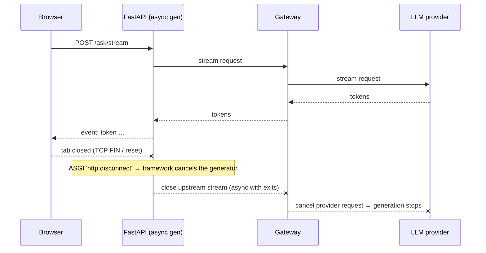
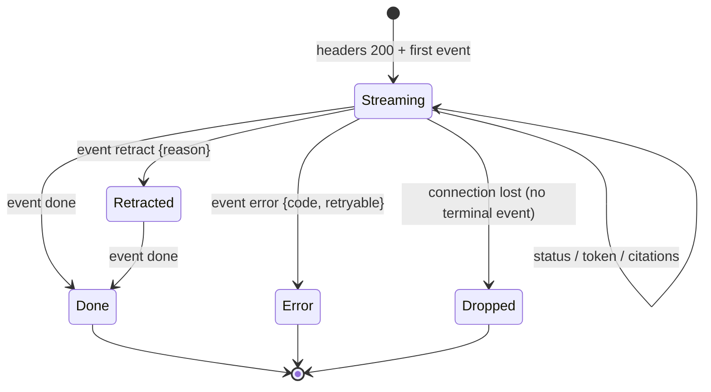

# 🛑 03 - Cancellation, Backpressure and Errors Mid-Stream

A request/response API has two outcomes: success or error, decided before the first byte. A streaming API has a third: **it started fine and then something happened**. The user closed the tab after three sentences — but the model keeps generating 600 more tokens you pay for. The client's network is slow — and the server's buffers quietly fill. The groundedness check fails after the answer is already on screen — but the status code was `200 OK` four seconds ago. Streaming systems are defined by how they handle the middle of the stream.

## 🎯 Learning Objectives
- Detect **client disconnects** and propagate **cancellation** from the browser through the API to the LLM provider
- Quantify the **cost of abandoned streams** and verify that cancellation actually stops generation
- Understand **backpressure** in async streaming: TCP flow control, bounded buffers, and where unbounded queues hide
- Report **errors after headers are sent** with typed `error` events and terminal semantics
- Implement **retraction** (P3's `retract` event) and **stall detection** (per-token timeouts)
- Instrument stream outcomes: done, error, disconnect, retract

## Introduction

In an async Python server, a streaming response is a generator the framework pulls from: each `yield` produces an event that is written to the socket. That simple model has three consequences. First, **cancellation** is possible: when the client disconnects, the ASGI server notifies the application, and the framework can cancel the generator — but only if the code inside it is cancellable and cleans up upstream resources. Second, **backpressure** is natural: if the socket can't accept more data, the write awaits, the generator pauses, and — if the upstream LLM stream is consumed inside the same generator — reading from the provider pauses too. Third, **errors** after the first byte can't change the HTTP status; they must be expressed *in the stream*.

These are not edge cases for LLM products. Users routinely abandon slow answers, mobile clients drop connections, and checks that run after generation (groundedness, moderation) fail on a fraction of responses. P3 handles all three explicitly — cancellation to the gateway, bounded buffering, and typed `error`/`retract` events — because each affects cost, correctness, or trust.

---

## 1. The Problem and Why This Solution Exists

### The cost of not cancelling

If a fraction $a$ of streams are abandoned after, on average, a fraction $f$ of the answer, and generation continues to completion anyway, the wasted output tokens per stream are:

$$
W = a \cdot (1 - f) \cdot \bar{n}_{\text{out}}
\qquad
\text{wasted cost} = W \cdot p_{\text{out}}
$$

With $a = 0.15$, $f = 0.3$, $\bar{n}_{\text{out}} = 500$, that is ~52 wasted output tokens per stream on average — over 10% of output spend — plus upstream GPU/provider capacity that other users needed. Output tokens are typically the most expensive ones ([[../../09 - MLOps y Produccion/45 - Grafana and Latency Engineering for ML Systems/05 - LLM Observability Dashboards|LLM cost model]]).

### The status-code trap

HTTP status and headers are sent **before** the body. Once the first SSE event is written, the response is `200 OK` forever. Any later failure — upstream timeout, provider error, failed post-check — must be communicated as data inside the stream, and clients must treat a stream that ends **without** a terminal event as a failure.

---

## 2. Conceptual Deep Dive

### 2.1 Cancellation path



Each hop must turn "my downstream went away" into "close my upstream":

- **Browser:** `AbortController.abort()` when the user closes the panel or presses *Stop*.
- **API:** the framework cancels the generator on disconnect; code inside must use `async with` (or `try/finally`) so the upstream HTTP stream is closed when cancellation arrives. Polling `await request.is_disconnected()` between events is an extra safety net for long silent phases.
- **Gateway:** propagate the closed connection to the provider call (P3's Go gateway cancels its upstream request context).
- **Provider:** closing the streaming connection is how clients signal cancellation; billing covers tokens generated up to that point.

⚠️ **Warning:** a **synchronous** client inside the generator (or `run_in_executor` without a cancellation hook) cannot be interrupted by async cancellation — the thread keeps reading until the provider finishes. Keep the whole streaming path async.

### 2.2 Backpressure

TCP flow control limits how much unacknowledged data the server can send. When a client reads slowly, the socket send buffer fills, the ASGI server's write awaits, and the generator stops at its next `yield`. If the generator reads the upstream LLM stream **inside the same loop**, the upstream read pauses too — backpressure propagates end to end.

Unbounded queues break this. A common pattern — a background task reads the LLM stream into an `asyncio.Queue()` while the response drains it — has an **unbounded** queue by default: a slow client lets the queue grow without limit. Always bound buffers (`asyncio.Queue(maxsize=…)`, memory streams with `max_buffer_size`). FastAPI's native SSE implementation uses bounded memory streams internally between the generator and the keep-alive inserter.

### 2.3 Errors mid-stream

Model the stream as a small state machine with **exactly one terminal event**:



Error events carry a stable **code** (`upstream_timeout`, `provider_error`, `budget_exceeded`), whether it is **retryable**, and a **request ID** for support — never a stack trace. Clients render partial content as incomplete and offer a retry.

### 2.4 Stall detection

A provider that stops sending tokens without closing the connection leaves the user staring at a frozen answer. Bound the gap between tokens:

$$
\text{stall if } t_{\text{now}} - t_{\text{last token}} > \tau_{\text{stall}}
\qquad (\text{e.g., } \tau_{\text{stall}} = 10\,\text{s})
$$

and the total duration (a **deadline** for the whole stream). On stall, cancel upstream and emit `error` with `upstream_stall`.

### 2.5 Retraction

P3 streams tokens **before** the groundedness check completes (to minimize TTFT). If the check fails, the server emits `event: retract` with a reason, then the safe replacement (an abstention), then `done`. The alternative — check first, then stream — removes retractions but raises TTFT by the check's duration. Measure both and choose; the event protocol supports either.

---

## 3. Production Reality

### Measuring stream outcomes

| Metric | Why |
|---|---|
| Outcome counts: `done`, `error{code}`, `retract{reason}`, `client_disconnect`, `dropped` | Health and UX of streaming |
| Tokens generated after disconnect | **Cancellation is actually working** (should be ~0) |
| Disconnect time vs TTFT | Users leaving before the first token → TTFT problem |
| Stall errors by provider/model | Provider reliability |
| Retract rate | Grounding quality (and how often users see text disappear) |

### Verify cancellation, don't assume it

Write a test where the client disconnects after a few tokens and assert that the server-side generator stops — the compression code below does this against a real server. Repeat end-to-end against the gateway in the integration environment: watch the gateway's token counter stop when the browser aborts.

Caso real: LLM product teams commonly discover in their first cost review that a noticeable share of output tokens were generated for users who had already navigated away — because the frontend never aborted the request or the backend used a synchronous client that ignored disconnects. Propagating cancellation is one of the cheapest cost optimizations available.

Caso real: in P3, the gateway's per-run **budget cap** produces a third kind of mid-stream ending: when the final test's budget is exhausted, the gateway fails the call, and the API emits `error{code: "budget_exceeded", retryable: false}` — the stream state machine makes even this operational guardrail visible and testable.

---

## 4. Code in Practice

### Cancellation-safe streaming with stall detection

```python
import asyncio, time
from fastapi import Request
from fastapi.sse import EventSourceResponse, ServerSentEvent

STALL_S, DEADLINE_S = 10.0, 120.0

@app.post("/ask/stream", response_class=EventSourceResponse)
async def ask_stream(body: dict, request: Request):
    started, n = time.monotonic(), 0
    try:
        async with gateway.stream(prompt(body)) as upstream:      # closed on cancellation → provider cancels
            tokens = upstream.__aiter__()
            while True:
                if time.monotonic() - started > DEADLINE_S:
                    yield ServerSentEvent(event="error", data={"code": "deadline", "retryable": True})
                    return
                try:
                    async with asyncio.timeout(STALL_S):           # Python 3.11+
                        token = await anext(tokens)
                except StopAsyncIteration:
                    break
                except TimeoutError:
                    yield ServerSentEvent(event="error", data={"code": "upstream_stall", "retryable": True})
                    return
                n += 1
                yield ServerSentEvent(event="token", id=str(n), data={"t": token})
        verdict = await groundedness_check(...)
        if not verdict.ok:
            yield ServerSentEvent(event="retract", data={"reason": "not_grounded"})
            yield ServerSentEvent(event="token", data={"t": ABSTENTION_MESSAGE})
        yield ServerSentEvent(event="done", data={"tokens": n})
    except asyncio.CancelledError:
        metrics.stream_outcome.labels("client_disconnect").inc()
        raise                                                    # never swallow cancellation
```

### ❌/✅ Buffering between producer and response

```python
# ❌ Unbounded queue: a slow client lets the producer read the whole LLM answer into memory
q = asyncio.Queue()

# ✅ Bounded: when the client is slow, the producer waits → backpressure reaches the LLM stream
q = asyncio.Queue(maxsize=8)
```

### 📦 Compression code: prove that a client disconnect stops generation

```python
# 📦 Compression code: client reads 5 tokens and disconnects; the server-side generator must stop
# Covers: ASGI disconnect → generator cancellation, try/finally cleanup, wasted-token accounting
# pip install fastapi uvicorn httpx
import asyncio, threading, time
import httpx, uvicorn
from fastapi import FastAPI
from fastapi.sse import EventSourceResponse, ServerSentEvent

app = FastAPI()
stats = {"generated": 0, "cancelled": False, "cleaned_up": False}

async def fake_llm(n: int = 50):                 # stands in for the gateway's async token stream
    try:
        for i in range(n):
            await asyncio.sleep(0.05)
            stats["generated"] += 1
            yield f"tok{i} "
    except asyncio.CancelledError:
        stats["cancelled"] = True                # an upstream HTTP stream would be closed here
        raise
    finally:
        stats["cleaned_up"] = True

@app.post("/ask/stream", response_class=EventSourceResponse)
async def ask_stream(payload: dict):
    async for t in fake_llm():
        yield ServerSentEvent(event="token", data={"t": t})
    yield ServerSentEvent(event="done", data={})

server = uvicorn.Server(uvicorn.Config(app, host="127.0.0.1", port=8767, log_level="warning"))
threading.Thread(target=server.run, daemon=True).start()
while not server.started:
    time.sleep(0.05)

with httpx.Client(timeout=None) as c:
    with c.stream("POST", "http://127.0.0.1:8767/ask/stream", json={}) as r:
        got = 0
        for line in r.iter_lines():
            if line.startswith("event: token"):
                got += 1
                if got == 5:
                    break                        # user closes the tab
time.sleep(1.0)                                  # give the server time to notice
print(f"client read {got} | server generated {stats['generated']} of 50 | "
      f"cancelled={stats['cancelled']} cleaned_up={stats['cleaned_up']}")
server.should_exit = True
# ¡Sorpresa! The server stopped right after the disconnect — 45 tokens never generated, never billed.
```

---

## 🎯 Key Takeaways
- Streams have a third outcome — **failure after a `200`** — so every stream must end with exactly one terminal event (`done`/`error`), and clients must treat a missing one as failure.
- **Propagate cancellation** browser → API → gateway → provider; abandoned streams otherwise waste a measurable share of output spend.
- Keep the streaming path **async** and use `async with`/`try/finally` so cancellation closes upstream resources; never swallow `CancelledError`.
- **Backpressure** works through TCP and awaits — unless you introduce **unbounded queues**; always bound buffers.
- Detect **stalls** (per-token timeout) and enforce a **deadline**; report them as typed, retryable errors.
- **Retraction** lets you stream before post-checks finish; measure retract rate vs the TTFT cost of checking first.
- Verify cancellation with a test that disconnects mid-stream and asserts generation stopped.

## References
- ASGI specification — HTTP disconnect events · Starlette/FastAPI streaming responses and `Request.is_disconnected()`
- Python documentation — `asyncio.timeout`, task cancellation semantics
- MDN Web Docs — `AbortController`, Streams API
- [[02 - SSE in FastAPI and Behind Proxies|Previous: SSE in FastAPI and Behind Proxies]] · [[04 - SSE vs WebSockets vs gRPC Streaming|Next: SSE vs WebSockets vs gRPC Streaming]]
