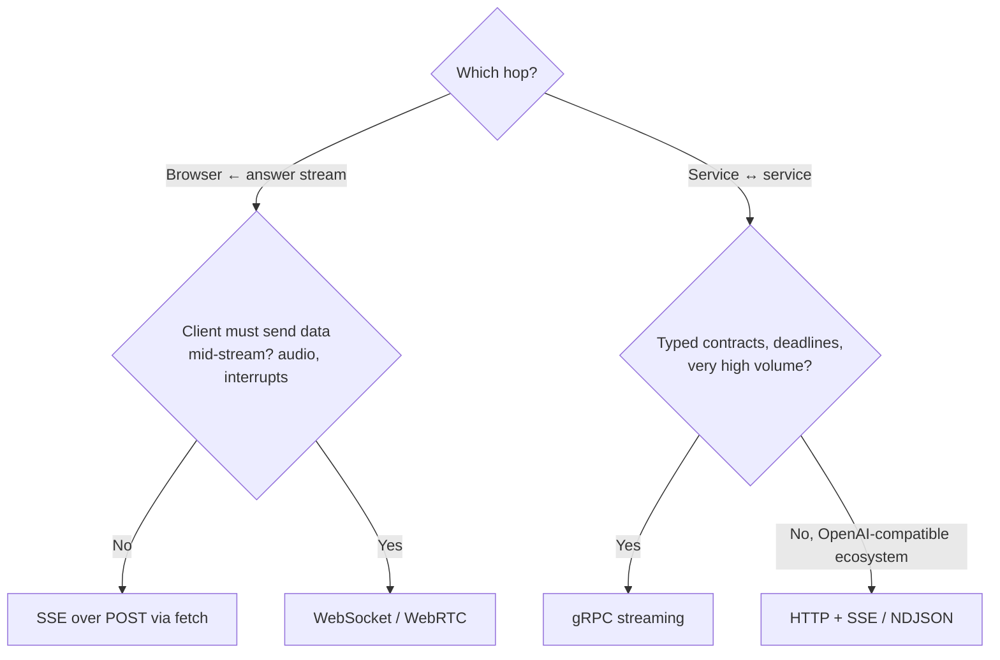

# ⚖️ 04 - SSE vs WebSockets vs gRPC Streaming

Three protocols can stream LLM tokens, and each is the best choice somewhere. SSE wins in the browser for "send a prompt, watch the answer appear". WebSockets win when the client must talk back mid-stream — interrupt the model, send audio, collaborate live. gRPC streaming wins between services, where typed contracts, deadlines, and cancellation matter more than browser support. Picking the wrong one doesn't fail on day one; it fails when you add a proxy, a second region, or a mobile client.

## 🎯 Learning Objectives
- Compare **SSE, WebSockets, and gRPC streaming** on direction, transport, browser support, proxies, auth, reconnection, cancellation, and backpressure
- Estimate **framing overhead** per token for each protocol
- Know the related formats you will meet: **NDJSON streaming**, **gRPC-Web/Connect**, **MCP Streamable HTTP**, WebRTC for realtime voice
- Choose a protocol per **hop** of an LLM system (browser ↔ API, API ↔ gateway, gateway ↔ inference)
- Defend P3's choices in an interview

## Introduction

All three protocols deliver a sequence of messages over a long-lived connection, but they sit at different layers. **SSE** is a response format over ordinary HTTP — one direction, text, built-in reconnection. **WebSocket** (RFC 6455) upgrades an HTTP connection into a persistent, full-duplex channel of binary or text frames — two directions, no built-in semantics. **gRPC** runs typed RPCs over HTTP/2 with Protocol Buffers and supports server-, client-, and bidirectional streaming, with deadlines and cancellation as first-class concepts.

LLM systems usually involve several hops, and the right protocol can differ per hop. In P3, the browser receives **SSE** from the FastAPI service; the API calls the Go gateway with an **OpenAI-compatible SSE** stream; the gateway talks to Ollama locally (which streams **NDJSON**) or to Anthropic (**SSE** with typed events). The vault's [[../30 - WebSockets and Real-Time ML/00 - Welcome to WebSockets and Real-Time ML|WebSockets]] and [[../31 - FastAPI for ML/07 - gRPC and Inter-Service Communication|gRPC]] notes cover each protocol in depth; this note is the decision.

---

## 1. The Problem and Why This Solution Exists

### Requirements differ by hop

| Hop | Typical requirements |
|---|---|
| Browser ↔ API | Works through corporate proxies and CDNs; simple auth (cookies/headers); reconnection; easy debugging |
| Mobile app ↔ API | Flaky networks; resumption; battery |
| Interactive voice/agent UI ↔ API | **Bidirectional**: user interrupts, sends audio, tool confirmations mid-stream |
| API ↔ gateway / model server | Typed contracts, **deadlines**, **cancellation**, efficient framing, many concurrent streams |

No single protocol is best at all four, which is why mature LLM platforms use more than one.

---

## 2. Conceptual Deep Dive

### 2.1 The comparison

| Dimension | **SSE** | **WebSocket** | **gRPC streaming** |
|---|---|---|---|
| Direction | Server → client | Full duplex | Server, client, or bidi streaming |
| Transport | HTTP/1.1 or HTTP/2 response | HTTP/1.1 Upgrade (or HTTP/2 extended CONNECT) | HTTP/2 (required) |
| Payload | UTF-8 text events | Text or binary frames | Protobuf messages (binary) |
| Browser support | Native `EventSource`; `fetch` streaming | Native `WebSocket` | ❌ native; via gRPC-Web / Connect + proxy |
| Proxies/CDNs | Plain HTTP (needs no-buffering) | Must support Upgrade; often special config | Must support HTTP/2 end to end (trailers) |
| Auth | Headers/cookies (fetch), cookies (EventSource) | Cookies or first-message token; no custom headers in browser API | Metadata (headers), mTLS |
| Reconnection | **Built in** (`retry`, `Last-Event-ID`) | Manual | Manual (retry policies) |
| Cancellation | Close the connection / abort fetch | Close frame / app message | **First-class** (context cancel propagates) |
| Deadlines | App-level | App-level | **First-class** (propagated deadlines) |
| Backpressure | TCP | TCP (app must avoid unbounded sends) | HTTP/2 **flow control** per stream |
| Debugging | `curl -N` | Specialized tools | `grpcurl`, reflection |
| Statefulness at scale | Stateless requests | Long-lived stateful connections (sticky routing, connection draining) | Long-lived HTTP/2 connections (LB must balance per request, L7) |

### 2.2 Framing overhead per token

For a token payload of $b$ bytes, rough per-message overhead:

$$
\text{SSE} \approx \underbrace{|\texttt{event: token\textbackslash n}| + |\texttt{data: }| + |\{\texttt{"t":""}\}| + 2}_{\approx 30\text{ B}} + b
\qquad
\text{WS} \approx 2\text{–}14\,\text{B} + b_{\text{json}}
\qquad
\text{gRPC} \approx 5 + 9_{\text{HTTP/2 frame}} + b_{\text{proto}}
$$

For a 500-token answer, the differences are a few kilobytes — irrelevant to users. Overhead matters only at **service-to-service** scale (millions of streams), where binary framing and HTTP/2 multiplexing also reduce CPU and connection counts.

### 2.3 Related formats

- **NDJSON streaming** (newline-delimited JSON over a chunked HTTP response): used by Ollama and some inference servers; simpler than SSE (no event types, no reconnection semantics).
- **gRPC-Web / Connect**: bring gRPC-style APIs to browsers through a proxy or a compatible server; useful when the whole stack is already protobuf.
- **MCP Streamable HTTP**: the Model Context Protocol's HTTP transport uses POST requests with SSE responses for streaming server messages — another reason SSE-over-POST support (FastAPI native SSE) matters.
- **WebRTC / realtime APIs**: low-latency audio for voice agents typically use WebRTC or WebSockets, not SSE, because the client streams audio continuously and must interrupt the model.

### 2.4 Decision per hop



---

## 3. Production Reality

### P3's choices, defended

| Hop | Protocol | Why |
|---|---|---|
| Browser ↔ RAG API | **SSE over POST** (fetch streaming) | One-directional answer stream; plain HTTP through Cloud Run; typed events (`status`, `token`, `citations`, `retract`, `done`); trivial to debug |
| RAG API ↔ Go gateway | **OpenAI-compatible HTTP + SSE** | Every SDK and provider speaks it; the gateway can swap Ollama/Haiku/mock without changing the API |
| Gateway ↔ Ollama | **NDJSON** (Ollama's native stream) | What the local runtime offers; the gateway normalizes it |
| Gateway ↔ Anthropic | **SSE** with Anthropic's typed events | Provider protocol |
| P2 router ↔ P3 | Plain request/response (`POST /ask`) | No streaming needed for routing decisions |

Where gRPC would enter: if P3 scaled to a self-hosted inference tier (e.g., Triton or vLLM behind an internal gRPC API) with strict deadlines and very high stream counts. Where WebSockets would enter: a voice interface or an agent UI where users interrupt generation and confirm tool calls mid-stream.

### Operational notes

- **WebSockets at scale** need sticky routing or a pub/sub backplane, connection draining during deploys, and explicit heartbeats/reconnection — more machinery than SSE for a one-way stream ([[../30 - WebSockets and Real-Time ML/03 - Scaling WebSockets for ML Services|Scaling WebSockets]]).
- **gRPC behind load balancers** must be balanced per request (L7), not per connection, or one long-lived HTTP/2 connection pins all traffic to one backend.
- **SSE through HTTP/2** avoids the browser's ~6-connections-per-origin limit of HTTP/1.1.

Caso real: OpenAI- and Anthropic-style APIs standardized on SSE for text streaming, which is why the whole LLM tooling ecosystem (SDKs, gateways like LiteLLM and Portkey, the Vercel AI SDK) speaks it — choosing SSE for your own API means every client library already knows how to consume it. Realtime voice products, by contrast, moved to WebSockets/WebRTC because the client continuously sends audio and interrupts the model.

Caso real: inference platforms that serve many models internally (Triton, KServe's gRPC protocol) expose gRPC for service-to-service traffic because deadlines, cancellation, and binary tensors are first-class there — and put an HTTP/SSE edge in front for browsers.

---

## 4. Code in Practice

### The same token stream in three protocols (server side, sketches)

```python
# SSE (FastAPI native) — browser-facing
@app.post("/ask/stream", response_class=EventSourceResponse)
async def sse_stream(body: dict):
    async for t in gateway.stream(body["question"]):
        yield ServerSentEvent(event="token", data={"t": t})

# WebSocket (FastAPI) — bidirectional: the client can send {"type": "stop"} mid-stream
@app.websocket("/ws/ask")
async def ws_stream(ws: WebSocket):
    await ws.accept()
    req = await ws.receive_json()
    gen = gateway.stream(req["question"])
    stop = asyncio.create_task(ws.receive_json())          # listen for interrupts while streaming
    async for t in gen:
        if stop.done() and stop.result().get("type") == "stop":
            break
        await ws.send_json({"type": "token", "t": t})
    await ws.send_json({"type": "done"})
```

```protobuf
// gRPC — service-to-service, server streaming with deadlines and cancellation built in
service Generator {
  rpc Stream (GenerateRequest) returns (stream Token);
}
message GenerateRequest { string prompt = 1; uint32 max_tokens = 2; }
message Token { string text = 1; uint32 index = 2; }
```

### ❌/✅ Protocol choice

```text
❌ WebSocket for a one-way answer stream in a web app: sticky sessions, manual reconnection,
   special proxy config — all to send data in one direction.
✅ SSE over POST (fetch) for the answer; add a WebSocket only when the client must talk back mid-stream.

❌ SSE between internal services at very high volume with strict deadlines.
✅ gRPC server streaming: typed messages, propagated deadlines, cancellation, HTTP/2 flow control.
```

### 📦 Compression code: bytes on the wire and a per-hop chooser

```python
# 📦 Compression code: framing overhead per token and a requirements-based protocol chooser
# Covers: SSE vs WebSocket vs gRPC framing for a 500-token answer; decision per hop
import json

tokens = [" the", " fee", " for", " international", " transfers", " is", " 2", "%."] * 63   # ~500 tokens

def sse_bytes(t): return len(f"event: token\ndata: {json.dumps({'t': t})}\n\n".encode())
def ws_bytes(t):
    payload = len(json.dumps({"type": "token", "t": t}).encode())
    return payload + (2 if payload < 126 else 4) + 4          # header (+4 mask bytes client→server only; upper bound)
def grpc_bytes(t):
    proto = 2 + len(t.encode()) + 2                            # field tags + varints (approx.)
    return 9 + 5 + proto                                       # HTTP/2 DATA frame + gRPC length prefix

for name, fn in (("SSE", sse_bytes), ("WebSocket", ws_bytes), ("gRPC", grpc_bytes)):
    total = sum(fn(t) for t in tokens)
    print(f"{name:<9} {total/1024:6.1f} KB for {len(tokens)} tokens ({total/len(tokens):4.1f} B/token)")

def choose(hop: str, client_sends_mid_stream: bool, browser: bool, strict_deadlines: bool) -> str:
    if browser and client_sends_mid_stream:
        return "WebSocket (or WebRTC for audio)"
    if browser:
        return "SSE over POST (fetch streaming)"
    if strict_deadlines:
        return "gRPC streaming"
    return "HTTP + SSE/NDJSON (OpenAI-compatible)"

for hop, args in {"browser → RAG API": (False, True, False), "voice agent UI": (True, True, False),
                  "API → gateway": (False, False, False), "gateway → GPU tier": (False, False, True)}.items():
    print(f"{hop:<20} → {choose(hop, *args)}")
# ¡Sorpresa! SSE ≈ 1.5× gRPC per token, and WebSocket with a JSON envelope is no smaller than SSE —
# for a 500-token answer every option is under ~20 KB. Choose by semantics, not bytes.
```

---

## 🎯 Key Takeaways
- **SSE**: one-way, plain HTTP, built-in reconnection, debuggable with `curl` — the default for browser answer streams (use `fetch` for POST/auth).
- **WebSocket**: full duplex — choose it when the client must send data mid-stream (interrupts, audio, live collaboration); budget for stateful scaling.
- **gRPC streaming**: typed, HTTP/2, deadlines and cancellation built in — the default for high-volume service-to-service streams.
- Framing overhead differs by a few bytes per token — irrelevant per answer, relevant at fleet scale.
- Choose **per hop**; P3 uses SSE to the browser, OpenAI-compatible SSE to the gateway, NDJSON/SSE to runtimes and providers.
- Related formats you will meet: **NDJSON**, **gRPC-Web/Connect**, **MCP Streamable HTTP**, **WebRTC**.

## References
- WHATWG HTML — Server-sent events · RFC 6455 — The WebSocket Protocol · RFC 8441 — WebSockets over HTTP/2
- gRPC documentation — core concepts, streaming, deadlines, cancellation · Connect protocol documentation
- Model Context Protocol specification — Streamable HTTP transport
- Ollama API documentation — streaming responses (NDJSON)
- [[03 - Cancellation, Backpressure and Errors Mid-Stream|Previous: Cancellation, Backpressure and Errors]] · [[00 - Welcome to LLM Token Streaming|Course welcome]]
