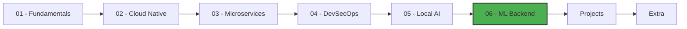

# 🐹 Welcome to Go Engineering

Welcome to the **Go Engineering** track — a comprehensive, English-language learning path designed to transform you into a job-ready Go developer with a focus on **Machine Learning infrastructure**, **Cloud Native systems**, and **Local AI tooling**.

Go is the language of the cloud. Docker, Kubernetes, Terraform, Istio, and Ollama are all written in Go. For an aspiring ML/AI Engineer, Go offers a unique edge: it bridges the gap between Python-centric research and production-grade infrastructure. You will learn to build APIs, microservices, CLI tools, and AI agents — all with the simplicity and performance that make Go the language of choice for companies like Google, Uber, Netflix, and Stripe.

---

## 🎯 Why Go for ML/AI Engineering?

| Advantage | Explanation |
|-----------|-------------|
| **Performance** | Compiles to native machine code. No interpreter, no GIL. |
| **Concurrency** | Goroutines handle thousands of connections with minimal memory (~2KB each). |
| **Single Binary** | Deploy one file. No dependency hell. |
| **Cloud Native** | The entire Kubernetes ecosystem is Go. |
| **Local AI** | Ollama — the most popular local LLM tool — is written in Go. |
| **Job Market** | High demand for Go backend engineers who understand ML pipelines. |

---

## 📚 Course Structure

### Core Courses

| # | Course | Focus | Notes |
|---|--------|-------|-------|
| 01 | [[02 - Go Engineering/01 - Go Fundamentals/00 - Welcome\|👋 Go Fundamentals]] | Language basics, types, concurrency, modules | 7 notes |
| 02 | [[02 - Go Engineering/02 - Go for Cloud Native/00 - Welcome\|☁️ Go for Cloud Native]] | Docker, Kubernetes, gRPC, IaC, observability | 7 notes |
| 03 | [[02 - Go Engineering/03 - Microservices with Go/00 - Welcome\|🔌 Microservices with Go]] | APIs, auth, databases, testing, resilience | 7 notes |
| 04 | [[02 - Go Engineering/04 - DevSecOps and CLI Tools/00 - Welcome\|🛡️ DevSecOps and CLI Tools]] | Cobra, security, CI/CD, container hardening | 7 notes |
| 05 | [[02 - Go Engineering/05 - Local AI with Go/00 - Welcome\|🤖 Local AI with Go]] | Ollama, chatbots, RAG, Wails, edge AI | 7 notes |
| 06 | [[02 - Go Engineering/06 - Go for ML Backend/00 - Welcome\|⚙️ Go for ML Backend]] | ONNX, model serving, feature stores, gateways | 7 notes |

### Deep Content Expansion

| # | Course | Focus | Notes |
|---|--------|-------|-------|
| 07 | [[02 - Go Engineering/07 - Gorgonia - Deep Learning in Go/00 - Welcome to Gorgonia\|🧠 Gorgonia — Deep Learning in Go]] | Tensors, autodiff, neural networks, GPU, PyTorch comparison | 6 notes |
| 08 | [[02 - Go Engineering/07 - LocalAI - Local LLM Server/00 - Welcome to LocalAI\|🤖 LocalAI — Local LLM Server]] | Local LLMs, image gen, audio, API compatibility, enterprise deploy | 6 notes |
| 09 | [[02 - Go Engineering/07 - Wails - Desktop Apps with Go/00 - Welcome to Wails\|🖥️ Wails — Desktop Apps with Go]] | Go-JS bridge, cross-platform, native APIs, production packaging | 6 notes |

### Practical Tracks

| Track | Description |
|-------|-------------|
| [[00 - Go Project Planning Guide\|📋 projects/]] | Step-by-step project guides to build your portfolio |
| [[00 - Welcome to Go Extra\|👋 extra/]] | Advanced topics: GC internals, eBPF, WASM, performance tuning |

---

## 🏗️ Recommended Learning Path

**Phase 1 (Weeks 1-2):** Complete Fundamentals + Cloud Native
**Phase 2 (Weeks 3-4):** Microservices + DevSecOps
**Phase 3 (Weeks 5-6):** Local AI + ML Backend
**Phase 4 (Weeks 7-8):** Build 2-3 portfolio projects from the `projects/` folder
**Phase 5 (Ongoing):** Dive into `extra/` topics as needed

---

## 🎓 Capstone Project

By the end of this track, you will build a **production-ready ML Gateway in Go** that:

1. Accepts inference requests via REST and gRPC
2. Routes requests to multiple model backends (Ollama, ONNX Runtime)
3. Implements rate limiting, authentication, and request validation
4. Collects metrics with Prometheus and traces with OpenTelemetry
5. Deploys to Kubernetes with Helm charts
6. Includes comprehensive tests and CI/CD pipelines

This project will be the **centerpiece of your portfolio** when applying for ML Engineer roles.

---

## 🔗 Related Tracks

- [[../../ML and IA Engineering/Welcome\|🧠 ML and IA Engineering]] — Deep learning, LLMs, MLOps
- [[../extra/00 - Welcome to Software Engineering Extra\|⚡ Software Engineering Extra]] — FastAPI, System Design, Testing, CI/CD
- [[00 - Welcome to Transversal Skills\|🌉 Transversal Skills]] — Technical English, Communication, Leadership

---

## 📖 Official Resources

| Resource | URL | Why It Matters |
|----------|-----|----------------|
| Go Documentation | https://go.dev/doc/ | The official Go learning center |
| Go by Example | https://gobyexample.com/ | Quick, hands-on Go patterns |
| Effective Go | https://go.dev/doc/effective_go | Idiomatic Go writing style |
| Gin Web Framework | https://gin-gonic.com/ | Fast HTTP web framework |
| Ollama | https://ollama.com/ | Run LLMs locally |
| Kubernetes | https://kubernetes.io/ | Container orchestration |
| gRPC Go | https://grpc.io/docs/languages/go/ | High-performance RPC |

---

> **💡 Tip:** Go has only 25 keywords. You can learn the entire language syntax in a weekend. Mastering the ecosystem — concurrency, tooling, and cloud patterns — takes longer, but the payoff is enormous for ML infrastructure roles.

> **⚠️ Warning:** Do not skip the fundamentals. Go's simplicity can be deceptive. Understanding goroutines, channels, and the memory model is essential before building production systems.
