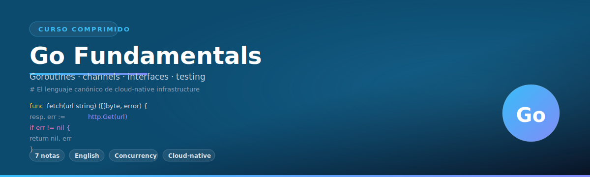
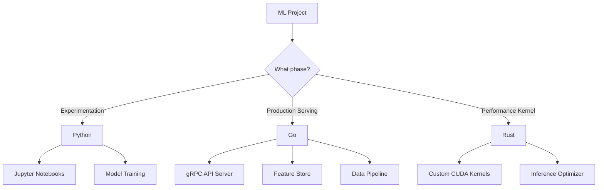

# 👋 Welcome to Go Fundamentals

## 🎯 Learning Objectives

By completing this course, you will master:

- **Core Go Syntax** - Variables, types, control flow, and the philosophical minimalism behind each design choice
- **Memory Model Understanding** - How Go manages memory, zero values, and stack vs heap allocation for ML workloads
- **Concurrency Mastery** - Goroutines, channels, and sync primitives for parallelizing inference pipelines
- **Interface-Driven Design** - Building polymorphic ML systems without inheritance hierarchies
- **Production Patterns** - Error handling, package management, and tooling for deployable ML services
- **Performance Optimization** - Profiling, benchmarking, and writing cache-friendly code for feature stores

---

## Introduction

Machine learning engineering has evolved beyond Jupyter notebooks and Python scripts. Modern ML systems require infrastructure that scales horizontally across thousands of cores, handles millions of inference requests per second, and maintains strict latency guarantees. This is where Go excels.

While Python dominates model training and experimentation with libraries like PyTorch and scikit-learn, Go has emerged as the language of choice for the infrastructure layer: model serving, feature stores, data pipelines, and orchestration systems. Kubernetes, Docker, TensorFlow Serving, and distributed databases like CockroachDB are all written in Go.

This course is designed specifically for ML engineers who already understand Python and want to add Go to their toolkit. Every concept is taught through the lens of ML infrastructure: you will learn Go not as an academic exercise, but as a practical tool for building systems that serve models in production.

---

## Module 1: Why Go for ML Engineers

### 1.1 Theoretical Foundation

The fundamental problem Go solves for ML engineers is the **gap between experimentation and production**. Python is excellent for rapid prototyping: you can load a model, transform data, and get results in a few lines of code. However, Python's Global Interpreter Lock (GIL), dynamic typing, and interpreter overhead make it unsuitable for high-throughput serving infrastructure.

Go was designed at Google in 2007 to address exactly this class of problems. The original motivation was to replace C++ in Google's massive distributed systems, where build times stretched to hours and the language complexity made code review inefficient. The result was a language that compiles to native binaries in seconds, has built-in concurrency primitives, and enforces simplicity through a small specification.

For ML engineering specifically, Go offers:

1. **Predictable Performance** - No garbage collector pauses exceeding 1ms in production Go programs. Critical for latency-sensitive inference.
2. **True Parallelism** - Goroutines schedule across CPU cores without a GIL. Your data preprocessing scales linearly with cores.
3. **Static Typing** - Type errors caught at compile time, not at 3 AM during serving.
4. **Single Binary Deployment** - No dependency hell. One `COPY --from=builder` in your Dockerfile.
5. **Interface-Based Polymorphism** - Swap model implementations without refactoring entire codebases.

### 1.2 Mental Model

```
┌─────────────────────────────────────────────────────────────────┐
│                  ML SYSTEM ARCHITECTURE                         │
├─────────────────────────────────────────────────────────────────┤
│                                                                 │
│  ┌─────────────┐    ┌─────────────┐    ┌─────────────┐         │
│  │   Python    │    │     Go      │    │   Python    │         │
│  │  Training   │───▶│  Serving    │◀───│  Monitoring │         │
│  │  Pipeline   │    │  Infrastructure│   │  Pipeline   │         │
│  └─────────────┘    └─────────────┘    └─────────────┘         │
│        │                   │                   │                │
│        ▼                   ▼                   ▼                │
│  ┌─────────────┐    ┌─────────────┐    ┌─────────────┐         │
│  │  Model Artifacts │ │  gRPC API   │    │ Prometheus  │         │
│  │  (.pt, .onnx)│   │  Feature Store│   │  Metrics    │         │
│  └─────────────┘    └─────────────┘    └─────────────┘         │
│                                                                 │
└─────────────────────────────────────────────────────────────────┘
```

### 1.3 Go vs Python vs Rust for ML Infrastructure

| Characteristic | Go | Python | Rust |
|---------------|-----|--------|------|
| **Compilation** | Native binary (2-5s) | Interpreted | Native binary (30-120s) |
| **Concurrency Model** | Goroutines (lightweight) | asyncio/threading (GIL-bound) | async/await + threads |
| **Type System** | Static, explicit | Dynamic, duck | Static, ownership |
| **Memory Management** | Garbage collected | Reference counted | Manual/RAII |
| **Learning Curve** | Low (25 keywords) | Very Low | High (borrow checker) |
| **ML Ecosystem** | Serving-focused (TF Serving, ONNX Runtime) | Training-focused (PyTorch, sklearn) | Emerging (Candle, Burn) |
| **Compilation Time** | Seconds | N/A | Minutes |
| **Binary Size** | ~10-20 MB | N/A | ~5-15 MB |
| **Use Case** | Infrastructure, APIs, pipelines | Training, notebooks, EDA | Performance-critical kernels |

### 1.4 Visual Representation


**When to use each language:**



### 1.5 Application in ML/AI Systems

**Real-world example: Uber's Michelangelo Platform**

Uber's ML platform uses Go for its model serving layer. Their inference service handles over 1 million requests per second for features like ETA prediction and surge pricing. Python handles model training in Jupyter notebooks, but the trained model is serialized and loaded into a Go service that exposes a gRPC API. The Go service uses goroutines to handle concurrent requests, channels for internal communication between feature extraction and model inference, and interfaces to support swapping between TensorFlow, PyTorch, and XGBoost models without changing the serving infrastructure.

**Why Go over Python here?** Python's GIL would serialize inference requests, and the interpreter overhead would add 10-20ms latency per request. Go's compiled nature and true parallelism reduce p99 latency from 100ms to under 5ms.

### 1.6 Common Pitfalls

⚠️ **Warning 1:** Do not try to rewrite your PyTorch training code in Go. The Python ML ecosystem is not replicated in Go. Use Go for infrastructure around your models, not for model training itself.

⚠️ **Warning 2:** Go is not a replacement for Python in data science workflows. Pandas, Matplotlib, and Jupyter have no Go equivalents with comparable ecosystem depth. Use the right tool for the right job.

💡 **Tip:** Start with a hybrid architecture. Train models in Python, export to ONNX or TorchScript, and serve in Go. This gives you the best of both worlds: Python's rich ML ecosystem and Go's production-grade serving performance.

---

## Module 2: Prerequisites and Learning Path

### 2.1 Theoretical Foundation

Go was intentionally designed to be learnable by engineers who are not programming language experts. The language specification fits on a single page, and the standard library provides everything needed for production systems without external dependencies. This is a deliberate contrast to C++, where the specification exceeds 1,500 pages, or Java, where understanding the full ecosystem requires knowledge of dozens of frameworks.

For ML engineers, the prerequisite is not deep programming knowledge but rather an understanding of **systems thinking**: how data flows through a pipeline, what happens when a request arrives at a server, and why latency and throughput matter. If you have built a Flask API in Python or used Docker to containerize a model, you have the conceptual foundation needed.

### 2.2 Mental Model

```
┌─────────────────────────────────────────────────────────────────┐
│                  LEARNING PATH FLOWCHART                        │
├─────────────────────────────────────────────────────────────────┤
│                                                                 │
│  ┌──────────────┐     ┌──────────────┐     ┌──────────────┐    │
│  │   Python     │     │  Go Syntax   │     │  Go Type     │    │
│  │   Basics     │────▶│  & Variables │────▶│  System      │    │
│  │  (Required)  │     │  (Week 1)    │     │  (Week 1)    │    │
│  └──────────────┘     └──────────────┘     └──────────────┘    │
│                                               │                 │
│                              ┌────────────────┴───────────────┐ │
│                              │                                │ │
│                              ▼                                ▼ │
│                    ┌──────────────┐                 ┌──────────────┐
│                    │  Functions   │                 │  Structs &   │
│                    │  & Methods   │                 │  Interfaces  │
│                    │  (Week 2)    │                 │  (Week 2)    │
│                    └──────────────┘                 └──────────────┘
│                              │                                │ │
│                              └────────────────┬───────────────┘ │
│                                               ▼                 │
│                    ┌──────────────┐                 ┌──────────────┐
│                    │  Concurrency│                 │  Modules &   │
│                    │  & Channels │                 │  Tooling     │
│                    │  (Week 3)   │                 │  (Week 3)    │
│                    └──────────────┘                 └──────────────┘
│                              │                                │ │
│                              └────────────────┬───────────────┘ │
│                                               ▼                 │
│                    ┌──────────────────────────────────────┐      │
│                    │         CAPSTONE PROJECT             │      │
│                    │  Distributed Log Aggregation System  │      │
│                    └──────────────────────────────────────┘      │
│                                                                 │
└─────────────────────────────────────────────────────────────────┘
```

### 2.3 Prerequisites Checklist

```
┌─────────────────────────────────────────────────────────────────┐
│                    PREREQUISITES CHECKLIST                      │
├─────────────────────────────────────────────────────────────────┤
│                                                                 │
│  ✅ Python programming (variables, functions, OOP)             │
│  ✅ Basic terminal usage (cd, ls, mkdir, running scripts)      │
│  ✅ Understanding of HTTP (requests, responses, status codes)  │
│  ✅ Docker basics (building images, running containers)         │
│  ✅ ML concepts (models, inference, features, batching)         │
│  ❌ Not required: C/C++ experience                             │
│  ❌ Not required: Systems programming background               │
│  ❌ Not required: Prior Go experience                           │
│                                                                 │
└─────────────────────────────────────────────────────────────────┘
```

### 2.4 Installation

```bash
# macOS
brew install go

# Linux (Debian/Ubuntu)
sudo apt install golang-go

# Windows
winget install Go.Go

# Verify installation
go version
# Expected output: go version go1.22.x windows/amd64
```

### 2.5 Application in ML/AI Systems

**Setting up a Go development environment for ML:**

```bash
# Create a new Go module for your ML serving project
mkdir ml-serving && cd ml-serving
go mod init github.com/yourname/ml-serving

# Install common ML infrastructure dependencies
go get google.golang.org/grpc           # gRPC for model serving API
go get github.com/prometheus/client_golang/prometheus  # Metrics
go get go.opentelemetry.io/otel         # Distributed tracing

# Install development tools
go install golang.org/x/tools/gopls@latest  # Language server
go install github.com/go-delve/delve/cmd/dlv@latest  # Debugger
```

### 2.6 Common Pitfalls

⚠️ **Warning 1:** Do not skip the type system module. Go's type system is fundamentally different from Python's dynamic typing. Many bugs in Go code stem from misunderstanding interfaces, zero values, and pointer semantics.

⚠️ **Warning 2:** Install the correct Go version. Some ML infrastructure libraries require Go 1.21+ for generics support. Check library documentation before choosing a version.

💡 **Tip:** Use `gopls` (Go Language Server) in your IDE from day one. It provides real-time type checking, autocomplete, and refactoring support that dramatically accelerates learning.

---

## Module 3: How to Use This Course

### 3.1 Theoretical Foundation

This course follows a **spiral learning** approach: each module revisits core concepts while adding depth. You will see interfaces introduced in Module 2, then revisited in Module 3 with embedding, then applied in Module 4 with concurrent patterns. This repetition is intentional - it mirrors how Go is learned in production teams, where concepts become intuitive through repeated application.

Each module is structured identically to reduce cognitive overhead:

1. **Theory** - Why the concept exists and what problem it solves
2. **Mental Model** - ASCII diagrams and tables for intuition
3. **Syntax** - Exact code with line-by-line comments
4. **Visual** - Mermaid diagrams for execution flow
5. **ML Example** - Real-world usage in ML systems
6. **Pitfalls** - Common mistakes and how to avoid them
7. **Exercises** - Hands-on practice with solutions

### 3.2 Mental Model

```
┌─────────────────────────────────────────────────────────────────┐
│               MODULE STRUCTURE (REPEATED PATTERN)               │
├─────────────────────────────────────────────────────────────────┤
│                                                                 │
│  ┌─────────────────────────────────────────────────────────┐   │
│  │  THEORY (WHY it exists)                                 │   │
│  │  └─> What problem? Historical context. Design tradeoffs │   │
│  └─────────────────────────────────────────────────────────┘   │
│                          │                                      │
│                          ▼                                      │
│  ┌─────────────────────────────────────────────────────────┐   │
│  │  MENTAL MODEL (Intuition)                               │   │
│  │  └─> ASCII diagrams, tables, analogies                  │   │
│  └─────────────────────────────────────────────────────────┘   │
│                          │                                      │
│                          ▼                                      │
│  ┌─────────────────────────────────────────────────────────┐   │
│  │  SYNTAX (Implementation)                                │   │
│  │  └─> Code examples with comments                        │   │
│  └─────────────────────────────────────────────────────────┘   │
│                          │                                      │
│                          ▼                                      │
│  ┌─────────────────────────────────────────────────────────┐   │
│  │  VISUAL (Execution flow)                                │   │
│  │  └─> Mermaid diagrams + Wikimedia references            │   │
│  └─────────────────────────────────────────────────────────┘   │
│                          │                                      │
│                          ▼                                      │
│  ┌─────────────────────────────────────────────────────────┐   │
│  │  ML EXAMPLE (Production context)                        │   │
│  │  └─> Real-world ML systems using this concept           │   │
│  └─────────────────────────────────────────────────────────┘   │
│                          │                                      │
│                          ▼                                      │
│  ┌─────────────────────────────────────────────────────────┐   │
│  │  PITFALLS & TIPS                                        │   │
│  │  └─> Common mistakes, performance traps, best practices │   │
│  └─────────────────────────────────────────────────────────┘   │
│                                                                 │
└─────────────────────────────────────────────────────────────────┘
```

### 3.3 Study Strategy

| Phase | Duration | Focus | Outcome |
|-------|----------|-------|---------|
| **First Pass** | 2 hours/module | Read theory and syntax sections | Conceptual understanding |
| **Code Along** | 1 hour/module | Type out every code example | Muscle memory |
| **Exercises** | 2 hours/module | Complete Knowledge Checks | Application skill |
| **Capstone** | 8-12 hours | Build distributed log system | Integration skill |

### 3.4 Application in ML/AI Systems

**Each module ends with a documented project** that you can add to your portfolio. These projects are not toy examples - they are simplified versions of real ML infrastructure:

- **Module 1** → Configuration parser for model serving parameters
- **Module 2** → Plugin system for different model backends (TensorFlow, ONNX, PyTorch)
- **Module 3** → Feature store with composable transformations
- **Module 4** → Parallel data preprocessing pipeline
- **Module 5** → Production-grade error handling for inference APIs
- **Module 6** → Packaged, reusable ML utility library

### 3.5 Common Pitfalls

⚠️ **Warning 1:** Do not skip modules. Go's concepts build on each other. You cannot understand channels (Module 4) without understanding interfaces (Module 3) or goroutines (Module 4).

⚠️ **Warning 2:** Do not just read - type every example. Go's compiler errors are your teacher. The feedback loop of writing code, seeing the error, and fixing it is how you internalize the language.

💡 **Tip:** Join the Go Discord community (https://discord.gg/golang) and the Go Subreddit (https://reddit.com/r/golang). When you get stuck, ask questions. The Go community is known for being welcoming to beginners.

---

## 📦 Course Structure

- [[01 - Syntax, Types, and Control Flow|📜 01 - Syntax, Types, and Control Flow]]
- [[02 - Functions, Methods, and Interfaces|🔧 02 - Functions, Methods, and Interfaces]]
- [[03 - Structs, Embedding, and Composition|🏗️ 03 - Structs, Embedding, and Composition]]
- [[04 - Goroutines and Channels|🧵 04 - Goroutines and Channels]]
- [[05 - Error Handling and Panic Recovery|⚠️ 05 - Error Handling and Panic Recovery]]
- [[06 - Modules, Packages, and Tooling|📦 06 - Modules, Packages, and Tooling]]

---

## 🎯 Capstone Project: Distributed Log Aggregation System

You will architect and implement a distributed log aggregation system that:

1. **Ingests** millions of events per second using goroutines and channels for concurrent processing
2. **Parses** structured JSON logs using Go's encoding/json package and custom unmarshaling
3. **Indexes** logs by timestamp, service name, and log level using maps and slices
4. **Queries** logs with complex filters using interfaces for polymorphic query builders
5. **Persists** logs to disk using buffered I/O and custom serialization
6. **Exposes** a REST API using net/http for querying aggregated logs
7. **Handles** errors gracefully using Go's explicit error propagation pattern

This project synthesizes every module into a production-ready microservice deployable on Kubernetes.

---

## 📊 Summary Statistics

| Metric | Value |
|--------|-------|
| Total modules | 6 |
| Estimated hours | 40-60 |
| Code examples | 80+ |
| Projects | 6 mini + 1 capstone |
| Go keywords learned | 25 |
| Lines of code written | ~3,000+ |

---

💡 **Final Tip:** Go's simplicity is deceptive. The language gives you fewer tools, but mastering those tools makes you more productive than having hundreds of half-understood features. Embrace the constraints. They will make you a better engineer.

