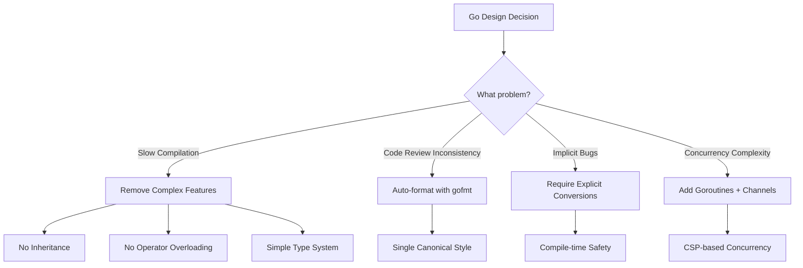
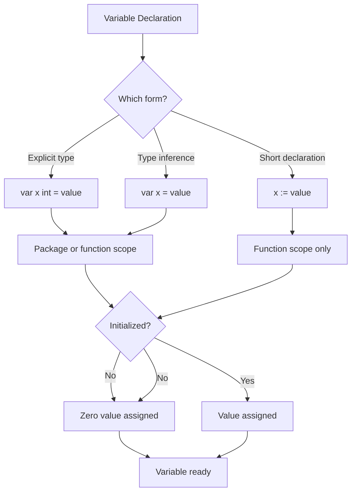
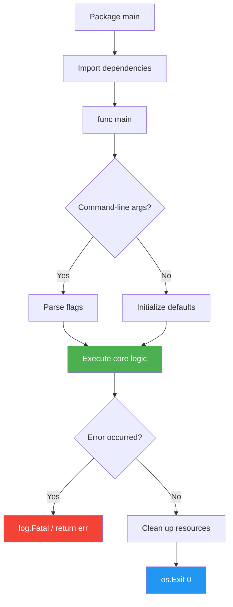

# 📜 Syntax, Types, and Control Flow

## 🎯 Learning Objectives

After completing this module, you will understand:

- **Go's design philosophy** - Why each language feature exists and what tradeoffs were made
- **Type system mechanics** - How Go's static typing works, memory layout, and zero values
- **Variable semantics** - Declaration patterns, scope rules, and pointer vs value semantics
- **Control flow theory** - Branch prediction, loop optimization, and idiomatic iteration
- **Type switches** - Dynamic dispatch, interface satisfaction, and runtime type introspection

---

## Introduction

Machine learning and artificial intelligence systems are increasingly deployed as distributed microservices that demand both developer velocity and runtime efficiency. Go (Golang) strikes this balance with a deliberately minimal syntax that reduces cognitive load while compiling to native machine code. For ML engineers, Go serves as the backbone of infrastructure tools like Kubernetes, TensorFlow Serving, and feature stores such as Feast, where Python handles model training but Go orchestrates the serving layer.

The design philosophy behind Go emphasizes readability and simplicity over feature proliferation. Where C++ offers dozens of ways to accomplish a task and Python hides complexity behind dynamic typing, Go enforces a single idiomatic path. This consistency is critical in ML engineering teams where code must be reviewed, maintained, and debugged by scientists and engineers with diverse backgrounds. Understanding Go's type system and control flow is therefore not merely academic; it is the foundation upon which scalable inference pipelines are built.

This module explores the lexical structure of Go programs, from variable declarations to the powerful `range` loop. We will examine why Go eliminates certain constructs found in other languages and how this minimalism translates to fewer bugs in production systems. By internalizing these fundamentals, you will be prepared to tackle advanced topics like [[02 - Functions, Methods, and Interfaces]] and [[04 - Goroutines and Channels]] with confidence.

---

## Module 1: Go Design Philosophy

### 1.1 Theoretical Foundation: History

Go was created at Google in 2007 by Robert Griesemer, Rob Pike, and Ken Thompson to address the complexity and slow compilation times of C++ in large-scale distributed systems. The story begins in Google's internal infrastructure teams, where engineers were struggling with a fundamental problem: C++ codebases had grown so large and complex that compilation of a single service could take hours.

Robert Griesemer, who had worked on the V8 JavaScript engine and Google's Java infrastructure, observed that developer productivity was inversely correlated with language complexity. Engineers spent more time fighting the compiler and understanding template metaprogramming than solving business problems. The language specification is remarkably small, containing only 25 keywords compared to C++'s 90+ or Java's 50+.

**The Three Creators:**

- **Robert Griesemer** - Previously worked on V8 JavaScript engine. Advocated for simplicity and fast compilation.
- **Rob Pike** - Co-creator of UTF-8, Unix legend. Designed Go's concurrency model based on Tony Hoare's Communicating Sequential Processes (CSP) from 1978.
- **Ken Thompson** - Co-creator of Unix and B programming language. Brought decades of systems programming experience.

### 1.2 Theoretical Foundation: Motivation

The core problem Go was designed to solve is **software engineering at scale**. Google's codebase contains over 2 billion lines of code across thousands of repositories. Before Go, C++ and Java dominated, but:

1. **Compilation times** stretched to hours for large projects
2. **Build system complexity** (Bazel, Make) required dedicated teams
3. **Dependency management** was a nightmare of version conflicts
4. **Code review** was slow because languages allowed too many styles
5. **Concurrency** in C++ required error-prone manual thread management

Go was designed with a radical constraint: **fast compilation must be a first-class feature**. This constraint forced the language designers to make decisions that other languages did not:

- No inheritance (complex dependency graphs slow compilation)
- No operator overloading (ambiguous semantics require complex parsing)
- No implicit conversions (explicit is slower to type but faster to compile)
- No generic types until Go 1.18 (2022) (design took 7 years to get right)

The result was a language that compiles millions of lines per second on modern hardware.

### 1.3 Mental Model

```
┌─────────────────────────────────────────────────────────────────┐
│            GO DESIGN PHILOSOPHY: CONSTRAINTS = FREEDOM          │
├─────────────────────────────────────────────────────────────────┤
│                                                                 │
│   LESS FEATURES           MORE FOCUS          FASTER SHIPPING  │
│   ┌──────────────┐        ┌──────────────┐    ┌──────────────┐ │
│   │ 25 Keywords  │───────▶│ Single Way   │───▶│ Fast Code    │ │
│   │ No Generics* │        │ to Do Things │    │ Reviews      │ │
│   │ No Inherit.  │        │              │    │              │ │
│   └──────────────┘        └──────────────┘    └──────────────┘ │
│         │                       │                    │         │
│         │                       │                    │         │
│         ▼                       ▼                    ▼         │
│   ┌──────────────┐        ┌──────────────┐    ┌──────────────┐ │
│   │ Less to      │        │ gopls works  │    │ Deploy in    │ │
│   │ Learn        │        │ everywhere   │    │ Minutes      │ │
│   │              │        │              │    │              │ │
│   └──────────────┘        └──────────────┘    └──────────────┘ │
│                                                                 │
│   * Generics added in Go 1.18 (2022) after 7 years of debate   │
│                                                                 │
└─────────────────────────────────────────────────────────────────┘
```

### 1.4 Syntax: Design Principles

The core tenets of Go's philosophy include:

```go
// DESIGN PRINCIPLE 1: Simplicity over power
// ❌ Bad: Java-style inheritance hierarchy (complex, slow to compile)
// ✅ Good: Go uses composition instead (see Module 3)

// DESIGN PRINCIPLE 2: Readability as a first-class concern
// All Go code is formatted identically by `gofmt`
// No debates about brace placement or spacing

// DESIGN PRINCIPLE 3: Explicit is better than implicit
var x int = 42         // Type is explicit
y := 42                // Type is inferred (but never hidden)
z := float64(x)        // Conversion must be explicit (no implicit conversion)
```

### 1.5 Visual Representation




### 1.6 Application in ML/AI Systems

**Real-world example: TensorFlow Serving at Google**

TensorFlow Serving is written in C++ internally but the open-source version's architecture inspired Go-based serving frameworks. When Google engineers evaluated whether to rewrite TF Serving in Go, they chose Go for their internal "Model Gateway" because:

1. **Fast compilation** - New model endpoints could be deployed in minutes, not hours
2. **Simple codebase** - ML researchers (not systems engineers) could contribute code
3. **Explicit error handling** - Every failure mode was visible in the code, critical for model validation

The 25-keyword constraint meant new team members could read and understand the entire serving pipeline in a single afternoon.

### 1.7 Common Pitfalls

⚠️ **Warning 1:** Do not treat Go as "C with garbage collection." While the syntax is familiar, Go's memory model, concurrency primitives, and interface system are fundamentally different. Attempting to write C-style pointer arithmetic or Java-style inheritance will lead to brittle, unidiomatic code that reviewers will reject.

⚠️ **Warning 2:** Do not try to force Python patterns into Go. Go has no list comprehensions, no decorators, and no context managers. If you find yourself missing these features, you are thinking in Python idioms, not Go idioms.

💡 **Tip:** Treat Go's 25 keywords as a constraint that forces clarity. If you find yourself fighting the language to express an abstraction, you are likely over-engineering. The idiomatic Go solution is usually the simplest one.

---

## Module 2: Variables, Constants, and Type System

### 2.1 Theoretical Foundation

Go's type system exists to solve three fundamental problems:

**Problem 1: Catch errors at compile time, not runtime.** In Python, the following code fails only when executed:

```python
# Python - fails at runtime
def process(x):
    return x + 1

process("hello")  # TypeError: can only concatenate str (not "int") to str
```

Go catches this at compile time:

```go
// Go - fails at compile time
func process(x int) int {
    return x + 1
}

process("hello")  // compile error: cannot use "hello" (untyped string constant) as int
```

**Problem 2: Enable compiler optimizations.** Because types are known at compile time, the Go compiler can generate optimal machine code. There is no type checking at runtime, no dynamic dispatch overhead for basic operations, and no boxing of primitive types.

**Problem 3: Make code self-documenting.** A function signature `func serve(model Model, features []float64) error` communicates exactly what data flows through the system, without needing docstrings or type annotations scattered throughout the code.

### 2.2 Mental Model: Memory Representation

```
┌─────────────────────────────────────────────────────────────────┐
│              GO TYPE SYSTEM: VALUE VS REFERENCE                 │
├─────────────────────────────────────────────────────────────────┤
│                                                                 │
│  VALUE TYPES (stored directly)     REFERENCE TYPES (pointers)   │
│  ┌─────────────────────┐          ┌─────────────────────┐      │
│  │    Stack Memory     │          │    Heap Memory      │      │
│  │                     │          │                     │      │
│  │  ┌─────┐ ┌─────┐   │          │  ┌─────────────┐   │      │
│  │  │ int │ │bool │   │          │  │   Slice     │   │      │
│  │  │ 42  │ │true │   │          │  │ ┌─────────┐ │   │      │
│  │  └─────┘ └─────┘   │          │  │ │[]int    │ │   │      │
│  │                     │          │  │ │[1,2,3]  │ │   │      │
│  │  ┌──────────────┐   │          │  │ └─────────┘ │   │      │
│  │  │  struct      │   │          │  └─────────────┘   │      │
│  │  │  ┌────┐     │   │          │         ▲           │      │
│  │  │  │x,y│     │   │          │         │           │      │
│  │  │  └────┘     │   │          │    ┌────┴────┐      │      │
│  │  └──────────────┘   │          │    │ Pointer │      │      │
│  │                     │          │    │  &slice │      │      │
│  └─────────────────────┘          │    └─────────┘      │      │
│                                   └─────────────────────┘      │
│                                                                 │
│  Value types: int, float64, bool, struct, array                 │
│  Reference types: slice, map, chan, *pointer                    │
│                                                                 │
└─────────────────────────────────────────────────────────────────┘
```

### 2.3 Syntax: Variable Declarations

Go offers multiple forms of variable declaration, each serving a specific purpose:

```go
// FORM 1: Explicit type declaration
// Use when: Declaring without immediate initialization, or when type differs from initializer
var count int = 42
var name string = "Alice"

// FORM 2: Type inference from initializer
// Use when: You want var for package-level declaration but don't want to repeat the type
var message = "Hello, Go"  // message is string

// FORM 3: Short declaration (function body only)
// Use when: Declaring and initializing local variables
name := "Alice"            // shorthand for: var name string = "Alice"
count := 42                // shorthand for: var count int = 42

// FORM 4: Multiple variables
// Use when: Declaring related variables together
var x, y int = 1, 2
a, b := 3, 4
name, age := "Bob", 30    // Can mix types

// IMPORTANT: := must declare at least one NEW variable
func example() {
    x := 1       // OK: x is new
    x, y := 2, 3 // OK: y is new (x is reassigned)
    // z, w := 1, 2 // ERROR if z and w already exist
}
```

**Scope rules:**
```go
var global = "I'm package-level"  // Visible throughout package

func outer() {
    var outerVar = "I'm in outer"  // Visible in outer and inner
    
    inner := func() {
        var innerVar = "I'm in inner"  // Only visible in inner
        _ = outerVar                    // Can access outer's variables (closure)
    }
    
    // innerVar is NOT accessible here
}
```

### 2.4 Syntax: Constants and Iota

Constants in Go are compile-time values that enable the compiler to optimize and catch errors early:

```go
// Untyped constants have arbitrary precision until assigned
const Pi = 3.14159265358979  // Acts as float64 when used in math
const Hundred = 100           // Acts as int when used in arithmetic

// Typed constants are constrained to their type
const MaxConnections int = 100
const Timeout time.Duration = 30 * time.Second

// IOTA: Incrementing enumerator within a const block
// Resets to 0 for each new const block, increments by 1 per line
type Priority int
const (
    Low    Priority = iota  // 0
    Medium                  // 1 (type inherited from first line)
    High                    // 2
    Critical                // 3
)

// Iota with expression (common pattern for bit flags)
type Permission int
const (
    Read    Permission = 1 << iota  // 1 (binary: 001)
    Write                           // 2 (binary: 010)
    Execute                         // 4 (binary: 100)
)
// Permission(7) means Read|Write|Execute

// Iota with division (common for byte sizes)
const (
    KB = 1024
    MB = 1024 * KB  // 1048576
    GB = 1024 * MB  // 1073741824
)
```

### 2.5 Syntax: Zero Values

Every type in Go has a **zero value** - the default value when memory is allocated but not explicitly initialized. This eliminates null pointer errors by ensuring variables always have a valid state:

```go
var (
    i int         // 0
    f float64     // 0.0
    b bool        // false
    s string      // ""
    p *int        // nil
    sl []int      // nil
    m map[string]int  // nil
    ch chan int    // nil
    fn func()     // nil
)

// Structs initialize recursively
type Config struct {
    Host string  // ""
    Port int     // 0
    Debug bool   // false
}
var cfg Config  // Config{"", 0, false}

// Array elements are zero-initialized
var arr [3]int  // [0, 0, 0]
```

**Why zero values matter for ML systems:**
In model serving, configuration structs with zero values mean "not set." This allows you to distinguish between explicitly setting a value and forgetting to set it:

```go
type ModelConfig struct {
    MaxBatchSize int     // 0 means "use default"
    Timeout      time.Duration  // 0 means "no timeout"
}

func serve(config ModelConfig) {
    batchSize := config.MaxBatchSize
    if batchSize == 0 {
        batchSize = 32  // Default batch size
    }
    // Now we know if user explicitly set it or not
}
```

### 2.6 Visual Representation




### 2.7 Application in ML/AI Systems

**ML Example: Configuration for Model Serving**

```go
// Real-world pattern for ML model configuration
type ModelServingConfig struct {
    ModelPath    string        // Path to model artifacts
    InputShape   []int         // [batch_size, height, width, channels]
    Normalization NormalizationConfig
    BatchSize    int           // 0 means auto-detect from hardware
    Timeout      time.Duration // 0 means no timeout
    NumWorkers   int           // 0 means runtime.NumCPU()
}

type NormalizationConfig struct {
    Mean   []float64  // ImageNet means: [0.485, 0.456, 0.406]
    Std    []float64  // ImageNet stds: [0.229, 0.224, 0.225]
    Scale  float64    // 1/255.0 for [0,1] scaling
}

// Zero values allow smart defaults
func NewServer(config ModelServingConfig) *Server {
    if config.BatchSize == 0 {
        config.BatchSize = autoDetectBatchSize()
    }
    if config.NumWorkers == 0 {
        config.NumWorkers = runtime.NumCPU()
    }
    if config.Timeout == 0 {
        config.Timeout = 30 * time.Second
    }
    return &Server{config: config}
}
```

### 2.8 Common Pitfalls

⚠️ **Warning 1:** Go never performs implicit numeric conversions. This is intentional to prevent subtle precision bugs:

```go
var x int32 = 42
var y int64 = 100
// result := x + y  // COMPILE ERROR: mismatched types int32 and int64
result := int64(x) + y  // OK: explicit conversion
```

⚠️ **Warning 2:** Do not use `_ = variable` to suppress "unused variable" errors. This hides bugs. If you declared a variable, you should use it. Remove the declaration if it is truly unused.

💡 **Tip:** Use `:=` for local variables and `var` for package-level declarations or when you want zero-value initialization without an immediate value. This follows Go community conventions.

---

## Module 3: Control Flow Constructs

### 3.1 Theoretical Foundation

Control flow determines the order in which statements execute. The fundamental problem control flow solves is **branching and iteration** - deciding which code path to take and repeating operations efficiently.

Go's control flow is intentionally minimal compared to other languages:

| Feature | Go | C++ | Python |
|---------|-----|-----|--------|
| Loops | `for` only | `for`, `while`, `do-while`, `range-for` | `for`, `while`, `for-in` |
| Conditionals | `if`, `switch` | `if`, `switch`, `?:` (ternary) | `if`, `elif`, `match` (3.10+) |
| Ternary operator | ❌ Does not exist | `condition ? a : b` | `a if condition else b` |
| Goto | Exists (rarely used) | Exists | ❌ Not available |

**Why no ternary operator?** The Go designers believed that `if-else` statements are clearer than one-liners. In code reviews, ternary operators often hide complex conditions in compact syntax. Go forces you to write:

```go
// Go way - explicit, scannable
var status string
if health > 0.8 {
    status = "healthy"
} else {
    status = "unhealthy"
}
```

**Why only `for`?** Having multiple loop constructs increases language complexity without proportional benefit. A single `for` loop can express all iteration patterns:

```go
// Traditional C-style for
for i := 0; i < n; i++ { }

// While-style (condition only)
for condition { }

// Infinite loop (must use break)
for { }

// Range iteration (special form)
for i, v := range slice { }
```

### 3.2 Mental Model: Loop Execution

```
┌─────────────────────────────────────────────────────────────────┐
│                GO FOR LOOP: FOUR FORMS                          │
├─────────────────────────────────────────────────────────────────┤
│                                                                 │
│  FORM 1: Traditional (C-style)                                  │
│  ┌──────────────────────────────────────────────────────────┐  │
│  │  for init; condition; post {                             │  │
│  │      body                                                │  │
│  │  }                                                       │  │
│  │                                                          │  │
│  │  init ──▶ condition? ──┬──Yes──▶ body ──▶ post ──┐      │  │
│  │                   │    │                        │      │  │
│  │                   │    │    ┌───────────────────┘      │  │
│  │                   │    │    │                          │  │
│  │                   │    └────┘ (loop back)              │  │
│  │                   │                                   │  │
│  │                   No ──▶ exit loop                    │  │
│  └──────────────────────────────────────────────────────────┘  │
│                                                                 │
│  FORM 2: While-style                                            │
│  ┌──────────────────────────────────────────────────────────┐  │
│  │  for condition {                                         │  │
│  │      body                                                │  │
│  │  }                                                       │  │
│  │                                                          │  │
│  │  condition? ──┬──Yes──▶ body ──┐                        │  │
│  │           │   │                │                        │  │
│  │           │   │    ┌───────────┘                        │  │
│  │           │   │    │ (loop back)                        │  │
│  │           No ──┘───┘                                    │  │
│  └──────────────────────────────────────────────────────────┘  │
│                                                                 │
│  FORM 3: Infinite (must use break)                              │
│  ┌──────────────────────────────────────────────────────────┐  │
│  │  for {                                                   │  │
│  │      body                                                │  │
│  │      if done { break }                                   │  │
│  │  }                                                       │  │
│  │                                                          │  │
│  │  ──▶ body ──▶ done? ──┬──Yes──▶ exit                    │  │
│  │       ▲           │    │                                 │  │
│  │       └───────────┘    No                                │  │
│  │          (loop back)  └──▶ body (repeat)                 │  │
│  └──────────────────────────────────────────────────────────┘  │
│                                                                 │
│  FORM 4: Range (special iteration)                              │
│  ┌──────────────────────────────────────────────────────────┐  │
│  │  for i, v := range collection {                          │  │
│  │      body                                                │  │
│  │  }                                                       │  │
│  │                                                          │  │
│  │  collection ──▶ get_next ──┬──have_item──▶ body ──┐      │  │
│  │                       │    │                    │      │  │
│  │                       │    │                    │      │  │
│  │                       No   └──▶ (loop back) ◀───┘      │  │
│  │                       │                                │  │
│  │                       ▼                                │  │
│  │                   exit loop                            │  │
│  └──────────────────────────────────────────────────────────┘  │
│                                                                 │
└─────────────────────────────────────────────────────────────────┘
```

### 3.3 Syntax: The `if` Statement

Go's `if` statement includes a unique feature: a **short statement** before the condition. This is used extensively in Go for initialization and error checking:

```go
// BASIC if
if condition {
    // body
}

// IF with short statement (init statement)
// The variable declared in the short statement is scoped to the if block
if err := validateInput(data); err != nil {
    return err  // err is accessible here
}
// err is NOT accessible here

// IF-ELSE (no parentheses around condition)
if score >= 90 {
    grade = "A"
} else if score >= 80 {
    grade = "B"
} else {
    grade = "C"
}

// PRACTICAL EXAMPLE: File operations
if file, err := os.Open("data.csv"); err != nil {
    log.Printf("Failed to open file: %v", err)
    return err
} else {
    defer file.Close()
    // Process file
}

// MULTIPLE INIT STATEMENTS
if n := computeLength(data); n > 0 {
    process(data[:n])
}
```

### 3.4 Syntax: The `switch` Statement

Go's `switch` is more powerful than in most languages. It does not fall through by default, eliminating a common source of bugs:

```go
// BASIC switch
switch os := runtime.GOOS; os {
case "darwin":
    fmt.Println("macOS")
case "linux":
    fmt.Println("Linux")
case "windows":
    fmt.Println("Windows")
default:
    fmt.Println("Unknown")
}
// Note: NO break needed - fallthrough is not automatic

// SWITCH without condition (acts as if-else-if chain)
switch {
case score >= 90:
    grade = "A"
case score >= 80:
    grade = "B"
case score >= 70:
    grade = "C"
default:
    grade = "F"
}

// SWITCH with multiple values per case
switch day {
case "Saturday", "Sunday":
    fmt.Println("Weekend")
case "Monday", "Tuesday", "Wednesday", "Thursday", "Friday":
    fmt.Println("Weekday")
}

// FALLTHROUGH keyword (rare, but available)
switch n {
case 0:
    fmt.Println("Zero")
    fallthrough  // Execute next case unconditionally
case 1:
    fmt.Println("Less than 2")  // Executes for n=0 AND n=1
case 2:
    fmt.Println("Two")
}

// TYPE SWITCH (see Module 5 for details)
switch v := i.(type) {
case int:
    fmt.Println("int:", v)
case string:
    fmt.Println("string:", v)
}
```

### 3.5 Syntax: The `range` Keyword

`range` iterates over slices, arrays, maps, strings, and channels. It is the idiomatic way to loop over collections:

```go
// RANGE over slice
nums := []int{10, 20, 30}
for i, v := range nums {
    fmt.Printf("index %d: value %d\n", i, v)
}
// Output: index 0: value 10, index 1: value 20, index 2: value 30

// When you only need the index
for i := range nums {
    fmt.Println(i)
}

// When you only need the value
for _, v := range nums {
    fmt.Println(v)
}

// Go 1.22+: Range over integers
for i := range 5 {  // i goes from 0 to 4
    fmt.Println(i)
}

// RANGE over map
scores := map[string]int{"Alice": 95, "Bob": 87}
for name, score := range scores {
    fmt.Printf("%s: %d\n", name, score)
}
// Note: MAP iteration order is RANDOM (intentionally)

// RANGE over string (iterates over runes, not bytes)
for i, r := range "Hello, 世界" {
    fmt.Printf("byte %d: %c (rune %d)\n", i, r, r)
}
// This correctly handles Unicode characters

// RANGE over channel (covered in Module 4)
ch := make(chan int, 3)
ch <- 1; ch <- 2; ch <- 3
close(ch)
for v := range ch {
    fmt.Println(v)
}
```

### 3.6 Syntax: Labels, Break, and Continue

For nested loops, Go supports labeled `break` and `continue`:

```go
// NESTED LOOP with labeled break
OuterLoop:
for i := 0; i < 3; i++ {
    for j := 0; j < 3; j++ {
        if i*j > 4 {
            break OuterLoop  // Breaks out of BOTH loops
        }
        fmt.Printf("(%d,%d) ", i, j)
    }
}
// Output: (0,0) (0,1) (0,2) (1,0) (1,1) (1,2)

// NESTED LOOP with labeled continue
OuterLoop:
for i := 0; i < 3; i++ {
    for j := 0; j < 3; j++ {
        if j == 1 {
            continue OuterLoop  // Continues outer loop, skipping i=0, j=2 etc.
        }
        fmt.Printf("(%d,%d) ", i, j)
    }
}
// Output: (0,0) (1,0) (2,0)
```

### 3.7 Visual Representation



**Complexity Analysis:** For a collection of size $n$, `range` executes exactly $n$ times:

$$O(n) \text{ for all rangeable types}$$


### 3.8 Application in ML/AI Systems

**ML Example: Batch Processing for Inference**

```go
// Real-world ML batch processing with range
type InferenceRequest struct {
    ID     string
    Data   []float32
    Model  string
}

func processBatch(requests []InferenceRequest) []InferenceResult {
    results := make([]InferenceResult, len(requests))
    
    // Process each request with range
    for i, req := range requests {
        // Note: req is a COPY. For large data, use index to access original
        results[i] = runInference(req.Model, req.Data)
    }
    
    return results
}

// Parallel processing with goroutines (preview of Module 4)
func processBatchParallel(requests []InferenceRequest) []InferenceResult {
    results := make([]InferenceResult, len(requests))
    var wg sync.WaitGroup
    
    for i, req := range requests {
        wg.Add(1)
        go func(idx int, r InferenceRequest) {
            defer wg.Done()
            results[idx] = runInference(r.Model, r.Data)
        }(i, req)  // Pass copies to avoid closure issues
    }
    
    wg.Wait()
    return results
}

// Feature store iteration
func computeFeatureStats(features map[string][]float64) map[string]Stats {
    stats := make(map[string]Stats)
    
    for featureName, values := range features {
        // Calculate statistics for each feature
        stats[featureName] = Stats{
            Mean:   computeMean(values),
            StdDev: computeStdDev(values),
            Min:    computeMin(values),
            Max:    computeMax(values),
        }
    }
    
    return stats
}
```

### 3.9 Common Pitfalls

⚠️ **Warning 1:** Never ignore the second return value of `range` over a map unless you truly do not need the key. Writing `for _, v := range m` when you need the key is a common source of logic errors. Similarly, remember that `range` copies the value into the loop variable; modifying `v` does not affect the underlying collection:

```go
// WRONG: Modifying the copy, not the original
type Person struct{ Name string }
people := []Person{{"Alice"}, {"Bob"}}
for _, p := range people {
    p.Name = "Changed"  // Modifies COPY, original unchanged!
}

// CORRECT: Use index to modify original
for i := range people {
    people[i].Name = "Changed"
}
```

⚠️ **Warning 2:** Map iteration order is intentionally randomized in Go. Never write code that depends on map iteration order. If you need ordered iteration, use a sorted slice of keys:

```go
keys := make([]string, 0, len(m))
for k := range m {
    keys = append(keys, k)
}
sort.Strings(keys)
for _, k := range keys {
    fmt.Println(k, m[k])
}
```

💡 **Tip:** Use `for i := range slice` when you only need indices, and `for range slice` when you only need to execute the body n times (Go 1.22+). For Go < 1.22, use `_ = range slice` pattern.

---

## Module 4: Type Switches and Dynamic Dispatch

### 4.1 Theoretical Foundation

A **type switch** is Go's mechanism for runtime type introspection. Before Go 1.18 introduced generics, type switches were the primary way to write code that operates differently based on the dynamic type of an interface value.

**The problem type switches solve:**

In ML systems, you often receive data that could be one of several types. A feature vector might contain integers, floats, strings, or even nested structures. Python handles this with dynamic typing:

```python
# Python: implicit type handling
def process_feature(value):
    if isinstance(value, int):
        return float(value)
    elif isinstance(value, str):
        return encode_categorical(value)
    else:
        return value
```

Go needs an explicit mechanism because it is statically typed. Type switches provide this:

```go
// Go: explicit type switching
func processFeature(value interface{}) float64 {
    switch v := value.(type) {
    case int:
        return float64(v)
    case float64:
        return v
    case string:
        return encodeCategorical(v)
    default:
        return 0.0
    }
}
```

**Why this matters for ML:** Type switches enable **polymorphic data processing**. Your feature engineering pipeline can accept heterogeneous data and transform each type appropriately, similar to how pandas handles mixed-type columns.

### 4.2 Mental Model: Dynamic Dispatch

```
┌─────────────────────────────────────────────────────────────────┐
│            TYPE SWITCH: DYNAMIC DISPATCH THEORY                 │
├─────────────────────────────────────────────────────────────────┤
│                                                                 │
│  INTERFACE VALUE (2 words in memory)                            │
│  ┌──────────────────────────────────────────────────────────┐  │
│  │  ┌─────────────┐        ┌─────────────────────────────┐  │  │
│  │  │ Type Info   │───────▶│ Concrete Type Metadata      │  │  │
│  │  │ (pointer)   │        │ - Type name                 │  │  │
│  │  └─────────────┘        │ - Size                      │  │  │
│  │                         │ - Method set                 │  │  │
│  │  ┌─────────────┐        │ - Kind (int, string, etc.)  │  │  │
│  │  │ Data        │───────▶│ Actual value stored here    │  │  │
│  │  │ (pointer)   │        │                             │  │  │
│  │  └─────────────┘        └─────────────────────────────┘  │  │
│  └──────────────────────────────────────────────────────────┘  │
│                          │                                      │
│                          ▼                                      │
│  ┌──────────────────────────────────────────────────────────┐  │
│  │  TYPE SWITCH EVALUATION                                   │  │
│  │                                                           │  │
│  │  switch v := i.(type) {                                  │  │
│  │  case int:        ──▶  Compare type pointer to int       │  │
│  │  case string:     ──▶  Compare type pointer to string    │  │
│  │  case []float64:  ──▶  Compare type pointer to []float64 │  │
│  │  }                                                       │  │
│  │                                                           │  │
│  │  O(1) lookup using type pointer comparison               │  │
│  └──────────────────────────────────────────────────────────┘  │
│                                                                 │
│  PERFORMANCE: Type switches are ~2-3ns (fast, pointer compare)  │
│  vs: Type assertions (panics on failure) vs Reflection (slow)  │
│                                                                 │
└─────────────────────────────────────────────────────────────────┘
```

### 4.3 Syntax: Type Switches

```go
// BASIC TYPE SWITCH
func describe(i interface{}) string {
    switch v := i.(type) {
    case int:
        return fmt.Sprintf("Integer: %d", v)
    case string:
        return fmt.Sprintf("String: %s", v)
    case []int:
        return fmt.Sprintf("Slice of ints: %v", v)
    case float64:
        return fmt.Sprintf("Float: %.2f", v)
    default:
        return fmt.Sprintf("Unknown type: %T", v)
    }
}

// TYPE SWITCH with interface satisfaction
type Stringer interface {
    String() string
}

func formatValue(v interface{}) string {
    switch s := v.(type) {
    case Stringer:
        return s.String()  // v implements Stringer
    case string:
        return s
    case fmt.Stringer:  // Same as Stringer above
        return s.String()
    default:
        return fmt.Sprintf("%v", v)
    }
}

// TYPE ASSERTION (different from type switch)
// Unsafe: panics if type doesn't match
// i := interface{}(42)
// n := i.(int)  // OK, n = 42
// s := i.(string)  // PANIC!

// Safe type assertion with comma-ok idiom
i := interface{}(42)
if n, ok := i.(int); ok {
    fmt.Println("Is int:", n)
} else {
    fmt.Println("Not an int")
}

// TYPE SWITCH in ML: Feature processing
func normalizeFeature(value interface{}) (float64, error) {
    switch v := value.(type) {
    case int:
        return float64(v) / 255.0, nil
    case float64:
        return v, nil
    case string:
        return hashToFloat(v), nil
    case bool:
        if v {
            return 1.0, nil
        }
        return 0.0, nil
    case []float64:
        // Return mean of array as scalar feature
        return mean(v), nil
    default:
        return 0, fmt.Errorf("unsupported feature type: %T", v)
    }
}
```

### 4.4 Visual Representation

```mermaid
flowchart TD
    A[Value of type interface{}] --> B{Type Switch}
    B -->|int| C[Handle integer<br/>v is int here]
    B -->|string| D[Handle string<br/>v is string here]
    B -->|[]float64| E[Handle slice<br/>v is []float64 here]
    B -->|bool| F[Handle boolean<br/>v is bool here]
    B -->|default| G[Handle unknown type]
    C --> H[Return normalized result]
    D --> H
    E --> H
    F --> H
    G --> H
    
    style C fill:#4CAF50,color:#fff
    style D fill:#2196F3,color:#fff
    style E fill:#FF9800,color:#fff
    style F fill:#9C27B0,color:#fff
    style G fill:#607D8B,color:#fff
```

**Type Switch Decision Tree:**

```
                    ┌──────────────────┐
                    │  Input Value     │
                    │  (interface{})   │
                    └────────┬─────────┘
                             │
                    ┌────────▼─────────┐
                    │  Check: int?     │
                    └────────┬─────────┘
                             │
               ┌─────────────┴─────────────┐
               │ YES                        │ NO
               ▼                            ▼
        ┌──────────────┐          ┌──────────────────┐
        │ Process as   │          │ Check: string?   │
        │ integer      │          └────────┬─────────┘
        └──────────────┘                   │
                              ┌────────────┴────────────┐
                              │ YES                     │ NO
                              ▼                         ▼
                       ┌──────────────┐         ┌──────────────────┐
                       │ Process as   │         │ Check: []float64?│
                       │ string       │         └────────┬─────────┘
                       └──────────────┘                  │
                                           ┌────────────┴────────────┐
                                           │ YES                     │ NO
                                           ▼                         ▼
                                    ┌──────────────┐         ┌──────────────┐
                                    │ Process as   │         │ Default case │
                                    │ float slice  │         │              │
                                    └──────────────┘         └──────────────┘
```


### 4.5 Application in ML/AI Systems

**ML Example: Heterogeneous Feature Store**

```go
// Real-world: Feature store that handles mixed feature types
type FeatureStore struct {
    features map[string]interface{}
}

// GetFeature returns a normalized float64 regardless of stored type
func (fs *FeatureStore) GetFeature(name string) (float64, error) {
    raw, exists := fs.features[name]
    if !exists {
        return 0, fmt.Errorf("feature %s not found", name)
    }
    
    // Type switch to handle heterogeneous features
    switch v := raw.(type) {
    case int:
        return float64(v), nil
    case int64:
        return float64(v), nil
    case float32:
        return float64(v), nil
    case float64:
        return v, nil
    case string:
        return hashString(v), nil  // Hash string to float
    case bool:
        if v { return 1.0, nil }
        return 0.0, nil
    case []float64:
        return mean(v), nil  // Aggregate array to scalar
    case json.Number:
        f, err := v.Float64()
        return f, err
    default:
        return 0, fmt.Errorf("unsupported feature type: %T", raw)
    }
}

// SetFeature uses type assertion to validate input
func (fs *FeatureStore) SetFeature(name string, value interface{}) error {
    // Validate type is supported
    switch value.(type) {
    case int, int64, float32, float64, string, bool, []float64, json.Number:
        // Valid types
    default:
        return fmt.Errorf("unsupported type: %T", value)
    }
    
    fs.features[name] = value
    return nil
}
```

### 4.6 Common Pitfalls

⚠️ **Warning 1:** Type switches work with `interface{}` (or `any` in Go 1.18+), not concrete types. If you try to type switch on a concrete type, it will only match that type:

```go
func wrong(x int) {
    switch x.(type) {  // ERROR: x is int, not interface{}
    case int:
        fmt.Println("int")
    }
}

func correct(x interface{}) {
    switch x.(type) {  // OK: x is interface{}
    case int:
        fmt.Println("int")
    }
}
```

⚠️ **Warning 2:** Type switches do not match on underlying types. `type MyInt int` is a distinct type from `int`:

```go
type MyInt int

func example(v interface{}) {
    switch v.(type) {
    case int:
        fmt.Println("int")
    case MyInt:
        fmt.Println("MyInt")
    }
}

example(MyInt(42))  // Prints "MyInt", NOT "int"
example(42)         // Prints "int"
```

💡 **Tip:** Use type switches instead of multiple type assertions when you need to handle multiple types. Type assertions panic on failure; type switches handle all cases safely with a default clause.

---

## 📦 Compression Code

```go
package main

import (
    "fmt"
    "runtime"
)

// iota-based enum for log levels (demonstrates constants)
type LogLevel int

const (
    Debug LogLevel = iota  // 0
    Info                   // 1
    Warn                   // 2
    Error                  // 3
)

// String method for LogLevel (will be useful in Module 2)
func (l LogLevel) String() string {
    switch l {
    case Debug:
        return "DEBUG"
    case Info:
        return "INFO"
    case Warn:
        return "WARN"
    case Error:
        return "ERROR"
    default:
        return "UNKNOWN"
    }
}

// type switch demonstration for ML feature processing
func describe(i interface{}) string {
    switch v := i.(type) {
    case int:
        return fmt.Sprintf("int: %d", v)
    case float64:
        return fmt.Sprintf("float64: %.2f", v)
    case string:
        return fmt.Sprintf("string: %q", v)
    case bool:
        return fmt.Sprintf("bool: %t", v)
    case []int:
        return fmt.Sprintf("[]int: %v", v)
    default:
        return fmt.Sprintf("unknown: %T", v)
    }
}

func main() {
    // Variable declarations
    var explicit int = 10
    inferred := "Go"
    a, b := 1, 2
    _ = explicit  // Using blank identifier for unused variable
    
    fmt.Printf("explicit=%d, inferred=%s, a=%d, b=%d\n", 
        explicit, inferred, a, b)
    
    // Zero values demonstration
    var (
        i int
        f float64
        s string
        bl bool
    )
    fmt.Printf("Zero values: int=%d, float=%f, string=%q, bool=%t\n",
        i, f, s, bl)
    
    // Constants and iota
    fmt.Printf("Log levels: Debug=%d, Info=%d, Warn=%d, Error=%d\n",
        Debug, Info, Warn, Error)
    fmt.Printf("Current level string: %s\n", Info)
    
    // Control flow: if with short statement
    if num := runtime.NumCPU(); num > 4 {
        fmt.Printf("High CPU count: %d\n", num)
    }
    
    // Control flow: for loop variations
    fmt.Print("Traditional for: ")
    for i := 0; i < 3; i++ {
        fmt.Printf("%d ", i)
    }
    fmt.Println()
    
    // Control flow: range over slice
    data := []float64{1.1, 2.2, 3.3}
    fmt.Print("Range over slice: ")
    for idx, val := range data {
        fmt.Printf("[%d]=%.1f ", idx, val)
    }
    fmt.Println()
    
    // Control flow: range over map
    m := map[string]int{"x": 1, "y": 2}
    fmt.Print("Range over map: ")
    for k, v := range m {
        fmt.Printf("%s=%d ", k, v)
    }
    fmt.Println()
    
    // Control flow: switch with short statement
    switch os := runtime.GOOS; os {
    case "linux":
        fmt.Println("Running on Linux")
    case "darwin":
        fmt.Println("Running on macOS")
    default:
        fmt.Printf("Running on %s\n", os)
    }
    
    // Type switches for ML features
    features := []interface{}{42, 3.14, "category", true, []int{1, 2, 3}}
    for _, f := range features {
        fmt.Println(describe(f))
    }
}
```

---

## 🎯 Documented Project: ML Configuration Parser

### Description

Build a configuration parser CLI tool for ML model serving that reads environment variables and command-line flags, validates them using Go's type system, and outputs a structured JSON representation. The tool demonstrates variable scoping, `switch` statements for environment detection, `range` for iterating over configuration keys, and type switches for handling mixed configuration values.

### Functional Requirements

1. Accept command-line flags for `model-path`, `port`, `env` (development, staging, production), and `batch-size`.
2. Validate that `port` is within the range 1024-65535 using `if` statements and return detailed errors.
3. Use a `map[string]interface{}` to store configuration keys and apply a type switch to format each value appropriately.
4. Iterate over the configuration map using `range` and print each key-value pair with its detected type.
5. Use `iota` to define an enumerated type for log levels and map the `env` flag to the appropriate level.

### Main Components

- `main.go`: Entry point with flag parsing and validation logic
- `config.go`: Configuration struct with struct tags and validation methods
- `types.go`: Custom types including the `LogLevel` enum using `iota`
- `formatter.go`: Type switch implementation for pretty-printing mixed types
- `README.md`: Usage documentation and example commands

### Success Metrics

- All flags are parsed without using external libraries (only `flag` package)
- Invalid port ranges produce clear, actionable error messages
- The program compiles with zero warnings under `go vet`
- Output formatting handles at least five distinct Go types correctly
- Code passes review for idiomatic Go style (no unused variables, no implicit conversions)

### Starter Code

```go
package main

import (
    "encoding/json"
    "flag"
    "fmt"
    "os"
)

// LogLevel enum using iota
type LogLevel int

const (
    LogLevelDebug LogLevel = iota
    LogLevelInfo
    LogLevelWarn
    LogLevelError
)

func main() {
    // Flag declarations
    modelPath := flag.String("model-path", "", "Path to model artifacts")
    port := flag.Int("port", 8080, "Port to listen on")
    env := flag.String("env", "development", "Environment: development, staging, production")
    batchSize := flag.Int("batch-size", 32, "Inference batch size")
    flag.Parse()
    
    // Validate port
    if *port < 1024 || *port > 65535 {
        fmt.Fprintf(os.Stderr, "Error: port must be between 1024 and 65535, got %d\n", *port)
        os.Exit(1)
    }
    
    // Build config map
    config := map[string]interface{}{
        "model-path": *modelPath,
        "port":       *port,
        "env":        *env,
        "batch-size": *batchSize,
    }
    
    // Output as JSON
    output, _ := json.MarshalIndent(config, "", "  ")
    fmt.Println(string(output))
}
```

### References

- [The Go Programming Language Specification](https://golang.org/ref/spec)
- [Effective Go](https://go.dev/doc/effective_go)
- [Go by Example - Range](https://gobyexample.com/range)
- [Go Blog - Type Switch](https://go.dev/blog/interface)

---

💡 **Key Takeaway:** Go's minimalism is its superpower. By removing features like inheritance, operator overloading, and implicit conversions, the language forces you to write code that is explicit, readable, and maintainable. These constraints may feel limiting at first, but they pay dividends in large codebases where clarity matters more than cleverness.