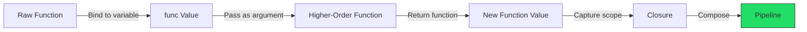
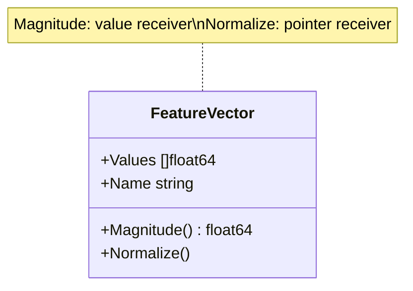
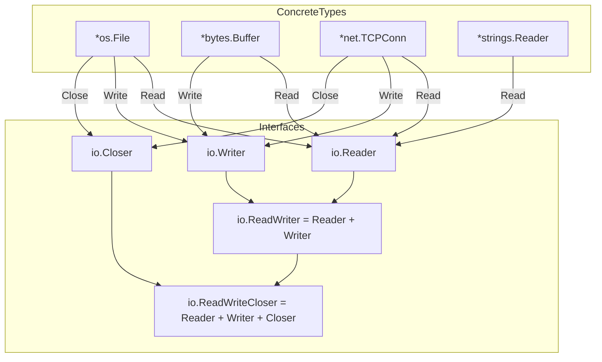

# Functions, Methods, and Interfaces

## Learning Objectives

- Understand lambda calculus foundations underlying Go's function model
- Apply higher-order functions to build composable ML data pipelines
- Distinguish value vs pointer receivers using method set theory
- Design interfaces using structural typing and Liskov substitution principles
- Implement type-safe generic operations for tensor and matrix manipulation
- Avoid common pitfalls in interface satisfaction and closure memory leaks

---

## Introduction

Go's function model traces directly to lambda calculus, the formal system Alonzo Church developed in the 1930s to study computability. Every Go function is a lambda: a first-class value that can be bound to variables, passed as arguments, and returned from other functions. This mathematical foundation gives Go surprising expressive power despite its deliberate simplicity.

In ML engineering, functions are the atoms of data transformation. A preprocessing pipeline is a composition of pure functions: normalize, tokenize, vectorize, batch. Each function takes data in, produces data out, and has no hidden side effects. Go's function types make these pipelines explicit and testable. When Google Brain Train (Borg) migrated training jobs from Python to Go for production serving, the primary advantage was compile-time verification of these transformation chains.

Interfaces provide the glue. An `io.Reader` is not a class hierarchy—it is a contract: "anything that can fill a byte slice." This structural typing means a file, a network connection, a gzip decoder, and a bytes buffer all satisfy the same interface without any of them importing each other. This decoupling is why Go's standard library composes so elegantly and why companies like Uber, Cloudflare, and Docker chose Go for their infrastructure.

Methods extend functions with receiver semantics. The choice between value and pointer receivers is not style—it is a correctness decision rooted in Go's method set rules. Understanding these rules prevents an entire category of interface satisfaction bugs that plague new Go developers.

This module builds the behavioral layer of Go programs, complementing the structural layer covered in [[01 - Syntax, Types, and Control Flow]] and [[03 - Structs, Embedding, and Composition]].

---

## Module 1: Functions as Values

### 1.1 Theoretical Foundation

Go functions derive from the lambda calculus tradition established by Alonzo Church in 1936. In lambda calculus, a function is a first-class mathematical object: it can be named, passed to other functions, and returned as a result. Go's function types implement this principle directly. When you write `func(int) int`, you are defining a type in the set of all functions that take one integer and return one integer—exactly the set of morphisms from the natural numbers to themselves in category theory.

Higher-order functions are functions that accept or return other functions. This is not a special feature; it is a natural consequence of functions being values. In ML systems, higher-order functions are the backbone of composable data pipelines. A typical training loop uses `Map`, `Filter`, and `Reduce` operations, each implemented as a higher-order function that takes a transformation function as an argument. Go does not have built-in `map` or `filter` for slices (though Go 1.21 introduced `slices.Map` experimentally), but the pattern is trivial to implement.

Closures extend the lambda calculus model by capturing lexical scope. When a function literal references a variable from an enclosing scope, Go allocates that variable on the heap rather than the stack, creating a closure. The captured variable becomes part of the function's closure environment and persists as long as the function value exists. This is how middleware patterns work in HTTP servers: a function returns a handler that "closes over" configuration values like timeouts, authentication keys, or rate limits.

The mathematical elegance of closures has a practical cost: memory. Each closure that captures a variable by reference prevents garbage collection of that variable until the closure itself is collected. In long-running ML serving processes that accumulate closures in middleware chains, this can cause memory pressure. Understanding closure semantics is essential for writing efficient production Go code.

### 1.2 Mental Model: Closure Memory Diagram

```
┌─────────────────────────────────────────────────────────────────┐
│                    STACK FRAME: makeCounter()                    │
│  ┌─────────────────────────────────────────────────────────────┐│
│  │  count := 0                                                 ││
│  │  ┌─────────────────────────────────────────────────────────┐││
│  │  │         CLOSURE: func() int { return count++ }          │││
│  │  │                                                         │││
│  │  │   References ──► count (on HEAP, not stack)             │││
│  │  │   Code pointer ──► increment logic                      │││
│  │  └─────────────────────────────────────────────────────────┘││
│  └─────────────────────────────────────────────────────────────┘│
└─────────────────────────────────────────────────────────────────┘

After makeCounter() returns:

┌──────────────────────────────────────┐
│              HEAP                    │
│  ┌────────────────────────────────┐  │
│  │  count: 0  ◄── Escaped!       │  │
│  │  (kept alive by closure ref)  │  │
│  └────────────────────────────────┘  │
│                                      │
│  Caller holds closure value          │
│  counter() → count becomes 1         │
│  counter() → count becomes 2         │
└──────────────────────────────────────┘
```

### 1.3 Syntax and Semantics

```go
package main

import "fmt"

// Function type definition — a named function signature
type Transform func(float64) float64

// Higher-order function: takes a Transform, returns a Transform
// This is function composition, foundational in ML preprocessing
func compose(first, second Transform) Transform {
    return func(x float64) float64 {
        return second(first(x)) // Apply first, then second
    }
}

// Closure: captures 'factor' from enclosing scope
func makeScaler(factor float64) Transform {
    return func(x float64) float64 {
        return x * factor // 'factor' is captured, lives on heap
    }
}

// Variadic function with closure accumulation
func pipeline(steps ...Transform) Transform {
    return func(x float64) float64 {
        result := x
        for _, step := range steps {
            result = step(result) // Sequential application
        }
        return result
    }
}

func main() {
    // Build transformation pipeline
    normalize := makeScaler(1.0 / 255.0) // Image pixel normalization
    scale := makeScaler(2.0 - 1.0)       // Rescale to [-1, 1]

    // Compose: normalize then scale
    preprocess := compose(normalize, scale)

    // Variadic pipeline
    fullPipeline := pipeline(
        makeScaler(1.0/255.0),
        makeScaler(2.0),
        func(x float64) float64 { return x - 1.0 }, // Anonymous function
    )

    pixel := 128.0
    fmt.Printf("Preprocessed: %.4f\n", preprocess(pixel))   // -0.0039
    fmt.Printf("Full pipeline: %.4f\n", fullPipeline(pixel)) // 0.0039
}
```

### 1.4 Visual Representation



**Wikimedia reference:** [Lambda calculus diagram](https://upload.wikimedia.org/wikipedia/commons/thumb/a/a3/Lambda-Calculus-Reduction.svg/640px-Lambda-Calculus-Reduction.svg.png)

### 1.5 Application in ML/AI Systems

| Pattern | Go Implementation | ML Use Case |
|---------|-------------------|-------------|
| Data transformer | `func([]float64) []float64` | Feature normalization, one-hot encoding |
| Middleware chain | `func(Handler) Handler` | Authentication, rate limiting for model serving |
| Strategy pattern | `func(Data) Result` | Swappable loss functions, optimizers |
| Lazy evaluation | Closure returning `func() T` | On-demand data loading, deferred computation |

**Real case:** TensorFlow Serving's Go client uses higher-order functions to build request interceptor chains. Each interceptor is a function that wraps an RPC call with logging, retry logic, and authentication—exactly the middleware pattern enabled by Go's function types.

### 1.6 Common Pitfalls

**Warning:** Closures in loops capture the loop variable by reference. In Go versions before 1.22, this causes all closures to share the final value of the variable.

```go
// BUG (pre-Go 1.22): All printFuncs print "4"
var funcs []func()
for i := 0; i < 4; i++ {
    funcs = append(funcs, func() { fmt.Println(i) })
}
for _, f := range funcs {
    f() // All print 4, not 0,1,2,3
}

// FIX: Shadow the variable
for i := 0; i < 4; i++ {
    i := i // Create a new binding
    funcs = append(funcs, func() { fmt.Println(i) })
}
```

**Tip:** Prefer passing values as function parameters over capturing them in closures when possible. Explicit parameters make dependencies visible and prevent accidental memory retention in long-lived closures.

### 1.7 Knowledge Check

1. Why does a closure that captures a large slice not copy the slice data?
2. How would you implement `Map`, `Filter`, and `Reduce` as higher-order functions for a custom `Tensor` type?
3. What happens to a closure's captured variables when the closure is stored in a global variable?

---

## Module 2: Methods and Receivers

### 2.1 Theoretical Foundation

Methods in Go are functions bound to a type via a receiver argument. This design choice separates Go from classical OOP: methods are not "owned" by a type the way instance methods are owned by a class in Java or Python. Instead, methods are defined in the same namespace as the type, and the receiver is simply the first parameter. This means you can define methods on types from any package, including built-in types (via named types), enabling retroactive interface satisfaction.

The theoretical significance is that Go uses **nominal typing for types but structural typing for interfaces**. A method set defines the set of methods a type possesses. The method set of a type `T` includes all methods with receiver `T`. The method set of a pointer type `*T` includes all methods with receiver `T` or `*T`. This distinction is where most confusion arises and where correctness is most critical.

Value receivers work on a copy of the value. This copy-on-read semantics provides implicit immutability: the caller's original value cannot be modified through a value receiver. Pointer receivers work on the original value, enabling mutation. The choice is not about performance alone—it is about semantic intent. A method that does not modify state should use a value receiver to communicate immutability. A method that modifies state must use a pointer receiver.

In ML systems, value semantics are crucial for immutable feature vectors and configuration objects. Pointer semantics are essential for mutable accumulators, model parameters during training, and synchronization primitives like `sync.Mutex` that must have a single memory address.

### 2.2 Mental Model: Receiver Type Decision Tree

```
                        ┌─────────────────────┐
                        │  Does the method    │
                        │  need to modify the │
                        │  receiver?          │
                        └──────────┬──────────┘
                                   │
                    ┌──────────────┴──────────────┐
                    │                             │
                   YES                            NO
                    │                             │
            ┌───────▼───────┐            ┌───────▼────────┐
            │ Must use      │            │ Is the struct  │
            │ *T (pointer)  │            │ > 64 bytes?    │
            └───────┬───────┘            └───────┬────────┘
                    │                            │
                    │                 ┌──────────┴──────────┐
                    │                YES                     NO
                    │                 │                       │
                    │      ┌──────────▼──────────┐  ┌────────▼────────┐
                    │      │ Use *T to avoid     │  │ Use T (value)   │
                    │      │ expensive copy      │  │ for clarity     │
                    │      └─────────────────────┘  └─────────────────┘
                    │
            ┌───────▼───────────────────┐
            │ Does type have any        │
            │ pointer receiver methods? │
            └───────────┬───────────────┘
                        │
             ┌──────────┴──────────┐
            YES                    NO
             │                      │
    ┌────────▼────────┐   ┌────────▼────────┐
    │ ALL methods     │   │ Value receiver  │
    │ must use *T     │   │ is fine         │
    │ (consistency)   │   │                 │
    └─────────────────┘   └─────────────────┘
```

### 2.3 Syntax and Semantics

```go
package main

import "fmt"

type FeatureVector struct {
    Values []float64
    Name   string
}

// Value receiver: safe, immutable, copies struct
// Appropriate for read-only operations in ML inference
func (fv FeatureVector) Magnitude() float64 {
    sum := 0.0
    for _, v := range fv.Values {
        sum += v * v
    }
    return sum
}

// Pointer receiver: mutable, operates on original
// Required for modifying the receiver
func (fv *FeatureVector) Normalize() {
    mag := fv.Magnitude() // Can call value receiver methods
    if mag == 0 {
        return
    }
    for i := range fv.Values {
        fv.Values[i] /= mag
    }
}

// Pointer receiver required: sync.Mutex has no value receiver methods
type SafeBuffer struct {
    Data []byte
    mu   sync.Mutex
}

func (sb *SafeBuffer) Append(data []byte) {
    sb.mu.Lock()
    defer sb.mu.Unlock()
    sb.Data = append(sb.Data, data...)
}
```

### 2.4 Visual Representation: Value vs Pointer Receiver Comparison

| Aspect | Value Receiver `(T)` | Pointer Receiver `(*T)` |
|--------|---------------------|------------------------|
| Mutation | Works on copy, safe | Works on original, mutable |
| Nil receiver | Never nil | Can be nil, must check |
| Memory | Copies entire struct | Copies pointer (8 bytes) |
| Interface satisfaction | `T` satisfies if methods on `T` | `*T` satisfies if methods on `*T` or `T` |
| Use case | Immutable operations | Mutation, large structs, mutexes |
| Concurrency | Naturally safe | Requires synchronization |



**Wikimedia reference:** [Pointer diagram](https://upload.wikimedia.org/wikipedia/commons/thumb/d/d4/Pointers_and_values.svg/640px-Pointers_and_values.svg.png)

### 2.5 Application in ML/AI Systems

- **Immutable feature vectors:** Value receivers ensure preprocessing pipelines cannot corrupt input data
- **Model parameter updates:** Pointer receivers on weight matrices enable in-place gradient updates during backpropagation
- **Thread-safe accumulators:** Pointer receivers required when embedding `sync.Mutex` for distributed training metrics

**Real case:** GoMind (a Go ML framework) defines all inference methods with value receivers to guarantee thread safety during concurrent batch inference. Training methods use pointer receivers because gradients must modify weights in place.

### 2.6 Common Pitfalls

**Warning:** Mixing value and pointer receivers on the same type causes interface satisfaction bugs. If any method uses `*T`, all methods should use `*T` for consistency.

**Tip:** Use `golang.org/x/tools/go/analysis/passes/methods` to detect inconsistent receiver types in your codebase.

### 2.7 Knowledge Check

1. Why does a value receiver method on `T` satisfy an interface, but a pointer receiver method on `*T` does not mean `T` satisfies it?
2. When would you choose a value receiver for a struct containing a slice field?
3. How does Go automatically insert `&` and `.` operators when calling methods on pointer values?

---

## Module 3: Interfaces

### 3.1 Theoretical Foundation

Go interfaces implement **structural typing**, also known as **duck typing at compile time**. A type satisfies an interface if and only if it implements all methods declared in that interface. There is no `implements` keyword, no inheritance chain, and no base interface class. This design is rooted in the Liskov Substitution Principle: if a type provides all the behaviors an interface requires, it can be substituted anywhere that interface is expected.

The mathematical elegance of structural typing is that interface satisfaction is a **subset relation** on method sets. The method set of type `T` is a subset of the method set of interface `I` if and only if `T` satisfies `I`. This is why Go can check interface satisfaction at compile time without runtime overhead: the compiler simply verifies that every method in the interface has a matching implementation on the type.

Implicit satisfaction is the key innovation. In Java, adding a new method to an interface breaks all existing implementations. In Go, adding a method to a concrete type automatically satisfies any new interface that requires only that method. This "retroactive satisfaction" is why Go's standard library can define `io.Reader` in one package and have thousands of types satisfy it without importing `io`.

The trade-off is that Go cannot express conditional constraints like "satisfy `Reader` or `Writer`" directly. This is addressed by interface composition (combining interfaces with `|` in Go 1.18+ with union types) and by designing small, focused interfaces that are easy to satisfy.

### 3.2 Mental Model: Interface Satisfaction Matrix

```
              Interface I Methods
              ┌──────┬──────┬──────┐
              │ Read │ Write│ Close│
    ┌─────────┼──────┼──────┼──────┤
    │ *File   │  ✓   │  ✓   │  ✓   │  Satisfies: Reader, Writer, Closer
    │ *Buffer │  ✓   │  ✓   │  ✗   │  Satisfies: Reader, Writer
    │ *NetConn│  ✓   │  ✓   │  ✓   │  Satisfies: ReadWriteCloser
    │ *Pipe   │  ✓   │  ✗   │  ✗   │  Satisfies: Reader only
    │ *DevNull│  ✗   │  ✓   │  ✗   │  Satisfies: Writer only
    └─────────┴──────┴──────┴──────┘

    ✓ = Method implemented    ✗ = Method not implemented

    Rule: Type satisfies Interface if ALL methods are ✓
```

### 3.3 Syntax and Semantics

```go
package main

import (
    "fmt"
    "io"
)

// Small, focused interfaces — Go convention
type Model interface {
    Predict(input []float64) ([]float64, error)
    Name() string
}

type Serializable interface {
    Marshal() ([]byte, error)
    Unmarshal([]byte) error
}

// Composed interface
type PersistableModel interface {
    Model
    Serializable
}

// Concrete type satisfies Model (implicit)
type LinearRegression struct {
    Weights []float64
    Bias    float64
}

func (lr LinearRegression) Predict(input []float64) ([]float64, error) {
    // Dot product + bias
    sum := lr.Bias
    for i, w := range lr.Weights {
        sum += w * input[i]
    }
    return []float64{sum}, nil
}

func (lr LinearRegression) Name() string {
    return "LinearRegression"
}

// Function accepts interface, not concrete type
func RunInference(m Model, data [][]float64) [][]float64 {
    results := make([][]float64, len(data))
    for i, input := range data {
        results[i], _ = m.Predict(input)
    }
    return results
}
```

### 3.4 Visual Representation



**Wikimedia reference:** [Interface hierarchy](https://upload.wikimedia.org/wikipedia/commons/thumb/9/9e/Interface_example.svg/640px-Interface_example.svg.png)

### 3.5 Application in ML/AI Systems

| Interface | Method Signature | ML Application |
|-----------|-----------------|----------------|
| `io.Reader` | `Read(p []byte) (int, error)` | Streaming model weights from S3 |
| `io.Writer` | `Write(p []byte) (int, error)` | Writing inference results to Kafka |
| `http.Handler` | `ServeHTTP(ResponseWriter, *Request)` | Model serving HTTP endpoint |
| `Model` | `Predict([]float64) ([]float64, error)` | Pluggable model backends |
| `Validator` | `Validate() error` | Input schema validation |

**Real case:** ONNX Runtime's Go bindings use `io.Reader` to stream model files directly into the runtime without buffering the entire model in memory. A 500MB transformer model can begin inference while still downloading, because the interface allows incremental reads.

### 3.6 Common Pitfalls

**Warning:** A nil interface value (`var i I`) is not the same as an interface holding a nil pointer (`var p *T; i = p`). The former has no type; the latter has type `*T` but value nil. Type assertions on the former panic; type switches on the latter can match the concrete type.

**Tip:** Design interfaces at the consumption site, not the implementation site. The `io.Reader` interface lives in package `io`, but implementations live everywhere. This "consumer-side interface" pattern is Go's most powerful abstraction technique.

### 3.7 Knowledge Check

1. Why does Go use implicit instead of explicit interface satisfaction?
2. How would you design an interface for a pluggable ML model backend that supports both TensorFlow and PyTorch?
3. What is the method set of a pointer type `*T` versus a value type `T`?

---

## Module 4: Generics

### 4.1 Theoretical Foundation

Go 1.18 introduced **parametric polymorphism** through type parameters, commonly called generics. This is a formal system where functions and types can be written to work with any type, with the specific type determined at instantiation. The theoretical model is similar to ML's Hindley-Milner type system and Haskell's type classes, but Go's implementation uses a simpler contract-based approach without full type inference.

Generics address a real problem: before Go 1.18, the only way to write type-agnostic code was to use `interface{}` (now `any`) and lose compile-time type safety. Libraries like `container/list` and `sort.Interface` worked around this with type assertions and code generation. Generics eliminate this workaround for many cases.

The key insight is that generics are **most valuable when the logic is identical across types but the types differ**. A `Max` function that works on `int`, `float64`, and `time.Time` is a perfect use case. However, generics should not replace interfaces: if different types require different implementations (like different `Serialize()` methods), interfaces are still the right tool.

Type constraints in Go generics are interfaces that define the set of types a type parameter can accept. A constraint like `interface{ ~int | ~float64 }` means "any type whose underlying type is int or float64." This is more flexible than C++ template constraints and more explicit than Java's `extends`.

### 4.2 Mental Model: Generic Function Architecture

```
┌──────────────────────────────────────────────────────────────┐
│                    GENERIC FUNCTION: Max[T]                   │
│                                                              │
│  Type Parameter: T                                           │
│  Constraint:     interface{ ~int | ~float64 }               │
│                                                              │
│  ┌────────────────────────────────────────────────────────┐  │
│  │  func Max(a, b T) T {                                  │  │
│  │      if a > b { return a }                             │  │
│  │      return b                                          │  │
│  │  }                                                     │  │
│  └────────────────────────────────────────────────────────┘  │
│                                                              │
│  Instantiation:                                              │
│  ┌──────────────────┐  ┌──────────────────┐                  │
│  │  Max[int]        │  │  Max[float64]    │                  │
│  │  Max(3, 5) → 5   │  │  Max(2.1, 3.4)  │                  │
│  └──────────────────┘  └──────────────────┘                  │
│                                                              │
│  Compiler generates specialized versions:                    │
│  func Max_int(a, b int) int    { ... }                      │
│  func Max_float64(a, b float64) float64 { ... }             │
└──────────────────────────────────────────────────────────────┘
```

### 4.3 Syntax and Semantics

```go
package main

import "fmt"

// Type constraint: union of permitted types
type Numeric interface {
    ~int | ~int32 | ~int64 | ~float32 | ~float64
}

// Generic function: works with any Numeric type
func Sum[T Numeric](values []T) T {
    var total T
    for _, v := range values {
        total += v
    }
    return total
}

// Generic type: type-safe tensor
type Tensor[T Numeric] struct {
    Shape []int
    Data  []T
}

// Generic method on generic type
func (t *Tensor[T]) Mean() T {
    total := Sum(t.Data)
    return total / T(len(t.Data))
}

// Generic with multiple type parameters
type Pair[A, B any] struct {
    First  A
    Second B
}

func (p Pair[A, B]) Swap() Pair[B, A] {
    return Pair[B, A]{First: p.Second, Second: p.First}
}

func main() {
    // Type inference: compiler deduces T = int
    ints := []int{1, 2, 3, 4, 5}
    fmt.Println(Sum(ints)) // 15

    // Explicit type parameter when inference fails
    floats := []float64{1.1, 2.2, 3.3}
    fmt.Println(Sum[float64](floats)) // 6.6

    // Generic type
    t := Tensor[float64]{
        Shape: []int{2, 3},
        Data:  []float64{1, 2, 3, 4, 5, 6},
    }
    fmt.Println(t.Mean()) // 3.5

    // Generic pair
    p := Pair[string, int]{First: "age", Second: 30}
    fmt.Println(p.Swap()) // {30 age}
}
```

### 4.4 Visual Representation

```mermaid
flowchart TD
    A[Generic Function Definition] --> B{Is T constrained?}
    B -->|No constraint| C[Accepts all types: [T any]]
    B -->|Union constraint| D[T: ~int | ~float64]
    B -->|Interface constraint| E[T: Reader]

    C --> F[Most flexible, least safety]
    D --> G[Type-safe arithmetic]
    E --> H[Behavior-based polymorphism]

    F --> I[Use for: Identity, Swap]
    G --> J[Use for: Sum, Max, Min]
    H --> K[Use for: Copy, Transform]

    style J fill:#4a9,stroke:#333
    style K fill:#4a9,stroke:#333
```

**Wikimedia reference:** [Polymorphism diagram](https://upload.wikimedia.org/wikipedia/commons/thumb/c/c7/Polymorphism_in_object_oriented_programming.svg/640px-Polymorphism_in_object_oriented_programming.svg.png)

### 4.5 Application in ML/AI Systems

| Generic Pattern | Type Constraint | ML Application |
|----------------|-----------------|----------------|
| `Sum[T]` | `~int \| ~float64` | Accumulating loss values |
| `Tensor[T]` | `~float32 \| ~float64` | Type-safe matrix operations |
| `Pool[T]` | `any` | Object pooling for GPU buffers |
| `Cache[K, V]` | `comparable, any` | Feature cache with typed values |
| `Pipeline[In, Out]` | `any, any` | Type-safe data transformation chains |

**Real case:** GoMLX (Google's Go ML library) uses generics for tensor operations that must work with both `float32` (for inference on edge devices) and `float64` (for training precision). Generic `MatMul[T]` compiles to specialized code for each precision, eliminating type assertions in the hot path.

### 4.6 Common Pitfalls

**Warning:** Generics in Go do not support method type parameters. You cannot define a method `func (t Tensor[T]) Zero() T` where `T` is inferred from the receiver. This is a deliberate design choice to keep the type system simple.

**Tip:** Use generics when the **logic** is identical but **types** differ. Use interfaces when **implementations** differ. If you find yourself writing `any` and adding type switches, consider whether a generic with constraints would be cleaner.

### 4.7 Knowledge Check

1. Why does Go's generic `max` function require a constraint instead of accepting `any`?
2. How do Go generics differ from C++ templates in terms of compilation model?
3. When would you choose an interface over a generic type parameter?

---

## Compression Code

```go
package main

import (
    "fmt"
    "math"
)

// --- Functions as Values ---

type Transform func(float64) float64

func compose(f, g Transform) Transform {
    return func(x float64) float64 { return g(f(x)) }
}

func makeScaler(factor float64) Transform {
    return func(x float64) float64 { return x * factor }
}

// --- Methods and Receivers ---

type Vector struct {
    Values []float64
}

func (v Vector) Dot(other Vector) float64 {
    sum := 0.0
    for i, val := range v.Values {
        sum += val * other.Values[i]
    }
    return sum
}

func (v *Vector) Scale(factor float64) {
    for i := range v.Values {
        v.Values[i] *= factor
    }
}

// --- Interfaces ---

type Model interface {
    Predict(input []float64) ([]float64, error)
    Name() string
}

type LinearModel struct {
    Weights Vector
    Bias    float64
}

func (m LinearModel) Predict(input []float64) ([]float64, error) {
    iv := Vector{Values: input}
    result := m.Weights.Dot(iv) + m.Bias
    return []float64{result}, nil
}

func (m LinearModel) Name() string { return "LinearModel" }

func RunPipeline(m Model, data [][]float64) [][]float64 {
    results := make([][]float64, len(data))
    for i, d := range data {
        results[i], _ = m.Predict(d)
    }
    return results
}

// --- Generics ---

type Numeric interface {
    ~int | ~float64
}

func Max[T Numeric](a, b T) T {
    if a > b {
        return a
    }
    return b
}

type Tensor[T Numeric] struct {
    Shape []int
    Data  []T
}

func (t Tensor[T]) Mean() T {
    var sum T
    for _, v := range t.Data {
        sum += v
    }
    return sum / T(len(t.Data))
}

func main() {
    // Functions
    preprocess := compose(makeScaler(1.0/255.0), makeScaler(2.0))
    fmt.Printf("Pixel: %.4f\n", preprocess(128.0))

    // Methods
    v1 := Vector{Values: []float64{1, 2, 3}}
    v2 := Vector{Values: []float64{4, 5, 6}}
    fmt.Printf("Dot: %.1f\n", v1.Dot(v2))

    // Interfaces
    model := LinearModel{Weights: Vector{Values: []float64{0.5, 1.0}}, Bias: 0.1}
    fmt.Printf("Model: %s\n", model.Name())
    pred, _ := model.Predict([]float64{2.0, 3.0})
    fmt.Printf("Prediction: %.1f\n", pred[0])

    // Generics
    fmt.Printf("Max: %d\n", Max(10, 20))
    t := Tensor[float64]{Shape: []int{3}, Data: []float64{1, 2, 3}}
    fmt.Printf("Mean: %.1f\n", t.Mean())
}
```

---

## Documented Project

### Description

Build a **Plugin-Based ML Inference Pipeline** that demonstrates functions as values, methods, interfaces, and generics in a realistic machine learning serving system. The pipeline loads multiple model types (linear, tree, neural), runs them through a common inference interface, and applies post-processing transformations using higher-order functions. Type-safe tensor operations use generics.

### Functional Requirements

1. Define a `Model` interface with `Predict(Tensor[float64]) (Tensor[float64], error)` and `Metadata() ModelInfo`.
2. Implement at least three model types: `LinearModel`, `DecisionTree`, and `NeuralNet`, each satisfying `Model`.
3. Create a generic `Tensor[T Numeric]` type with methods for shape validation, element-wise operations, and reduction.
4. Build a `Pipeline` type using function composition: `Preprocess → Inference → Postprocess`.
5. Use higher-order functions for pluggable preprocessing (normalize, scale, clip) and postprocessing (softmax, argmax, threshold).
6. Implement a `Registry` with `Register(name string, factory func() Model)` for dynamic model loading.
7. Add method sets with consistent pointer receivers for mutable models and value receivers for immutable configurations.

### Main Components

- `tensor.go`: Generic `Tensor[T]` with `Numeric` constraint, shape operations, math methods.
- `model.go`: `Model` interface, `ModelInfo` struct, model implementations.
- `pipeline.go`: Function composition pipeline with typed transforms.
- `registry.go`: Model registry with factory functions.
- `main.go`: CLI that loads models, runs batch inference, outputs predictions.

### Success Metrics

- All models satisfy `Model` without explicit declaration.
- Generic `Tensor` operations work correctly for `float32` and `float64`.
- Pipeline composition is chainable: `pipeline.Then(preprocess).Then(inference).Then(postprocess)`.
- Zero type assertions in the inference hot path.
- `go test ./...` passes with 90%+ coverage.

### References

- Go Generics Proposal: https://go.googlesource.com/proposal/+/refs/heads/master/design/43651-type-parameters.md
- Effective Go - Interfaces: https://go.dev/doc/effective_go#interfaces
- Go Generics Tutorial: https://go.dev/doc/tutorial/generics
