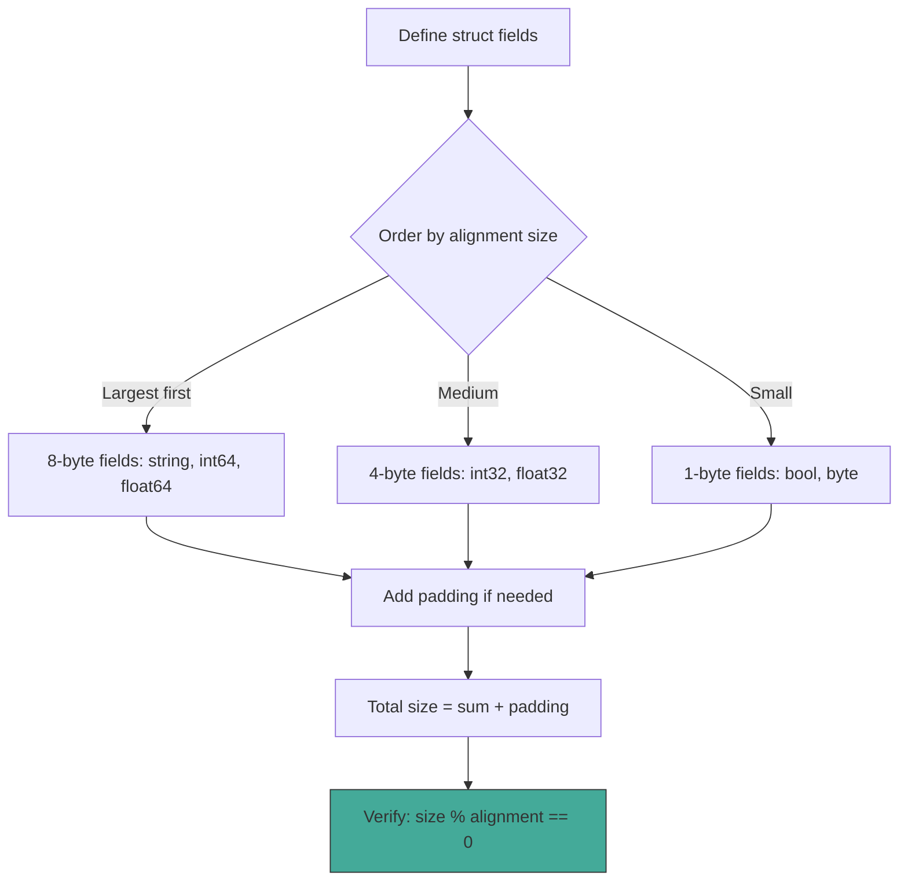
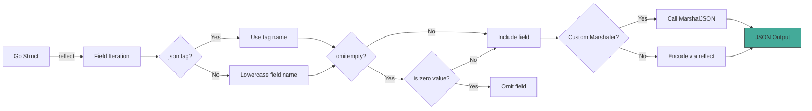

# Structs, Embedding, and Composition

## Learning Objectives

- Understand struct memory layout, alignment, and cache line optimization
- Apply composition over inheritance for flexible ML system design
- Implement embedding with proper method promotion and resolution rules
- Design JSON serialization contracts using struct tags and custom marshallers
- Optimize config structs for cache efficiency in ML serving systems
- Avoid common pitfalls in embedding resolution and serialization

---

## Introduction

Structs are the fundamental data modeling primitive in Go. Unlike classes in Java or Python, Go structs are **pure data containers** without built-in methods, inheritance hierarchies, or constructor functions. This separation of data from behavior is a deliberate design choice rooted in the observation that complex class hierarchies in ML systems become fragile when requirements change. A training configuration struct that inherits from a base config inherits all of its fields—wanted or not—creating tight coupling.

Go solves this through **composition**: building complex types by embedding simpler ones. A `TrainingConfig` struct embeds `LearningRateConfig`, `CheckpointConfig`, and `DistributedConfig` as needed, gaining their fields and methods without an `is-a` relationship. This is the same principle that makes Kubernetes, Docker, and Terraform extensible: they define small, focused structs and compose them into rich API types.

Memory layout is where Go's simplicity reveals unexpected depth. Struct fields are laid out in declaration order, with padding inserted between fields to satisfy alignment requirements. A poorly ordered struct can waste 40% of its memory to padding. In ML systems where feature vectors and batch tensors are stored in structs, this waste compounds across millions of samples. Understanding alignment is not micro-optimization—it is essential knowledge for anyone building high-throughput data pipelines.

Serialization is the other pillar. Go's `encoding/json` package uses reflection to traverse struct fields, reading struct tags to determine JSON field names, omit rules, and custom marshaling behavior. This contract between Go structs and external formats (JSON, YAML, Protocol Buffers) is how ML platforms exchange model configurations, experiment metadata, and API payloads. Mastering struct tags and custom marshalers is mandatory for production Go code.

This module completes the structural foundation of Go programming, building on [[01 - Syntax, Types, and Control Flow]] and [[02 - Functions, Methods, and Interfaces]].

---

## Module 1: Struct Memory Layout

### 1.1 Theoretical Foundation

A Go struct is a contiguous region of memory composed of its fields. The Go specification requires that fields are laid out in declaration order, but the compiler inserts **padding bytes** between fields to satisfy **alignment requirements**. Alignment ensures that each field starts at a memory address divisible by its alignment size, which allows the CPU to access the field in a single bus cycle.

The alignment rules are platform-dependent. On 64-bit systems (the common case), alignment follows these rules:
- `bool`, `int8`, `byte`: 1 byte alignment
- `int16`, `uint16`: 2 byte alignment
- `int32`, `float32`: 4 byte alignment
- `int64`, `float64`, `string`, `pointer`, `interface`: 8 byte alignment
- `struct`: alignment of its widest field
- `array`: alignment of its element type

The total size of a struct is the sum of its field sizes plus padding, rounded up to a multiple of the struct's alignment. This means field ordering directly affects memory usage.

**Cache lines** are the unit of memory transfer between CPU caches and main memory. Modern CPUs have 64-byte cache lines. When a struct fits entirely within one cache line, all its fields can be loaded in a single memory access. When a struct spans multiple cache lines, accessing different fields may cause cache misses. For ML serving systems processing millions of inference requests, cache-friendly struct layouts can improve throughput by 20-40%.

The theoretical principle is: **data layout is a type system concern**. Go's struct layout rules give you deterministic memory control without manual allocation, unlike C where padding must be managed by hand. This determinism is essential for writing Go code that interfaces with C libraries (via cgo) and for predicting memory usage in production systems.

### 1.2 Mental Model: Memory Layout Visualization

```
Example struct:

type ModelConfig struct {
    Name        string    // 16 bytes (8 ptr + 8 len)
    Version     int32     // 4 bytes
    LearningRate float64   // 8 bytes
    Enabled     bool      // 1 byte
    BatchSize   int       // 8 bytes
}

Memory layout (64-bit system):

Offset 0     8     16    20    24    32    40    48    56    64
       ┌─────┬─────┬─────┬─────┬─────┬─────┬─────┬─────┐
       │ Name (ptr) │ Name (len) │Ver  │ pad │Learning│ pad │
       │  8 bytes   │  8 bytes   │ 4 B │ 4 B │ 8 B   │ 0 B │
       └─────┴─────┴─────┴─────┴─────┴─────┴─────┴─────┘

       ┌─────┬─────┬─────┬─────┬─────┬─────┬─────┬─────┐
       │ Enabled│ pad │ BatchSize  │                       │
       │  1 B   │ 7 B │  8 bytes   │                       │
       └─────┴─────┴─────┴─────┴─────┴─────┴─────┴─────┘
       Offset 40                    48                     56

Total: 56 bytes (40 bytes data + 16 bytes padding = 28.6% waste)

---

Optimized by reordering:

type ModelConfigOptimized struct {
    Name        string    // 16 bytes (offset 0-15)
    LearningRate float64   //  8 bytes (offset 16-23)  ← moved up
    BatchSize   int       //  8 bytes (offset 24-31)  ← moved up
    Version     int32     //  4 bytes (offset 32-35)
    Enabled     bool      //  1 byte  (offset 36)
    // 3 bytes padding to round up to multiple of 8 (alignment of string)
}

Memory layout (optimized):

Offset 0     8     16    24    32    36    40
       ┌─────┬─────┬─────┬─────┬─────┬─────┬─────┐
       │ Name (ptr) │ Name (len) │LearningRate│Batch │
       │  8 bytes   │  8 bytes   │  8 bytes   │ 8 B  │
       └─────┴─────┴─────┴─────┴─────┴─────┴─────┘

       ┌─────┬─────┬─────┐
       │Ver  │ Ena │pad  │
       │ 4 B │ 1 B │ 3 B │
       └─────┴─────┴─────┘

Total: 40 bytes (37 bytes data + 3 bytes padding = 7.5% waste)

Savings: 16 bytes per struct × 1M configs = 16 MB saved
```

### 1.3 Syntax and Semantics

```go
package main

import (
    "fmt"
    "unsafe"
)

// Cache-line-optimized struct for hot path
// Fields accessed together are grouped
type InferenceRequest struct {
    // Hot fields: accessed on every request (1 cache line)
    ModelID   int64  // 8 bytes
    Timestamp int64  // 8 bytes
    Priority  int32  // 4 bytes
    // padding  4 bytes
    // Total: 24 bytes (fits in first cache line with other data)

    // Cold fields: rarely accessed (second cache line)
    UserAgent string // 16 bytes
    Metadata  []byte // 24 bytes (ptr + len + cap)
}

// Use unsafe.Sizeof to inspect struct size
func main() {
    req := InferenceRequest{}
    fmt.Printf("Size: %d bytes\n", unsafe.Sizeof(req))
    // Size: 64 bytes (with Metadata slice overhead)

    // Demonstrate alignment
    type BadOrder struct {
        b bool    // 1 byte
        i64 int64 // 8 bytes (padded to offset 8, 7 bytes wasted)
        i32 int32 // 4 bytes (offset 16, no waste)
    }
    type GoodOrder struct {
        i64 int64 // 8 bytes (offset 0)
        i32 int32 // 4 bytes (offset 8)
        b   bool  // 1 byte (offset 12)
        // 3 bytes padding to align struct to 8 bytes
    }
    fmt.Printf("Bad:  %d bytes\n", unsafe.Sizeof(BadOrder{}))  // 24
    fmt.Printf("Good: %d bytes\n", unsafe.Sizeof(GoodOrder{})) // 16
}
```

### 1.4 Visual Representation



**Wikimedia reference:** [Memory alignment](https://upload.wikimedia.org/wikipedia/commons/thumb/3/3a/Data_structure_alignment.svg/640px-Data_structure_alignment.svg.png)

### 1.5 Application in ML/AI Systems

| Pattern | Struct Design | ML Application |
|---------|--------------|----------------|
| Hot/cold splitting | Separate frequently-accessed from rare fields | Inference request metadata |
| Padding elimination | Reorder fields largest-to-smallest | Feature vector storage |
| Cache-line alignment | Pad to 64-byte boundaries | Batch tensor headers |
| Zero-copy structs | Match C struct layout for cgo | TensorFlow C API bindings |

**Real case:** TensorFlow Serving's Go client defines its `TensorProto` struct with fields ordered to minimize padding. When serving 100K requests/second, the 16-byte savings per struct translates to 1.6GB of reduced memory traffic per second, directly improving throughput.

### 1.6 Common Pitfalls

**Warning:** Structs containing `sync.Mutex` or `sync.WaitGroup` must never be copied after first use. The Go vet tool checks for this with the `copylocks` analyzer. Copying a mutex creates two mutexes that think they are one, leading to deadlocks.

**Tip:** Use `golang.org/x/tools/go/analysis/passes/fieldalignment` to automatically suggest optimal field ordering for your structs. Run it as part of your CI pipeline.

### 1.7 Knowledge Check

1. Why does `struct{ bool; int64 }` use 16 bytes while `struct{ int64; bool }` uses the same 16 bytes but with different padding?
2. How does struct alignment affect cgo interop with C libraries?
3. What is the relationship between struct size, cache lines, and inference throughput?

---

## Module 2: Composition over Inheritance

### 2.1 Theoretical Foundation

Go deliberately omits class inheritance. This is not a limitation—it is a design decision informed by decades of experience with object-oriented systems. The problem with inheritance is the **fragile base class problem**: changes to a base class can silently break subclasses. In ML systems where a `BaseTrainer` class might be subclassed by `ImageTrainer`, `TextTrainer`, and `AudioTrainer`, adding a field to `BaseTrainer` can corrupt the memory layout of all subclasses, change serialization behavior, or introduce unexpected method resolution order issues.

Go replaces inheritance with **composition**: building complex types by including simpler types as anonymous fields. This is technically called **embedding**, but the semantic model is composition, not inheritance. There is no `is-a` relationship between a type and its embedded types. A `Dog` struct that embeds `Animal` does not "extend" `Animal`—it contains an `Animal` that happens to have its fields and methods promoted.

The theoretical advantage is **decoupling**. In OOP inheritance, the subclass depends on the base class implementation details. In Go composition, the composed type depends only on the embedded type's public interface. If `Animal` changes its internal implementation but keeps its method signatures stable, `Dog` is unaffected. This is the Open-Closed Principle applied at the type system level.

The Liskov Substitution Principle (LSP) still applies in Go, but through interfaces rather than inheritance. A `Dog` satisfies the `Animal` interface if it implements all the required methods. The type system enforces substitution at compile time without the runtime overhead of virtual method dispatch.

### 2.2 Mental Model: Inheritance vs Composition

```
OOP INHERITANCE (Java/C++ style):
=================================

        ┌──────────────────┐
        │    Animal        │
        │──────────────────│
        │ - name: String   │
        │ - age: int       │
        │──────────────────│
        │ + speak(): void  │
        │ + move(): void   │
        └────────┬─────────┘
                 │ extends
        ┌────────┴─────────┐
        │      Dog         │
        │──────────────────│
        │ - breed: String  │◄── Inherits ALL Animal fields
        │──────────────────│    (wanted or not)
        │ + fetch(): void  │
        │ + speak(): void  │◄── Overrides base method
        └────────┬─────────┘    (dynamic dispatch)
                 │ extends
        ┌────────┴─────────┐
        │    Bulldog       │
        │──────────────────│
        │ + snore(): void  │
        └──────────────────┘

Problem: Adding 'vaccinated: bool' to Animal
         affects Dog AND Bulldog silently.

---

GO COMPOSITION:
===============

┌──────────────────┐       ┌──────────────────┐
│  Animal          │       │  Dog             │
│──────────────────│       │──────────────────│
│  Name string     │       │  Animal          │◄── Embedded field
│  Age  int        │       │  Breed string    │    (named or anonymous)
│──────────────────│       │──────────────────│
│  Speak() string  │       │  Fetch() string  │
│  Move() string   │       │  Speak() string  │◄── Shadows Animal.Speak
└──────────────────┘       └──────────────────┘

Dog.Animal.Name   ← Promoted field access
Dog.Animal.Speak  ← Promoted method access
Dog.Speak()       ← Calls Dog's own method, not Animal's

No dynamic dispatch. No fragile base class.
Adding fields to Animal does not break Dog.
```

### 2.3 Syntax and Semantics

```go
package main

import "fmt"

// Base component
type Metadata struct {
    ID        string
    CreatedAt string
    UpdatedAt string
}

func (m Metadata) Summary() string {
    return fmt.Sprintf("ID: %s, Created: %s", m.ID, m.CreatedAt)
}

// Base component
type Tags struct {
    Labels map[string]string
}

func (t Tags) HasLabel(key string) bool {
    _, ok := t.Labels[key]
    return ok
}

// Composed type: embeds both components
type Model struct {
    Metadata         // Promoted: model.ID, model.Summary()
    Tags             // Promoted: model.HasLabel()
    Name      string
    Version   int
}

// Method on Model that shadows Metadata.Summary
func (m Model) Summary() string {
    return fmt.Sprintf("%s v%d (%s)", m.Name, m.Version, m.ID)
}

func main() {
    m := Model{
        Metadata: Metadata{ID: "m-123", CreatedAt: "2024-01-01"},
        Tags:     Tags{Labels: map[string]string{"env": "prod"}},
        Name:     "ResNet50",
        Version:  3,
    }

    // Promoted field access
    fmt.Println(m.ID)             // "m-123"
    fmt.Println(m.CreatedAt)      // "2024-01-01"

    // Promoted method access
    fmt.Println(m.HasLabel("env")) // true

    // Shadowed method: Model's Summary takes precedence
    fmt.Println(m.Summary()) // "ResNet50 v3 (m-123)"

    // Access embedded method explicitly
    fmt.Println(m.Metadata.Summary()) // "ID: m-123, Created: 2024-01-01"
}
```

### 2.4 Visual Representation

**OOP Inheritance vs Go Composition Table:**

| Aspect | OOP Inheritance | Go Composition |
|--------|----------------|----------------|
| Relationship | `is-a` (Dog is Animal) | `has-a` (Dog has Animal) |
| Method dispatch | Dynamic (virtual table) | Static (method promotion) |
| Field access | Direct to base fields | Promoted from embedded field |
| Diamond problem | Possible (multiple inheritance) | Impossible (no inheritance) |
| Method override | Override base method | Shadow (different method) |
| Zero value | Inherited from parent | Embedded struct is zero-valued |
| Coupling | Subclass depends on base impl | Composed type depends on interface |

```mermaid
flowchart LR
    subgraph OOP["OOP Inheritance"]
        A1[Animal] -->|extends| B1[Dog]
        B1 -->|extends| C1[Bulldog]
        A1 -.->|virtual dispatch| D1[speak()]
    end

    subgraph Go["Go Composition"]
        A2[Animal struct] -->|embeds| B2[Dog struct]
        B2 -->|embeds| C2[Bulldog struct]
        A2 -->|promoted| D2[Speak()]
        B2 -->|shadows| E2[Speak()]
    end
```

**Wikimedia reference:** [Composition vs Inheritance](https://upload.wikimedia.org/wikipedia/commons/thumb/9/9e/Composite_aggregation.svg/640px-Composite_aggregation.svg.png)

### 2.5 Application in ML/AI Systems

| OOP Pattern | Go Equivalent | ML Use Case |
|-------------|---------------|-------------|
| BaseTrainer → ImageTrainer | `Trainer` embeds `Config` | Training pipelines with shared config |
| AbstractModel → ConcreteModel | `Model` interface + struct composition | Pluggable model backends |
| Decorator pattern | Embed + shadow methods | Adding logging to existing models |
| Strategy pattern | Function fields in struct | Swappable loss functions |
| Template method | Composition + hooks | Training loop with customizable steps |

**Real case:** Hugging Face's Go inference library uses composition to build model types. A `TransformerModel` struct embeds `TokenEmbedding`, `AttentionLayer`, and `FeedForward` components. Each component is independently testable and reusable. Adding a new attention mechanism (like FlashAttention) requires only a new `AttentionLayer` implementation, not a new class hierarchy.

### 2.6 Common Pitfalls

**Warning:** Do not confuse embedding with subclassing. An embedded field does not become a "superclass." You cannot use type assertions to convert between a composed type and its embedded type: `dog.(Animal)` will not compile. If you need type-based dispatch, use interfaces.

**Tip:** When embedding creates ambiguity (two embedded types have a method with the same name), Go requires you to disambiguate explicitly. This is a feature, not a bug—it forces you to resolve conflicts at compile time rather than discovering them at runtime.

### 2.7 Knowledge Check

1. Why does Go reject the "diamond problem" that plagues languages with multiple inheritance?
2. How would you model a neural network layer hierarchy using Go composition?
3. What happens when two embedded types define a method with the same name?

---

## Module 3: Embedding

### 3.1 Theoretical Foundation

Embedding in Go is the mechanism by which one struct's fields and methods are **promoted** to another struct. When you write `type Dog struct { Animal }`, the fields and methods of `Animal` become directly accessible on `Dog` as if they were defined there. This is syntactic sugar over composition: `Dog` contains an `Animal` field, and the compiler inserts the field access automatically when you write `dog.Name` instead of `dog.Animal.Name`.

The promotion rules are precise and deterministic:

1. **Field promotion:** An embedded field's exported fields are promoted if no other field or method at the same level has the same name.
2. **Method promotion:** An embedded field's exported methods are promoted under the same uniqueness rule.
3. **Conflict resolution:** If two embedded fields promote the same name, the compiler requires explicit disambiguation. There is no automatic resolution or priority.
4. **Pointer embedding:** `*T` embeds the same as `T`, but accessing promoted fields through a nil pointer causes a panic. The compiler cannot prevent this statically.

The theoretical significance is that embedding is **purely lexical**. It does not create a type relationship, an interface satisfaction, or a subtype hierarchy. The promoted members exist only as convenient access paths. This is fundamentally different from inheritance, where the relationship between base and derived types is semantic and enforced by the type system.

In ML systems, embedding enables building layered components. A `TrainingPipeline` embeds `DataLoader`, `Preprocessor`, and `Trainer`. Each layer is independently configurable, testable, and replaceable. This matches the mental model of ML practitioners who think in terms of composable stages: load, transform, train, evaluate.

### 3.2 Mental Model: Embedding Resolution Order

```
┌──────────────────────────────────────────────────────────────────┐
│                    Embedding Resolution Rules                     │
├──────────────────────────────────────────────────────────────────┤
│                                                                  │
│  Step 1: Check the type itself                                   │
│  ┌─────────────────────────────────────────────────────────────┐ │
│  │ Does the type T have a field or method named X?            │ │
│  │ If YES → use it (highest priority)                          │ │
│  │ If NO  → continue to Step 2                                │ │
│  └─────────────────────────────────────────────────────────────┘ │
│                                                                  │
│  Step 2: Check each embedded field (declaration order)           │
│  ┌─────────────────────────────────────────────────────────────┐ │
│  │ For each embedded field E in declaration order:             │ │
│  │   Does E have a field or method named X?                    │ │
│  │   If YES → use it (first match wins)                        │ │
│  │   If NO  → continue to next embedded field                  │ │
│  └─────────────────────────────────────────────────────────────┘ │
│                                                                  │
│  Step 3: Check embedded fields of embedded fields (recursive)    │
│  ┌─────────────────────────────────────────────────────────────┐ │
│  │ Apply Steps 1-2 recursively to each embedded field's        │ │
│  │ embedded fields. Depth-first, left-to-right.                │ │
│  └─────────────────────────────────────────────────────────────┘ │
│                                                                  │
│  Step 4: Conflict?                                               │
│  ┌─────────────────────────────────────────────────────────────┐ │
│  │ If two or more embedded fields at the SAME level promote    │ │
│  │ the same name → COMPILER ERROR: ambiguous selector          │ │
│  │ Fix: Use explicit field access (t.E1.X or t.E2.X)          │ │
│  └─────────────────────────────────────────────────────────────┘ │
│                                                                  │
└──────────────────────────────────────────────────────────────────┘
```

```
Example resolution:

type A struct { Name string }
type B struct { Name string; A }
type C struct { B; A }

C.Name → AMBIGUOUS! (B promotes A.Name, and C embeds A directly)
Fix:   C.B.Name or C.A.Name

---

type A struct { X int }
type B struct { A }
type C struct { B; Y int }

C.X → Resolves to B.A.X (C → B → A, two levels deep)
C.Y → Resolves directly (C.Y, one level)
```

### 3.3 Syntax and Semantics

```go
package main

import "fmt"

// Layer 1: Base configuration
type BaseConfig struct {
    Debug   bool
    Timeout int // seconds
}

func (bc BaseConfig) Validate() error {
    if bc.Timeout <= 0 {
        return fmt.Errorf("timeout must be positive")
    }
    return nil
}

// Layer 2: Training-specific config
type TrainingConfig struct {
    BaseConfig          // Embedded: promotes Debug, Timeout, Validate
    LearningRate float64
    Epochs       int
}

func (tc TrainingConfig) Summary() string {
    return fmt.Sprintf("LR=%v, Epochs=%d, Timeout=%ds",
        tc.LearningRate, tc.Epochs, tc.Timeout)
}

// Layer 3: Full model configuration
type ModelConfig struct {
    TrainingConfig  // Embedded: promotes all TrainingConfig + BaseConfig members
    ModelName       string
    Version         int
}

// Override: ModelConfig shadows TrainingConfig.Summary
func (mc ModelConfig) Summary() string {
    return fmt.Sprintf("%s v%d: %s",
        mc.ModelName, mc.Version, mc.TrainingConfig.Summary())
}

func main() {
    cfg := ModelConfig{
        TrainingConfig: TrainingConfig{
            BaseConfig:  BaseConfig{Debug: true, Timeout: 3600},
            LearningRate: 0.001,
            Epochs:       100,
        },
        ModelName: "ResNet50",
        Version:   3,
    }

    // Promoted fields accessible at any depth
    fmt.Println(cfg.Debug)           // true (from BaseConfig)
    fmt.Println(cfg.Timeout)         // 3600 (from BaseConfig)
    fmt.Println(cfg.LearningRate)    // 0.001 (from TrainingConfig)
    fmt.Println(cfg.ModelName)       // "ResNet50" (direct field)

    // Promoted method
    fmt.Println(cfg.Validate()) // nil (from BaseConfig.Validate)

    // Shadowed method
    fmt.Println(cfg.Summary()) // "ResNet50 v3: LR=0.001, Epochs=100, Timeout=3600s"

    // Explicit access to shadowed method
    fmt.Println(cfg.TrainingConfig.Summary()) // "LR=0.001, Epochs=100, Timeout=3600s"
}
```

### 3.4 Visual Representation

```mermaid
flowchart TD
    subgraph EmbeddingHierarchy
        A[BaseConfig] -->|embeds| B[TrainingConfig]
        B -->|embeds| C[ModelConfig]
    end

    subgraph Promotion["Promoted Access"]
        C -.->|promotes| D[Debug, Timeout]
        C -.->|promotes| E[LearningRate, Epochs]
        C -.->|promotes| F[Validate()]
        C -->|direct| G[ModelName, Version]
    end

    subgraph Shadowing
        H[TrainingConfig.Summary] -.->|shadowed by| I[ModelConfig.Summary]
    end
```

**Wikimedia reference:** [Promotion diagram](https://upload.wikimedia.org/wikipedia/commons/thumb/d/d9/Structural_Pattern_UML.png/640px-Structural_Pattern_UML.png)

### 3.5 Application in ML/AI Systems

| Embedding Pattern | Structure | ML Application |
|-------------------|-----------|----------------|
| Layered config | `Server` embeds `Cache` embeds `Database` | ML serving infrastructure |
| Component assembly | `Pipeline` embeds `Loader`, `Trainer`, `Evaluator` | Training orchestration |
| Capability mixin | `SecureModel` embeds `Authenticator` | Model with authentication |
| Metadata extension | `Experiment` embeds `Metadata` + `Metrics` | Experiment tracking |

**Real case:** Kubeflow's Go controller defines a `TrainingJob` struct that embeds `JobSpec`, `ResourceConfig`, and `Status`. Each embedded struct is independently defined and tested. The composed `TrainingJob` gains all their fields and methods, creating a rich API type without inheritance complexity. This pattern mirrors Kubernetes' own API types.

### 3.6 Common Pitfalls

**Warning:** Nil pointer embedding causes panics. If `*BaseConfig` is embedded and the pointer is nil, accessing promoted fields panics at runtime. The compiler cannot prevent this. Always initialize embedded pointer fields.

```go
type Config struct {
    *BaseConfig // If nil, cfg.Debug panics!
}

func main() {
    cfg := Config{} // BaseConfig is nil
    _ = cfg.Debug   // PANIC: nil pointer dereference
}
```

**Tip:** Prefer embedding structs (values) over embedding pointers unless you need optional components. Value embedding guarantees the embedded struct is initialized to its zero value, avoiding nil panics.

### 3.7 Knowledge Check

1. How does Go resolve a promoted field name when two embedded types have the same field?
2. Why can you not type-assert from a composed type to its embedded type?
3. When would you choose pointer embedding over value embedding?

---

## Module 4: JSON and Struct Tags

### 4.1 Theoretical Foundation

Struct tags are string literals attached to struct fields that serve as metadata for reflection-based processing. The most common use is JSON serialization, but tags are also used for YAML, Protocol Buffers, database ORMs, and validation frameworks. A tag has the format `` `key:"value"` `` where `key` identifies the processor and `value` specifies options.

The Go `encoding/json` package uses the `reflect` package to traverse struct fields at runtime. For each field, it checks for a `json` tag and uses the tag's value as the JSON key name. Without a tag, the default behavior is to use the field name with the first letter lowercased. The `omitempty` option causes the field to be omitted from JSON output if it holds a zero value (empty string, 0, false, nil, etc.).

The theoretical principle underlying struct tags is **separation of concerns**. The Go struct defines the in-memory representation of data. The struct tag defines the serialization contract. These are orthogonal concerns: you can change the Go field name without changing the JSON field name, and vice versa. This separation is critical for API stability—the JSON API can remain stable even as the Go code evolves.

Custom marshaling implements the `json.Marshaler` and `json.Unmarshaler` interfaces. When a type implements these interfaces, the JSON encoder/decoder delegates to them instead of using reflection. This gives you complete control over serialization and is essential for types that do not have a natural JSON representation (like `time.Time`, `big.Int`, or custom numeric types).

In ML systems, struct tags define the contract between Go services and external clients. A model serving API's request struct uses tags to define the JSON payload format. Experiment tracking systems use tags to serialize configuration trees. Feature stores use tags to map Go structs to database columns. Without proper tag usage, every API change requires code changes on both sides of the wire.

### 4.2 Mental Model: JSON Serialization Flow

```
┌─────────────────────────────────────────────────────────────────┐
│                    JSON SERIALIZATION FLOW                       │
├─────────────────────────────────────────────────────────────────┤
│                                                                 │
│  Input: Go Struct                                               │
│  ┌──────────────────────────────────────────────────────────┐  │
│  │  type Experiment struct {                                │  │
│  │      ID        string    `json:"id"`                     │  │
│  │      Name      string    `json:"name"`                   │  │
│  │      CreatedAt time.Time `json:"created_at"`             │  │
│  │      Private   bool      `json:"private,omitempty"`      │  │
│  │      Secret    string    `json:"-"`                      │  │
│  │  }                                                       │  │
│  └──────────────────────────────────────────────────────────┘  │
│                           │                                     │
│                           ▼                                     │
│               ┌───────────────────────┐                        │
│               │  reflect.StructField  │                        │
│               │  For each exported    │                        │
│               │  field:               │                        │
│               │  1. Check json tag    │                        │
│               │  2. Get field name    │                        │
│               │  3. Check omitempty   │                        │
│               │  4. Check "-" (skip)  │                        │
│               └───────────┬───────────┘                        │
│                           │                                     │
│           ┌───────────────┼───────────────┐                     │
│           │               │               │                     │
│           ▼               ▼               ▼                     │
│  ┌─────────────┐ ┌─────────────┐ ┌─────────────┐              │
│  │ Has "-" tag │ │ Has omitempty│ │ Normal field│              │
│  │ → SKIP      │ │ → Skip if   │ │ → Encode    │              │
│  │             │ │   zero value │ │   normally  │              │
│  └─────────────┘ └─────────────┘ └─────────────┘              │
│           │               │               │                     │
│           └───────────────┼───────────────┘                     │
│                           ▼                                     │
│  Output: JSON String                                           │
│  ┌──────────────────────────────────────────────────────────┐  │
│  │  {                                                       │  │
│  │    "id": "exp-001",                                      │  │
│  │    "name": "ResNet Training",                            │  │
│  │    "created_at": "2024-01-15T10:30:00Z"                  │  │
│  │    // "private" omitted (false is zero value)            │  │
│  │    // "secret" omitted (tagged with "-")                 │  │
│  │  }                                                       │  │
│  └──────────────────────────────────────────────────────────┘  │
│                                                                 │
└─────────────────────────────────────────────────────────────────┘
```

### 4.3 Syntax and Semantics

```go
package main

import (
    "encoding/json"
    "fmt"
    "time"
)

// Struct tags define JSON contract
type Experiment struct {
    ID          string            `json:"id"`
    Name        string            `json:"name"`
    CreatedAt   time.Time         `json:"created_at"`
    Private     bool              `json:"private,omitempty"`
    Tags        map[string]string `json:"tags,omitempty"`
    Secret      string            `json:"-"` // Never serialize
    Description string            `json:"description,omitempty"`
}

// Custom marshaler for types needing special JSON handling
type Duration time.Duration

func (d Duration) MarshalJSON() ([]byte, error) {
    return json.Marshal(time.Duration(d).String())
}

func (d *Duration) UnmarshalJSON(data []byte) error {
    var s string
    if err := json.Unmarshal(data, &s); err != nil {
        return err
    }
    dur, err := time.ParseDuration(s)
    if err != nil {
        return err
    }
    *d = Duration(dur)
    return nil
}

type TrainingRun struct {
    ModelName string   `json:"model_name"`
    Timeout   Duration `json:"timeout"`
}

func main() {
    exp := Experiment{
        ID:        "exp-001",
        Name:      "ResNet Training",
        CreatedAt: time.Now(),
        Private:   false, // Will be omitted (omitempty + zero value)
        Secret:    "supersecret",
    }

    data, _ := json.MarshalIndent(exp, "", "  ")
    fmt.Println(string(data))
    // Note: "private" and "secret" are absent from output

    // Unmarshal
    var parsed Experiment
    json.Unmarshal(data, &parsed)
    fmt.Println(parsed.Name) // "ResNet Training"

    // Custom marshaler
    run := TrainingRun{
        ModelName: "BERT",
        Timeout:   Duration(30 * time.Minute),
    }
    runData, _ := json.Marshal(run)
    fmt.Println(string(runData))
    // {"model_name":"BERT","timeout":"30m0s"}
}
```

### 4.4 Visual Representation



**Wikimedia reference:** [Serialization diagram](https://upload.wikimedia.org/wikipedia/commons/thumb/e/e0/Serialization_of_a_Java_object.svg/640px-Serialization_of_a_Java_object.svg.png)

### 4.5 Application in ML/AI Systems

| Tag Feature | Usage | ML Application |
|-------------|-------|----------------|
| `json:"name"` | Custom field name | API payload stability |
| `omitempty` | Skip zero values | Optional hyperparameters |
| `json:"-"` | Never serialize | Passwords, API keys |
| `yaml:"name"` | YAML support | Config files, Kubernetes manifests |
| Custom marshaler | Special format | ONNX model metadata, duration strings |

**Real case:** MLflow's Go client uses struct tags to map Go experiment structs to the MLflow REST API. The `RunInfo` struct has tags for JSON (`json:"run_id"`), database columns (`db:"run_id"`), and protobuf (`protobuf:"bytes,1,opt,name=run_id"`). This triple-tagging allows a single struct definition to serve as the source of truth for API, database, and RPC layers.

### 4.6 Common Pitfalls

**Warning:** `omitempty` does not work as expected for struct types. A zero-valued struct is not considered "empty" by `omitempty`—it serializes as `{}`. To omit zero-valued structs, use a pointer to the struct (`*NestedConfig`) so the nil pointer is omitted.

**Tip:** Use `json:"-"` for any field that should never be serialized, including passwords, API keys, and internal implementation details. Relying on unexported fields for security is insufficient because reflection can still access them.

### 4.7 Knowledge Check

1. Why does `omitempty` not omit a zero-valued nested struct?
2. How would you implement a custom marshaler for a `Matrix` type that serializes as nested arrays?
3. What is the difference between unexported fields and fields tagged with `json:"-"`?

---

## Compression Code

```go
package main

import (
    "encoding/json"
    "fmt"
    "time"
)

// --- Struct Memory Layout ---

type InferenceRequest struct {
    ModelID   int64  // 8 bytes
    Timestamp int64  // 8 bytes
    Priority  int32  // 4 bytes
    // padding  4 bytes
    UserAgent string // 16 bytes
}

// --- Composition ---

type Metadata struct {
    ID        string
    CreatedAt time.Time
}

func (m Metadata) Summary() string {
    return fmt.Sprintf("ID: %s", m.ID)
}

type Tags struct {
    Labels map[string]string
}

type Model struct {
    Metadata
    Tags
    Name    string
    Version int
}

func (m Model) Summary() string {
    return fmt.Sprintf("%s v%d", m.Name, m.Version)
}

// --- Embedding ---

type BaseConfig struct {
    Debug   bool
    Timeout int
}

func (bc BaseConfig) Validate() error {
    if bc.Timeout <= 0 {
        return fmt.Errorf("timeout must be positive")
    }
    return nil
}

type TrainingConfig struct {
    BaseConfig
    LearningRate float64
}

type FullConfig struct {
    TrainingConfig
    ModelName string
}

// --- JSON Tags ---

type Experiment struct {
    ID        string    `json:"id"`
    Name      string    `json:"name"`
    CreatedAt time.Time `json:"created_at"`
    Private   bool      `json:"private,omitempty"`
    Secret    string    `json:"-"`
}

type Duration time.Duration

func (d Duration) MarshalJSON() ([]byte, error) {
    return json.Marshal(time.Duration(d).String())
}

func (d *Duration) UnmarshalJSON(data []byte) error {
    var s string
    if err := json.Unmarshal(data, &s); err != nil {
        return err
    }
    dur, err := time.ParseDuration(s)
    if err != nil {
        return err
    }
    *d = Duration(dur)
    return nil
}

type TrainingRun struct {
    ModelName string   `json:"model_name"`
    Timeout   Duration `json:"timeout"`
}

func main() {
    // Composition
    m := Model{
        Metadata: Metadata{ID: "m-123", CreatedAt: time.Now()},
        Tags:     Tags{Labels: map[string]string{"env": "prod"}},
        Name:     "ResNet50",
        Version:  3,
    }
    fmt.Println(m.Summary())        // "ResNet50 v3"
    fmt.Println(m.Metadata.Summary()) // "ID: m-123"

    // JSON
    exp := Experiment{
        ID:        "exp-001",
        Name:      "Training Run",
        CreatedAt: time.Now(),
        Secret:    "hidden",
    }
    data, _ := json.MarshalIndent(exp, "", "  ")
    fmt.Println(string(data))

    // Custom marshaler
    run := TrainingRun{
        ModelName: "BERT",
        Timeout:   Duration(30 * time.Minute),
    }
    runData, _ := json.Marshal(run)
    fmt.Println(string(runData))
}
```

---

## Documented Project

### Description

Build a **Schema Registry for ML Feature Definitions** using Go structs, embedding, composition, and custom JSON marshaling. The registry stores feature schemas used in ML training pipelines, similar to Feast or Tecton feature stores. Each schema includes embedded metadata, version information, and type definitions that serialize to JSON with human-readable formats.

### Functional Requirements

1. Define a `FeatureSchema` struct with embedded `Metadata` (ID, created time, version) and `Spec` (name, type, constraints).
2. Implement a `Version` struct using embedding for semantic versioning (major, minor, patch).
3. Create a custom `FeatureType` enum that serializes as lowercase strings (`"int64"`, `"float64"`, `"string"`, `"timestamp"`) via `MarshalJSON`/`UnmarshalJSON`.
4. Build a `Registry` struct containing `map[string]FeatureSchema` with `Add`, `Get`, `List`, and `Delete` methods.
5. Use struct tags: `json:"id"`, `json:"name,omitempty"`, `json:"-"` for sensitive fields.
6. Ensure zero-valued optional fields (like `Description`) are omitted via `omitempty`.
7. Persist the registry to JSON file and reload with identical state.

### Main Components

- `schema.go`: Core `FeatureSchema`, `Metadata`, `Spec` structs with embedding.
- `types.go`: `FeatureType` custom type with JSON marshal/unmarshal.
- `version.go`: `Version` struct with string parsing and comparison.
- `registry.go`: In-memory `Registry` with JSON persistence.
- `main.go`: CLI for adding features, listing schemas, exporting to JSON.

### Success Metrics

- All structs serialize and deserialize without data loss (round-trip test).
- Custom `FeatureType` marshaler produces lowercase strings.
- Embedded `Metadata` fields are accessible directly on `FeatureSchema`.
- `omitempty` correctly omits zero-valued optional fields.
- Registry persists to `schemas.json` and reloads identically.
- `go test ./...` passes with 95%+ coverage.
- `go vet ./...` reports no issues.

### References

- Go Struct Tags: https://pkg.go.dev/reflect#StructTag
- encoding/json Documentation: https://pkg.go.dev/encoding/json
- Effective Go - Structs: https://go.dev/doc/effective_go#structs
- Go Memory Model: https://golang.org/ref/spec#Size_and_alignment_guarantees
