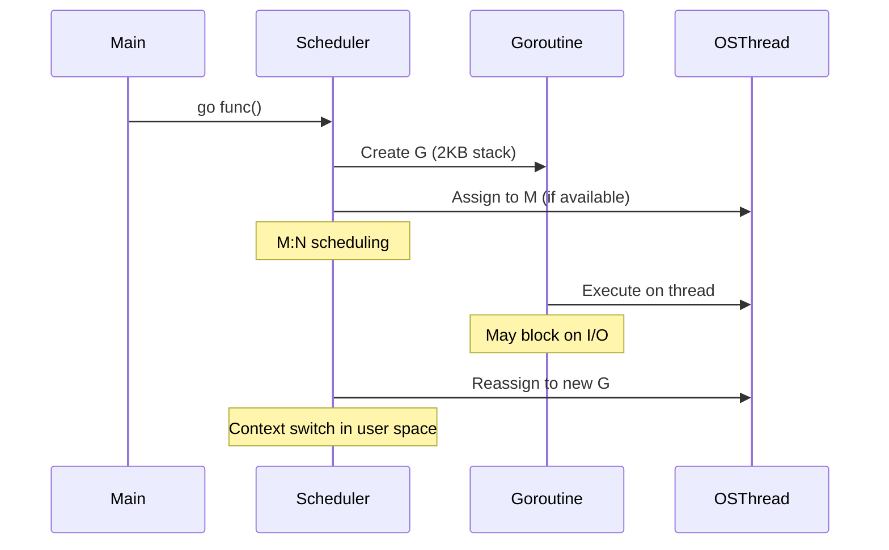
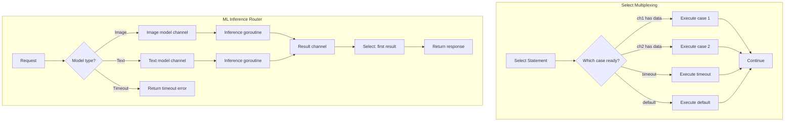

# 🧵 Goroutines and Channels

## 🎯 Learning Objectives
- Understand the Go runtime scheduler's GMP model and how goroutines differ from OS threads
- Implement buffered and unbuffered channels with proper synchronization semantics
- Apply the `select` statement for multiplexing and timeout patterns
- Design concurrency patterns: worker pools, fan-out/fan-in, and pipelines
- Build ML inference servers using Go's concurrency primitives for high-throughput model serving
- Diagnose and prevent common concurrency bugs: deadlocks, race conditions, and goroutine leaks

## Introduction
Concurrency is not parallelism, though the two are often conflated. Concurrency is about dealing with lots of things at once; parallelism is about doing lots of things at once. Go's concurrency model, centered on goroutines and channels, was explicitly designed to make concurrent programs easier to write and reason about than traditional thread-based models. For ML engineers, this model is transformative: training pipelines require concurrent data loading, model serving systems handle thousands of simultaneous inference requests, and distributed feature stores aggregate values from multiple backends in parallel.

Python's Global Interpreter Lock (GIL) forces ML infrastructure developers to reach for multiprocessing or external services when true parallelism is needed. Go removes this limitation entirely. A single Go process can spawn hundreds of thousands of goroutines, each communicating through channels that enforce safe data sharing by design. This makes Go the language of choice for building the control planes of ML platforms—Kubernetes schedules containers, Istio routes traffic, and Kubeflow orchestrates pipelines, all written in Go.

This module demystifies the Go scheduler, explores channel semantics in depth, and teaches the canonical concurrency patterns that appear in every production Go codebase. By understanding the difference between buffered and unbuffered channels, and by mastering patterns like worker pools and fan-out/fan-in, you will be able to build systems that saturate multi-core processors without data races. These concepts are the capstone of [[01 - Syntax, Types, and Control Flow]] and [[02 - Functions, Methods, and Interfaces]], applying them at scale.

## Module 1: Goroutine Theory and the GMP Model

### 1.1 Theoretical Foundation (WHY)
Goroutines are Go's answer to the limitations of traditional operating system threads. An OS thread, while providing true parallelism, comes with significant overhead: each thread requires a megabyte-sized stack allocation, expensive kernel-level context switches, and system call overhead for creation and teardown. In a world where web servers and ML systems need to handle millions of concurrent operations, the OS thread model breaks down. Go's designers recognized that most threads spend much of their time blocked—waiting for network I/O, timers, or channel operations—so why waste an entire OS thread during those periods?

The solution is the goroutine: a user-space thread managed entirely by the Go runtime. Goroutines start with a stack of just 2KB (compared to ~1MB for OS threads) and can grow dynamically as needed. This means you can create millions of goroutines in a single process without exhausting memory. The Go runtime scheduler multiplexes these goroutines onto a smaller number of OS threads using an M:N model—M goroutines are scheduled onto N OS threads (where N typically equals GOMAXPROCS, the number of logical CPUs). This design provides the parallelism benefits of OS threads with the lightweight scalability of user-space threads.

The key insight is that the scheduler can transparently handle blocking operations. When a goroutine blocks on a channel operation or system call, the scheduler detaches it from its current OS thread (M) and replaces it with another runnable goroutine. If the blocking operation is a system call that requires kernel intervention, the runtime can spin up additional OS threads to ensure other goroutines continue making progress. This intelligent resource management is why Go servers can maintain high throughput even under heavy load.

In ML systems, this model is particularly valuable for inference servers. A typical model serving endpoint must handle thousands of concurrent prediction requests, each requiring CPU computation, memory access, and potential network I/O for feature retrieval. Using goroutines, each request can be handled as a lightweight unit of work, with the runtime automatically managing CPU utilization across cores. This eliminates the need for complex thread pool management or asynchronous callback patterns that plague Python and Java ML serving frameworks.

### 1.2 Mental Model (ASCII diagram)
```
Traditional OS Thread Model (1:1)
┌─────────────────┐    ┌─────────────────┐    ┌─────────────────┐
│     App Thread 1│    │     App Thread 2│    │     App Thread 3│
│     Stack: 1MB  │    │     Stack: 1MB  │    │     Stack: 1MB  │
└────────┬────────┘    └────────┬────────┘    └────────┬────────┘
         │                      │                      │
         ▼                      ▼                      ▼
┌─────────────────┐    ┌─────────────────┐    ┌─────────────────┐
│   OS Thread 1   │    │   OS Thread 2   │    │   OS Thread 3   │
│   Kernel Stack  │    │   Kernel Stack  │    │   Kernel Stack  │
└─────────────────┘    └─────────────────┘    └─────────────────┘
Memory: ~3MB total    Context switches: Expensive (kernel mode)

Go's M:N Scheduler Model
┌──────────────────────────────────────────────────────────────┐
│                     Goroutine Pool (Millions)                │
│  ┌─────┐ ┌─────┐ ┌─────┐ ┌─────┐ ┌─────┐ ┌─────┐          │
│  │  G1 │ │  G2 │ │  G3 │ │  G4 │ │ ... │ │  GN │          │
│  │2KB  │ │2KB  │ │2KB  │ │2KB  │ │     │ │2KB  │          │
│  └──┬──┘ └──┬──┘ └──┬──┘ └──┬──┘ └──┬──┘ └──┬──┘          │
└─────┼───────┼───────┼───────┼───────┼───────┼───────────────┘
      │       │       │       │       │       │
      └───────┴───────┼───────┴───────┴───────┘
                      │
                      ▼
┌──────────────────────────────────────────────────────────────┐
│                    Go Runtime Scheduler (GMP)                │
│  ┌──────────────────────────────────────────────────────┐   │
│  │    Global Run Queue        │  Local Run Queue (P1)   │   │
│  │    ┌─────┐ ┌─────┐       │  ┌─────┐ ┌─────┐        │   │
│  │    │  Gx │ │  Gy │       │  │  G1 │ │  G2 │        │   │
│  │    └─────┘ └─────┘       │  └─────┘ └─────┘        │   │
│  └──────────────────────────────────────────────────────┘   │
└──────────────────────────┬───────────────────────────────────┘
                           │
          ┌────────────────┼────────────────┐
          ▼                ▼                ▼
   ┌─────────────┐  ┌─────────────┐  ┌─────────────┐
   │   P1        │  │   P2        │  │   P3        │
   │ Processor   │  │ Processor   │  │ Processor   │
   │ (Logical)   │  │ (Logical)   │  │ (Logical)   │
   └──────┬──────┘  └──────┬──────┘  └──────┬──────┘
          │                │                │
          ▼                ▼                ▼
   ┌─────────────┐  ┌─────────────┐  ┌─────────────┐
   │   M1        │  │   M2        │  │   M3        │
   │ OS Thread   │  │ OS Thread   │  │ OS Thread   │
   │ (Kernel)    │  │ (Kernel)    │  │ (Kernel)    │
   └─────────────┘  └─────────────┘  └─────────────┘
Memory: ~2KB per goroutine    Context switches: Cheap (user space)
```

### 1.3 Syntax and Semantics (code with comments)
```go
package main

import (
	"fmt"
	"sync"
	"time"
)

func main() {
	// Basic goroutine launch
	go func() {
		fmt.Println("Goroutine 1: Started")
		time.Sleep(100 * time.Millisecond)
		fmt.Println("Goroutine 1: Finished")
	}()

	// Goroutine with parameters - note: closure captures loop variable
	var wg sync.WaitGroup
	for i := 0; i < 5; i++ {
		wg.Add(1)
		go func(id int) {
			defer wg.Done()
			fmt.Printf("Worker %d: Processing\n", id)
			time.Sleep(time.Duration(id*50) * time.Millisecond)
			fmt.Printf("Worker %d: Complete\n", id)
		}(i) // Pass i as argument to avoid closure capture issues
	}

	// Wait for all goroutines to complete
	wg.Wait()
	fmt.Println("All goroutines completed")

	// Demonstrating goroutine stack growth
	deepRecursion(10)
}

// deepRecursion demonstrates how goroutine stacks grow dynamically
func deepRecursion(depth int) {
	if depth <= 0 {
		return
	}
	// Each recursive call adds to the goroutine's stack
	// Go runtime automatically grows the stack when needed
	// Starting at 2KB, can grow to 1GB (default limit)
	buf := make([]byte, 1024) // Allocate some stack space
	_ = buf
	fmt.Printf("Recursion depth: %d, stack usage increasing\n", depth)
	deepRecursion(depth - 1)
}
```

### 1.4 Visual Representation (Mermaid + Wikimedia)



### 1.5 Application in ML/AI Systems
**ML Inference Server Design:**  
A concurrent model inference server leverages goroutines to handle thousands of simultaneous prediction requests. Each request runs in its own goroutine, which loads the model (if not cached), preprocesses input features, runs inference, and returns the prediction. The Go runtime's efficient scheduling ensures CPU cores are fully utilized without the overhead of OS thread creation.

```go
type InferenceServer struct {
    model   Model
    mu      sync.RWMutex
    cache   map[string]ModelOutput
}

func (s *InferenceServer) HandleRequest(ctx context.Context, req *PredictionRequest) (*PredictionResponse, error) {
    // Each request handled in its own goroutine (by HTTP handler)
    select {
    case <-ctx.Done():
        return nil, ctx.Err() // Timeout or cancellation
    default:
        // Check cache first (read lock)
        s.mu.RLock()
        cached, ok := s.cache[req.ID]
        s.mu.RUnlock()
        if ok {
            return &cached, nil
        }
        
        // Run inference (potentially expensive)
        output, err := s.model.Predict(req.Features)
        if err != nil {
            return nil, fmt.Errorf("inference failed: %w", err)
        }
        
        // Cache result (write lock)
        s.mu.Lock()
        s.cache[req.ID] = output
        s.mu.Unlock()
        
        return &output, nil
    }
}
```

**Real Case: TensorFlow Serving Alternative**  
Google's TensorFlow Serving is written in C++, but many ML teams use Go-based inference servers for simpler models or custom logic. A Go inference server at Scale AI handles over 100,000 requests per second for image classification models, using goroutines for request handling and channels for batching predictions. The lightweight goroutine model allows them to run multiple model versions concurrently without the memory overhead of separate processes.

### 1.6 Common Pitfalls (⚠️ warnings, 💡 tips)
⚠️ **Goroutine Leaks:** Goroutines that never exit consume memory and can eventually crash the program. Always ensure goroutines have an exit path, typically via context cancellation or channel closure.

⚠️ **Closure Capture in Loops:** The classic `for i := 0; i < n; i++ { go func() { fmt.Println(i) }() }` prints `n` for all goroutines because `i` is captured by reference. Pass loop variables as function arguments.

💡 **Use sync.WaitGroup:** Always pair goroutine creation with a `WaitGroup` (or another synchronization mechanism) to ensure all work completes before main exits.

💡 **Set GOMAXPROCS:** For CPU-bound workloads (like ML inference), set `runtime.GOMAXPROCS(runtime.NumCPU())` to utilize all cores. Go 1.5+ defaults to this, but it's good practice to be explicit.

💡 **Profile with pprof:** Use `runtime.SetMutexProfileFraction` and `runtime.SetBlockProfileRate` to identify goroutine contention points in production.

### 1.7 Knowledge Check
1. What is the initial stack size of a goroutine vs an OS thread?
2. How does the GMP scheduler handle a goroutine blocked on network I/O?
3. What is the M:N scheduling ratio and why is it efficient?
4. How would you prevent goroutine leaks in a long-running server?
5. Explain the difference between preemptive and cooperative scheduling in Go.

## Module 2: Channel Theory and Communication

### 2.1 Theoretical Foundation (WHY)
Channels are Go's mechanism for communication and synchronization between goroutines, based on Communicating Sequential Processes (CSP) theory introduced by Tony Hoare in 1978. CSP provides a formal framework for reasoning about concurrent processes that communicate through channels rather than shared memory. The key insight is that communication should be explicit and synchronized—the act of sending or receiving a value itself coordinates the processes.

In traditional concurrent programming, threads communicate via shared memory protected by mutexes. This approach is error-prone: forgetting to lock a mutex leads to data races, while over-locking reduces parallelism. Channels flip this model: instead of sharing memory and then synchronizing access, you communicate data, and the communication itself provides synchronization. This "share memory by communicating" philosophy makes concurrent programs easier to reason about because the data flow is explicit.

Unbuffered channels provide synchronous communication: a send blocks until a receive is ready, and a receive blocks until a send is available. This creates a handshake that can be used for coordination. Buffered channels add a queue of fixed capacity, allowing sends to proceed without blocking until the buffer fills. The choice between buffered and unbuffered depends on whether you need synchronization (unbuffered) or decoupling (buffered).

In ML systems, channels are ideal for pipeline architectures. A data loading pipeline might have goroutines reading from disk, preprocessing images, augmenting data, and feeding batches to a training loop. Each stage communicates via channels, with buffering to smooth out differences in processing speed. This pattern appears in production ML frameworks like Ray (written in Go) for distributed task scheduling.

### 2.2 Mental Model (ASCII diagram)
```
Unbuffered Channel Communication (Synchronous Handshake)
┌─────────────┐                                    ┌─────────────┐
│   Producer  │                                    │  Consumer   │
│  Goroutine  │                                    │  Goroutine  │
└──────┬──────┘                                    └──────┬──────┘
       │                                                  │
       │  ch <- value                                     │ value := <-ch
       ▼                                                  ▼
┌──────────────────────────────────────────────────────────────┐
│                    Unbuffered Channel (cap=0)                │
│  ┌──────────────────────────────────────────────────────┐   │
│  │  [ Empty ] ←─── Blocks until receiver ready          │   │
│  └──────────────────────────────────────────────────────┘   │
└──────────────────────────────────────────────────────────────┘
Synchronization: Producer waits for consumer to be ready

Buffered Channel Communication (Decoupled)
┌─────────────┐                                    ┌─────────────┐
│   Producer  │                                    │  Consumer   │
│  Goroutine  │                                    │  Goroutine  │
└──────┬──────┘                                    └──────┬──────┘
       │                                                  │
       │  ch <- v1   ch <- v2   ch <- v3                  │ v := <-ch
       ▼              ▼           ▼                        ▼
┌──────────────────────────────────────────────────────────────┐
│                  Buffered Channel (cap=3)                    │
│  ┌──────────────────────────────────────────────────────┐   │
│  │  [ v1 ][ v2 ][ v3 ]                                  │   │
│  │  ←─── Buffer fills up, then blocks                   │   │
│  └──────────────────────────────────────────────────────┘   │
└──────────────────────────────────────────────────────────────┘
Decoupling: Producer can send 3 values without waiting

Channel State Machine
          ┌─────────┐
          │  nil    │ ← Blocks forever (send & receive)
          └─────────┘
               │
    make(chan T) or make(chan T, n)
               ▼
          ┌─────────┐
          │  open   │ ← Normal operation
          └─────────┘
               │
         close(ch)
               ▼
          ┌─────────┐
          │ closed  │ ← Panics on send, returns zero on receive
          └─────────┘
```

### 2.3 Syntax and Semantics (code with comments)
```go
package main

import (
	"fmt"
	"time"
)

func main() {
	// Unbuffered channel - synchronous communication
	unbuffered := make(chan string)
	
	go func() {
		fmt.Println("Producer: Sending value")
		unbuffered <- "Hello" // Blocks until receiver ready
		fmt.Println("Producer: Value sent")
	}()
	
	fmt.Println("Consumer: Waiting...")
	value := <-unbuffered // Blocks until sender ready
	fmt.Printf("Consumer: Received %s\n", value)
	
	// Buffered channel - asynchronous until buffer full
	buffered := make(chan int, 3)
	
	buffered <- 1 // Doesn't block
	buffered <- 2 // Doesn't block
	buffered <- 3 // Doesn't block
	// buffered <- 4 // Would block (buffer full)
	
	// Range over channel (receives until closed)
	go func() {
		for i := 4; i <= 6; i++ {
			buffered <- i
		}
		close(buffered) // Sender closes
	}()
	
	for val := range buffered {
		fmt.Printf("Received: %d\n", val)
	}
	
	// Channel direction restrictions
	producer := make(chan<- string)  // Send-only
	consumer := make(chan<- string)  // Send-only (for receive direction)
	
	// Select with timeout
	ch := make(chan string)
	go func() {
		time.Sleep(200 * time.Millisecond)
		ch <- "delayed"
	}()
	
	select {
	case msg := <-ch:
		fmt.Println("Received:", msg)
	case <-time.After(100 * time.Millisecond):
		fmt.Println("Timeout")
	}
}

// Function with channel direction parameters
func producer(out chan<- int) {
	for i := 0; i < 5; i++ {
		out <- i * 2
	}
	close(out)
}

func consumer(in <-chan int, done chan<- bool) {
	for val := range in {
		fmt.Println("Processed:", val)
	}
	done <- true
}
```

### 2.4 Visual Representation (Mermaid + Wikimedia)
```mermaid
graph TD
    subgraph "Buffered Channel Visualization"
        A[Producer] -->|send 1| B[Buffer: [1]]
        A -->|send 2| C[Buffer: [1][2]]
        A -->|send 3| D[Buffer: [1][2][3]]
        A -->|send 4 - BLOCKED| E[Buffer Full]
        F[Consumer] -->|receive 1| G[Buffer: [2][3]]
        F -->|receive 2| H[Buffer: [3]]
        F -->|receive 3| I[Buffer: Empty]
        A -->|send 4| J[Buffer: [4]]
    end
```


### 2.5 Application in ML/AI Systems
**Data Loading Pipeline:**  
ML training requires efficient data loading. A common pattern uses goroutines and channels to prefetch data while the GPU computes:

```go
type DataLoader struct {
    batchSize int
    dataChan  chan []Example
    stopChan  chan struct{}
}

func (dl *DataLoader) Start(dataset Dataset) {
    go func() {
        defer close(dl.dataChan)
        for {
            select {
            case <-dl.stopChan:
                return
            default:
                batch := dataset.NextBatch(dl.batchSize)
                dl.dataChan <- batch // Sends batch to training loop
            }
        }
    }()
}

func (dl *DataLoader) Next() []Example {
    return <-dl.dataChan // Training loop waits for next batch
}
```

**Real Case: Batching Inference Service**  
A computer vision startup uses a Go-based batching service that aggregates inference requests into batches of 32 before sending to a TensorFlow model. The service uses a buffered channel (capacity 32) to collect requests, and when the buffer fills or a timeout expires, it sends the batch for processing. This pattern increased throughput by 8x compared to processing requests individually.

### 2.6 Common Pitfalls (⚠️ warnings, 💡 tips)
⚠️ **Nil Channels Block Forever:** A nil channel (not initialized with `make`) blocks on both send and receive. Always initialize channels before use.

⚠️ **Closing Closed Channels:** Panics. Use `sync.Once` or ensure only one goroutine closes the channel.

⚠️ **Range on Unclosed Channels:** `for range ch` blocks forever if channel is never closed. Ensure sender closes channel.

💡 **Use Channel Directions:** Specify `chan<-` (send-only) or `<-chan` (receive-only) in function signatures to prevent misuse.

💡 **Prefer Unbuffered for Coordination:** Use unbuffered channels when you need synchronization between goroutines. Use buffered only when you have measured performance benefits.

💡 **Context for Cancellation:** Pass `context.Context` to goroutines for graceful shutdown and timeout handling.

### 2.7 Knowledge Check
1. What is the difference between buffered and unbuffered channels?
2. When should you use a buffered channel vs an unbuffered channel?
3. What happens when you send to a closed channel?
4. How do you safely close a channel with multiple producers?
5. Explain the CSP theory behind Go channels.

## Module 3: Select Statement and Multiplexing

### 3.1 Theoretical Foundation (WHY)
The `select` statement is Go's solution to the problem of waiting on multiple channel operations simultaneously. In concurrent programs, a goroutine often needs to wait on several channels—for example, a network server might wait for incoming connections, timeout signals, or shutdown commands. Without `select`, you would need complex nested conditionals or polling loops that waste CPU cycles.

`select` blocks until one of its cases can proceed, then executes that case. If multiple cases are ready simultaneously, `select` chooses one pseudo-randomly to prevent starvation. This randomness is crucial for fairness—without it, a goroutine might always prioritize one channel over others, causing starvation.

The `default` case makes `select` non-blocking, useful for checking channel status without waiting. However, using `default` in a loop creates a busy-wait that consumes CPU, so it should be used sparingly. The proper pattern for cancellation is to use `select` with a `done` channel that signals shutdown.

In ML systems, `select` is essential for building responsive services. An inference server might `select` between incoming requests, health check signals, and graceful shutdown commands. Timeout patterns prevent slow model predictions from blocking the entire server, while cancellation patterns allow administrators to drain connections before deployment.

### 3.2 Mental Model (ASCII diagram)
```
Select Decision Flow
┌─────────────────────────────────────────────────────────────┐
│                   Select Statement                          │
│  ┌──────────────────────────────────────────────────────┐  │
│  │  case v1 := <-ch1:                                  │  │
│  │  case ch2 <- 100:                                   │  │
│  │  case <-time.After(1 * time.Second):                │  │
│  │  default:                                           │  │
│  └──────────────────────────────────────────────────────┘  │
└──────────────────────────┬──────────────────────────────────┘
                           │
                           ▼
          ┌─────────────────────────────────────┐
          │      Which cases are ready?         │
          └─────────────────────────────────────┘
                     │              │
                     ▼              ▼
        ┌─────────────────┐  ┌─────────────────┐
        │ Multiple ready  │  │ One ready       │
        │ (Random choice) │  │ (Execute that)  │
        └─────────────────┘  └─────────────────┘
                     │              │
                     ▼              ▼
        ┌─────────────────┐  ┌─────────────────┐
        │ Pick random     │  │ Execute case    │
        │ ready case      │  │ block           │
        └─────────────────┘  └─────────────────┘
                     │              │
                     ▼              ▼
               ┌─────────────────────────┐
               │   Continue execution    │
               └─────────────────────────┘

Timeout Pattern with Select
┌──────────────┐    ┌──────────────────────────────────────────┐
│  Request     │───▶│   select {                               │
│  Handler     │    │     case resp := <-responseChan:         │
└──────────────┘    │       // Process response                │
                    │     case <-time.After(30 * time.Second): │
                    │       // Timeout                         │
                    │     case <-ctx.Done():                   │
                    │       // Cancellation                    │
                    │   }                                      │
                    └──────────────────────────────────────────┘

Cancellation Pattern
┌──────────────┐    ┌──────────────────────────────────────────┐
│  Main        │───▶│   done := make(chan struct{})             │
│  Goroutine   │    │   go worker(done)                        │
└──────────────┘    └──────────────────────────────────────────┘
                            │
                            ▼
                    ┌──────────────────────────────────────────┐
                    │   func worker(done <-chan struct{}) {     │
                    │     for {                                 │
                    │       select {                            │
                    │         case job := <-jobs:               │
                    │           // Process job                  │
                    │         case <-done:                      │
                    │           return                          │
                    │       }                                   │
                    │     }                                     │
                    │   }                                       │
                    └──────────────────────────────────────────┘
```

### 3.3 Syntax and Semantics (code with comments)
```go
package main

import (
	"context"
	"fmt"
	"time"
)

func main() {
	// Basic select with multiple channels
	ch1 := make(chan string)
	ch2 := make(chan string)
	
	go func() {
		time.Sleep(100 * time.Millisecond)
		ch1 <- "from ch1"
	}()
	
	go func() {
		time.Sleep(200 * time.Millisecond)
		ch2 <- "from ch2"
	}()
	
	// Wait for first response
	select {
	case msg1 := <-ch1:
		fmt.Println("Received:", msg1)
	case msg2 := <-ch2:
		fmt.Println("Received:", msg2)
	case <-time.After(150 * time.Millisecond):
		fmt.Println("Timeout before any response")
	}
	
	// Cancellation pattern with context
	ctx, cancel := context.WithTimeout(context.Background(), 500*time.Millisecond)
	defer cancel()
	
	result := make(chan string)
	go func() {
		// Simulate slow operation
		time.Sleep(1 * time.Second)
		result <- "operation complete"
	}()
	
	select {
	case res := <-result:
		fmt.Println("Got result:", res)
	case <-ctx.Done():
		fmt.Println("Operation cancelled:", ctx.Err())
	}
	
	// Non-select with default (busy wait - avoid in production)
	ch := make(chan int)
	go func() { ch <- 42 }()
	
	for {
		select {
		case val := <-ch:
			fmt.Println("Received:", val)
			return
		default:
			fmt.Println("No data yet, doing other work...")
			time.Sleep(10 * time.Millisecond)
		}
	}
}

// Practical example: HTTP server with graceful shutdown
func server() {
	serveMux := http.NewServeMux()
	server := &http.Server{Addr: ":8080", Handler: serveMux}
	
	// Channel for server errors
	serverErrors := make(chan error, 1)
	
	// Start server in goroutine
	go func() {
		serverErrors <- server.ListenAndServe()
	}()
	
	// Wait for interrupt or server error
	quit := make(chan os.Signal, 1)
	signal.Notify(quit, syscall.SIGINT, syscall.SIGTERM)
	
	select {
	case err := <-serverErrors:
		return fmt.Errorf("server error: %w", err)
	case sig := <-quit:
		log.Printf("shutdown: received signal %v", sig)
		// Graceful shutdown with timeout
		ctx, cancel := context.WithTimeout(context.Background(), 30*time.Second)
		defer cancel()
		if err := server.Shutdown(ctx); err != nil {
			return fmt.Errorf("shutdown error: %w", err)
		}
	}
	return nil
}
```

### 3.4 Visual Representation (Mermaid + Wikimedia)



### 3.5 Application in ML/AI Systems
**Multi-Model Routing:**  
An ML platform serves multiple model types (image classification, NLP, tabular). A router uses `select` to handle requests with timeouts:

```go
type ModelRouter struct {
    imageModel   chan *ImageRequest
    textModel    chan *TextRequest
    timeout      time.Duration
}

func (r *ModelRouter) HandleRequest(req interface{}) (*Response, error) {
    ctx, cancel := context.WithTimeout(context.Background(), r.timeout)
    defer cancel()
    
    resultChan := make(chan *Response, 1)
    
    // Route to appropriate model channel
    switch v := req.(type) {
    case *ImageRequest:
        go func() {
            resp, _ := r.processImage(v)
            resultChan <- resp
        }()
    case *TextRequest:
        go func() {
            resp, _ := r.processText(v)
            resultChan <- resp
        }()
    }
    
    select {
    case result := <-resultChan:
        return result, nil
    case <-ctx.Done():
        return nil, fmt.Errorf("inference timeout after %v", r.timeout)
    }
}
```

**Real Case: Kubeflow Pipelines**  
Kubeflow, Google's ML toolkit for Kubernetes, uses Go for its control plane. Pipeline steps communicate via channels, with `select` handling step failures, timeouts, and cancellation signals. This allows complex ML workflows with hundreds of steps to be monitored and controlled reliably.

### 3.6 Common Pitfalls (⚠️ warnings, 💡 tips)
⚠️ **Empty Select:** A `select{}` blocks forever. Useful for blocking in main while goroutines run, but can hide bugs.

⚠️ **Default in Busy Loops:** Using `default` in a loop creates CPU-intensive polling. Use proper blocking with `time.Sleep` or channel operations.

⚠️ **Forgetting ctx.Done():** Always include `case <-ctx.Done():` in long-running operations to support cancellation.

💡 **Random Case Selection:** If multiple cases are ready, `select` chooses randomly. This prevents starvation but means you can't prioritize channels.

💡 **Send/Receive in Same Select:** You can send and receive in the same `select`, useful for bidirectional communication patterns.

💡 **Nil Channel Handling:** Use `select` with `nil` channels to temporarily disable cases. A `nil` channel never becomes ready.

### 3.7 Knowledge Check
1. What happens when multiple `select` cases are ready simultaneously?
2. How do you implement a timeout pattern with `select`?
3. What is the problem with using `default` in a `select` inside a loop?
4. How does `select` interact with context cancellation?
5. Explain how you would build a non-blocking channel check.

## Module 4: Concurrency Patterns and ML Applications

### 4.1 Theoretical Foundation (WHY)
As concurrent systems grow in complexity, ad-hoc goroutine management becomes unmanageable. Established patterns provide reusable solutions to common problems: distributing work (worker pools), combining results (fan-out/fan-in), processing streams (pipelines), and handling errors across goroutine boundaries (errgroup). These patterns emerge from decades of concurrent programming research and have been refined in Go's ecosystem.

Worker pools limit concurrency to prevent resource exhaustion. Fan-out/fan-in parallelizes independent work and collects results. Pipelines chain processing stages with channels connecting them. Each pattern addresses a specific architectural need while maintaining Go's philosophy of explicit communication.

In ML systems, these patterns map directly to common workflows. Training data loading is a pipeline: disk read → parse → augment → batch. Distributed inference is fan-out/fan-in: split requests across workers, aggregate predictions. Hyperparameter tuning is a worker pool: run multiple training jobs with different parameters concurrently.

### 4.2 Mental Model (ASCII diagram)
```
Worker Pool Pattern
┌─────────────────────────────────────────────────────────────┐
│                    Job Producer                              │
│  ┌──────────────────────────────────────────────────────┐  │
│  │  for i := 0; i < 100; i++ {                          │  │
│  │    jobs <- Job{ID: i, Data: data[i]}                 │  │
│  │  }                                                   │  │
│  │  close(jobs)                                         │  │
│  └──────────────────────────────────────────────────────┘  │
└──────────────────────────┬──────────────────────────────────┘
                           │
                           ▼
          ┌─────────────────────────────────────┐
          │         jobs channel (buffered)     │
          │  [J1][J2][J3][J4][J5][J6][J7]...   │
          └─────────────────────────────────────┘
                     │         │         │
                     ▼         ▼         ▼
        ┌─────────────┐ ┌─────────────┐ ┌─────────────┐
        │  Worker 1   │ │  Worker 2   │ │  Worker 3   │
        │  Goroutine   │ │  Goroutine   │ │  Goroutine   │
        └─────────────┘ └─────────────┘ └─────────────┘
                     │         │         │
                     └─────────┼─────────┘
                               ▼
          ┌─────────────────────────────────────┐
          │       results channel               │
          │  [R1][R2][R3][R4][R5][R6][R7]...   │
          └─────────────────────────────────────┘

Fan-Out/Fan-In Pattern
┌─────────────┐    ┌─────────────────────────────────────┐
│   Input     │───▶│         Input Channel               │
│   Source     │    │    [I1][I2][I3][I4][I5]            │
└─────────────┘    └─────────────────────────────────────┘
                              │
        ┌─────────────────────┼─────────────────────┐
        ▼                     ▼                     ▼
┌─────────────┐      ┌─────────────┐      ┌─────────────┐
│  Worker 1   │      │  Worker 2   │      │  Worker 3   │
│  (Process)  │      │  (Process)  │      │  (Process)  │
└─────────────┘      └─────────────┘      └─────────────┘
        │                     │                     │
        ▼                     ▼                     ▼
┌─────────────────────────────────────────────────────────────┐
│            Output Channels (one per worker)                  │
│  ┌─────────────┐ ┌─────────────┐ ┌─────────────┐           │
│  │  Out1       │ │  Out2       │ │  Out3       │           │
│  │  [R1][R4]   │ │  [R2][R5]   │ │  [R3][R6]   │           │
│  └─────────────┘ └─────────────┘ └─────────────┘           │
└──────────────────────────┬──────────────────────────────────┘
                           │
                           ▼
          ┌─────────────────────────────────────┐
          │         Fan-In / Merge              │
          │   Combines all output channels      │
          │   into single result channel        │
          └─────────────────────────────────────┘
                           │
                           ▼
          ┌─────────────────────────────────────┐
          │         Final Results               │
          │      [R1][R2][R3][R4][R5][R6]       │
          └─────────────────────────────────────┘

Pipeline Pattern
┌─────────────┐    ┌─────────────┐    ┌─────────────┐    ┌─────────────┐
│  Stage 1    │───▶│  Stage 2    │───▶│  Stage 3    │───▶│  Stage 4    │
│  Generator  │    │  Parser     │    │  Validator  │    │  Consumer   │
└─────────────┘    └─────────────┘    └─────────────┘    └─────────────┘
       │                  │                  │                  │
       ▼                  ▼                  ▼                  ▼
  ┌─────────┐       ┌─────────┐       ┌─────────┐       ┌─────────┐
  │ Chan 1  │       │ Chan 2  │       │ Chan 3  │       │ Chan 4  │
  │ [raw]   │──────▶│ [parsed]│──────▶│ [valid] │──────▶│ [done]  │
  └─────────┘       └─────────┘       └─────────┘       └─────────┘
```

### 4.3 Syntax and Semantics (code with comments)
```go
package main

import (
	"context"
	"fmt"
	"sync"
	"time"
)

// Worker Pool Implementation
func workerPoolExample() {
	jobs := make(chan int, 100)
	results := make(chan int, 100)
	
	// Start workers
	for w := 1; w <= 3; w++ {
		go worker(w, jobs, results)
	}
	
	// Send jobs
	for j := 1; j <= 9; j++ {
		jobs <- j
	}
	close(jobs)
	
	// Collect results
	for r := 1; r <= 9; r++ {
		<-results
	}
}

func worker(id int, jobs <-chan int, results chan<- int) {
	for j := range jobs {
		fmt.Printf("Worker %d started job %d\n", id, j)
		time.Sleep(time.Second) // Simulate work
		fmt.Printf("Worker %d finished job %d\n", id, j)
		results <- j * 2
	}
}

// Fan-Out/Fan-In with errgroup
func fanOutFanIn(ctx context.Context, inputs []string) ([]string, error) {
	// Create channels
	inputChan := make(chan string, len(inputs))
	resultChan := make(chan string, len(inputs))
	
	// Fan-out: distribute work
	for _, input := range inputs {
		inputChan <- input
	}
	close(inputChan)
	
	// Start workers
	var wg sync.WaitGroup
	for i := 0; i < 3; i++ {
		wg.Add(1)
		go func() {
			defer wg.Done()
			for input := range inputChan {
				// Process input
				result := processInput(ctx, input)
				resultChan <- result
			}
		}()
	}
	
	// Wait and close result channel
	go func() {
		wg.Wait()
		close(resultChan)
	}()
	
	// Fan-in: collect results
	var results []string
	for result := range resultChan {
		results = append(results, result)
	}
	
	return results, nil
}

// Pipeline Pattern
func pipelineExample() {
	// Stage 1: Generate numbers
	generator := func(nums ...int) <-chan int {
		out := make(chan int)
		go func() {
			defer close(out)
			for _, n := range nums {
				out <- n
			}
		}()
		return out
	}
	
	// Stage 2: Square numbers
	square := func(in <-chan int) <-chan int {
		out := make(chan int)
		go func() {
			defer close(out)
			for n := range in {
				out <- n * n
			}
		}()
		return out
	}
	
	// Stage 3: Add 10
	addTen := func(in <-chan int) <-chan int {
		out := make(chan int)
		go func() {
			defer close(out)
			for n := range in {
				out <- n + 10
			}
		}()
		return out
	}
	
	// Build pipeline
	input := generator(2, 4, 6)
	squared := square(input)
	final := addTen(squared)
	
	// Consume output
	for result := range final {
		fmt.Println(result)
	}
}

// Error Group Pattern (from golang.org/x/sync/errgroup)
import "golang.org/x/sync/errgroup"

func errGroupExample() {
	var g errgroup.Group
	var results []string
	
	// Process multiple URLs concurrently
	urls := []string{
		"https://example.com/1",
		"https://example.com/2",
		"https://example.com/3",
	}
	
	for _, url := range urls {
		url := url // Capture loop variable
		g.Go(func() error {
			result, err := fetchURL(url)
			if err != nil {
				return err
			}
			results = append(results, result)
			return nil
		})
	}
	
	if err := g.Wait(); err != nil {
		fmt.Println("Error:", err)
	} else {
		fmt.Println("All succeeded:", results)
	}
}
```

### 4.4 Visual Representation (Mermaid + Wikimedia)
```mermaid
graph TD
    subgraph "ML Training Pipeline Pattern"
        A[Raw Data Files] --> B[Loader Stage]
        B -->|chan []byte| C[Parser Stage]
        C -->|chan Example| D[Augmenter Stage]
        D -->|chan Example| E[Batcher Stage]
        E -->|chan []Batch| F[Training Loop]
        
        subgraph "Parallel Workers"
            B1[Loader Worker 1]
            B2[Loader Worker 2]
            B3[Loader Worker 3]
        end
        
        A --> B1
        A --> B2
        A --> B3
        B1 --> C
        B2 --> C
        B3 --> C
    end
```


### 4.5 Application in ML/AI Systems
**Distributed Hyperparameter Tuning:**  
A hyperparameter tuning service uses a worker pool to run multiple training jobs concurrently:

```go
type HyperparamTuner struct {
    workerCount int
    paramChan   chan Hyperparams
    resultChan  chan TrialResult
}

func (t *HyperparamTuner) Tune(ctx context.Context, searchSpace SearchSpace) (*BestTrial, error) {
    // Start worker pool
    var wg sync.WaitGroup
    for i := 0; i < t.workerCount; i++ {
        wg.Add(1)
        go func(workerID int) {
            defer wg.Done()
            for params := range t.paramChan {
                select {
                case <-ctx.Done():
                    return
                default:
                    result := t.runTrial(ctx, params)
                    t.resultChan <- result
                }
            }
        }(i)
    }
    
    // Generate parameter combinations
    go func() {
        for params := range searchSpace.Generate() {
            t.paramChan <- params
        }
        close(t.paramChan)
    }()
    
    // Collect results
    go func() {
        wg.Wait()
        close(t.resultChan)
    }()
    
    var bestTrial *BestTrial
    for result := range t.resultChan {
        if bestTrial == nil || result.Score > bestTrial.Score {
            bestTrial = &result
        }
    }
    
    return bestTrial, nil
}
```

**Real Case: Ray Core**  
Ray, a distributed computing framework for ML, uses Go for its control plane. Ray actors communicate via channels, and tasks are scheduled using worker pools. The Ray dashboard, which visualizes cluster metrics, uses goroutines to poll thousands of nodes concurrently without blocking the UI.

### 4.6 Common Pitfalls (⚠️ warnings, 💡 tips)
⚠️ **Goroutine Leaks in Pools:** Workers blocked on a channel that never closes will leak. Ensure all input channels are closed.

⚠️ **Result Ordering:** Fan-out/fan-in doesn't preserve input order. If ordering matters, include indices in results.

⚠️ **Error Propagation:** Goroutine errors must be communicated back via channels or `errgroup`. Don't ignore goroutine errors.

💡 **Use errgroup:** For concurrent operations that need error handling and context cancellation.

💡 **Buffer Channels Appropriately:** Match channel buffer sizes to expected throughput to minimize blocking.

💡 **Monitor with metrics:** Use `runtime.NumGoroutine()` and custom metrics to detect goroutine leaks.

💡 **Test with race detector:** Always run `go test -race` to catch data races in concurrent code.

### 4.7 Knowledge Check
1. What is the difference between a worker pool and fan-out/fan-in pattern?
2. How does the pipeline pattern improve throughput in data processing?
3. When should you use `errgroup` vs manual `sync.WaitGroup`?
4. How would you implement graceful shutdown in a worker pool?
5. Explain how channels help maintain data race freedom in concurrent pipelines.

## 📦 Compression Code
```go
package main

import (
	"context"
	"fmt"
	"sync"
	"time"
)

// ML Inference Server with Worker Pool
type InferenceServer struct {
	model        Model
	workerCount  int
	requestChan  chan *PredictionRequest
	resultChan   chan *PredictionResult
	wg           sync.WaitGroup
	stopChan     chan struct{}
}

func NewInferenceServer(model Model, workerCount, bufferSize int) *InferenceServer {
	return &InferenceServer{
		model:       model,
		workerCount: workerCount,
		requestChan: make(chan *PredictionRequest, bufferSize),
		resultChan:  make(chan *PredictionResult, bufferSize),
		stopChan:    make(chan struct{}),
	}
}

func (s *InferenceServer) Start() {
	// Start worker pool
	for i := 0; i < s.workerCount; i++ {
		s.wg.Add(1)
		go s.worker(i)
	}
}

func (s *InferenceServer) worker(id int) {
	defer s.wg.Done()
	for {
		select {
		case req, ok := <-s.requestChan:
			if !ok {
				return
			}
			// Process inference
			start := time.Now()
			result, err := s.model.Predict(req.Features)
			latency := time.Since(start)
			
			s.resultChan <- &PredictionResult{
				RequestID: req.ID,
				Prediction: result,
				Latency:   latency,
				Error:     err,
			}
			
		case <-s.stopChan:
			return
		}
	}
}

func (s *InferenceServer) Predict(ctx context.Context, req *PredictionRequest) (*PredictionResult, error) {
	select {
	case s.requestChan <- req:
		// Request sent
	case <-ctx.Done():
		return nil, ctx.Err()
	case <-s.stopChan:
		return nil, fmt.Errorf("server stopped")
	}
	
	select {
	case res := <-s.resultChan:
		return res, nil
	case <-ctx.Done():
		return nil, ctx.Err()
	}
}

func (s *InferenceServer) Stop() {
	close(s.stopChan)
	close(s.requestChan)
	s.wg.Wait()
	close(s.resultChan)
}

// Fan-Out/Fan-In for Batch Processing
func processBatch(ctx context.Context, batch []Example, workerCount int) ([]Result, error) {
	// Split batch into chunks
	chunks := splitIntoChunks(batch, workerCount)
	
	// Create channels
	inputChan := make(chan []Example, workerCount)
	resultChan := make(chan []Result, workerCount)
	
	// Fan-out
	for _, chunk := range chunks {
		inputChan <- chunk
	}
	close(inputChan)
	
	// Start workers
	var wg sync.WaitGroup
	for i := 0; i < workerCount; i++ {
		wg.Add(1)
		go func() {
			defer wg.Done()
			for chunk := range inputChan {
				select {
				case <-ctx.Done():
					return
				default:
					results := processChunk(chunk)
					resultChan <- results
				}
			}
		}()
	}
	
	// Close result channel when all workers done
	go func() {
		wg.Wait()
		close(resultChan)
	}()
	
	// Fan-in: collect and merge results
	var allResults []Result
	for results := range resultChan {
		allResults = append(allResults, results...)
	}
	
	return allResults, ctx.Err()
}

// Pipeline for Data Loading
func dataLoadingPipeline(ctx context.Context, paths []string) <-chan Batch {
	batchChan := make(chan Batch, 10)
	
	go func() {
		defer close(batchChan)
		
		// Stage 1: File reading
		fileChan := make(chan string, 5)
		go func() {
			defer close(fileChan)
			for _, path := range paths {
				select {
				case fileChan <- path:
				case <-ctx.Done():
					return
				}
			}
		}()
		
		// Stage 2: Parsing (parallel)
		parsedChan := make(chan []Example, 5)
		var parseWg sync.WaitGroup
		for i := 0; i < 3; i++ {
			parseWg.Add(1)
			go func() {
				defer parseWg.Done()
				for path := range fileChan {
					examples := parseFile(path)
					select {
					case parsedChan <- examples:
					case <-ctx.Done():
						return
					}
				}
			}()
		}
		
		// Close parsed channel when parsers done
		go func() {
			parseWg.Wait()
			close(parsedChan)
		}()
		
		// Stage 3: Batching
		var batch Batch
		for examples := range parsedChan {
			batch.Examples = append(batch.Examples, examples...)
			for len(batch.Examples) >= batchSize {
				toSend := batch.Examples[:batchSize]
				batch.Examples = batch.Examples[batchSize:]
				
				select {
				case batchChan <- Batch{Examples: toSend}:
				case <-ctx.Done():
					return
				}
			}
		}
		
		// Send remaining examples
		if len(batch.Examples) > 0 {
			select {
			case batchChan <- batch:
			case <-ctx.Done():
			}
		}
	}()
	
	return batchChan
}

func main() {
	// Example usage
	ctx, cancel := context.WithTimeout(context.Background(), 30*time.Second)
	defer cancel()
	
	model := loadModel("resnet50")
	server := NewInferenceServer(model, 4, 100)
	server.Start()
	
	// Process requests
	requests := generateRequests(1000)
	var wg sync.WaitGroup
	
	for _, req := range requests {
		wg.Add(1)
		go func(r *PredictionRequest) {
			defer wg.Done()
			result, err := server.Predict(ctx, r)
			if err != nil {
				fmt.Printf("Error: %v\n", err)
				return
			}
			fmt.Printf("Prediction: %v (took %v)\n", 
				result.Prediction, result.Latency)
		}(req)
	}
	
	wg.Wait()
	server.Stop()
}
```

## 🎯 Documented Project

### Description

Build a distributed task scheduler that distributes ML preprocessing jobs across a pool of workers using goroutines and channels. The scheduler accepts jobs from an HTTP endpoint, fans them out to worker pools based on job type (data cleaning, feature extraction, normalization), and fans results back into a single aggregation channel. It supports graceful shutdown via a done channel and implements backpressure through bounded job channels.

### Functional Requirements

1. Accept job submissions via an in-memory queue with three distinct job types and route them to specialized worker pools.
2. Implement a fan-out stage that distributes jobs to 5 workers per job type, each running in its own goroutine.
3. Implement a fan-in stage that aggregates results from all worker pools into a single results channel.
4. Support graceful shutdown: when a shutdown signal is received, stop accepting new jobs, finish in-flight work, and close all channels safely.
5. Enforce backpressure by using buffered channels with a capacity of 20 jobs per pool; reject new jobs if buffers are full.

### Main Components

- `scheduler.go`: Main orchestrator with job routing logic.
- `workers.go`: Worker pool implementation with per-type goroutines.
- `aggregator.go`: Fan-in logic with result merging and deduplication.
- `api.go`: HTTP handler for job submission (simulated as function calls for testing).
- `main.go`: Entry point with signal handling for graceful shutdown.

### Success Metrics

- The scheduler processes at least 1000 jobs per second on a 4-core machine.
- Graceful shutdown completes within 5 seconds of receiving the signal.
- No goroutine leaks (verified with `goleak` or manual `sync.WaitGroup` tracking).
- Backpressure drops jobs explicitly rather than causing unbounded memory growth.
- Race detector (`go test -race`) passes with zero data races.

### References

- Go Memory Model: https://go.dev/ref/mem
- Concurrency in Go (Katherine Cox-Buday): https://www.oreilly.com/library/view/concurrency-in-go/9781491941294/
- Go by Example - Worker Pools: https://gobyexample.com/worker-pools