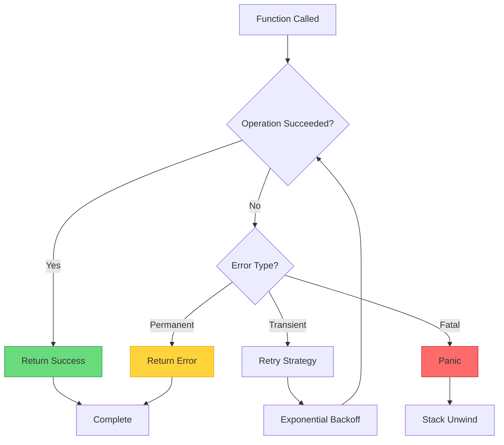
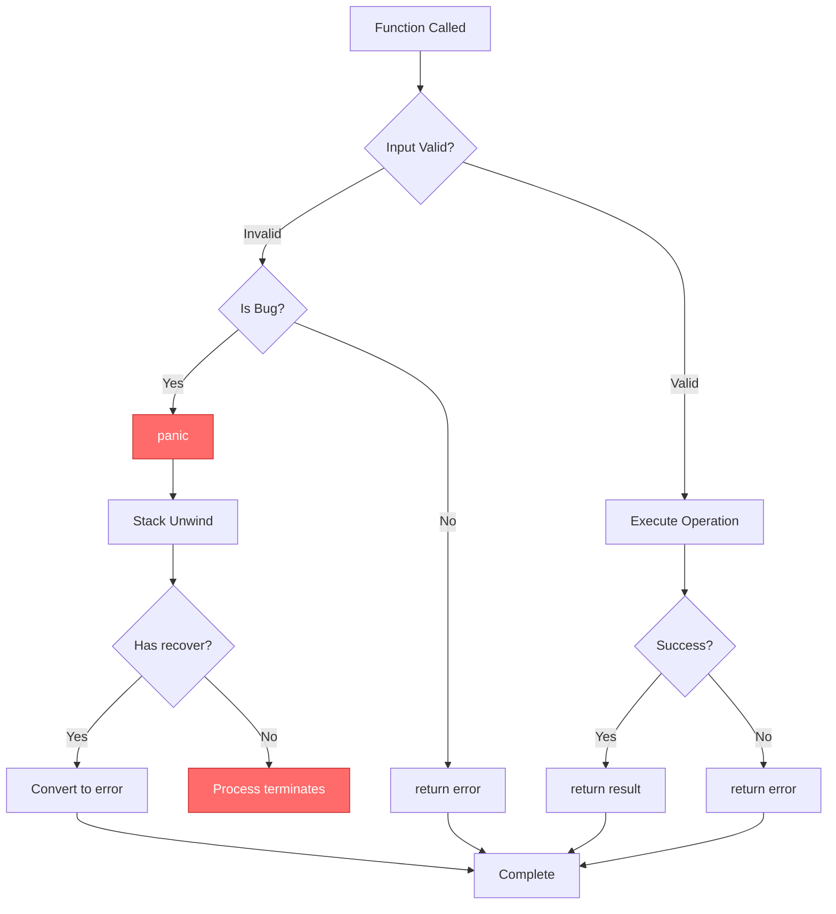

# ⚠️ Error Handling and Panic Recovery

## 🎯 Learning Objectives
- Understand Go's error philosophy and historical context
- Master error wrapping, custom types, and Railway Oriented Programming
- Implement panic/recover patterns for ML infrastructure resilience

## Introduction
Go's error handling represents a fundamental philosophical departure from mainstream languages. While Java, Python, and C++ rely on exception mechanisms that unwind the call stack, Go treats errors as ordinary return values that must be explicitly checked at every call site. This design emerged from Google's experience managing millions of lines of C++ code where unchecked errors created maintenance nightmares.

The relevance to machine learning infrastructure is profound. ML pipelines are complex distributed systems where failures occur at multiple layers: data ingestion, feature engineering, model training, inference serving, and monitoring. A single unhandled error in a feature transformation can corrupt embeddings, causing a model to make incorrect predictions silently. Go's explicit error handling forces engineers to confront every potential failure point, making it ideal for building reliable ML platforms.

This module explores Go's error handling in depth, connecting historical theory to practical ML applications. We examine error propagation patterns, Railway Oriented Programming concepts, and advanced techniques like error wrapping and custom types.

---

## Module 5.1: Error Philosophy

### 5.1.1 Theoretical Foundation
The history of error handling reveals an evolutionary trajectory toward explicitness. Early languages like Fortran and C returned error codes through function parameters, requiring manual checking. The exception mechanism, introduced in Ada and popularized by Java and Python, automated error propagation but introduced hidden control flow.

Tony Hoare's "billion dollar mistake" about null references applies equally to exceptions: they create hidden control flow that violates locality principles. Go's designers chose explicit error values after studying these trade-offs. The error interface is minimal:
```go
type error interface {
    Error() string
}
```
Any type implementing this single method can serve as an error. Functions return errors as additional return values, and callers must explicitly check them. This approach has zero runtime overhead beyond value assignment and makes every error handling decision visible at the call site.

This connects to Railway Oriented Programming (ROP), popularized by Scott Wlaschin. In ROP, a computation that might fail is represented as a railway with two tracks: success and failure. Go's error handling implements a simplified version of this pattern: each function call is a junction where we either continue with the success value or switch to error handling code.

### 5.1.2 Mental Model
Error propagation in Go follows a linear path through the call stack:

```
┌─────────────────────────────────────────────────────────────────┐
│                    ML INFERENCE PIPELINE                         │
│                                                                  │
│  ┌──────────┐    ┌──────────┐    ┌──────────┐    ┌──────────┐  │
│  │ Request  │───►│Validation│───►│ Feature  │───►│  Model   │  │
│  │ Handler  │    │  Layer   │    │  Store   │    │ Serving  │  │
│  └────┬─────┘    └────┬─────┘    └────┬─────┘    └────┬─────┘  │
│       │               │               │               │         │
│  if err != nil {  if err != nil {  if err != nil {  if err != nil {│
│    return fmt.      return fmt.      return fmt.      return fmt.  │
│    Errorf(          Errorf(          Errorf(           Errorf(     │
│    "req: %w",       "val: %w",       "feat: %w",      "infer: %w",│
│    err)             err)             err)             err)        │
│  }                  }                }                }           │
│       │               │               │               │         │
│       ▼               ▼               ▼               ▼         │
│  ┌─────────────────────────────────────────────────────────────┐│
│  │ Error Chain: req: val: feat: connection refused              ││
│  │ Each layer adds context while preserving original cause     ││
│  └─────────────────────────────────────────────────────────────┘│
└─────────────────────────────────────────────────────────────────┘
```

The diagram shows how errors propagate through an ML inference pipeline. Each layer adds contextual information while preserving the original error cause, creating a breadcrumb trail for debugging distributed systems.

### 5.1.3 Syntax and Semantics
Go's error handling syntax is deliberately simple and consistent:

```go
// Basic error return pattern
func processData(input []byte) error {
    if len(input) == 0 {
        return fmt.Errorf("empty input")
    }
    return nil // Success case returns nil
}

// Caller responsibility: always check errors
config, err := parseConfig(data)
if err != nil {
    return fmt.Errorf("loading configuration: %w", err)
}
```

### 5.1.4 Visual Representation
Mermaid diagram showing error flow decision tree:



This decision tree illustrates how ML systems should handle errors. Transient errors like network timeouts warrant retry strategies. Permanent errors like malformed input should return immediately. Fatal errors indicating system corruption should trigger panics.


### 5.1.5 Application in ML/AI Systems
| Pipeline Stage | Error Type | Handling Strategy | Example |
|---|---|---|---|
| Data Invalidation | Schema mismatch | Return ValidationError | Missing feature columns |
| Feature Store | Cache miss, timeout | Retry with backoff | Redis connection timeout |
| Model Loading | Corrupted weights | Panic (unrecoverable) | Checksum mismatch |
| Inference gRPC | Network partition | Circuit breaker | gRPC deadline exceeded |
| Post-processing | Invalid output | Log and return error | NaN in predictions |
| Monitoring | Metric failure | Degrade gracefully | Prometheus unreachable |

In production ML systems, error handling must align with business requirements. For recommendation systems, feature store timeout might warrant falling back to cached values. For fraud detection, any uncertainty should result in rejecting transactions.

### 5.1.6 Common Pitfalls
⚠️ **Ignoring errors without intent**: Writing `doSomething()` instead of `_ = doSomething()` signals accidental omission.

⚠️ **Wrapping nil**: `fmt.Errorf("context: %w", nil)` returns non-nil error, violating caller expectations.

⚠️ **Losing error context**: Returning `err` directly without wrapping loses the call path.

💡 **Best Practice**: Always wrap errors with `fmt.Errorf("action: %w", err)` at API boundaries.

### 5.1.7 Knowledge Check
1. Why did Go choose explicit error values over exceptions?
2. How does Railway Oriented Programming relate to Go's error handling?
3. What is the performance difference between Go errors and Java exceptions?

---

## Module 5.2: Error Wrapping

### 5.2.1 Theoretical Foundation
Error wrapping addresses the tension between human-readable context and machine-readable structure. Before Go 1.13, developers faced a choice: return raw errors (losing context) or create custom error types (increasing complexity). The introduction of `fmt.Errorf` with `%w` verb and `errors.Is`/`errors.As` resolved this.

The theoretical basis comes from exception chaining in Java and Python, where exceptions can have "causes" that preserve the original error. However, Go's implementation differs: wrapping is opt-in, chains are inspected via interface matching, and there's no performance overhead from exception allocation.

The wrapping mechanism enables the "breadcrumb trail" pattern essential for debugging ML systems. When a training job fails, the error chain might include: gRPC timeout → feature store failure → Redis connectivity issues → network partition. Without wrapping, the message would be "connection refused." With wrapping, it becomes "training: features: Redis: connection refused."

### 5.2.2 Mental Model
Error wrapping creates a layered structure:

```
┌─────────────────────────────────────────────────────────────────┐
│                    ERROR WRAPPING LAYERS                         │
│                                                                  │
│  Layer 4: Network                                                │
│  ┌────────────────────────────────────────────────────────────┐ │
│  │ dial tcp 10.0.1.5:6379: connection refused                │ │
│  └────────────────────────────────────────────────────────────┘ │
│                          │ wrapped with context                  │
│                          ▼                                       │
│  Layer 3: Client Library                                         │
│  ┌────────────────────────────────────────────────────────────┐ │
│  │ Redis GET: dial tcp 10.0.1.5:6379: connection refused     │ │
│  └────────────────────────────────────────────────────────────┘ │
│                          │ wrapped with context                  │
│                          ▼                                       │
│  Layer 2: Feature Store Service                                  │
│  ┌────────────────────────────────────────────────────────────┐ │
│  │ lookup embeddings: Redis GET: connection refused           │ │
│  └────────────────────────────────────────────────────────────┘ │
│                          │ wrapped with context                  │
│                          ▼                                       │
│  Layer 1: ML Inference Handler                                   │
│  ┌────────────────────────────────────────────────────────────┐ │
│  │ inference failed: lookup embeddings: connection refused    │ │
│  └────────────────────────────────────────────────────────────┘ │
│                                                                  │
│  errors.Is(err, os.ErrConnectionRefused) → true                 │
└─────────────────────────────────────────────────────────────────┘
```

Each wrapping operation creates a new error value containing the previous error. The chain can be traversed using `errors.Is` (checks if any error matches a target) and `errors.As` (extracts specific error types).

### 5.2.3 Syntax and Semantics
Error wrapping in Go 1.13+ uses `fmt.Errorf` with `%w`:

```go
// Wrapping with %w preserves inspection capability
func readFile(path string) ([]byte, error) {
    data, err := os.ReadFile(path)
    if err != nil {
        return nil, fmt.Errorf("reading %s: %w", path, err)
    }
    return data, nil
}

// Checking error chain with errors.Is
err := readFile("missing.txt")
if errors.Is(err, os.ErrNotExist) {
    fmt.Println("File does not exist")
}

// Extracting specific error types with errors.As
var pathErr *os.PathError
if errors.As(err, &pathErr) {
    fmt.Printf("Failed at path: %s\n", pathErr.Path)
}
```

Key rules:
- Use `%w` when callers need to inspect with `errors.Is`/`errors.As`
- Use `%v` for human-readable-only messages
- Don't wrap sentinel errors like `io.EOF` unless adding meaningful context
- Keep error messages concise but actionable

### 5.2.4 Application in ML/AI Systems
ML systems benefit from error wrapping due to multi-layered architecture:

| ML Layer | Wrapping Pattern | Example Context |
|---|---|---|
| Data Pipeline | `"pipeline %s: %w"` | `"etl users_v2: parse csv"` |
| Feature Engineering | `"feature %s: %w"` | `"embeddings: normalize: negative"` |
| Model Training | `"epoch %d: %w"` | `"epoch 5: gradient overflow"` |
| Model Serving | `"request %s: %w"` | `"infer abc123: batch timeout"` |

Error chains enable automated root cause analysis. When alerts fire for increased inference latency, engineers can trace the chain to identify whether the issue originated in the feature store, model loading, or network layer.

### 5.2.5 Common Pitfalls
⚠️ **Over-wrapping**: Adding context at every function call creates verbose messages. Wrap at API boundaries only.

⚠️ **Inconsistent capitalization**: Error messages should start lowercase since they're composed with `:` separators.

⚠️ **Wrapping without checking nil**: `fmt.Errorf("context: %w", err)` when err is nil returns non-nil error.

💡 **Best Practice**: Create helper that checks for nil before wrapping.

### 5.2.6 Knowledge Check
1. What is the difference between `%w` and `%v` in `fmt.Errorf`?
2. How does `errors.Is` differ from direct equality checking?
3. When should you avoid wrapping an error?

---

## Module 5.3: Panic and Recover

### 5.3.1 Theoretical Foundation
Panic and recover in Go serve a fundamentally different purpose than exceptions. While exceptions are routinely used for control flow in Java and Python, Go reserves panic for truly exceptional conditions indicating programming errors or unrecoverable system states.

The theoretical basis comes from operating system design, where certain errors (segmentation faults, stack overflows) require immediate termination because program state is fundamentally compromised. Go's panic mechanism is analogous to a controlled crash: it unwinds the stack, runs deferred functions, and prints a stack trace.

For ML systems, this distinction is critical. A corrupted model checkpoint should panic because continuing produces invalid predictions. However, a failed network request should return an error because the system can retry or use cached values.

### 5.3.2 Mental Model
Panic execution follows predictable stack unwinding:

```
┌─────────────────────────────────────────────────────────────────┐
│                    PANIC EXECUTION FLOW                          │
│                                                                  │
│  Normal Execution:                                               │
│  ┌────────────────────────────────────────────────────────────┐ │
│  │ main() → service() → handler() → validate() → panic()     │ │
│  └────────────────────────────────────────────────────────────┘ │
│                          │ panic triggered                       │
│                          ▼                                       │
│  Stack Unwinding (deferred functions run in LIFO):              │
│  ┌────────────────────────────────────────────────────────────┐ │
│  │ validate() deferred: cleanup temp files                    │ │
│  │ handler() deferred: close DB connection                    │ │
│  │ service() deferred: flush metrics buffer                   │ │
│  │ main() deferred: recover() catches panic                   │ │
│  └────────────────────────────────────────────────────────────┘ │
│                          │ recover returns non-nil               │
│                          ▼                                       │
│  Recovery Possible Only in Deferred Functions:                   │
│  ┌────────────────────────────────────────────────────────────┐ │
│  │ func safeOperation() {                                     │ │
│  │     defer func() {                                         │ │
│  │         if r := recover(); r != nil {                      │ │
│  │             log.Printf("Recovered: %v", r)                 │ │
│  │         }                                                  │ │
│  │     }()                                                    │ │
│  │     panic("critical failure")                              │ │
│  │ }                                                          │ │
│  └────────────────────────────────────────────────────────────┘ │
└─────────────────────────────────────────────────────────────────┘
```

The diagram shows how panic propagates up the call stack, executing deferred functions. Recovery is only possible within deferred functions, creating a controlled boundary where panics can be converted to errors.

### 5.3.3 Syntax and Semantics
Panic and recover have specific semantics:

```go
// panic stops normal execution
func criticalOperation() {
    panic("database connection lost")
}

// recover only works inside deferred functions
func safeWrapper() {
    defer func() {
        if r := recover(); r != nil {
            fmt.Printf("Recovered from panic: %v\n", r)
        }
    }()
    criticalOperation()
}

// When to panic: programming errors
func processSlice(data []int, index int) int {
    if index < 0 || index >= len(data) {
        panic(fmt.Sprintf("index %d out of bounds", index))
    }
    return data[index]
}
```

Key rules:
- Panic for programming errors (index out of bounds, nil pointer)
- Panic for invariant violations that indicate bugs
- Return errors for expected conditions (file not found, network timeout)
- Use recover in top-level handlers to prevent cascading failures

### 5.3.4 Visual Representation
Mermaid flowchart showing panic/recover decision tree:



### 5.3.5 Application in ML/AI Systems
In ML systems, panic/recover patterns serve specific roles:

| Scenario | Handling | Rationale |
|---|---|---|
| Corrupted model weights | Panic | Continuing produces invalid predictions |
| GPU memory exhaustion | Panic | System must restart training |
| Invalid tensor dimensions | Panic | Programming error in model definition |
| Feature store timeout | Return error | Can retry or use cached features |
| Model version not found | Return error | Expected in deployment pipelines |
| NaN in training loss | Panic | Indicates numerical instability |

TensorFlow Serving uses similar panic semantics for model loading failures. When a checkpoint is corrupted, the process panics rather than loading invalid weights.

### 5.3.6 Common Pitfalls
⚠️ **Using panic for expected errors**: Network timeouts, file not found should return errors, not panic.

⚠️ **Recovering silently**: `recover()` without logging hides bugs and makes debugging impossible.

⚠️ **Recovering in wrong place**: Recover only works in deferred functions called directly by panicking function.

💡 **Best Practice**: In HTTP handlers, recover panics and convert to 500 errors.

### 5.3.7 Knowledge Check
1. What is the fundamental difference between panic and error returns?
2. Why can recover only be called in deferred functions?
3. In what ML scenario would panic be appropriate?

---

## Module 5.4: Custom Error Types

### 5.4.1 Theoretical Foundation
Custom error types address the limitation that simple error strings cannot carry structured data needed for programmatic handling. While sentinel errors like `os.ErrNotExist` work for binary conditions, complex systems require errors conveying multiple pieces of information: error codes, affected resources, timestamps.

The Go approach implements the error interface while adding domain-specific fields. This creates errors that are both human-readable (via Error() method) and machine-processable (via type assertions with errors.As). Unlike Java's exception hierarchy, Go encourages flat error type hierarchies with composition.

For ML systems, custom errors enable sophisticated handling strategies. A TrainingError might contain epoch number, loss value, and gradient norms at failure time. This structured information enables automated classification: is this a transient error worth retrying, or permanent requiring human intervention?

### 5.4.2 Mental Model
Custom error types create domain-specific hierarchies:

```
┌─────────────────────────────────────────────────────────────────┐
│                 CUSTOM ERROR TYPE HIERARCHY                      │
│                                                                  │
│  Base: error interface                                          │
│  ┌────────────────────────────────────────────────────────────┐ │
│  │ type error interface {                                     │ │
│  │     Error() string                                         │ │
│  │ }                                                          │ │
│  └────────────────────────────────────────────────────────────┘ │
│                          │ implements                            │
│                          ▼                                       │
│  Domain: ML Training Errors                                      │
│  ┌────────────────────────────────────────────────────────────┐ │
│  │ type TrainingError struct {                                │ │
│  │     Epoch     int                                          │ │
│  │     Loss      float64                                      │ │
│  │     Gradients []float64                                    │ │
│  │     Cause     error                                        │ │
│  │ }                                                          │ │
│  └────────────────────────────────────────────────────────────┘ │
│                          │ specialization                        │
│                          ▼                                       │
│  Specific: GradientOverflowError                                 │
│  ┌────────────────────────────────────────────────────────────┐ │
│  │ type GradientOverflowError struct {                        │ │
│  │     TrainingError                                         │ │
│  │     LayerName string                                      │ │
│  │     NormValue float64                                     │ │
│  │ }                                                          │ │
│  └────────────────────────────────────────────────────────────┘ │
│                                                                  │
│  Usage:                                                          │
│  var gradErr *GradientOverflowError                              │
│  if errors.As(err, &gradErr) {                                  │
│      log.Printf("Overflow in %s with norm %.2f",               │
│                 gradErr.LayerName, gradErr.NormValue)            │
│  }                                                               │
└─────────────────────────────────────────────────────────────────┘
```

### 5.4.3 Syntax and Semantics
Custom error types implement the error interface:

```go
// ValidationError carries structured information
type ValidationError struct {
    Field   string
    Message string
}

func (e *ValidationError) Error() string {
    return fmt.Sprintf("validation failed on field %s: %s",
        e.Field, e.Message)
}

// TrainingError contains training-specific details
type TrainingError struct {
    Epoch    int
    Loss     float64
    Cause    error
}

func (e *TrainingError) Error() string {
    return fmt.Sprintf("training failed at epoch %d: %v", e.Epoch, e.Cause)
}

// Unwrap enables errors.Is and errors.As chain traversal
func (e *TrainingError) Unwrap() error {
    return e.Cause
}

// GradientOverflowError is specific TrainingError type
type GradientOverflowError struct {
    *TrainingError
    LayerName string
    NormValue float64
}
```

Usage patterns:

```go
// Type assertion with errors.As
err := validateInput([]float64{})
var valErr *ValidationError
if errors.As(err, &valErr) {
    fmt.Printf("Bad field: %s\n", valErr.Field)
}

// Checking sentinel errors
if errors.Is(err, ErrModelNotFound) {
    // Handle model not found
}
```

### 5.4.4 Application in ML/AI Systems
Custom errors enable intelligent error handling:

| Error Type | Fields | Handling Strategy | Example |
|---|---|---|---|
| ValidationError | Field, Value, Constraint | Return to client | "age must be positive" |
| TrainingError | Epoch, Loss, Gradients | Log and alert | Loss > 1e6 indicates instability |
| InferenceError | ModelVersion, Latency | Circuit breaker | Timeout > 5s triggers failover |
| DataError | Source, RecordCount | Quarantine data | Schema mismatch in Kafka |

When a TrainingError contains gradient values indicating vanishing gradients, systems can automatically adjust learning rates. When InferenceError reports high latency, traffic routes to healthy instances.

### 5.4.5 Common Pitfalls
⚠️ **Deep hierarchies**: Use composition (embedding) instead of extending error types.

⚠️ **Forgetting Unwrap**: Custom errors wrapping others must implement Unwrap() error.

⚠️ **Unbounded MultiError**: Limit collected errors in batch operations to prevent memory exhaustion.

⚠️ **Exposing internals**: Sanitize error messages for client-facing APIs.

💡 **Best Practice**: Implement error constructors that enforce invariants.

### 5.4.6 Knowledge Check
1. What is the difference between sentinel and custom error types?
2. Why is Unwrap() important for custom error types?
3. How would you design an error type for ML model versioning failures?

---

## 📦 Compression Code

```go
package main

import (
    "errors"
    "fmt"
    "os"
    "time"
)

// Sentinel errors
var (
    ErrModelNotFound   = errors.New("model not found")
    ErrInvalidInput    = errors.New("invalid input tensor")
)

// ValidationError carries structured failure information
type ValidationError struct {
    Field   string
    Value   interface{}
    Message string
    Time    time.Time
}

func (e *ValidationError) Error() string {
    return fmt.Sprintf("validation failed on field %s: %s",
        e.Field, e.Message)
}

// TrainingError contains training-specific details
type TrainingError struct {
    Epoch    int
    Loss     float64
    Layer    string
    Cause    error
}

func (e *TrainingError) Error() string {
    return fmt.Sprintf("training failed at epoch %d (loss: %.6f): %v",
        e.Epoch, e.Loss, e.Cause)
}

func (e *TrainingError) Unwrap() error {
    return e.Cause
}

// Sentinel error wrapping with context
func loadModel(name string) error {
    _, err := os.Open(fmt.Sprintf("models/%s.bin", name))
    if err != nil {
        return fmt.Errorf("loading model %s: %w", name, err)
    }
    return nil
}

// Custom error creation
func validateInput(data []float64) error {
    if len(data) == 0 {
        return &ValidationError{
            Field:   "input_tensor",
            Value:   data,
            Message: "must not be empty",
            Time:    time.Now(),
        }
    }
    for i, v := range data {
        if v != v { // NaN check
            return &ValidationError{
                Field:   fmt.Sprintf("input[%d]", i),
                Value:   v,
                Message: "must not be NaN",
                Time:    time.Now(),
            }
        }
    }
    return nil
}

// Error wrapping with training context
func trainModel(epochs int) error {
    for epoch := 0; epoch < epochs; epoch++ {
        if epoch == 3 {
            return &TrainingError{
                Epoch: epoch,
                Loss:  1e6,
                Layer: "dense_3",
                Cause: errors.New("gradient overflow"),
            }
        }
    }
    return nil
}

// Panic recovery for plugin loading
func loadPlugin(name string) (err error) {
    defer func() {
        if r := recover(); r != nil {
            err = fmt.Errorf("plugin %s panicked: %v", name, r)
        }
    }()
    if name == "broken" {
        panic("segmentation fault in plugin")
    }
    return nil
}

// Error classification for ML systems
func classifyError(err error) string {
    switch {
    case errors.Is(err, ErrModelNotFound):
        return "RETRY: Reload model"
    case errors.Is(err, os.ErrNotExist):
        return "ALERT: File missing"
    default:
        var valErr *ValidationError
        if errors.As(err, &valErr) {
            return fmt.Sprintf("ALERT: Bad input %s", valErr.Field)
        }
        var trainErr *TrainingError
        if errors.As(err, &trainErr) {
            return fmt.Sprintf("ALERT: Training bug epoch %d", trainErr.Epoch)
        }
        return "UNKNOWN: Requires investigation"
    }
}

func main() {
    fmt.Println("=== ML Error Handling Demo ===\n")

    // 1. Sentinel error with wrapping
    fmt.Println("1. Model Loading:")
    err := loadModel("resnet50")
    if errors.Is(err, os.ErrNotExist) {
        fmt.Println("   Model file not found")
    }
    fmt.Printf("   Error: %v\n\n", err)

    // 2. Custom ValidationError
    fmt.Println("2. Input Validation:")
    err = validateInput([]float64{})
    var valErr *ValidationError
    if errors.As(err, &valErr) {
        fmt.Printf("   Invalid field: %s\n\n", valErr.Field)
    }

    // 3. Training error with Unwrap
    fmt.Println("3. Model Training:")
    err = trainModel(5)
    var trainErr *TrainingError
    if errors.As(err, &trainErr) {
        fmt.Printf("   Failed at epoch %d\n", trainErr.Epoch)
        if errors.Is(trainErr.Cause, errors.New("gradient overflow")) {
            fmt.Println("   Cause: Gradient overflow\n")
        }
    }

    fmt.Println("4. Plugin Loading:")
    err = loadPlugin("broken")
    if err != nil {
        fmt.Printf("   %v\n\n", err)
    }

    fmt.Println("5. Error Classification:")
    testErrors := []error{
        ErrModelNotFound,
        &ValidationError{Field: "tensor", Message: "invalid shape"},
        &TrainingError{Epoch: 10, Loss: 0.5, Layer: "conv2d"},
    }
    for _, e := range testErrors {
        fmt.Printf("   %v → %s\n", e, classifyError(e))
    }

    fmt.Println("\n=== Demo Complete ===")
}
```

---

## 🎯 Documented Project

### Description
Build an ML Error Monitoring Service that aggregates, classifies, and analyzes inference errors from distributed model serving endpoints. The service collects structured errors using custom types, implements intelligent classification using error inspection, and provides dashboards showing error patterns across model versions and data centers.

### Functional Requirements
1. Implement `ErrorCollector` receiving structured errors via gRPC.
2. Define custom error types: `InferenceTimeout`, `ModelLoadingError`, `FeatureStoreError`, `GPUError`.
3. Use `errors.As` to extract structured data for classification.
4. Implement `ErrorClassifier` categorizing errors as retryable, alertable, or fatal.
5. Store aggregates in time-series database for trend analysis.
6. Create alerting rules when error rates exceed thresholds.

### Main Components
- `collector.go`: gRPC service receiving error reports.
- `errors.go`: Custom error types for ML failures.
- `classifier.go`: Error classification using errors.Is/As.
- `aggregator.go`: Time-series error aggregation.
- `alerter.go`: Threshold-based alerting.
- `dashboard.go`: HTTP API for monitoring.

### Success Metrics
- Error collection latency < 100ms.
- Classification accuracy > 95%.
- Alert delivery < 30 seconds for fatal errors.
- API uptime > 99.9%.

### References
- Go Error Handling: https://go.dev/blog/error-handling-and-go
- Go 1.13 Error Wrapping: https://go.dev/blog/go1.13-errors
- ML System Design: https://github.com/chiphuyen/machine-learning-systems-design
- SRE Book: https://sre.google/sre-book/table-of-contents/