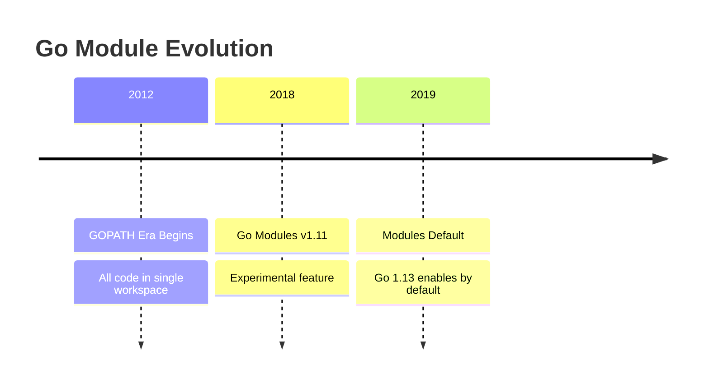
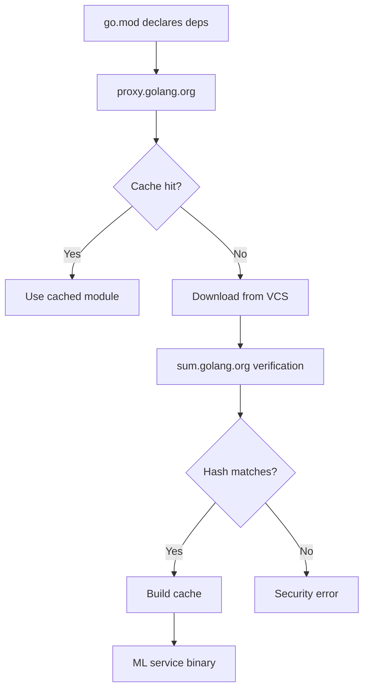

# 📦 Modules, Packages, and Tooling

## 🎯 Learning Objectives
1. Understand Go's module system evolution and MVS algorithm
2. Design scalable package hierarchies for ML microservices
3. Apply complete Go toolchain for production quality assurance
4. Manage dependencies with cryptographic verification
5. Build reproducible ML pipelines with locked versions

## Introduction

Go modules solve dependency hell in ML engineering where different services require incompatible library versions. Before modules (2012-2018), GOPATH forced global namespace sharing. Teams duplicated dependencies via vendoring (500MB per service), making security audits impossible. Modules introduce semantic import versioning, MVS algorithm, and checksum database for reproducible builds critical to ML systems where training pipelines must be bit-for-bit identical across environments.

## Module 6.1: Module System Theory

### 6.1.1 Theoretical Foundation (WHY)

The module system solves:
1. **Dependency Hell**: Multiple packages requiring incompatible versions
2. **Reproducibility Crisis**: Inability to rebuild identical binaries
3. **Supply Chain Vulnerabilities**: Tampered dependencies in production

#### GOPATH Era Problem

```
┌─────────────────────────────────────────────────────┐
│                    GOPATH Structure                  │
├─────────────────────────────────────────────────────┤
│ $GOPATH/                                            │
│   ├── src/                                          │
│   │   ├── github.com/user1/package1/ (v1.0)        │
│   │   └── github.com/user1/package1/ (v1.5) ← CONFLICT │
│   ├── bin/   (compiled executables)                 │
│   └── pkg/   (compiled objects)                     │
└─────────────────────────────────────────────────────┘
```

**Problem**: All projects shared single global namespace. Teams duplicated dependencies via vendoring:
```
project1/vendor/   (500MB)
project2/vendor/   (500MB)  ← Same deps, different versions
project3/vendor/   (500MB)  ← Duplicated again
```

**ML Context**: TensorFlow 2.8 for training vs 2.12 for serving created container duplication.

### 6.1.2 Mental Model (ASCII Diagram)

#### Module Resolution Flow

```
┌─────────────────────────────────────────────────────────────────┐
│                    Module Resolution Flow                        │
├─────────────────────────────────────────────────────────────────┤
│                                                                 │
│  go.mod         go.sum         proxy.golang.org   sum.golang.org│
│  ┌─────────┐   ┌─────────┐   ┌───────────────┐   ┌──────────┐ │
│  │ require  │───│ hashes  │───│  Module Proxy │───│ Checksum │ │
│  │ github.  │   │ of each │   │  (cache)      │   │ Database │ │
│  │ com/foo  │   │ version │   │               │   │          │ │
│  │ v1.2.3   │   │         │   │  Downloads    │   │ Verifies │ │
│  └─────────┘   └─────────┘   │  modules      │   │ hashes   │ │
│       │                        └───────────────┘   └──────────┘ │
│       ▼                                  │              ▼        │
│  ┌──────────────────────────────────────────────────────────┐   │
│  │                    Build Cache                           │   │
│  └──────────────────────────────────────────────────────────┘   │
└─────────────────────────────────────────────────────────────────┘
```

#### Dependency Graph

```
┌─────────────────────────────────────────────────────────────────┐
│                    ML Service Dependency Graph                   │
├─────────────────────────────────────────────────────────────────┤
│                                                                 │
│                    github.com/mlservice/featurestore            │
│                                │                                │
│          ┌─────────────────────┼─────────────────────┐         │
│          │                     │                     │         │
│          ▼                     ▼                     ▼         │
│   ┌─────────────┐     ┌─────────────┐     ┌─────────────┐     │
│   │ google/uuid │     │ grpc-go/    │     │ stretchr/   │     │
│   │   v1.3.0    │     │   v1.56.0   │     │ testify v1.8│     │
│   └─────────────┘     └─────────────┘     └─────────────┘     │
│                              │                     │           │
│                              ▼                     ▼           │
│                       ┌─────────────┐     ┌─────────────┐     │
│                       │ golang/protobuf│   │ davecgh/    │     │
│                       │   v1.5.3    │     │ go-spew v1.1│     │
│                       └─────────────┘     └─────────────┘     │
│                                                                 │
└─────────────────────────────────────────────────────────────────┘
```

### 6.1.3 Syntax and Semantics (code)

```go
// go.mod structure
module github.com/mlservice/featurestore

go 1.21

require (
    github.com/google/uuid v1.3.0        // UUID generation
    google.golang.org/grpc v1.56.0       // gRPC framework
    github.com/stretchr/testify v1.8.4   // Testing utilities
)

// Semantic Versioning: MAJOR.MINOR.PATCH
// v1.2.3
// │ │ │
// │ │ └── Patch: Bug fixes
// │ └───── Minor: New features  
// └─────── Major: Breaking changes
```

### 6.1.4 Visual Representation (Mermaid)





### 6.1.5 Application in ML/AI Systems

```go
// Training pipeline with pinned dependencies
module github.com/mlteam/training-pipeline

go 1.21

require (
    // Data processing - exact patch version
    github.com/apache/arrow/go/v12 v12.0.1
    
    // ML framework - minor version locked
    gonum.org/v1/gonum v0.12.0
    
    // Security patch required
    github.com/your-org/datavalid v1.4.2 // CVE-2023-12345 fixed
)
```

**Real Case**: Google's ML Platform manages 10,000+ internal libraries with Go modules. Teams pin dependencies for 18 months, matching model retraining cycles.

### 6.1.6 Common Pitfalls

1. **Indirect Dependency Confusion**: Manual `// indirect` instead of `go mod tidy`
2. **Replace Directive Leaks**: Using `replace` locally but committing to main
3. **Version Skew**: Mixing `/v2` import with v1 module declaration
4. **Checksum Mismatch**: Modifying downloaded modules without updating `go.sum`

## Module 6.2: Package Organization

### 6.2.1 Theoretical Foundation (WHY)

Package organization enforces:
1. **Encapsulation**: Hide implementation behind stable interfaces
2. **Dependency Inversion**: High-level modules depend on abstractions
3. **Separation of Concerns**: Single responsibility per package

#### API Boundary Model

```
┌─────────────────────────────────────────────────────────────────┐
│                    Package Visibility Model                     │
├─────────────────────────────────────────────────────────────────┤
│                                                                 │
│  ┌──────────────────────────────────────────────────────────┐   │
│  │                    Public API (pkg/)                      │   │
│  │  • Exported types (ModelRegistry, FeatureRequest)        │   │
│  │  • Stable interfaces                                     │   │
│  │  • Major version bump required for changes               │   │
│  └──────────────────────────────────────────────────────────┘   │
│                               │                                 │
│                               ▼                                 │
│  ┌──────────────────────────────────────────────────────────┐   │
│  │                Internal Implementation (internal/)        │   │
│  │  • Unexported types (modelStore, cache)                  │   │
│  │  • Private helpers                                        │   │
│  │  • Can change freely within major version                │   │
│  └──────────────────────────────────────────────────────────┘   │
│                                                                 │
│  Compiler enforces: external packages CANNOT import internal/   │
└─────────────────────────────────────────────────────────────────┘
```

### 6.2.2 Mental Model (ASCII Diagram)

#### Standard ML Project Layout

```
mlservice/
├── go.mod
├── cmd/                    # Entry points
│   └── server/
│       └── main.go
├── internal/               # Private code
│   ├── model/              # Domain models
│   ├── inference/          # Business logic
│   └── storage/            # Data access
├── pkg/                    # Public code
│   ├── api/                # External API types
│   └── telemetry/          # Observability
└── test/                   # Integration tests
```

#### Export vs Unexport Pattern

```
┌─────────────────────────────────────────────────────────────────┐
│                    Package api/ (Exported)                       │
├─────────────────────────────────────────────────────────────────┤
│                                                                 │
│  package api                                                    │
│                                                                 │
│  // Exported: starts with capital letter                        │
│  type ModelRegistry interface {                                │
│      GetModel(ctx context.Context, id string) (*Model, error)  │
│  }                                                              │
│                                                                 │
│  // Unexported: internal use only                               │
│  func validateModel(m *Model) error {                          │
│      if m.Name == "" { return errors.New("name required") }    │
│      return nil                                                 │
│  }                                                              │
│                                                                 │
└─────────────────────────────────────────────────────────────────┘
```

### 6.2.3 Package Naming Conventions

| Package Type | Naming Convention | ML Example |
|-------------|-------------------|------------|
| **cmd/** | Simple verb/noun | `server`, `trainer`, `predictor` |
| **internal/** | Domain-specific | `inference`, `featurestore`, `preprocessing` |
| **pkg/** | Reusable utilities | `api`, `telemetry`, `metrics` |
| **test/** | Test types | `e2e`, `benchmark`, `integration` |

#### ML Microservice Package Map

```
┌─────────────────────────────────────────────────────────────────┐
│                    ML Service Package Organization              │
├─────────────────────────────────────────────────────────────────┤
│                                                                 │
│  cmd/server/          (Entry Point)                            │
│  ├── HTTP handlers                                             │
│  └── Dependency wiring                                         │
│                                                                 │
│  internal/model/      (Domain)                                 │
│  ├── ML model definitions                                      │
│  └── Feature schemas                                           │
│                                                                 │
│  internal/inference/  (Business Logic)                         │
│  ├── Model loading                                             │
│  └── Prediction execution                                      │
│                                                                 │
│  internal/storage/    (Data Access)                            │
│  ├── Model repository (S3, GCS)                                │
│  └── Feature cache (Redis)                                     │
│                                                                 │
│  pkg/api/             (Public Interface)                       │
│  ├── Request/Response types                                    │
│  └── Client SDK generation                                     │
│                                                                 │
└─────────────────────────────────────────────────────────────────┘
```

### 6.2.4 Dependency Injection Pattern

```go
// cmd/server/main.go - Dependency Wiring
package main

import (
    "github.com/mlservice/inference"
    "github.com/mlservice/storage"
    "github.com/mlservice/pkg/api"
)

func main() {
    // Create concrete implementations
    modelRepo := storage.NewS3Repository("s3://models-bucket")
    featureCache := storage.NewRedisCache("redis:6379")
    
    // Inject dependencies into business logic
    engine := inference.NewEngine(modelRepo, featureCache)
    
    // Wire public API
    server := api.NewServer(engine)
    http.ListenAndServe(":8080", server)
}
```

### 6.2.5 Common Pitfalls

1. **Generic Package Names**: `util`, `common` become dumping grounds
2. **Circular Dependencies**: Package A imports B which imports A
3. **Leaky Abstractions**: Exposing internal types in public interfaces
4. **Overly Large Packages**: 5000+ lines that take minutes to compile

## Module 6.3: Tooling Ecosystem

### 6.3.1 Theoretical Foundation (WHY)

Go's toolchain addresses specific quality dimensions:

| Tool | Quality Dimension | Theory |
|------|------------------|--------|
| `go fmt` | **Consistency** | Eliminates style debates |
| `go vet` | **Correctness** | Catches common mistakes |
| `go test` | **Reliability** | Verification through execution |
| `golangci-lint` | **Maintainability** | Enforces architectural rules |
| `dlv` | **Debuggability** | Runtime state inspection |
| `pprof` | **Performance** | Resource usage measurement |

### 6.3.2 Mental Model (ASCII Diagram)

#### Developer Workflow

```
┌─────────────────────────────────────────────────────────────────┐
│                    ML Engineering Workflow                       │
├─────────────────────────────────────────────────────────────────┤
│                                                                 │
│  1. Write Code → go fmt (automatic formatting)                 │
│  2. go vet (catch bugs)                                         │
│  3. go test -race (verify with race detection)                 │
│  4. golangci-lint (deep analysis)                               │
│  5. go build (compile binary)                                   │
│  6. go tool pprof (optimize performance)                        │
│                                                                 │
│  Local: Save → Format → Vet → Test → Build                     │
│  CI:    Lint → Test → Security → Deploy                        │
│  Prod:  Profile → Monitor → Debug                              │
│                                                                 │
└─────────────────────────────────────────────────────────────────┘
```

### 6.3.3 Tool Comparison Matrix

| Tool | Command | When to Use | ML Example |
|------|---------|-------------|------------|
| **go fmt** | `go fmt ./...` | Every save | Format feature transformer |
| **go vet** | `go vet ./...` | Every build | Check tensor shapes |
| **go test** | `go test -race ./...` | Every commit | Test model inference |
| **golangci-lint** | `golangci-lint run` | Every PR | Enforce error handling |
| **dlv** | `dlv debug ./cmd` | Development | Debug training loop |
| **pprof** | `go tool pprof` | Performance tuning | Optimize batch size |
| **govulncheck** | `govulncheck ./...` | CI pipeline | Check dependencies |

### 6.3.4 Configuration Examples

#### Makefile for ML Pipeline

```makefile
.PHONY: fmt vet test lint build

fmt:
	go fmt ./...

vet:
	go vet ./...

test:
	go test -race -coverprofile=coverage.out ./...

lint: fmt vet
	golangci-lint run ./...

build:
	CGO_ENABLED=0 go build -ldflags="-s -w" -o bin/server ./cmd/server

ci: lint test build
	@echo "All checks passed"
```

#### .golangci.yml

```yaml
linters:
  enable:
    - errcheck
    - gosimple
    - govet
    - gocyclo
    - gosec

linters-settings:
  gocyclo:
    min-complexity: 15
  gosec:
    excludes:
      - G404  # Weak random OK for ML sampling
```

### 6.3.5 Profiling ML Workloads

```go
// Enable profiling in ML service
import _ "net/http/pprof"  // Registers /debug/pprof/ endpoints

func main() {
    go http.ListenAndServe(":6060", nil)  // Profiling server
    startMLService(":8080")
}
```

```bash
# Capture CPU profile
go tool pprof http://localhost:6060/debug/pprof/profile?seconds=30

# Interactive analysis
(pprof) top 10
(pprof) list Predict  # Shows line-by-line timing
```

### 6.3.6 Common Pitfalls

1. **Linting Overhead**: Configure IDE for incremental linting
2. **Race Detector Overhead**: 10x slowdown → only use in CI
3. **Profile Overhead**: 5% CPU → disable unless debugging
4. **Over-engineering**: Use built-in tools before custom linters

## Module 6.4: Dependency Management

### 6.4.1 Theoretical Foundation (WHY)

Dependency management rests on three pillars:
1. **Minimal Version Selection**: Russ Cox's algorithm picking smallest required version
2. **Reproducible Builds**: Same source + same deps = identical binary
3. **Supply Chain Security**: Cryptographic verification of all dependencies

#### Version Selection Approaches

```
┌─────────────────────────────────────────────────────────────────┐
│                    Version Selection Problem                    │
├─────────────────────────────────────────────────────────────────┤
│                                                                 │
│  Your app:     requires libA v1.2.0                            │
│  pkgB:         requires libA v1.3.0                            │
│  pkgC:         requires libA v1.1.0                            │
│                                                                 │
│  ┌──────────────────────────────────────────────────────────┐   │
│  │  MVS (Go): Pick maximum of minimums                      │   │
│  │  min(1.2.0, 1.3.0, 1.1.0) → 1.3.0                       │   │
│  │  Conservative: Never downgrades                           │   │
│  └──────────────────────────────────────────────────────────┘   │
│                                                                 │
│  ┌──────────────────────────────────────────────────────────┐   │
│  │  npm/yarn: Pick latest compatible                        │   │
│  │  max(1.x) → 1.4.0 (if available)                        │   │
│  │  Aggressive: May introduce breaking changes              │   │
│  └──────────────────────────────────────────────────────────┘   │
│                                                                 │
└─────────────────────────────────────────────────────────────────┘
```

### 6.4.2 Mental Model (ASCII Diagram)

#### MVS Algorithm Visualization

```
┌─────────────────────────────────────────────────────────────────┐
│                    Minimal Version Selection                    │
├─────────────────────────────────────────────────────────────────┤
│                                                                 │
│  Your App: require libA v1.2.0, pkgB v1.0.0                   │
│  pkgB:     require libA v1.3.0                                 │
│  pkgC:     require libA v1.1.0                                 │
│                                                                 │
│  Graph:                                                         │
│  ┌─────────┐     ┌─────────┐                                   │
│  │ Your App│────▶│ libA    │                                   │
│  └─────────┘     └─────────┘                                   │
│       │              ▲                                          │
│  ┌─────────┐         │                                          │
│  │ pkgB    │─────────┘                                          │
│  └─────────┘                                                    │
│                                                                 │
│  For libA:                                                      │
│  • Your App requires: v1.2.0                                   │
│  • pkgB requires: v1.3.0                                       │
│  • pkgC requires: v1.1.0                                       │
│  • Maximum required: v1.3.0 ✓                                  │
│                                                                 │
└─────────────────────────────────────────────────────────────────┘
```

#### Checksum Verification Flow

```
┌─────────────────────────────────────────────────────────────────┐
│                    go.sum Verification                          │
├─────────────────────────────────────────────────────────────────┤
│                                                                 │
│  go.mod: require github.com/libA v1.3.0                        │
│                                                                 │
│  go.sum:                                                        │
│  github.com/libA v1.3.0 h1:abc123... (module hash)              │
│  github.com/libA v1.3.0/go.mod h1:def456... (go.mod hash)      │
│                                                                 │
│  Verification:                                                  │
│  1. Download github.com/libA@v1.3.0                            │
│  2. Compute hash → compare to go.sum                           │
│  3. Check sum.golang.org for issues                            │
│  4. If matches → proceed; if mismatch → ERROR                  │
│                                                                 │
└─────────────────────────────────────────────────────────────────┘
```

### 6.4.3 Semantic Versioning Deep Dive

```go
// Breaking changes in Go:
// 1. Removing exported types/functions
// 2. Changing function signatures
// 3. Removing struct fields
// 4. Modifying interface definitions

// Non-breaking changes:
// 1. Adding new exported identifiers
// 2. Adding optional parameters
// 3. Extending interfaces
// 4. Improving performance
```

### 6.4.4 ML Dependency Management Strategies

```go
// Production ML service - Conservative pinning
module github.com/mlservice/inference

go 1.21

require (
    // Core ML - exact versions for reproducibility
    google.golang.org/protobuf v1.30.0
    github.com/golang/protobuf v1.5.3
    
    // Data processing - patch versions only
    github.com/apache/arrow/go/v12 v12.0.1
    
    // Security-critical - exact with CVE tracking
    golang.org/x/crypto v0.10.0 // CVE-2023-48795 patched
)
```

#### Multi-Module Workspace

```go
// go.work - Local development
go 1.21

use (
    ./featurestore
    ./inference
    ./training
    ./common
)
```

### 6.4.5 Version Resolution Timeline

```
┌─────────────────────────────────────────────────────────────────┐
│                    Dependency Resolution Over Time              │
├─────────────────────────────────────────────────────────────────┤
│                                                                 │
│  Time → 2023-01  2023-03  2023-06  2023-09  2023-12            │
│                                                                 │
│  libA releases: v1.0.0 → v1.1.0 → v1.2.0 → v1.3.0 → v1.4.0   │
│                                                                 │
│  Your go.mod:                                                  │
│  Jan: require libA v1.0.0                                      │
│  Mar: require libA v1.1.0  ← New feature                      │
│  Jun: require libA v1.2.0  ← Security patch                   │
│  Sep: require libA v1.3.0  ← Performance                      │
│  Dec: require libA v1.4.0  ← ML ops features                  │
│                                                                 │
│  MVS ensures never accidentally downgrade                      │
│                                                                 │
└─────────────────────────────────────────────────────────────────┘
```

### 6.4.6 Common Pitfalls

1. **Replace in Production**: Never use `replace` in committed go.mod
2. **Checksum Drift**: Don't manually edit go.sum
3. **Major Version Confusion**: Use `/v2` import with v2 module path
4. **Vendoring Overkill**: Don't commit vendor/ in module-aware projects

```go
// BAD: Replace in production
replace github.com/company/lib => ../local-lib  // Breaks CI!

// GOOD: Use go.work for local development
// go.work (gitignored)
use ../local-lib
```

## 📦 Compression Code

```go
// go.mod
module github.com/mlservice/modelregistry

go 1.21

require (
    github.com/google/uuid v1.3.0
    github.com/stretchr/testify v1.8.4
    go.opentelemetry.io/otel v1.14.0
)

// internal/registry/model.go
package registry

type Model struct {
    ID       string            `json:"id"`
    Name     string            `json:"name"`
    Version  int               `json:"version"`
    Metadata map[string]string `json:"metadata"`
}

type ModelRegistry interface {
    Register(ctx context.Context, model *Model) error
    Get(ctx context.Context, id string) (*Model, error)
    List(ctx context.Context) ([]*Model, error)
}

type inMemoryRegistry struct {
    mu     sync.RWMutex
    models map[string]*Model
}

func NewInMemoryRegistry() ModelRegistry {
    return &inMemoryRegistry{models: make(map[string]*Model)}
}

// cmd/server/main.go
package main

import (
    "github.com/mlservice/modelregistry/internal/registry"
    "github.com/mlservice/modelregistry/pkg/api"
)

func main() {
    reg := registry.NewInMemoryRegistry()
    server := api.NewServer(reg)
    http.ListenAndServe(":8080", server)
}
```

## 🎯 Documented Project

### Description

Build a production-ready ML model registry service using Go modules, following enterprise patterns for package organization, comprehensive tooling, and strict dependency management.

### Functional Requirements

1. Initialize `github.com/mlplatform/modelregistry` with semantic versioning
2. Implement `cmd/`, `internal/`, `pkg/` with proper encapsulation
3. Pin all ML dependencies with cryptographic verification
4. Configure golangci-lint, Makefile, pre-commit hooks
5. Add OpenTelemetry tracing and Prometheus metrics
6. Achieve >80% test coverage with race detection
7. Integrate pprof endpoints for production debugging

### Success Metrics

- `go mod verify` passes with zero checksum mismatches
- `go test -race ./...` completes with zero data races
- `golangci-lint run` reports zero issues
- `go test -bench=BenchmarkPredict` shows <100ns latency
- `govulncheck ./...` finds zero critical vulnerabilities
- Binary size <20MB with `go build -ldflags="-s -w"`
- Code coverage >80% across all packages

### References

- Go Modules Reference: https://go.dev/ref/modules
- Minimal Version Selection: https://research.swtch.com/vgo-mvs
- Go Command Documentation: https://pkg.go.dev/cmd/go
- golangci-lint: https://golangci-lint.run/
- Uber Go Style Guide: https://github.com/uber-go/guide