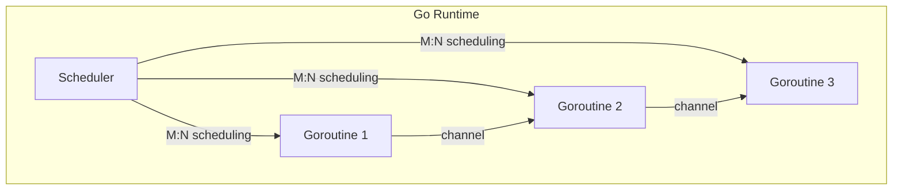

# 🏁 Welcome to Go for Cloud Native

## 🎯 Learning Objectives

- Understand the cloud-native paradigm and its relevance to modern software engineering.
- Explain why Go is the dominant language for cloud infrastructure and MLOps tooling.
- Map the relationship between containers, orchestration, and high-performance RPC.
- Identify how each module in this course contributes to building scalable ML/AI platforms.

## Introduction

Cloud-native computing has become the default architecture for delivering scalable, resilient, and observable systems. For machine learning and artificial intelligence workloads, these properties are non-negotiable: training pipelines demand reproducible environments, model serving requires elastic scaling, and feature engineering depends on low-latency inter-service communication. This module teaches you how to build these foundations in Go, the language that powers Docker, Kubernetes, and Terraform.

Go occupies a unique position in the cloud-native ecosystem. Its statically linked binaries, first-class concurrency, and fast compile times make it ideal for both control-plane tools and data-plane services. In the ML/AI domain, Go is increasingly used for inference gateways, data preprocessing pipelines, and Kubernetes operators that manage GPU-accelerated training jobs. Understanding Go for cloud native is therefore a direct multiplier on your ability to ship production-grade AI systems.

Throughout this course you will progress through [[01 - Docker Internals for Go Developers|container internals]], [[02 - Kubernetes Architecture Deep Dive|orchestration architecture]], and [[03 - gRPC and Protocol Buffers|high-performance RPC]]. Each lesson bridges theory and implementation, ensuring you can reason about the systems you build before writing the first line of code.

## Module 1: Cloud Native Computing

### 1.1 Theoretical Foundation 🧠

The term "cloud native" emerged from the Cloud Native Computing Foundation (CNCF) to describe applications built specifically for cloud elasticity and resilience. Its intellectual roots trace back to the twelve-factor app methodology, which codified best practices for portable, stateless, and declarative systems. The methodology emphasized environment parity, configuration externalization, and disposability—principles that later informed container design.

Microservices architecture provided the organizational counterpart to twelve-factor apps. By decomposing monoliths into independently deployable services, teams could scale components selectively and adopt polyglot persistence. However, microservices introduced new challenges: service discovery, configuration management, and distributed tracing. The theoretical response was the service mesh and control-loop patterns, which automated cross-cutting concerns without polluting business logic.

Containers solved the environment parity problem by packaging applications with their filesystems, libraries, and namespaces. Unlike virtual machines, containers share the host kernel, making them orders of magnitude lighter. This efficiency is critical for ML/AI workloads where GPU resources are scarce and must be multiplexed across training, validation, and inference tasks.

### 1.2 Mental Model 📐

```
┌─────────────────────────────────────┐
│  App Layer: ML API | Feature | Model │
├─────────────────────────────────────┤
│  Runtime: Docker / containerd       │
├─────────────────────────────────────┤
│  Orchestrator: Kubernetes           │
├─────────────────────────────────────┤
│  Infra: Compute | Storage | GPU     │
└─────────────────────────────────────┘
```

### 1.3 Syntax and Semantics 📝

```go
package main

import (
	"fmt"
	"net/http"
)

// main starts a minimal HTTP server.
// WHY: Cloud-native services expose health and metrics via HTTP
// so that orchestrators like Kubernetes can manage their lifecycle.
func main() {
	http.HandleFunc("/health", func(w http.ResponseWriter, r *http.Request) {
		// WHY: A 200 OK on /health tells the container runtime
		// that the process is alive and should receive traffic.
		fmt.Fprintln(w, `{"status":"ok"}`)
	})
	http.ListenAndServe(":8080", nil)
}
```

### 1.4 Visual Representation 🖼️


### 1.5 Application in ML/AI Systems 🤖

| Case Study | Technology | ML/AI Benefit |
|---|---|---|
| Kubeflow Pipelines | Kubernetes + Docker | Reproducible, scalable ML workflows |
| Amazon SageMaker | Custom containers | Managed training and hosting environments |
| Google Vertex AI | Cloud-native stack | End-to-end MLOps with built-in observability |

### 1.6 Common Pitfalls ⚠️

- **Warning:** Treating containers as stateful VMs leads to data loss when pods are rescheduled. Always externalize state to object storage or databases.
- **Warning:** Ignoring resource limits causes noisy-neighbor problems on shared GPU nodes, destabilizing training jobs.
- **Tip:** Design every service to be disposable; shutdown and restart should be graceful and idempotent.

### 1.7 Knowledge Check ❓

1. Why is environment parity especially important for ML training pipelines?
2. Name two cross-cutting concerns that service meshes address.
3. How does container sharing of the host kernel improve GPU utilization?

## Module 2: Go as the Infrastructure Lingua Franca

### 2.1 Theoretical Foundation 🧠

Go was designed at Google in 2007 by Robert Griesemer, Rob Pike, and Ken Thompson, with a public release in 2009. The language was a deliberate reaction to the complexity and slow build times of C++ in large distributed systems. Its design philosophy centers on simplicity, clarity, and pragmatism: a minimal feature set, garbage collection, and a concurrency model derived from Tony Hoare's Communicating Sequential Processes (CSP).

CSP provides a mathematically rigorous foundation for concurrency through goroutines and channels. Unlike thread-based models that rely on shared memory and locks, CSP encourages message passing, which eliminates an entire class of data races. This theoretical alignment makes Go naturally suited for building control planes that must juggle thousands of concurrent connections—exactly the workload faced by Kubernetes and Envoy.

Another cornerstone of Go's cloud-native dominance is static linking. By default, Go binaries include all dependencies except system calls, producing a single executable with no dynamic library requirements. This property enables ultra-minimal container images, reducing both attack surface and cold-start latency. In ML/AI serving, where models are loaded into memory and queried at high frequency, a 5 MB Go binary starts in milliseconds compared to a 200 MB JVM process.

### 2.2 Mental Model 📐

```
┌─────────────────────────────────────┐
│  Go Source -> go build -> Binary    │
├─────────────────────────────────────┤
│  COPY into distroless image         │
│  /server (non-root)                 │
└─────────────────────────────────────┘
```

### 2.3 Syntax and Semantics 📝

```go
package main

import (
	"fmt"
	"time"
)

// worker processes jobs from a channel.
// WHY: CSP channels decouple producers and consumers,
// preventing shared-memory data races in concurrent pipelines.
func worker(id int, jobs <-chan int, results chan<- int) {
	for j := range jobs {
		// WHY: Simulating CPU-bound work (e.g., feature encoding)
		// without blocking other goroutines.
		time.Sleep(time.Second)
		results <- j * 2
	}
}

func main() {
	jobs := make(chan int, 100)
	results := make(chan int, 100)

	// WHY: Spinning up 3 workers models a pool pattern
	// common in ML batch inference services.
	for w := 1; w <= 3; w++ {
		go worker(w, jobs, results)
	}

	for j := 1; j <= 5; j++ {
		jobs <- j
	}
	close(jobs)

	for a := 1; a <= 5; a++ {
		fmt.Println("result:", <-results)
	}
}
```

### 2.4 Visual Representation 🖼️




### 2.5 Application in ML/AI Systems 🤖

| Case Study | Technology | ML/AI Benefit |
|---|---|---|
| TensorFlow Go Bindings | Go + TF C API | Loading saved models for edge inference |
| Apache Beam Go SDK | Go + Dataflow | Large-scale feature extraction pipelines |
| Feature Store Gateway | Go + gRPC | Low-latency feature retrieval for online models |

### 2.6 Common Pitfalls ⚠️

- **Warning:** Leaking goroutines by forgetting to close channels causes memory exhaustion in long-running inference servers.
- **Warning:** Using the default http.Client without timeouts leads to goroutine buildup under backpressure.
- **Tip:** Prefer context.Context for cancellation propagation across goroutine boundaries.

### 2.7 Knowledge Check ❓

1. How does CSP's message-passing model reduce the risk of data races?
2. Why are statically linked binaries advantageous for containerized ML serving?
3. What is the primary bottleneck when using Go's default http.Client without timeouts?

## 📦 Compression Code

```go
package main

import (
	"bytes"
	"compress/gzip"
	"fmt"
	"io"
	"os"
)

// compressString compresses input using gzip and returns the ratio.
// WHY: Compression is foundational for efficient network transfer
// of large payloads such as serialized protobuf messages or model artifacts.
func compressString(input string) (string, float64, error) {
	var buf bytes.Buffer
	w := gzip.NewWriter(&buf)
	if _, err := w.Write([]byte(input)); err != nil {
		return "", 0, err
	}
	if err := w.Close(); err != nil {
		return "", 0, err
	}
	compressed := buf.String()
	ratio := float64(len(compressed)) / float64(len(input)) * 100
	return compressed, ratio, nil
}

func main() {
	if len(os.Args) < 2 {
		fmt.Println("Usage: welcomecompress <file>")
		os.Exit(1)
	}
	data, err := os.ReadFile(os.Args[1])
	if err != nil {
		panic(err)
	}
	compressed, ratio, err := compressString(string(data))
	if err != nil {
		panic(err)
	}
	out := os.Args[1] + ".gz"
	if err := os.WriteFile(out, []byte(compressed), 0644); err != nil {
		panic(err)
	}
	fmt.Printf("Compressed %s -> %s (%.1f%% of original)\n", os.Args[1], out, ratio)
}
```

## 🎯 Documented Project

### Description

Build **CloudGo**, a production-grade microservices platform written entirely in Go. The platform demonstrates containerized services communicating via gRPC, orchestrated by Kubernetes, with automated infrastructure provisioning and full observability.

```
┌─────────────────────────────────────┐
│         CloudGo Architecture        │
│  ┌─────────┐      ┌─────────┐      │
│  │  HTTP   │─────▶│  gRPC   │      │
│  │  API    │      │  Mesh   │      │
│  └─────────┘      └─────────┘      │
│       │                  │          │
│  ┌────┴────┐        ┌───┴────┐     │
│  │  K8s    │        │Prometheus│    │
│  └─────────┘        └────────┘     │
└─────────────────────────────────────┘
```

### Functional Requirements

1. Implement a containerized Go service with /health and /ready endpoints.
2. Package the service using a multi-stage Dockerfile that produces an image under 15 MB.
3. Deploy the service to a local Kubernetes cluster with a Deployment, Service, and Ingress.
4. Expose a gRPC API between two services with protobuf-defined messages.
5. Collect metrics using Prometheus and expose a /metrics endpoint.

### Components

- cmd/api/main.go, internal/handlers/, proto/
- Dockerfile, k8s/, docker-compose.yml

### Metrics

- Image <15 MB, cold start <100 ms, /health <5 ms
- go test ./... >80% coverage, zero critical vulnerabilities

### References

- [CNCF Cloud Native Definition](https://github.com/cncf/toc/blob/main/DEFINITION.md)
- [The Twelve-Factor App](https://12factor.net/)
- [Go Official Website](https://go.dev/)
- [[01 - Docker Internals for Go Developers|🐳 01 - Docker Internals]]
- [[02 - Kubernetes Architecture Deep Dive|☸️ 02 - Kubernetes]]
- [[03 - gRPC and Protocol Buffers|🔗 03 - gRPC]]
