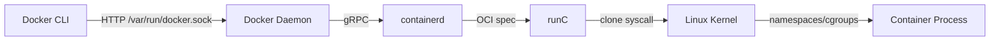
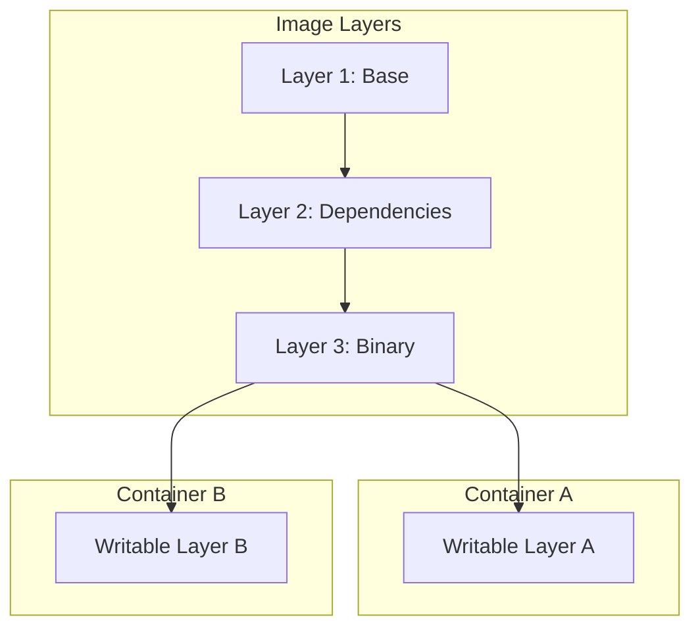

# 🐳 Docker Internals for Go Developers

## 🎯 Learning Objectives

- Explain the Linux kernel features that enable container isolation.
- Analyze Docker's client-server architecture and the role of containerd and runC.
- Design optimized multi-stage Dockerfiles for Go applications.
- Evaluate image layer caching and security strategies for ML/AI serving containers.

## Introduction

Container technology is the bedrock of reproducible computing. For ML/AI engineers, the ability to package a model, its runtime, and all dependencies into a single immutable artifact eliminates the dreaded "works on my machine" problem. When a researcher's Jupyter notebook is translated into a production inference service, Docker ensures that the CUDA drivers, Python libraries, and model weights travel together as one versioned unit. This immutability is essential for regulatory compliance and A/B testing in production AI pipelines.

Go's relationship with Docker is symbiotic. The entire Docker ecosystem—client, daemon, containerd, and runC—is written in Go because the language provides direct access to Linux syscalls, lightweight goroutines for I/O multiplexing, and static binaries that simplify bootstrapping. For ML/AI systems where inference latency and resource efficiency directly affect cost, understanding how Go binaries interact with container runtimes allows engineers to shave megabytes off images and milliseconds off startup times.

This note bridges low-level kernel mechanisms with high-level Dockerfile design. You will explore [[02 - Kubernetes Architecture Deep Dive|orchestration]] and [[03 - gRPC and Protocol Buffers|service communication]] in subsequent modules, but every Kubernetes Pod and every gRPC microservice ultimately runs inside a container. Mastering that boundary layer is non-negotiable.

## Module 1: Container Technology Foundations

### 1.1 Theoretical Foundation 🧠

The concept of process isolation predates Docker by decades. In 1979, Unix V7 introduced chroot, allowing administrators to change the root directory of a process and thereby limit its filesystem view. FreeBSD extended this idea in 1998 with Jails, adding virtualized networking and process IDs. Solaris Zones and OpenVZ followed, demonstrating that OS-level virtualization could achieve near-native performance without the overhead of hardware virtualization.

The modern container is built on two Linux kernel features: namespaces and control groups (cgroups). Namespaces provide isolation by partitioning kernel resources—PID, mount, network, user, IPC, UTS, and cgroup namespaces—so that processes within a container believe they own the system. Cgroups provide resource accounting and limiting, ensuring that a runaway training job cannot starve an inference service of CPU or memory. The theoretical elegance of this approach is that isolation is implemented in the kernel rather than in a hypervisor, eliminating context-switch penalties.

In 2015, the Open Container Initiative (OCI) standardized the runtime and image specifications, decoupling container creation from Docker's proprietary toolchain. runC became the reference implementation of the OCI runtime spec. containerd, donated to the CNCF, manages the complete container lifecycle—image transfer, storage, and execution—while Docker itself focuses on developer experience. This layered architecture is a direct application of the single-responsibility principle: each component does one thing and delegates downward.

### 1.2 Mental Model 📐

```
┌─────────────────────────────────────────┐
│           Docker CLI (User)             │
└─────────────────┬───────────────────────┘
                  │ REST API (Unix socket)
                  ▼
┌─────────────────────────────────────────┐
│         Docker Daemon (dockerd)         │
│  ┌─────────────┐  ┌─────────────────┐  │
│  │ Image Store │  │ Network Manager │  │
│  └──────┬──────┘  └─────────────────┘  │
└─────────┼───────────────────────────────┘
          │ gRPC
          ▼
┌─────────────────────────────────────────┐
│           containerd                    │
│  ┌─────────────┐  ┌─────────────────┐  │
│  │   Image     │  │   Runtime       │  │
│  │   Service   │  │   Service       │  │
│  └──────┬──────┘  └────────┬────────┘  │
└─────────┼───────────────────┼───────────┘
          │ OCI Runtime Spec  │
          ▼                   ▼
┌─────────────────────────────────────────┐
│              runC                       │
│  ┌─────────────┐  ┌─────────────────┐  │
│  │ Namespaces  │  │     cgroups     │  │
│  │  (isolate)  │  │   (limit)       │  │
│  └──────┬──────┘  └────────┬────────┘  │
└─────────┼───────────────────┼───────────┘
          ▼                   ▼
┌─────────────────────────────────────────┐
│           Linux Kernel                  │
└─────────────────────────────────────────┘
```

### 1.3 Syntax and Semantics 📝

```go
package main

import (
	"context"
	"fmt"

	"github.com/docker/docker/api/types"
	"github.com/docker/docker/client"
)

// main lists running containers using the Docker Engine API.
// WHY: Programmatic access to the Docker daemon enables automation
// of CI/CD pipelines that build and scan ML model containers.
func main() {
	cli, err := client.NewClientWithOpts(client.FromEnv, client.WithAPIVersionNegotiation())
	if err != nil {
		panic(err)
	}
	defer cli.Close()

	// WHY: A context with timeout prevents the CLI from hanging
	// if the Docker daemon is under heavy load.
	containers, err := cli.ContainerList(context.Background(), types.ContainerListOptions{})
	if err != nil {
		panic(err)
	}

	for _, c := range containers {
		// WHY: Printing Image and ID helps trace which model
		// version is currently deployed in a given environment.
		fmt.Printf("Image: %s ID: %s\n", c.Image, c.ID[:12])
	}
}
```

### 1.4 Visual Representation 🖼️




### 1.5 Application in ML/AI Systems 🤖

| Case Study | Technology | ML/AI Benefit |
|---|---|---|
| NVIDIA Docker (nvidia-docker) | containerd + GPU hooks | GPU-accelerated containers for training |
| Kubeflow Pipelines | Docker + Kubernetes | Reproducible ML experiment environments |
| ONNX Runtime Images | Multi-stage Docker builds | Minimal inference images for edge deployment |

### 1.6 Common Pitfalls ⚠️

- **Warning:** Running the Docker Daemon with --insecure-registry exposes your build pipeline to man-in-the-middle attacks and unauthorized image injection.
- **Warning:** Running containers as root inside the container risks host compromise if a kernel namespace escape vulnerability is discovered.
- **Tip:** Pin base image digests (e.g., golang:1.22.0-alpine@sha256:...) instead of tags to guarantee immutable, reproducible builds.

### 1.7 Knowledge Check ❓

1. Which two Linux kernel primitives provide isolation and resource limiting for containers?
2. Why did the OCI standardize runtime and image specifications separately?
3. What is the architectural benefit of delegating container execution from Docker Daemon to containerd?

## Module 2: Image Layers and Union Filesystems

### 2.1 Theoretical Foundation 🧠

A Docker image is not a monolithic file but a stack of read-only layers, each representing a filesystem diff produced by a Dockerfile instruction. The theoretical model underlying this design is the union mount, which merges multiple directories into a single coherent filesystem view. Early Docker used AUFS (Another UnionFS), which layered branches over a read-only root. Modern deployments prefer OverlayFS, which is part of the mainline Linux kernel and avoids AUFS's performance penalties on metadata operations.

OverlayFS operates with a lowerdir (read-only base), an upperdir (read-write changes), and a merged view. When a process writes to a file in the merged view, OverlayFS copies the file from lowerdir to upperdir (copy-up) before applying the modification. This copy-on-write (COW) mechanism means that container runtime changes do not mutate the underlying image layers, preserving immutability and enabling rapid container startup. The mathematical implication is that storage cost grows with the number of unique upperdirs, not with the number of containers.

Image layers are content-addressable: each layer's cryptographic digest (SHA256) is computed from its tarball. This property deduplicates storage across images and enables layer caching in registries and build systems. When a Dockerfile changes only in the final COPY instruction, the build cache reuses all previous layers, reducing CI time from minutes to seconds. For ML/AI workloads where base images contain gigabytes of CUDA and cuDNN libraries, layer caching is not a convenience—it is an economic necessity.

### 2.2 Mental Model 📐

```
┌─────────────────────────────────────────┐
│         Container Writable Layer        │
│         (upperdir / copy-on-write)      │
├─────────────────────────────────────────┤
│         Layer 3: Application Binary     │
│         (go build output)               │
├─────────────────────────────────────────┤
│         Layer 2: Go Runtime & CA Certs  │
│         (distroless static)             │
├─────────────────────────────────────────┤
│         Layer 1: Base Image             │
│         (scratch or distroless)         │
└─────────────────────────────────────────┘
                    │
                    ▼
┌─────────────────────────────────────────┐
│         OverlayFS Merged View           │
│  /server, /etc/ssl/certs, /tmp, ...    │
└─────────────────────────────────────────┘
```

### 2.3 Syntax and Semantics 📝

```go
package main

import (
	"crypto/sha256"
	"fmt"
	"io"
	"os"
)

// layerDigest computes the SHA256 digest of a tar layer.
// WHY: Content-addressable storage deduplicates image layers
// and guarantees integrity during transfer from registries.
func layerDigest(path string) (string, error) {
	f, err := os.Open(path)
	if err != nil {
		return "", err
	}
	defer f.Close()

	h := sha256.New()
	// WHY: Streaming through io.Copy avoids loading large
	// layer files into memory, critical for multi-GB models.
	if _, err := io.Copy(h, f); err != nil {
		return "", err
	}
	return fmt.Sprintf("sha256:%x", h.Sum(nil)), nil
}

func main() {
	if len(os.Args) < 2 {
		fmt.Println("Usage: layerdigest <layer.tar>")
		os.Exit(1)
	}
	digest, err := layerDigest(os.Args[1])
	if err != nil {
		panic(err)
	}
	fmt.Println("Layer digest:", digest)
}
```

### 2.4 Visual Representation 🖼️




### 2.5 Application in ML/AI Systems 🤖

| Case Study | Technology | ML/AI Benefit |
|---|---|---|
| Layer Caching for PyTorch Images | Docker BuildKit | Reuses CUDA base layers across training jobs |
| Model Weight Layers | Custom OCI artifacts | Stores multi-GB checkpoints as addressable layers |
| Distroless Inference Images | Google Distroless | Reduces attack surface on model serving endpoints |

### 2.6 Common Pitfalls ⚠️

- **Warning:** Placing COPY . . early in a Dockerfile invalidates the build cache on every source change, forcing slow dependency reinstalls.
- **Warning:** Storing large model weights inside image layers bloats the image and increases registry pull times; use volume mounts or S3 instead.
- **Tip:** Order Dockerfile instructions from least-frequently-changing to most-frequently-changing to maximize layer cache hits.

### 2.7 Knowledge Check ❓

1. How does copy-on-write in OverlayFS preserve the immutability of base image layers?
2. Why is content-addressable storage mathematically important for deduplication?
3. What is the performance impact of metadata-heavy operations on AUFS versus OverlayFS?

## Module 3: Production Dockerfile Patterns

### 3.1 Theoretical Foundation 🧠

The Dockerfile is a declarative build script, but its execution semantics are imperative and order-dependent. This tension between declarative intent and imperative execution makes Dockerfile authoring a form of program optimization. Multi-stage builds, introduced in Docker 17.05, allow a single Dockerfile to define multiple build stages, copying only artifacts between them. This technique applies the compiler optimization principle of dead-code elimination: anything not required at runtime is stripped from the final image.

Distroless images, maintained by Google, push this principle to its extreme. They contain only the application and its runtime dependencies—no shell, no package manager, no standard UNIX utilities. The theoretical justification is the principle of least privilege: every binary in a container is a potential exploit surface. For ML/AI inference services that handle sensitive user data, minimizing attack surface is a compliance requirement, not merely a best practice. Non-root execution further constrains the blast radius of a compromised container.

BuildKit, Docker's next-generation builder, introduces advanced features such as cache mounts, secrets mounts, and parallel stage execution. Cache mounts allow dependency directories (e.g., Go module cache) to persist across builds without bloating the final image. Secrets mounts inject sensitive data at build time without leaving traces in image layers. These features align with the DevSecOps principle of shifting security left: vulnerabilities and leaks are prevented at build time rather than detected at runtime.

### 3.2 Mental Model 📐

```
┌─────────────────────────────────────────┐
│           Build Stage                  │
│  ┌─────────┐  ┌─────────┐  ┌────────┐ │
│  │  go.mod │  │ go.sum  │  │ *.go   │ │
│  └────┬────┘  └────┬────┘  └───┬────┘ │
│       │            │            │       │
│       └────────────┴────────────┘       │
│                    │ go build            │
│                    ▼                    │
│            ┌─────────────┐              │
│            │   /server   │              │
│            │ (static ELF)│              │
│            └──────┬──────┘              │
└───────────────────┼─────────────────────┘
                    │ COPY --from=builder
                    ▼
┌─────────────────────────────────────────┐
│          Runtime Stage                  │
│  ┌─────────────────────────────────┐   │
│  │  gcr.io/distroless/static:nonroot│   │
│  │  /server (user=nonroot)          │   │
│  └─────────────────────────────────┘   │
└─────────────────────────────────────────┘
```

### 3.3 Syntax and Semantics 📝

```go
package main

import (
	"fmt"
	"os"
	"text/template"
)

// dockerfileTemplate generates a multi-stage Dockerfile from module info.
// WHY: Generating build artifacts programmatically ensures consistency
// across microservices and eliminates manual Dockerfile drift.
const dockerfileTemplate = `FROM golang:{{.GoVersion}}-alpine AS builder
WORKDIR /app
COPY go.mod go.sum ./
RUN go mod download
COPY . .
RUN CGO_ENABLED=0 GOOS=linux go build -ldflags="-w -s" -o /server ./cmd/server

FROM gcr.io/distroless/static-debian12:nonroot
COPY --from=builder /server /server
USER nonroot:nonroot
EXPOSE 8080
ENTRYPOINT ["/server"]
`

type Module struct {
	GoVersion string
}

func main() {
	m := Module{GoVersion: "1.22"}
	tmpl, err := template.New("Dockerfile").Parse(dockerfileTemplate)
	if err != nil {
		panic(err)
	}
	if err := tmpl.Execute(os.Stdout, m); err != nil {
		panic(err)
	}
}
```

### 3.4 Visual Representation 🖼️


### 3.5 Application in ML/AI Systems 🤖

| Case Study | Technology | ML/AI Benefit |
|---|---|---|
| Triton Inference Server | Multi-stage + CUDA base | Optimized GPU serving with minimal runtime |
| ONNX Runtime Containers | Distroless + scratch | Sub-10 MB inference images for edge AI |
| Ray Serve | BuildKit cache mounts | Fast rebuilds of model composition graphs |

### 3.6 Common Pitfalls ⚠️

- **Warning:** Using latest tag for base images introduces non-reproducible builds and surprise breaking changes.
- **Warning:** Forgetting USER nonroot in the final stage causes the container to run as root, violating security policies.
- **Tip:** Use docker build --secret for SSH keys or registry tokens rather than baking credentials into layers.

### 3.7 Knowledge Check ❓

1. How do multi-stage builds apply the principle of dead-code elimination to container images?
2. What is the theoretical justification for using distroless images in security-sensitive ML inference?
3. Why is BuildKit's cache mount superior to copying the Go module cache into the final image?

## 📦 Compression Code

```go
package main

import (
	"archive/tar"
	"compress/gzip"
	"fmt"
	"io"
	"os"
	"path/filepath"
)

// LayerCompressor inspects and compresses Docker layer tarballs.
// WHY: Compressing layers before push reduces registry bandwidth
// and speeds up image pulls for large ML base images.
func main() {
	if len(os.Args) < 2 {
		fmt.Println("Usage: layercompress <layer.tar>")
		os.Exit(1)
	}
	inputPath := os.Args[1]
	outputPath := inputPath + ".gz"

	inputFile, err := os.Open(inputPath)
	if err != nil {
		panic(err)
	}
	defer inputFile.Close()

	outputFile, err := os.Create(outputPath)
	if err != nil {
		panic(err)
	}
	defer outputFile.Close()

	// WHY: gzip.Writer compresses the tar stream on the fly,
	// avoiding an intermediate uncompressed copy on disk.
	gzipWriter := gzip.NewWriter(outputFile)
	defer gzipWriter.Close()

	tarReader := tar.NewReader(inputFile)
	tarWriter := tar.NewWriter(gzipWriter)
	defer tarWriter.Close()

	var totalSize int64
	for {
		header, err := tarReader.Next()
		if err == io.EOF {
			break
		}
		if err != nil {
			panic(err)
		}
		totalSize += header.Size
		if err := tarWriter.WriteHeader(header); err != nil {
			panic(err)
		}
		if _, err := io.Copy(tarWriter, tarReader); err != nil {
			panic(err)
		}
	}

	fmt.Printf("Layer compressed: %s -> %s\n", inputPath, outputPath)
	fmt.Printf("Original content size: %d bytes\n", totalSize)
}
```

## 🎯 Documented Project

### Description

Build **ContainerGo**, a Go microservice deployed via an optimized multi-stage Dockerfile. The service exposes a REST API with health checks, uses structured logging, and runs as a non-root user in a distroless container.

### Functional Requirements

1. Implement an HTTP server with /health and /metrics endpoints.
2. Configure structured JSON logging using slog.
3. Build a multi-stage Dockerfile with module caching and static compilation.
4. Deploy locally using Docker Compose with both development and production profiles.
5. Achieve a final production image size under 15 MB.

### Components

- cmd/server/main.go — Entry point with HTTP server setup
- internal/handlers/ — HTTP handlers for health and metrics
- Dockerfile — Multi-stage build with distroless runtime
- docker-compose.yml — Local orchestration with build profiles
- go.mod / go.sum — Dependency management

### Metrics

- Final production image size is under 15 MB
- Container starts in under 100 ms
- No shell or package manager available inside the running container
- trivy image scan reports zero critical vulnerabilities
- go test ./... passes with >80% coverage

### References

- [Docker Documentation: Multi-stage builds](https://docs.docker.com/build/building/multi-stage/)
- [Google Distroless Images](https://github.com/GoogleContainerTools/distroless)
- [Open Containers Initiative](https://opencontainers.org/)
- [[02 - Kubernetes Architecture Deep Dive|☸️ 02 - Kubernetes]]
- [[03 - gRPC and Protocol Buffers|🔗 03 - gRPC]]
