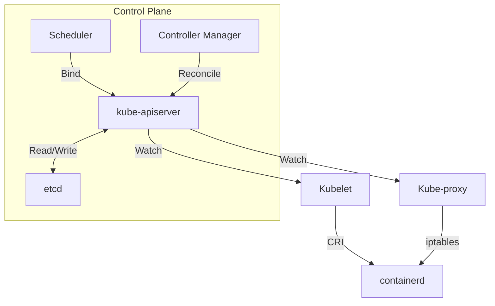
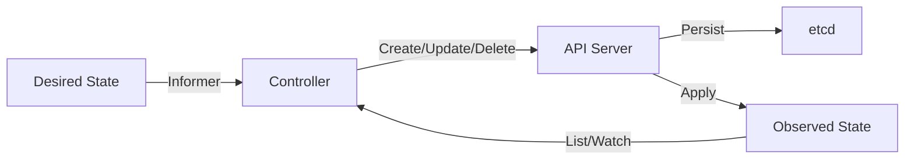
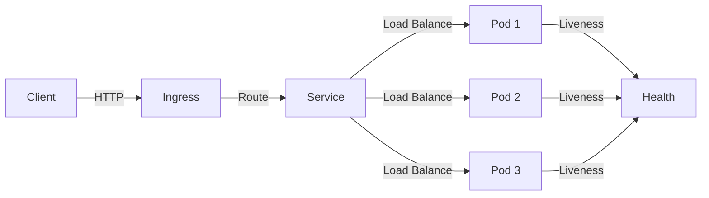

# ☸️ Kubernetes Architecture Deep Dive

## 🎯 Learning Objectives

- Map the Kubernetes control plane components and their interaction with etcd.
- Explain the reconciliation loop and its roots in control theory.
- Implement a simple controller using client-go informers and work queues.
- Design Kubernetes manifests for stateless ML inference services with health probes.

## Introduction

Machine learning workloads are inherently heterogeneous: training jobs may require hundreds of GPUs for days, while inference services must scale from zero to thousands of pods in seconds based on request volume. Kubernetes provides the declarative abstraction layer necessary to manage this heterogeneity. By describing desired state in YAML and letting the control plane converge reality to that state, ML engineers can focus on model architecture rather than server provisioning. This paradigm shift—from imperative infrastructure to declarative infrastructure—is what makes modern MLOps possible.

Go is the implementation language of Kubernetes for good reason. The API server handles thousands of concurrent watch connections, the scheduler performs combinatorial optimization over node resources, and the kubelet manages pod lifecycles on every worker. Each of these tasks maps naturally to Go's concurrency model: goroutines for I/O multiplexing, channels for event distribution, and static binaries for reliable deployment. For ML/AI engineers, writing custom controllers in Go—such as a training job operator or a model autoscaler—extends Kubernetes to fit domain-specific needs without forking the platform.

This note builds on [[01 - Docker Internals for Go Developers|container internals]] by showing how images become running pods, and it prepares you for [[03 - gRPC and Protocol Buffers|service communication]] by illustrating the networking abstractions that connect pods. Every concept here is foundational to operating ML platforms at scale.

## Module 1: Control Plane and Distributed Consensus

### 1.1 Theoretical Foundation 🧠

Kubernetes is a direct descendant of Google's internal cluster manager, Borg. Borg managed Google's workloads for over a decade, teaching engineers that a centralized control plane with a declarative API and a consistent datastore could tame massive fleet complexity. Omega, Borg's successor, introduced the idea of shared-state scheduling with optimistic concurrency. Kubernetes, open-sourced in 2014, generalized these lessons for the broader community while keeping the core architecture: a set of controllers that continuously reconcile desired state with observed state.

The control plane's single source of truth is etcd, a distributed key-value store that implements the Raft consensus algorithm. Raft ensures that all control plane nodes agree on cluster state even in the presence of network partitions. The CAP theorem tells us that etcd prioritizes consistency (CP) over availability during partitions, which is the correct trade-off for a cluster brain: a split-brain scheduler could place two pods on the same GPU, violating isolation guarantees. Understanding Raft is essential for debugging etcd performance and sizing clusters.

The API server is the gateway to etcd. Every read and write passes through its authentication, authorization, and admission control layers. This design applies the API gateway pattern at the cluster level, ensuring that policy is enforced centrally. The scheduler and controller manager are themselves clients of the API server, not direct etcd peers. This indirection allows the API server to version resources, validate schemas, and emit audit logs—capabilities that are critical for regulated ML workloads handling personally identifiable information.

### 1.2 Mental Model 📐

```
┌─────────────────────────────────────────┐
│           Kubernetes Cluster            │
│  ┌─────────────────────────────────┐    │
│  │        Control Plane            │    │
│  │  ┌─────────┐  ┌─────────────┐  │    │
│  │  │  API    │  │   etcd      │  │    │
│  │  │ Server  │◄─┤  (Raft)     │  │    │
│  │  └───┬─────┘  └─────────────┘  │    │
│  │      │  ▲                       │    │
│  │  ┌───┴──┴───┐  ┌─────────────┐ │    │
│  │  │Scheduler │  │Controller   │ │    │
│  │  │          │  │Manager      │ │    │
│  │  └──────────┘  └─────────────┘ │    │
│  └──────────┬─────────────────────┘    │
│             │ Watch / List              │
│  ┌──────────┴─────────────────────┐    │
│  │         Data Plane              │    │
│  │  ┌─────────┐  ┌─────────────┐  │    │
│  │  │ Kubelet │  │ Kube-proxy  │  │    │
│  │  │ (nodes) │  │ (net rules) │  │    │
│  │  └────┬────┘  └──────┬──────┘  │    │
│  │       │              │          │    │
│  │  ┌────┴──────────────┴─────┐   │    │
│  │  │    Container Runtime    │   │    │
│  │  │    (containerd / CRI)   │   │    │
│  │  └─────────────────────────┘   │    │
│  └────────────────────────────────┘    │
└────────────────────────────────────────┘
```

### 1.3 Syntax and Semantics 📝

```go
package main

import (
	"context"
	"fmt"
	"path/filepath"

	metav1 "k8s.io/apimachinery/pkg/apis/meta/v1"
	"k8s.io/client-go/kubernetes"
	"k8s.io/client-go/tools/clientcmd"
	"k8s.io/client-go/util/homedir"
)

// main lists Pods across all namespaces.
// WHY: Programmatic inspection of workloads is the first step
// in building controllers that autoscale ML inference services.
func main() {
	home := homedir.HomeDir()
	_ = home
	kubeconfig := filepath.Join(homedir.HomeDir(), ".kube", "config")
	_ = kubeconfig

	// WHY: NewNonInteractiveDeferredLoadingClientConfig
	// gracefully falls back to in-cluster config when running inside a Pod.
	config, err := clientcmd.NewNonInteractiveDeferredLoadingClientConfig(
		clientcmd.NewDefaultClientConfigLoadingRules(),
		&clientcmd.ConfigOverrides{},
	).ClientConfig()
	if err != nil {
		panic(err)
	}

	clientset, err := kubernetes.NewForConfig(config)
	if err != nil {
		panic(err)
	}

	// WHY: A context with deadline prevents hanging API calls
	// when the control plane is under heavy load.
	ctx := context.Background()
	pods, err := clientset.CoreV1().Pods("").List(ctx, metav1.ListOptions{})
	if err != nil {
		panic(err)
	}

	for _, p := range pods.Items {
		fmt.Printf("Pod: %s/%s\n", p.Namespace, p.Name)
	}
}
```

### 1.4 Visual Representation 🖼️




### 1.5 Application in ML/AI Systems 🤖

| Case Study | Technology | ML/AI Benefit |
|---|---|---|
| Kubeflow Training Operator | Kubernetes CRDs | Orchestrates TFJob and PyTorchJob on GPU nodes |
| NVIDIA GPU Operator | DaemonSet + Device Plugin | Automates GPU driver and device plugin deployment |
| MLflow Model Serving | Kubernetes Deployments | Scales model servers with HPA based on request QPS |

### 1.6 Common Pitfalls ⚠️

- **Warning:** Directly modifying etcd outside the API Server can corrupt cluster state and cause catastrophic failures.
- **Warning:** Granting cluster-admin to every service account violates the principle of least privilege and exposes model artifacts.
- **Tip:** Use kubectl get --watch or informers instead of polling the API Server to avoid rate limiting.

### 1.7 Knowledge Check ❓

1. Why does etcd prioritize consistency over availability during network partitions?
2. What is the architectural purpose of forcing all control plane components through the API Server?
3. How does the API gateway pattern in Kubernetes enforce policy for regulated ML workloads?

## Module 2: Reconciliation and Control Loops

### 2.1 Theoretical Foundation 🧠

The reconciliation loop is Kubernetes's beating heart, and its theoretical lineage stretches back to control theory and cybernetics. In 1948, Norbert Wiener defined cybernetics as the study of systems that regulate themselves through feedback. A thermostat is the canonical example: it measures room temperature, compares it to a setpoint, and turns the heater on or off. Kubernetes controllers operate identically, but their setpoint is a YAML manifest and their actuator is the API server.

Distributed systems introduce two complications: asynchrony and partial failure. Because the cluster state is always slightly stale, controllers must be level-triggered rather than edge-triggered. An edge-triggered system reacts to state transitions; a level-triggered system reacts to the current state, regardless of how it got there. This distinction is critical because events can be lost during network partitions or API server restarts. A level-triggered controller simply re-reads the desired state and re-evaluates, making it naturally resilient.

Idempotency is the mathematical guarantee that applying the same operation multiple times produces the same result. In a reconciliation loop, idempotency means that if a controller crashes and restarts, it can safely re-create resources without side effects. This property is enforced by generating deterministic object names (e.g., using the parent resource's UID) and by using server-side apply for conflict resolution. For ML/AI operators that manage training jobs, idempotency prevents duplicate GPU allocations and data corruption.

### 2.2 Mental Model 📐

```
┌─────────────────────────────────────────┐
│         Desired State (etcd)            │
│  replicas: 3                            │
│  image: ml-inference:v2                 │
└─────────────────┬───────────────────────┘
                  │ Watch / List
                  ▼
┌─────────────────────────────────────────┐
│         Controller Loop                 │
│  ┌─────────┐  ┌─────────┐  ┌────────┐ │
│  │  Read   │  │ Compare │  │ Act    │ │
│  │  State  │──▶│ Delta  │──▶│ Create │ │
│  │         │  │         │  │ Update │ │
│  │         │  │         │  │ Delete │ │
│  └────┬────┘  └─────────┘  └───┬────┘ │
│       │                         │       │
│       └──────────┬──────────────┘       │
│                  │ Requeue               │
│                  ▼                      │
│  ┌─────────────────────────────────┐   │
│  │ Wait and Repeat (resync period) │   │
│  └─────────────────────────────────┘   │
└─────────────────────────────────────────┘
                  │
                  ▼
┌─────────────────────────────────────────┐
│         Observed State (Cluster)        │
│  2 Pods running, 1 Pending              │
└─────────────────────────────────────────┘
```

### 2.3 Syntax and Semantics 📝

```go
package main

import (
	"fmt"
	"time"
)

// Resource represents a desired Kubernetes object.
type Resource struct {
	Name     string
	Replicas int
}

// Controller reconciles desired state with observed state.
// WHY: This pattern mirrors the actual Kubernetes controller
// architecture and teaches idempotent reconciliation.
func Controller(desired <-chan Resource, observed map[string]int) {
	for d := range desired {
		current := observed[d.Name]
		delta := d.Replicas - current
		// WHY: Acting only on the delta avoids unnecessary API calls
		// and prevents thundering herds during resync.
		if delta > 0 {
			fmt.Printf("Creating %d replicas for %s\n", delta, d.Name)
			observed[d.Name] = d.Replicas
		} else if delta < 0 {
			fmt.Printf("Deleting %d replicas for %s\n", -delta, d.Name)
			observed[d.Name] = d.Replicas
		} else {
			fmt.Printf("No drift for %s\n", d.Name)
		}
	}
}

func main() {
	desired := make(chan Resource, 3)
	observed := make(map[string]int)

	// WHY: A goroutine runs the controller concurrently,
	// just like the kube-controller-manager runs multiple loops.
	go Controller(desired, observed)

	desired <- Resource{Name: "ml-api", Replicas: 3}
	time.Sleep(100 * time.Millisecond)
	desired <- Resource{Name: "ml-api", Replicas: 3} // idempotent
	time.Sleep(100 * time.Millisecond)
	desired <- Resource{Name: "ml-api", Replicas: 5}
	close(desired)
	time.Sleep(100 * time.Millisecond)
}
```

### 2.4 Visual Representation 🖼️




### 2.5 Application in ML/AI Systems 🤖

| Case Study | Technology | ML/AI Benefit |
|---|---|---|
| Kubeflow TFJob Controller | Reconciliation loop | Ensures exactly the requested number of training workers |
| Argo Workflows | Kubernetes CRD + Controller | Manages DAG-based ML pipelines with retries |
| KEDA (Kubernetes Event-driven Autoscaling) | External metrics scaler | Scales inference pods based on queue depth or latency |

### 2.6 Common Pitfalls ⚠️

- **Warning:** Non-idempotent controllers create resource leaks or duplicate pods when they restart mid-reconciliation.
- **Warning:** Ignoring owner references prevents garbage collection, leaving orphaned ConfigMaps and Secrets after a training job is deleted.
- **Tip:** Always set a resync period on informers to catch missed events, but keep it long (10+ minutes) to avoid API server load.

### 2.7 Knowledge Check ❓

1. Why is level-triggered logic more resilient than edge-triggered logic in distributed systems?
2. How does idempotency prevent duplicate GPU allocations in an ML training operator?
3. What is the purpose of a resync period in a Kubernetes informer?

## Module 3: Workloads, Networking, and Scheduling

### 3.1 Theoretical Foundation 🧠

A Pod is the atomic unit of deployment in Kubernetes, encapsulating one or more containers that share network and storage namespaces. The design is rooted in the composite pattern: a Pod is a logical host, and containers are its cooperating processes. For ML/AI inference, this pattern allows a sidecar container to handle logging or metrics while the main container serves the model. For training, an init container can download datasets before the training process begins.

Deployments manage ReplicaSets, which in turn manage Pods. This three-level hierarchy decouples the desired replica count from the actual pod instances, enabling rolling updates and rollback. The Deployment controller uses a rolling update strategy that ensures availability by creating new pods before terminating old ones. Mathematically, this is a constrained optimization: maximize rollout speed subject to a minimum availability threshold.

Services provide stable network identity to ephemeral pods. Because pods are recreated during updates or failures, their IP addresses change. A Service allocates a virtual ClusterIP and maintains an Endpoints object that tracks the current pod IPs. kube-proxy implements this abstraction using iptables or IPVS rules. For ML/AI services that must handle bursty inference traffic, this abstraction enables horizontal pod autoscaling without client reconfiguration.

### 3.2 Mental Model 📐

```
┌─────────────────────────────────────────┐
│           Service (ClusterIP)           │
│        10.96.0.1:80 -> 8080             │
└─────────────────┬───────────────────────┘
                  │ kube-proxy (iptables)
                  ▼
┌─────────────────────────────────────────┐
│           Endpoints                     │
│  10.244.1.5:8080  10.244.1.6:8080     │
│  10.244.2.3:8080                        │
└─────────────────┬───────────────────────┘
                  │
    ┌─────────────┼─────────────┐
    ▼             ▼             ▼
┌────────┐   ┌────────┐   ┌────────┐
│ Pod A  │   │ Pod B  │   │ Pod C  │
│:8080   │   │:8080   │   │:8080   │
└────────┘   └────────┘   └────────┘
```

### 3.3 Syntax and Semantics 📝

```go
package main

import (
	"context"
	"fmt"

	appsv1 "k8s.io/api/apps/v1"
	corev1 "k8s.io/api/core/v1"
	metav1 "k8s.io/apimachinery/pkg/apis/meta/v1"
	"k8s.io/apimachinery/pkg/util/intstr"
	"k8s.io/client-go/kubernetes"
	"k8s.io/client-go/tools/clientcmd"
)

// createDeployment builds a minimal Deployment for an ML inference API.
// WHY: Defining objects in Go allows dynamic generation of manifests
// based on runtime configuration (e.g., model version, GPU count).
func createDeployment(clientset *kubernetes.Clientset, name, image string, replicas int32) error {
	deployment := &appsv1.Deployment{
		ObjectMeta: metav1.ObjectMeta{
			Name:   name,
			Labels: map[string]string{"app": name},
		},
		Spec: appsv1.DeploymentSpec{
			Replicas: &replicas,
			Selector: &metav1.LabelSelector{
				MatchLabels: map[string]string{"app": name},
			},
			Template: corev1.PodTemplateSpec{
				ObjectMeta: metav1.ObjectMeta{
					Labels: map[string]string{"app": name},
				},
				Spec: corev1.PodSpec{
					Containers: []corev1.Container{{
						Name:  "api",
						Image: image,
						Ports: []corev1.ContainerPort{{
							ContainerPort: 8080,
						}},
						LivenessProbe: &corev1.Probe{
							// WHY: Liveness probes enable automatic restart
							// of stuck inference processes without human intervention.
							ProbeHandler: corev1.ProbeHandler{
								HTTPGet: &corev1.HTTPGetAction{
									Path: "/health",
									Port: intstr.FromInt(8080),
								},
							},
						},
					}},
				},
			},
		},
	}
	_, err := clientset.AppsV1().Deployments("default").Create(context.Background(), deployment, metav1.CreateOptions{})
	return err
}

func main() {
	// WHY: In-cluster config is used when this code runs as a Pod,
	// enabling self-hosted controllers.
	config, err := clientcmd.NewNonInteractiveDeferredLoadingClientConfig(
		clientcmd.NewDefaultClientConfigLoadingRules(),
		&clientcmd.ConfigOverrides{},
	).ClientConfig()
	if err != nil {
		panic(err)
	}
	clientset, err := kubernetes.NewForConfig(config)
	if err != nil {
		panic(err)
	}
	if err := createDeployment(clientset, "ml-api", "ml-inference:v2", 3); err != nil {
		panic(err)
	}
	fmt.Println("Deployment created")
}
```

### 3.4 Visual Representation 🖼️




### 3.5 Application in ML/AI Systems 🤖

| Case Study | Technology | ML/AI Benefit |
|---|---|---|
| Horovod on Kubernetes | MPIJob + Pods | Distributed training across multiple GPU nodes |
| TensorFlow Serving + HPA | Deployment + Service | Autoscales inference based on CPU/GPU utilization |
| NVIDIA Triton | Kubernetes + Device Plugin | Batched inference with GPU memory isolation |

### 3.6 Common Pitfalls ⚠️

- **Warning:** Setting resources.limits lower than resources.requests causes scheduling confusion and can lead to out-of-memory kills during training spikes.
- **Warning:** Using latest image tags in Deployments breaks rollbacks because Kubernetes cannot distinguish between two versions labeled latest.
- **Tip:** Always define readiness probes for inference services so that traffic is not routed to pods still loading a model into GPU memory.

### 3.7 Knowledge Check ❓

1. Why does Kubernetes use a three-level hierarchy (Deployment -> ReplicaSet -> Pod) instead of managing pods directly?
2. How does kube-proxy implement stable virtual IPs for ephemeral pods?
3. What is the scheduling implication of setting resources.requests without resources.limits?

## 📦 Compression Code

```go
package main

import (
	"bytes"
	"fmt"
	"os"
	"regexp"
	"strings"
)

// ManifestCompressor minifies YAML Kubernetes manifests.
// WHY: Smaller manifests reduce etcd storage pressure and
// speed up kubectl apply in large ML platform deployments.
func main() {
	if len(os.Args) < 2 {
		fmt.Println("Usage: kcompress <manifest.yaml>")
		os.Exit(1)
	}
	data, err := os.ReadFile(os.Args[1])
	if err != nil {
		panic(err)
	}

	commentRe := regexp.MustCompile(`(?m)#.*$`)
	cleaned := commentRe.ReplaceAll(data, []byte{})

	var buf bytes.Buffer
	prevEmpty := false
	for _, line := range strings.Split(string(cleaned), "\n") {
		trimmed := strings.TrimSpace(line)
		isEmpty := trimmed == ""
		if isEmpty && prevEmpty {
			continue
		}
		prevEmpty = isEmpty
		buf.WriteString(line + "\n")
	}

	outPath := os.Args[1] + ".min"
	if err := os.WriteFile(outPath, buf.Bytes(), 0644); err != nil {
		panic(err)
	}

	originalSize := len(data)
	compressedSize := buf.Len()
	ratio := float64(compressedSize) / float64(originalSize) * 100
	fmt.Printf("Compressed %s -> %s (%.1f%% of original)\n", os.Args[1], outPath, ratio)
}
```

## 🎯 Documented Project

### Description

Develop **KubeGo**, a custom Kubernetes controller written in Go that watches a custom resource called GoApp. When a GoApp resource is created, the controller automatically deploys a Deployment and Service with configurable replicas and image version.

### Functional Requirements

1. Define a CRD GoApp with fields: image, replicas, and port.
2. Implement a controller using client-go informers and work queues.
3. Automatically create a Deployment and Service when a GoApp is applied.
4. Update resources when the GoApp spec changes (reconciliation).
5. Clean up owned resources when a GoApp is deleted (garbage collection).

### Components

- cmd/controller/main.go — Controller entry point and leader election
- pkg/apis/goapp/ — CRD Go types and code generation
- pkg/controller/ — Reconciliation loop and event handlers
- manifests/ — CRD YAML and sample GoApp resources
- go.mod — Dependency management including client-go

### Metrics

- Controller successfully creates Deployment and Service within 5 seconds of applying a GoApp
- Changing replicas in GoApp scales the Deployment within 10 seconds
- Deleting GoApp removes all associated resources
- Controller handles API server restarts gracefully using informer resync
- Unit tests cover >70% of controller logic

### References

- [Kubernetes Controller Pattern](https://kubernetes.io/docs/concepts/architecture/controller/)
- [client-go Documentation](https://github.com/kubernetes/client-go)
- [Custom Resource Definitions](https://kubernetes.io/docs/concepts/extend-kubernetes/api-extension/custom-resources/)
- [[01 - Docker Internals for Go Developers|🐳 01 - Docker]]
- [[03 - gRPC and Protocol Buffers|🔗 03 - gRPC]]
