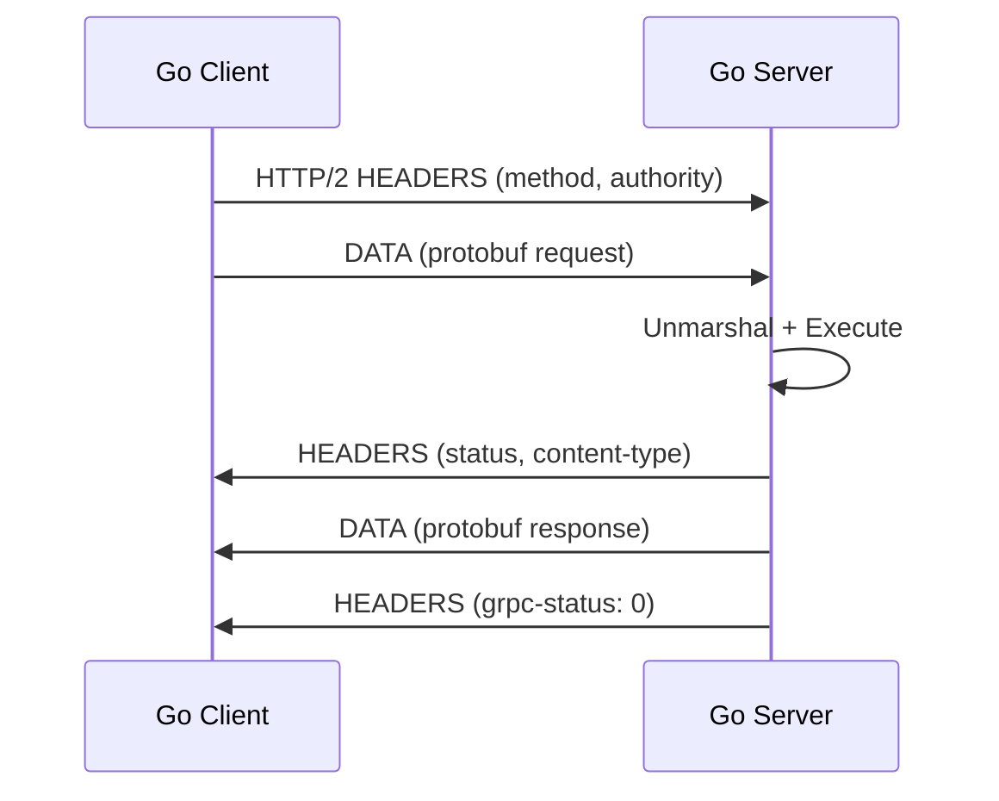
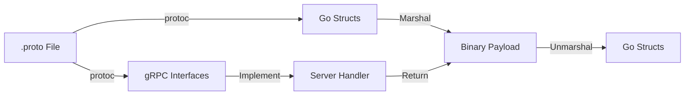
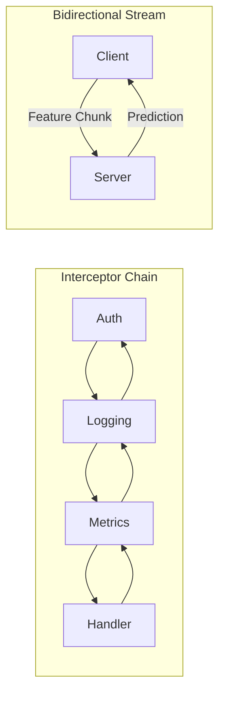

# 🔗 gRPC and Protocol Buffers

## 🎯 Learning Objectives

- Contrast RPC with REST and explain why HTTP/2 enables lower latency.
- Design protobuf schemas that evolve without breaking existing consumers.
- Implement unary, server-streaming, and bidirectional gRPC services in Go.
- Apply interceptors for authentication, logging, and metrics in ML inference APIs.

## Introduction

Modern ML/AI systems are distributed by necessity. A single prediction may traverse a feature store, an embedding service, a model server, and a post-processing pipeline before reaching the user. Each hop incurs serialization, network transfer, and deserialization costs. When payloads contain dense tensors or large sparse feature vectors, JSON's verbosity and HTTP/1.1's connection overhead become prohibitive. gRPC addresses both problems: Protocol Buffers provide a compact binary serialization format, and HTTP/2 enables multiplexed, persistent connections with flow control. For latency-sensitive inference workloads, these properties translate directly into lower P99 response times and higher throughput.

Go's type system and fast compile times make it an ideal host for gRPC services. The protoc compiler generates strongly typed Go structs and interfaces from .proto definitions, catching schema mismatches at compile time rather than runtime. This static safety is invaluable in MLOps, where a mismatch between a feature store's output schema and a model's input schema can silently degrade prediction quality. Furthermore, Go's concurrency model maps naturally to gRPC's streaming semantics: each stream is handled by a goroutine, and backpressure is managed through HTTP/2 flow control windows.

This note complements [[01 - Docker Internals for Go Developers|container packaging]] and [[02 - Kubernetes Architecture Deep Dive|orchestration]] by addressing service-to-service communication. No matter how efficiently your containers are built or how intelligently your pods are scheduled, poor RPC design will bottleneck your platform. Mastering gRPC is therefore the final leg of the cloud-native performance tripod.

## Module 1: RPC and HTTP/2 Transport

### 1.1 Theoretical Foundation 🧠

Remote Procedure Call (RPC) is one of the oldest abstractions in distributed computing. Sun RPC, developed in the 1980s, allowed networked computers to execute procedures as if they were local. DCE/RPC and CORBA followed in the 1990s, adding interface definition languages (IDLs) and object-oriented features. However, these early systems suffered from complexity, vendor lock-in, and poor interoperability. The rise of REST in the 2000s provided a simpler, HTTP-based alternative, but at the cost of efficiency: text-based JSON payloads and per-request TCP connections limited throughput.

HTTP/2, standardized in 2015, redefined the transport layer. It introduces binary framing, where messages are split into small, typed frames that can be interleaved on a single TCP connection. Multiplexing eliminates head-of-line blocking: if one stream is blocked waiting for a slow handler, other streams continue. Header compression via HPACK reduces redundant metadata, which is especially valuable for repeated RPC calls with identical authentication headers. Flow control operates at both the connection and stream levels, preventing fast senders from overwhelming slow receivers.

gRPC leverages HTTP/2 as its transport and Protocol Buffers as its serialization format. The theoretical consequence is that gRPC achieves lower latency than REST for equivalent payloads. Binary serialization reduces payload size; multiplexing reduces connection overhead; and strong typing eliminates JSON parsing. The end-to-end latency can be modeled as:

```
Latency = Serialization + Network + Deserialization
```

gRPC minimizes all three terms, making it the protocol of choice for internal microservices in ML/AI platforms.

### 1.2 Mental Model 📐

```
┌─────────────────────────────────────────┐
│            Application Layer             │
│  ┌─────────────────────────────────┐   │
│  │         gRPC Service             │   │
│  │  ┌─────────┐  ┌─────────────┐  │   │
│  │  │ Method  │  │   Message   │  │   │
│  │  │ Handler │  │   (protobuf)│  │   │
│  │  └────┬────┘  └──────┬──────┘  │   │
│  └───────┼──────────────┼─────────┘   │
└──────────┼──────────────┼─────────────┘
           │ gRPC frame    │ protobuf
           ▼               ▼
┌─────────────────────────────────────────┐
│         HTTP/2 Transport Layer          │
│  ┌─────────┐  ┌─────────┐  ┌────────┐ │
│  │  Stream │  │  Frame  │  │  Flow  │ │
│  │   ID    │  │ (binary)│  │ Control│ │
│  └────┬────┘  └────┬────┘  └───┬────┘ │
│       └────────────┴───────────┘       │
│              Single TCP Connection      │
└─────────────────────────────────────────┘
           ▼
┌─────────────────────────────────────────┐
│            TLS + TCP Layer              │
│  ┌─────────┐  ┌─────────────────────┐ │
│  │   ALPN  │  │   Congestion Ctrl   │ │
│  │ h2      │  │   (Cubic / BBR)     │ │
│  └─────────┘  └─────────────────────┘ │
└─────────────────────────────────────────┘
```

### 1.3 Syntax and Semantics 📝

```go
package main

import (
	"context"
	"fmt"
	"log"
	"net"

	pb "github.com/example/kvstore/proto"
	"google.golang.org/grpc"
)

// server implements the generated gRPC interface.
// WHY: Embedding UnimplementedKVStoreServer ensures forward
// compatibility when new methods are added to the .proto file.
type server struct {
	pb.UnimplementedKVStoreServer
	store map[string]string
}

func (s *server) Get(ctx context.Context, req *pb.GetRequest) (*pb.GetResponse, error) {
	// WHY: Context carries deadlines and cancellation signals,
	// preventing stalled requests from occupying goroutines.
	val, ok := s.store[req.Key]
	return &pb.GetResponse{Key: req.Key, Value: val, Found: ok}, nil
}

func main() {
	lis, err := net.Listen("tcp", ":50051")
	if err != nil {
		log.Fatalf("failed to listen: %v", err)
	}
	s := grpc.NewServer(
		// WHY: Unary interceptors wrap every RPC call, enabling
		// cross-cutting concerns without polluting business logic.
		grpc.UnaryInterceptor(loggingInterceptor),
	)
	pb.RegisterKVStoreServer(s, &server{store: make(map[string]string)})
	fmt.Println("gRPC server listening on :50051")
	if err := s.Serve(lis); err != nil {
		log.Fatalf("failed to serve: %v", err)
	}
}

func loggingInterceptor(ctx context.Context, req interface{}, info *grpc.UnaryServerInfo, handler grpc.UnaryHandler) (interface{}, error) {
	fmt.Printf("[gRPC] %s\n", info.FullMethod)
	return handler(ctx, req)
}
```

### 1.4 Visual Representation 🖼️




### 1.5 Application in ML/AI Systems 🤖

| Case Study | Technology | ML/AI Benefit |
|---|---|---|
| TensorFlow Serving | gRPC + protobuf | High-throughput model inference with batched requests |
| Feast Feature Store | gRPC | Low-latency feature retrieval for online predictions |
| Ray Serve | gRPC + HTTP/2 | Composable model serving with streaming responses |

### 1.6 Common Pitfalls ⚠️

- **Warning:** If your load balancer does not support HTTP/2 (e.g., older Nginx without grpc_pass), gRPC connections will fail or downgrade unpredictably.
- **Warning:** Ignoring gRPC deadlines can cause cascading retries that overload model servers during traffic spikes.
- **Tip:** Use grpc_health_v1 health checks instead of generic TCP checks to validate actual RPC responsiveness.

### 1.7 Knowledge Check ❓

1. How does HTTP/2 multiplexing eliminate head-of-line blocking compared to HTTP/1.1?
2. Why is binary framing more efficient than text-based headers for repeated RPC calls?
3. In the latency model, which term does Protocol Buffers primarily reduce?

## Module 2: Protocol Buffers and Schema Evolution

### 2.1 Theoretical Foundation 🧠

Protocol Buffers are an Interface Definition Language (IDL) and binary serialization format developed by Google in 2001. The theoretical problem they solve is schema evolution in distributed systems: how can producers and consumers agree on a message format without tightly coupling their release cycles? Protobuf addresses this through numbered fields and a wire format that ignores unknown fields. When a receiver encounters a field tag it does not recognize, it simply skips the bytes, preserving forward compatibility.

The wire format is remarkably compact. Each field is encoded as a tag (field number + wire type) followed by a value. Varint encoding represents integers using variable-length bytes, so small values occupy less space than large ones. ZigZag encoding maps signed integers to unsigned integers, ensuring that negative numbers also compress well. This contrasts sharply with JSON, where every field name is repeated as a string in every message, and numbers are represented in ASCII. The space savings are typically 3–10x, which matters when transmitting large feature tensors.

Backward compatibility is guaranteed if you only add new fields with previously unused tags and never change the wire type of existing fields. Deleting a field is safe if you reserve its tag number to prevent accidental reuse. These rules form a simple algebra of schema change. In ML/AI systems where model versions evolve rapidly, this algebra prevents deployment outages caused by training pipelines producing features that inference services cannot parse.

### 2.2 Mental Model 📐

```
┌─────────────────────────────────────────┐
│           .proto IDL File               │
│  message FeatureVector {                │
│    int32 user_id = 1;                   │
│    repeated float values = 2;           │
│  }                                      │
└─────────────────┬───────────────────────┘
                  │ protoc
                  ▼
┌─────────────────────────────────────────┐
│         Generated Go Code               │
│  type FeatureVector struct {            │
│    UserId  int32    `protobuf:"..."`   │
│    Values  []float32 `protobuf:"..."`   │
│  }                                      │
└─────────────────┬───────────────────────┘
                  │ proto.Marshal
                  ▼
┌─────────────────────────────────────────┐
│         Binary Wire Format              │
│  [tag+wiretype] [varint length] [data] │
│  0x08 0x01 0x12 0x08 ...              │
└─────────────────────────────────────────┘
```

### 2.3 Syntax and Semantics 📝

```go
package main

import (
	"fmt"

	"google.golang.org/protobuf/proto"
	pb "github.com/example/kvstore/proto"
)

func main() {
	// WHY: Constructing a protobuf message in Go uses generated
	// structs that enforce type safety at compile time.
	msg := &pb.GetRequest{Key: "user_42"}

	// WHY: Marshal produces a compact byte slice suitable for
	// network transfer or storage in a feature cache.
	out, err := proto.Marshal(msg)
	if err != nil {
		panic(err)
	}
	fmt.Printf("Serialized size: %d bytes\n", len(out))

	// WHY: Unmarshal reconstructs the message without reflection,
	// achieving faster deserialization than JSON for equivalent data.
	var decoded pb.GetRequest
	if err := proto.Unmarshal(out, &decoded); err != nil {
		panic(err)
	}
	fmt.Printf("Key: %s\n", decoded.Key)
}
```

### 2.4 Visual Representation 🖼️




### 2.5 Application in ML/AI Systems 🤖

| Case Study | Technology | ML/AI Benefit |
|---|---|---|
| TensorFlow SavedModel | Protobuf schemas | Versioned model graphs with backward-compatible metadata |
| MLflow Tracking | Protobuf + REST | Efficient logging of metrics and parameters |
| ONNX Model Format | Protobuf definitions | Cross-framework model exchange with compact serialization |

### 2.6 Common Pitfalls ⚠️

- **Warning:** Reusing a deleted field number without reserving it causes silent corruption when old and new binaries interact.
- **Warning:** Changing a field's wire type (e.g., int32 to string) breaks binary compatibility even if the tag stays the same.
- **Tip:** Always use reserved for removed fields and document schema changes in a changelog for MLOps traceability.

### 2.7 Knowledge Check ❓

1. How does the protobuf wire format achieve forward compatibility when encountering unknown fields?
2. Why does varint encoding favor small integers, and how does this benefit ML feature vectors?
3. What is the consequence of changing a field's wire type without updating all consumers simultaneously?

## Module 3: Streaming, Interceptors, and Resilience

### 3.1 Theoretical Foundation 🧠

gRPC defines four communication patterns: unary (1 request, 1 response), server streaming (1 request, N responses), client streaming (N requests, 1 response), and bidirectional streaming (N requests, N responses). Streaming is not merely a convenience; it is a flow-control mechanism. By breaking large payloads into a sequence of messages, streams allow receivers to apply backpressure through HTTP/2 flow control windows. This is critical for ML/AI systems that stream large batches of embeddings or log records.

Interceptors implement the chain-of-responsibility pattern. A unary interceptor wraps the handler, allowing pre-processing (authentication, logging) and post-processing (metrics, error translation). Stream interceptors operate on the stream interface, enabling per-message transformation. This pattern decouples cross-cutting concerns from business logic, following the open/closed principle: the core handler is closed for modification but open for extension through interceptor chains.

Resilience patterns—retries, deadlines, and circuit breakers—are essential in distributed ML platforms. A model server may become temporarily overloaded during a training checkpoint. Without circuit breaking, retry storms from dependent services can amplify the failure into a platform-wide outage. Deadline propagation ensures that if a top-level request has 100 ms remaining, downstream services know not to start work that cannot complete in time. These patterns transform an unreliable network into a statistically predictable system.

### 3.2 Mental Model 📐

```
┌─────────────────────────────────────────┐
│         gRPC Server Startup             │
│  grpc.NewServer(                        │
│    grpc.UnaryInterceptor(               │
│      chain(                             │
│        recoveryInterceptor,             │
│        authInterceptor,                 │
│        loggingInterceptor,              │
│        metricsInterceptor,              │
│      )                                  │
│    )                                    │
│  )                                      │
└─────────────────────────────────────────┘
                  │
                  ▼
┌─────────────────────────────────────────┐
│         Incoming Unary RPC              │
│  1. recoveryInterceptor: defer/recover │
│  2. authInterceptor: validate JWT      │
│  3. loggingInterceptor: log request    │
│  4. metricsInterceptor: record latency │
│  5. handler: business logic            │
│  6. metricsInterceptor: record status  │
│  7. loggingInterceptor: log response   │
│  8. authInterceptor: enrich context    │
│  9. recoveryInterceptor: return error  │
└─────────────────────────────────────────┘
```

### 3.3 Syntax and Semantics 📝

```go
package main

import (
	"context"
	"fmt"
	"io"
	"time"

	"google.golang.org/grpc"
	"google.golang.org/grpc/codes"
	"google.golang.org/grpc/metadata"
	"google.golang.org/grpc/status"
)

type PredictRequest struct{ Features []float32 }
type PredictResponse struct{ Score float32 }

// mlServer implements a model serving interface.
type mlServer struct{}

// authInterceptor validates tokens before handlers run.
func authInterceptor(ctx context.Context, req interface{}, info *grpc.UnaryServerInfo, handler grpc.UnaryHandler) (interface{}, error) {
	md, ok := metadata.FromIncomingContext(ctx)
	if !ok {
		return nil, status.Errorf(codes.Unauthenticated, "missing metadata")
	}
	tokens := md.Get("authorization")
	if len(tokens) == 0 || tokens[0] != "Bearer valid-token" {
		return nil, status.Errorf(codes.Unauthenticated, "invalid token")
	}
	return handler(ctx, req)
}

// metricsInterceptor records latency per method.
func metricsInterceptor(ctx context.Context, req interface{}, info *grpc.UnaryServerInfo, handler grpc.UnaryHandler) (interface{}, error) {
	start := time.Now()
	resp, err := handler(ctx, req)
	fmt.Printf("Method=%s Duration=%s Error=%v\n", info.FullMethod, time.Since(start), err)
	return resp, err
}

// PredictStream demonstrates bidirectional streaming.
// WHY: Chunked transfer keeps memory bounded for large tensors.
func (s *mlServer) PredictStream(stream grpc.ServerStream) error {
	for {
		var req PredictRequest
		if err := stream.RecvMsg(&req); err == io.EOF {
			return nil
		} else if err != nil {
			return err
		}
		// WHY: Processing one message at a time keeps GPU memory
		// usage bounded during high-throughput inference.
		resp := PredictResponse{Score: 0.99}
		if err := stream.SendMsg(&resp); err != nil {
			return err
		}
	}
}
```

### 3.4 Visual Representation 🖼️




### 3.5 Application in ML/AI Systems 🤖

| Case Study | Technology | ML/AI Benefit |
|---|---|---|
| Real-time Fraud Detection | Bidirectional gRPC | Streams transactions and returns scores with sub-100ms latency |
| Distributed Training (Parameter Server) | Client + Server Streaming | Exchanges gradients between workers and parameter servers |
| Online Learning Pipelines | gRPC + Interceptors | Authenticates and meters model update streams |

### 3.6 Common Pitfalls ⚠️

- **Warning:** Forgetting to handle io.EOF in streaming handlers causes goroutine leaks when clients disconnect gracefully.
- **Warning:** Applying blocking I/O inside an interceptor increases latency for every RPC method; use goroutines for external calls.
- **Tip:** Propagate context.Context deadlines through interceptor chains so that downstream model servers can cancel work early.

### 3.7 Knowledge Check ❓

1. How does HTTP/2 flow control enable backpressure in a bidirectional gRPC stream?
2. Why should cross-cutting concerns like auth and metrics live in interceptors rather than handlers?
3. What is the danger of performing blocking I/O inside a unary interceptor?

## 📦 Compression Code

```go
package main

import (
	"fmt"
	"os"
	"regexp"
	"strings"
)

// ProtoMinifier removes comments and extra whitespace from .proto files.
// WHY: Smaller .proto files reduce code generation time and
// improve readability when checking schemas into version control.
func main() {
	if len(os.Args) < 2 {
		fmt.Println("Usage: protomin <file.proto>")
		os.Exit(1)
	}
	data, err := os.ReadFile(os.Args[1])
	if err != nil {
		panic(err)
	}

	content := string(data)

	// WHY: Block comments can span lines and must be removed first
	// to avoid leaving partial comment markers.
	blockCommentRe := regexp.MustCompile(`(?s)/\*.*?\*/`)
	content = blockCommentRe.ReplaceAllString(content, "")

	lineCommentRe := regexp.MustCompile(`(?m)//.*$`)
	content = lineCommentRe.ReplaceAllString(content, "")

	// WHY: Collapsing blank lines keeps semantic grouping
	// without excessive vertical whitespace.
	content = regexp.MustCompile(`\n\s*\n`).ReplaceAllString(content, "\n")
	content = strings.TrimSpace(content) + "\n"

	outPath := os.Args[1] + ".min"
	if err := os.WriteFile(outPath, []byte(content), 0644); err != nil {
		panic(err)
	}

	original := len(data)
	compressed := len(content)
	ratio := float64(compressed) / float64(original) * 100
	fmt.Printf("Minified %s -> %s (%.1f%% of original, %d -> %d bytes)\n",
		os.Args[1], outPath, ratio, original, compressed)
}
```

## 🎯 Documented Project

### Description

Build **GRPCatalog**, a Go microservice exposing a gRPC API for a product catalog. The service supports unary CRUD operations for products and a bidirectional streaming endpoint for bulk inventory updates. Implement authentication via metadata interceptors and metrics collection via Prometheus.

### Functional Requirements

1. Define protobuf messages for Product, CreateProductRequest, GetProductRequest, and UpdateInventoryRequest.
2. Implement a gRPC server with unary methods: CreateProduct, GetProduct, ListProducts.
3. Implement a bidirectional streaming method SyncInventory for real-time inventory updates.
4. Add a unary interceptor that validates an authorization metadata token.
5. Instrument all RPC methods with Prometheus histograms for request duration.

### Components

- proto/catalog.proto — Protobuf service and message definitions
- cmd/server/main.go — gRPC server with interceptors
- cmd/client/main.go — CLI gRPC client for testing
- internal/store/ — In-memory product repository
- internal/interceptors/ — Auth and metrics middleware

### Metrics

- Unary RPC latency P99 is under 5 ms for local calls
- Bidirectional stream handles 1000 concurrent inventory messages per second
- Prometheus metrics expose grpc_request_duration_seconds per method
- Invalid auth tokens return codes.Unauthenticated within 1 ms
- protoc generates Go code successfully with no lint errors

### References

- [gRPC Official Documentation](https://grpc.io/docs/)
- [Protocol Buffers Language Guide](https://protobuf.dev/programming-guides/proto3/)
- [Go gRPC Middleware](https://github.com/grpc-ecosystem/go-grpc-middleware)
- [[01 - Docker Internals for Go Developers|🐳 01 - Docker]]
- [[02 - Kubernetes Architecture Deep Dive|☸️ 02 - Kubernetes]]
